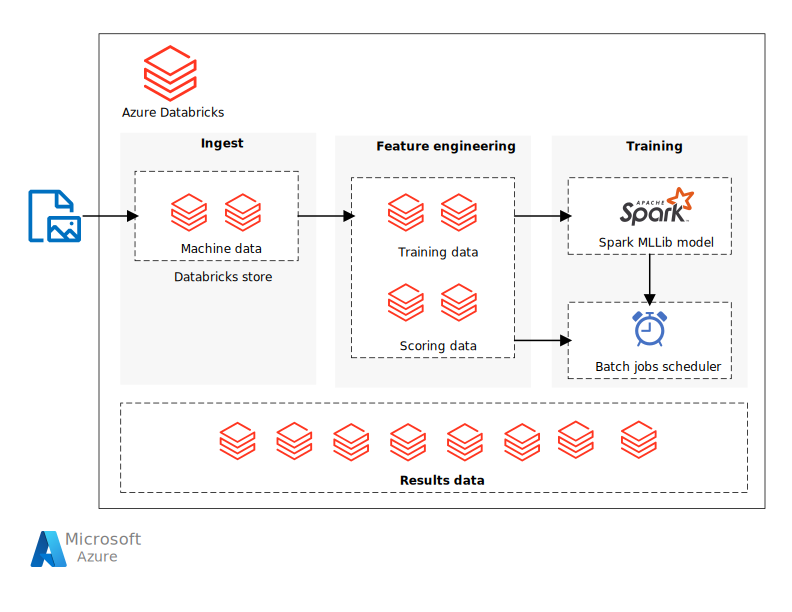

This reference architecture shows how to build a scalable solution for batch scoring an Apache Spark classification model on a schedule using [Azure Databricks][databricks]. Azure Databricks is an Apache Spark-based analytics platform optimized for Azure. Azure Databricks offers three environments for developing data intensive applications: Databricks SQL, Databricks Data Science & Engineering, and Databricks Machine Learning. Databricks Machine Learning is an integrated end-to-end machine learning environment incorporating managed services for experiment tracking, model training, feature development and management, and feature and model serving. You can use this reference architecture as a template that can be generalized to other scenarios.

*Apache® and Apache Spark® are either registered trademarks or trademarks of the Apache Software Foundation in the United States and/or other countries. No endorsement by The Apache Software Foundation is implied by the use of these marks.*

## Architecture

*Download a [Visio file](https://arch-center.azureedge.net/batch-scoring-spark-models-databricks.vsdx) of this architecture.*

### Workflow

The architecture defines a data flow that is entirely contained within [Azure Databricks][databricks] based on a set of sequentially executed notebooks. It consists of the following components:

**Data files**. The reference implementation uses a simulated data set contained in five static data files.

**Ingestion**. The data ingestion notebook downloads the input data files into a collection of Databricks data sets. In a real-world scenario, data from IoT devices would stream onto Databricks-accessible storage such as Azure SQL or Azure Blob storage. Databricks supports multiple [data sources][data-sources].

Recent enhancements in data ingestion include real-time data replication from various databases and SaaS applications, made possible by features such as [Lake House Federation](https://docs.databricks.com/query-federation/index.html).

**Training pipeline**. This notebook executes the feature engineering notebook to create an analysis data set from the ingested data. The pipeline then executes a model building notebook that trains the machine learning model using the [Apache Spark MLlib][mllib] scalable machine learning library.

Enhanced ML features in Databricks include experiment tracking and model training, further optimizing this pipeline.

**Scoring pipeline**. This notebook executes the feature engineering notebook to create scoring data set from the ingested data and executes the scoring notebook. The scoring notebook uses the trained [Spark MLlib][mllib-spark] model to generate predictions for the observations in the scoring data set. The predictions are stored in the results store, a new data set on the Databricks data store.

The scoring pipeline can use the  [`ai_query`](/azure/databricks/sql/language-manual/functions/ai_query) function for batch inference, processing large datasets efficiently with provisions for scalability and performance optimization.

**Scheduler**. A scheduled Databricks [job][job] handles batch scoring with the Spark model. The job executes the scoring pipeline notebook, passing variable arguments through notebook parameters to specify the details for constructing the scoring data set and where to store the results data set.

## Solution details

The scenario is constructed as a pipeline flow. Each notebook is optimized to perform in a batch setting for each of the operations: ingestion, feature engineering, model building, and model scorings. The feature engineering notebook is designed to generate a general data set for any of the training, calibration, testing, or scoring operations. In this scenario, we use a temporal split strategy for these operations, so the notebook parameters are used to set date-range filtering.

### Potential use cases

A business in an asset-heavy industry wants to minimize the costs and downtime associated with unexpected mechanical failures. Using IoT data collected from their machines, they can create a predictive maintenance model. This model enables the business to maintain components proactively and repair them before they fail. By maximizing mechanical component use, they can control costs and reduce downtime.

A predictive maintenance model collects data from the machines and retains historical examples of component failures. The model can then be used to monitor the current state of the components and predict if a given component will fail soon.

This reference architecture is designed for workloads that are triggered by the presence of new data from the component machines. Processing involves the following steps:

1. Ingest the data from the external data store onto an Azure Databricks data store.

1. Train a machine learning model by transforming the data into a training data set, then building a Spark MLlib model. MLlib consists of most common machine learning algorithms and utilities optimized to take advantage of Spark data scalability capabilities.

1. Apply the trained model to predict (classify) component failures by transforming the data into a scoring data set. Score the data with the Spark MLLib model.

1. Store results on the Databricks data store for post-processing consumption.

## Alternatives

This architecture can use [Mosaic AI Model Serving](/azure/databricks/machine-learning/model-serving/) to deploy models for batch and real-time inference using Azure Databricks' serverless compute. It provides an interface for scaling resources dynamically, enhancing both performance and cost-efficiency in processing large datasets.

Develop more complex scheduled pipelines by using [Microsoft Fabric][mfbc] with Azure Databricks.

## Recommendations

Databricks is set up so you can load and deploy your trained models to make predictions with new data. Databricks also provides other advantages:

- Single sign-on support using Microsoft Entra credentials.
- Job scheduler to execute jobs for production pipelines.
- Fully interactive notebook with collaboration, dashboards, REST APIs.
- Unlimited clusters that can scale to any size.
- Advanced security, role-based access controls, and audit logs.

To interact with the Azure Databricks service, use the Databricks [Workspace][workspace] interface in a web browser or the [command-line interface (CLI)][cli].

This architecture uses notebooks to execute tasks in sequence. Each notebook stores intermediate data artifacts (training, test, scoring, or results data sets) to the same data store as the input data. The goal is to make it easy for you to use it as needed in your particular use case. In practice, you would connect your data source to your Azure Databricks instance for the notebooks to read and write directly back into your storage.

Monitor job execution through the Databricks user interface, the data store, or the Databricks [CLI][cli] as necessary. Monitor the cluster using the [event log][log] and other [metrics][metrics] that Databricks provides.

## Considerations

These considerations implement the pillars of the Azure Well-Architected Framework, which is a set of guiding tenets that can be used to improve the quality of a workload. For more information, see [Microsoft Azure Well-Architected Framework](/azure/well-architected/).

### Reliability

Reliability ensures your application can meet the commitments you make to your customers. For more information, see [Design review checklist for Reliability](/azure/well-architected/reliability/checklist).

In this architecture, the data is stored directly within Databricks storage for simplicity. In a production setting, however, you should store the data on cloud data storage such as [Azure Blob Storage][blob]. [Databricks][databricks-connect] also supports [Azure Data Lake Store][azure-data-lake], [Microsoft Fabric][mfbc], [Azure Cosmos DB][azure-cosmos], [Apache Kafka][apache-kafka], and [Apache Hadoop][apache-hadoop].

### Cost Optimization

Cost Optimization is about looking at ways to reduce unnecessary expenses and improve operational efficiencies. For more information, see [Design review checklist for Cost Optimization](/azure/well-architected/cost-optimization/checklist).

Azure Databricks is a premium Spark offering with an associated cost. In addition, there are standard and premium Databricks [pricing tiers][pricing].

For this scenario, the Standard pricing tier is sufficient. However, if your specific application requires automatically scaling clusters to handle larger workloads or interactive Databricks dashboards, the Premium tier could increase costs further.

### Performance Efficiency

Performance Efficiency is the ability of your workload to meet the demands placed on it by users in an efficient manner. For more information, see [Design review checklist for Performance Efficiency](/azure/well-architected/performance-efficiency/checklist).

An Azure Databricks cluster enables autoscaling by default so that during runtime, Databricks dynamically reallocates workers to account for the characteristics of your job. Certain parts of your pipeline might be more computationally demanding than others. Databricks adds extra workers during these phases of your job (and removes them when they're no longer needed). Autoscaling makes it easier to achieve high [cluster utilization][cluster], because you don't need to provision the cluster to match a workload.

## Contributors

*This article is maintained by Microsoft. It was originally written by the following contributors.*

Principal authors:

- [Freddy Ayala](https://www.linkedin.com/in/freddyayala/) | Cloud Solutions Architect
- [John Ehrlinger](https://www.linkedin.com/in/ehrlinger) | Senior Applied Scientist

*To see non-public LinkedIn profiles, sign in to LinkedIn.*

## Next steps

- [Implement a machine learning solution with Azure Databricks][learn1]
- [Deploy a model to a batch endpoint][learn2]
- [Tutorial: Create production machine learning pipelines][aml-tut]

<!-- links -->

[mfbc]: /fabric/data-factory/azure-databricks-activity
[aml-tut]: /azure/machine-learning/tutorial-pipeline-python-sdk
[apache-hadoop]: https://hadoop.apache.org
[apache-kafka]: https://kafka.apache.org
[azure-cosmos]: /azure/well-architected/service-guides/cosmos-db
[azure-data-lake]: /azure/storage/blobs/data-lake-storage-introduction
[blob]: https://docs.databricks.com/connect/storage/azure-storage.html
[cli]: https://docs.databricks.com/dev-tools/cli/index.html
[cluster]: /azure/databricks/compute/configure
[databricks]: /azure/databricks/
[databricks-connect]: /azure/databricks/scenarios/databricks-connect-to-data-sources
[data-sources]: https://docs.databricks.com/connect/index.html
[job]: https://docs.databricks.com/jobs/index.html
[learn1]: /training/paths/build-operate-machine-learning-solutions-azure-databricks/
[learn2]: /training/modules/deploy-model-batch-endpoint/
[log]: https://docs.databricks.com/compute/clusters-manage.html#event-log
[metrics]: https://docs.databricks.com/compute/configure.html#cluster-performance
[mllib]: https://docs.databricks.com/machine-learning/index.html
[mllib-spark]: https://docs.databricks.com/machine-learning/train-model/mllib.html
[pricing]: https://azure.microsoft.com/pricing/details/databricks
[workspace]: https://docs.databricks.com/workspace/index.html