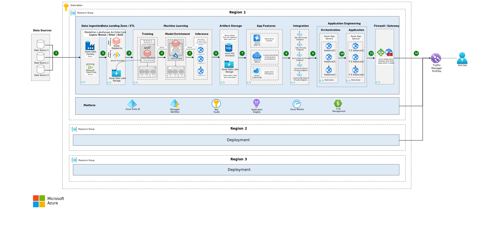

This article describes infrastructure design where the challenge extends beyond identifying the right components and resources. The real complexity lies in how these elements are layered and interconnected while creating a unified visual representation that caters to both technical and non-technical audiences. A key to overcome this challenge is understanding the audience. The solution is to develop a design that balances technical depth with accessibility. This approach ensures clarity for stakeholders across all levels of expertise.

## Architecture

*Download a [Visio file](https://arch-center.azureedge.net/data-ai-ml-end-to-end-reference-flow.vsdx) of this architecture.*

The reference blueprint is strategically designed to accommodate multiple levels of understanding. At the highest level, stakeholders can grasp the overall flow through labeled boxes and numerical indicators. For those seeking more detailed insights, a deeper dive into the individual components and resources is possible, ensuring the blueprint is both comprehensive and accessible. By creating such a flexible yet coherent design, this reference blueprint can serve as a guide for infrastructure planning, facilitating communication between technical and non-technical audiences alike.

When designing infrastructure that leverages Data, Machine Learning (ML), and Generative AI, these verticals provide a high-level overview of the key domains involved. For those seeking a deeper understanding, this highlights the specific services being utilized, with further granularity explaining the rationale behind their selection.

### Infrastructure Requirements
[Azure Data Factory](https://learn.microsoft.com/en-us/azure/data-factory/introduction) is used for ingesting data from various internal and external sources, while Azure Databricks handles ETL processes, data processing, and the setup of machine learning pipelines for training, enrichment and evaluation. [Azure Data Lake](https://learn.microsoft.com/en-us/azure/storage/blobs/data-lake-storage-introduction) serves as the data landing zone, supporting a [medallion lakehouse architecture](https://learn.microsoft.com/en-us/azure/databricks/lakehouse/medallion) to organize data and ensure quality. To enable third-party data sharing, [Delta Sharing](https://learn.microsoft.com/en-us/azure/databricks/delta-sharing/) is utilized. [Azure App Service](https://learn.microsoft.com/en-us/azure/app-service/) is used for deploying ML-managed endpoints and handling backend orchestration along with supporting the front-end application. Everytime after defined reulgar intervals, ML pipeline is triggered and the processed, cleaned, and aggregated data as output from ML pipeline is stored in [Azure SQL Database](https://learn.microsoft.com/en-us/azure/azure-sql/database/sql-database-paas-overview?view=azuresql). This approach minimizes the need for real-time inference, which can be costly. The orhcestration engine serving the front-end application can simply pull the processed output from ML pipeline via SQL Database rather than real-time inference. [Azure Blob Storage](https://learn.microsoft.com/en-us/azure/storage/blobs/storage-blobs-introduction) is used for storing static files and metadata. [Azure Open AI](https://learn.microsoft.com/en-us/azure/ai-services/openai/overview) provides generative content capabilities, while [Azure AI Search](https://learn.microsoft.com/en-us/azure/search/search-what-is-azure-search) helps in contextualization of this generative content and supports Retrieval-Augmented Generation (RAG). For storing historical data to ensure persistence in interactions with Co-Pilot or chat, [Cosmos DB](https://learn.microsoft.com/en-us/azure/cosmos-db/introduction) is used. While Cosmos DB is often avoided due to its cost, the pricing is based on Request Units (RUs) consumption. RUs consumption can be significantly reduced with [optimizing strategies](https://learn.microsoft.com/en-us/azure/cosmos-db/optimize-cost-reads-writes) including proper indexing, partitioning, and most importantly utilizing point reads. [Traffic Manager](https://learn.microsoft.com/en-us/azure/traffic-manager/traffic-manager-overview) functions as a load balancer, routing traffic to app service instances across multiple regions based on proximity, ensuring efficient performance and scalability. While the [Azure Data Factory]() is used for batch ingestion, incase of real time data streaming [EventHub](https://learn.microsoft.com/en-us/azure/event-hubs/event-hubs-about) can be an option and [Azure Functions](https://learn.microsoft.com/en-us/azure/azure-functions/functions-overview) for processing real time data stream. 

*Unlike batch processing, where the ML pipeline can be triggered at regular intervals, triggering the pipeline for each event in an event stream may not be optimal. This is because there may not be enough data in each individual event to retrain the models and produce a meaningful output that differs significantly from the previous event.*

### Security Requirements
[Azure Key Vault](https://learn.microsoft.com/en-us/azure/key-vault/general/overview) is essential for securely storing and retrieving sensitive data, such as keys, on demand. [Managed Identities](https://learn.microsoft.com/en-us/entra/identity/managed-identities-azure-resources/overview) allow services like Azure DevOps to connect with Azure resources for deployment without the need for shared keys, ensuring a more secure and streamlined process. [Entra ID](https://learn.microsoft.com/en-us/entra/fundamentals/whatis) enables Microsoft single sign-on, simplifying authentication and access management. To enhance security, a Private Endpoint and Subnet can be configured to limit external access to core services like AI Search and Open AI. Firewall and Application Gateway can be configured to provide a safety layer for app deployments, safeguarding them from potential web threats and ensuring secure access to resources.

### DevOps Requirements
Infrastructure-as-code (IaC) via Terraform is used for auto provisioning Azure resources, ensuring a consistent and repeatable infrastructure setup. [Azure Container Registry (ACR)](https://learn.microsoft.com/en-us/azure/container-registry/container-registry-intro) facilitates container-based deployments. For continuous integration and deployment (CI/CD), [Azure DevOps](https://learn.microsoft.com/en-us/azure/devops/user-guide/what-is-azure-devops?view=azure-devops) is utilized to configure YAML files to define continuous integration and continuous deployment pipelines. [Azure Oryx](https://github.com/microsoft/Oryx), Microsoft's open-source build tool, automates app building and deployment for services like Azure App Service and Static Web Apps, making the deployment process faster and more efficient.

### Post-Production Monitoring and SRE
[Application Insights](https://learn.microsoft.com/en-us/azure/azure-monitor/app/app-insights-overview) is used for logging all the required insights, telemetry and logging events. [Azure Monitor](https://learn.microsoft.com/en-us/azure/azure-monitor/fundamentals/overview) provides comprehensive monitoring of all the resources provisioned within a subscription and resource group. With [Cost Management](https://learn.microsoft.com/en-us/azure/cost-management-billing/costs/overview-cost-management) alerts can be setup based on predefined thresholds, helping to manage and optimize costs by providing visibility and control.

### Decision Rationale
- Infrastructure-as-Code (IaC) - [BICEP](https://learn.microsoft.com/en-us/azure/azure-resource-manager/bicep/overview?tabs=bicep) vs [Terraform](https://developer.hashicorp.com/terraform): Terraform supports multiple cloud providers, offering flexibility for potential future cloud expansion. Moreover, the built-in state management in Terraform enables tracking infrastructure changes effectively.
- Azure Fabric vs Azure Data Factory and Azure Databricks: Azure Data Factory provides powerful orchestration and scheduling capabilities for complex workflows. [Azure Fabric](https://learn.microsoft.com/en-us/fabric/fundamentals/microsoft-fabric-overview) has a broader scope over Azure Data Factory and Azure Databricks.

## Contributors
*This article is maintained by Microsoft. It was originally written by the following contributors.*

Principal author: [Faizan Tariq](https://www.linkedin.com/in/faizaantariq/)
