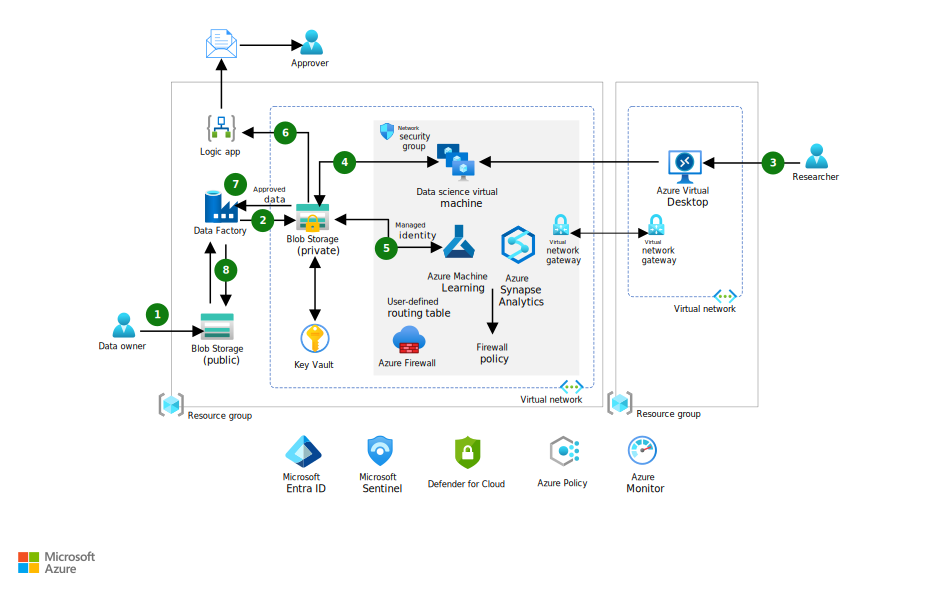

This article describes a secure research environment that allows researchers to access sensitive data that's under a high level of control and protection. This article applies to organizations that must adhere to regulatory compliance or other strict security requirements.

## Architecture

*Download a [Visio file](https://arch-center.azureedge.net/secure-compute-for-research.vsdx) of this architecture.*

### Dataflow

The following or dataflow corresponds to the above diagram:

1. Data owners upload datasets into a public blob storage account. They use Microsoft-managed keys to encrypt the data.

2. [Fabric Data Factory](/fabric/data-factory) uses a trigger that starts copying the uploaded dataset to a specific location, or import path, on another storage account that has security controls. You can only reach the storage account through a private endpoint or trusted workspace access. A service principal that has limited permissions can also access the account. Data Factory deletes the original copy, which makes the dataset immutable.

3. Researchers access the secure environment through a streaming application by using [Azure Virtual Desktop](/azure/virtual-desktop) as a privileged jump box.

4. The dataset in the secure storage account is presented to the data science virtual machines (VMs) that you provision in a secure network environment for research work. Much of the data preparation is done on those VMs.

5. The secure environment has [Azure Machine Learning](/azure/machine-learning) and [Fabric](/fabric), which can access the dataset through a private endpoint. You can use these platforms to train, deploy, automate, and manage machine learning models or use Azure Synapse Analytics. At this point, you can create models that meet regulatory guidelines. De-identify all model data by removing personal information.

6. Models or de-identified data are saved to a separate location on the secure storage, or export path. When you add new data to the export path, you trigger a logic app. In this architecture, the logic app is outside of the secure environment because no data is sent to the logic app. Its only function is to send notifications and start the manual approval process.

    The logic app starts an approval process by requesting a review of data that's queued to be exported. The manual reviewers help ensure that sensitive data isn't exported. After the review process, the data is either approved or denied.

    > [!NOTE]
    > If an approval step isn't required on exfiltration, you can omit the logic app step.

7. If the de-identified data is approved, it's sent to the Data Factory instance.

8. Data Factory moves the data to the public storage account in a separate container to allow external researchers to access their exported data and models. Alternately, you can provision another storage account in a lower security environment.

### Components

This architecture consists of several Azure services that scale resources according to your needs. The following sections describe these services and their roles. For links to product documentation to get started with these services, see [Next steps](#next-steps).

#### Core workload components

Here are the core components that move and process research data.

- [**Azure data science VMs**](/azure/machine-learning/data-science-virtual-machine/overview) are VMs that you configure with tools for data analytics and machine learning. In this architecture, they provide researchers with dedicated, secure compute resources for data preparation, analysis, and model training within the isolated environment. Use the data science VM when you need specific packages or tools, such as MATLAB or SAS, that platform as a service (PaaS) environments can't support. For security and ease of use, choose Machine Learning and other PaaS options when they're supported.

- [**Machine Learning**](/azure/well-architected/service-guides/azure-machine-learning) is a service that you can use to train, deploy, automate, and manage machine learning models. In this architecture, it facilitates model development and orchestration while maintaining security controls over data access and compute resources. You can also use it to manage the allocation and use of machine learning compute resources. Machine Learning is the tool of choice for Jupyter notebooks for development.

- **Machine Learning compute** is a cluster of nodes that you can use to train and test machine learning and AI models. In this architecture, it provides automatically scalable, secure, and isolated compute resources for research. You can deploy Visual Studio Code (VS Code) as a streaming application from Virtual Desktop and connect it to the Machine Learning compute for an alternative development environment.

- [**Azure Blob Storage**](/azure/well-architected/service-guides/azure-blob-storage) is an object storage solution for storing unstructured data in the cloud. In this architecture, it's the primary storage solution, and it has two instances. The public instance temporarily stores the data that the data owners upload. The public instance also stores de-identified data after it models the data in a separate container. The second instance is private. It receives the training and test datasets from Machine Learning that the training scripts use. Storage is mounted as a virtual drive onto each node of a Machine Learning compute cluster.

- [**Fabric Data Factory**](/fabric/data-factory) part of Fabric which is a managed cloud service that orchestrates and operationalizes processes to move raw data between systems. In this architecture, it moves data between storage accounts of differing security levels, enforces separation of duties, and manages data flows throughout the secure environment.

- [**Fabric**](/fabric/fundamentals/microsoft-fabric-overview) is an analytical tool for big data and pipelines for data integration and extract, transform, load workloads. Fabric is also a preferred service to run Apache Spark workloads. In this architecture, it enables advanced analytics and data integration for research datasets that can be accessed through secure, private endpoints.

- [**Virtual Desktop**](/azure/well-architected/azure-virtual-desktop/overview) is a desktop and app virtualization service that runs on the cloud. In this architecture, it acts as a jump box that you can use to gain access to the resources in the secure environment. It enables researchers to connect to data science VMs by using streaming applications and a full desktop, as needed. 

   Alternatively, you can use [Azure Bastion](/azure/bastion/), but you should have a clear understanding of the security control differences between the two options. Virtual Desktop has some advantages, including:

   - The ability to stream an app like VS Code to run notebooks on the machine learning compute resources.
   - The ability to limit copy, paste, and screen captures.
   - Support for Microsoft Entra authentication to data science VMs.

- [**Azure Logic Apps**](/azure/logic-apps/logic-apps-overview) provides automated low-code workflows. In this architecture, it manages the *trigger* and *release* portions of the manual approval process.

#### Posture management components

These components continuously monitor the posture of the workload and its environment. Their purpose is to discover and mitigate risks as soon as they're discovered.

- [**Microsoft Defender for Cloud**](/azure/defender-for-cloud/defender-for-cloud-introduction) is a service that you can use to evaluate the overall security posture of the implementation and provide an attestation mechanism for regulatory compliance. In this architecture, it helps you discover problems early, instead of when you perform audits or assessments. Use features to track progress such as the secure score and compliance score. These scores are important tools that help verify compliance.

- [**Microsoft Sentinel**](/azure/sentinel/overview) is a security information and event management solution and a security orchestration, automation, and response solution. In this architecture, it centralizes logs, detects threats, and automates security responses for the research environment. You can centrally view logs and alerts from various sources and take advantage of advanced AI and security analytics to detect, hunt, prevent, and respond to threats. This capability provides valuable security insights to help ensure that traffic and any activities associated with the workspace meet your expectations.

- [**Azure Monitor**](/azure/azure-monitor/overview) provides observability across your entire environment. In this architecture, it collects and visualizes metrics, activity logs, and diagnostics to support operational monitoring and incident detection. Management tools, such as tools in Defender for Cloud, also push log data to Azure Monitor.

#### Governance components

- [**Azure Policy**](/azure/governance/policy/overview) is a governance tool for enforcing organizational standards and assessing compliance at scale. In this architecture, it helps ensure that resources and workloads adhere to security and configuration policies.

### Alternatives

- This solution uses Data Factory to move data to the public storage account in a separate container to allow external researchers to have access to their exported data and models. Alternatively, you can provision another storage account in a lower security environment.
- This solution uses Virtual Desktop as a jump box to gain access to the resources in the secure environment with streaming applications and a full desktop. Alternatively, you can use Azure Bastion, but Virtual Desktop has some advantages. These advantages include the ability to stream an app, to limit copy/paste and screen captures, and to support Microsoft Entra authentication. You can also consider configuring a Point-to-Site VPN for offline training locally. This VPN also helps reduce the cost of having multiple VMs for workstations.
- To secure data at rest, this solution encrypts all Azure Storage accounts with Microsoft-managed keys by using strong cryptography. Alternatively, you can use customer-managed keys. You must store the keys in a managed key store.

## Scenario details

This scenario combines regulated and private data that individuals must access but aren't allowed to store or transmit.

- Data scientists outside of your organization need full access to the data to train and export their models without any proprietary or protected data leaving the environment.
- You must isolate access. Even the data owners and custodians aren't allowed to access the data after it's uploaded into the environment.
- You must require an audit trail for any exports that are transferred out of the environment to ensure that only the models were exported.

### Potential use cases

This architecture was originally created for higher education research institutions with Health Insurance Portability and Accountability Act (HIPAA) requirements. However, you can use this design in any industry that requires the isolation of data for research purposes. Some examples include:

- Industries that process regulated data per National Institute of Standards and Technology (NIST) requirements.
- Medical centers that collaborate with internal or external researchers.
- Banking and finance industries.

By following the guidance in this article, you can maintain full control of your research data, have separation of duties, and meet strict regulatory compliance standards. This approach also facilitates collaboration among key roles in a research-oriented environment, such as data owners, researchers, and approvers.

## Considerations

These considerations implement the pillars of the Azure Well-Architected Framework, which is a set of guiding tenets that can be used to improve the quality of a workload. For more information, see [Microsoft Azure Well-Architected Framework](/azure/well-architected/).

### Reliability

Reliability ensures your application can meet the commitments you make to your customers. For more information, see [Design review checklist for Reliability](/azure/well-architected/reliability/checklist).

Most research solutions are temporary workloads and don't need to be available for extended periods. This architecture is designed as a single-region deployment with availability zones. If the business requirements demand higher availability, replicate this architecture in multiple regions. You need other components, such as a global load balancer and distributor, to route traffic to all those regions. As part of your recovery strategy, use Azure VM Image Builder to capture and create a copy of the customized base image.

### Security

Security provides assurances against deliberate attacks and the abuse of your valuable data and systems. For more information, see [Design review checklist for Security](/azure/well-architected/security/checklist).

The main objective of this architecture is to provide a secure and trusted research environment that strictly limits the exfiltration of data from the secure area.

#### Network security

Provision Azure resources that are used to store, test, and train research datasets in a secure environment. That environment is an Azure virtual network that has network security group rules to restrict access. These rules apply to:

- Inbound and outbound access to the public internet and within the virtual network.
- Access to and from specific services and ports. For example, this architecture blocks all port ranges except the ones required for Azure services, such as Azure Monitor. For a full list of service tags and the corresponding services, see [Virtual network service tags](/azure/virtual-network/service-tags-overview).

    Access from the virtual network that has Virtual Desktop is restricted to approved access methods on specific ports, but all other traffic is denied. When compared to this environment, the other virtual network that has Virtual Desktop is relatively open.

The main blob storage in the secure environment is off the public internet. You can access it only within the virtual network through [private endpoint connections](/azure/storage/files/storage-files-networking-endpoints) and Storage firewalls. Use it to limit the networks from which clients can connect to file shares in Azure Files.

This architecture uses credential-based authentication for the main data store that's in the secure environment. In this case, the connection information, like the subscription ID and token authorization, is stored in a key vault. Another option is to create identity-based data access, where you use your Azure account to confirm whether you have access to Storage. In an identity-based data access scenario, no authentication credentials are saved. For more information, see [Create datastores](/azure/machine-learning/how-to-datastore).

The compute cluster can communicate only within the virtual network by using the Azure Private Link ecosystem and service or private endpoints, instead of using public IPs for communication. Make sure that you enable **No public IP**. For more information about this feature, which is currently in preview, see [Compute instance/cluster or serverless compute with no public IP](/azure/machine-learning/how-to-secure-training-vnet?tabs=azure-studio%2Cipaddress#compute-instance-cluster-or-serverless-compute-with-no-public-ip).

The secure environment uses Machine Learning compute to access the dataset through a private endpoint. You can also configure Azure Firewall to control access to Machine Learning compute, which resides in a machine learning workspace. Use Azure Firewall to control outbound access from Machine Learning compute. For more information, see [Configure inbound and outbound network traffic](/azure/machine-learning/how-to-access-azureml-behind-firewall).

To learn about one of the ways that you can secure a Machine Learning environment, see the blog post [Secure Machine Learning service environment](https://techcommunity.microsoft.com/t5/fasttrack-for-azure/secure-azure-machine-learning-service-amls-environment/ba-p/3162297).

For Azure services that you can't configure effectively with private endpoints, or to provide stateful packet inspection, consider using Azure Firewall or a non-Microsoft network virtual appliance.

#### Identity management

Access blob storage through Azure role-based access controls.

Virtual Desktop supports Microsoft Entra authentication to data science VMs.

Fabric Data Factory uses workspace identity to access data from the blob storage. Data science VMs use managed identity for remediation tasks.

#### Data security

To secure data at rest, all Storage accounts are encrypted with Microsoft-managed keys that use strong cryptography.

Alternatively, you can use customer-managed keys. You must store the keys in a managed key store. In this architecture, you deploy Azure Key Vault in the secure environment to store secrets like encryption keys and certificates. Resources in the secure virtual network access Key Vault through a private endpoint.

### Governance considerations

Enable Azure Policy to enforce standards and provide automated remediation to bring resources into compliance for specific policies. You can apply the policies to a project subscription or at a management group level, either as a single policy or as part of a regulatory initiative.

For example, in this architecture, Azure machine configuration applies to all in-scope VMs. The policy can audit operating systems and machine configuration for the data science VMs.

### VM image

The data science VMs run customized base images. To build the base image, use technologies like VM Image Builder. By using VM Image Builder, you can create a repeatable image that you can deploy when needed.

The base image might need updates, such as extra binaries. You should upload those binaries to the public blob storage. They should flow through the secure environment, much like how data owners upload the datasets.

### Cost Optimization

Cost Optimization is about looking at ways to reduce unnecessary expenses and improve operational efficiencies. For more information, see [Design review checklist for Cost Optimization](/azure/well-architected/cost-optimization/checklist).

The cost of data science VMs depends on the choice of the underlying VM series. Because the workload is temporary, we recommend the consumption plan for the logic app resource. Use the [Azure pricing calculator](https://azure.microsoft.com/pricing/calculator) to estimate costs based on the estimated sizing of resources that you need. Ensure that you shut down the environment when it's not in use to help optimize costs and improve security.

### Performance Efficiency

Performance Efficiency is the ability of your workload to scale to meet the demands placed on it by users in an efficient manner. For more information, see [Design review checklist for Performance Efficiency](/azure/well-architected/performance-efficiency/checklist).

The size and type of the data science VMs should be appropriate for the style of work that they do. This architecture is intended to support a single research project. You achieve scalability by adjusting the size and type of the VMs and by choosing compute resources that are available to Machine Learning.

## Contributors

*This article is maintained by Microsoft. It was originally written by the following contributors.*

Principal author:

- [Clayton Barlow](https://www.linkedin.com/in/clayton-b-barlow) | Senior Azure Specialist

Other contributors:

- [Tincy Elias](https://www.linkedin.com/in/tincy-elias/) | Senior Cloud Solution Architect

## Next steps

- [What is the data science VM for Linux and Windows?](/azure/machine-learning/data-science-virtual-machine/overview)
- [What is Machine Learning?](/azure/machine-learning/overview-what-is-azure-machine-learning)
- [What are compute targets in Machine Learning?](/azure/machine-learning/service/concept-compute-target)
- [Introduction to Blob Storage](/azure/storage/blobs/storage-blobs-introduction)
- [What is Data Factory in Microsoft Fabric?](/fabric/data-factory/data-factory-overview)
- [What is Virtual Desktop?](/azure/virtual-desktop/overview)
- [Defender for Cloud documentation](/azure/security-center)
- [What is Microsoft Sentinel?](/azure/sentinel/overview)
- [Azure Monitor overview](/azure/azure-monitor/overview)
- [What is Azure Policy?](/azure/governance/policy/overview)
- [Understand Azure machine configuration](/azure/governance/policy/concepts/guest-configuration)

## Related resources

- [Compare Microsoft machine learning products and technologies](../guide/data-science-and-machine-learning.md)
- [Many models machine learning at scale with Machine Learning](../idea/many-models-machine-learning-azure-machine-learning.yml)
