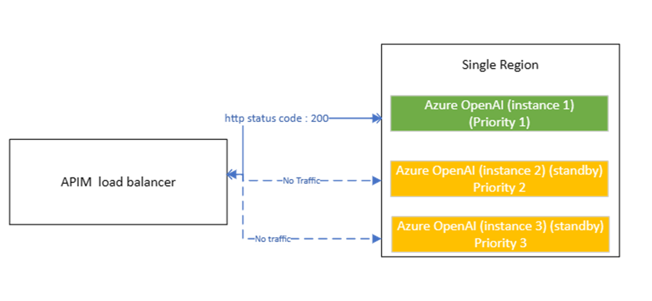
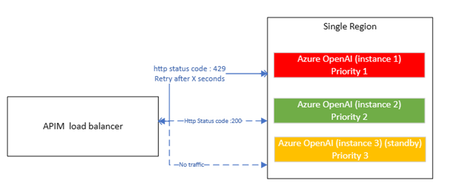
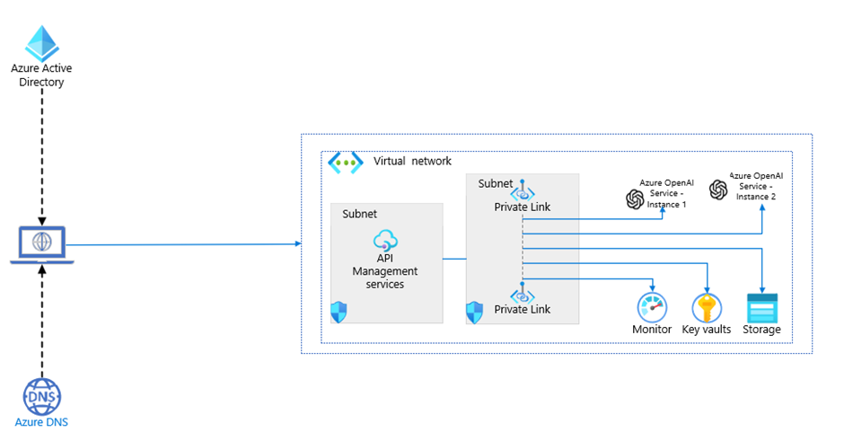
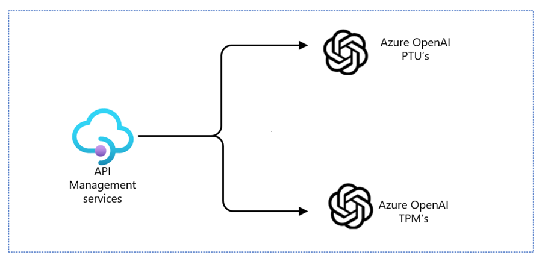
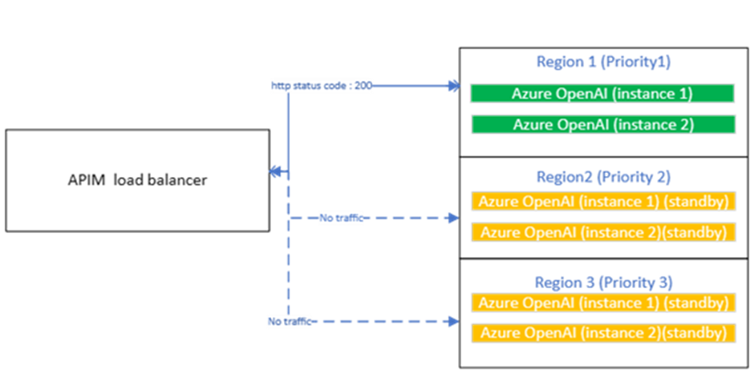
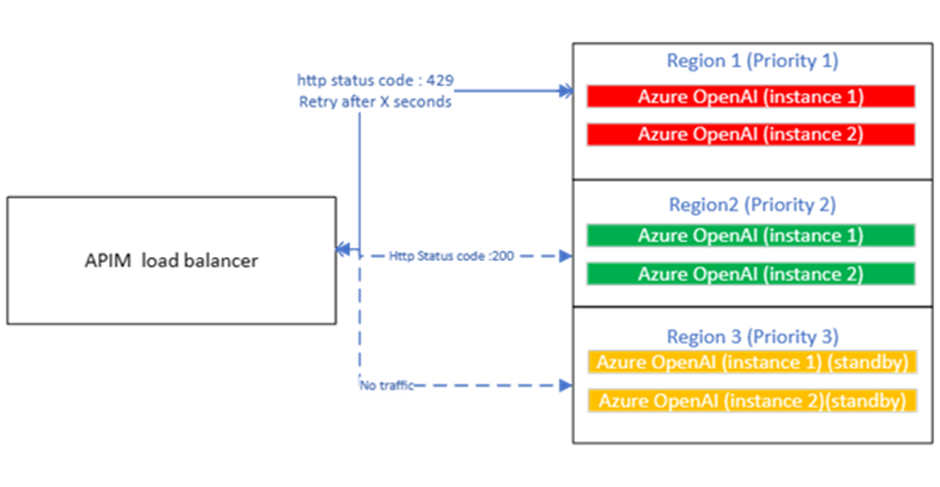
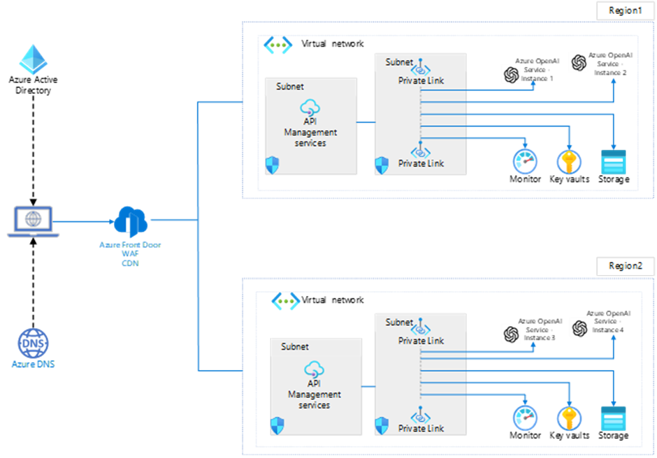
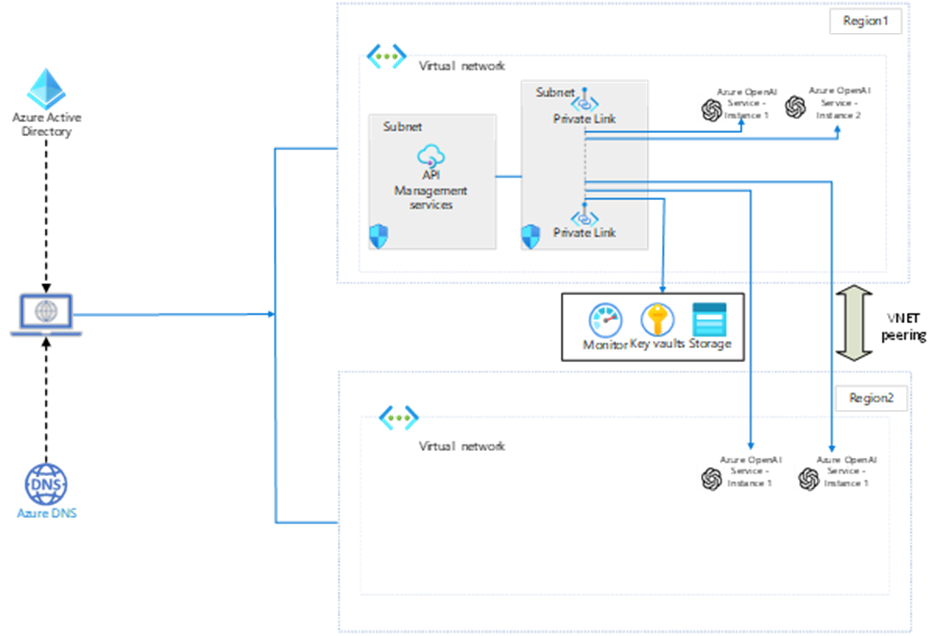

This article is a comprehensive guide that discusses different scenarios and solutions for building scalable, resilient, and performant Azure OpenAI applications. The inherent limits on quota at the service level – [Tokens per minute (TPM) and Requests per Minute (RPMs)](/azure/ai-services/openai/how-to/quota?tabs=rest#introduction-to-quota) is the most challenging aspect while building these applications.

So, this guide provides guidance about the considerations and requirements that are essential to consider when planning Azure OpenAI deployments.

## Key considerations and requirements

In real-time use cases, heavy concurrent usage, or intermittent spikes (usually unpredictable) exhaust either one of the quota limits (TPM or RPM) resulting in errors and hampering user experience. In this section, we review some of the key decisions you must make when you plan an Azure OpenAI deployment solution.

### Hitting 429s

Heavy concurrent usage or intermittent spikes (usually unpredictable) exhaust either one of the quota limits (TPM or RPM) resulting in 429 errors ('TooManyRequests' HTTP Status code) and a 'Retry-After' header, indicating that the service will not be available for the next few seconds to accept the next request. This will in turn introduce latency, hampering the performance and user experience. There is a possibility of increasing the quota limits through service requests, but this would not be the best approach for applications with growing workloads.

### PAYG  

In Azure, the quota limits are per subscription per region. This means that model deployments in a region have a limit of TPM and RPM. However, within a subscription, there is a possibility to spin up multiple resources in different regions, where the models are available (PayG model). In this scenario, the total quota for a model is split across different deployments where the split of TPMS can be decided and set, based on the token consumption or requests per deployment.  

This approach works in:  

- Use cases where the TPMs are well within the limit, but RPMs are high.  
- Blue-green deployment scenarios where a new model version must be tested before deploying to production.  

Alternatively, the resources can be spun up in multiple regions where the total quota limit gets multiplied by the number of regions.

This approach would be useful when:  

- TPM and RPM requirement in the use cases are high.  
- The application has a user base in different regions where Azure OpenAI model is deployed in each region.
- Azure OpenAI has to be integrated with [application hosted on-premises](/azure/api-management/virtual-network-concepts?tabs=stv2#access-options).

TODO: Note from Dennis Zielke
I would put a note here to make sure that all regions should run the same model version - which is not easy to figure out given our model availability matrix: https://learn.microsoft.com/en-us/azure/ai-services/openai/concepts/models#standard-deployment-model-availability

### PTU

There is another offering – Provisioned Throughput Units (PTUs), which can reserve guaranteed quota according to the requirements, where the quota is specific to a “triplet” of deployment type, model, region. The number of PTUs required for a workload (could be a single use case or multiple use cases) must be determined beforehand (best is to use [Azure OpenAI Capacity calculator](https://oai.azure.com/portal/calculator)) and the quota must be allocated at the subscription level. There is also a possibility to use a combination of PTU and PayG where the majority of requests are handled within the PTU endpoints and the spillovers to use the PayG endpoints.  

While we discussed multiple options to overcome the quota limits and few other common scenarios, the only problem remaining is to effectively orchestrate or “load balance” these requests across different PayG resources/instances within a single region/multiple regions or between the PTU endpoints and PayG resources/instances.

### Smart Load balancing

Traditionally, 'round-robin' load balancers were used to send the requests to different servers/resources/services in a pre-defined routing pattern so that the requests are shared/divided equally in a sequential or rotational manner. Although this implementation is fairly simple, the health of the servers/resources/services are not considered before routing and no adjustments can be made according to the real-time conditions.

The solution we are proposing with Azure API management as a 'smart load balancer' is by utilizing the headers `Retry-After` along with error code (429) from Azure OpenAI when it hits the rate limits.

The below sections detail the key scenarios mentioned above and the corresponding architectural considerations using Azure API management gateway, by broadly classifying into:

- Single region, multiple instances - or – multiple deployments in a single instance
- Multi-region deployment

## Single region, multiple instances

As discussed above, within each region and subscription, there are specific limited TPMs and RPMs per model.

Below are the common use cases that are encountered which can be solved by spinning up multiple instances or multiple model deployments in the same region.  

- Hitting 429s: Concurrent users are exceeding the possible RPM limits, but TPMs might be well within the limits and will result in 429s.

  In this scenario, multiple instances of the model deployments can be created. TPM limits must be set on each of the deployments (can by dividing TPMs equally among the deployments) and then route the requests in a distributed manner to each of the deployments.  

- Offer solutions to multiple customers by separating AOAI endpoints with the same models (with or without choosing relevant TPMs for each deployment)

  This scenario requires estimation of TPMs and RPMs for each customer. Based on this, the solution would be the same as deploying multiple instances of the model and setting the relevant TPMs for each customer. The routing of requests would be based on the customer.  

- Provisioned Throughput + PAYG: Required TPMs & RPMs are much higher than the possible TPMs & RPMs and must be executed within a certain region.

  PTUs is best suited for this scenario where the number of PTUs must be estimated and allocate quota to the subscription. This estimation is usually done by understanding the usage. However, there could be some uncertainty in any of these estimations. Hence, the best practice would be to use a combination of PTU based deployments along with PayG deployments. The routing of requests must be to handle the spillovers from the PTU in the PayG deployments.  

- Blue/Green deployment: Testing the newer model versions before replacing the existing model in production.

  AOAI models are constantly updated with new model versions or even new models. A well-know best practice to test any changes to the applications is with blue-green deployments where a small subset of users or requests would be routed to the new model version/ new model deployment endpoint to test the performance before rolling it out completely.

In all the above scenarios, routing of requests is the key for solutioning and can be done through a gateway. Azure API management is a service on Azure which is made up of API gateway, management plane and a developer portal. Hence, this service will help in routing the requests to multiple instances of AOAI in the single region.  

This [GitHub repository](https://github.com/Azure/apim-aoai-smart-loadbalancing) contains the policy code and more instructions you can use to build the below solution.

The Azure OpenAI (instance 1) which has the highest priority gets all the traffic from the APIM load balancer and it receives the “Http status code: 200” while the other two instances of Azure OpenAI (Priority 2 and Priority 3) are standby.

When the Azure OpenAI (instance 1) with the highest priority starts throttling and sends back “Http status code :429” along with the “Retry-After” header, APIM dynamically routes traffic to the Azure OpenAI instances on standby with lower priorities until priority 1 becomes healthy again.  

The architecture below depicts the routing and directing of requests to the appropriate Azure OpenAI endpoints with help of policies.

Azure API Management routes and directing requests to the appropriate Azure OpenAI endpoints and offers other capabilities:  

- API Management connects to all Azure resources via Azure Private Link, offering increased security through private endpoints and keeping the traffic within the private network.  
- Use APIM to manage the access, usage, and billing of your Azure OpenAI APIs, and apply policies such as authentication, caching, rate limiting, and transformation.  
- In the case of PTU and PayG combination, the architecture would be modified as below: In this scenario, PTU instance must be set high priority.

### Challenges

The major challenges with the above solution are:

- Since all the resources are deployed in the single region, if the services become unavailable due to any reason, the application will stop working and cease to be resilient to regional outages.  
- Except for the PTU+ PayG combination, the solution provides best possible use of quota within a region but will not help in increasing the available quota for the application.

## Multi-region deployment

If the use cases demand additional quota like (not limited to)

- Usage spikes which are adhoc or seasonal (with no data related compliance issues resulting from data movement across regions)
- PTU can satisfy the requirement but is not cost effective compared to the PayG model.
- The application is hosted on-premises (or any other cloud), but wants to use Azure OpenAI.

Then the best approach would be to deploy the AOAI resources in multiple regions and route the requests through Azure API Management.  

Following the same policies as in the case of single region deployments, APIM load balancer can serve as a gateway to orchestrate across Azure OpenAI deployments in different regions, which will help in increasing the quota limits.

### Benefits

The benefits of the solution are:

- The quota increases and would be equal to the regional quota multiplied by the number of regions.
- Cost effective compared to PTU (use case specific – if the usage is not uniform)
- Ensures application resiliency in case of regional outages.
- Supports users of the application from different regions ensuring low latency.
- Can combine multiple of the single region instance deployments.

### Implementation examples

There are two implementation possibilities.

#### Using multi-region deployment of Azure API Management

Provided below is the architecture corresponding to the multi region deployment scenario. Azure API Management supports multi-region deployment within a single instance of the service and do not require creation of multiple API Management services Please note that this feature is available on the Premium tier of API Management. The Premium tier enables you to distribute a single Azure API Management instance across any number of desired Azure regions.

If you are seeing extremely heavy usage and are able to scale out your application(s) across regions, then you may want to deploy APIM service instances across multiple regions.

- Azure Front door provides a single point of entry to Azure OpenAI models and handles a few initial tasks:

  - Processing the initial request  
  - Load balancing across the regions  
  - SSL(HTTPS) termination and offloading  
  - Failing over if there's a regional outage  

- Azure DNS manages DNS records and ensures routing to the correct Azure Front Door endpoint.  

- Architecture uses Microsoft Entra ID as the identity provider for authentication.  

- Once routed to the appropriate region, Azure API Management routes and directing requests to the appropriate Azure OpenAI endpoints and offers other capabilities:  

  - API Management connects to all Azure resources via Azure Private Link, offering increased security through private endpoints and keeping the traffic within the private network.
  - Use APIM to manage the access, usage, and billing of your Azure OpenAI APIs, and apply policies such as authentication, caching, rate limiting, and transformation.
  - Monitor and analyze the performance and health of your Azure OpenAI APIs and troubleshoot any issues using APIM’s built-in tools and integrations with Azure Monitor and Application Insights.  

- Deploying Azure OpenAI instances across various regions allows for scaling out API usage, ensuring both high availability and disaster recovery for the service.  

#### Using single-region deployment of Azure API Management  

Single APIM service instance can support multi-region, multi-AOAI accounts. Having a single APIM service makes sense when an application using the service is in the same region and you do not need DR.

### Challenges

- If the solution is chosen for increasing the quota, then please ensure that there are no restrictions on data to one region else this solution would not be useful.
- Resiliency – Having a single APIM service makes sense when an application using the service is in the same region and you do not need DR.

## Considerations

In this section, we review some of the key decisions you must make when you introduce a gateway to your architecture.

### Cost Optimization

The APIM service adds to the cost of the architecture. When calculating the cost, take into account redundancy and multi-region capabilities required for the APIM.

### Security

By implementing best practices for application-level and network-level isolation of your cloud services, this scenario mitigates risks of data exfiltration and data leakage. All network traffic containing potentially sensitive data that's input to the model is isolated in a private network. This traffic doesn't traverse public internet routes.

- Implement data protection, identity and access management, and network security recommendations for Blob Storage, AI services, and Azure OpenAI.  
- Configure AI services virtual networks.  

### Operational Excellence

- If you need to track transactions, consider generating correlation IDs for logging purposes.
- Adding a gateway service to your architecture adds complexity to the architecture. The gateway service deployment should be included in your Infrastructure as Code (IaC) strategy. The gateway should be included in your monitoring strategy.

### Reliability

- The gateway service can introduce a single point of failure. Ensure you design it to meet your availability requirements. Consider resiliency and fault tolerance capabilities in the implementation.
- The gateway service should implement health probes to provide failover capabilities for OpenAI instances that aren't responding.

## Next steps

