# Assessing System Performance against Key Performance Metrics
[!INCLUDE [header](../_includes/header.md)]

Performance analysis is a complex discipline. It is concerned with assessing the whether a system is meeting performance targets, and determining the causes if these targets are not met. The [Performance Analysis Primer](#insertlink#) provides an introduction to this subject, describing what good performance actually is and the essential tools and techniques that you can use to measure performance in a cloud-based system. 

The purpose of this guidance is to provide more specific details on how you can go about monitoring system performance accurately. Specifically, this guidance is concerned with determining the key performance metrics that you should consider, and how you can use these metrics to ascertain how well your system is functioning.

> **Note**: Many performance problems in large-scale application are caused by implementing practices that, while they might be satisfactory in an environment that is placed under limited pressure, can cause significant slowdown or even catastrophic failure once the system is put under significant stress. A key to designing and building scalable systems is not only avoiding these practices in the first place, but also spotting their symptoms and eliminating them if they do make it into a live system. This requires that you understand which design and implementation practices you should avoid. To assist you in this task, we have identified and published documentation describing a selection of [cloud-based anti-patterns](https://github.com/mspnp/performance-optimization) which are available online.

# Understanding Key Performance Metrics
System performance is primarily concerned with the following factors:

* How many operations can the system perform in a given period of time (throughput)?
* How many operations can be performed simultaneously (concurrency)?
* How long does the system take to perform an operation (response time/latency)?
* How much spare capacity does the system have to allow for growth (head-room)?
* How many exceptions does the system generate while performing operations (error rate)?
	
These factors might appear obvious, but of course they will vary depending on the load under which the system is operating; almost any system is likely to perform operations quickly if the load is very light and plentiful resources are available. The critical point comes when the system is running under pressure; how does it handle many millions of concurrent requests or requests that consume a large proportion of the available resources? The following graph shows the typical performance profile of a simple cloud service that accepts and processes user requests. The graph illustrates how the throughput and average response times vary with increasing user load, and is characteristic of that generated while performing controlled load-testing of a well-defined set of requests, each performing a single transaction. The horizontal axis (not labelled) depicts time. The graph assumes that each user request takes approximately the same time and resources to process, users "think times" between requests follow a normal distribution, and that apart from the service itself there are no other points of contention.

> **Note**: Including "think-times" is an important part of load-testing to ensure that simulated workloads remain realistic. Without including this element, it is possible that operations in the test workload could become artificially synchronized and affect the results. For more information, see [Editing Think Times to Simulate Website Human Interaction Delays in Load Tests Scenarios](https://msdn.microsoft.com/library/dd997697.aspx). 


_Figure 1._

**Profile of performance versus user load for a simple cloud service**

Throughput starts low (there is only a small load initially) but grows, as the load rises, to reach a natural ceiling based on the capacity of the service. This capacity is likely to be determined by the way in which the service is implemented and the resources that it uses; it could be limited by:

* The volume of network traffic flowing between clients and the service,
* The CPU utilization, the number of threads, and the amount of memory available to the service to handle requests, 
* If the service uses a database, the number of available database connections and the volume of traffic between the service and the database, and
* The capacity of other services on which it depends. For example, Azure SQL Database capacity is purchased in terms of [Database Throughput Units](#insertlinks#) (DTUs). If you exceed your allocated DTUs, your service may be denied access to the database unless you buy additional capacity. Other services might have limitations due to the physical way in which they are implemented (use of threads, database connections, available memory, etc) rather than purchased capacity. 
	
> **Note**: Make sure that the load-test tool that you use to capture performance data such as this does not itself generate false-negatives. For example, if the tool does not provide a sufficient number of available load-test agents to match the simulated workload, the throughput ceiling reported could be due to the short-comings of the tool rather than lack of capacity in the system.

However, a graph such as this does not necessarily show the full picture. Although it indicates the maximum likely throughput, the latency continues to grow with user load. This means that more and more requests are backing up waiting to be serviced. At some point these requests are likely to start timing out and return to the client application with some sort of failure indication. Additionally, if the service is hosted by a web server such as Internet Information Services (IIS) then when the number of outstanding requests reaches a limit the web server itself might start rejecting requests.

> **Note**: The lack of capacity in a service on which your system depends is sometimes known as "backend pressure". This aspect is frequently the limiting factor for performance in many systems; such a service is often external to the system, might be managed by a third party, could be shared with other parties (which may affect its performance), and might possibly impose limits or other quotas on its use.

Figure 3 shows an extension of the previous graph illustrating the behavior profile of the same simple cloud service when placed under breaking strain. 
 
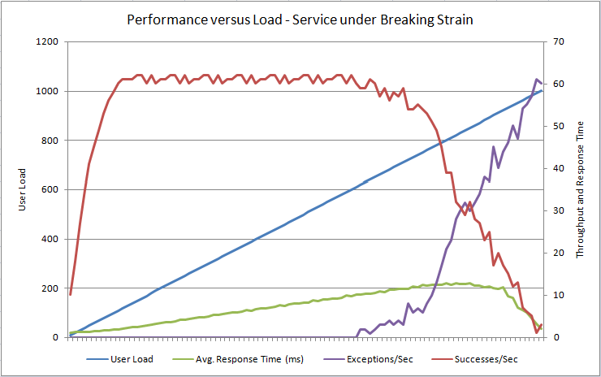

_Figure 2._

**Profile of performance versus user load for a simple cloud service under severe strain**

In this graph, as the load passes 600 users, requests start timing out and the system begins to report the occurrence of exceptions. Increasing the load further generates more exceptions, until the system can no longer cope and the volume of exceptions explodes. Note that the rate of successful operations plummets accordingly. It is also worth noting that the average response time drops as the web server starts to reject requests very quickly. This is an important point – measuring response time alone is no indicator of how well the system is running.

One further complication to consider is that a system may be resilient enough to recover (at least temporarily) and as the number of requests waiting to be serviced drops due to failing quickly, further requests may be handled successfully. The system can enter a period of oscillation where the success request rate peaks and falls alternately with the failure rate. Figure 4 shows a graph illustrating this phenomenon taken from the [Improper Instantiation](https://github.com/mspnp/performance-optimization/blob/master/ImproperInstantiation/docs/ImproperInstantiation.md) anti-pattern.
 
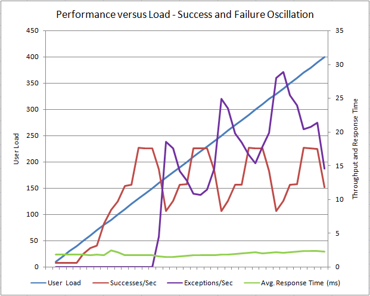

_Figure 3._

**Success and failure rates oscillating while the service is under increasing strain**

In this example, although the system recovers periodically, the recovery is not sustained. Also notice that rate of exceptions continues to rise with each successive peak, indicating that the system is likely to reach total failure at some point.

The purpose in showing these graphs is to highlight the interplay between the factors that help to determine whether a system is functioning healthily under load, is about to collapse, or is somewhere in the middle. Load-testing your own system in a controlled environment (not the live system) can help you to spot similar trends to determine the capacity of your services and assess whether you need might need to scale your system to meet the expected demand. 

There is also the issue of _noise_. The graphs shown above have focused on a simple situation where the functionality under test is isolated under a gradually increasing load. In the real world, a volatile number of users will likely be performing many different operations concurrently, and the performance of the system at any moment will simply be a snapshot of all the work being performed at that time. If users suddenly start to receive errors, or the system slows down, it could be due not to a single piece of logic but to the cumulative effects of the entire workload. This situation helps to emphasize why it is important to treat performance monitoring as a continuous process. The moving target of user load and sudden bursts of activity may require your system to react quickly to handle the additional volume of requests, and you can only perform this feat if you have accurate and timely information available. The performance data that you capture must include sufficient contextual information to enable you to correlate individual metrics into an end-to-end view of the process-flow throughout the system. This information is vital during performance analysis to help you understand how the various concurrent processes that comprise your system co-exist, co-operate, and compete with each other. The process of collecting this information is described in more detail in the [Performance Analysis Primer](#insertlink#). 

# Classifying Metrics by Levels of Abstraction
In most systems, there is a plethora of metrics that you can capture and analyze. Without careful consideration it is very easy to either lose sight of what it is you are trying to measure in the noise of all of the various measurements that you can take, or miss something vital if you forget to capture a key metric. It helps to break the vast set of possible metrics down into subsets that focus on specific levels of abstraction. You can then focus on what the data is actually telling you about performance in these levels. This guidance uses the following abstraction levels:

* **Client Metrics**. These are concerned with measuring the end user's perception of performance, including how long it takes for a client application to perform local processing and render results. They cover areas such the responsiveness of local and remote operations, memory footprint, and CPU use. On a mobile device, high CPU and network utilization can reduce battery life, and high memory use can prevent an application from running.
* **Business Metrics**. These provide a view of the logical operations that define the business processing. They are related to the end-user activities that drive the business. These metrics should cover the key business transactions that the system performs.
* **Application Metrics**. These are concerned with measuring the activity and performance of the application layer (the application code and any application frameworks and runtime execution environment that the application is using, such as the .NET Framework, ASP.NET, CLR, and so on). The purpose of these metrics are to help you examine the flow through the application of a potentially large number of concurrent user requests, analyze the resources that they consume, and assess the likelihood and causes of performance issues.
* **System Metrics**. These capture information about the low-level performance of the underlying infrastructure. These items are typically focused on KPIs associated with memory occupancy, network utilization, disk activity, and CPU use.
* **Service Metrics**. These cover the performance of dependent services such as Azure storage, messaging, cache, database, and any other external service that your application might be using. They do not measure the performance of these services per se, rather they capture information about the performance of the requests that your system sends to them.
	
The sections that follow describe each of these classifications in more detail.

# Client Metrics
Client metrics give a view on how an end user perceives the system. Performance at this level is a function of how responsive the user interface is and the volume of client-side resources that the application consumes. Many modern mobile user interfaces are browser or device-based. In these situations, the primary client metrics are those concerned with page views, page load time, JavaScript code, browser or device types, geographical location, and session traces (amongst others).

## How to Gather Client Metrics
Most modern browsers enable you to gather performance data covering client-side network traffic and profiling of client-side code. This information can be useful from a development and testing perspective, but it is impractical to attempt to use these tools to capture data on a large scale for an application in production. Another solution is to include JavaScript code in the client-side code that records browser timing information. This code can capture instrumentation such as page load times, session data (the end-to-end lifetime of an interaction that may span multiple web pages and operations), JavaScript or other client-side code exceptions, and AJAX timing information. The JavaScript code sends this data to a service that captures this information, from where it can be retrieved and examined. [Boomerang](http://yahoo.github.io/boomerang/doc/) is an open source solution that follows this approach.

[Microsoft AppInsights](http://azure.microsoft.com/documentation/articles/app-insights-get-started/) follows a similar approach. You manually embed calls to AppInsight API functions in the code that is executed in the browser when pages are viewed. Using functions such as [TrackPageView](#insertlink#) and [TrackEvent](#insertlink#) you can monitor the performance of individual browser sessions. You can then use the Azure portal to view this information in near real-time. Figure 4 shows an example:
 
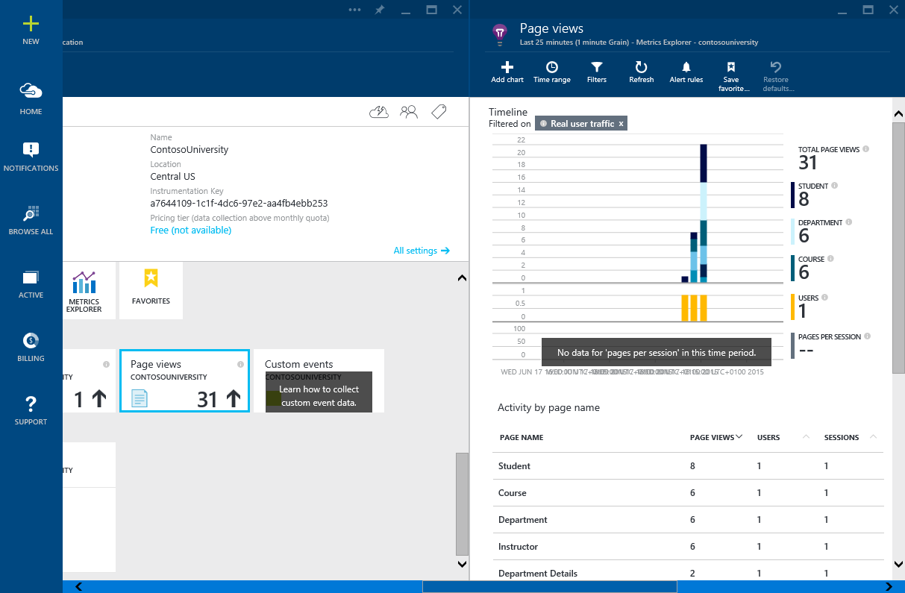

_Figure 4._

**Monitoring page views by using the AppInsights APIs**

Many Application Performance Monitoring (APM) tools also support client-side browser tracing. These tools follow a similar approach to boomerang, injecting JavaScript elements into web pages as they are served to clients, gathering the results, and displaying them. Figure 5 shows the client-side information that can be captured by using the Browser pages in [New Relic](http://azure.microsoft.com/en-gb/documentation/articles/store-new-relic-cloud-services-dotnet-application-performance-management/), a popular APM tool. 

> **Note**: The injected code might not work if the user's browser is located behind a firewall or proxy that does not have access to the New Relic CDN that hosts the data capture utility code, or if access to New Relic's public network is blocked.
 
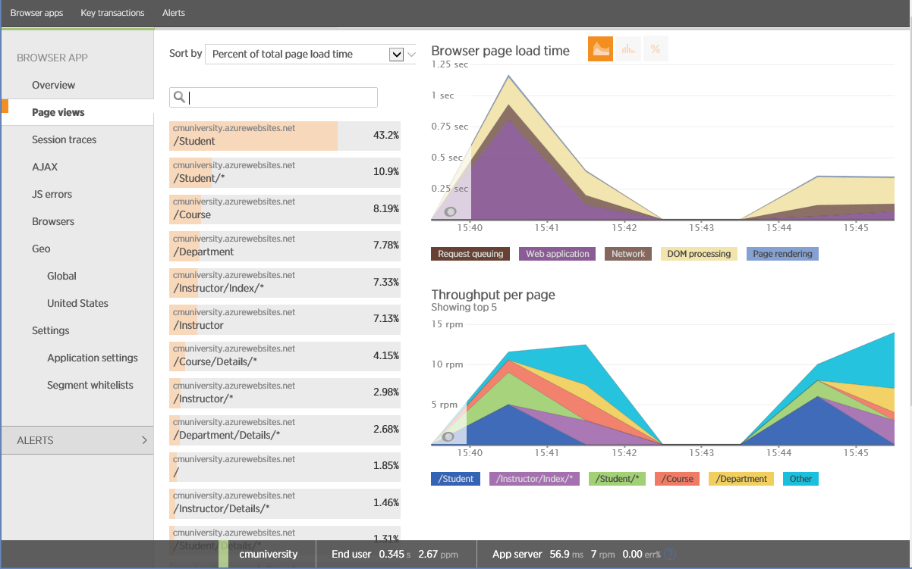

_Figure 5._

**Monitoring browser performance data by using New Relic**

## What to Look For
The following sections summarize the primary client-side instrumentation on which you should focus.

### Page Views, Page Load Times, and Time Spent Visiting a Page 
These are the user-facing aspects of performance and are key to the success of the application (as far as users are concerned). If page load times for popular pages are extended, then users might complain and customers might avoid visiting your web site in the future. From a system perspective, this data also represents the end-to-end ("start of request" to "end of response") telemetry for measuring throughput. 

### Session Traces
Use session traces to track the timeline of operations and resources used by a session. You should monitor every loaded asset, each AJAX request, all user interactions (such as clicks and scrolls), all JavaScript events, and every exception. 

### Client-side Environment Statistics 
The client-side code could be running in a variety of different devices and operating systems, including varying versions of Windows, Android, and iOS using a broad selection of browsers. It can be important to gather telemetry on the performance of the client-side code in different environments to indicate whether the code runs better in some browsers than others.

Figure 6 shows an example of this data captured by using New Relic. This figure shows the throughput measured in pages per minute (ppm), but other statistics are also available, including page load time and front-end load time.
 


_Figure 6._

**Analyzing page views by browser using New Relic**

Note that New Relic reports on different browsers. There may be a correlation with device type and operating; most Apple devices will likely run iOS and use the Safari browser, Android devices will most probably be using Chrome, and Windows devices are likely to be running Internet Explorer. There could be some exceptions though, and there might be other devices running different browsers. In this case, if you need to capture device information rather than simply recording which browser was used, then you may need to incorporate custom code that records device data into each page. Figure 7 shows an example using AppInsights to capture information about the client operating system:
 
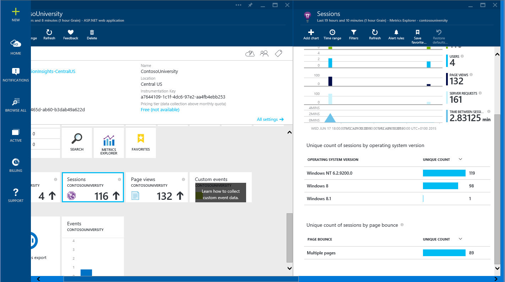

_Figure 7._

**Analyzing sessions by operating system using AppInsights**

### JavaScript and HTML Rendering Errors 
The JavaScript and HTML code in a web application might utilize features not supported by all environments, and it is important to ascertain whether users are likely to experience issues using particular browsers and what can be done to remove these issues. Many APM tools enable you to track whether the client browser reports any JavaScript and rendering errors, and can break the analysis down by browser.

### The Geographic Location of Clients 
The locations of clients should be correlated against page load times and latency usage of the application. Many clients will be coming from other locations, and this data can help to detect resources that take time to be downloaded. This information can be used to help design applications that have to handle high latency scenarios. Figure 8 shows New Relic recording the average page load times across different states in the USA. 
 
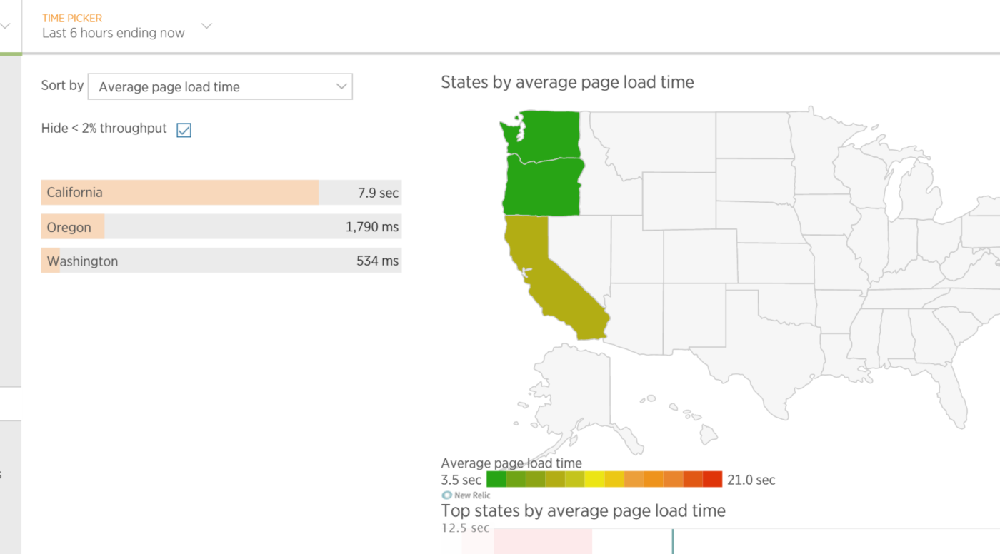

_Figure 8._

**Average page load times by state for a web application**

### The Session ID and User ID for Each Request 
In some situations, it may be necessary to trace the activity for a specific session or user if there are specific issues that are peculiar to this user. Many APMs do not track this level of detail, but you may be able to add custom metrics that emit this data as users perform operations (privacy concerns notwithstanding).

# Business Metrics
Business metrics are concerned with measuring the volume and rate of business operations and transactions. This information can help you determine whether your application is meeting business expectations. For example, an application designed to provide a highly dynamic video-oriented social experience might need to measure the number of videos uploaded over a period of time, the rate at which searches for videos are performed, and how frequently videos are successfully viewed. 

This process typically involves exploring and aggregating business-level telemetry, and examining real-time snapshots and historical trending of system behavior, combined with delving deeper into rich pivots, time slices and property filters to assess the business impact of the system. Apart from generating this long-term analytical data, business monitoring is also concerned with more immediate issues such as determining why business operations could be failing and raising alerts if various performance thresholds are crossed.

## How to Gather Business Metrics
Many APM tools are designed specifically to collect this type of information. For example, New Relic uses the .NET Profiling API; a monitoring agent registers with the CLR as a profiler when the application starts running. The CLR subsequently calls the agent as code is loaded, and the agent instruments the code by using byte code injection. This process is transparent to your application and does not require that you modify your code in any way. The New Relic agent takes responsibility for correlating the data that it captures as requests are made and storing it in a repository. In this way, the New Relic APM can present the telemetry graphically as a flow of related activities over time. If you need to capture additional information, New Relic provides APIs that enable you to gather and store data for custom metrics although this requires amending the code of your applications. 

Using this technique, New Relic can capture statistics about the individual business operations being requested by clients. You can break this information down to show the throughput of each operation (in requests per minute), and average response time (in milliseconds), as shown in Figure 9.
 


_Figure 9._

**Average transaction times for operations in New Relic**

AppInsights provides similar features, enabling you to capture performance and throughput statistics for each operation in a web application.
 
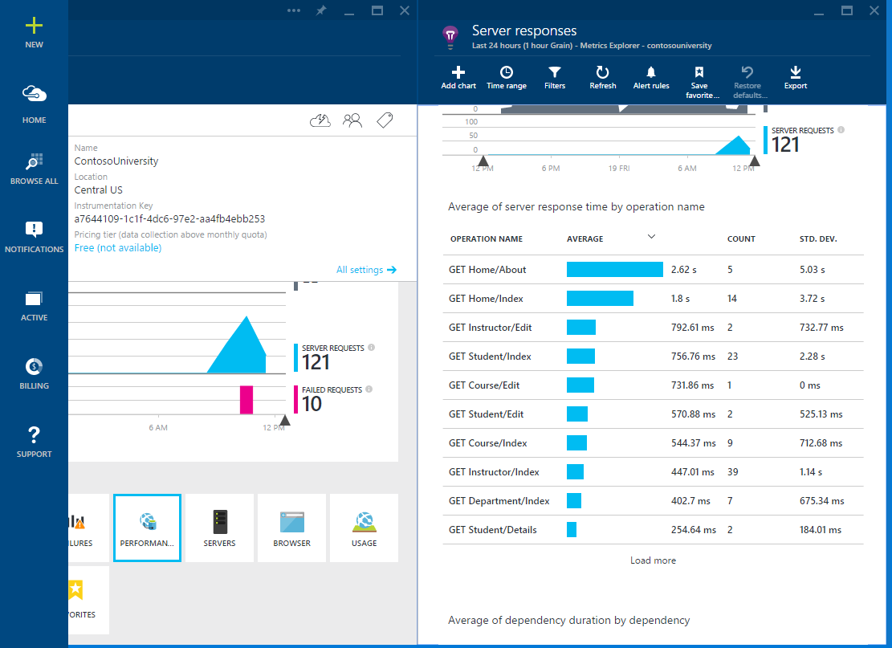

_Figure 10._

**Average transaction times for operations in AppInsights**

Analysis of business metrics to identify long term trends will require access to historical information. Many APM tools have the ability to capture and store data for a specific period (maybe the last 30 days), but performing ad-hoc or more generalized analysis may necessitate capturing, logging, and downloading performance data so that it can be examined locally using tools such as Excel. This data can come from a variety of sources (such event logs, performance counters, and server and application traces), and you should configure the application to record the data for the key performance metrics that your analysis is likely to require.

## What to Look For
Consider the points raised in the following sections when deciding which business metrics to monitor.

### Business Transactions that Violate Service Level Objectives (SLOs)
All business transactions should raise alerts if SLOs are violated. SLOs are the part of the SLA that document how your organization defines acceptable business system performance. SLOs should be defined in terms of measurable aspects of the system, such the percentile response time for operations (for example, 99% of all requests for operation _X_ must be performed in _Y_ms or less). You need to be informed if your system is consistently failing to meet SLOs. AppInsights enables you to define rules that can trip alerts when performance metrics exceed specified thresholds. The example shown in the figure below emails the operator when the service response time for any web page in the application exceeds 1 second:
  
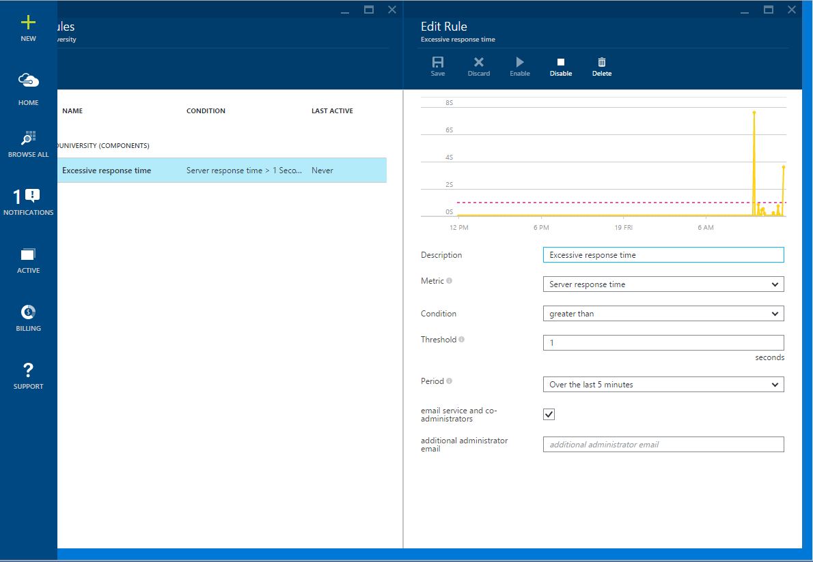

_Figure 11._

**Creating an alert in AppInsights**

Figure 12 shows the message sent by the AppInsights alert to the operator:
 
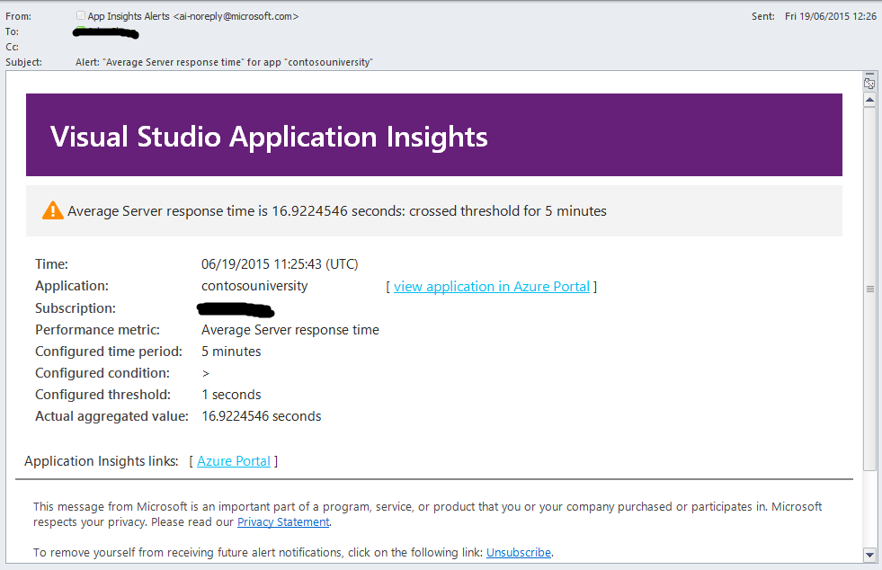

_Figure 12._

**An alert email sent by AppInsights**

The operator can use the links in the email to view the current state of the application.

In a similar manner, New Relic enables you to specify policies that can trip alerts when the Application Performance Index (or Apdex) for a business transaction indicates poor performance for a period of time. 

> **Note**: The Apdex is an industry standard unit of measurement where 1 indicates excellent performance and 0 indicates disaster. The [APDEX.org](http://apdex.org/overview.html) web site explains how it is defined in more detail.

The image below shows the default transaction alert policy in New Relic. In this case, an alert is raised if the Apdex drops below 0.85 for 10 minutes, or below 0.7 for 5 minutes. Similarly, the alert is raised if the error rate exceeds 1% of requests in 10 minutes, or 5% in 3 minutes. Finally, the alert is also raised if the web application is deemed to be unresponsive (by pinging a defined health endpoint) for 1 minute.
 


_Figure 13._

**Configuring the alert policy in New Relic**

### <a name=" businesstransactionsthatfail " href="#" xmlns:xlink="http://www.w3.org/1999/xlink"><span /></a>Business Transactions that Fail
All business transactions should be monitored for failures. SLO alerting can indicate recurring problems over a specified period, but it is also important to track individual failures to determine their causes. Information about exceptions can be captured as they are thrown (the application might record them in the Windows Event log, or the APM can inject custom logging code as described earlier). The following figure illustrates how this information is reported by using New Relic. 
 
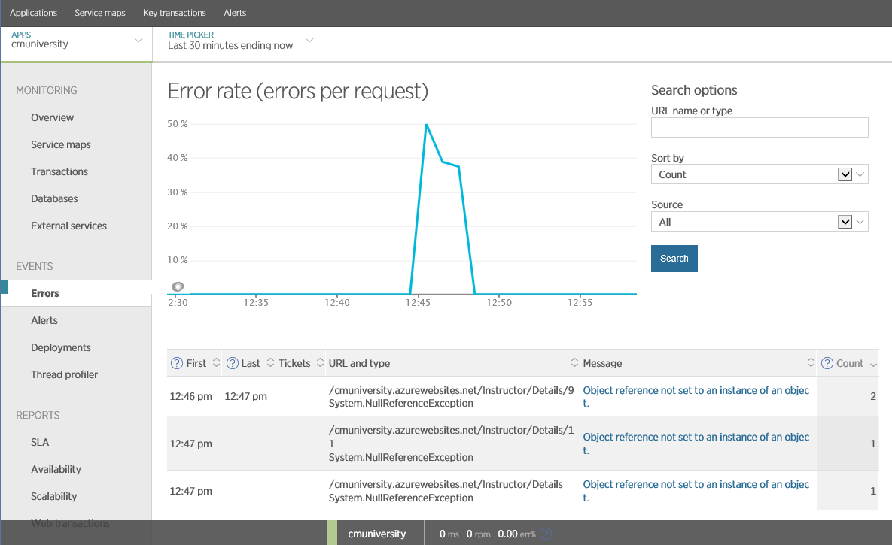

_Figure 14._

**Reporting exceptions in New Relic**

You can capture similar information by using AppInsights, and you can drill through the details to obtain the specific information about the causes of individual exceptions.
 
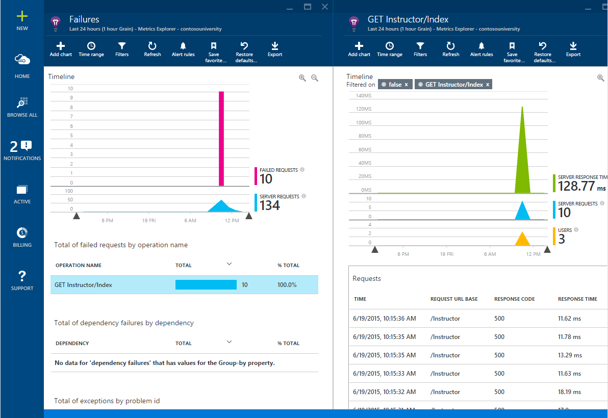

_Figure 15._

**Reporting failed requests in AppInsights**

### Trends in Throughput and Response Time of Business Transactions
All business transactions should be monitored for throughput and response time that allows trend analysis over periods of business cycles. This facet of tracing requires that the APM has access to historical data. Many APMs can generate reports that enable you to analyze historical performance data for individual operations. The report below was generated by using new Relic, showing how the current performance of various web transactions compares with the previous day. 
 


_Figure 16._

**New Relic trend reporting**

You can customize reports to give an alternative view of trends. One particular feature that New Relic provides by default is the ability to compare the current day's performance with that of the same day last week. If the business is cyclical (some days may always be expected to be busier than others), then this form of analysis might be more useful.

If you have access to the longer term historical performance data, you can download and analyze this data using whatever tools you have available. For example, you could load the data into an Excel workbook to enable you to pivot the data by factors such as time of day, day of week, operation, or even user id (if this data is captured).

# Application Metrics
These metrics provide a low-level insight into how well the application is handling the workload; what is the application actually doing under the hood, and why. Capturing this information requires tracing application logic, monitoring database connection requests and the calls made by the application to store and retrieve data, and how the application uses other dependent services (cache, service bus, authorization/authentication, and so on). You should also gather application framework metrics such as ASP.NET counters and CLR counters (for applications built using the .NET Framework), details concerning exceptions raised by the application, and information about how the application locks resources and employs threads.

## How to Gather Application Metrics
Many of these metrics can be captured non-intrusively by using the available machine-level performance counters or other facilities provided by the operating system. As described earlier, many APM tools also enable you to configure instrumentation without modifying the code manually; they can insert probes that can capture information generated when the application starts and completes a transaction, or invokes additional services (such as databases, storage, authentication and authorization, or third party web APIs.) 

You should also be prepared to employ custom instrumentation to highlight API calls or other significant actions when it makes sense for the business scenario (keep these to a minimum, if possible). This might involve using an application logging framework (such as _ILogger_) or extension APIs provided by whatever APM you happen to be using. Note, however, that this approach can tie your application to a specific APM and requires that you manually add probes to your code that outputs the information in the format expected by the APM.

> **Note**: Logging inevitably imposes a runtime cost on systems, and you should ensure that your logging strategy itself does not result in your system performing poorly.

## What to Look For
The following sections summarize the type of information you should be prepared to capture at this level, and why.

### Causes of High Latency and Low Throughput
Note that the operations performed by the system include not only interactive requests from users, but also batch processing and other regular scheduled tasks. Monitoring at the business level can give you an indication that SLOs are not being met. Application metrics help you to understand why they are not being met. This is where APMs that can correlate the data for various aspects of a request as it passes through the system can prove invaluable.

The image below shows the New Relic Overview screen, displaying the performance of a live system. At the time highlighted by the operator, the system was performing a significant amount of database work (MSSQL), but the application is performing poorly (the Apdex was 0.53, which indicates poor performance.) At the same time, the throughput was 710 requests per minute. The system was performing work implemented by two operations (web transactions). Of these two operations, the transaction with the ChattyProduct URI appears to be accounting for most of the server time.
 
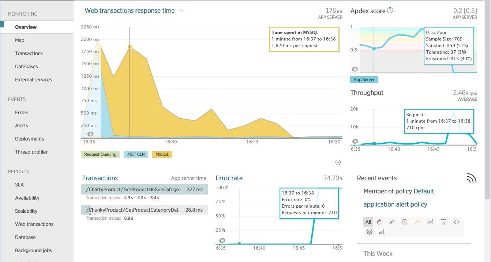

_Figure 17._

**The New Relic overview screen, showing the throughput and latency of a sample web application for a short period of time**

In the case of the ChattyIO request, it is necessary to examine what resources the request is utilizing in order to explain why it might be performing poorly. The telemetry should enable you to drill into a request to determine what it is actually doing. New Relic provides the transaction trace facility for this purpose, as shown by the following image:
 
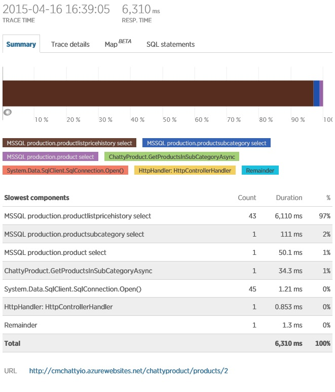

_Figure 18._

**The New Relic transaction trace screen showing the details of the actions performed by a request**

In this example, it is clear that the operation is using significant database resources; it opens 45 database connections. Also, one particular query is executed 43 times. This database activity could explain why the operation takes time to run.

Drilling deeper into the trace details shows how the operation is using connections; it creates a new connection for each query rather than recycling an existing connection:
 
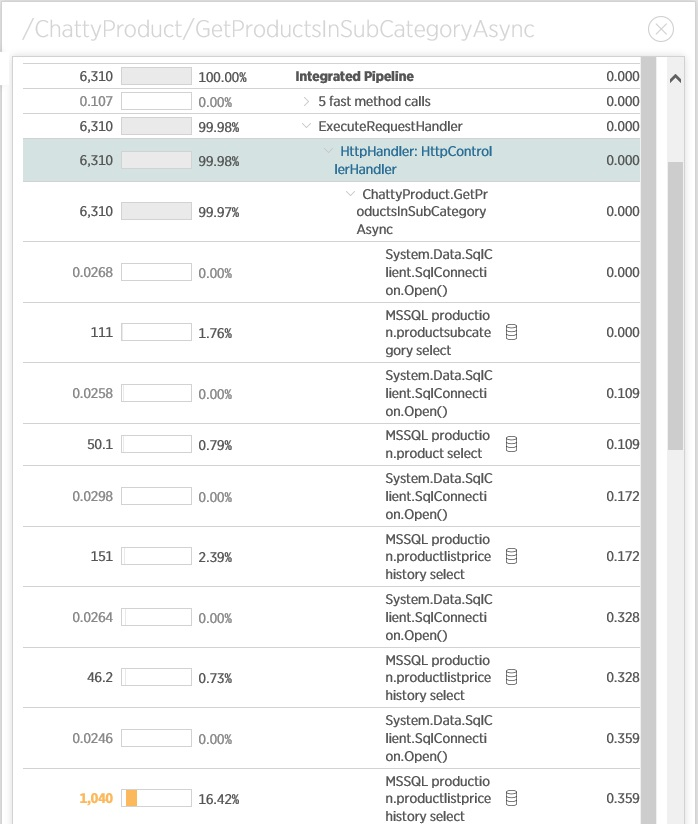

_Figure 19._

**The New Relic transaction trace details screen showing detailed activity performed by a request**

This operation should be investigated further to see how it might be optimized to reduce the number of connections and database requests it is performing. 

### <a name="correlationsbetweenexceptionsandtheactivitybeingperformed" href="#" xmlns:xlink="http://www.w3.org/1999/xlink"><span /></a>Correlations Between Exceptions and the Activity Being Performed
Exceptions are a primary cause of frustration to users. They can indicate bugs in the code, but they can also result from overutilization or inaccessibility of shared resources. You may need to identify the causes of exceptions quickly to avoid loss of business or financial penalties.

Returning to the New Relic overview screen (see below), it is apparent that something suddenly caused a substantial number of exceptions to occur. This resulted in a significant drop in performance (Apdex fell to 0). The throughput actually spiked at this point, but this was probably due to the errors causing operations to fail quickly:
 
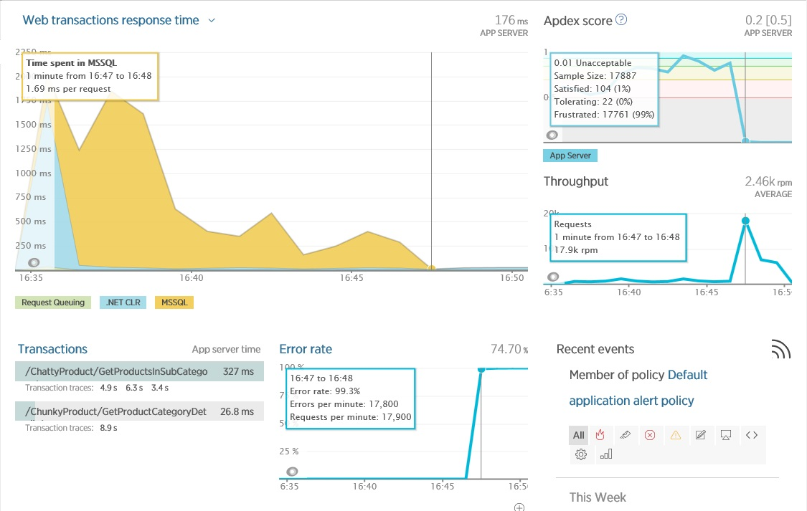

_Figure 20._

**The New Relic overview screen highlighting the excessive error rate**

Examining the Errors screen in New Relic provides more information, including the details of the exception and the operation that was being performed at the time. Note that New Relic also enables you to drill down further into an exception to obtain the full call stack:
 
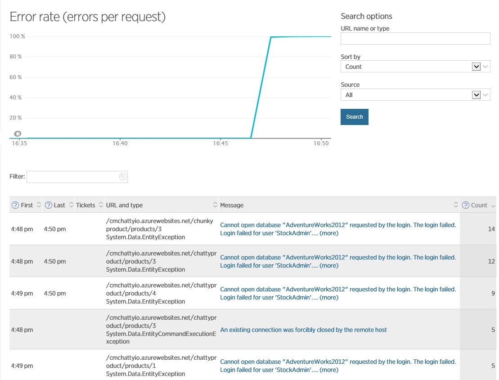

_Figure 21._

**The New Relic error details screen showing where exceptions were raised**

This information gives you the insight that the problem lies with the database; for some reason logins are failing. This could be related to the previous scenario; a request opening an excessive number of connections can exhaust connection resources, preventing other concurrent requests from connecting to the database, or it could be due to issues with the database itself, necessitating that you investigate the database server (this scenario is described in the “<a href="#servicemetrics" xmlns:dt="uuid:C2F41010-65B3-11d1-A29F-00AA00C14882" xmlns:xlink="http://www.w3.org/1999/xlink" xmlns:MSHelp="http://msdn.microsoft.com/mshelp">Service Metrics</a>” section later in this document).

### The Performance of Underlying Application Frameworks
Your application code might utilize additional runtime elements or services such as the .NET Framework, ASP.NET, or other frameworks. It is important to understand the effects that these items have on the performance of your system. In many cases, they provide their own metrics that help you to understand the tasks that they are performing, and enable you to optimize your own code to use these frameworks more efficiently. For example, the performance counters for the .NET Framework include metrics showing how frequently garbage collection is performed, and the residency of objects on the heap. You can use this information to identify misallocation of memory and associated resources in your application code (such as creating arrays that are unnecessarily large, repeatedly creating and destroying large strings, or failing to dispose of resources correctly).

In the case of a web application you are also dependent on a web server to accept requests and forward them to your code for processing, before passing responses from your code back to the client. Business workloads for cloud applications can be highly asymmetric, with unpredictable bursts of high activity followed by more quiescent periods. A typical web server can handle a maximum number of concurrent requests, so in a busy environment requests may be queued waiting for processing resources to become available. If a request is not handled quickly it may time out and cause an error response to be returned to the client. In some systems, if the number of queued requests exceeds a specified threshold, subsequent requests might be discarded immediately and an error response returned to the client. This is an in-built safety mechanism to prevent a sudden large influx of requests from overwhelming the system. This strategy also prevents the client from being blocked when the request is likely to time out and fail anyway. However, if this happens frequently then it may be necessary either to spread the load across more web servers or investigate the application to see whether it is using threads appropriately. Therefore, it is important to monitor the rate at which requests are processed and the number of requests that are queued awaiting processing. The facilities available vary between web servers, but as an example, for ASP.NET, you can use the following performance counters:

* **ASP.NET\Requests Queued**, which indicates the number of outstanding requests waiting to be serviced. 
* **ASP.NET\Requests Current**, which shows the total number of requests currently being handled. This includes requests that are queued, those that are executing, and those that have responses waiting to be sent back to the client. If this figure exceeds the value of the _requestQueueLimit_ configuration parameter defined in the _processModel_ section of the configuration file used by the web server than ASP.NET will begin rejecting requests. 
* **ASP.NET Application\Requests Executing**, which displays the number of currently executing requests for a specified web application.
* **ASP.NET Application\Requests/sec**, which shows the current throughput of the specified web application.
* **ASP.NET Application\Request Execution Time**, which indicates the time taken (in milliseconds) to run most recently executed request.
* **ASP.NET Application\Wait Time**, which indicates the time (in milliseconds) that the most recent request was queued.
	
> **Note**: The default configuration for IIS, ASP.NET and .NET Framework is optimized for CPU bound applications. For applications that are I/O bound, such as web services consuming external resources, several configuration changes can drastically improve response times.

To continue the web server example, you should always investigate the possible causes of high queue-length. A large number of outstanding requests in conjunction with low processor, network utilization, or memory occupancy might indicate saturation of a backend service. For example, if a cloud service uses Azure SQL database to store and retrieve data incorporating complex, expensive application logic that runs in the database (stored procedures and triggers), then the SQL database itself might be the bottleneck that is causing subsequent requests to back up. If backend services indicate that they have spare capacity but there is still a high queue-length, then the culprit could be thread starvation on the web server caused by performing synchronous operations that block. For more information, see the [Synchronous I/O](https://github.com/mspnp/performance-optimization/tree/master/SynchronousIO) anti-pattern.

The example chart below (generated by using New Relic) shows the request queueing time for a sample application that performs synchronous I/O operations. The time spent queueing increases because the synchronous operations are causing thread starvation and IIS is not being able to complete the requests in a timely manner. Note that the processor time and network utilization (shown in the second chart) are very low. 
 
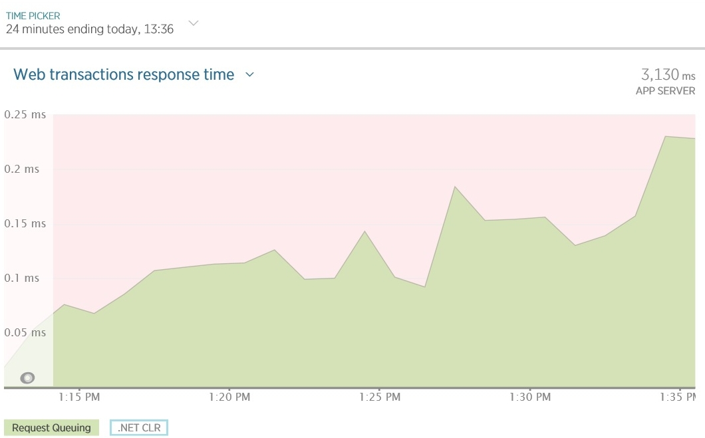

_Figure 22._

**Chart showing increasing request queueing times for a web application performing synchronous I/O operations**
 
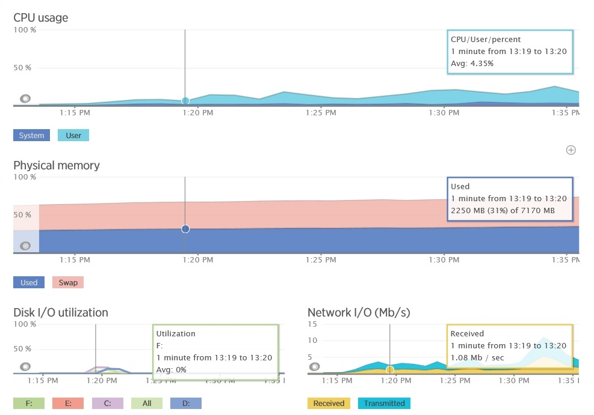

_Figure 23._

**Chart showing resource utilization for the same web application**
 
As the request length grows, response times will be degraded and the number of failed requests will increase. The graph below shows the results of a load test performed against the sample application. As the user load increases the latency (operations time) and throughput (operations/sec) also increase. Note that the linear left-hand axis indicates the user load, and the logarithmic right-hand axis measures the latency and throughput. When the user load passes 6000, requests start to generate exceptions (either time outs and/or rejections caused by excessive queue length). These exceptions actually cause a drop in latency and an increase in throughput, but this is only because the exceptions are being raised more quickly than the time taken to process successful requests.
 
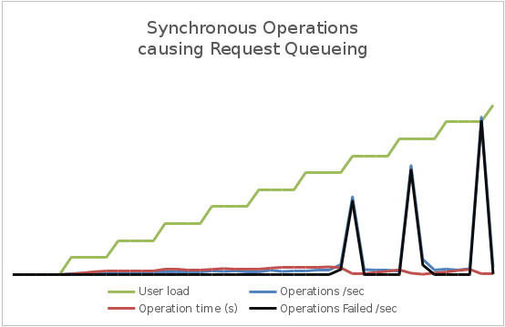

_Figure 24._

**Load-test results for the web application**

### How Much Headroom is Available in the System
As the user-base grows, so will the workload that the system has to undertake. You need to ensure that the system will not reach a point where it will suddenly collapse under the strain. To do this, you need to monitor the overall resource use in your system (CPU, memory, network bandwidth, and so on) and plot this information against throughput and/or latency. This form of measurement also frequently requires that you capture infrastructure level metrics and telemetry for other services on which your application depends. These items are described more fully later in this document, but as an example, the following image shows the telemetry from New Relic for the sample application described in the previous points. This image shows the CPU utilization and memory occupancy for the application. CPU use is relatively constant and within reasonable bounds (the system has multiple CPUs which is why utilization can exceed 100%), although it spikes with throughput. You should check to see whether the system started generating exceptions at this point; if so, then this could indicate a potentially lack of capacity as the workload grows. Memory utilization is also fairly stable, although it is increasing slowly. If this occupancy continues to increase without any change in workload than this might indicate a memory leak:
 
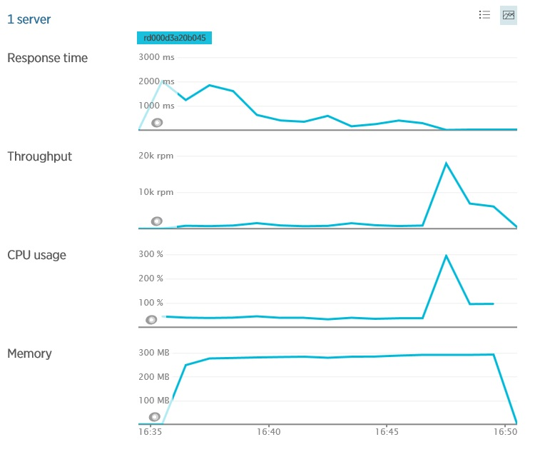

_Figure 25._

**The server resources section of the New Relic overview screen**

# System Metrics
System metrics enable you to determine what system resources your system is using and where resource conflicts could be occurring. These metrics are concerned with tracking machine-level resources such as memory, network, CPU, and disk utilization. These metrics can give an indication of underlying conflicts within a computer.

You can also track these metrics to spot trends in performance. If they grow linearly over time, then examine the workload to find out whether it is increasing and may need to be spread across more hardware (virtual or real). If the workload is constant, then the increase in the values of metrics might be due to external factors, such as background tasks and jobs, additional network activity or device I/O.

## How to Gather System Metrics
You can use [Azure Diagnostics](https://msdn.microsoft.com/library/azure/gg433048.aspx) to collect diagnostic data for debugging and troubleshooting, measuring performance, monitoring resource usage, traffic analysis and capacity planning, and auditing. After the diagnostic data is collected it can be transferred to a Windows Azure storage account for processing. 

Another approach is to use [PerfView](https://www.microsoft.com/en-us/download/details.aspx?id=28567) to collect and analyze performance data. PerfView enables you to perform investigations covering:

* **CPU utilization**. PerfView uses sampling at millisecond intervals to build a trace of which code is being run. Each sample includes a complete stack trace of the currently executing thread. PerfView aggregates these stack traces together, and you can use the stack viewer utility to see what your code is doing, and isolate code that could be misbehaving.
* **Managed memory**. PerfView can take snapshots of the managed heap that is controlled by the .NET Framework garbage collector. These snapshots are converted into an object graph, enabling you to analyze the lifetime of managed objects.
* **Unmanaged memory**. PerfView can also capture events that track each time the operating system allocates or frees a block of memory. You can use this information to monitor how your application uses unmanaged memory.
* **Timing and blockages**. PerfView can capture information whenever threads sleep and wake up and visualize the results. You can use this information to determine whether your application is being blocked, and where. This analysis is especially useful if CPU utilization is low, highlighting that poor performance must be due to some other cause, such as disk, network, or memory contention.
	 
PerfView was originally designed to run locally, but it can be used to capture data from web and worker roles in cloud services; you can use the [AzureRemotePerfView](https://www.nuget.org/packages/AzureRemotePerfView) NuGet package to install and run PerfView remotely on the servers hosting your web and worker roles. You can download the data captured and analyze it locally.

Windows Azure Diagnostics and PerfView are useful for providing data that can be used "after the fact" to examine resource use. However, most DevOps staff members need to see a live view of the performance data to detect and head-off possible performance problems before they occur. APM tools can provide this information. For example, the Troubleshooting tools for a web application provided by the Azure portal can display a series of graphs showing memory, CPU, and network utilization:
 
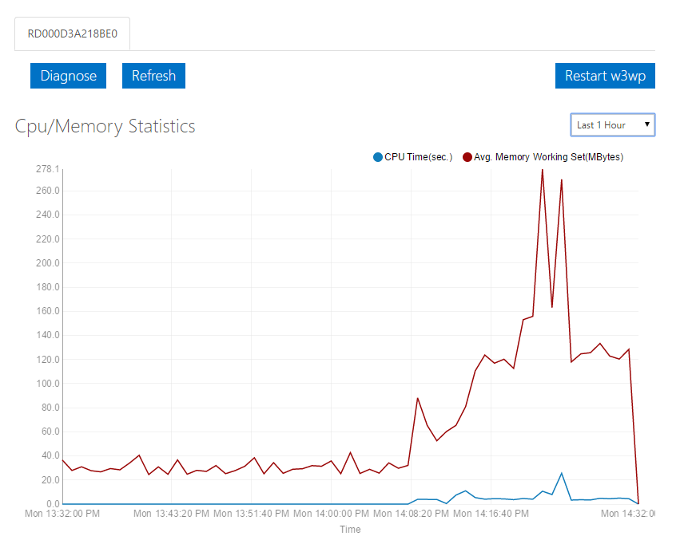

_Figure 26._

**CPU and memory utilization displayed by the Azure troubleshooting tools from the portal**

The Azure web portal provides a health dashboard for most services based on common system metrics:
 
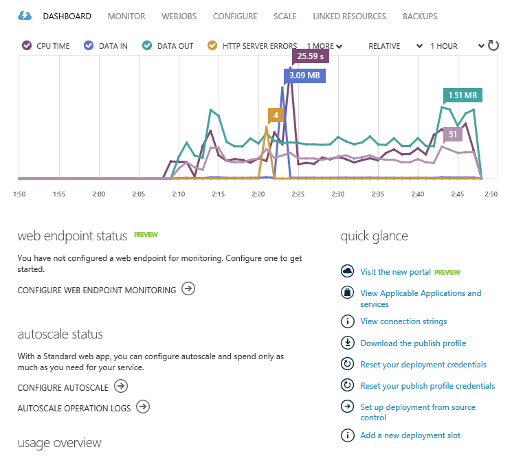

_Figure 27._

**Service dashboard in the Azure web portal**

Similarly, the Diagnostics pane in the Azure web portal lets you track a configurable subset of the most frequently used performance counters. You can also define rules that alert an operator if the values of a counter repeatedly exceed a specified threshold during a define period:
 
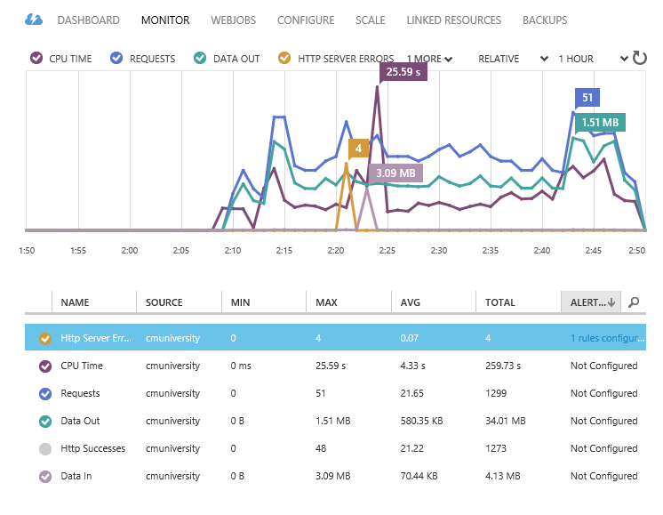

_Figure 28._

**The service monitor page in the Azure web portal**

The Azure web portal retains the performance data for 7 days. If you require access to data older than this, then you can save it to Azure storage by configuring Azure Diagnostics, and subsequently download it for analysis.

The Websites Process Explorer in the Azure portal enables you to drill into the details of individual processes running on a web site highlighting correlations between the use of various system-level resources.
  
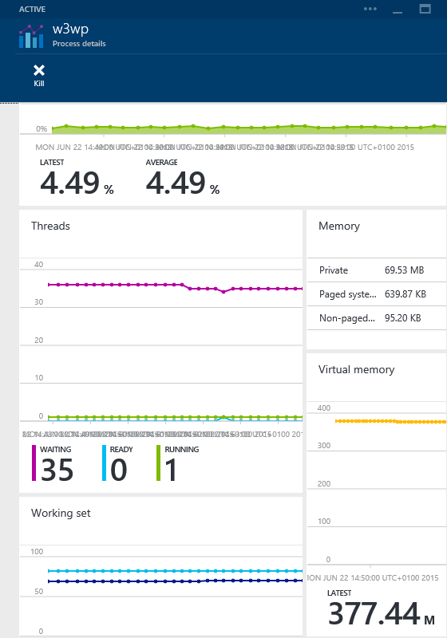

_Figure 29._

**The Websites Process Explorer in the Azure portal**

New Relic and many other APMs provide similar features; the following sections illustrate some examples.

## What to Look For
The system resources to monitor fall into a number of broad categories covering the utilization of memory (physical and managed), network bandwidth, CPU processing, and local disk I/O. The following sections describe what to look for in more detail.

### Physical Memory Utilization
All processes running on Windows use virtual memory which is mapped to physical memory transparently, by the operating system. The virtual memory for a process comprises two elements: reserved memory and committed memory:
 
* Reserved memory is not associated with physical memory or paged memory stored in the page file; it simply describes the amount of memory reserved for the process and is recorded in the virtual address descriptor (VAD) for the process. This memory is not associated with physical storage and can be ignored for performance monitoring purposes.
* Committed memory has an associated allocation of physical memory and/or paged memory held in the page file on disk. You should track how your system uses committed memory, 
	
You can monitor committed memory utilization to determine whether the machines hosting your cloud services and web sites are configured with sufficient physical memory to support the typical business workload while allowing some headroom for spikes in activity without excessive paging. You should track the following performance counters:

* The **Memory\Commit Limit** counter, which indicates the cap for all committed memory by all processes on the machine. Usually this is a fixed ratio of the physical memory, calculated by the operating system (the article [How to determine the appropriate page file size for 64-bit versions of Windows](https://support.microsoft.com/kb/2860880) provides more details.) On an 8Gb machine this figure will be approximately 11Gb. 
* The **Process\Private Bytes** counter, which indicates the volume of committed memory for the process. If sum of all processes private bytes attempted to exceed the commit limit described above, the system has run out of memory and applications will likely fail.
* **The Memory \% Committed Bytes in Use** counter, which represents the percentage commit charge of the system. This figure is the result of dividing the value of the **Memory/Committed Bytes** counter by the value of the **Memory\Commit Limit** counter. A high value for the **Memory \% Committed Bytes in Use** counter is an indication of system wide pressure for memory resources. 

> **Note**: Windows also provides the _Process\Virtual Bytes_ counter. Ostensibly this counter indicates the total amount of virtual memory a process is using. However, you should treat this counter with caution as it actually shows the amount of committed plus reserved memory for the process; it might be a large figure that has limited impact on performance. For example, examining the _Process/Virtual Bytes_ and _.NET CLR Memory\ # total reserved bytes_ counters of the w3wp process when it starts it can show that this process occupies 18Gb of memory, even though the committed memory is only 175Mb. 
> 
> Reserved memory allows for dynamic RAM to be added and processes can convert their reservations into physical memory. 
	
There are two possible causes of a process running out of memory; either the process exceeds its virtual memory space or the operating system is unable to commit more physical memory to the process. The second case is the most common. You can use the performance counters described below to assess memory pressure:

* **Memory\Available Mbytes**. Ideally the value of this counter should be more than 10% of the amount of physical memory installed on the machine. If the amount of available memory is too small then the system might have to start paging the memory for active processes to and from disk. This can cause the system to run very slow. If the system runs out of physical memory completely then the result will be severe delays and/or a complete hang of the system.
* **Memory\% Committed Bytes In Use**. The system commit limit will often grow when the system commit charge nears the limit, which happens at around 90%. If the system commit charge reaches 95% then the system commit limit will very likely not grow any further and the system is in danger of running out of memory. Once the system commit limit has been reached, then the system can no longer provide committed memory to processes and further memory requests will be denied system-wide. Many processes do not handle this condition and will crash as a result, thus is vitally important never to hit this limit.
* **Memory\Pages/sec**. This counter indicates how much paging the system is performing. You can determine the effect that paging is having on the volume of disk I/O by multiplying this counter by the value of the system-wide _Physical Disk\Avg.Disk sec/Transfer_ counter. This calculation should yield a value between 0 and 1 that indicates the proportion of disk access time that the system is using to read or write virtual memory pages to the page file. A value in excess of 0.1 means that the system is spending more than 10% of the disk access time performing paging. If this value is sustained it can indicate a lack of physical memory.
	
You should also consider that higher memory footprint can cause memory fragmentation (free physical memory is not necessarily available in contiguous blocks), so a system that indicates that it has _X_Mb of free memory might not be able to satisfy a request to allocate all of this memory to a process.

Many APM tools provide views that indicate process and system memory usage without the need for an in-depth understanding of how memory works. As an example, the load-test graph below shows the throughput (left-hand axis) and response time (right-hand axis) for an application running under constant load. After approximately 6 minutes, the throughput suddenly drops and the response time leaps, recovering a couple of minutes later.
 
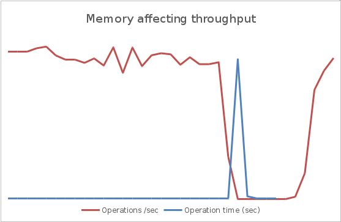

_Figure 30._

**Load-test results for a sample application**

The telemetry for the application (captured by using New Relic) shows an excessive memory allocation causing operations to fail with a process recycle. Memory grows while disk utilization goes up due to paging. These are the classic symptoms of a memory leak:
 
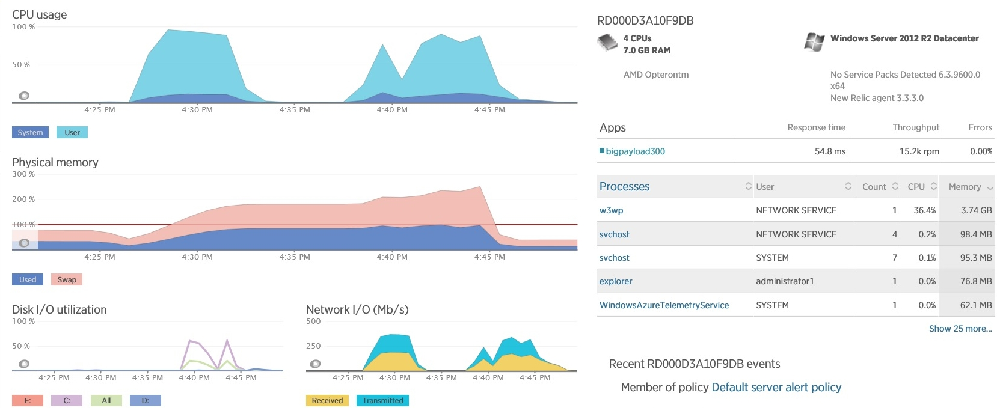

_Figure 31._

**Telemetry for the sample application showing excessive memory allocation**

> **Note**: The article [Investigating Memory Leaks in Azure Web Sites with Visual Studio 2013](http://blogs.msdn.com/b/visualstudioalm/archive/2013/12/20/investigating-memory-leaks-in-azure-web-sites-with-visual-studio-2013.aspx) provides a walkthrough showing how to use Visual Studio with Azure Diagnostics to monitor memory use for an Azure web application.

### <a name=" managedmemoryutilization " href="#" xmlns:xlink="http://www.w3.org/1999/xlink"><span /></a>Managed Memory Utilization
Applications that run using the .NET Framework utilize managed memory that is controlled by the common language runtime (CLR). The CLR maps managed memory to physical storage. Applications request managed memory from the CLR, and the CLR is responsible for managing these requests as well as collecting memory that is no longer used and freeing it up, making it available for other requests. The CLR can also compact managed memory, moving data structures around to reduce the amount of fragmentation.

Managed applications have an additional set of performance monitoring counters available. The article [Investigating Memory Issues](https://msdn.microsoft.com/magazine/cc163528.aspx) provides a detailed description of the key counters, but the following ones are the most important:

* **.NET CLR Memory\# Total Committed Bytes** which represents the memory for the process that is backed by physical storage and page space on disk. It reflects the amount of committed memory allocated to the process and should correspond closely to the value of the Process/Private Bytes counter.
* **.NET CLR Memory\# Total Reserved Bytes** which indicates the amount of reserved memory for the process. It should closely correspond to the value of the **Process\Virtual Bytes** counter less the value of the **Process\Private Bytes** counter.
* **.NET CLR Memory\Allocated Bytes/sec**, which shows the volatility of the manage heap. This figure can be positive or negative depending on whether the application is creating or destroying objects in memory. This counter is updated after each garbage collection cycle. Continually positive values for this counter can indicate that the application is leaking memory; consuming memory but not releasing it properly.
* **.NET CLR Memory\# Bytes** in all Heaps which indicates the total managed heap size of the process.
* **.NET CLR Memory\% Time in GC** which records the percentage of elapsed time that was spent in performing a garbage collection since the last collection cycle. This counter is usually an indicator of the work done by the garbage collector on behalf of the application to collect and compact memory. A garbage-collector friendly memory pattern shows low GC usage (< 10%) with few survivals across generations.
	
### Network Latency on the Web Server
The performance of the network is especially critical for cloud applications as it is the conduit through which all information must pass. Network problems can cause poor performance which will inevitably result in dissatisfaction for users attempting to access your system.
 
Network latency is the round-trip duration of a request. Currently Windows does not provide any performance counters to measure the latency of individual application requests directly. However, Resource Monitor is a great tool for analyzing live network traffic entering and exiting the local machine (you can configure Remote Desktop when you deploy an Azure cloud service to log in locally on a server hosting a web or worker role). Resource Monitor provides information such as packet loss and overall latency for active TCP/IP sessions. Packet loss gives an idea of the quality of the connection. Latency shows how long it takes for a TCP/IP packet to do a round trip. Figure 29 shows the Network tab in Resource Monitor, highlighting the Packet Loss and Latency data:
 
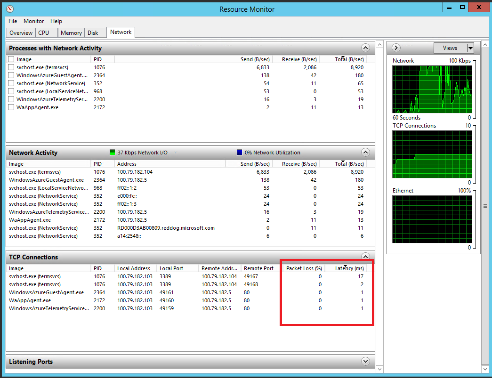

_Figure 32._

**Resource Monitor showing local network activity**

### Network Utilization on the Web Server
You can capture the following performance counters, either by connecting directly to the web server from Performance Monitor if you need to view the data in near real-time, or by configuring Azure Diagnostics to download the data for analysis in batches:

* **Network Adapter\Bytes Sent/sec** and **Network Adapter\Bytes Received/sec** which show the rate at which bytes are being transmitted and received by the network adapter.
* **Network Adapter\Current Bandwidth**, which is an estimate of the available bandwidth (measured in bits per second) for the network adapter.
	
```You can then use these formulae to calculate network utilization: 
%Network utilization for Bytes Sent = 
        ((Bytes Sent/sec * 8) / Current Bandwidth) * 100```

```%Network utilization for Bytes Received = 
        ((Bytes Received/sec * 8) / Current Bandwidth) * 100```

If these figures are persistently close to, or at, 100%, then network saturation might be an issue and it may be necessary to distribute network traffic by running more instances of an application in the cloud. 

The Azure Portal can display the network utilization aggregated across all instances of a cloud service as well as for the individual role instances. The portal provides the _Network In_ and _Network Out_ counters which correspond to the _Bytes Received/sec_ and _Bytes Sent/sec_ performance counters:
 
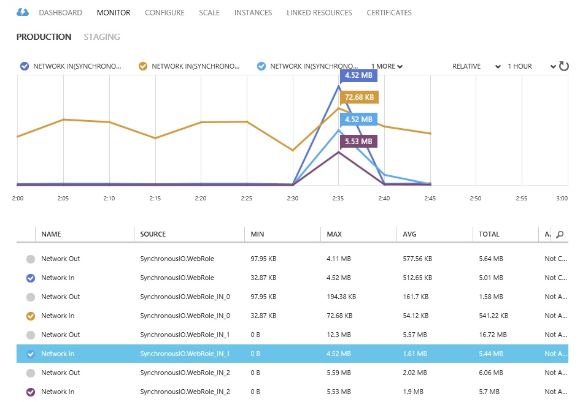

_Figure 33._

**Monitoring network utilization using the Azure Management Portal**

If network latency is high but network utilization is low, then the network is unlikely to be the bottleneck. High CPU utilization for instances of the application might indicate that more processing power is required or that the processing load should be spread across more instances. If CPU utilization is low, then this could be an indication of backend pressure on one or more infrastructure services on which the application depends. For example, complex queries sent to Azure SQL Database might consume considerable database processing resources. In this situation, spreading network traffic across more instances could actually exacerbate performance issues by overloading the database server, resulting in higher latency. You should also be prepared to monitor how backend services are used. For more information, see the “<a href="#servicemetrics" xmlns:dt="uuid:C2F41010-65B3-11d1-A29F-00AA00C14882" xmlns:xlink="http://www.w3.org/1999/xlink" xmlns:MSHelp="http://msdn.microsoft.com/mshelp">Service Metrics</a>” section of this guidance.

> **Note**: To capture detail information about network latency and bandwidth, consider downloading [PsPing](https://technet.microsoft.com/sysinternals/jj729731.aspx) from Windows Sysinternals.

### Volume of Network Traffic
Another frequent cause of latency is high volumes of network traffic. You should investigate the density of traffic directed to backend services. Many APM tools enable you to monitor the traffic directed towards a cloud service or web application. Figure 31 shows an example taken from New Relic illustrating the network traffic entering and exiting a web API service. The volume of traffic (~200Mb/sec worth data entering and exiting the service) results in high latency for clients consuming the service:
 
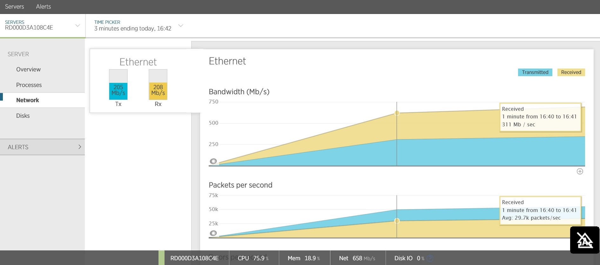

_Figure 34._

**Levels of network traffic entering and exiting a web service**

The Azure Management portal also provides tools for specific services, such as resource utilization views for Azure SQL database and storage accounts. These items are described in more detail in the “<a href="#servicemetrics" xmlns:dt="uuid:C2F41010-65B3-11d1-A29F-00AA00C14882" xmlns:xlink="http://www.w3.org/1999/xlink" xmlns:MSHelp="http://msdn.microsoft.com/mshelp">Service Metrics</a>” section.

### Network Overheads and Client Location
High network latency could be due to network overheads, such as protocol negotiation, packet loss, and routing effects. Latency and throughput can be greatly influenced by the locality of clients and the services that they access. If clients in different regions experience significant but consistent variations in network performance when accessing your service, consider distributing instances across regions, and ensure that each region has sufficient instances to handle the workload for that region.

The graphs below show how locality can affect latency and throughput for a sample service. A constant stream of requests was dispatched to the service from a set of clients for three minutes. The same service was used for both tests. In the first test, the clients were in the same region as the service, and in the second test the clients were in a different region. In both graphs, the left-hand axis indicates the throughput in transactions per second, while the right-hand axis measures the response time in seconds:
 
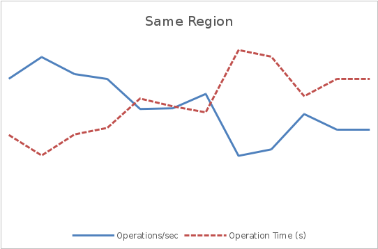

_Figure 35._

**Throughput and response time for clients located in the same region as the service**
 
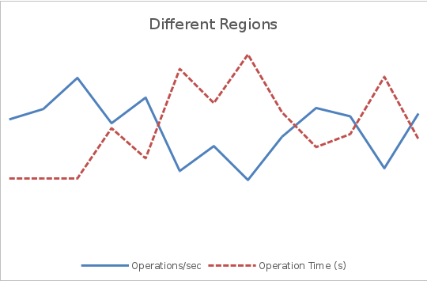

_Figure 36._

**Throughput and response time for clients located in a different region from the service**

In the first graph, the average throughput is 4 or 5 times higher than that of the second graph, while the average response time is about ¼ that of the second.

### Network Message Payload Size
The payload size of requests and responses can have a significant effect on throughput. An XML payload can be substantially larger than its JSON equivalent, while a binary payload might be the most compact but least portable. Apart from consuming bandwidth, bigger payloads might also consume additional CPU cycles to generate before sending, and parse after receiving.

The following graphs illustrate the effects that different payload sizes can have on the throughput and response time for a sample service. As before, the same service was used to generate both graphs. In both tests, all clients were located in the same region as the service:
 
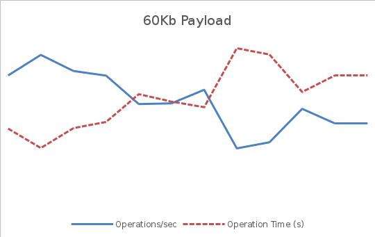

_Figure 37._

**Throughput and response time for requests with a 60Kb payload**
 
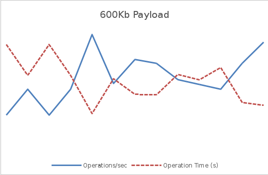

_Figure 38._

**Throughput and response time for requests with a 600Kb payload**

In this case, increasing the size of the payload by a factor of 10 decreased the throughput and extended the response time by a corresponding amount. You should however note that this is an artificially _clean_ test that focuses purely on network traffic; it does not take into account any additional work required to create and consume the bigger payloads, and there is no other network traffic generated by other clients or services. 

### Chatty Network Requests
Chattiness is another common cause of network delays. Chattiness is the frequency of network sessions needed to complete a business operation. 

To help detect chattiness, all operations should include telemetry that captures the number of times an operation has been invoked, by whom, and when. The telemetry should also capture the size of network requests entering and leaving an operation. A large number of relatively small requests in a short period of time sent by the same client might indicate that the system could be optimized by combining operations together so that they can be invoked by a single request (this will require redesigning the relevant parts of the application and services used). As an example, Figure 22 below shows the telemetry data captured for a sample system that exposes a web API. Each API call makes one or more calls to a database implemented by using Azure SQL Database. During the monitoring period, throughput averaged 13,900 requests per minute. Figure 23 shows the database telemetry indicating that during the same period the system made in excess of 250,000 calls to the database per minute. These figures indicate that each web API call makes an average of nearly 18 database calls, highlighting possible chattiness in the web API.
 
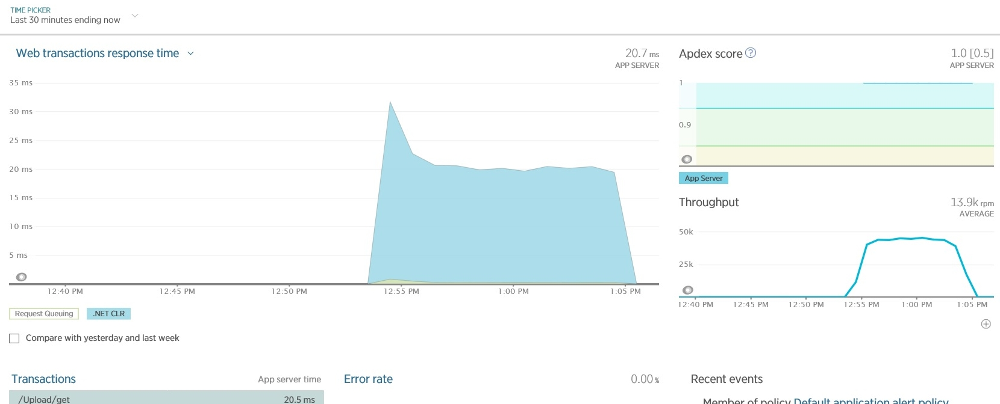

_Figure 39._

**Throughput and response time for web API calls made to a sample system**
       
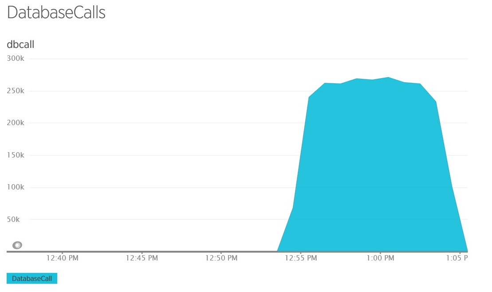

_Figure 40._

**Database calls made by the same system during the same period**

### CPU Utilization at the Server and Instance Level
CPU utilization is a measure of how much work the machine is performing, and CPU availability is an indication of how much spare processor capacity the machine has available to handle additional load. You can capture this information for a specific server running your web service or cloud application by using an APM. Figure 38 shows the statistics gathered by using New Relic:
 
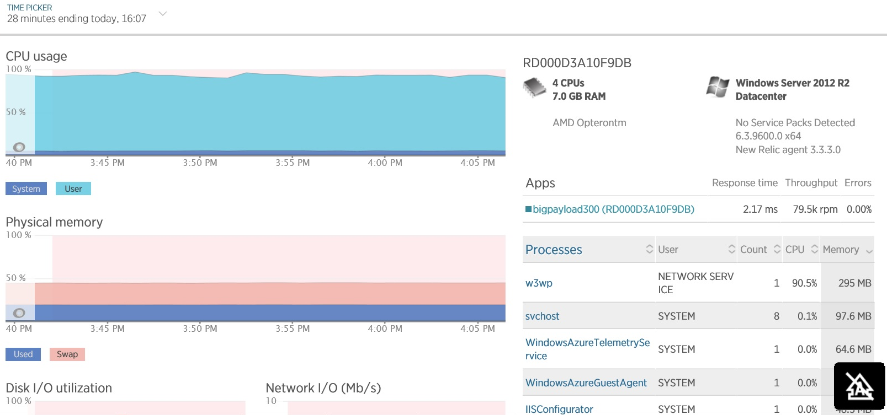

_Figure 41._

**CPU utilization for a server reported by New Relic**

The Azure web portal enables you to view the CPU data for individual instances of a service:
 


_Figure 42._

**CPU utilization for service instances reported by the Azure web portal**

High CPU utilization could be the result of an application generating a large number of exceptions which can overwhelm the processor. You can track the rate of exceptions occurring using the techniques described in the sections “<a href="#businesstransactionsthatfail" xmlns:dt="uuid:C2F41010-65B3-11d1-A29F-00AA00C14882" xmlns:xlink="http://www.w3.org/1999/xlink" xmlns:MSHelp="http://msdn.microsoft.com/mshelp">Business Transactions that Fail</a>” and “<a href="#correlationsbetweenexceptionsandtheactivitybeingperformed" xmlns:dt="uuid:C2F41010-65B3-11d1-A29F-00AA00C14882" xmlns:xlink="http://www.w3.org/1999/xlink" xmlns:MSHelp="http://msdn.microsoft.com/mshelp">Correlations Between Exceptions and the Activity Being Performed</a>”. Similarly, overutilization of the CPU could be due to an application requiring the CLR to perform a lot of garbage collection. You should examine the CLR garbage collection counters as described in the “<a href="#managedmemoryutilization" xmlns:dt="uuid:C2F41010-65B3-11d1-A29F-00AA00C14882" xmlns:xlink="http://www.w3.org/1999/xlink" xmlns:MSHelp="http://msdn.microsoft.com/mshelp">Managed Memory Utilization</a>” section to determine whether this is the case. You should also ensure that your system is configured with an appropriate garbage collection policy; see [Fundamentals of Garbage Collection](https://msdn.microsoft.com/library/ee787088.aspx) for more details.

Low CPU utilization with high latency might indicate that locking is causing access to processors to be blocked. This could be due to issues in the application code such as improper use of locks or waiting for synchronous I/O operations to complete (see the [Synchronous I/O](https://github.com/mspnp/performance-optimization/tree/master/SynchronousIO) anti-pattern for an example).

Processor affinity can result in a single processor or processor-core becoming a bottleneck. This situation can arise in Azure cloud applications based on worker roles where the system design is too closely coupled; requests from a web role are always directed at a specific worker role rather than balancing the load. 

### CPU Utilization on a Specific Server
A CPU operates in two modes; user mode and privileged mode. In user mode, the CPU is executing instructions that constitute the business logic of an application. In privileged mode, the CPU is performing operating system kernel-level functions such as handling network or file I/O, allocating memory, paging, scheduling and managing threads, and context switching between processes. Use the following performance counters to track processor utilization:

* **Processor\%Privileged Time**, which tracks the amount of time the CPU is spending in privileged mode. In privileged mode, the CPU is performing operating system kernel-level functions such as handling network or file I/O, allocating memory, paging, scheduling and managing threads, and context switching between processes. A consistently high value shows that the system is spending a significant amount of time performing operating system functions and could be due to high volumes of I/O, attempting to schedule a large number of processes or threads, excessive paging, or memory management overheads (for example, performing garbage collection).
* **Processor\%User Time**, which indicates the proportion of time the CPU spends running application code rather than performing system functions.
* **Processor\%Processor Time**, which is the overall time the processor is active (in user mode and privileged mode.) CPU utilization naturally fluctuates between high and low values as processes perform their work, but a sustained high level of utilization (in excess of 80%) indicates that the CPU is likely to become a bottleneck and the system may benefit from distributing the workload over more machines or to a different service tier. For example, the [Busy Front End](https://github.com/mspnp/performance-optimization/tree/master/BusyFrontEnd) anti-pattern describes the situation where processing is initially concentrated in a single web role, but how using a queue to offload processing to a separate worker role can improve response time.
	
### Processes Exhibiting High-Levels of CPU Utilization
You can investigate possible causes of high CPU utilization in a controlled test environment by simulating business workloads. This strategy should help to eliminate effects due to external factors. Additionally, many APM tools support thread profiling to assist in performing CPU stack analysis. Figure 43 shows an example with New Relic.
 


_Figure 43._

**Profiling by using New Relic**

After capturing the profile data for a period of time, New Relic enables you to analyze the information and examine the operations that account for the greatest CPU time. This can give developers points on which to focus in the application code if specific functions are consuming disproportionate amounts of CPU resources.

This technique is very powerful but comes at a cost as it can impact the performance of real users if it is performed on a live system. Enable thread profiling selectively, and disable it again quickly once the profiling process has completed.

### Excessive Disk I/O
High disk I/O rates are commonly caused by data intensive tasks such as performing business analytics on a virtual machine, or image processing. Additionally, many data storage services such as Azure SQL database, Azure Storage, and Azure DocumentDB utilize disk resources extensively; these services are covered in the “<a href="#servicemetrics" xmlns:dt="uuid:C2F41010-65B3-11d1-A29F-00AA00C14882" xmlns:xlink="http://www.w3.org/1999/xlink" xmlns:MSHelp="http://msdn.microsoft.com/mshelp">Service Metrics</a>” section. If you are building a custom virtual machine (VM) to run your own services, you may need to monitor disk access carefully to verify that you have selected an appropriate disk configuration to ensure good performance. 

Memory-intensive applications can also generate considerable quantities of disk activity. If an application overcommits memory the result can be excessive paging, resulting in a corresponding slowdown in performance. In this scenario, it may be necessary to scale the role up to provide more memory, scale the role out to spread the load over more instances, or examine how your application is using memory (it might have a leak).

In Azure, virtual disks (disks that are attached to VMs) are created within storage accounts. Azure supports two tiers of storage: Standard, and Premium. The performance of virtual disks is measured in terms of input/output operations per second (IOPS), and throughput in MB per second. IOPS is a common performance benchmark used to measure the rate at which storage requests can be processed. Standard tier disks use "spinning" media and support up to 500 IOPS when attached to a standard tier VM, or 300 IOPS when attached to a basic tier VM. The maximum throughput is 60MB/s. Premium tier disks use SSD storage and can operate at up to 5000 IOPS or 200MB/s. Using RAID disks in a striped configuration inside a VM can increase throughput, although I/O throttling will occur at the VM level as well. See [Sizes for Virtual Machines](https://azure.microsoft.com/documentation/articles/virtual-machines-size-specs/) for more information.

> **Note**: IOPS and throughput measure two different aspects of I/O performance. An application that performs a large number of small disk transfers is likely to hit the IOPS limit regardless of the throughput. Similarly, an application that makes a small number of large transfers may reach the throughput limit before approaching the IOPS maximum. Applications need to balance the size and volume of disk transfer operations to maximize overall performance.

You can measure the potential performance of different disk configurations by uNote: sing the [SQLIO Disk Subsystem Benchmark Tool](http://www.microsoft.com/download/details.aspx?id=20163). For example, running this utility on a VM with a single Standard tier disk generates the following results:
 
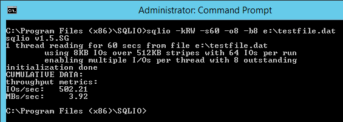

_Figure 44._

**I/O Performance of a single Standard tier disk in a VM**

These results show that the disk can operate at around 500 IOPS, as expected. Repeating the same test over a disk comprising 4 RAID stripes (each stripe is a Standard tier disk), yields these results:
 
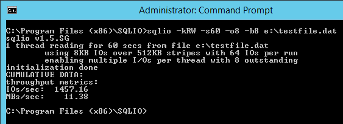

_Figure 45._

**I/O Performance of a striped disk in a VM**

In this case, striping supported over 1400 IOPS. Using the same technique with Premium tier storage you can achieve up to 80,000 IOPS per VM with extremely low latencies for read operations.

Note that throttling can occur if your application’s IOPS or throughput exceed the allocated limits for a Premium Storage disk (5000 IOPS) or if the total disk traffic across all disks on the VM exceeds the disk bandwidth limit available for the VM. To avoid throttling, you should limit the number of pending I/O requests for disk based on the scalability and performance targets for the storage account containing the disk and based on the disk bandwidth available to the VM. For more information, see [Premium Storage: High-Performance Storage for Azure Virtual Machine Workloads](https://azure.microsoft.com/en-us/documentation/articles/storage-premium-storage-preview-portal/#scalability-and-performance-targets-when-using-premium-storage).

The Azure web portal enables you to monitor the overall I/O throughput of a virtual machine, but many APM tools provide information about the activity of individual disks. The example below shows disk performance information captured by using New Relic. The statistics gathered include the IOPS, enabling you to see how close the disk is to its performance limits. Notice that when the I/O utilization is at 100% the IOPS measurement is around 1500. This corresponds to the maximum throughput for a 4-striped RAID configuration based on Standard tier disks:

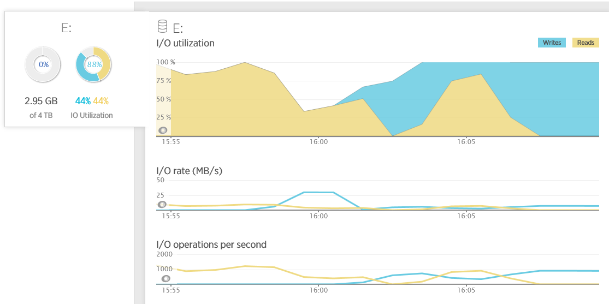

_Figure 46._

**Disk activity captured by using New Relic**

You can also use the following performance counters for the Physical Disk object to monitor disk I/O activity on the VM:

* **Avg. Disk sec/Read and Avg. Disk sec/Write**. These are the average times, in seconds, of read or write operations respectively. Disk latency times can be greatly affected by software and disk cache, but these counters provide reliable measures of disk performance. For a payload size of less than 64KB a threshold value of less than 15ms is a goal for good performance. However, it is quite normal to see times spiking higher than this value due to the way in which the storage devices handle erratic I/O patterns.
* **Disk Transfers/sec**. This is the rate at which read and write operations are being performed by a disk. Note that a single disk transfer might correspond to more than a single IOPS, depending on the size of the transfer. This counter can help determine the amount of I/O throughput on the disk. Disk hardware and performance can differ greatly, so there is no generic threshold for this counter. With that said, for a given disk, try to establish the baseline performance, and then compare that baseline if you suspect poor performance. For example, if you know the disk can sustain 100 disk transfers per second and stay within a 10ms response time, but you later find a response time of 50ms with only 20 disk transfers, this indicates a significant slowdown in the disk hardware (this is common with physical disks shared between multiple servers). In this case, it may be necessary to spread the load over more disks or switch to a higher tier of virtual machine. 
* **Disk Bytes/Sec, Disk Read Bytes/sec, and Disk Writes Bytes/sec**. You can use these counters to measure how the size of I/O requests affects performance. A 1MB I/O request is 256 times larger than a 4KB I/O request, so it needs more time to be serviced. If you observe disk response times greater than 15ms, check the average I/O size by using the Avg. Disk Bytes/Read and Avg. Disk Bytes/Write counters. 
* **Avg. Disk Queue Length, Avg. Disk Read Queue Length, and Avg. Disk Write Queue Length**. These counters measure the number of disk I/O requests that are waiting to be serviced. These counters are calculated values based on the following formula:

	```Avg. Disk Queue Length = (Disk Transfers/sec) * ( Disk sec/Transfer)```

	These counters are particularly important for applications that push disk performance to its limit; these applications are likely to generate long disk queues.

* **% Idle Time**. This counter indicates the proportion of the time that the disk was in the idle state. A disk is considered idle when there are no pending requests. This counter is probably less useful than it appears. While the disk queue length is 1 or more, then the %idle time for that disk is 0. Therefore, you can only really use this counter to ascertain when the disk is not doing anything rather than how busy it is (use the queue length counters for that purpose). 
	
<a name="servicemetrics" href="#" xmlns:xlink="http://www.w3.org/1999/xlink"><span /></a># Service Metrics

Most Azure cloud applications and services depend on one or more other services to handle items such as storage, caching, and messaging. The performance of these dependent services can have a significant effect on the way in which your system works, so it is important to monitor these items.

A common issue concerns backend pressure. This is a phenomenon that occurs when an application sends more work than the dependent service can handle, causing requests to backup. This can result in increased latency and reduced throughput for the application. Additionally, connections to these services could fail at any time, and third-party services may throw exceptions if they are invoked in unexpected ways.

## How to Gather Service Metrics
The Azure portal provides specific service metrics for many of the Azure services (such as Storage, SQL Database, Service Bus, and so on). These metrics are often far more detailed than those available through third-party APM tools or profilers:

Dependent services might also provide their own application-level metrics. These metrics are often useful to determine whether the service is nearing capacity saturation, or that it is not currently available. Examples include information about connection utilization, authentication exceptions for security services, process throttling during periods of high usage, and impending limitations caused by nearing storage quotas. These exceptions are very important in the context of distributed systems because they can indicate high backend pressure or service failure. 

## What to Look For
All external dependent services that participate in business operations should be monitored for failures and SLA violations. The details of any exceptions need to be captured if possible. The following sections summarize what to look for when monitoring some commonly used Azure services. Note that these sections highlight the most frequently used metrics only; there are many others and it is not feasible to cover them all.

### Azure Storage Latency
Azure storage is used by many applications to store data, either as blobs or in tabular format. Azure storage also provides queues. In addition, Azure storage underpins other core features. For example, the disks for Azure VMs are created in blob storage. Monitoring the end-to-end latency of storage operations can give you a key insight into why an application is running slow. 

The Azure portal provides diagnostics that measure the end-to-end latency of requests for a storage account, and the average server latency for blobs. The end-to-end latency captures telemetry from client-side and includes any network overhead, whereas server latency illustrates only the server-side telemetry:
 
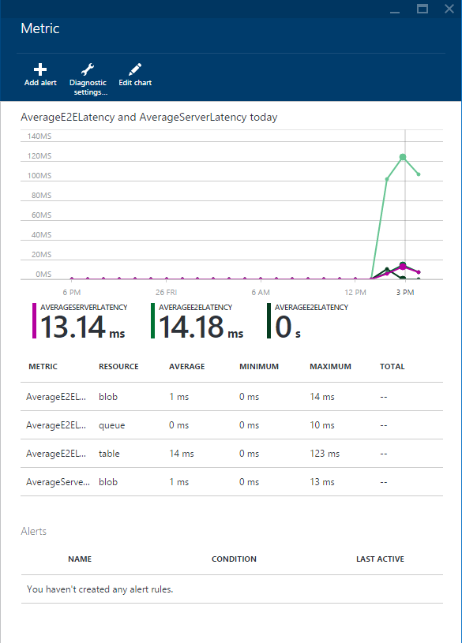

_Figure 47._

**Storage latency captured by using the Azure portal**

### Volumes of Traffic and Throttling Errors for Azure Storage
You should analyze the rate of data ingress and egress from storage. Azure storage has [scalability and performance targets](https://azure.microsoft.com/documentation/articles/storage-scalability-targets/) that specify the maximum rates at which you can expect data to be stored and retrieved. These targets are based on the storage tier (storage in the Premium storage tier has higher targets than that in the Standard tier). If your applications reach these limits, performance will be throttled. It is important to understand that the documented limits are based on a specific size of request payload, and the limits for your applications may vary if you use payloads of different sizes.

You can view the rates of ingress and egress for each storage account by using the Azure portal, and you can also monitor the number of throttling errors that have occurred. Frequent throttling indicates a need for better partitioning to spread your transactions across multiple partitions, or that you should switch to a storage tier that provides increased throughput. 
 
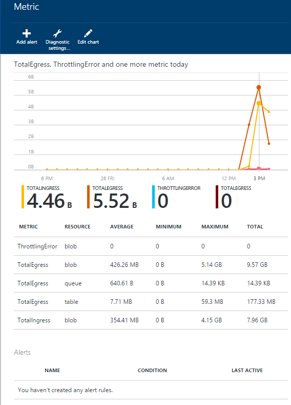

_Figure 48._

**Storage ingress, egress, and throttling errors captured by using the Azure portal**

### Azure SQL Database Connection Failures
Frequent connection failures to a resource such as Azure SQL Database can indicate that either the database has become unavailable for some reason, or that connection resources have been exhausted. In either case, performance is likely to suffer. You can determine the health of the database quickly by viewing the page for the server in the Azure portal, as shown below:
 
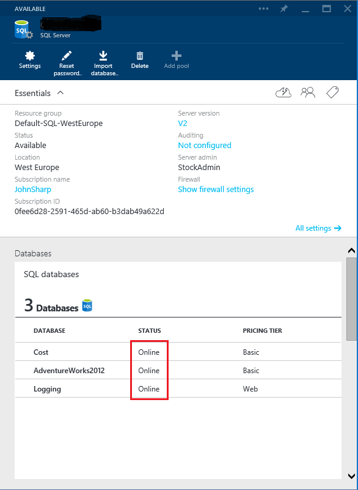

_Figure 49._

**Database availability shown by using the Azure portal**

Azure SQL Database servers are managed by Microsoft. A database that is unavailable should become available very quickly (Microsoft provide SLAs that guarantee that databases will be available for at least 99.9% of the time). Therefore, the most likely cause of connection failure (other than using an incorrect connection string) is lack of connection resources.

Connection resources can become exhausted if an instance of an application tries to make too many concurrent connections, or the number of instances that are attempting to connect exceed the number of connections supported by the database or your application (your connection pool size might be too small). You can track the number of connections errors by using an APM that monitors interactions between your application and the database. The example below shows New Relic reporting a number of connection errors and the associated exception details. In this case, the application is consuming too many connections from the connection pool causing subsequent requests to time out.
 


_Figure 50._

**Database connection errors captured by using New Relic**

Connection throttling can occur at the database if the rate at which requests are received would overload the database server. It is a safety mechanism to prevent the server from failing. Connection throttling can be caused by a high volume of requests where each request requires significant CPU resources (probably involving complex queries, stored procedures, and database triggers). You can monitor the degree of connection throttling from the Azure web portal.

### Azure SQL Database DTU Rates
Resources are allocated (and charged) to instances of Azure SQL Database in terms of Database Throughput Units, or DTUs. A DTU is a metric that combines CPU, memory, and I/O usage. You purchase Azure SQL Database capacity by selecting an appropriate performance tier. Different database performance tiers offer different quantities of DTUs, ranging from 5 DTUs at the Basic level up to 1750 DTUs at the Premium/P11 level. If an application attempts to exceed the DTU quota for the databases that it is using, connections may be throttled or rejected. You can track how an application is burning through DTUs by monitoring the DTU percentage metric for the database in the Azure portal. The following image shows how a burst in activity caused by a large number of connections affects the database resource utilization:
 
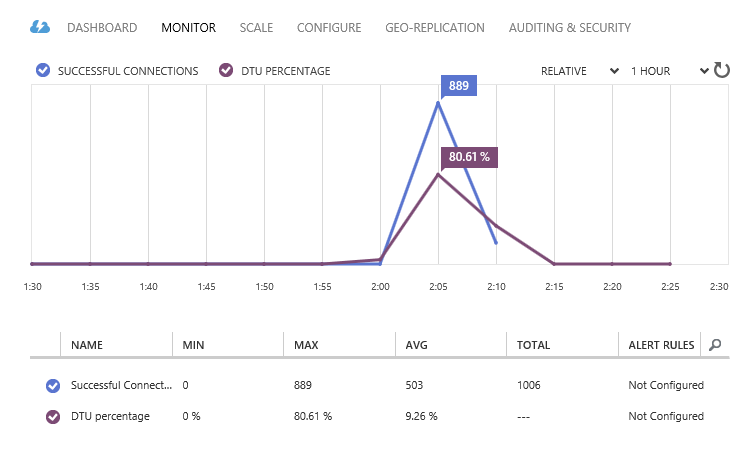

_Figure 51._

**Monitoring DTU rates in the Azure web portal**

### Excessive Azure SQL Database Resource Utilization
Higher performance tiers provide more capacity in terms of available CPU, memory, and storage. Higher performance tiers are also more expensive, so you should carefully monitor how your applications are using the database. Database access is carefully governed to provide the resources required to run your database workloads up to the limits allowed for your selected performance tier. If your workload is hitting the limits in one of CPU/Data IO/Log IO limits, you will continue to receive the resources at the maximum allowed level, but you are likely to see increased latencies for your queries. These limits will not result in any errors, but just a slowdown in your workload, unless the slowdown becomes so severe that queries start timing out (as described previously).

You can use the SQL dynamic management views to obtain statistics about the resources that queries and other database operations performed by your application have used in the last hour. The following query retrieves information from the _sys.dm_db_resource_stats_ dynamic management view to obtain information about how your database’s resource consumption fits within the resource limits provided by the current performance tier, (fit percent) making an assumption that you want to have your database run within 80% of your performance level limits.

```
SELECT 
     (COUNT(end_time) - SUM(CASE WHEN avg_cpu_percent > 80 THEN 1 ELSE 0 END) * 1.0) / COUNT(end_time) AS 'CPU Fit Percent'
    ,(COUNT(end_time) - SUM(CASE WHEN avg_log_write_percent > 80 THEN 1 ELSE 0 END) * 1.0) / COUNT(end_time) AS 'Log Write Fit Percent'
    ,(COUNT(end_time) - SUM(CASE WHEN avg_data_io_percent > 80 THEN 1 ELSE 0 END) * 1.0) / COUNT(end_time) AS 'Physical Data Read Fit Percent' 
FROM sys.dm_db_resource_stats
```

If this query returns a value less than 99.9% for any of the three resource dimensions, you should consider either moving to the next higher performance level or tune your application to reduce the load on the Azure SQL Database. 

You can also monitor these statistics from the Azure web portal:
 
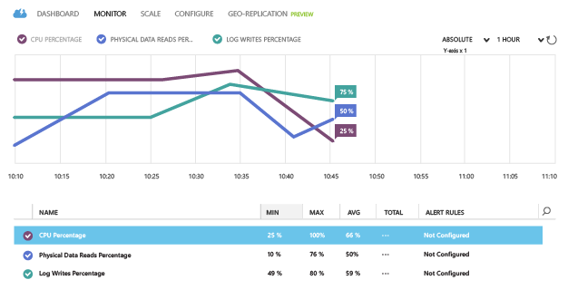

_Figure 52._

**Azure SQL Database Statistics in the Azure web portal**

### Query Performance
Poorly performing database queries can affect throughput and latency significantly, and can account for excessive resource utilization. You can obtain information about queries from the dynamic management views, but you can see the same data visually by using Azure SQL Database Management portal. The Query Performance page displays cumulative statistics for queries executed against the database in the last hour, including the total amount of CPU time and I/O consumed by each query:
 
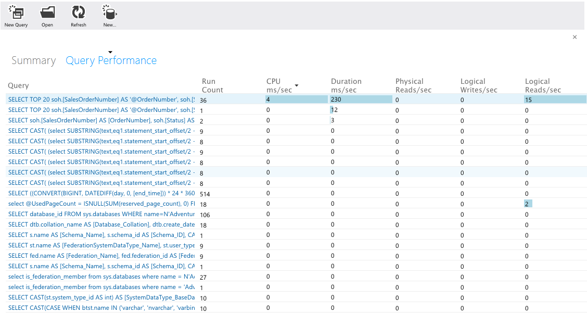

_Figure 53._

**The Query Performance page in the Azure SQL Database Management portal**

You can drill down into queries that are consuming considerable resources to view the query execution plan. This data can help to identify why a query is running slowly, and can give a database designer information on how the query might be better phrased to improve performance. 
 
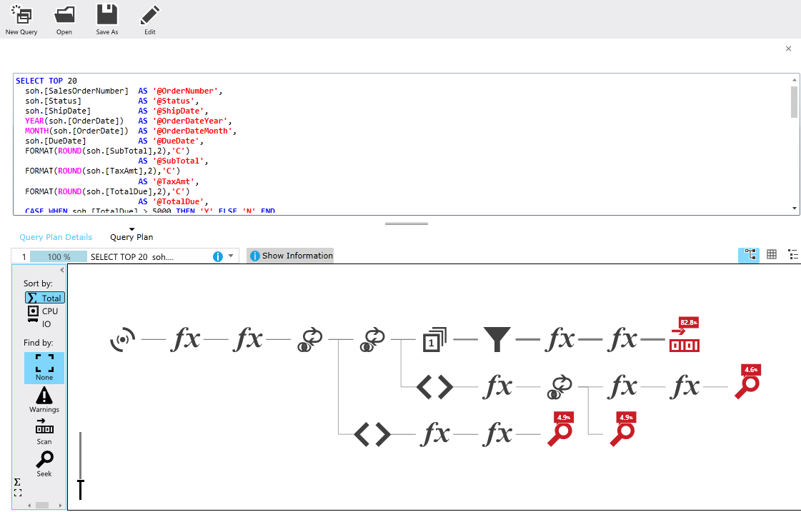

_Figure 54._

**The Query Execution plan page in the Azure SQL Database Management portal**

### High Volumes of Database Requests
High volumes of traffic between the application and the database can also indicate a lack of caching. You should track the data retrieved by database requests to ascertain whether the same data is being continually retrieved or updated, and assess whether this data could be cached locally within the application (if the same sessions reuse the same data), or by using a shared cache (if the same data is referenced by multiple sessions from different users). The Query Performance page in the Azure SQL Database Management portal provides useful information in the form of the Run Count for each query:
 
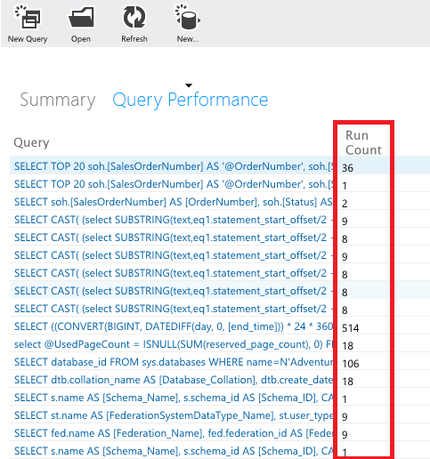

_Figure 55._

**Monitoring the frequency of queries in the Azure SQL Database Management portal**
Queries that have a high Run Count do not necessarily return exactly the same data values each time (the queries are parameterized by the query optimizer), but can act as a starting point for determining candidate data for caching.

### Azure SQL Database Deadlocks
Applications that implement sub-optimal transactions can generate deadlocks. When a deadlock occurs, the work performed by an instance of the application has to be rolled back, requiring that the application has to repeat the transaction. Deadlocks can slow users down by requiring that operations need to be repeated. You can monitor SQL Azure Database for occurrence of deadlock situations by using the Azure portal. If deadlocks occur, consider tracing the application at runtime to determine the cause and take the necessary steps to modify the code.

### Service Bus Latency
High levels of latency when accessing Service Bus can act as a bottleneck on performance. These could be due to a number of reasons, including transient network effects (such as loss of connectivity or using a Service Bus namespace that is distant from the client), contention for a Service Bus entity (topic, queue, subscription, relay, event hub), and permission errors. The Azure web portal provides a limited set of performance metrics for applications that use Service Bus queues, topics, and event hubs. However, you can capture more detailed performance information, including the latency of send and receive operations and the faults that occur when connecting to a Service Bus entity, by incorporating the [Microsoft Azure Service Bus Client Side Performance Counters](https://www.nuget.org/packages/WindowsAzure.ServiceBus.PerformanceCounters) into your code. 

### Service Bus Connection Refusals and Throttling
Service Bus queues, topics, and subscriptions are subject to quotas that can limit the throughput of these items. These quotas concern factors such as the maximum size of a queue or topic, the number of concurrent connections, and the number of concurrent receive requests. If these quotas are exceeded then the Service Bus will reject further requests until the load drops. These quotas are documented in the article [Service Bus quotas](https://azure.microsoft.com/documentation/articles/service-bus-quotas/). You can monitor the volume of traffic being processed by Service Bus queues and topics by using the Azure web portal.

Event Hub capacity is purchased in terms of throughput units. One throughput equates to 1 MB/s data ingress and 2MB/s data egress. If an application exceeds the rate of ingress and/or egress available, then it will be throttled. As with queues and topics, you can monitor the rate of traffic flow into and out of Event Hub by using the Azure web portal. Note that ingress and egress quotas are enforced separately to prevent a sender exceeding the ingress quota from slowing down the rate at which events are processed.

### Service Bus Failed Requests and Poison Messages
Monitor the rate at which messages fail to be processed, and the volume of poison messages. Depending on how your application is designed, a single message which causes an exception might stall the entire system and prevent it from being able to continue processing messages. Ensure that failed requests and poison messages are logged. 

### Event Hub Quota Exceptions
Cloud applications can use Azure Event Hub as an ingestor to capture large volumes of data (in the form of asynchronous events) generated by clients. An event hub supports event ingress at massive scale with low latency and high availability, and is used in conjunction with other services to which it can pass data for processing.

The capacity of an event hub is controlled by the number of throughput units that have been purchased. A single throughput unit supports:

* Ingress: Up to 1MB per second or 1000 events per second.
* Egress: Up to 2MB per second.
	
Ingress is throttled to the amount of capacity provided by the number of throughput units purchased. Sending data above this amount results in a "quota exceeded" exception. This amount is either 1 MB per second or 1000 events per second, whichever comes first. Egress does not produce throttling exceptions, but is limited to the data transfer volume provided for by the purchased throughput units: 2 MB per second per throughput unit. 

You can monitor the performance of an event hub by viewing the dashboard for the event hub in the Azure portal:
 


_Figure 56._

**The dashboard for an event hub in the Azure portal**

If you receive publishing rate exceptions or are expecting to see higher rate of egress, check how many throughput units you have purchased for the namespace in which the event hub was created. You can view this information by using the Scale tab in the Service Bus page of the Azure portal:
 
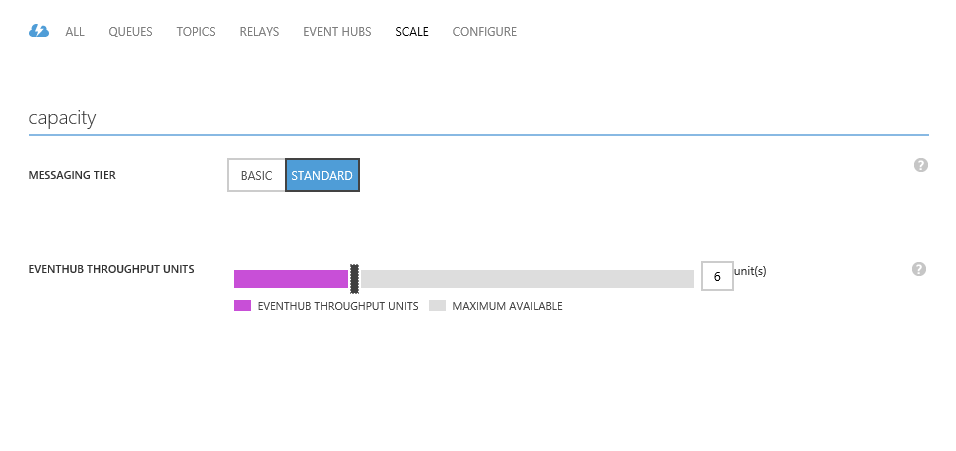

_Figure 57._

**Allocating Event Hub throughput units in the Azure portal**

### Event Hub Check Pointing Failures and Lease Takeovers
An application can use an _EventProcessorHost_ object to distribute the work requested by event hub consumers by partitioning the workload. An _EventProcessorHost_ object creates an Azure block blob for each partition in the event hub, and uses these blobs for managing leases for a partition. Each _EventProcessorHost_ instance performs the following two tasks:

1. Renew Leases: Tracks leases currently owned by the host and continuously renews the leases.
2. Acquire Leases: Each instance continuously polls all the lease blobs to check whether there are any leases it must acquire in order for the system to achieve a balanced state.
	
You should monitor for frequent event hub check pointing failures and lease takeovers. Check point failure can result in messages being reprocessed, and lease takeover results in some messages being reprocessed affecting throughput.

### Dependent Service Usage
Aside from Storage, SQL Database, and Service Bus, many Azure applications make use of an increasing number of services available from Microsoft. It is not feasible to cover each service in detail. Instead, you should be prepared to monitor the key facets that each of these services provide (why are you using them?) As an example, if you are using Azure Redis Cache to implement a shared caching solution, you can measure how effective the cache is by capturing information to answer the following questions:

* How many cache hits and misses are occurring each second against the cache cluster? 

	This information is readily available in the Azure portal:
 
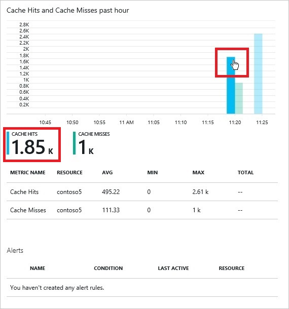

_Figure 58._

**Monitoring Azure Redis Cache hits and misses in the Azure web portal**
	
Once the system has reached steady state, if the cache hit ratio is low, then you might need to adjust the caching strategy of the application.

* How many clients are connecting to the cache? 
	
	You can monitor the Connected Clients counter by using the Azure portal. The connected clients limit is 10,000. Once this limit is reached subsequent connection attempts to the cache will fail. If you regularly hit this limit, then you should consider partitioning the cache amongst users. 

* How many operations (store and retrieval) is the cache cluster processing per second?

	Monitor the Gets and Sets counters for the cache in the Azure portal.

* How much data is stored in the cache cluster?

	The Used Memory counter in the Azure portal shows how much memory is occupied by the cache. Remember that the pricing tier that you selected when creating the cache determines the amount of memory available to the cache.

* What is the cache access latency?

	You can use the Cache Read and Cache Write counters in the Azure portal to track the rate at which data is read from and written to the cache (measured in KB/s).

* How busy is the cache server?

	Monitor the Server Load counter in the Azure portal. This counter records the percentage of cycles in which the Redis Cache server is busy processing and not waiting idly for messages. If this counter reaches 100 it means the Redis Cache server has hit a performance ceiling and the CPU can't process work any faster. If you see a sustained high Server Load then you will also likely see timeout exceptions in the client. In this case you should consider scaling up or partitioning your data into multiple caches.
	
## Summary
The following list summarizes many of the points raised in this document: 

* Use telemetry to capture performance data for:
	* Business operations. Monitor all web API calls that handle a service request or perform a critical business activity.
	* Browser metrics. Capture the details of new and returning users, and possibly the type of browser that they are using. This data can affect capacity and testing results.
	* Network utilization for traffic entering and exiting your service.
	* Memory occupancy of the service, and how it corresponds to the business workload.
	* Processor utilization and how threads are used.
	* Queue lengths and duration of queueing times for requests.
	* Event hub ingress and egress rates.
	* Backend services; latency and volume of requests sent/received, failures, and utilization.
* Use telemetry based on alerts to track SLA violations and business exceptions.
* Performance monitoring and telemetry should not be used to only pinpoint performance problems (the reactive approach). Be proactive and utilize the information to compose a picture for headroom for business growth against current capacity for services or unexpected business cycles.
* Performance analysis is an exploration; observe, measure, validate, and iterate. Not every avenue yields positive results. It is a journey that should be budgeted for in the engineering process. It is an ongoing, continual process that lasts as long as the system remains live.
* Don’t become fixated on the low-order details. Evaluate the engineering effort in the context of the end-to-end solution. You do not need to understand the gory details of every performance counter. Instead you should focus on how they relate to the business activities being performed and analyze them in these terms.
* Plan telemetry to support an investigative approach into the operations of the system, but ensure that this level of telemetry can be selectively enabled or disabled as it can have a significant impact on the day-to-day performance of the system. For example, sampling using a profiler should not be performed routinely, but only enabled when an operator is attempting to determine the cause of a performance problem.
* Leveraging instrumentation based on built-in operating system features rather than incorporating APM-specific probes is very desirable this approach the does not require you to modify your application code. If possible, use the application configuration to selectively enable and disable the telemetry data captured.
	
## References

* [Performance Analysis Primer](#insertlink#) 
* [Load test in the cloud](https://www.visualstudio.com/get-started/test/load-test-your-app-vs)
* [Performance anti-patterns](https://github.com/mspnp/performance-optimization)
* [Building Big: Lessons Learned from Azure Customers](https://channel9.msdn.com/Events/Build/2014/3-633).
* [Get started with Visual Studio Application Insights](http://azure.microsoft.com/documentation/articles/app-insights-get-started/)
* [AppDynamics: Windows Azure Monitoring](http://www.appdynamics.co.uk/cloud/windows-azure/)
* [New Relic Application Performance Management on Azure](http://azure.microsoft.com/en-gb/documentation/articles/store-new-relic-cloud-services-dotnet-application-performance-management/)
* [Windows Performance Counters](http://blog.whatwoulddando.com/2012/06/13/windows-performance-counters/)
* [Investigating Memory Leaks in Azure Web Sites with Visual Studio 2013](http://blogs.msdn.com/b/visualstudioalm/archive/2013/12/20/investigating-memory-leaks-in-azure-web-sites-with-visual-studio-2013.aspx)
* [Fundamentals of Garbage Collection](https://msdn.microsoft.com/library/ee787088.aspx)
* [Performance Counters for ASP.NET](https://msdn.microsoft.com/library/fxk122b4.aspx)
* [APDEX.org](http://apdex.org/overview.html)
* [Investigating Memory Issues](https://msdn.microsoft.com/magazine/cc163528.aspx)
* [Monitor a Storage Account in the Azure Management Portal](https://azure.microsoft.com/documentation/articles/storage-monitor-storage-account/)
* [Monitoring Azure SQL Database Using Dynamic Management Views](https://msdn.microsoft.com/library/azure/ff394114.aspx)
* [How to Monitor Redis Cache](https://azure.microsoft.com/documentation/articles/cache-how-to-monitor/)
	
