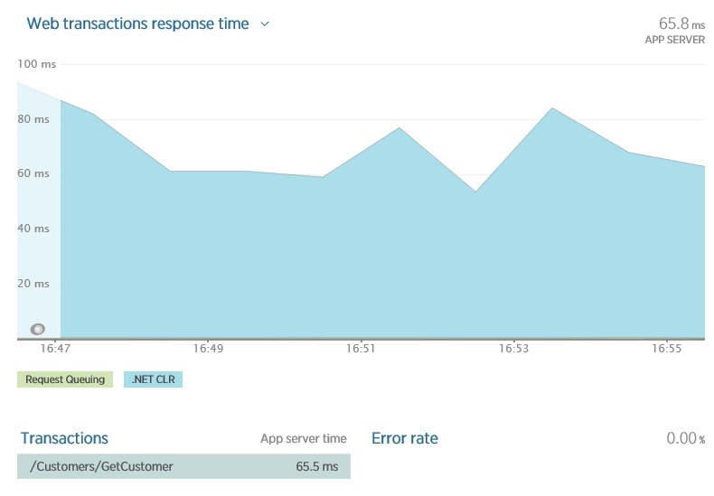
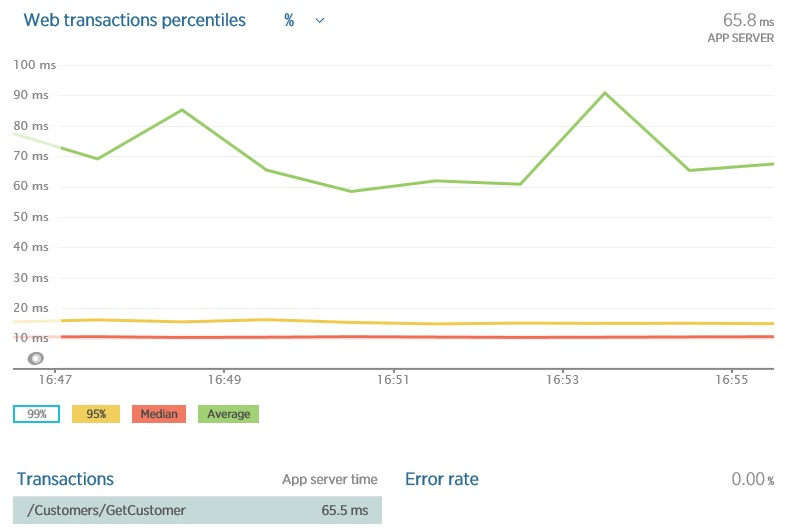
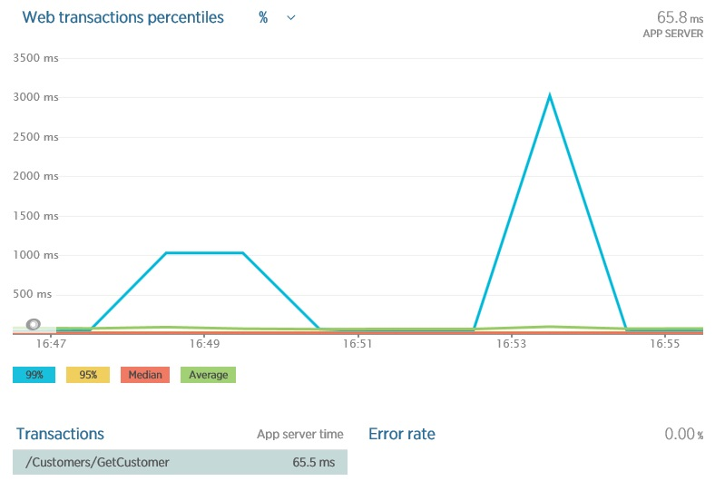
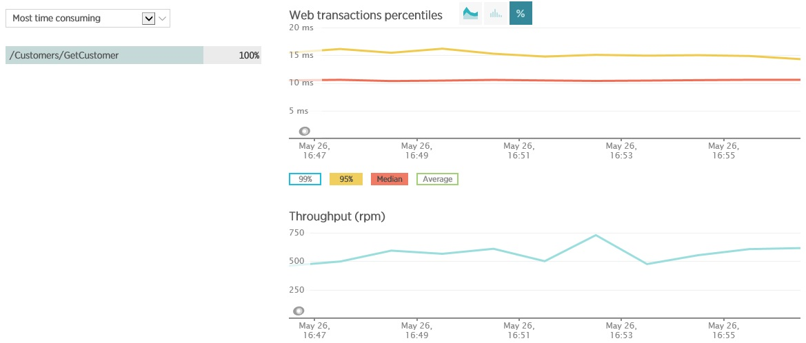
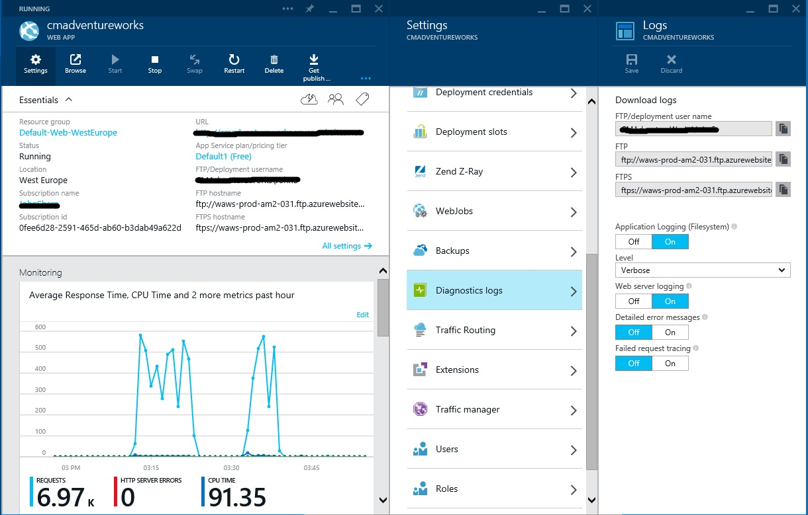
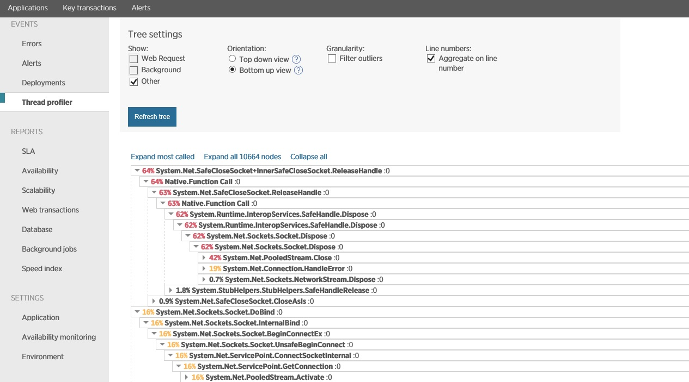
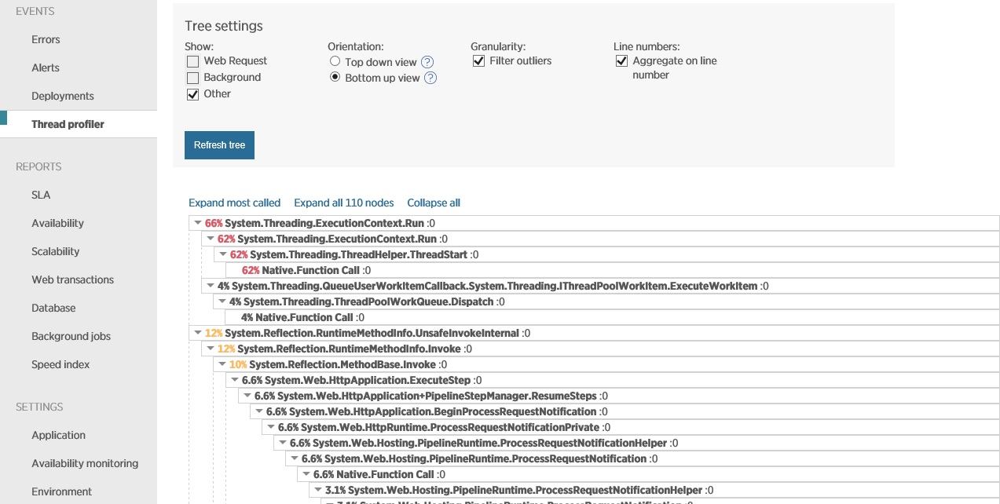

# Performance Analysis Primer
[!INCLUDE [header](../_includes/header.md)]

Cloud applications can be complex systems comprising many moving components spread over a wide geography. Assessing performance in this environment is a challenging task. Performance analysis is frequently a reactive process that results from a system not meeting key performance metrics. However, in order to determine whether it is possible to improve performance without redesigning the system, it is necessary to understand what performance the system is actually capable of.

The purpose of this primer is to describe the basic information that underpins the discipline of performance analysis. It describes the notion of what good performance is, and the essential techniques and tools that you can use to measure the performance of a cloud-based system.  The companion document, Assessing System Performance against Key Performance Metrics, contains more detailed information on the specifics of performance monitoring.
 
# What is Good Performance?
The definition of what constitutes good performance can be very subjective. It is frequently measured in terms of throughput, response time, and availability. In a commercial environment, an important requirement may be that the system has to match or exceed a series of specified metrics documented as the Service Level Objectives (SLOs) within a Service Level Agreement (SLA).

> **Note**: SLOs are specific measurable characteristics of the SLA such as availability, throughput, frequency, response time, or quality.

The SLOs might guarantee that the system will be able to support up to _N_ concurrent users, _N%_ of all requests will be satisfied within _Y_ ms, and will be available for _X%_ of the time. In essence, the SLOs define the contractual performance targets of the system, and they should be based upon realistic expectations of system performance.
  
A typical system is likely to perform many business operations, and some of these operations may be more critical in terms of performance than others. For example, the performance of functional, customer-facing tasks (such as browsing data, placing orders, or provisioning services) probably has a higher precedence than many operational tasks (such as generating reports on system utilization for the preceding week). Performance targets therefore need to take into account the mix of operations (the business workload) that is likely to be active at a particular point in time. This is described in more detail in the sections “[Identifying Business Workloads](#identifying-business-workloads)” and “[Setting Performance Targets](#setting-performance-targets)” later in this document.

To determine whether performance targets are being met you must define some way of measuring them. You typically achieve this by breaking a performance target down into a set of Key Performance Indicators (KPIs). A KPI measures factors such as the latency (or response time) of specific requests, the number of these requests being performed per second, or the rate at which the system is generating exceptions while servicing these requests. The values measured for each KPI will likely be a result of the interplay between system usage and the available resources. Ideally you should always have sufficient resources to handle every request made of the system, but in practice it will be wasteful (and expensive) to have resources lying idle during periods of low use. Therefore, understanding how the system is utilizing resources is of primary importance when measuring KPIs. If KPIs indicate that performance targets are being met consistently while resources remain unused, then you may be able to release these resources (and reduce costs). On the other hand, if performance targets are frequently missed then analyzing the data underpinning each KPI can help to highlight where pressure is occurring and which changes are needed to relieve this pressure. This process is described in the document, [Assessing System Performance against Key Performance Metrics][assessing-kpi].

One further complication is that different types of users might be performing different types of tasks. For example, in an ecommerce system customers browse goods and place orders, inventory staff edit the details of products and add new products, and customer service operatives handle enquiries concerning customers' orders and accounts. It may therefore be necessary to subdivide KPI measurements according to the profile of the different user groups.

Performance issues arise when the system fails to reach specified performance targets. You should conduct careful performance testing in a controlled environment. This approach enables you to establish not only the capabilities of the system, but can also help to identify potential performance bottlenecks that may need addressing. Emulating business workloads can provide a profile of how the system behaves as it is placed under varying forms of duress (a large number of users, or users performing operations that compete for specific resources). The data that this process generates can give you a baseline for assessing performance in the production environment. In other words, wherever practical (technically and economically) test that the system can handle the expected load before it actually needs to handle the expected load. 

It is important to understand that a controlled test environment is an artificial situation that may differ significantly and in unanticipated ways from the pattern of work seen in the real world. The production environment is uncontrolled (and uncontrollable) compared to a test environment, so all performance data generated under test should be treated subjectively rather than as a guaranteed picture of how the system will perform. Therefore it is vital that you should continue to monitor the system closely in production, be prepared to observe different behavior from that expected by testing. Take this information and apply it to the test environment to help isolate potential bottlenecks and refine the system.

## Interpreting Performance Data
An important consideration when examining performance data is that not all users will receive exactly the same level of performance, even when they are accessing the system simultaneously and performing the same work. Monitoring a live system involves examining and aggregating performance data retrieved from a variety of distributed services running on remote machines. Therefore, environmental considerations (such as the reliability of network connections), the load on the hosting platform, and other factors external to the system (such as dependencies on 3rd-party services) will all have an impact. 

Occasionally, a small number of operations may fall outside the bounds of acceptable performance due to a confluence of events in the system. A tiny number of outliers in a performance measure can cause a disproportionate effect on the values reported by an Application Performance Monitoring (APM) system if these outliers differ significantly from the majority of values. As an example, the graph in Figure 1 taken from a New Relic dashboard shows the average response time for a sample web application. ([New Relic][] is a popular APM tool.) The graph indicates that the average response time for each request is 65.8ms:

_Figure 1._

**Graph showing the average response time for requests in a sample web application**

If this response time appears too slow, then you may be tempted to spend time (and money) trying to optimize the system. However, this is not the complete picture. Breaking this graph down to display the average, median, and 95th percentile (the response time for 95% of all requests) gives the graph shown in Figure 2:
 

_Figure 2._

**Graph showing the average, median, and 95th percentile response time for requests in a sample web application**

The important points to note here are that 95% of all requests took approximately 15ms, and the median response time was actually just over 10ms. This is more than 6 times faster than the average. The discrepancy lies in the remaining 5% of the requests. Figure 3 shows the effect that these requests have on the average response time by including the 99th percentile data:
 

_Figure 3._

**Graph including the 99th percentile response time for requests in a sample web application**

Approximately 1 request in 20 (5%) takes a much longer amount of time to respond, affecting the figure for the average response time excessively for a small number of requests. These outliers may or may not be significant, depending on the SLOs for your system. The average value indicates that 5% of your users may be experiencing poor performance, and the average value heavily weighs on the statistics. These outliers give you possible pointers to potential issues. 

The lesson you should draw from this discussion is that individual metrics taken in isolation cannot tell the full performance story; you should always capture the values of the key metrics for a large sample of requests and group them by percentile. For example, how quickly are 99%, 95%, 90% and 50% of requests performed? Using these observations you can spot outliers, determine whether these outliers or occasional or whether your response time SLOs require adjusting, and help ascertain whether you need to boost the performance of the system somehow (either by scaling or re-designing part of the system). This data is also useful for capturing trends and spotting whether problems are brewing. For example, if the response rates for the various percentiles creep up, then this may indicate that part of the system has hit a limit and is beginning to act as a bottleneck. 

> **Note**: This discussion has been intentionally simplified. In the real world, not all operations are equal and you may need to gather performance data for different "pivots". You can think of a pivot as a dependent variable that is likely to be a key determiner of performance, such as a specific resource (perhaps a database, blob, or queue) or aggregation of operations (requests grouped by originating location, user-type, or some other feature that distinguishes different types of operations).

One further point to note is that in a production environment, performance metrics may vary for groups of users in different locations, or at specific times of day. You may need to correlate the actions being performed with other system or network activity to understand why these phenomena occur.

# Preparing to Analyze System Performance
Performance analysis is a non-trivial task that requires solid data on which to base your assessments of whether the system is performing well or not. Without this data, performance analysis is simply subjective guesswork; the system feels _slow_ but there is no comparative way of ascertaining how slow it is, or even if it is really running slow! The following sections summarize the actions you should take to enable you to gauge the performance of your system.

## Identifying Business Workloads

A key task in analyzing system performance is identifying the various business workloads of the system and establishing how these workloads contribute to effort that the system has to expend at any particular point in time. A business workload corresponds to the resources utilized to perform a distinct business operation. For example, an ecommerce system might be designed to support the following business operations:

* Browsing products.
* Placing orders.
* Enquiring on the status of orders.
* Other administrative tasks such as maintaining the product catalog or generating month-end reports.
	
Each workload could have different usage patterns, and these patterns might vary depending on external circumstances. For instance, browsing is likely to be the most commonly performed operation, followed by placing orders. The volume of these operations could peak at specific times of the day, and then slacken off. External circumstances could include the launch of a new, in-vogue product causing high-demand on resources at all hours for a short period of perhaps a couple of weeks. Enquiring on the status of orders will likely be less common and this operation could be more evenly distributed throughout the working day. Administrative tasks could be performed at off-peak hours. 

Scalability requirements can also vary by workload. Browsing and placing orders might require that the components that implement these parts of the system be highly elastic to handle widely varying demand. If order status enquiries are more evenly dispersed then the system has to have sufficient resources available to handle these requests at all times. Some administrative tasks could be very resource-intensive and might require provisioning resources before they run, and then de-provisioning these resources when the tasks complete.

Determining the typical mix of business workloads in the system is very much an iterative process. Only after monitoring the system in production can you get a realistic view of how users actually utilize your system, and you should be prepared to incorporate this feedback into your system architecture (for example, repartition data stores, deploy more servers, modify the caching strategy, implement queuing to provide load-balancing across machines)

## Setting Performance Targets

You should set performance targets for each individual workload. Performance targets are frequently specified by:

* **Throughput**. How many of these operations can be performed in a given unit of time?
* **Response time**. How quickly do these operations complete?
* **Concurrency**. How many of these operations can be performed at the same time? 
* **Success/failure rates**. What proportion of operation failures can be tolerated over time?
* **Server and network utilization**. What server resources (CPU, memory, disk, etc) do these operations consume? How much bandwidth do these operations require?

In many cases, performance targets are driven by the user experience and can be defined in terms of percentiles, as described earlier. For example, you might specify that 95% of all order placement operations must complete in 1 second or less, and 99% must not take longer than 2 seconds.

Notice that concurrency is subtly different to throughput. For some operations, such as browsing, setting a performance target measured by throughput (such as 1000 responses/second) could be sufficient. However, if your system supports stateful tasks such as log-in operations, then you may need to set explicit concurrency targets; how many customers can log in simultaneously?

Server and network utilization can give you a feel for how much headroom you have available to handle sudden bursts or more gentle but persistent growth in traffic. If the current available headroom indicates that you are likely to run low on resources, then you may need to provision additional services before the system reaches capacity and starts to fail.
 
## Instrumenting the System
Good performance data comes from accurately measuring the progress of business operations being performed by the system. This requires that you include instrumentation that can detect how long operations are taking, and capture information about exceptions and failures. 

Instrumentation can take many forms. In the simplest case it can comprise simple logging that writes timing information about methods to a log file as they run, typically capturing start and end times, together with contextual information and keys that enable you to correlate the logged data for different operations together. Information from operating system performance counters can also prove critical – it is a matter of selecting the most appropriate counters.

If you are using an APM tool such as [AppInsights][], [AppDynamics][], or [New Relic][], then much of this basic information might be captured automatically. These tools typically provide APIs that enable you to customize the way in which data is captured and aggregated, as well as enable you to track additional custom data.

You should consider the data that you capture by using instrumentation very carefully. Excessive instrumentation can cause a noticeable overhead in the performance of the system. However, capturing insufficient information can cause you to miss some critical aspect of the system performance and possibly leave you unable to determine the causes of slow-running, requiring you to rely on a degree of intuition and guesswork rather than hard facts. For more information, see the "Instrumenting an Application" section in the [Monitoring and Diagnostics][] guidance.

# Analyzing Performance
Performance analysis is an iterative process requiring that you observe behavior, capture appropriate metrics, formulate hypotheses to explain the behavior based on these metrics, validate these hypotheses, and recommend any necessary changes to the system. Performance analysis is also an exploration and not every avenue will yield positive results; you should be prepared to unwind any changes if they have unexpected or negative effects on the system.

Performance analysis is concerned with identifying the root cause of performance issues. Telemetry can tell you that a performance problem has occurred, but you may need to drill down deeply into the details to determine the causes. 

At a high-level, you can consider the performance analysis process as the following series of steps:

1. Perform high-level monitoring. Use data captured to identify possible performance issues.
2. Examine the low-level data in the log files and other performance data stores to understand where the issues might lie.
3. Determine the code path(s) that could be causing performance issues by using profiling.
4. Correct the issues, test (perform functional and load testing), and redeploy.
	
The following sections describe these steps in more detail.

## Performing High-level Monitoring
High-level monitoring is concerned with tracking the KPIs that determine whether the system is meeting performance expectations. It is important to understand which performance measures are important to your customers and focus on these. For example, an application designed to provide a highly dynamic video-oriented social experience might need to measure how long it takes to perform operations such as uploading videos, the duration of searches for videos, how long it takes to start streaming videos, and whether contention causes video streaming to be interrupted at frequent intervals (degrading the user experience). This high-level monitoring can typically be performed by using an APM tool. Figure 4 shows an example taken from an ecommerce system, using New Relic. This graph shows the latency of the _GetCustomer_ operation (measured in milliseconds) and the throughput of this operation (measured in requests per minute, or rpm). Note that this graph indicates that the system probably has spare capacity; the throughput varies from 500 to 750rpm but the latency remains reasonably constant.
 

_Figure 4._

**Graphs showing the latency and throughput of an operation that performs a web transaction**

Instrumentation can generate a lot of telemetry, and effective performance analysis requires that you structure this information to gain insights into how well (or otherwise) the system is functioning. You can think of an insight as an answer to a key question or a set of values for a KPI that provides information concerning one particular aspect of the overall system. The data required is typically focused on a series of correlated events and based on one or more pivots or views of the telemetry surrounding these events, and collected for a specified window of time. (A _pivot_ in this context refers to the unit of a particular resource for which instrumentation data is captured. A pivot could be a cloud service role, a role instance, a queue, a storage container, or any other item which is important in the context of understanding performance.) The duration of this window might vary depending on whether you are obtaining a real-time snapshot of the current view of the system, or you wish to observe trends over a longer period. Note that a snapshot is not necessarily instantaneous as many metrics are based on a running average over a short period (such as transactions per second. Data gathered over a longer period is usually considered historical, and may include data captured from periods ranging from 1 minute up to several years depending on the metric. The historical data is typically represented as a small set of aggregated values illustrating the average, maximum, minimum, and standard deviation of values over the observed period. This summary information enables you to quickly ascertain whether how a set of recently-observed metrics compare to the long-term data.

## Examining Low-level Log Data
High-level performance monitoring shows a picture of what the system is doing, but it is frequently necessary to understand where this data comes from to ascertain the sequence of operations that caused performance issues to arise. Much of this information is likely to be available as low-level data in various application and event logs. For example, an Azure web application will generate web server log records in the IIS logs. Additionally, if you capture custom application information by using the _System.Diagnostics.Trace_ class then this information will be held in the application logs. You can also enable performance counters to capture important performance information. This data is stored either on the server hosting the application, or in Azure storage, so it will be necessary to download this data for analysis to a local machine or database. For example, you can use the Azure portal to obtain the URLs that you can use to retrieve the application and web server logs, as shown in Figure 5:
 

_Figure 5._

**Azure portal showing the Diagnostic Logs pane.**

The analysis that you can perform depends on the data captured. Application instrumentation must provide sufficient context to enable log records to be correlated, and log data must be time-stamped. It may be necessary to generate custom scripts or import the data into Excel to process this information and visualize the sequence of events that lead to a particular performance issue.

## Identifying Problematic Code Paths
High-level monitoring can show that a performance problem has arisen, and examining the low-level log data can provide clues as to the source of the problem, but in many cases there might be several possible causes, or the initial diagnosis could be misplaced. You may be able to theorize about the causes of poor performance by examining the source code in which case profiling can help confirm or disprove theories by examining the suspected code paths at runtime. Alternatively, profiling can be used to initially determine the possible causes of bottlenecks enabling you to focus on specific areas in the source code. In most cases, profiling and reviewing the source code is an iterative task, and circumstances will dictate which step (profiling or reviewing code) offers the best starting point. 

The example below (from New Relic) was generated by profiling an operation that was showing poor performance. Examining the performance data revealed that the system was spending a lot of time only lightly loaded (the CPU was showing very low utilization) but client requests for the operation were being queued up by IIS, causing some of them to time out. Clearly there was a bottleneck somewhere. Profiling showed that the application was spending a significant amount of time opening and closing sockets, as shown in figure 6. The operation in question used an external service to retrieve additional data, and it was the act of continually connecting to and disconnecting from this service that was blocking processing. Changing the operation to run asynchronously solved the problem.
 

_Figure 6._

**Thread profiling showing that an application is spending a lot of time waiting for sockets to open and close.**

# Correcting Performance Issues
Modifying the system to correct a performance problem may involve many things, from updating and redeploying application code to reconfiguring and repartitioning the system to spread the load over more resources. Don't try to correct everything at the same time; make one change at a time, and then verify and test before making others. Be prepared to rollback a modification if the result has a negative impact on performance.

As an example, after updating the code for the operation highlighted in figure 6 to run asynchronously, profiling showed the following results:

_Figure 7._

**Thread profiling showing that an application is now spending most of its time doing real work.**

This time, the system was able to spend more time actually performing real work rather than being blocked by network I/O.

However, you should be aware that resolving a performance problem in one place might simply cause an issue to be relocated; a component that was previously acting as a bottleneck might have been shielding other items, and now that this component is no longer acting as a constriction these other items will be exposed to a higher workload and might start showing performance issues. Therefore you should repeat the load-testing exercise before deploying the changes to production to ascertain whether any further changes are required. You should also be prepared to roll back changes that do not correct performance problems as expected. 

> **Note**: Systems can become very unpredictable under high loads, depending on where the bottlenecks are and how the system starts to malfunction. Correcting an issue in one place may cause problems elsewhere.

You should also note that some solutions might impact the functionality of a system. For example, a system that was previously slow because it repeatedly retrieved the same data from a database might improve performance by using caching. However, caching introduces an increased likelihood of data inconsistency (the cache and the database might not always be synchronized). If the application can tolerate this possibility then all is well, but if not then the system might need to be redesigned or the cache removed.

# Performance Analysis Tools
Effective performance analysis is also dependent on using the appropriate tools to gather and examine performance data. Different tools tend to focus on specific aspects of performance, and it is frequently necessary to examine the output of different tools to gain an overall view of system performance. The following table summarizes some common tools and when you should consider using them:

|   | **Description and Examples** | **Main Features** | **When to Use** |
|---|---|---|---|
| APM tools | Tools that enable monitoring cloud applications. The capabilities of these tools extend beyond development and test scenarios. These tools aim to minimize administrative overhead by using non-intrusive detection strategies through configuration and auto-detection of dependent services. Additionally, they typically use monitoring techniques that do not involve inserting code probes, instead relying on system or run-time provided tracing capabilities and autonomous monitoring agents for capturing services' data. Examples include Microsoft [AppInsights][], [AppDynamics][], and [New Relic][]. | APM tools typically provide:  * Telemetry (# calls, latency, failures, exceptions, …) for distributed architectures, enabling monitoring of business transactions across servers  * Support for client-side performance and reliability metrics. * Intelligent reporting that enables the developer operations team to establish performance baselines and monitor the relative performance of the system continuously. | Use as part of continuous developer operations monitoring the production and test environments. |
|   |   |   |   |
| Azure portal | Azure-specific portals for provisioning and monitoring cloud applications and services. Two portals are currently available, at [https://manage.windowsazure.com](https://manage.windowsazure.com) and [https://portal.azure.com/](https://portal.azure.com/). Note: Not all Azure services are available on both portals. | These portals provide dashboards that display specific metrics for Azure services that might not be available through APM tools or profilers. For example, you can view the average end-to-end latency of Azure storage, the throughput of Azure Redis Cache, and the rate at which Service Bus is handling queued messages.  These portals enable investigations into the sources of backend pressure for dependent services (including your own cloud services). | Use for:  * Investigating issues associated with high latency.  * Examining the capacity of services, to plan for business growth (for example, the DTU% measure for Azure SQL database can indicate how close to capacity the database resources are and whether more resources should be purchased.) |
|   |   |   |   |
| Profilers | Tools that track resource utilization by an application. These are typically low-level utilities that focus on specific measures such as how CPU, memory, threads, and I/O resources are consumed as a specific executable runs. Examples include [ANTS Profiler][] and [Visual Studio Profiler][] (for general application profiling), [PerfView][] (for tracking CPU and memory-related issues), [CLR Profiler][] (for tracking managed memory use), and [Concurrency Visualizer][]. | These tools provide a granular view of how an individual executable is consuming resources, enabling you to perform in-depth investigations into CPU, memory, disk, network, garbage collection, and threading.  Many of these tools are based on ETW (Event Tracing for Windows), so they can be used to track and analyze code running on almost any version of Windows.  A common feature of many of these tools is the ability to examine crash and memory dumps to help determine the cause of exceptions.  Using these tools often requires a good technical understanding of how the runtime and operating system operate. | Use to find the causes of performance bottlenecks in application code. You use these tools primarily during the development and test cycle to help isolate specific issues, but you can also perform profiling in a production environment if it is necessary (some APM tools support profiling). However, profiling should only be performed sparingly in production due to the performance overhead that it can impose on the system.  You can also use these tools to perform off-line analysis using captured performance data. |
|   |   |   |   |
| Log Parser and log files | Applications and services might generate their own custom diagnostic trace information and record it to log files (examples include the IIS log, the Windows Event Log, and custom files created by applications for logging purposes). The data is typically text-based, but the format of the data might vary significantly from file to file. [Log Parser][] enables you to extract meaningful information from a log file by specifying the schema used by the file. | Log Parser enables you to quickly read and process the contents of disparate log files. You can also use it to perform analyses, such as sorting and aggregating log records, and filtering.  Log Parser uses an SQL-like syntax for specifying queries over log data.  This tool can provide a low-level view of the work being performed by each of the components in a distributed system. | Use to analyze log data produced by applications and services, and information written to the Windows Event Log.  Examining log files can also help to identifier outliers as the details of every transaction will be recorded.  In Azure cloud services and virtual machines, this log data can be captured and written to Azure storage by using Azure diagnostics. |
|   |   |   |   |
| Performance counters | Performance counters are the detailed metrics collected by the Windows operating system. A large number of counters are available. Many of them record low-level details such as the rate at which disks are being read or written, how much memory is available on the computer, and the CPU utilization of an application. | These metrics are gathered automatically and the collection process is transparent to applications and services.  Services can also create their own custom performance counters. For example, SQL Server adds counters that capture the cache hit ratio of queries, the rate at which database commands are executed, and the number of active connections (amongst others). ASP.NET adds counters that track the request queue length and the rate at which requests are sent and responses received.  Tools such as Windows Performance monitor can be used to visualize performance counters. Applications and services may be able to use them to trigger alerts if they stray outside an expected range. However, the performance counters use sampling, so it is possible that one or more significant outliers could be missed. | Use for tracking the performance of applications and services running on a single computer. Performance counters can give you a view of whether contention is occurring in a system. This contention may be the result of different instances of an application or service competing for resources on the machine. Using performance counters can help you to identify which resources might be acting as a local bottleneck. |
|   |   |   |   |
| Service-specific tools | Different services (including third-party services) frequently provide their own performance monitoring and analysis utilities. Examples include SQL Management views in SQL Server, and the Query Performance page in the Azure SQL Database Management Portal. | These tools are dependent on the nature of the service being provided. For example, the Query Performance page in the Azure SQL Database Management Portal lets you view the details of the query execution plan for recently executed SQL statements. If you have an understanding of how SQL Server optimizes queries, you might be able to use this information to make your queries more efficient. | Use for analyzing the performance of specific services, and how to optimize these services for the workloads that they will be expected to handle. |

# Other Considerations
Consider the following points when assessing and optimizing the performance of a system:

* Identifying the cause of performance problems is usually harder than fixing them.  It is very tempting to make assumptions about the source of a performance issue and make a whole series of modifications only to find that there is no noticeable effect, or performance actually gets worse because you have changed the wrong thing. Examine all telemetry, read all error messages, analyze all performance data before coming to a judgment about what needs to be fixed. For example, it is common for poor performance to be caused by exceptions or failures (especially timeouts caused by waiting for an overloaded service). This information should be made available in the error logs generated by the system. 
* Bottlenecks can be caused by any number of issues. Common examples include:
	* An excessive volume of traffic flowing between the application and a database or other service,
	* Attempting to establish more concurrent connections to a resource than the resource allows (the connection pool size for a database could be too small), 
	* Exceeding resource quotas (for example, not purchasing enough DTUs for Azure SQL database can result in throttling), 
	* Overcommitting available memory,
	* Overstressing the available processing capacity,
	* Exhausting the thread pool,
	* Competing for local resources, such as disk I/O.

	For this reason, accurate telemetry is crucial in helping to understand why a system is performing in the way it is. 
* Isolating application concerns from infrastructure issues is key. Your telemetry should enable you to assess whether poor performance is an infrastructure/configuration issue or a coding concern, and which component(s) are the likely sources of slowdown.
* If you are performing load testing to observe how the system behaves under stress, change only one variable at a time. Additionally, you should use the same single service endpoint for each test to eliminate effects caused by varying latency; using multiple endpoints for the same service will only generate an aggregated view of performance and it may be difficult to determine whether a specific endpoint is causing problems.
* The limitations of the load-testing infrastructure might cause misleading results. If the load-testing framework cannot simulate enough test clients quickly enough it can appear that the system is not performing well where in fact it is the test environment that is the bottleneck. This phenomenon can occur when the latency of each request is very low. It may be necessary to distribute test clients to more closely match the real world.
* Some performance issues could be caused by poor practice or common misunderstanding of how elements behave, as exemplified by the [performance anti-patterns](https://github.com/mspnp/performance-optimization). The symptoms of an anti-pattern could be the result of a combination of lower-level issues (such as misuse of asynchronous code, inefficient database access, poorly constructed queries, and so on). Recognizing the symptoms of an anti-pattern can help to identify the possible causes. However, you need to have a good understanding of how the system is implemented for this approach to be effective.
* Use the right tools for the job, and be aware of any shortcomings in your selected toolset. For example, many APMs have difficulty monitoring asynchronous calls or database access made using Entity Framework 6 and later. It may be necessary to integrate custom extensions that can capture this data if the APM provides this facility. Not all tools might report some data as accurately as others, so if possible seek confirmation of performance data from as many sources as possible.
* Be skeptical, and don't necessarily take published literature about the performance of services at face value. For example, benchmarks for databases that quote a throughput of x transactions per second are typically performed against artificial workloads running in clean, isolated environments where everything is always cached in memory and that do not reflect the real world. Your measurements taken using your own system are likely to be far more accurate (believe what you can see, not what vendors say). 
* Make sure that your observations help you to understand the interplay between different elements and the effects that this has on performance, especially under a high load (systems can become unpredictable when components start to fail under pressure). For example, the implementation an ASP.NET web service might be suspected of restricting the number of concurrent requests when the limiting factor is actually the IIS queue. Optimizing the code for the web service might not have any effect on throughput, whereas spreading the load across more IIS servers could.
* Using step-up load testing where the user load is increased at regular intervals (for example, start with 100 users, then add 100 further users every 60 seconds) can help to identify the tipping point of the system.
* Some services might be optimized to behave differently under a spike rather than a constant load. This means that it is important to test the system under a variety of different workloads to understand the effects of these behaviors.
* Some symptoms of poor performance might only appear after a long period of time (slow memory leaks, for example). Conversely, some symptoms might become apparent early on but then disappear if the system is able to stabilize itself. Performing synchronous I/O in a web application is a common example; it might initially appear to be much less responsive and result in higher latency than performing I/O asynchronously, but depending on how the platform detects and optimizes thread usage the pace can pick up.
* The act of monitoring a system can impact performance. Excessive or inefficient instrumentation can mask the causes of poor performance by being bottlenecks in themselves. For example, logging large amounts of data can generate significant volumes of I/O, causing performance counters to suggest that this I/O might be a cause of poor performance. In addition, over-logging can generate a tremendous amount of data in which it is easy to lose or overlook significant information. 
* Measuring system performance can also give you an indication of how much room you have for growth as the business expands.
	  
# Summary
The following list summarizes many of the points raised in this document: 

* Understand your metrics from the business perspective. Recognize all business scenarios that can lead to failure and include telemetry that can track them.
* Performing load-testing before deployment is critical to enable you to make sense of the telemetry captured by the live system. Use real business workloads (not assumptions or benchmarks).
* Understand the metrics that matter to your customers, and how the performance data can sometimes be misleading. Follow a percentile approach to observe outliers.
* Correlate metrics in a way that makes sense for your business scenarios.
* Follow a systematic approach to performance monitoring; monitor at the high level to observe any performance issues, examine the low-level data to determine the cause, use profiling to verify the cause, correct the problem and test thoroughly before deploying updates to the production environment. 
* Correcting a performance issue in one place might reveal performance problems elsewhere in a system.
* Understand the different performance analysis tools that are available and apply them appropriately.
	
# References
*	[Performance anti-patterns](https://github.com/mspnp/performance-optimization)
*	[Cloud-based Load Testing](https://www.visualstudio.com/features/vso-cloud-load-testing-vs)
*	[Building Big: Lessons Learned from Azure Customers](https://channel9.msdn.com/Events/Build/2014/3-633)
*	[Assessing System Performance against Key Performance Metrics][assessing-kpi]

[Monitoring and Diagnostics]: https://github.com/mspnp/azure-guidance/blob/master/Monitoring.md#instrumenting-an-application
[assessing-kpi]: Assessing-System-Performance-Against-KPI.md
[AppInsights]: http://azure.microsoft.com/documentation/articles/app-insights-get-started/
[AppDynamics]: http://www.appdynamics.com/product/application-performance-management/
[New Relic]: http://newrelic.com/azure
[ANTS Profiler]: http://www.red-gate.com/products/dotnet-development/ants-performance-profiler/
[Visual Studio Profiler]: https://msdn.microsoft.com/library/ms182372.aspx
[PerfView]: https://www.microsoft.com/en-us/download/details.aspx?id=28567
[CLR Profiler]: https://clrprofiler.codeplex.com/
[Concurrency Visualizer]: https://visualstudiogallery.msdn.microsoft.com/24b56e51-fcc2-423f-b811-f16f3fa3af7a
[Log Parser]: https://technet.microsoft.com/scriptcenter/dd919274.aspx