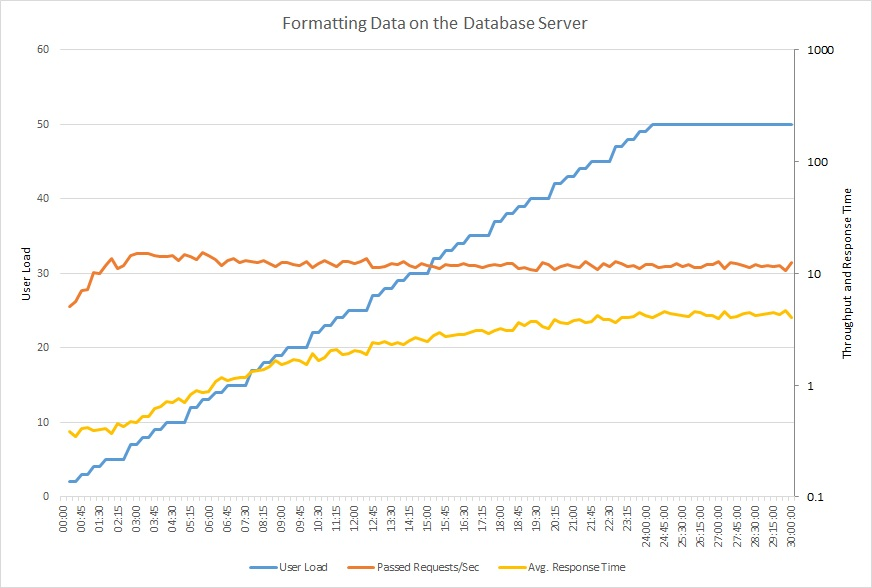

<!-- cSpell:ignore DTUs LTRIM RTRIM RDBMS Linq processingindatabasemonitor -->

# Busy Database antipattern

Offloading processing to a database server can cause it to spend a significant proportion of time running code, rather than responding to requests to store and retrieve data.

## Problem description

Many database systems can run code. Examples include stored procedures and triggers. Often, it's more efficient to perform this processing close to the data, rather than transmitting the data to a client application for processing. However, overusing these features can hurt performance, for several reasons:

- The database server may spend too much time processing, rather than accepting new client requests and fetching data.
- A database is usually a shared resource, so it can become a bottleneck during periods of high use.
- Runtime costs may be excessive if the data store is metered. That's particularly true of managed database services. For example, Azure SQL Database charges for [Database Transaction Units][dtu] (DTUs).
- Databases have finite capacity to scale up, and it's not trivial to scale a database horizontally. Therefore, it may be better to move processing into a compute resource, such as a VM or App Service app, that can easily scale out.

This antipattern typically occurs because:

- The database is viewed as a service rather than a repository. An application might use the database server to format data (for example, converting to XML), manipulate string data, or perform complex calculations.
- Developers try to write queries whose results can be displayed directly to users. For example, a query might combine fields or format dates, times, and currency according to locale.
- Developers are trying to correct the [Extraneous Fetching][ExtraneousFetching] antipattern by pushing computations to the database.
- Stored procedures are used to encapsulate business logic, perhaps because they are considered easier to maintain and update.

The following example retrieves the 20 most valuable orders for a specified sales territory and formats the results as XML. It uses Transact-SQL functions to parse the data and convert the results to XML. You can find the complete sample [here][sample-app].

```sql
SELECT TOP 20
  soh.[SalesOrderNumber]  AS '@OrderNumber',
  soh.[Status]            AS '@Status',
  soh.[ShipDate]          AS '@ShipDate',
  YEAR(soh.[OrderDate])   AS '@OrderDateYear',
  MONTH(soh.[OrderDate])  AS '@OrderDateMonth',
  soh.[DueDate]           AS '@DueDate',
  FORMAT(ROUND(soh.[SubTotal],2),'C')
                          AS '@SubTotal',
  FORMAT(ROUND(soh.[TaxAmt],2),'C')
                          AS '@TaxAmt',
  FORMAT(ROUND(soh.[TotalDue],2),'C')
                          AS '@TotalDue',
  CASE WHEN soh.[TotalDue] > 5000 THEN 'Y' ELSE 'N' END
                          AS '@ReviewRequired',
  (
  SELECT
    c.[AccountNumber]     AS '@AccountNumber',
    UPPER(LTRIM(RTRIM(REPLACE(
    CONCAT( p.[Title], ' ', p.[FirstName], ' ', p.[MiddleName], ' ', p.[LastName], ' ', p.[Suffix]),
    '  ', ' '))))         AS '@FullName'
  FROM [Sales].[Customer] c
    INNER JOIN [Person].[Person] p
  ON c.[PersonID] = p.[BusinessEntityID]
  WHERE c.[CustomerID] = soh.[CustomerID]
  FOR XML PATH ('Customer'), TYPE
  ),

  (
  SELECT
    sod.[OrderQty]      AS '@Quantity',
    FORMAT(sod.[UnitPrice],'C')
                        AS '@UnitPrice',
    FORMAT(ROUND(sod.[LineTotal],2),'C')
                        AS '@LineTotal',
    sod.[ProductID]     AS '@ProductId',
    CASE WHEN (sod.[ProductID] >= 710) AND (sod.[ProductID] <= 720) AND (sod.[OrderQty] >= 5) THEN 'Y' ELSE 'N' END
                        AS '@InventoryCheckRequired'

  FROM [Sales].[SalesOrderDetail] sod
  WHERE sod.[SalesOrderID] = soh.[SalesOrderID]
  ORDER BY sod.[SalesOrderDetailID]
  FOR XML PATH ('LineItem'), TYPE, ROOT('OrderLineItems')
  )

FROM [Sales].[SalesOrderHeader] soh
WHERE soh.[TerritoryId] = @TerritoryId
ORDER BY soh.[TotalDue] DESC
FOR XML PATH ('Order'), ROOT('Orders')
```

Clearly, this is complex query. As we'll see later, it turns out to use significant processing resources on the database server.

## How to fix the problem

Move processing from the database server into other application tiers. Ideally, you should limit the database to performing data access operations, using only the capabilities that the database is optimized for, such as aggregation in an RDBMS.

For example, the previous Transact-SQL code can be replaced with a statement that simply retrieves the data to be processed.

```sql
SELECT
soh.[SalesOrderNumber]  AS [OrderNumber],
soh.[Status]            AS [Status],
soh.[OrderDate]         AS [OrderDate],
soh.[DueDate]           AS [DueDate],
soh.[ShipDate]          AS [ShipDate],
soh.[SubTotal]          AS [SubTotal],
soh.[TaxAmt]            AS [TaxAmt],
soh.[TotalDue]          AS [TotalDue],
c.[AccountNumber]       AS [AccountNumber],
p.[Title]               AS [CustomerTitle],
p.[FirstName]           AS [CustomerFirstName],
p.[MiddleName]          AS [CustomerMiddleName],
p.[LastName]            AS [CustomerLastName],
p.[Suffix]              AS [CustomerSuffix],
sod.[OrderQty]          AS [Quantity],
sod.[UnitPrice]         AS [UnitPrice],
sod.[LineTotal]         AS [LineTotal],
sod.[ProductID]         AS [ProductId]
FROM [Sales].[SalesOrderHeader] soh
INNER JOIN [Sales].[Customer] c ON soh.[CustomerID] = c.[CustomerID]
INNER JOIN [Person].[Person] p ON c.[PersonID] = p.[BusinessEntityID]
INNER JOIN [Sales].[SalesOrderDetail] sod ON soh.[SalesOrderID] = sod.[SalesOrderID]
WHERE soh.[TerritoryId] = @TerritoryId
AND soh.[SalesOrderId] IN (
    SELECT TOP 20 SalesOrderId
    FROM [Sales].[SalesOrderHeader] soh
    WHERE soh.[TerritoryId] = @TerritoryId
    ORDER BY soh.[TotalDue] DESC)
ORDER BY soh.[TotalDue] DESC, sod.[SalesOrderDetailID]
```

The application then uses the .NET Framework `System.Xml.Linq` APIs to format the results as XML.

```csharp
// Create a new SqlCommand to run the Transact-SQL query
using (var command = new SqlCommand(...))
{
    command.Parameters.AddWithValue("@TerritoryId", id);

    // Run the query and create the initial XML document
    using (var reader = await command.ExecuteReaderAsync())
    {
        var lastOrderNumber = string.Empty;
        var doc = new XDocument();
        var orders = new XElement("Orders");
        doc.Add(orders);

        XElement lineItems = null;
        // Fetch each row in turn, format the results as XML, and add them to the XML document
        while (await reader.ReadAsync())
        {
            var orderNumber = reader["OrderNumber"].ToString();
            if (orderNumber != lastOrderNumber)
            {
                lastOrderNumber = orderNumber;

                var order = new XElement("Order");
                orders.Add(order);
                var customer = new XElement("Customer");
                lineItems = new XElement("OrderLineItems");
                order.Add(customer, lineItems);

                var orderDate = (DateTime)reader["OrderDate"];
                var totalDue = (Decimal)reader["TotalDue"];
                var reviewRequired = totalDue > 5000 ? 'Y' : 'N';

                order.Add(
                    new XAttribute("OrderNumber", orderNumber),
                    new XAttribute("Status", reader["Status"]),
                    new XAttribute("ShipDate", reader["ShipDate"]),
                    ... // More attributes, not shown.

                    var fullName = string.Join(" ",
                        reader["CustomerTitle"],
                        reader["CustomerFirstName"],
                        reader["CustomerMiddleName"],
                        reader["CustomerLastName"],
                        reader["CustomerSuffix"]
                    )
                   .Replace("  ", " ") //remove double spaces
                   .Trim()
                   .ToUpper();

               customer.Add(
                    new XAttribute("AccountNumber", reader["AccountNumber"]),
                    new XAttribute("FullName", fullName));
            }

            var productId = (int)reader["ProductID"];
            var quantity = (short)reader["Quantity"];
            var inventoryCheckRequired = (productId >= 710 && productId <= 720 && quantity >= 5) ? 'Y' : 'N';

            lineItems.Add(
                new XElement("LineItem",
                    new XAttribute("Quantity", quantity),
                    new XAttribute("UnitPrice", ((Decimal)reader["UnitPrice"]).ToString("C")),
                    new XAttribute("LineTotal", RoundAndFormat(reader["LineTotal"])),
                    new XAttribute("ProductId", productId),
                    new XAttribute("InventoryCheckRequired", inventoryCheckRequired)
                ));
        }
        // Match the exact formatting of the XML returned from SQL
        var xml = doc
            .ToString(SaveOptions.DisableFormatting)
            .Replace(" />", "/>");
    }
}
```

> [!NOTE]
> This code is somewhat complex. For a new application, you might prefer to use a serialization library. However, the assumption here is that the development team is refactoring an existing application, so the method needs to return the exact same format as the original code.

## Considerations

- Many database systems are highly optimized to perform certain types of data processing, such as calculating aggregate values over large datasets. Don't move those types of processing out of the database.

- Do not relocate processing if doing so causes the database to transfer far more data over the network. See the [Extraneous Fetching antipattern][ExtraneousFetching].

- If you move processing to an application tier, that tier may need to scale out to handle the additional work.

## How to detect the problem

Symptoms of a busy database include a disproportionate decline in throughput and response times in operations that access the database.

You can perform the following steps to help identify this problem:

1. Use performance monitoring to identify how much time the production system spends performing database activity.

2. Examine the work performed by the database during these periods.

3. If you suspect that particular operations might cause too much database activity, perform load testing in a controlled environment. Each test should run a mixture of the suspect operations with a variable user load. Examine the telemetry from the load tests to observe how the database is used.

4. If the database activity reveals significant processing but little data traffic, review the source code to determine whether the processing can better be performed elsewhere.

If the volume of database activity is low or response times are relatively fast, then a busy database is unlikely to be a performance problem.

## Example diagnosis

The following sections apply these steps to the sample application described earlier.

### Monitor the volume of database activity

The following graph shows the results of running a load test against the sample application, using a step load of up to 50 concurrent users. The volume of requests quickly reaches a limit and stays at that level, while the average response time steadily increases. A logarithmic scale is used for those two metrics.


<p id="description-1" class="visually-hidden">This line graph shows user load, requests per second, and average response time. The graph shows that response time increases as load increases.</p>

The next graph shows CPU utilization and DTUs as a percentage of service quota. DTUs provide a measure of how much processing the database performs. The graph shows that CPU and DTU utilization both quickly reached 100%.


<p id="description-2" class="visually-hidden">This line graph shows CPU percentage and DTU percentage over time. The graph shows that both quickly reach 100%.</p>

### Examine the work performed by the database

It could be that the tasks performed by the database are genuine data access operations, rather than processing, so it is important to understand the SQL statements being run while the database is busy. Monitor the system to capture the SQL traffic and correlate the SQL operations with application requests.

If the database operations are purely data access operations, without a lot of processing, then the problem might be [Extraneous Fetching][ExtraneousFetching].

### Implement the solution and verify the result

The following graph shows a load test using the updated code. Throughput is significantly higher, over 400 requests per second versus 12 earlier. The average response time is also much lower, just above 0.1 seconds compared to over 4 seconds.


<p id="description-3" class="visually-hidden">This line graph shows user load, requests per second, and average response time. The graph shows that response time remains roughly constant throughout the load test.</p>

CPU and DTU utilization shows that the system took longer to reach saturation, despite the increased throughput.


<p id="description-4" class="visually-hidden">This line graph shows CPU percentage and DTU percentage over time. The graph shows that CPU and DTU take longer to reach 100% than previously.</p>

## Related resources

- [Extraneous Fetching antipattern][ExtraneousFetching]

[dtu]: /azure/sql-database/sql-database-service-tiers-dtu
[ExtraneousFetching]: ../extraneous-fetching/index.md
[sample-app]: https://github.com/mspnp/performance-optimization/tree/master/BusyDatabase
