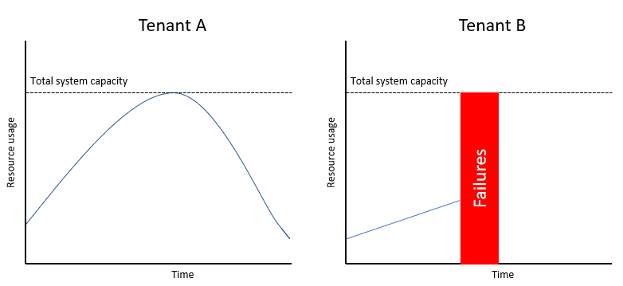
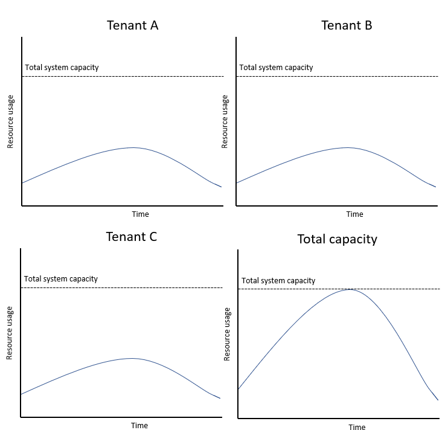

Multitenant systems share resources between tenants. Because tenants use the same shared resources, the activity of one tenant can have a negative impact on another tenant's use of the system.

## Problem description

When you build a service to be shared by multiple customers or tenants, you can build it to be *multitenanted*. A benefit of multitenant systems is that resources can be pooled and shared among tenants. This often results in lower costs and improved efficiency. However, if a single tenant uses a disproportionate amount of the resources available in the system, the overall performance of the system can suffer. The *noisy neighbor* problem occurs when one tenant's performance is degraded because of the activities of another tenant.

Consider an example multitenant system with two tenants. Tenant A's usage patterns and tenant B's usage patterns coincide, which means that at peak times, the total resource usage is higher than the capacity of the system:

It's likely that whichever tenant's request that arrived first will take precedence. Then the other tenant will experience a noisy neighbor problem. Alternatively, both tenants might find their performance suffers.

The noisy neighbor problem also occurs even when each individual tenant is consuming relatively small amounts of the system's capacity, but the collective resource usage of many tenants results in a peak in overall usage:

This can happen when you have multiple tenants that all have similar usage patterns, or where you haven't provisioned sufficient capacity for the collective load on the system.

## How to fix the problem

Noisy neighbor problems are an inherent risk in multitenant systems, and it's not possible to completely eliminate the possibility of being affected by a noisy neighbor. However, there are some steps that both clients and service providers can take to reduce the likelihood of noisy neighbor problems, or to mitigate their effects when they're observed.

### Actions that clients can take

- **Ensure your application handles [service throttling](../../patterns/throttling.yml)**, to reduce making unnecessary requests to the service. Ensure that your application follows good practices to [retry requests that received a transient failure response](../../patterns/retry.yml).
- **Purchase reserved capacity, if available.** For example, when using Azure Cosmos DB, purchase [reserved throughput](/azure/cosmos-db/optimize-cost-throughput), and when using ExpressRoute, [provision separate circuits for environments that are sensitive to performance](/azure/cloud-adoption-framework/ready/azure-best-practices/connectivity-to-azure).
- **Migrate to a single-tenant instance of the service, or to a service tier with stronger isolation guarantees.** For example, when using Service Bus, [migrate to the premium tier](/azure/service-bus-messaging/service-bus-premium-messaging), and when using Azure Cache for Redis, [provision a standard or premium tier cache](/azure/azure-cache-for-redis/cache-best-practices#configuration-and-concepts).

### Actions that service providers can take

- **Monitor the resource usage for your system.** Monitor both the overall resource usage and the resources that each tenant uses. Configure alerts to detect spikes in resource usage, and if possible, configure automation to automatically mitigate known issues by [scaling up or out](/azure/architecture/framework/scalability/design-scale).
- **Apply resource governance.** Consider applying policies that avoid a single tenant overwhelming the system and reducing the capacity available to others. This step might take the form of quota enforcement, through the [Throttling pattern](../../patterns/throttling.yml) or the [Rate Limiting pattern](../../patterns/rate-limiting-pattern.yml).
- **Provision more infrastructure.** This process might involve scaling up by upgrading some of your solution components, or it might involve scaling out by provisioning additional shards, if you follow the [Sharding pattern](../../patterns/sharding.yml), or stamps, if you follow the [Deployment Stamps pattern](../../patterns/deployment-stamp.yml).
- **Enable tenants to purchase pre-provisioned or reserved capacity.** This capacity provides tenants with more certainty that your solution adequately handles their workload.
- **Smooth out tenants' resource usage**. For example, you might try one of the following approaches:
  - If you host multiple instances of your solution, consider rebalancing tenants across the instances or stamps. For example, consider placing tenants with predictable and similar usage patterns across multiple stamps, to flatten the peaks in their usage.
  - Consider whether you have background processes or resource-intensive workloads that aren't time-sensitive. Run these workloads asynchronously at off-peak times, to preserve your peak resource capacity for time-sensitive workloads.
- **Check whether your downstream services provide controls to mitigate noisy neighbor problems.** For example, when using Kubernetes, [consider using pod limits](/azure/aks/developer-best-practices-resource-management), and when using Service Fabric, [consider using the built-in governance capabilities](/azure/service-fabric/service-fabric-resource-governance).
- **Restrict the operations that tenants can perform.** For example, prevent tenants from executing operations that will run very large database queries, such as by specifying a maximum returnable record count or time limit on queries. This action mitigates the risk of tenants taking actions that might negatively impact other tenants.
- **Provide a Quality of Service (QoS) system.** When you apply QoS, you prioritize some processes or workloads ahead of others. By factoring QoS into your design and architecture, you can ensure that high-priority operations take precedence when there's pressure on your resources.

## Considerations

In most cases, individual tenants don't intend to cause noisy neighbor issues. Individual tenants might not even be aware that their workloads cause noisy neighbor issues for others. However, it's also possible that some tenants might exploit vulnerabilities in shared components to attack a service, either individually or by executing a distributed denial of service (DDoS) attack.

Regardless of the cause, it's important to treat these problems as resource governance issues, and to apply usage quotas, throttling, and governance controls to mitigate the problem.

> [!NOTE]
> Make sure that you tell your clients about any throttling that you apply, or any usage quotas on your service. It's important that they reliably handle failed requests, and that they aren't surprised by any limitations or quotas you apply.

## How to detect the problem

From a client's perspective, the noisy neighbor problem typically manifests as failed server requests, or requests that take a long time to complete. In particular, if the same request succeeds at other times and appears to fail randomly, there might be a noisy neighbor issue. Client applications should record telemetry to track the success rate and performance of the requests to services, and the applications should also record baseline performance metrics for comparison purposes.

From a service's perspective, the noisy neighbor issue might appear in several ways:

- **Spikes in resource usage.** It's important to have a clear understanding of your normal baseline resource usage, and to configure monitoring and alerts to detect spikes in resource usage. Ensure you consider all of the resources that could affect your service's performance or availability. These resources include metrics like server CPU and memory usage, disk IO, database usage, network traffic, and metrics that are exposed by managed services, such as the number of requests and the synthetic and abstract performance metrics, such as the Azure Cosmos DB request units.
- **Failures when performing an operation for a tenant.** In particular, look for failures that occur when a tenant isn't using a large portion of the system's resources. Such a pattern might indicate that the tenant is a victim of the noisy neighbor problem. Consider tracking the resource consumption by tenant. For example, when using Azure Cosmos DB, consider logging the request units used for each request, and add the tenant's identifier as a dimension to the telemetry, so that you can aggregate the request unit consumption for each tenant.

## Contributors

*This article is maintained by Microsoft. It was originally written by the following contributors.*

Principal author:

 * [John Downs](http://linkedin.com/in/john-downs) | Principal Customer Engineer, FastTrack for Azure

Other contributors:

 * [Chad Kittel](https://www.linkedin.com/in/chadkittel) | Principal Software Engineer
 * [Paolo Salvatori](http://linkedin.com/in/paolo-salvatori) | Principal Customer Engineer, FastTrack for Azure
 * [Daniel Scott-Raynsford](http://linkedin.com/in/dscottraynsford) | Partner Technology Strategist
 * [Arsen Vladimirskiy](http://linkedin.com/in/arsenv) | Principal Customer Engineer, FastTrack for Azure

*To see non-public LinkedIn profiles, sign in to LinkedIn.*

## Related resources

 * [Architectural considerations for a multitenant solution](../../guide/multitenant/considerations/overview.yml)
 * [Transient fault handling best practices](../../best-practices/transient-faults.md)
