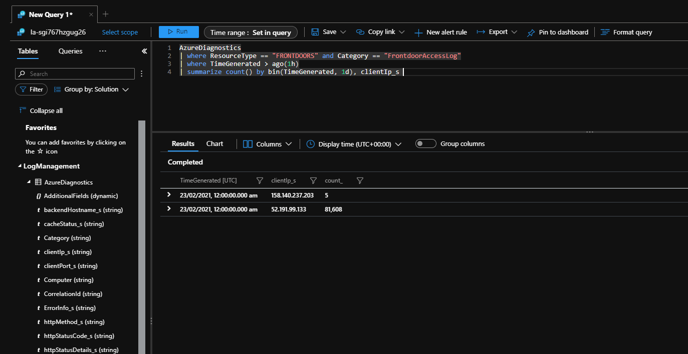

# Retry Storm antipattern

When a service is unavailable or busy, having clients retry their connections too frequently can cause the service to struggle to recover, and can make the problem worse. It also does not make sense to retry forever, since requests are typically only valid for a defined period of time.

## Problem description

In the cloud, services sometimes experience problems and become unavailable to clients, or have to throttle or rate limit their clients. Clients should retry retry failed connections to services, but it's important not to retry too frequently or for too long. Not only is it unlikely to succeed, but services can be put under even more stress when lots of connections arrive while they are trying to recover, and this may even overwhelm the service and make the problem worse.

The following example ilustrates a simple scenario where a client connects to a server-based API. If the request does not succeed then the client retries immediately, and keeps retrying forever. Often this sort of behavior is more subtle than in this example, but the same principle applies.

```csharp
public async Task<string> GetDataFromServer()
{
    while(true)
    {
        var result = await httpClient.GetAsync(string.Format("http://{0}:8080/api/...", hostName));
        if (! result.IsSuccessStatusCode) continue;

        // ... Process result.
    }
}
```

## How to fix the problem

Client applications should follow some best practices to avoid causing a retry storm.

- Use official SDKs when communicating to Azure services. These SDKs have built-in retry policies and protections against retry storms.
- Cap the retries at a maximum - don't thrash forever. While it might seem easier to simply write a `while(true)` loop, in the cloud you need to think about what makes sense for your scenario and ensure you aren't retrying for longer than necessary. For example, would it really make sense to continue trying this once it's failed for a few minutes?
- Consider using exponential backoff or another non-regular polling strategy.
- Gracefully handle errors. Bubble errors up to the caller methods when it's clear the service is not going to respond in a reasonable time. Design for this.
- Consider using the circuit breaker pattern.
- Obey the `retry-after` header when provided by a server, e.g. from 429s.
- Consider batching requests and using request pooling where available. Many SDKs do this on your behalf. This will reduce the total number of outbound connection attempts your application makes, although you still need to be careful not to retry these connections too.
- Use a library like [Polly](https://github.com/App-vNext/Polly) (for .NET) or [retry](https://www.npmjs.com/package/retry) (for JS).

Services can also protect themselves against retry storms.

- Add a gateway layer so you can shut off connections during an incident. This is an example of the [Bulkhead pattern](../../patterns/bulkhead.md).
- Throttle requests at your gateway or API Management layer to ensure you aren't going to accept so many requests that your components can't continue to operate.
- If you are throttling, send back a `retry-after` header to help clients understand when to re-attempt their connections.

## Considerations

- Clients should consider the type of error returned. If you get a 4xx-class HTTP error, retrying is generally not going to help.
- Consider the length of time that makes sense for your application to re-attempt connections.

## How to detect the problem

From a client's perspective, symptoms of this problem could include very long response or processing times due to repeated retries to a server, along with telemetry that indicates that there were repeated attempts to retry the connection.

From a service's perspective, symptoms of this problem could include a large number of requests from one client within a short period of time, or in difficulty recovering from outages.

## Example diagnosis

### Client side

Metrics - Dependency failures; split by remote dependency name


### Server side

```kusto
AzureDiagnostics
| where ResourceType == "FRONTDOORS" and Category == "FrontdoorAccessLog"
| where TimeGenerated > ago(1h)
| summarize count() by bin(TimeGenerated, 1d), clientIp_s
```



## Related resources

 * [Retry pattern](https://docs.microsoft.com/azure/architecture/patterns/retry)
 * [Circuit Breaker pattern](https://docs.microsoft.com/azure/architecture/patterns/circuit-breaker)
 * [Transient fault handling best practices](https://docs.microsoft.com/azure/architecture/best-practices/transient-faults)
 * [Service-specific retry guidance](https://docs.microsoft.com/azure/architecture/best-practices/retry-service-specific)
