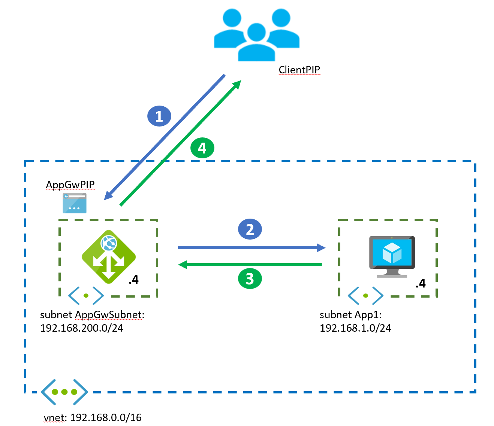
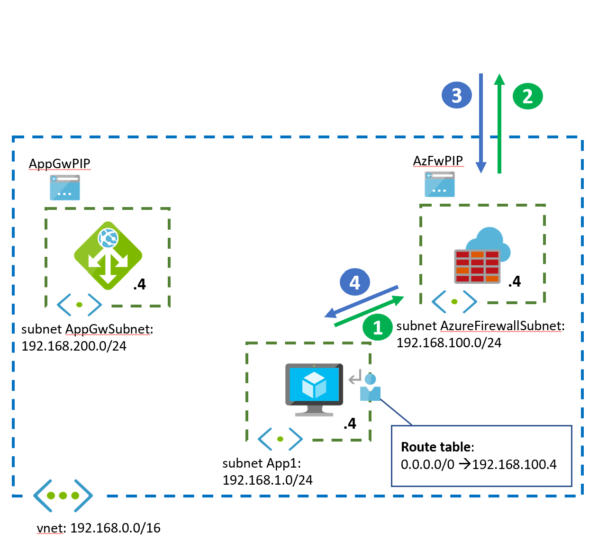
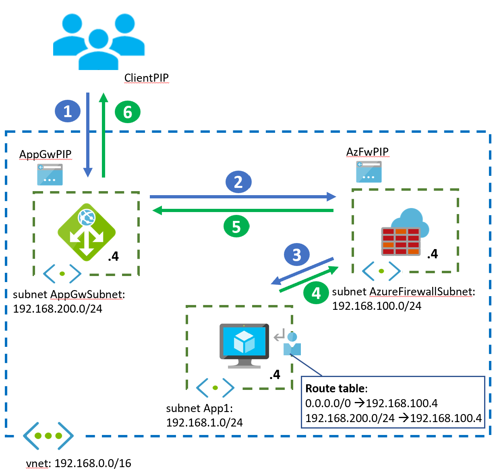
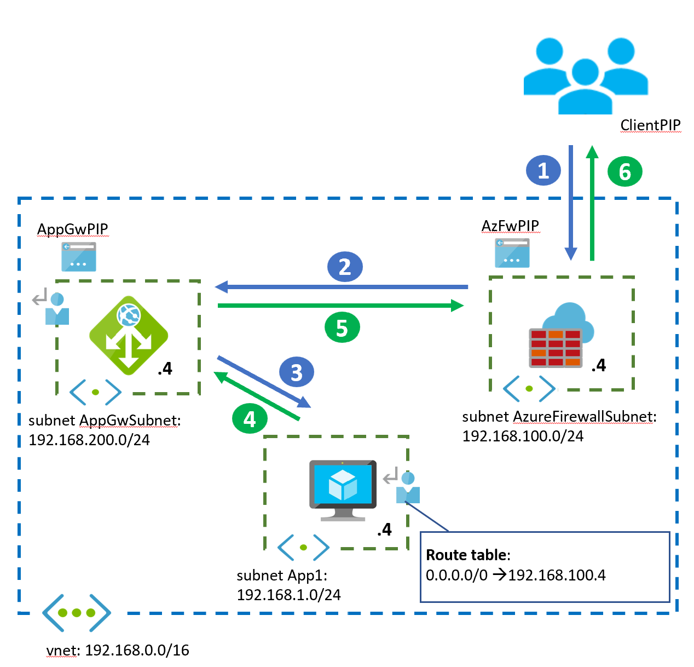
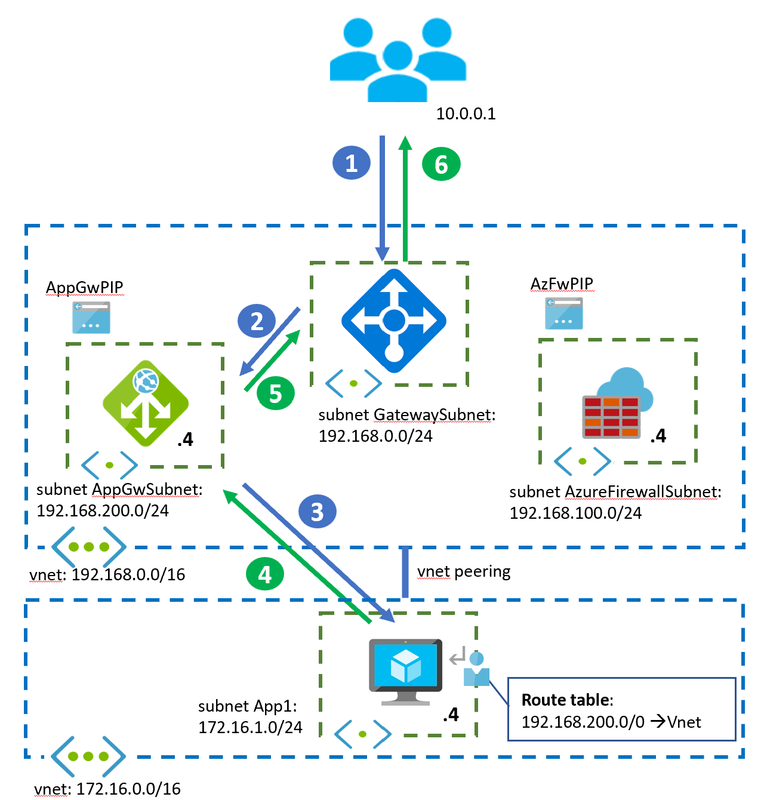

# Using Azure Application Gateway and Azure Firewall in your Virtual Network

Making sure that the application and the data is secure is of paramount importance when deploying application workloads into Azure. Multiple mechanisms exist that can protect your application and your data, depending on the technology that you choose to support your application: you can implement protective measures in the application itself such as authentication or encryption, and you can introduce additional layers of security in the network that contains the workload to further reduce the attack surface. This document focuses on the latter, that is, network security controls that you can implement in a Virtual Network where you have deployed an application, for example on Azure Virtual Machines, Virtual Machine Scale Sets or Azure Kubernetes Services.

Regarding network security, your first choice will be whether implementing generic security valid for all workloads like the functionality that the Azure Firewall provides, or mechanisms such as the Azure Web Application Firewall (a service that can be deployed on the Azure Application Gateway) that address attacks exploiting application-specific vulnerabilities:

* The [Azure Firewall][azfw-overview] is a managed next-generation firewall that offers Network Address Translation (NAT) functionality as well as packet filtering capabilities based on Layer 4 packet attributes (IP addresses and TCP/UDP ports) or application-based attributes for HTTP(S) or SQL. Additionally, the Azure Firewall leverages Microsoft threat intelligence to more effectively identify malicious IP addresses. For more details please refer to the [Azure Firewal Documentation][azfw-docs].
* The [Azure Application Gateway][appgw-overview] is a managed HTTP(S) full reverse proxy that can be used for offloading SSL encryption and decryption or to inspect web payloads to detect attacks at the HTTP layer with its Web Application Firewall capabilities. For more details please refer to the [Application Gateway Documentation][appgw-docs] and the [Web Application Firewall Documentation][waf-docs].

Both Azure services are often complementary to each other, so it can be difficult choosing the best for your workloads, or in case you need both (as it is typically the case), how to integrate them in the same Virtual Network to achieve an optimal protection against attacks at both the network and the application layer. This document will explain when to use each component, and when to use the different design options that combine both. Here a quick summary of the different designs that will be discussed:

* **Azure Firewall only**: this design is often used when there are no web applications in the Virtual Network
* **Application Gateway only**: this design is appropriate when there are only web applications in the Virtual Network, and Network Security Groups are enough for egress filtering
* **Azure Firewall and Application Gateway in parallel**: this is the most frequent design, where the Azure Application Gateway protects HTTP(S) applications from web attacks, and the Azure Firewall protects all other workloads, plus filters outbound traffic
* **Application Gateway in front of Azure Firewall**: this design is used by customers that want a firewall to inspect both inbound and outbound traffic, but still have the Application Gateway protect web workloads
* **Azure Firewall in front of Application Gateway**: similar to the previous design, but the Azure Firewall inspects traffic before it arrives to the Application Gateway. This design provides a unique public address for inbound and outbound traffic. A downside of this design is that the application will not see the original source IP address of the web traffic

There are many variations to the previous basic designs: whether the application clients are coming from the public Internet or from on-premises, whether the hub and spoke network design is used, specific details for integration with [Azure Kubernetes Service][aks-overview], adding additional services such as the [API Management][apim-overview] Gateway, and finally, the possibility of replacing the Azure resources described in this article with Network Virtual Appliances of Microsoft partners. These variations will be discussed in the second half of this article.

## Design Option 1: Azure Firewall only

This design option is to be used if there are no web-based workloads deployed in the Azure Virtual Network that can benefit from the extra protection of the Azure Web Application Firewall, and hence there is no need to deploy an Azure Application Gateway in the Virtual Network. The design in this case is straight forward, but still we will describe the source and destination IP addresses involved in each stage.

1. This packet walk example corresponds to a user accessing the application hosted in virtual machines from the public Internet. Note that the diagram includes only one virtual machine for simplicity, but typically you would have multiple application instances behind a load balancer for a higher availability and scalability. The application client will initiate the connection to the public IP address of the Azure Firewall:
   * Source IP address: ClientPIP
   * Destination IP address: AzFwPIP
2. The Azure Firewall will have a [Destination NAT rule][azfw-dnat] that will translate the destination IP address to the IP address of the application inside of the Virtual Network. Additionally, the Azure Firewall will Source NAT the packet under certain circunstances. As a consequences, these are the IP addresses that the Virtual Machine will see in the incoming packet:
   * Source IP address: 192.168.100.7 (the Azure Firewall always SNAT if DNAT is performed, see [Azure Firewall Known Issues][azfw-issues])
   * Destination IP address: 192.168.100.4
3. The Virtual Machine will answer the application request reverting source and destination IP addresses. A User-Defined Route (UDR) is required so that the Virtual Machine does not send the packet back to the public Internet bypassing the Azure Firewall, as the previous diagram represents.
   * Source IP address: 192.168.100.4
   * Destination IP address: 192.168.100.7
4. Finally, the Azure Firewall will undo the NAT operations (SNAT and DNAT) and deliver the response to the client:
   * Source IP address: AzFwPIP
   * Destination IP address: ClientPIP

Note that in this design the Azure Firewall not only inspects incoming connections from the public Internet, but outbound connections from the Azure virtual machine in the application subnet too (because of the User-Defined Route).

## Design Option 2: Application Gateway only

This design option is convenient when you only have web applications, and inspecting outbound connections from the Virtual Network with Network Security Groups is enough protection. This design is very similar to the option with only the Azure Firewall:

1. This packet walk example corresponds to a user accessing a web application hosted in virtual machines from the public Internet. The application client will initiate the connection to the public IP address of the Azure Application Gateway:
   * Source IP address: ClientPIP
   * Destination IP address: AppGwPIP
2. The Application Gateway instance that receives the request will terminate the connection from the client, and establish a new connection with one of the backends. As a consequence, the backend will see as source IP the address of the specific Application Gateway instance handling the traffic. The Application Gateway will insert the X-Forwarded-For HTTP header with the original IP address of the client, in case this IP address is relevant for the application:
   * Source IP address: 192.168.200.7 (the private IP address of the Application Gateway instance that happens to handle this specific request)
   * Destination IP address: 192.168.100.4
   * X-Forwarded-For header: ClientPIP
3. The Virtual Machine will answer the application request reverting source and destination IP addresses. Note that no User-Defined Route is required in this case, since the virtual machine already knows how to reach the application gateway.
   * Source IP address: 192.168.100.4
   * Destination IP address: 192.168.200.7
4. Finally, the Application Gateway instance will answer to the client:
   * Source IP address: AppGwPIP
   * Destination IP address: ClientPIP

## Design Option 3: Application Gateway and Azure Firewall in parallel

In some situations filtering outbound connections from the Virtual Machines with Network Security Groups might be very complex to implement or even impossible. For example, if you want to allow connectivity to a specific Azure Storage Account but not to others, this is only possible with FQDN-based filters. Hence this design is often used where FQDN-based filtering for egress traffic is required.

The following two diagrams illustrate the traffic flows for both types of traffic: inbound connections initiated by an application user outside of the Virtual network, and outbound connections to the public Internet initiated for the Virtual Machines, for example to connect to backend systems or get operating system updates:

This document will not go in detail over the packet walks of these flows, since they are exactly the same as for design options 1 and 2.

## Design Option 4: Application Gateway in front of Azure Firewall

Some organizations have as requirement having all traffic go both trough a Web Application Firewall and through a Next-Generation Firewall. The WAF would provide protection against attacks at the application layer, and the firewall would use its complementary technologies to address other types of attacks, for example in the case of the Azure Firewall, through its threat intelligence features.

Here the packet walk for inbound traffic from the public Internet:

1. The application client will initiate the connection to the public IP address of the Azure Application Gateway:
   * Source IP address: ClientPIP
   * Destination IP address: AppGwPIP
2. The Application Gateway instance that receives the request will terminate the connection from the client, and establish a new connection with one of the backends. The Application Gateway will insert the X-Forwarded-For HTTP header with the original IP address of the client, in case this IP address is relevant for the application. The User-Defined Route to `192.168.1.0/24` in the subnet of the Application Gateway will forward the packet to the Azure Firewall:
   * Source IP address: 192.168.200.7 (the private IP address of the Application Gateway instance that happens to handle this specific request)
   * Destination IP address: 192.168.100.4
   * X-Forwarded-For header: ClientPIP
3. The Azure Firewall will not Source NAT the traffic, since it is going to a private IP address (see [Azure Firewall SNAT][azfw-snat]), and will forward it to the application VM if rules allow it.
   * Source IP address: 192.168.200.7 (the private IP address of the Application Gateway instance that happens to handle this specific request)
   * Destination IP address: 192.168.100.4
   * X-Forwarded-For header: ClientPIP
4. The Virtual Machine will answer the request reverting source and destination IP addresses. The User-Defined Route to `192.168.200.0/24` will capture the packet sent back to the application gateway and redirect it to the Azure Firewall
   * Source IP address: 192.168.100.4
   * Destination IP address: 192.168.200.7
5. Here again the Azure Firewall will not Source NAT the traffic, since it is going to a private IP address and it will forward it to the Application Gateway.
   * Source IP address: 192.168.100.4
   * Destination IP address: 192.168.200.7
6. Finally, the Application Gateway instance will answer to the client:
   * Source IP address: AppGwPIP
   * Destination IP address: ClientPIP

Note that outbound flows from the Virtual Machine to the public Internet will go through the Azure Firewall, as defined by the User-Defined Route to `0.0.0.0/0`.

## Design Option 5: Application Gateway behind the Azure Firewall

This design is mainly motivated by the desire of having the Azure Firewall filtering packets before they reach the Application Gateway, hence discarding malicious packets before they even hit the Application Gateway. Another benefit of this design is that the application will get the same public IP address both for ingress and egress connections, in case that is a requirement.

However, a significant drawback of this design is that the application servers will not see the original source IP address of the client, since the Azure Firewall will Source-NAT the packets as they come into the Virtual Network.

Here the packet walk for inbound traffic from the public Internet:

1. The application client will initiate the connection to the public IP address of the Azure Firewall:
   * Source IP address: ClientPIP
   * Destination IP address: AzFWPIP
2. The Azure Firewall will have a Destination NAT rule mapping the web ports (typically TCP 443) to the private IP address of the Application Gateway. Remember that the Azure Firewall also SNATs when doing DNAT:
   * Source IP address: 192.168.100.7 (the private IP address of the Azure Firewall instance that happens to handle this specific request)
   * Destination IP address: 192.168.200.4
3. The Application Gateway will establish a new session between the specific instance handling the connection and one of the backend servers. Note that the original IP address of the client is not present in the packet:
   * Source IP address: 192.168.200.7 (the private IP address of the Application Gateway instance that happens to handle this specific request)
   * Destination IP address: 192.168.100.4
   * X-Forwarded-For header: ClientPIP
4. The Virtual Machine will answer the request reverting source and destination IP addresses. The User-Defined Route to `192.168.200.0/24` will capture the packet sent back to the application gateway and redirect it to the Azure Firewall
   * Source IP address: 192.168.100.4
   * Destination IP address: 192.168.200.7
5. The Application Gateway will reply to the SNAT source IP address of the Azure Firewall instance that processed the request:
   * Source IP address: 192.168.200.7
   * Destination IP address: 192.168.100.7
6. Finally, the Azure Firewall will undo SNAT and DNAT and it will answer to the client:
   * Source IP address: AzFwPIP
   * Destination IP address: ClientPIP

## Clients coming from on-premises

The previous designs have shown examples where the application clients were coming from the public Internet. However, many applications are accessed from on-premises as well. Most information details above will not change, but there are some differences:

* A VPN Gateway or an ExpressRoute Gateway is deployed in front of the Azure Firewall and the Application Gateway (depending on the chosen topology)
* The Azure Firewall does not support Destination NAT (DNAT) at this time for private IP addresses. Hence, if ingress traffic is to be sent to the Azure Firewall from the VPN or ExpressRoute Gateways, User-Defined Routes are to be used.

Note that even if all clients are located on-premises or in Azure, both the Azure Application Gateway and the Azure Firewall will require to keep their public IP addresses, so that Microsoft can manage the service.

## Design in a Hub and Spoke topology

If using a hub and spoke topology where shared resources are deployed in a central Virtual Network or hub, and applications in separate Virtual Networks or spokes, the designs described in this document are still applicable. Some remarks though:

* Typically all network components described in this article would go to the hub Vritual Network
* Special attention needs to be put on User-Defined Routes in the spokes: traffic coming from the Application Gateway instance or from the Azure Firewall should not be sent back to the main IP address of those services, but to the individual IP address of the specific instance sending the traffic. In other words, routing in the application subnet should send traffic addressed to the Azure Firewall and Application Gateway subnets to a next hop of type Virtual Network (and not Virtual Network Appliance). Otherwise asymmetric routing will break communication.

The previous document does not imply that the route table is always needed, but you need to verify that the next hop for the Azure Application Gateway subnet and the Azure Firewall subnet is the virtual network.

## Integration with API Management Gateway

Additional reverse proxy services can be integrated in the previous designs, such as the API Management Gateway. The designs are not greatly altered, only that instead of a single reverse proxy (the Application Gateway) there are two reverse proxies chained behind each other (the Application Gateway and the API Management Gateway in this case).

The [Design Guide to integrate API Management and Application Gateway in a Virtual Network][appgw_apim] describes the main proven practices for combining both services together.

## Integration with Azure Kubernetes Service

When applying the concepts in this article to workloads running on an Azure Kubernetes Service (AKS) cluster, you have two options regarding the Azure Application Gateway: you can deploy it independently of the AKS cluster, or you can integrate it with the AKS cluster using the [Azure Application Gateway Ingress Controller][agic_overview].

Additionally, the Azure Firewall plays an important role in AKS cluster security, since it offers the required functionality to filter egress traffic from the AKS cluster based on Fully Qualified Domain Names (FQDN) and not only IP address.

When using the Application and Azure Firewall together with an AKS cluster, the recommendation is using the design option with both appliances in parallel: the Application Gateway (with Web Application Firewall) will process inbound connection requests to the cluster, and the Azure Firewall will only allow those outbound connections that are desired.

## Azure Front Door

Azure Front Door is a service that provide functionality partially overlapping with the Azure Application Gateway: for example, both services offer Web Application Firewalling, SSL offload or URL routing. One main difference is that while Azure Application Gateway is deployed inside of a Virtual Network, Azure Front Door is a global, decentralized service.

This document is not going to delve into the differences between those two services, or when to use which one. Those topics are discussed in the [Frequently Asked Questions section for Azure Front Door][afd-vs-appgw]. Suffice to say that in some situations you have the option to simplify the design inside of the Virtual Network by replaing Azure Application Gateway with Azure Front Door. Note that even in that case most of the designs described in this document are valid, except the option of placing the Azure Firewall in front of Front Door.

## Network Virtual Appliances

Lastly, Microsoft products are not the only choice to provide Web Application Firewall or Next-Generation Firewall functionality in Azure, but a wide range of Microsoft partners provide products in this space. The concepts explained in this document essentially remain the same, but there might be some differences:

* Microsoft partner Network Virtual Appliances for Next-Generation Firewalling often offer more control and flexibility regarding NAT configuration
* Azure managed appliances such as the Application Gateway and the Azure Firewall significantly reduce complexity, as compared to designs with Network Virtual Appliances

## Conclusion

This document has analyzed different approaches for integrating the Azure Application Gateway and the Azure Firewall in the same network, where the most common approach is having those services in parallel. A number of variations to these designs has been described, including which aspects of the design are to be considered for each of them.

[azfw-overview]: https://docs.microsoft.com/azure/firewall/overview
[azfw-docs]: https://docs.microsoft.com/azure/firewall/
[azfw-dnat]: https://docs.microsoft.com/azure/firewall/tutorial-firewall-dnat
[azfw-snat]: https://docs.microsoft.com/azure/firewall/snat-private-range
[azfw-issues]: https://docs.microsoft.com/azure/firewall/overview#known-issues
[appgw-overview]: https://docs.microsoft.com/azure/application-gateway/overview
[appgw-docs]: https://docs.microsoft.com/azure/application-gateway/
[waf-docs]: https://docs.microsoft.com/azure/web-application-firewall/
[appgw_apim]: https://docs.microsoft.com/azure/api-management/api-management-howto-integrate-internal-vnet-appgateway
[agic_overview]: https://docs.microsoft.com/azure/application-gateway/ingress-controller-overview
[apim-overview]: https://docs.microsoft.com/azure/api-management/api-management-key-concepts
[aks-overview]: https://docs.microsoft.com/azure/aks/intro-kubernetes
[aks-egress]: https://docs.microsoft.com/azure/aks/limit-egress-traffic
[afd-overview]: https://docs.microsoft.com/azure/frontdoor/front-door-overview
[afd-vs-appgw]: https://docs.microsoft.com/azure/frontdoor/front-door-faq#what-is-the-difference-between-azure-front-door-and-azure-application-gateway