<ul  class="panelContent cardsC">
<li style="display: flex; flex-direction: column;">
    <a href="./articles/adding-a-modern-web-and-mobile-frontend-to-a-legacy-claims-processing-application.md" style="display: flex; flex-direction: column; flex: 1 0 auto;">
        

            

                

                    

                        

                            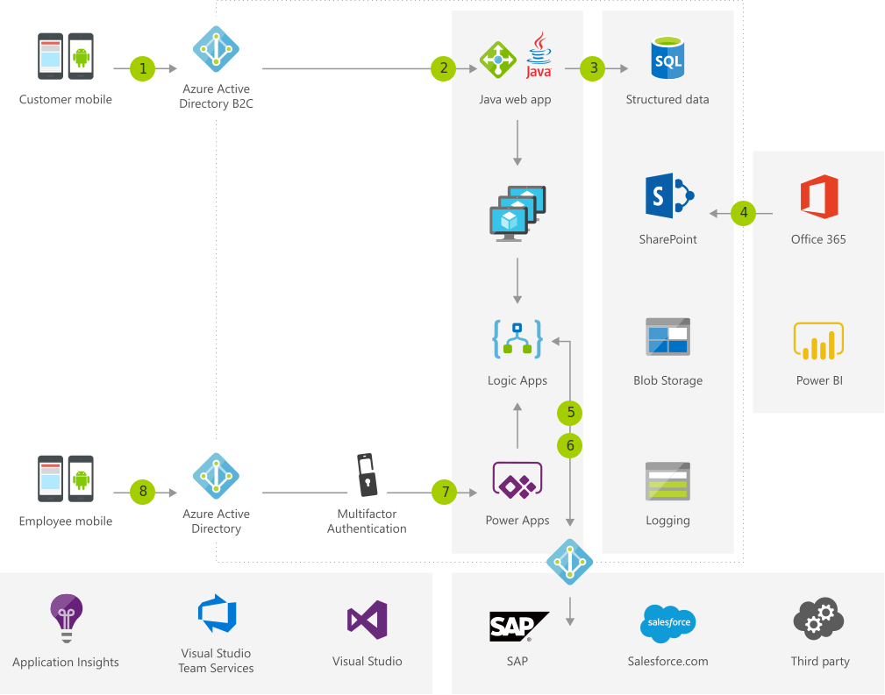
                        

                    

                    

                        <h3>Lift and Shift and Innovate - LOB Apps</h3>
                        
The solution demonstrates modernizing an existing application by consolidating data from multiple business systems into one place and surfacing it through web and mobile frontends

                    

                

            

        

    </a>
</li>
<li style="display: flex; flex-direction: column;">
    <a href="./articles/advanced-analytics-on-big-data.md" style="display: flex; flex-direction: column; flex: 1 0 auto;">
        

            

                

                    

                        

                            
                        

                    

                    

                        <h3>Advanced Analytics Architecture</h3>
                        
Get near real-time data analytics on streaming services

                    

                

            

        

    </a>
</li>
<li style="display: flex; flex-direction: column;">
    <a href="./articles/aircraft-engine-monitoring-for-predictive-maintenance-in-aerospace.md" style="display: flex; flex-direction: column; flex: 1 0 auto;">
        

            

                

                    

                        

                            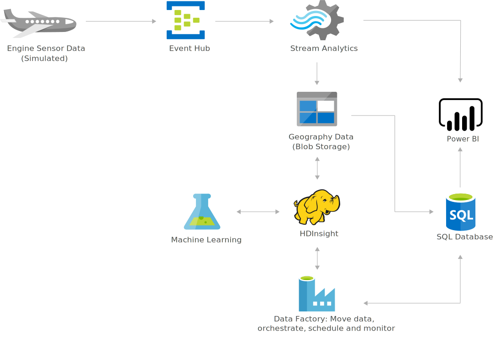
                        

                    

                    

                        <h3>Predictive Aircraft Engine Monitoring</h3>
                        
Microsoft Azures Predictive Maintenance solution demonstrates how to combine real-time aircraft data with analytics to monitor aircraft health

                    

                

            

        

    </a>
</li>
<li style="display: flex; flex-direction: column;">
    <a href="./articles/anomaly-detection-in-real-time-data-streams.md" style="display: flex; flex-direction: column; flex: 1 0 auto;">
        

            

                

                    

                        

                            
                        

                    

                    

                        <h3>Anomaly Detection in Real-time Data Streams</h3>
                        
Cortana Intelligence IT Anomaly Insights solution helps IT departments within large organizations quickly detect and fix issues based on underlying health metrics from IT infrastructure (CPU, Memory, etc

                    

                

            

        

    </a>
</li>
<li style="display: flex; flex-direction: column;">
    <a href="./articles/anomaly-detection-with-machine-learning.md" style="display: flex; flex-direction: column; flex: 1 0 auto;">
        

            

                

                    

                        

                            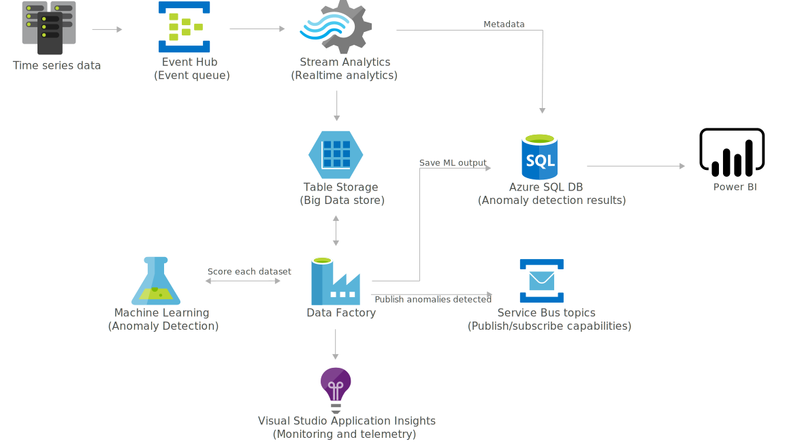
                        

                    

                    

                        <h3>Anomaly Detection with Machine Learning</h3>
                        
Microsoft Azures IT Anomaly Insights can help automate and scale anomaly detection for IT departments to quickly detect and fix issues

                    

                

            

        

    </a>
</li>
<li style="display: flex; flex-direction: column;">
    <a href="./articles/application-integration-using-event-grid.md" style="display: flex; flex-direction: column; flex: 1 0 auto;">
        

            

                

                    

                        

                            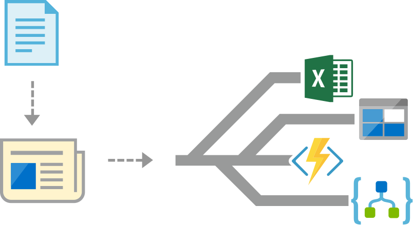
                        

                    

                    

                        <h3>Application integration using Event Grid</h3>
                        
Event Grid connects your app with other services

                    

                

            

        

    </a>
</li>
<li style="display: flex; flex-direction: column;">
    <a href="./articles/azure-devops-continuous-integration-and-continuous-deployment-for-azure-web-apps.md" style="display: flex; flex-direction: column; flex: 1 0 auto;">
        

            

                

                    

                        

                            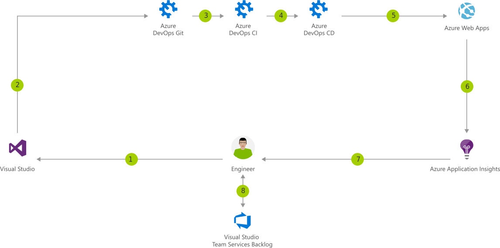
                        

                    

                    

                        <h3>CI/CD for Azure Web Apps</h3>
                        
Azure Web Apps is a fast and simple way to create web apps using ASP

                    

                

            

        

    </a>
</li>
<li style="display: flex; flex-direction: column;">
    <a href="./articles/azure-iot-subsystems.md" style="display: flex; flex-direction: column; flex: 1 0 auto;">
        

            

                

                    

                        

                            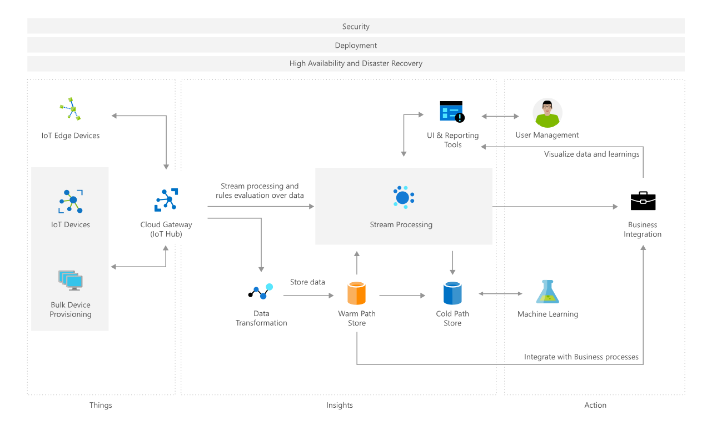
                        

                    

                    

                        <h3>IoT Architecture  Azure IoT Subsystems</h3>
                        
Learn about our recommended IoT application architecture that supports hybrid cloud and edge computing

                    

                

            

        

    </a>
</li>
<li style="display: flex; flex-direction: column;">
    <a href="./articles/backup-archive-cloud-application.md" style="display: flex; flex-direction: column; flex: 1 0 auto;">
        

            

                

                    

                        

                            
                        

                    

                    

                        <h3>Back up cloud applications and data to cloud</h3>
                        
Back up data and applications running in Azure to another Azure location by using Azure Backup or a partner solution

                    

                

            

        

    </a>
</li>
<li style="display: flex; flex-direction: column;">
    <a href="./articles/backup-archive-on-premises-applications.md" style="display: flex; flex-direction: column; flex: 1 0 auto;">
        

            

                

                    

                        

                            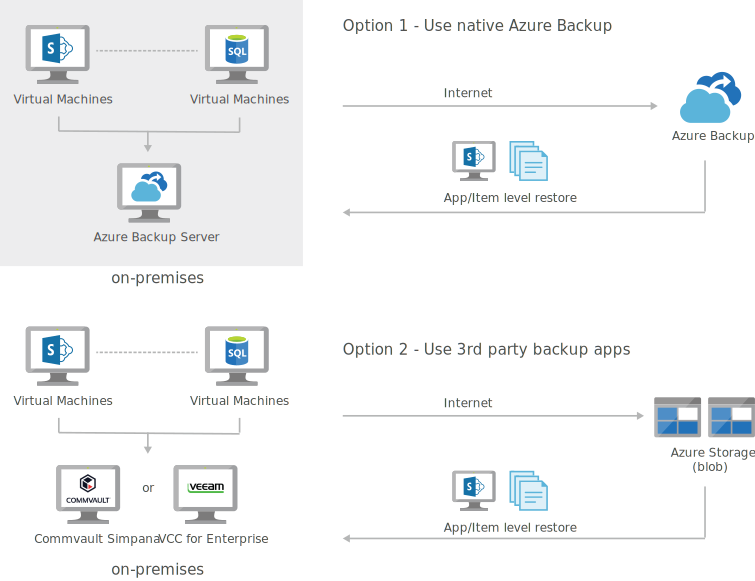
                        

                    

                    

                        <h3>Back up on-premises applications and data to cloud</h3>
                        
Back up on-premises applications and data with Azure Backup and Blob storage applications

                    

                

            

        

    </a>
</li>
<li style="display: flex; flex-direction: column;">
    <a href="./articles/backup-archive-on-premises.md" style="display: flex; flex-direction: column; flex: 1 0 auto;">
        

            

                

                    

                        

                            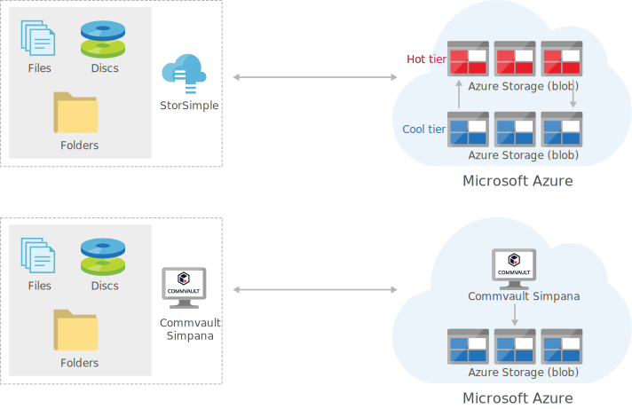
                        

                    

                    

                        <h3>Archive on-premises data to cloud</h3>
                        
Archive your on-premises data to Azure Blob storage

                    

                

            

        

    </a>
</li>
<li style="display: flex; flex-direction: column;">
    <a href="./articles/big-compute-with-azure-batch.md" style="display: flex; flex-direction: column; flex: 1 0 auto;">
        

            

                

                    

                        

                            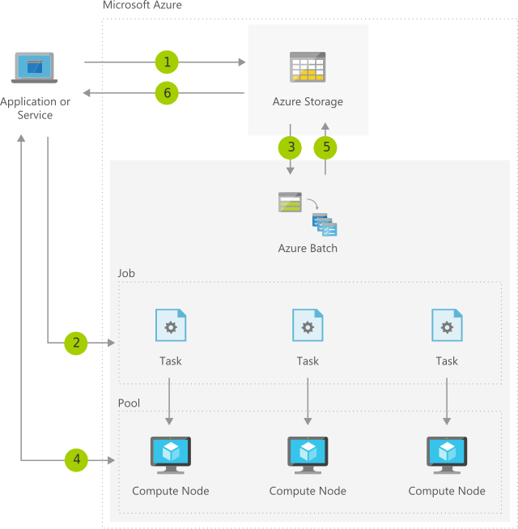
                        

                    

                    

                        <h3>HPC System and Big Compute Solutions</h3>
                        
Explore Big Compute solutions with Azure Batch

                    

                

            

        

    </a>
</li>
<li style="display: flex; flex-direction: column;">
    <a href="./articles/build-high-availability-into-your-bcdr-strategy.md" style="display: flex; flex-direction: column; flex: 1 0 auto;">
        

            

                

                    

                        

                            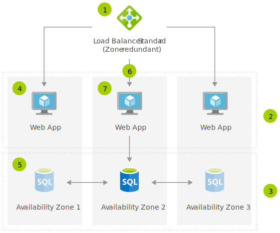
                        

                    

                    

                        <h3>Build high availability into your BCDR strategy</h3>
                        
Virtual machines (VMs) are physically separated

                    

                

            

        

    </a>
</li>
<li style="display: flex; flex-direction: column;">
    <a href="./articles/campaign-optimization-with-azure-hdinsight-spark-clusters.md" style="display: flex; flex-direction: column; flex: 1 0 auto;">
        

            

                

                    

                        

                            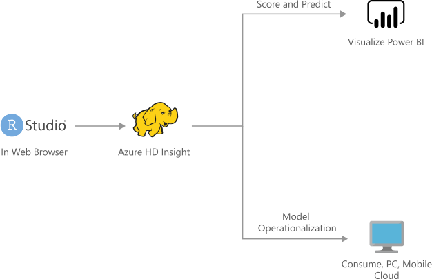
                        

                    

                    

                        <h3>Campaign Optimization with Azure HDInsight Spark Clusters</h3>
                        
This solution demonstrates how to build and deploy a machine learning model with Microsoft R Server on Azure HDInsight Spark clusters to recommend actions to maximize the purchase rate of leads targeted by a campaign

                    

                

            

        

    </a>
</li>
<li style="display: flex; flex-direction: column;">
    <a href="./articles/campaign-optimization-with-sql-server.md" style="display: flex; flex-direction: column; flex: 1 0 auto;">
        

            

                

                    

                        

                            
                        

                    

                    

                        <h3>Campaign Optimization with SQL Server</h3>
                        
This solution demonstrates how to build and deploy a machine learning model with SQL Server 2016 with R Services to recommend actions to maximize the purchase rate of leads targeted by a campaign

                    

                

            

        

    </a>
</li>
<li style="display: flex; flex-direction: column;">
    <a href="./articles/cicd-for-azure-vms.md" style="display: flex; flex-direction: column; flex: 1 0 auto;">
        

            

                

                    

                        

                            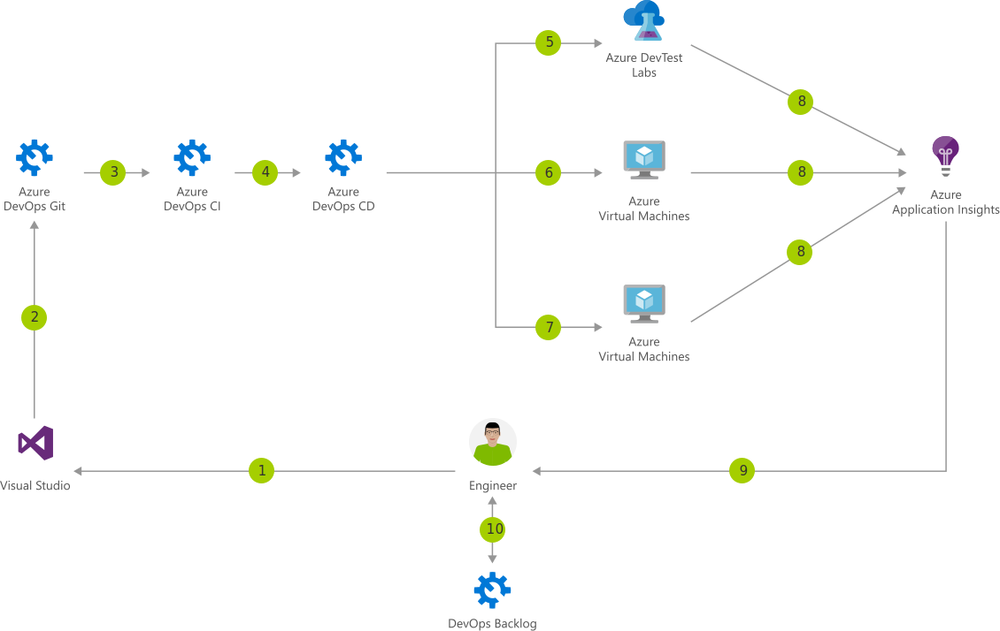
                        

                    

                    

                        <h3>CI/CD for Azure VMs</h3>
                        
Azure is a world-class cloud for hosting virtual machines running Windows or Linux

                    

                

            

        

    </a>
</li>
<li style="display: flex; flex-direction: column;">
    <a href="./articles/cicd-for-containers.md" style="display: flex; flex-direction: column; flex: 1 0 auto;">
        

            

                

                    

                        

                            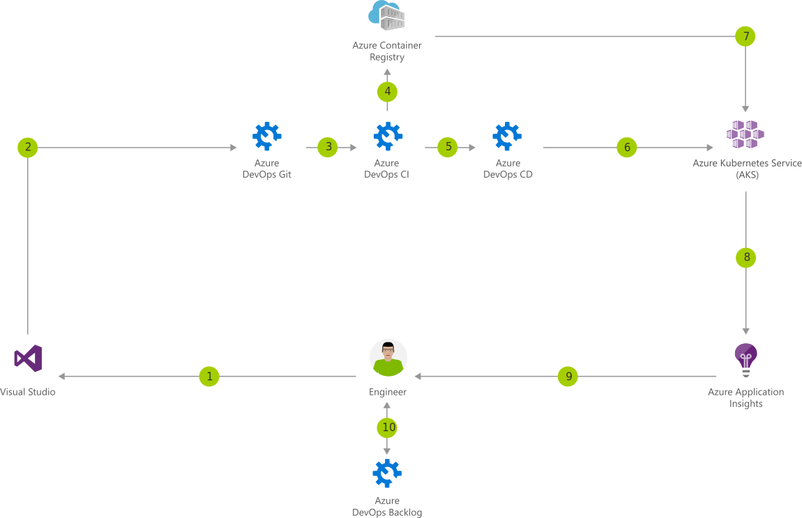
                        

                    

                    

                        <h3>CI/CD for Containers</h3>
                        
Containers make it very easy for you to continuously build and deploy your applications

                    

                

            

        

    </a>
</li>
<li style="display: flex; flex-direction: column;">
    <a href="./articles/commerce-chatbot.md" style="display: flex; flex-direction: column; flex: 1 0 auto;">
        

            

                

                    

                        

                            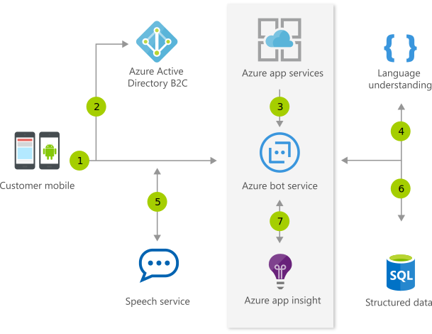
                        

                    

                    

                        <h3>Commerce Chatbot</h3>
                        
Together, the Azure Bot Service and Language Understanding service enable developers to create conversational interfaces for various scenarios like banking, travel, and entertainment

                    

                

            

        

    </a>
</li>
<li style="display: flex; flex-direction: column;">
    <a href="./articles/container-cicd-using-jenkins-and-kubernetes-on-azure-container-service.md" style="display: flex; flex-direction: column; flex: 1 0 auto;">
        

            

                

                    

                        

                            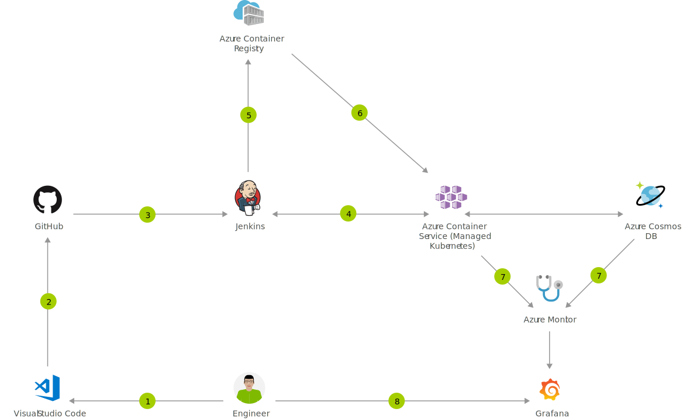
                        

                    

                    

                        <h3>Container CI/CD using Jenkins and Kubernetes on Azure Kubernetes Service (AKS)</h3>
                        
Containers make it easy for you to continuously build and deploy applications

                    

                

            

        

    </a>
</li>
<li style="display: flex; flex-direction: column;">
    <a href="./articles/cross-platform-chat.md" style="display: flex; flex-direction: column; flex: 1 0 auto;">
        

            

                

                    

                        

                            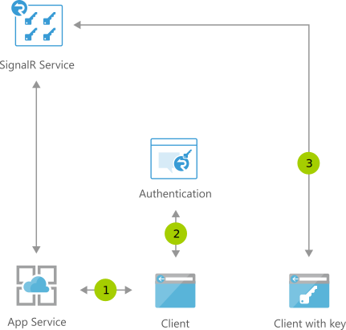
                        

                    

                    

                        <h3>Cross-platform Chat | Microsoft</h3>
                        
Accelerate development of reliable, high-performing chat applications

                    

                

            

        

    </a>
</li>
<li style="display: flex; flex-direction: column;">
    <a href="./articles/custom-mobile-workforce-app.md" style="display: flex; flex-direction: column; flex: 1 0 auto;">
        

            

                

                    

                        

                            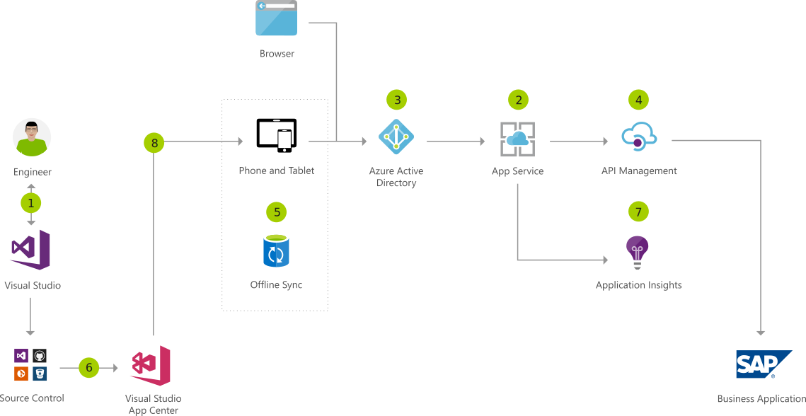
                        

                    

                    

                        <h3>Custom Mobile Workforce App</h3>
                        
Learn how the custom mobile workforce management app architecture is built and implemented with a step-by-step diagram that illustrates the integration of Active Directory, SAP, and Azure App Service

                    

                

            

        

    </a>
</li>
<li style="display: flex; flex-direction: column;">
    <a href="./articles/customer-360.md" style="display: flex; flex-direction: column; flex: 1 0 auto;">
        

            

                

                    

                        

                            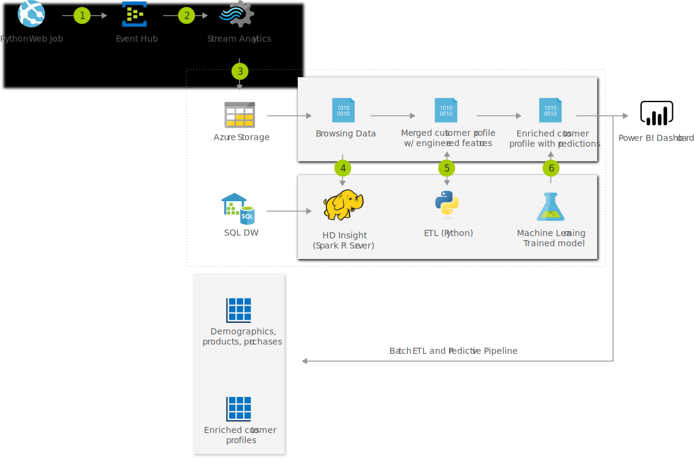
                        

                    

                    

                        <h3>Customer 360</h3>
                        
A deep understanding between customer interests and purchasing patterns is a critical component of any retail business intelligence operation

                    

                

            

        

    </a>
</li>
<li style="display: flex; flex-direction: column;">
    <a href="./articles/customer-churn-prediction.md" style="display: flex; flex-direction: column; flex: 1 0 auto;">
        

            

                

                    

                        

                            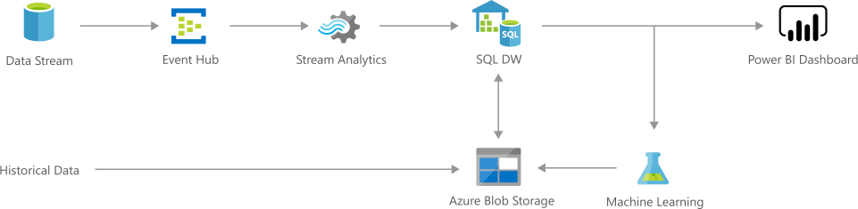
                        

                    

                    

                        <h3>Customer Churn Prediction</h3>
                        
Customer Churn Prediction uses Cortana Intelligence Suite components to predict churn probability and helps find patterns in existing data associated with the predicted churn rate

                    

                

            

        

    </a>
</li>
<li style="display: flex; flex-direction: column;">
    <a href="./articles/data-cache-with-redis-cache.md" style="display: flex; flex-direction: column; flex: 1 0 auto;">
        

            

                

                    

                        

                            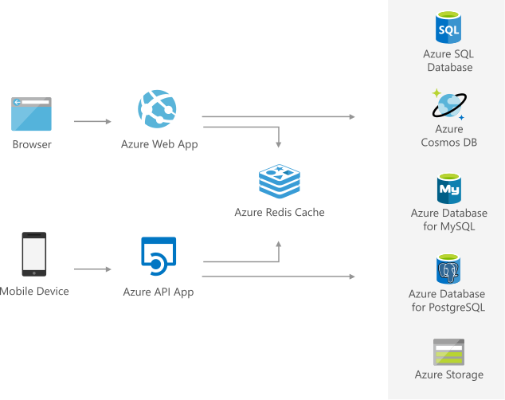
                        

                    

                    

                        <h3>Data cache</h3>
                        
data cache, data cache with azure cache for redis, azure database, cosmos db

                    

                

            

        

    </a>
</li>
<li style="display: flex; flex-direction: column;">
    <a href="./articles/defect-prevention-with-predictive-maintenance.md" style="display: flex; flex-direction: column; flex: 1 0 auto;">
        

            

                

                    

                        

                            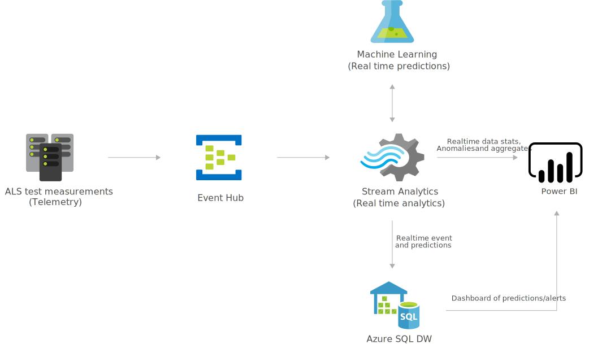
                        

                    

                    

                        <h3>Defect prevention with predictive maintenance</h3>
                        
Learn how to use Azure Machine Learning to predict failures before they happen with real-time assembly line data

                    

                

            

        

    </a>
</li>
<li style="display: flex; flex-direction: column;">
    <a href="./articles/demand-forecasting-and-price-optimization.md" style="display: flex; flex-direction: column; flex: 1 0 auto;">
        

            

                

                    

                        

                            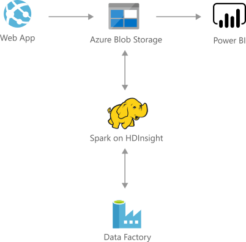
                        

                    

                    

                        <h3>Demand Forecasting and Price Optimization</h3>
                        
Pricing is recognized as a pivotal determinant of success in many industries and can be one of the most challenging tasks

                    

                

            

        

    </a>
</li>
<li style="display: flex; flex-direction: column;">
    <a href="./articles/demand-forecasting-for-shipping-and-distribution.md" style="display: flex; flex-direction: column; flex: 1 0 auto;">
        

            

                

                    

                        

                            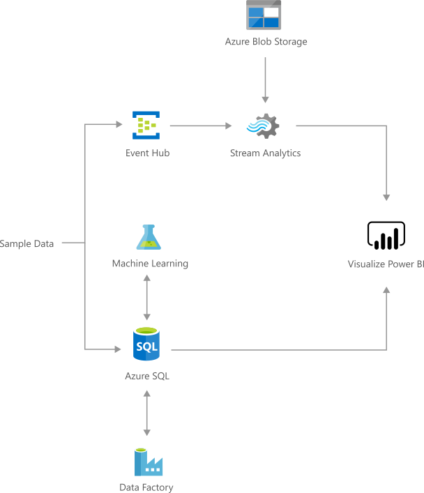
                        

                    

                    

                        <h3>Demand Forecasting for Shipping and Distribution</h3>
                        
The Demand Forecasting for Shipping and Distribution Solution uses historical demand data to forecast demand in future periods across varios customers, products and destinations

                    

                

            

        

    </a>
</li>
<li style="display: flex; flex-direction: column;">
    <a href="./articles/demand-forecasting-price-optimization-marketing.md" style="display: flex; flex-direction: column; flex: 1 0 auto;">
        

            

                

                    

                        

                            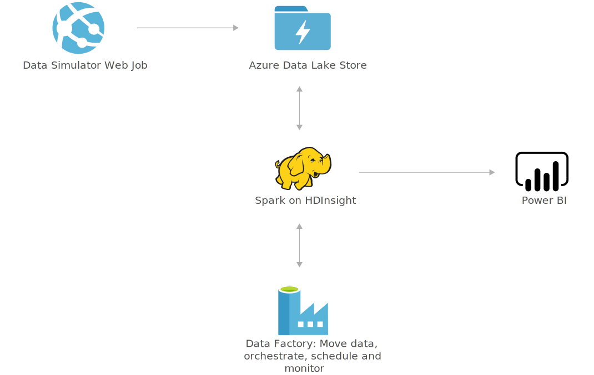
                        

                    

                    

                        <h3>Demand Forecasting + Price Optimization</h3>
                        
Predict future customer demand and optimize pricing to maximize profitability using big-data and advanced-analytics services from Microsoft Azure

                    

                

            

        

    </a>
</li>
<li style="display: flex; flex-direction: column;">
    <a href="./articles/demand-forecasting.md" style="display: flex; flex-direction: column; flex: 1 0 auto;">
        

            

                

                    

                        

                            
                        

                    

                    

                        <h3>Demand Forecasting</h3>
                        
Accurately forecasting spikes in demand for products and services can give a company a competitive advantage

                    

                

            

        

    </a>
</li>
<li style="display: flex; flex-direction: column;">
    <a href="./articles/dev-test-iaas.md" style="display: flex; flex-direction: column; flex: 1 0 auto;">
        

            

                

                    

                        

                            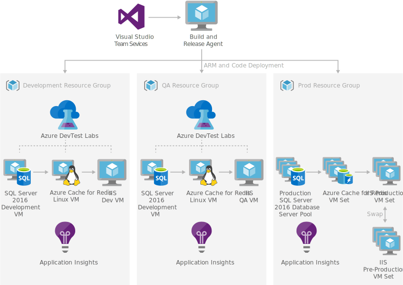
                        

                    

                    

                        <h3>Dev-Test deployment for testing IaaS solutions</h3>
                        
This architecture represents how to configure your infrastructure for development and testing of a standard IaaS-based SaaS system

                    

                

            

        

    </a>
</li>
<li style="display: flex; flex-direction: column;">
    <a href="./articles/dev-test-image-factory.md" style="display: flex; flex-direction: column; flex: 1 0 auto;">
        

            

                

                    

                        

                            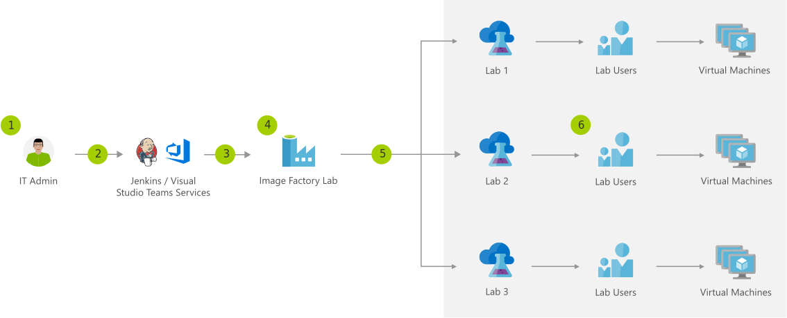
                        

                    

                    

                        <h3>DevTest Image Factory</h3>
                        
Create, maintain, and distribute custom images with the DevTest Image Factory, an automated image development and management solution from Azure Dev Test Labs

                    

                

            

        

    </a>
</li>
<li style="display: flex; flex-direction: column;">
    <a href="./articles/dev-test-microservice.md" style="display: flex; flex-direction: column; flex: 1 0 auto;">
        

            

                

                    

                        

                            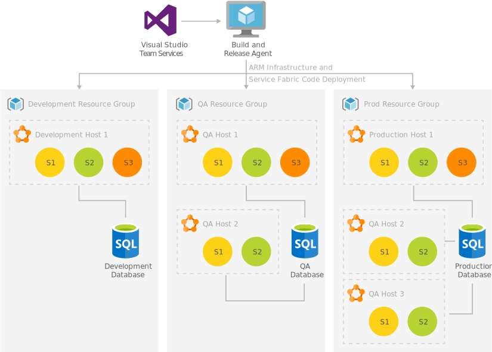
                        

                    

                    

                        <h3>Dev-Test deployment for testing microservice solutions</h3>
                        
This architecture represents how to configure your infrastructure for development and testing of a microservices-based system

                    

                

            

        

    </a>
</li>
<li style="display: flex; flex-direction: column;">
    <a href="./articles/dev-test-paas.md" style="display: flex; flex-direction: column; flex: 1 0 auto;">
        

            

                

                    

                        

                            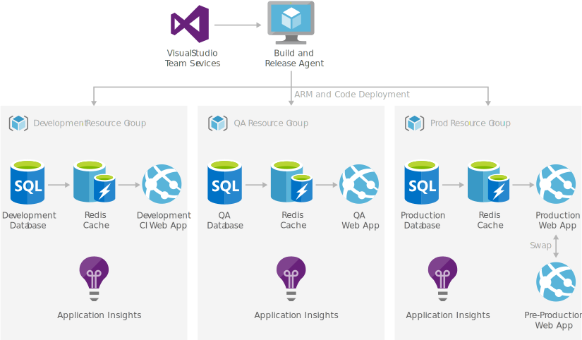
                        

                    

                    

                        <h3>Dev-Test deployment for testing PaaS solutions</h3>
                        
This architecture represents how to configure your infrastructure for development and testing of a standard PaaS-style system

                    

                

            

        

    </a>
</li>
<li style="display: flex; flex-direction: column;">
    <a href="./articles/digital-marketing-episerver.md" style="display: flex; flex-direction: column; flex: 1 0 auto;">
        

            

                

                    

                        

                            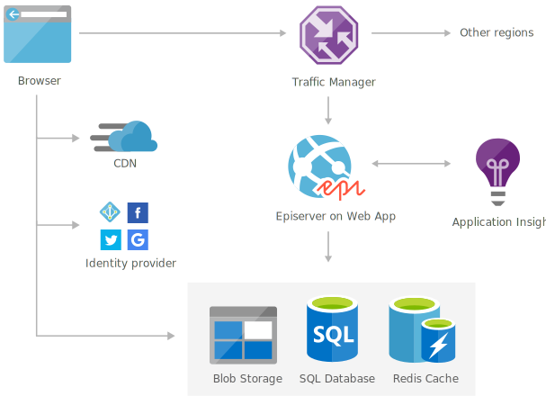
                        

                    

                    

                        <h3>Scalable Episerver marketing website</h3>
                        
Let your business run multi-channel digital marketing websites on one platform and spin up and spin down campaigns on demand

                    

                

            

        

    </a>
</li>
<li style="display: flex; flex-direction: column;">
    <a href="./articles/digital-marketing-sitecore.md" style="display: flex; flex-direction: column; flex: 1 0 auto;">
        

            

                

                    

                        

                            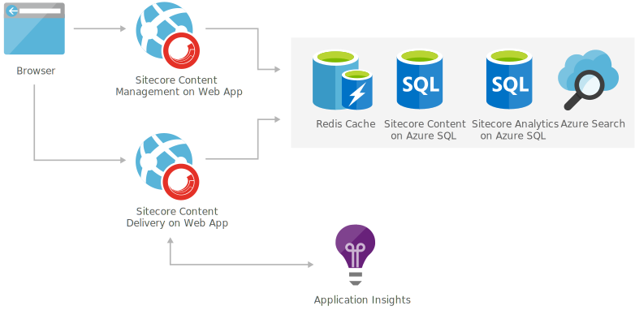
                        

                    

                    

                        <h3>Scalable Sitecore marketing website</h3>
                        
With the Sitecore Experience Platform (xP), you have at your fingertips the complete data, integrated tools, and automation capabilities to engage your customers throughout an iterative life cyclethe technology foundation necessary to win customers for life

                    

                

            

        

    </a>
</li>
<li style="display: flex; flex-direction: column;">
    <a href="./articles/digital-marketing-smb.md" style="display: flex; flex-direction: column; flex: 1 0 auto;">
        

            

                

                    

                        

                            
                        

                    

                    

                        <h3>Simple digital marketing website</h3>
                        
Start simple with the content management system that enables you to easily maintain the messaging on your website in real-time, from a browser, with no coding skills

                    

                

            

        

    </a>
</li>
<li style="display: flex; flex-direction: column;">
    <a href="./articles/digital-marketing-using-azure-database-for-mysql.md" style="display: flex; flex-direction: column; flex: 1 0 auto;">
        

            

                

                    

                        

                            
                        

                    

                    

                        <h3>Digital Marketing using Azure Database for MySQL</h3>
                        
Engage with customers around the world with rich, personalized digital marketing experiences

                    

                

            

        

    </a>
</li>
<li style="display: flex; flex-direction: column;">
    <a href="./articles/digital-marketing-using-azure-database-for-postgresql.md" style="display: flex; flex-direction: column; flex: 1 0 auto;">
        

            

                

                    

                        

                            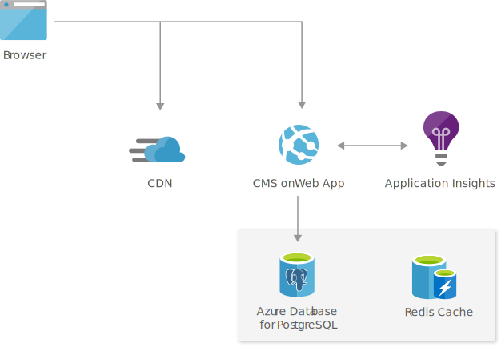
                        

                    

                    

                        <h3>Engage with customers around the world with rich, personalized digital marketing experiences. Quickly build and launch digital campaigns that automatically scale based on customer demand.</h3>
                        
Engage with customers around the world with rich, personalized digital marketing experiences

                    

                

            

        

    </a>
</li>
<li style="display: flex; flex-direction: column;">
    <a href="./articles/digital-media-live-stream.md" style="display: flex; flex-direction: column; flex: 1 0 auto;">
        

            

                

                    

                        

                            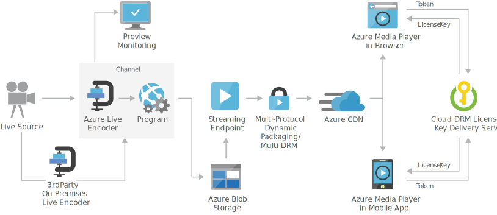
                        

                    

                    

                        <h3>Live streaming digital media</h3>
                        
A live streaming solution allows you to capture video in real-time and broadcast it to consumers in real time, such as streaming interviews, conferences, and sporting events online

                    

                

            

        

    </a>
</li>
<li style="display: flex; flex-direction: column;">
    <a href="./articles/digital-media-speech-text.md" style="display: flex; flex-direction: column; flex: 1 0 auto;">
        

            

                

                    

                        

                            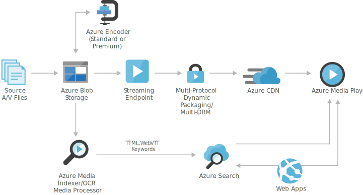
                        

                    

                    

                        <h3>Keyword search/speech-to-text/OCR digital media</h3>
                        
A speech-to-text solution allows you to identify speech in static video files so you can manage it as standard content, such as allowing employees to search within training videos for spoken words or phrases, and then enabling them to quickly navigate to the specific moment in the video

                    

                

            

        

    </a>
</li>
<li style="display: flex; flex-direction: column;">
    <a href="./articles/digital-media-video.md" style="display: flex; flex-direction: column; flex: 1 0 auto;">
        

            

                

                    

                        

                            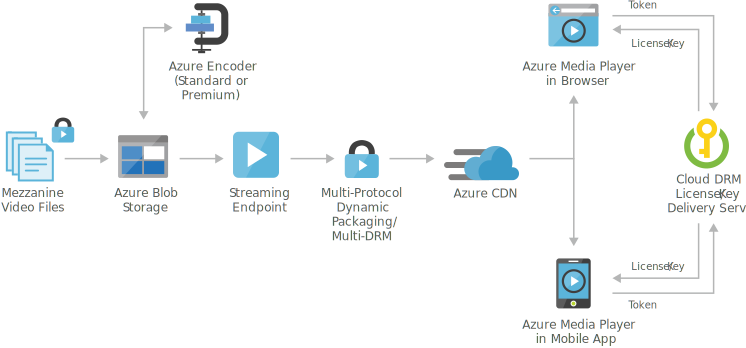
                        

                    

                    

                        <h3>Video-on-demand digital media</h3>
                        
A basic video-on-demand solution that gives you the capability to stream recorded video content such as movies, news clips, sports segments, training videos, and customer support tutorials to any video-capable endpoint device, mobile application, or desktop browser

                    

                

            

        

    </a>
</li>
<li style="display: flex; flex-direction: column;">
    <a href="./articles/disaster-recovery-enterprise-scale-dr.md" style="display: flex; flex-direction: column; flex: 1 0 auto;">
        

            

                

                    

                        

                            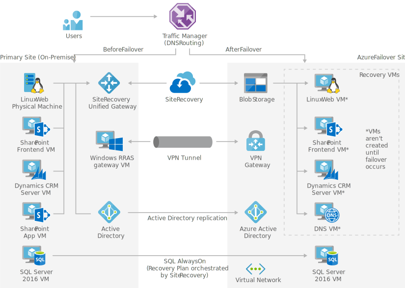
                        

                    

                    

                        <h3>Enterprise-scale disaster recovery</h3>
                        
A large enterprise architecture for SharePoint, Dynamics CRM, and Linux web servers hosted on an on-premises datacenter with failover to Azure infrastructure

                    

                

            

        

    </a>
</li>
<li style="display: flex; flex-direction: column;">
    <a href="./articles/disaster-recovery-smb-azure-site-recovery.md" style="display: flex; flex-direction: column; flex: 1 0 auto;">
        

            

                

                    

                        

                            
                        

                    

                    

                        <h3>SMB disaster recovery with Azure Site Recovery</h3>
                        
Small and medium businesses can inexpensively implement disaster recovery to the cloud by using Azure Site Recovery or a partner solution like Double-Take DR

                    

                

            

        

    </a>
</li>
<li style="display: flex; flex-direction: column;">
    <a href="./articles/disaster-recovery-smb-double-take-dr.md" style="display: flex; flex-direction: column; flex: 1 0 auto;">
        

            

                

                    

                        

                            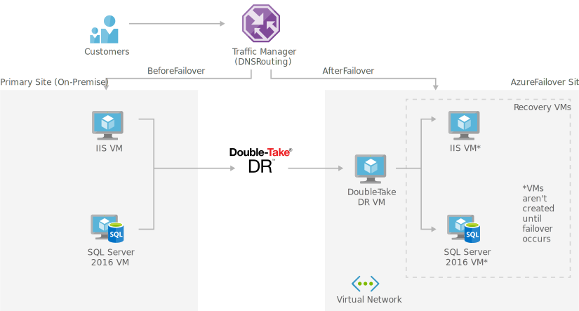
                        

                    

                    

                        <h3>SMB disaster recovery with Double-Take DR</h3>
                        
Small and medium businesses can inexpensively implement disaster recovery to the cloud by using a partner solution like Double-Take DR

                    

                

            

        

    </a>
</li>
<li style="display: flex; flex-direction: column;">
    <a href="./articles/ecommerce-website-running-in-secured-ase.md" style="display: flex; flex-direction: column; flex: 1 0 auto;">
        

            

                

                    

                        

                            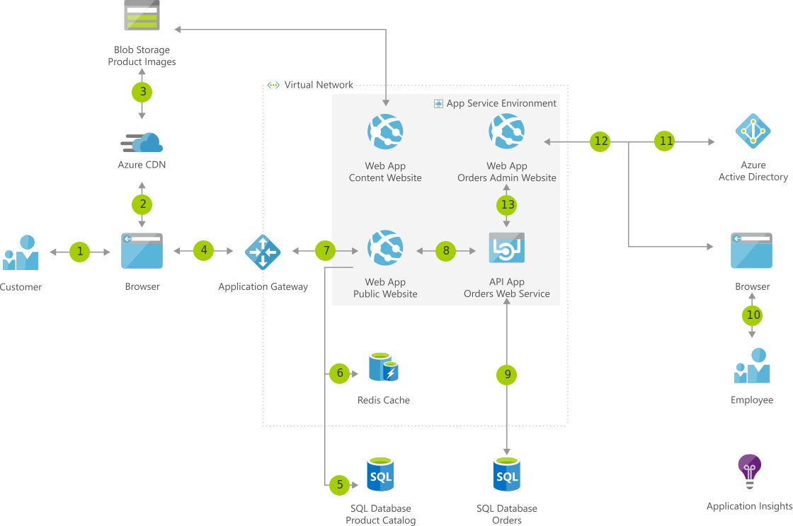
                        

                    

                    

                        <h3>E-commerce website running in secured App Service Environment</h3>
                        
Secure your e-commerce website's sensitive user and payment data using the Microsoft Azure App Service Environment

                    

                

            

        

    </a>
</li>
<li style="display: flex; flex-direction: column;">
    <a href="./articles/energy-supply-optimization.md" style="display: flex; flex-direction: column; flex: 1 0 auto;">
        

            

                

                    

                        

                            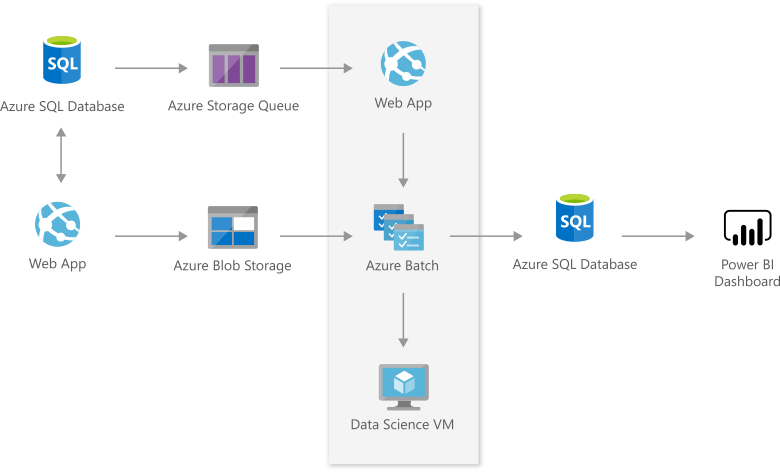
                        

                    

                    

                        <h3>Energy Supply Optimization</h3>
                        
In an energy grid, energy consumers are engaged with various types of energy supplying, trading, and storage components such as substations, batteries, windfarms and solar panels, micro-turbines, as well as demand response bids, to meet their respective demands and minimize the cost of energy commitment

                    

                

            

        

    </a>
</li>
<li style="display: flex; flex-direction: column;">
    <a href="./articles/enterprise-productivity-chatbot.md" style="display: flex; flex-direction: column; flex: 1 0 auto;">
        

            

                

                    

                        

                            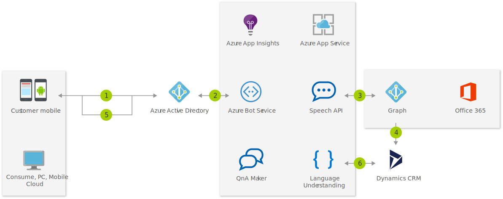
                        

                    

                    

                        <h3>Enterprise Productivity Chatbot</h3>
                        
Azure Bot Service can be easily combined with Language Understanding to build powerful enterprise productivity bots, allowing organizations to streamline common work activities by integrating external systems, such as Office 365 calendar, customer cases stored in Dynamics CRM and much more

                    

                

            

        

    </a>
</li>
<li style="display: flex; flex-direction: column;">
    <a href="./articles/extend-your-on-premises-big-data-investments-with-hdinsight.md" style="display: flex; flex-direction: column; flex: 1 0 auto;">
        

            

                

                    

                        

                            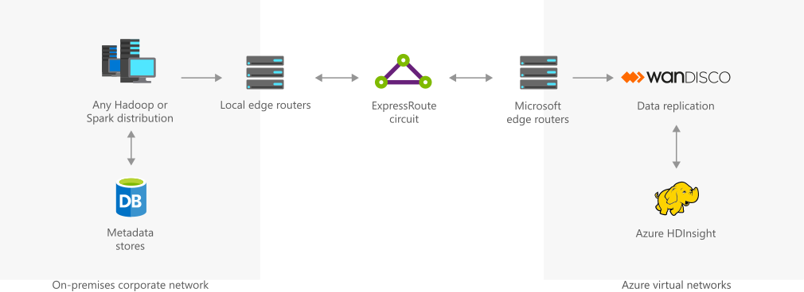
                        

                    

                    

                        <h3>Extend your on-premises big data investments with HDInsight</h3>
                        
Extend your on-premises big data investments to the cloud and transform your business using the advanced analytics capabilities of HDInsight

                    

                

            

        

    </a>
</li>
<li style="display: flex; flex-direction: column;">
    <a href="./articles/extract-transform-and-load-using-hdinsight.md" style="display: flex; flex-direction: column; flex: 1 0 auto;">
        

            

                

                    

                        

                            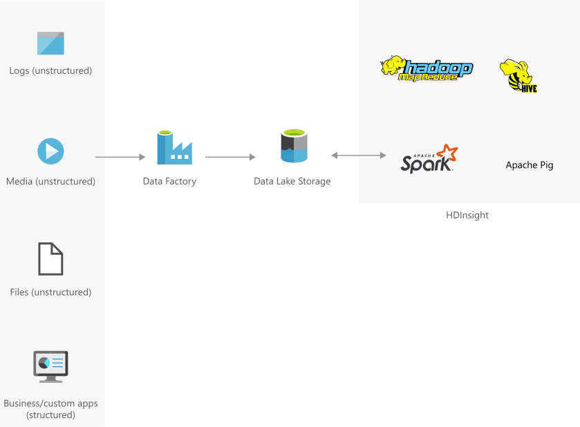
                        

                    

                    

                        <h3>Extract, transform, and load (ETL) using HDInsight</h3>
                        
Extract, transform, and load your big data clusters on demand with Hadoop MapReduce and Apache Spark

                    

                

            

        

    </a>
</li>
<li style="display: flex; flex-direction: column;">
    <a href="./articles/faq-chatbot-with-data-champion-model.md" style="display: flex; flex-direction: column; flex: 1 0 auto;">
        

            

                

                    

                        

                            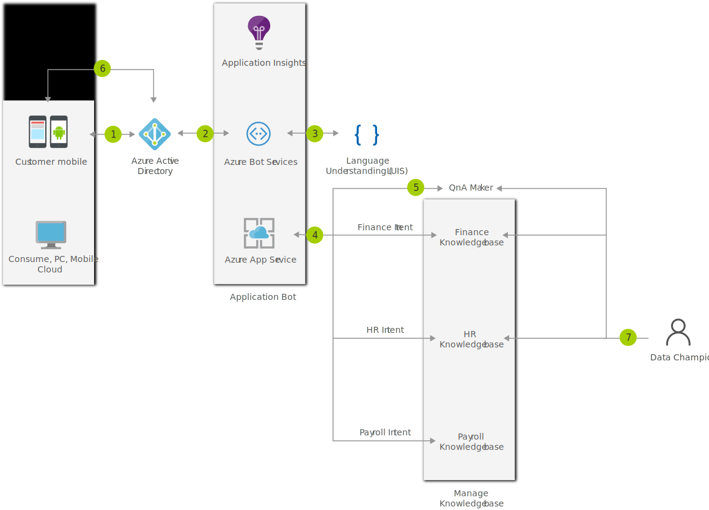
                        

                    

                    

                        <h3>FAQ Chatbox with data champion model</h3>
                        
The QnA Maker tool makes it super easy for the content owners to maintain their knowledge base of QnAs

                    

                

            

        

    </a>
</li>
<li style="display: flex; flex-direction: column;">
    <a href="./articles/finance-management-apps-using-azure-database-for-mysql.md" style="display: flex; flex-direction: column; flex: 1 0 auto;">
        

            

                

                    

                        

                            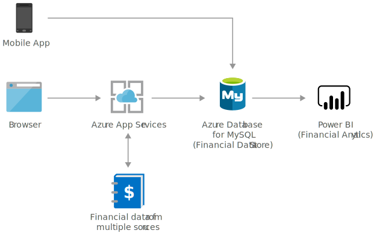
                        

                    

                    

                        <h3>Finance management apps using Azure Database for MySQL</h3>
                        
Securely store critical data and provide high-value analytics and insights over aggregated data to users, using in-built security and performance

                    

                

            

        

    </a>
</li>
<li style="display: flex; flex-direction: column;">
    <a href="./articles/finance-management-apps-using-azure-database-for-postgresql.md" style="display: flex; flex-direction: column; flex: 1 0 auto;">
        

            

                

                    

                        

                            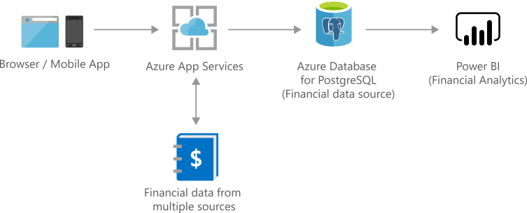
                        

                    

                    

                        <h3>Finance management apps using Azure Database for PostgreSQL</h3>
                        
Securely store critical data and provide high-value analytics and insights over aggregated data to users, using in-built security and performance

                    

                

            

        

    </a>
</li>
<li style="display: flex; flex-direction: column;">
    <a href="./articles/forecast-energy-power-demand.md" style="display: flex; flex-direction: column; flex: 1 0 auto;">
        

            

                

                    

                        

                            
                        

                    

                    

                        <h3>Forecast Energy and Power Demand</h3>
                        
Learn how Microsoft Azure can help accurately forecast spikes in demand for energy products and services to give your company a competitive advantage

                    

                

            

        

    </a>
</li>
<li style="display: flex; flex-direction: column;">
    <a href="./articles/gaming-using-azure-database-for-mysql.md" style="display: flex; flex-direction: column; flex: 1 0 auto;">
        

            

                

                    

                        

                            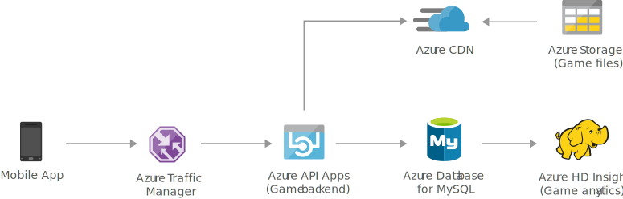
                        

                    

                    

                        <h3>Gaming using Azure Database for MySQL</h3>
                        
Scale your databases elastically to accommodate unpredictable bursts of traffic and deliver low-latency multi-player experiences

                    

                

            

        

    </a>
</li>
<li style="display: flex; flex-direction: column;">
    <a href="./articles/gaming-using-cosmos-db.md" style="display: flex; flex-direction: column; flex: 1 0 auto;">
        

            

                

                    

                        

                            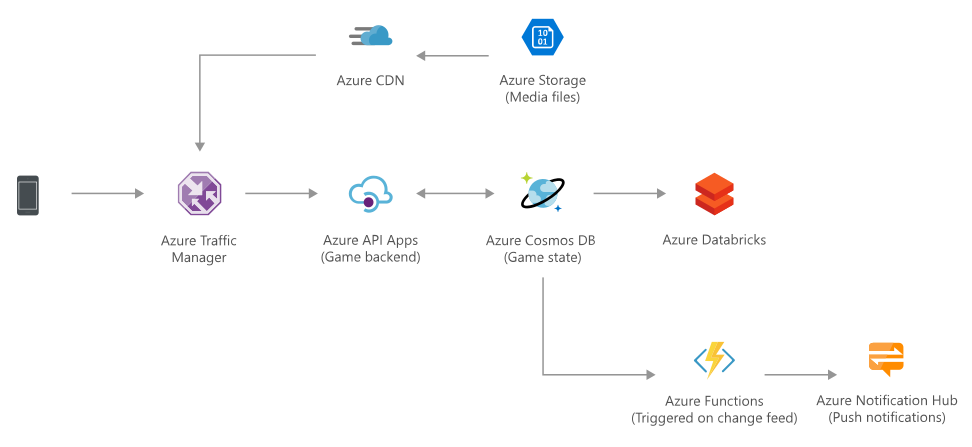
                        

                    

                    

                        <h3>Gaming using Cosmos DB</h3>
                        
Elastically scale your database to accommodate unpredictable bursts of traffic and deliver low-latency multi-player experiences on a global scale

                    

                

            

        

    </a>
</li>
<li style="display: flex; flex-direction: column;">
    <a href="./articles/globally-distributed-mission-critical-applications-using-cosmos-db.md" style="display: flex; flex-direction: column; flex: 1 0 auto;">
        

            

                

                    

                        

                            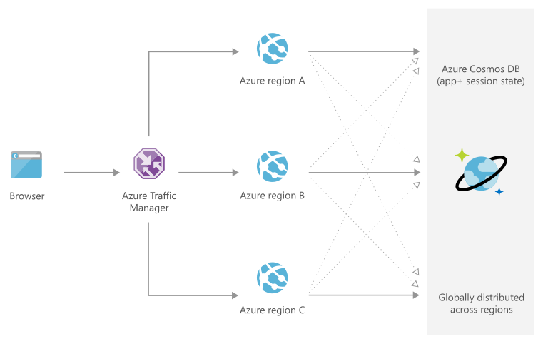
                        

                    

                    

                        <h3>Globally distributed applications using Cosmos DB</h3>
                        
Guarantee access to users around the world with the high-availability and low-latency capabilities built into Microsofts global datacenters

                    

                

            

        

    </a>
</li>
<li style="display: flex; flex-direction: column;">
    <a href="./articles/hpc-cluster.md" style="display: flex; flex-direction: column; flex: 1 0 auto;">
        

            

                

                    

                        

                            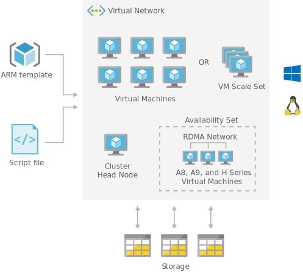
                        

                    

                    

                        <h3>HPC cluster deployed in the cloud</h3>
                        
High performance computing (HPC) applications can scale to thousands of compute cores, extend on-premises big compute, or run as a 100% cloud native solution

                    

                

            

        

    </a>
</li>
<li style="display: flex; flex-direction: column;">
    <a href="./articles/hybrid-ci-cd.md" style="display: flex; flex-direction: column; flex: 1 0 auto;">
        

            

                

                    

                        

                            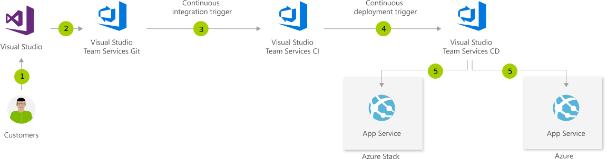
                        

                    

                    

                        <h3>Hybrid CI/CD</h3>
                        
Easily implement the practice of CI/CD by using a consistent set of development tools and processes across the Azure public cloud and on-premises Azure Stack environments

                    

                

            

        

    </a>
</li>
<li style="display: flex; flex-direction: column;">
    <a href="./articles/hybrid-connectivity.md" style="display: flex; flex-direction: column; flex: 1 0 auto;">
        

            

                

                    

                        

                            
                        

                    

                    

                        <h3>Hybrid Connection</h3>
                        
Azure's Hybrid Connection is a foundational blueprint that is applicable to most Azure Stack solutions, allowing you to establish connectivity for any application that involves communications between the Azure public cloud and on-premises Azure Stack components

                    

                

            

        

    </a>
</li>
<li style="display: flex; flex-direction: column;">
    <a href="./articles/hybrid-hpc-in-azure-with-hpc-pack.md" style="display: flex; flex-direction: column; flex: 1 0 auto;">
        

            

                

                    

                        

                            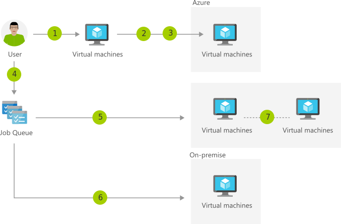
                        

                    

                    

                        <h3>Hybrid HPC in Azure with HPC Pack</h3>
                        
Get a hybrid high performance computing solution built with Windows Server technology

                    

                

            

        

    </a>
</li>
<li style="display: flex; flex-direction: column;">
    <a href="./articles/hybrid-identity.md" style="display: flex; flex-direction: column; flex: 1 0 auto;">
        

            

                

                    

                        

                            
                        

                    

                    

                        <h3>Hybrid Identity</h3>
                        
The Hybrid Identity blueprint enables teams to manage applications and user identity consistently across clouds with the utilization of Azure Stack

                    

                

            

        

    </a>
</li>
<li style="display: flex; flex-direction: column;">
    <a href="./articles/image-classification-with-convolutional-neural-networks.md" style="display: flex; flex-direction: column; flex: 1 0 auto;">
        

            

                

                    

                        

                            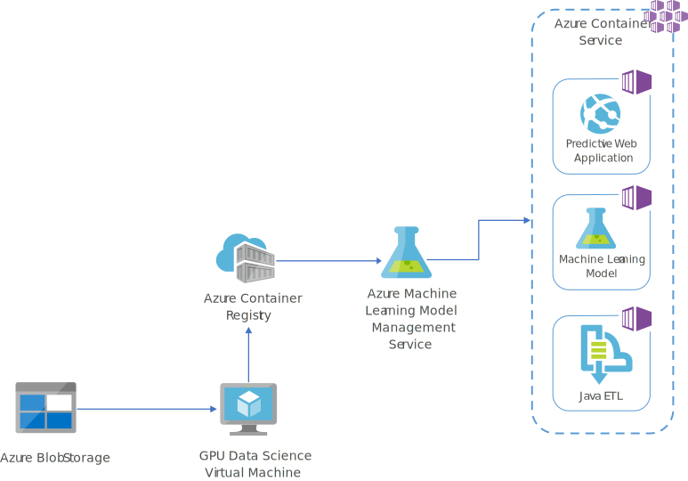
                        

                    

                    

                        <h3>Image classification with Convolutional Neural Networks</h3>
                        
Explore transfer learning, convolutional neural networks, and gradient-boosting decision tree algorithms

                    

                

            

        

    </a>
</li>
<li style="display: flex; flex-direction: column;">
    <a href="./articles/immutable-infrastructure-cicd-using-jenkins-and-terraform-on-azure-virtual-architecture-overview.md" style="display: flex; flex-direction: column; flex: 1 0 auto;">
        

            

                

                    

                        

                            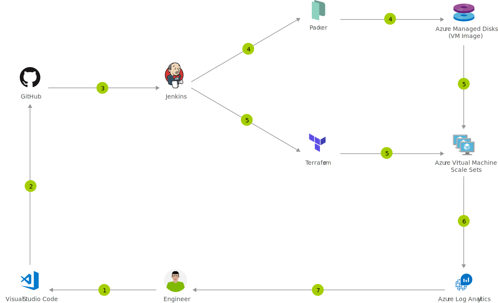
                        

                    

                    

                        <h3>Immutable Infrastructure CI/CD using Jenkins and Terraform on Azure Virtual Architecture overview</h3>
                        
Azure is a world-class cloud for hosting virtual machines running Windows or Linux

                    

                

            

        

    </a>
</li>
<li style="display: flex; flex-direction: column;">
    <a href="./articles/information-chatbot.md" style="display: flex; flex-direction: column; flex: 1 0 auto;">
        

            

                

                    

                        

                            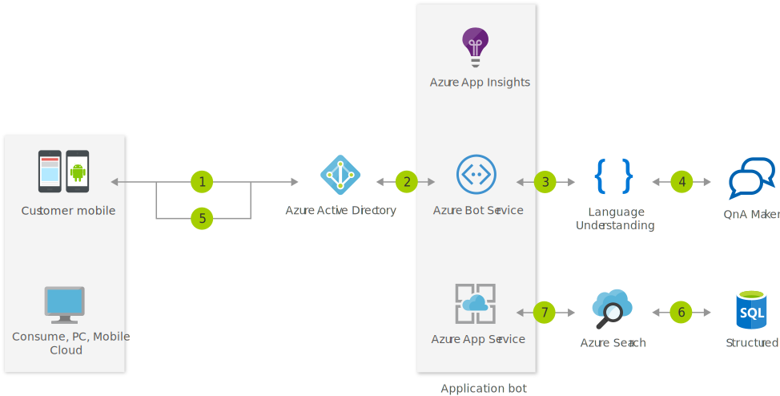
                        

                    

                    

                        <h3>Information Chatbot | Microsoft</h3>
                        
This Informational Bot can answer questions defined in a knowledge set or FAQ using Cognitive Services QnA Maker and answer more open-ended questions using Azure Search

                    

                

            

        

    </a>
</li>
<li style="display: flex; flex-direction: column;">
    <a href="./articles/information-discovery-with-deep-learning-and-nlp.md" style="display: flex; flex-direction: column; flex: 1 0 auto;">
        

            

                

                    

                        

                            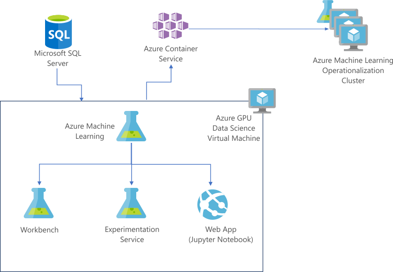
                        

                    

                    

                        <h3>Information discovery with deep learning and NLP</h3>
                        
See how deep learning and natural language processing can be used effectively with the Microsoft AI platform

                    

                

            

        

    </a>
</li>
<li style="display: flex; flex-direction: column;">
    <a href="./articles/instant-broadcasting-on-serverless-architecture.md" style="display: flex; flex-direction: column; flex: 1 0 auto;">
        

            

                

                    

                        

                            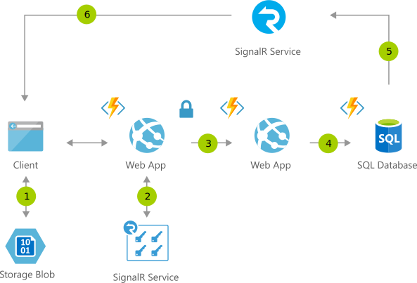
                        

                    

                    

                        <h3>Instant Broadcasting on Serverless Architecture | Microsoft</h3>
                        
Simplify one-to-many real-time communication and updates using serverless code

                    

                

            

        

    </a>
</li>
<li style="display: flex; flex-direction: column;">
    <a href="./articles/intelligent-apps-using-azure-database-for-mysql.md" style="display: flex; flex-direction: column; flex: 1 0 auto;">
        

            

                

                    

                        

                            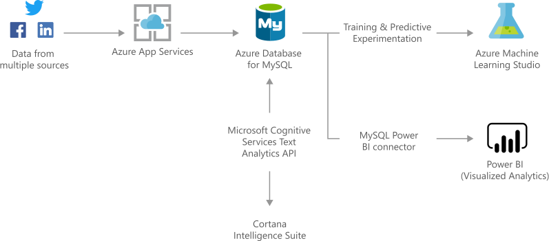
                        

                    

                    

                        <h3>Intelligent apps using Azure Database for MySQL</h3>
                        
Develop sophisticated, transformational apps using state of the art machine learning algorithms and integrated visualization tools to get actionable insights and analytics

                    

                

            

        

    </a>
</li>
<li style="display: flex; flex-direction: column;">
    <a href="./articles/intelligent-apps-using-azure-database-for-postgresql.md" style="display: flex; flex-direction: column; flex: 1 0 auto;">
        

            

                

                    

                        

                            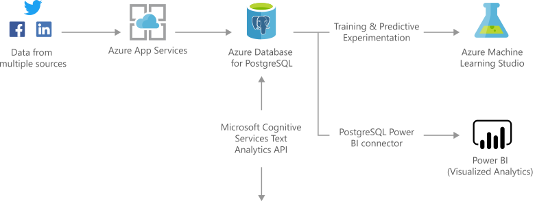
                        

                    

                    

                        <h3>Intelligent apps using Azure Database for PostgreSQL</h3>
                        
Develop sophisticated, transformational apps using state of the art machine learning algorithms and integrated visualization tools to get actionable insights and analytics

                    

                

            

        

    </a>
</li>
<li style="display: flex; flex-direction: column;">
    <a href="./articles/interactive-price-analytics.md" style="display: flex; flex-direction: column; flex: 1 0 auto;">
        

            

                

                    

                        

                            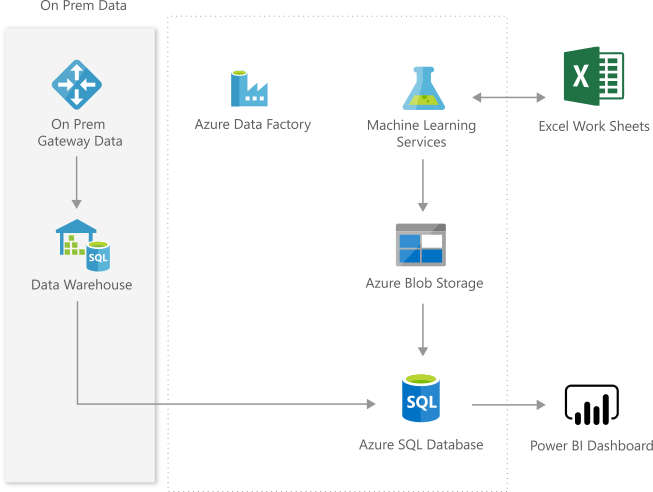
                        

                    

                    

                        <h3>Interactive Price Analytics</h3>
                        
The Pricing Analytics solution uses your transactional history data to show you how the demand for your products responds to the prices you offer, to recommend pricing changes, and allow you to simulate how changes in price would affect your demand, at a fine granularity

                    

                

            

        

    </a>
</li>
<li style="display: flex; flex-direction: column;">
    <a href="./articles/interactive-querying-with-hdinsight.md" style="display: flex; flex-direction: column; flex: 1 0 auto;">
        

            

                

                    

                        

                            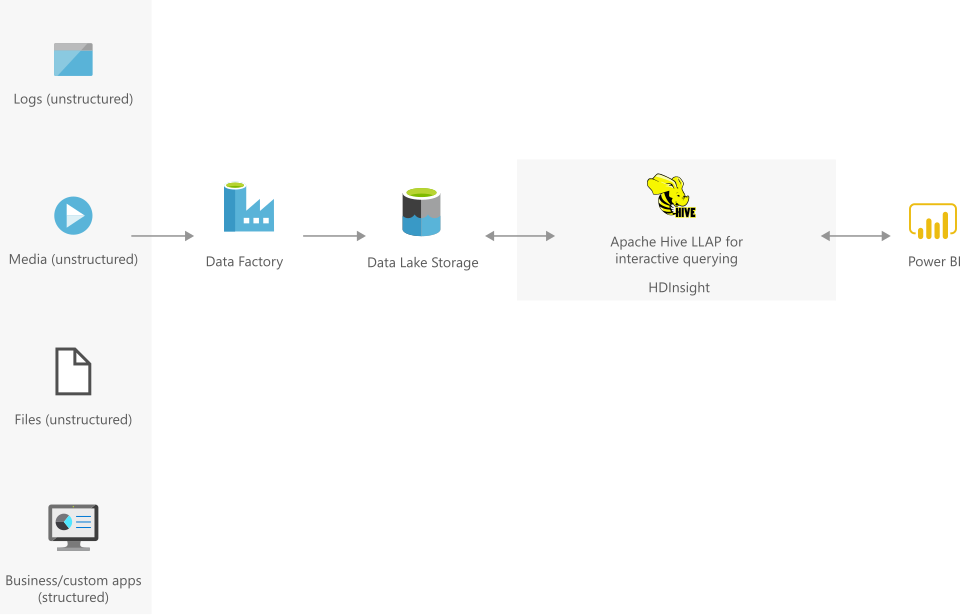
                        

                    

                    

                        <h3>Interactive querying with HDInsight</h3>
                        
Perform fast, interactive SQL queries at scale over structured or unstructured data with Apache Hive LLAP

                    

                

            

        

    </a>
</li>
<li style="display: flex; flex-direction: column;">
    <a href="./articles/interactive-voice-response-bot.md" style="display: flex; flex-direction: column; flex: 1 0 auto;">
        

            

                

                    

                        

                            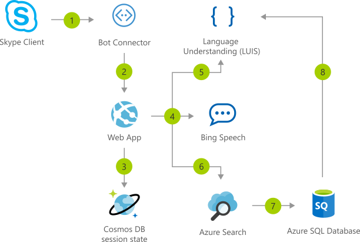
                        

                    

                    

                        <h3>Interactive Voice Response Bot</h3>
                        
This solution creates an intelligent interactive voice response (IVR) application that processes customer order requests for bicycles and bicycle accessories

                    

                

            

        

    </a>
</li>
<li style="display: flex; flex-direction: column;">
    <a href="./articles/iot-devices.md" style="display: flex; flex-direction: column; flex: 1 0 auto;">
        

            

                

                    

                        

                            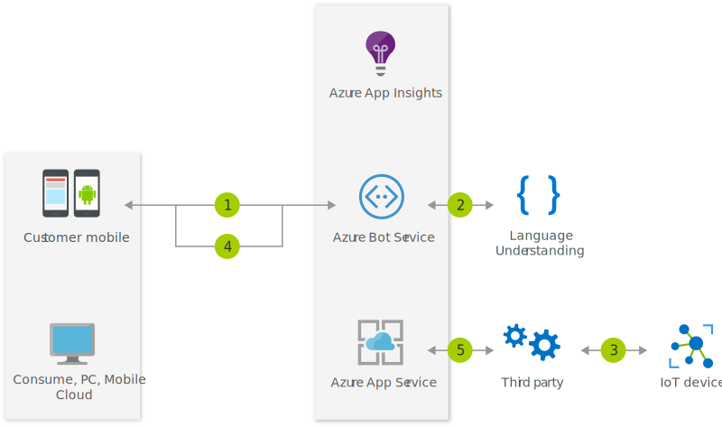
                        

                    

                    

                        <h3>IoT devices</h3>
                        
Create seamless conversational interfaces with all of your internet-accessible devicesfrom your connected television or fridge to devices in a connected power plant

                    

                

            

        

    </a>
</li>
<li style="display: flex; flex-direction: column;">
    <a href="./articles/iot-using-cosmos-db.md" style="display: flex; flex-direction: column; flex: 1 0 auto;">
        

            

                

                    

                        

                            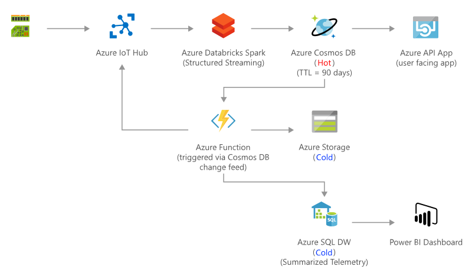
                        

                    

                    

                        <h3>IoT using Cosmos DB</h3>
                        
Scale instantly and elastically to accommodate diverse and unpredictable IoT workloads without sacrificing ingestion or query performance

                    

                

            

        

    </a>
</li>
<li style="display: flex; flex-direction: column;">
    <a href="./articles/iot-with-aks.md" style="display: flex; flex-direction: column; flex: 1 0 auto;">
        

            

                

                    

                        

                            
                        

                    

                    

                        <h3>IoT device deployment and management on demand | Microsoft</h3>
                        
IoT with AKS

                    

                

            

        

    </a>
</li>
<li style="display: flex; flex-direction: column;">
    <a href="./articles/java-cicd-using-jenkins-and-azure-web-apps.md" style="display: flex; flex-direction: column; flex: 1 0 auto;">
        

            

                

                    

                        

                            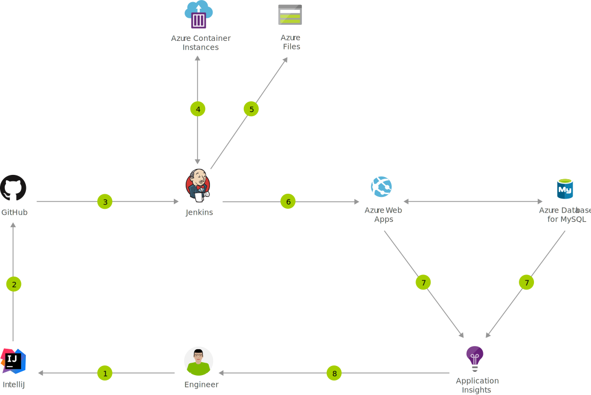
                        

                    

                    

                        <h3>Java CI/CD using Jenkins and Azure Web Apps</h3>
                        
Azure App Service is a fast and simple way to create web apps using Java, Node, PHP or ASP

                    

                

            

        

    </a>
</li>
<li style="display: flex; flex-direction: column;">
    <a href="./articles/loan-chargeoff-prediction-with-azure-hdinsight-spark-clusters.md" style="display: flex; flex-direction: column; flex: 1 0 auto;">
        

            

                

                    

                        

                            
                        

                    

                    

                        <h3>Loan ChargeOff Prediction with Azure HDInsight Spark Clusters</h3>
                        
A charged off loan is a loan that is declared by a creditor (usually a lending institution) that an amount of debt is unlikely to be collected, usually when the loan repayment is severely delinquent by the debtor

                    

                

            

        

    </a>
</li>
<li style="display: flex; flex-direction: column;">
    <a href="./articles/loan-chargeoff-prediction-with-sql-server.md" style="display: flex; flex-direction: column; flex: 1 0 auto;">
        

            

                

                    

                        

                            
                        

                    

                    

                        <h3>Loan ChargeOff Prediction with SQL Server</h3>
                        
This solution demonstrates how to build and deploy a machine learning model with SQL Server 2016 with R Services to predict if a Bank loan will need to be charged off within next 3 months

                    

                

            

        

    </a>
</li>
<li style="display: flex; flex-direction: column;">
    <a href="./articles/loan-credit-risk-analyzer-and-default-modeling.md" style="display: flex; flex-direction: column; flex: 1 0 auto;">
        

            

                

                    

                        

                            
                        

                    

                    

                        <h3>Loan Credit Risk + Default Modeling</h3>
                        
Using SQL Server 2016 with R Services, lenders can predict a borrower's credit risk and default probability to help issue fewer unprofitable loans

                    

                

            

        

    </a>
</li>
<li style="display: flex; flex-direction: column;">
    <a href="./articles/loan-credit-risk-with-sql-server.md" style="display: flex; flex-direction: column; flex: 1 0 auto;">
        

            

                

                    

                        

                            
                        

                    

                    

                        <h3>Loan Credit Risk with SQL Server</h3>
                        
Using SQL Server 2016 with R Services, a lending institution can make use of predictive analytics to reduce number of loans they offer to those borrowers most likely to default, increasing the profitability of their loan portfolio

                    

                

            

        

    </a>
</li>
<li style="display: flex; flex-direction: column;">
    <a href="./articles/machine-learning-with-aks.md" style="display: flex; flex-direction: column; flex: 1 0 auto;">
        

            

                

                    

                        

                            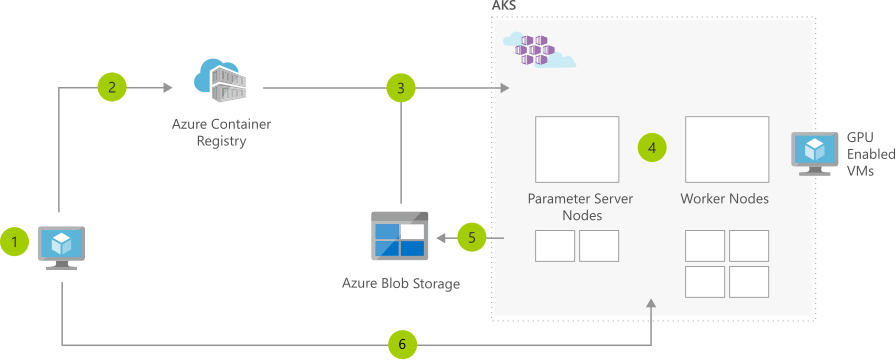
                        

                    

                    

                        <h3>Machine Learning model training with AKS | Microsoft</h3>
                        
Machine Learning with AKS

                    

                

            

        

    </a>
</li>
<li style="display: flex; flex-direction: column;">
    <a href="./articles/medical-data-storage.md" style="display: flex; flex-direction: column; flex: 1 0 auto;">
        

            

                

                    

                        

                            
                        

                    

                    

                        <h3>Medical Data Storage Solutions</h3>
                        
Store healthcare data effectively and affordably with cloud-based solutions from Azure

                    

                

            

        

    </a>
</li>
<li style="display: flex; flex-direction: column;">
    <a href="./articles/medium-umbraco-web-app.md" style="display: flex; flex-direction: column; flex: 1 0 auto;">
        

            

                

                    

                        

                            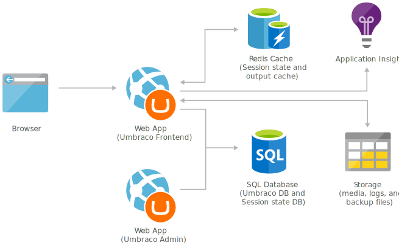
                        

                    

                    

                        <h3>Scalable Umbraco CMS web app</h3>
                        
Medium Umbraco CMS web app configured to scale and optimal for high-traffic sites

                    

                

            

        

    </a>
</li>
<li style="display: flex; flex-direction: column;">
    <a href="./articles/messaging.md" style="display: flex; flex-direction: column; flex: 1 0 auto;">
        

            

                

                    

                        

                            
                        

                    

                    

                        <h3>Messaging</h3>
                        
azure redis cache, web sockets, web communication frameworks, messaging publish and subscribe, azure cache for redis

                    

                

            

        

    </a>
</li>
<li style="display: flex; flex-direction: column;">
    <a href="./articles/microservices-with-aks.md" style="display: flex; flex-direction: column; flex: 1 0 auto;">
        

            

                

                    

                        

                            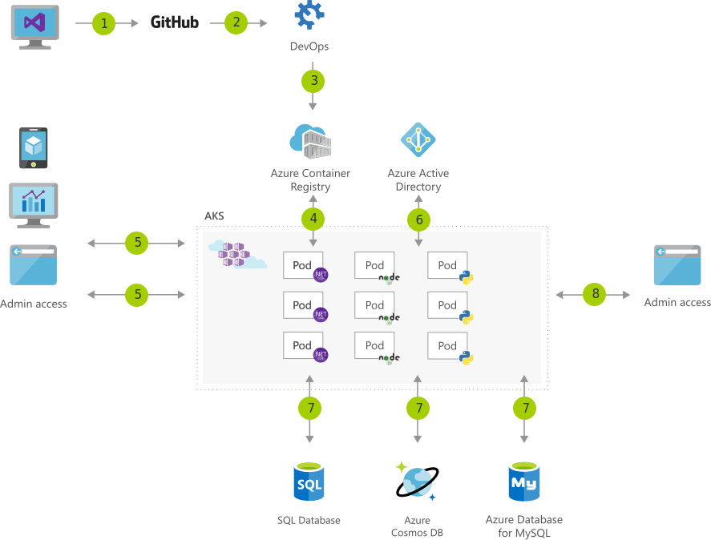
                        

                    

                    

                        <h3>Microservices with AKS | Microsoft</h3>
                        
Microservices with AKS

                    

                

            

        

    </a>
</li>
<li style="display: flex; flex-direction: column;">
    <a href="./articles/migrate-existing-applications-with-aks.md" style="display: flex; flex-direction: column; flex: 1 0 auto;">
        

            

                

                    

                        

                            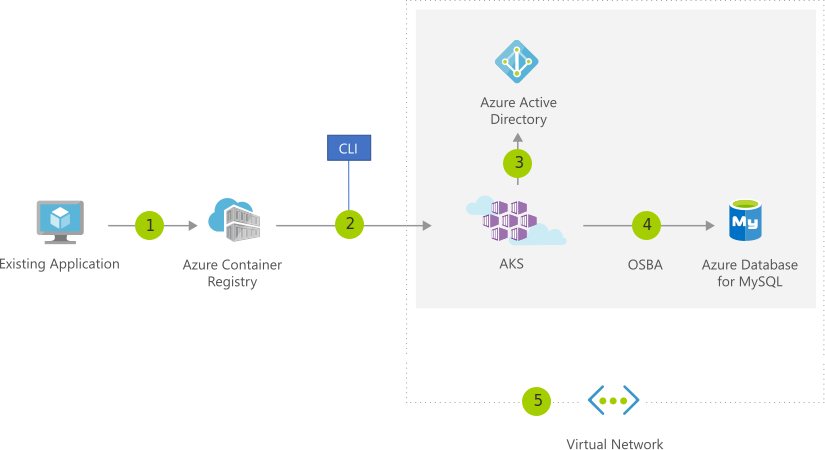
                        

                    

                    

                        <h3>Lift and shift to containers with AKS | Microsoft</h3>
                        
Lift and shift to containers with AKS

                    

                

            

        

    </a>
</li>
<li style="display: flex; flex-direction: column;">
    <a href="./articles/modern-customer-support-portal-powered-by-an-agile-business-process.md" style="display: flex; flex-direction: column; flex: 1 0 auto;">
        

            

                

                    

                        

                            
                        

                    

                    

                        <h3>Lift and Shift and Innovate - LOB Apps</h3>
                        
The solution demonstrates a business process for monitoring and responding to customer feedback

                    

                

            

        

    </a>
</li>
<li style="display: flex; flex-direction: column;">
    <a href="./articles/modern-data-warehouse.md" style="display: flex; flex-direction: column; flex: 1 0 auto;">
        

            

                

                    

                        

                            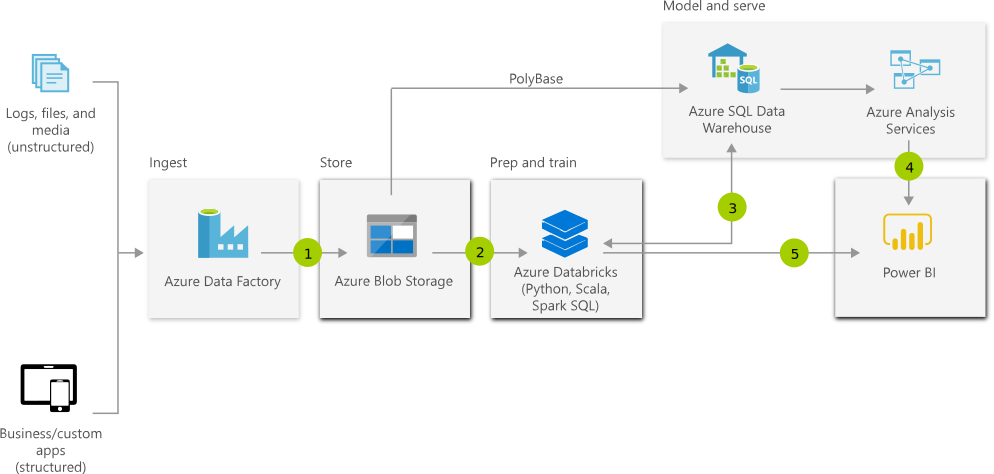
                        

                    

                    

                        <h3>Modern Data Warehouse Architecture</h3>
                        
Explore a cloud data warehouse that uses big data

                    

                

            

        

    </a>
</li>
<li style="display: flex; flex-direction: column;">
    <a href="./articles/oil-and-gas-tank-level-forecasting.md" style="display: flex; flex-direction: column; flex: 1 0 auto;">
        

            

                

                    

                        

                            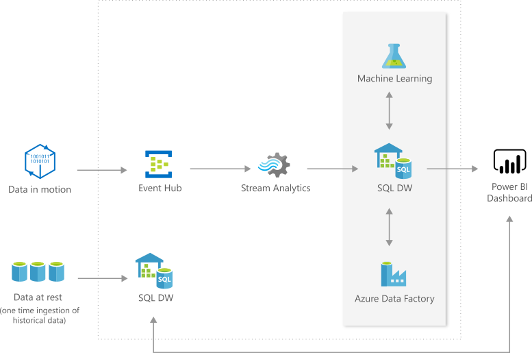
                        

                    

                    

                        <h3>Oil and Gas Tank Level Forecasting</h3>
                        
Today, most facilities operate reactively to problems in tank levels

                    

                

            

        

    </a>
</li>
<li style="display: flex; flex-direction: column;">
    <a href="./articles/onboarding-customers-with-a-cloud-native-serverless-architecture.md" style="display: flex; flex-direction: column; flex: 1 0 auto;">
        

            

                

                    

                        

                            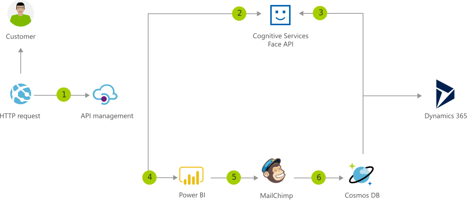
                        

                    

                    

                        <h3>Serverless Computing Solution for LOB Apps</h3>
                        
The solution demonstrates a business process for customer onboarding

                    

                

            

        

    </a>
</li>
<li style="display: flex; flex-direction: column;">
    <a href="./articles/ops-automation-using-event-grid.md" style="display: flex; flex-direction: column; flex: 1 0 auto;">
        

            

                

                    

                        

                            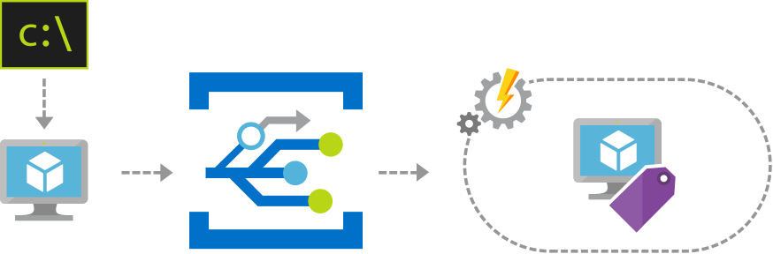
                        

                    

                    

                        <h3>Ops automation using Event Grid</h3>
                        
Event Grid allows you to speed automation and simplify policy enforcement

                    

                

            

        

    </a>
</li>
<li style="display: flex; flex-direction: column;">
    <a href="./articles/optimize-marketing-with-machine-learning.md" style="display: flex; flex-direction: column; flex: 1 0 auto;">
        

            

                

                    

                        

                            
                        

                    

                    

                        <h3>Optimize Marketing with Machine Learning</h3>
                        
Learn how to build a machine-learning model with SQL Server 2016 with R Services to optimize and manage marketing campaigns

                    

                

            

        

    </a>
</li>
<li style="display: flex; flex-direction: column;">
    <a href="./articles/personalization-using-cosmos-db.md" style="display: flex; flex-direction: column; flex: 1 0 auto;">
        

            

                

                    

                        

                            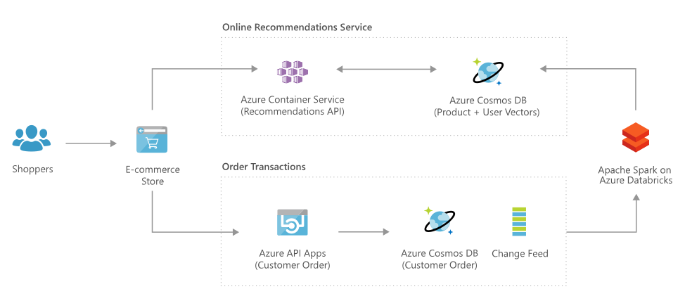
                        

                    

                    

                        <h3>Personalization using Cosmos DB</h3>
                        
Generate personalized recommendations for customers in real time, using low-latency and tunable consistency settings for immediate insights

                    

                

            

        

    </a>
</li>
<li style="display: flex; flex-direction: column;">
    <a href="./articles/personalized-marketing.md" style="display: flex; flex-direction: column; flex: 1 0 auto;">
        

            

                

                    

                        

                            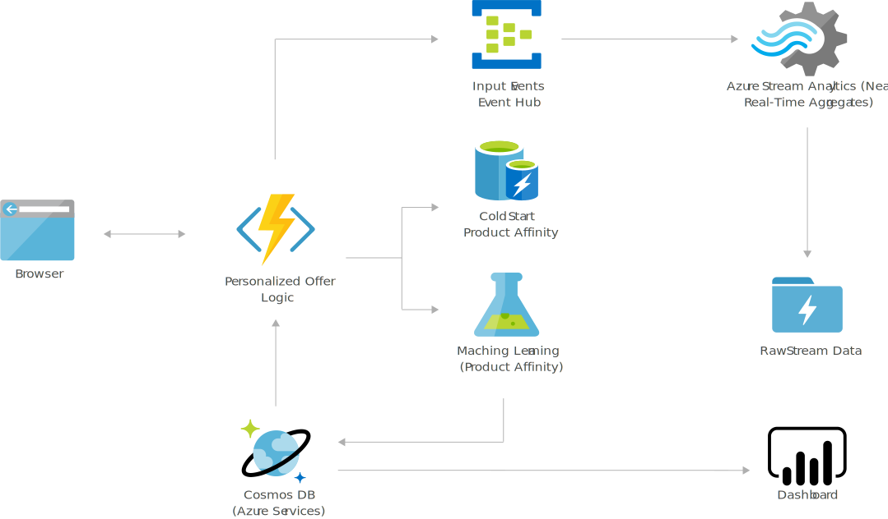
                        

                    

                    

                        <h3>Personalized marketing solutions</h3>
                        
Find essential technology to market your products with personalized offers

                    

                

            

        

    </a>
</li>
<li style="display: flex; flex-direction: column;">
    <a href="./articles/personalized-offers.md" style="display: flex; flex-direction: column; flex: 1 0 auto;">
        

            

                

                    

                        

                            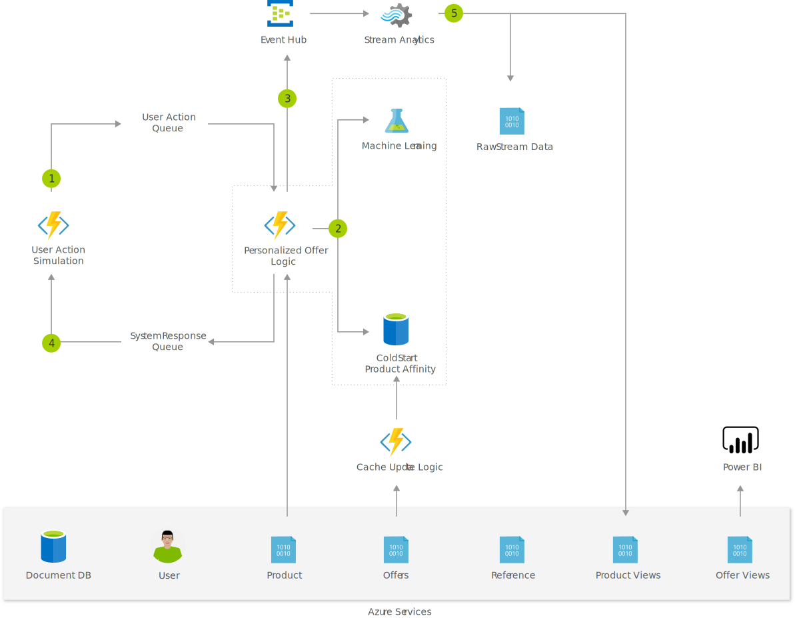
                        

                    

                    

                        <h3>Personalized Offers</h3>
                        
In today's highly competitive and connected environment, modern businesses can no longer survive with generic, static online content

                    

                

            

        

    </a>
</li>
<li style="display: flex; flex-direction: column;">
    <a href="./articles/population-health-management-for-healthcare.md" style="display: flex; flex-direction: column; flex: 1 0 auto;">
        

            

                

                    

                        

                            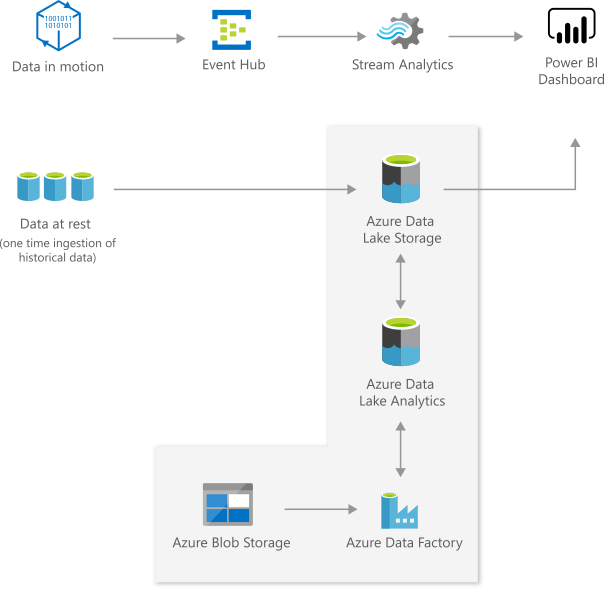
                        

                    

                    

                        <h3>Population Health Management for Healthcare</h3>
                        
Population Health Management is an important tool that is increasingly being used by health care providers to manage and control the escalating costs

                    

                

            

        

    </a>
</li>
<li style="display: flex; flex-direction: column;">
    <a href="./articles/predict-length-of-stay-and-patient-flow-with-healthcare-analytics.md" style="display: flex; flex-direction: column; flex: 1 0 auto;">
        

            

                

                    

                        

                            
                        

                    

                    

                        <h3>Predict Length of Stay and Patient Flow</h3>
                        
Learn how to predict capacity and patient flow for your hospital or healthcare facility to enhance the quality of care and improve operational efficiency

                    

                

            

        

    </a>
</li>
<li style="display: flex; flex-direction: column;">
    <a href="./articles/predicting-length-of-stay-in-hospitals.md" style="display: flex; flex-direction: column; flex: 1 0 auto;">
        

            

                

                    

                        

                            
                        

                    

                    

                        <h3>Predicting Length of Stay in Hospitals</h3>
                        
This solution enables a predictive model for Length of Stay for in-hospital admissions

                    

                

            

        

    </a>
</li>
<li style="display: flex; flex-direction: column;">
    <a href="./articles/predictive-insights-with-vehicle-telematics.md" style="display: flex; flex-direction: column; flex: 1 0 auto;">
        

            

                

                    

                        

                            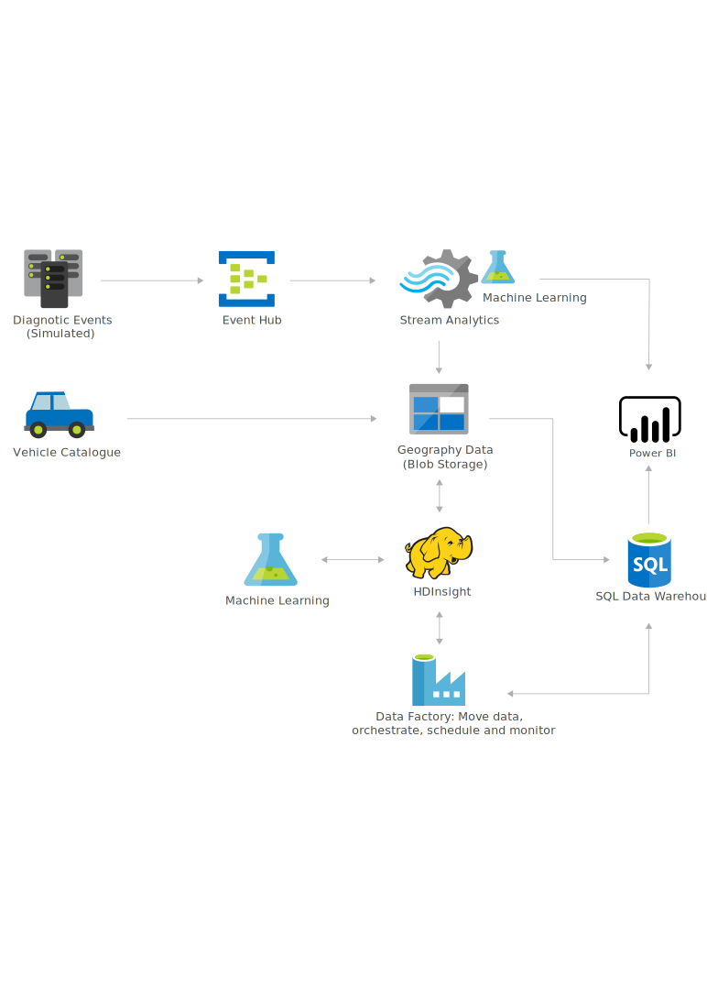
                        

                    

                    

                        <h3>Predictive Insights with Vehicle Telematics</h3>
                        
Learn how car dealerships, manufacturers, and insurance companies can use Microsoft Azure to gain predictive insights on vehicle health and driving habits

                    

                

            

        

    </a>
</li>
<li style="display: flex; flex-direction: column;">
    <a href="./articles/predictive-maintenance.md" style="display: flex; flex-direction: column; flex: 1 0 auto;">
        

            

                

                    

                        

                            
                        

                    

                    

                        <h3>Predictive Maintenance</h3>
                        
This Predictive Maintenance solution monitors aircraft and predicts the remaining useful life of aircraft engine components

                    

                

            

        

    </a>
</li>
<li style="display: flex; flex-direction: column;">
    <a href="./articles/predictive-marketing-campaigns-with-machine-learning-and-spark.md" style="display: flex; flex-direction: column; flex: 1 0 auto;">
        

            

                

                    

                        

                            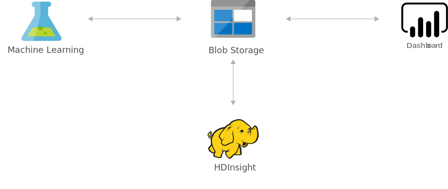
                        

                    

                    

                        <h3>Predictive Marketing with Machine Learning</h3>
                        
Learn how to build a machine-learning model with Microsoft R Server on Azure HDInsight Spark clusters to recommend actions to maximize the purchase rate

                    

                

            

        

    </a>
</li>
<li style="display: flex; flex-direction: column;">
    <a href="./articles/quality-assurance.md" style="display: flex; flex-direction: column; flex: 1 0 auto;">
        

            

                

                    

                        

                            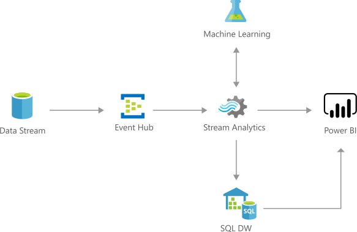
                        

                    

                    

                        <h3>Quality Assurance</h3>
                        
Quality assurance systems allow businesses to prevent defects throughout their processes of delivering goods or services to customers

                    

                

            

        

    </a>
</li>
<li style="display: flex; flex-direction: column;">
    <a href="./articles/real-time-analytics.md" style="display: flex; flex-direction: column; flex: 1 0 auto;">
        

            

                

                    

                        

                            
                        

                    

                    

                        <h3>Real Time Analytics on Big Data Architecture</h3>
                        
Get deep learning analytics and insights live from streaming data

                    

                

            

        

    </a>
</li>
<li style="display: flex; flex-direction: column;">
    <a href="./articles/real-time-web-dashboard.md" style="display: flex; flex-direction: column; flex: 1 0 auto;">
        

            

                

                    

                        

                            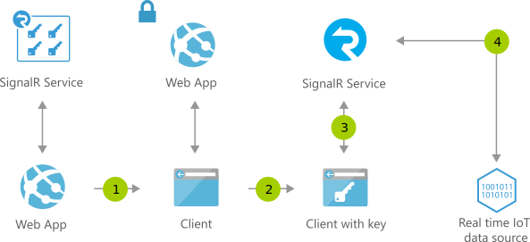
                        

                    

                    

                        <h3>Real-time Web Dashboard | Microsoft</h3>
                        
Securely monitor and control data streamed from Internet-connected devices

                    

                

            

        

    </a>
</li>
<li style="display: flex; flex-direction: column;">
    <a href="./articles/remote-patient-monitoring.md" style="display: flex; flex-direction: column; flex: 1 0 auto;">
        

            

                

                    

                        

                            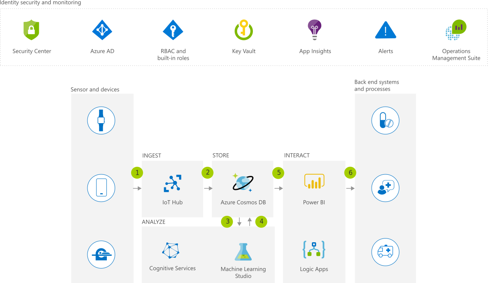
                        

                    

                    

                        <h3>Remote Patient Monitoring Solutions</h3>
                        
Provide a high level of preventative medical care with remote patient monitoring from Azure

                    

                

            

        

    </a>
</li>
<li style="display: flex; flex-direction: column;">
    <a href="./articles/retail-and-e-commerce-using-cosmos-db.md" style="display: flex; flex-direction: column; flex: 1 0 auto;">
        

            

                

                    

                        

                            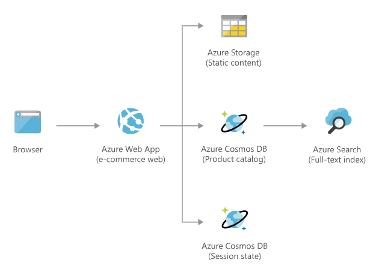
                        

                    

                    

                        <h3>Retail and e-commerce using Cosmos DB</h3>
                        
Support in-depth queries over diverse product catalogs, traffic spikes, and rapidly changing inventory

                    

                

            

        

    </a>
</li>
<li style="display: flex; flex-direction: column;">
    <a href="./articles/retail-and-ecommerce-using-azure-database-for-mysql.md" style="display: flex; flex-direction: column; flex: 1 0 auto;">
        

            

                

                    

                        

                            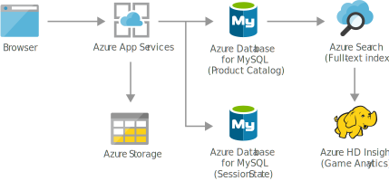
                        

                    

                    

                        <h3>Retail and e-commerce using Azure Database for MySQL</h3>
                        
Build secure and scalable e-commerce solutions that meet the demands of both customers and business

                    

                

            

        

    </a>
</li>
<li style="display: flex; flex-direction: column;">
    <a href="./articles/retail-and-ecommerce-using-azure-database-for-postgresql.md" style="display: flex; flex-direction: column; flex: 1 0 auto;">
        

            

                

                    

                        

                            
                        

                    

                    

                        <h3>Retail and e-commerce using Azure Database for PostgreSQL</h3>
                        
Build secure and scalable e-commerce solutions that meet the demands of both customers and business

                    

                

            

        

    </a>
</li>
<li style="display: flex; flex-direction: column;">
    <a href="./articles/retail-assistant-or-vacation-planner-with-visual-capabilities.md" style="display: flex; flex-direction: column; flex: 1 0 auto;">
        

            

                

                    

                        

                            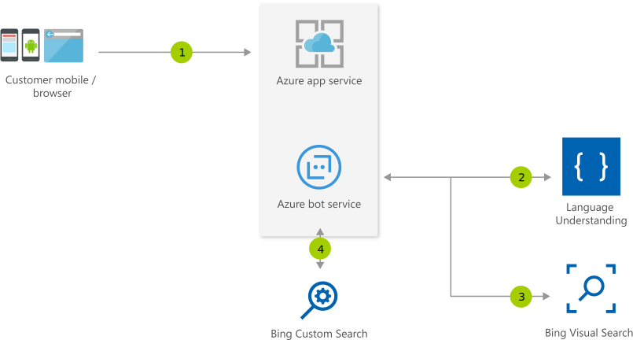
                        

                    

                    

                        <h3>Retail Assistant with Visual Capabilities - Cognitive Services</h3>
                        
The retail assistant or vacation planner can help your customers have interactions with your business bot and provide suggestions based on the visual information

                    

                

            

        

    </a>
</li>
<li style="display: flex; flex-direction: column;">
    <a href="./articles/sap-netweaver-on-sql-server.md" style="display: flex; flex-direction: column; flex: 1 0 auto;">
        

            

                

                    

                        

                            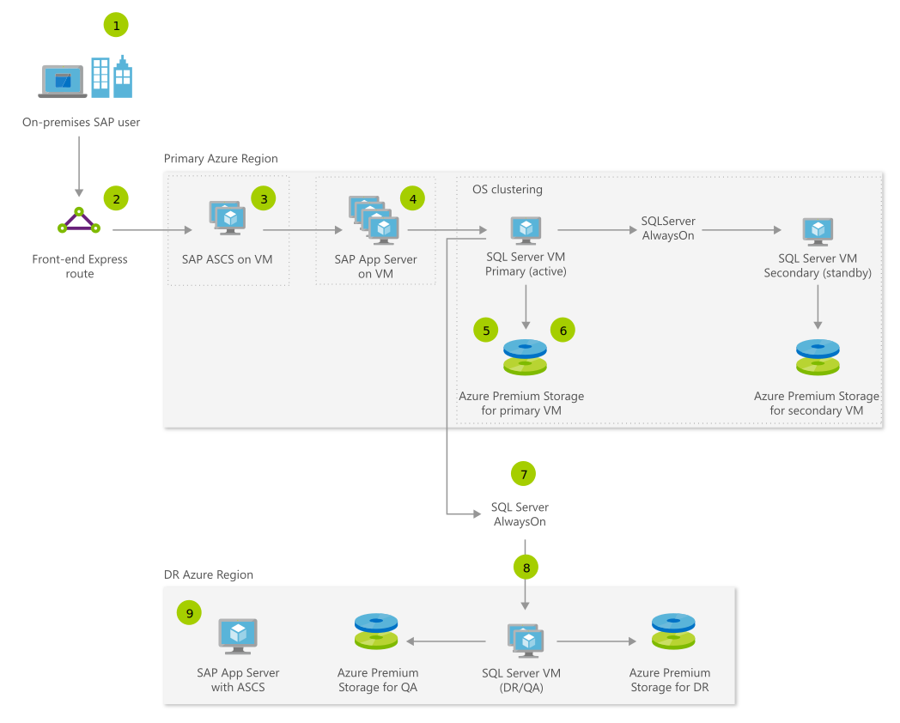
                        

                    

                    

                        <h3>SAP NetWeaver on SQLServer</h3>
                        
The NetWeaver on SQL Server application solution illustrates how a user request flows through an SAP landscape built on NetWeaver by utilizing Azure Virtual Machines to host SAP applications and a SQL Server database

                    

                

            

        

    </a>
</li>
<li style="display: flex; flex-direction: column;">
    <a href="./articles/sap-s4-hana-on-hli-with-ha-and-dr.md" style="display: flex; flex-direction: column; flex: 1 0 auto;">
        

            

                

                    

                        

                            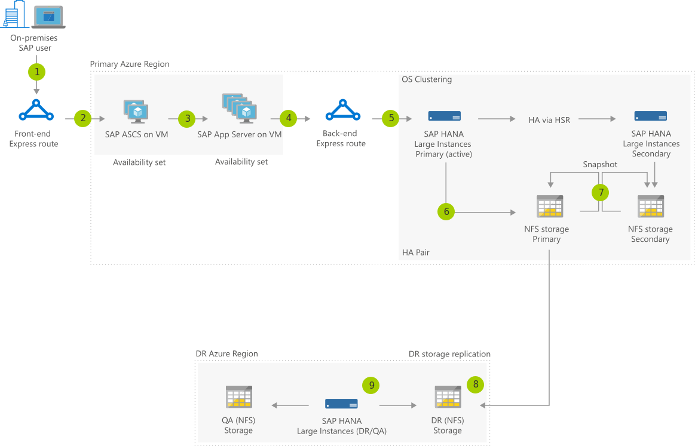
                        

                    

                    

                        <h3>SAP S/4 HANA for Large Instances</h3>
                        
Learn more about SAP HANA on Azure for large instances that includes high reliability and disaster recovery

                    

                

            

        

    </a>
</li>
<li style="display: flex; flex-direction: column;">
    <a href="./articles/sap-s4-hana-vm-on-linux.md" style="display: flex; flex-direction: column; flex: 1 0 auto;">
        

            

                

                    

                        

                            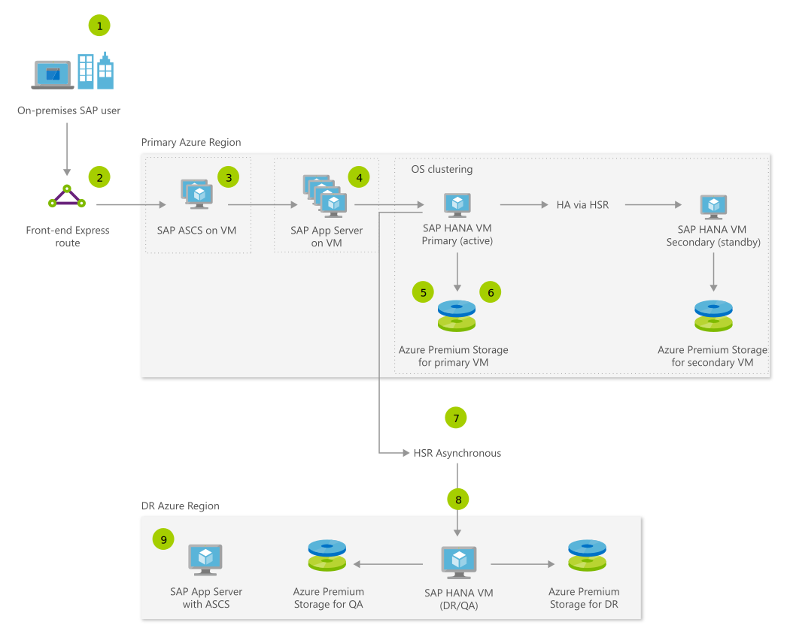
                        

                    

                    

                        <h3>SAP S/4 HANA VM on Azure and Linux</h3>
                        
Learn more about the SAP S/4 HANA and Linux solution architecture for user requests with a step-by-step flow chart

                    

                

            

        

    </a>
</li>
<li style="display: flex; flex-direction: column;">
    <a href="./articles/scalable-ecommerce-web-app.md" style="display: flex; flex-direction: column; flex: 1 0 auto;">
        

            

                

                    

                        

                            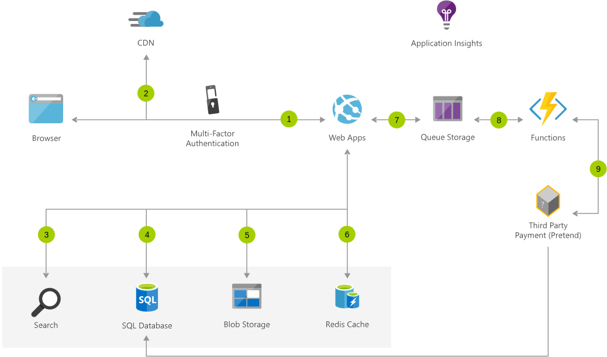
                        

                    

                    

                        <h3>Architect scalable e-commerce web app</h3>
                        
The e-commerce website includes simple order processing workflows with the help of Azure services

                    

                

            

        

    </a>
</li>
<li style="display: flex; flex-direction: column;">
    <a href="./articles/scalable-web-and-mobile-applications-using-azure-database-for-mysql.md" style="display: flex; flex-direction: column; flex: 1 0 auto;">
        

            

                

                    

                        

                            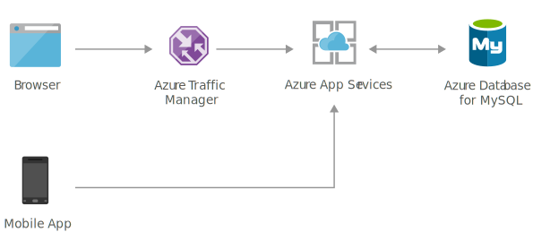
                        

                    

                    

                        <h3>Scalable web and mobile applications using Azure Database for MySQL</h3>
                        
Rapidly build engaging, performant and scalable cross-platform and native apps for iOS, Android, Windows, or Mac

                    

                

            

        

    </a>
</li>
<li style="display: flex; flex-direction: column;">
    <a href="./articles/scalable-web-and-mobile-applications-using-azure-database-for-postgresql.md" style="display: flex; flex-direction: column; flex: 1 0 auto;">
        

            

                

                    

                        

                            
                        

                    

                    

                        <h3>Scalable web and mobile applications using Azure Database for PostgreSQL</h3>
                        
Rapidly build engaging, performant and scalable cross-platform and native apps for iOS, Android, Windows, or Mac

                    

                

            

        

    </a>
</li>
<li style="display: flex; flex-direction: column;">
    <a href="./articles/scalable-web-apps.md" style="display: flex; flex-direction: column; flex: 1 0 auto;">
        

            

                

                    

                        

                            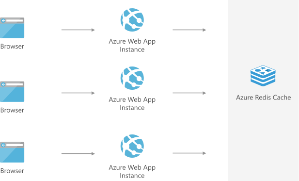
                        

                    

                    

                        <h3>Scalable Web Apps</h3>
                        
scalable web apps, azure redis cache, session data cache, user cookie cache, azure cache for redis

                    

                

            

        

    </a>
</li>
<li style="display: flex; flex-direction: column;">
    <a href="./articles/scale-using-aks-with-aci.md" style="display: flex; flex-direction: column; flex: 1 0 auto;">
        

            

                

                    

                        

                            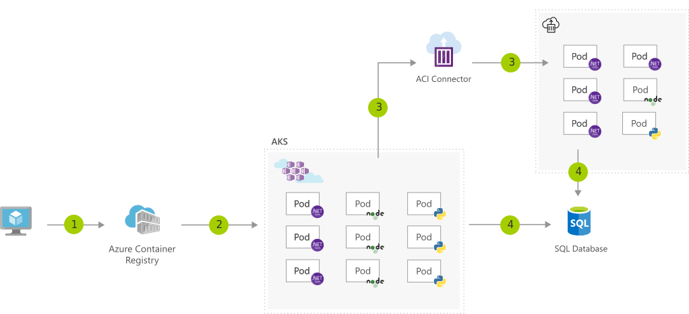
                        

                    

                    

                        <h3>Bursting from AKS with ACI | Microsoft</h3>
                        
Bursting from AKS with ACI

                    

                

            

        

    </a>
</li>
<li style="display: flex; flex-direction: column;">
    <a href="./articles/security-compliance-blueprint-hippa-hitrust-health-data-ai.md" style="display: flex; flex-direction: column; flex: 1 0 auto;">
        

            

                

                    

                        

                            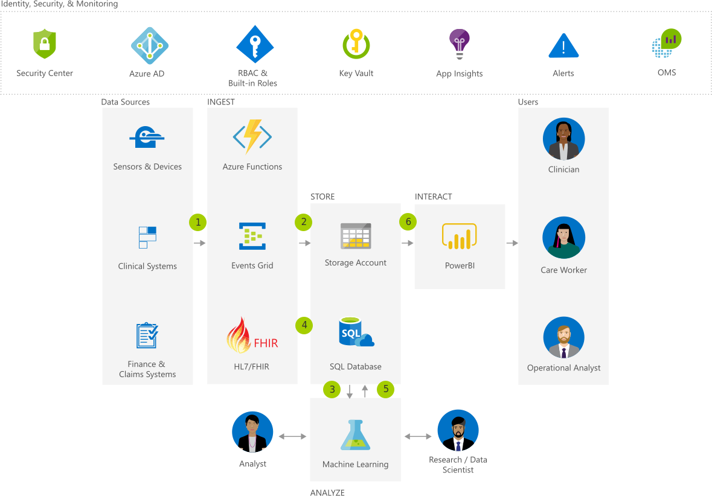
                        

                    

                    

                        <h3>Medical Data Storage Solutions</h3>
                        
Store healthcare data effectively and affordably with cloud-based solutions from Azure

                    

                

            

        

    </a>
</li>
<li style="display: flex; flex-direction: column;">
    <a href="./articles/serverless-application-architectures-using-event-grid.md" style="display: flex; flex-direction: column; flex: 1 0 auto;">
        

            

                

                    

                        

                            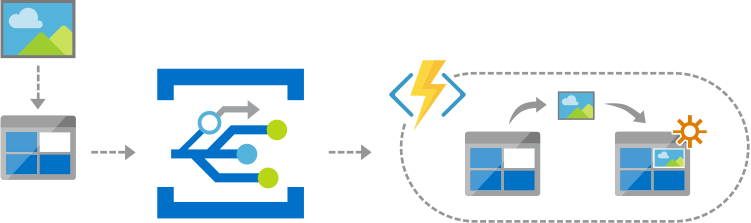
                        

                    

                    

                        <h3>Serverless application architectures using Event Grid</h3>
                        
Event Grid connects data sources and event handlers

                    

                

            

        

    </a>
</li>
<li style="display: flex; flex-direction: column;">
    <a href="./articles/serverless-apps-using-cosmos-db.md" style="display: flex; flex-direction: column; flex: 1 0 auto;">
        

            

                

                    

                        

                            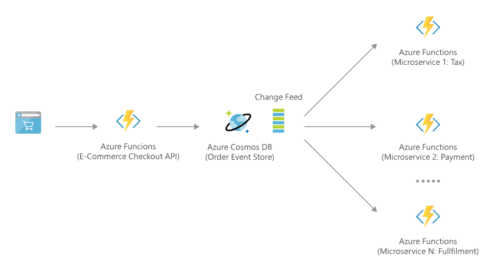
                        

                    

                    

                        <h3>Serverless apps using Cosmos DB</h3>
                        
Use Azure Functions and Azure Cosmos DB to build globally distributed, scalable serverless applications

                    

                

            

        

    </a>
</li>
<li style="display: flex; flex-direction: column;">
    <a href="./articles/simple-branded-website.md" style="display: flex; flex-direction: column; flex: 1 0 auto;">
        

            

                

                    

                        

                            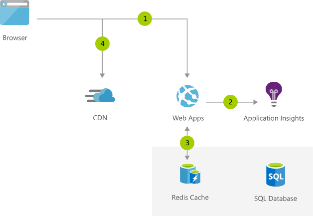
                        

                    

                    

                        <h3>Simple branded website</h3>
                        
Quickly build and launch digital campaigns that automatically scale based on customer demand

                    

                

            

        

    </a>
</li>
<li style="display: flex; flex-direction: column;">
    <a href="./articles/social-mobile-and-web-app-with-authentication.md" style="display: flex; flex-direction: column; flex: 1 0 auto;">
        

            

                

                    

                        

                            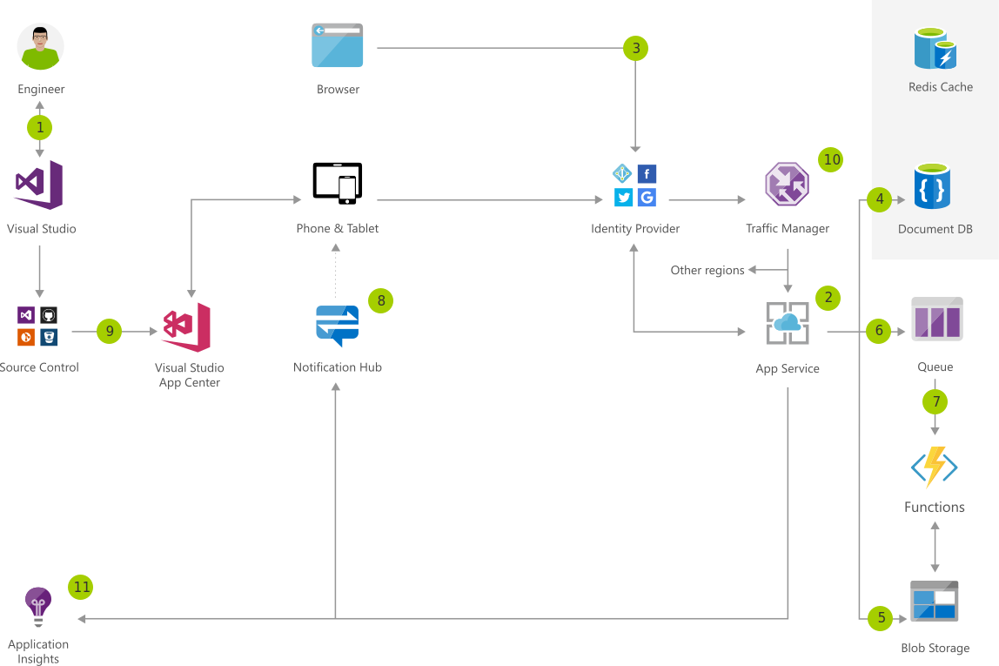
                        

                    

                    

                        <h3>Social App for Mobile and Web with Authentication</h3>
                        
View a detailed, step-by-step diagram depicting the build process and implementation of the mobile client app architecture that offers social image sharing with a companion web app and authentication abilities, even while offline

                    

                

            

        

    </a>
</li>
<li style="display: flex; flex-direction: column;">
    <a href="./articles/streaming-using-hdinsight.md" style="display: flex; flex-direction: column; flex: 1 0 auto;">
        

            

                

                    

                        

                            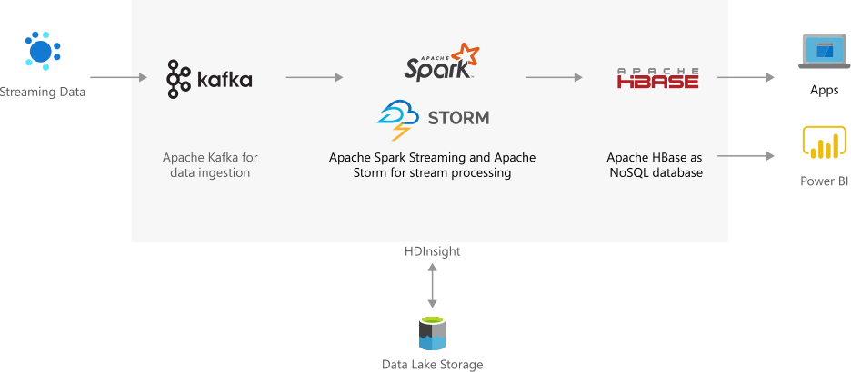
                        

                    

                    

                        <h3>Streaming using HDInsight</h3>
                        
Ingest and process millions of streaming events per second with Apache Kafka, Apache Storm, and Apache Spark Streaming

                    

                

            

        

    </a>
</li>
<li style="display: flex; flex-direction: column;">
    <a href="./articles/subsystems-and-crosscutting.md" style="display: flex; flex-direction: column; flex: 1 0 auto;">
        

            

                

                    

                        

                            
                        

                    

                    

                        <h3>IoT Architecture  Azure IoT Subsystems</h3>
                        
Learn about our recommended IoT application architecture that supports hybrid cloud and edge computing

                    

                

            

        

    </a>
</li>
<li style="display: flex; flex-direction: column;">
    <a href="./articles/supply-chain-track-and-trace.md" style="display: flex; flex-direction: column; flex: 1 0 auto;">
        

            

                

                    

                        

                            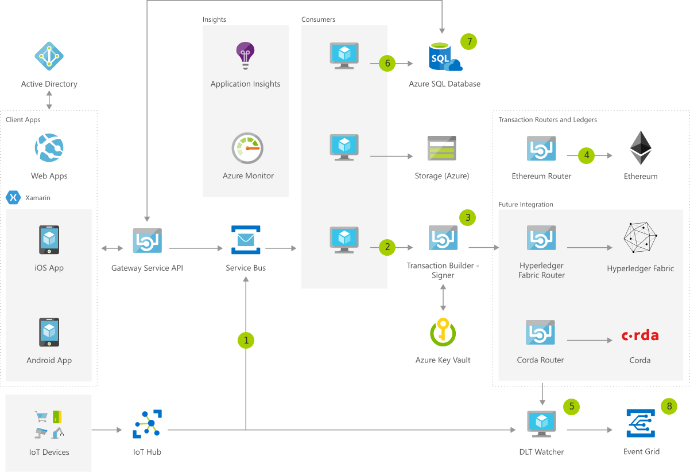
                        

                    

                    

                        <h3>Supply Chain Track and Trace</h3>
                        
Learn how to use the Azure Blockchain Workbench

                    

                

            

        

    </a>
</li>
<li style="display: flex; flex-direction: column;">
    <a href="./articles/task-based-consumer-mobile-app.md" style="display: flex; flex-direction: column; flex: 1 0 auto;">
        

            

                

                    

                        

                            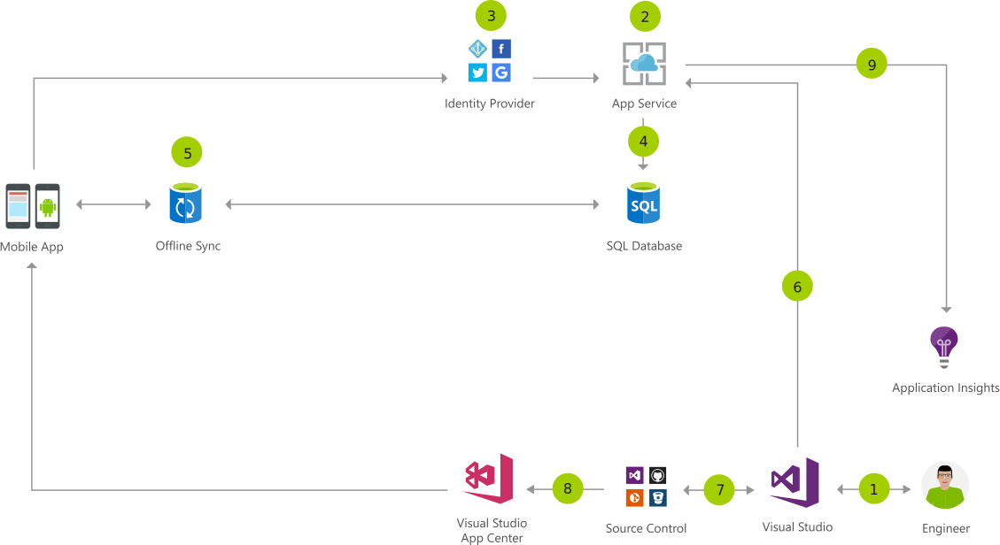
                        

                    

                    

                        <h3>Task-Based Consumer Mobile App</h3>
                        
Learn how the task-based consumer mobile app architecture is created with a step-by-step flow chart that shows the integration with Azure App Service Mobile Apps, Visual Studio, and Xamarin to simplify the build process

                    

                

            

        

    </a>
</li>
<li style="display: flex; flex-direction: column;">
    <a href="./articles/telemetry-analytics.md" style="display: flex; flex-direction: column; flex: 1 0 auto;">
        

            

                

                    

                        

                            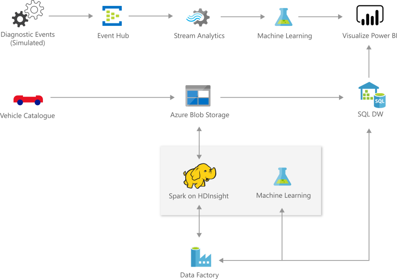
                        

                    

                    

                        <h3>Telemetry Analytics</h3>
                        
Super computers have moved out of the lab and are now parked in our garage! These cutting-edge automobiles contain a myriad of sensors, giving them the ability to track and monitor millions of events every second

                    

                

            

        

    </a>
</li>
<li style="display: flex; flex-direction: column;">
    <a href="./articles/visual-assistant.md" style="display: flex; flex-direction: column; flex: 1 0 auto;">
        

            

                

                    

                        

                            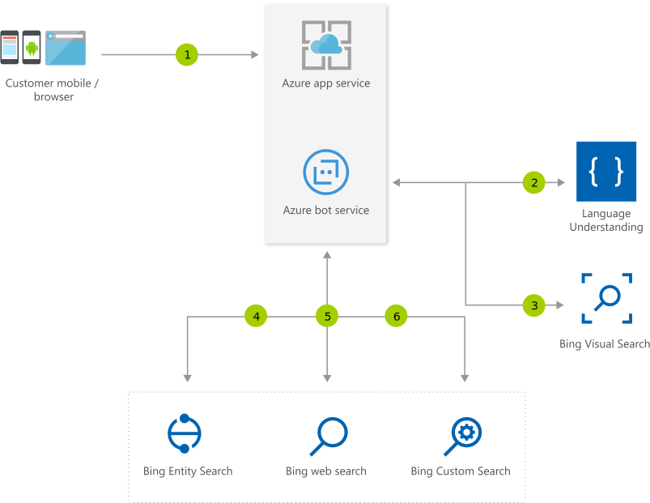
                        

                    

                    

                        <h3>Visual Assistant</h3>
                        
Visual assistant provides rich information based on content of the image with capabilities such as reading business card, identifying barcode, and recognizing popular people, places, objects, artworks, and monuments

                    

                

            

        

    </a>
</li>
</ul>

