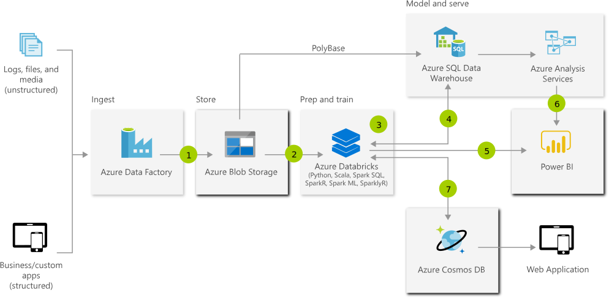

# Advanced Analytics Architecture 
Transform your data into actionable insights using the best-in-class machine learning tools. This architecture allows you to combine any data at any scale, and to build and deploy custom machine learning models at scale.

## Architecture

## Data Flow
1. Bring together all your structured, unstructured and semi-structured data (logs, files, and media) using Azure Data Factory to Azure Blob Storage.
1. Use Azure Databricks to clean and transform the structureless datasets and combine them with structured data from operational databases or data warehouses.
1. Use scalable machine learning/deep learning techniques, to derive deeper insights from this data using Python, R or Scala, with inbuilt notebook experiences in Azure Databricks.
1. Leverage native connectors between Azure Databricks and Azure SQL Data Warehouse to access and move data at scale.
1. Power users take advantage of the inbuilt capabilities of Azure Databricks to perform root cause determination and raw data analysis.
1. Run ad hoc queries directly on data within Azure Databricks.
1. Take the insights from Azure Databricks to Cosmos DB to make them accessible through web and mobile apps.

## Components
* Azure [SQL Data Warehouse](http://azure.microsoft.com/services/sql-data-warehouse/) is the fast, flexible and trusted cloud data warehouse that lets you scale, compute and store elastically and independently, with a massively parallel processing architecture.
* Azure [Data Factory](http://azure.microsoft.com/services/data-factory/) is a hybrid data integration service that allows you to create, schedule and orchestrate your ETL/ELT workflows.
* [Azure Blob storage](http://azure.microsoft.com/services/storage/blobs/) is a Massively scalable object storage for any type of unstructured dataimages, videos, audio, documents, and moreeasily and cost-effectively.
* [Azure Databricks](http://azure.microsoft.com/services/databricks/) is a fast, easy, and collaborative Apache Spark-based analytics platform.
* [Azure Cosmos DB](http://azure.microsoft.com/services/cosmos-db/) is a globally distributed, multi-model database service. Then learn how to replicate your data across any number of Azure regions and scale your throughput independent from your storage.
* [Azure Analysis Services](http://azure.microsoft.com/services/analysis-services/) is an enterprise grade analytics as a service that lets you govern, deploy, test, and deliver your BI solution with confidence.
* [Power BI](https://powerbi.microsoft.com) is a suite of business analytics tools that deliver insights throughout your organization. Connect to hundreds of data sources, simplify data prep, and drive ad hoc analysis. Produce beautiful reports, then publish them for your organization to consume on the web and across mobile devices.

## Next Steps
* [SQL Data Warehouse Documentation](https://docs.microsoft.com/azure/sql-data-warehouse/)
* [Azure Data Factory V2 Preview Documentation](https://docs.microsoft.com/azure/data-factory/)
* [Introduction to object storage in Azure](https://docs.microsoft.com/azure/storage/blobs/storage-blobs-introduction/)
* [Azure Databricks Documentation](https://docs.microsoft.com/azure/azure-databricks/)
* [Azure Cosmos DB Documentation](https://docs.microsoft.com/azure/cosmos-db/)
* [Analysis Services Documentation](https://docs.microsoft.com/azure/analysis-services/)
* [Power BI Documentation](https://docs.microsoft.com/power-bi/)