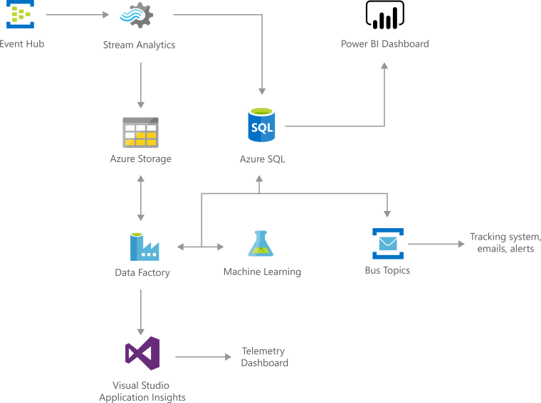

# Anomaly Detection in Real-time Data Streams 
Cortana Intelligence IT Anomaly Insights solution helps IT departments within large organizations quickly detect and fix issues based on underlying health metrics from IT infrastructure (CPU, Memory, etc.), services (Timeouts, SLA variations, Brownouts, etc.), and other key performance indicators (KPIs) (Order backlog, Login and Payment failures, etc.) in an automated and scalable manner. This solution also offers an easy to 'Try it Now' experience that can be tried with customized data to realize the value offered by the solution. The 'Deploy' experience allows to quickly get started with the solution on Azure by deploying the end to end solution components into your Azure subscription and providing full control for customization as needed.

## Architecture
