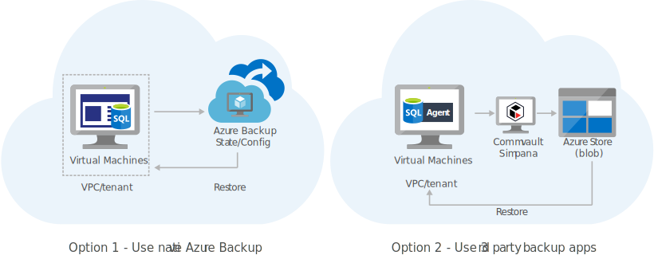

# Back up cloud applications and data to cloud
Back up data and applications running in Azure to another Azure location by using Azure Backup or a partner solution.
This solution is built on the Azure managed services: Azure Backup and Blob Storage. These services run in a high-availability environment, patched and supported, allowing you to focus on your solution instead of the environment they run in.

## Architecture

## Components
* [Azure Backup](http://azure.microsoft.com/services/backup/) service runs on the cloud and holds the recovery points, enforces policies, and enables you to manage data and application protection. You dont need to create or manage an Azure Blob storage account when using [Azure Backup](http://azure.microsoft.com/services/backup/).
* [Blob Storage](href="http://azure.microsoft.com/services/storage/blobs/): Blob storage that partner solutions such as Commvault connect to for backing up data and applications. You need to create and manage Azure Blob storage when using partner solutions.
* [Commvault](http://azure.microsoft.com/marketplace/partners/commvault/commvault/) Simpana is an example of a partner solution to back up or archive your data and applications to Azure. This runs on a virtual machine on Azure.
* [Agent](https://documentation.commvault.com/commvault/v10/article?p=landing_pages/c_backup_agents.htm): An agent provided by the partner backup provider is installed on each virtual machine that needs to be backed up. It has access to data and applications running on the virtual machine and interacts with a virtual appliance such as Commvault Simpana hosted on Azure.

## Next Steps
* [Back up files and folders using Azure Backup](https://docs.microsoft.com/api/Redirect/documentation/articles/backup-try-azure-backup-in-10-mins/)
* [Store backed up files in Blob storage](https://docs.microsoft.com/api/Redirect/documentation/articles/storage-dotnet-how-to-use-blobs/)
* [Commvault Simpana Software Capabilities](https://documentation.commvault.com/commvault/v10/article?p=whats_new/c_commcell_features.htm)
* [Commvault Simpana Backup Agents](https://documentation.commvault.com/commvault/v10/article?p=landing_pages/c_backup_agents.htm)