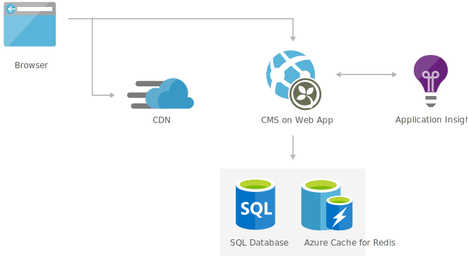

# Simple digital marketing website
Start simple with the content management system that enables you to easily maintain the messaging on your website in real-time, from a browser, with no coding skills.
This solution is built on the Azure managed services: Azure SQL Database, Application Insights, Content Delivery Network and Redis Cache. These services run in a high-availability environment, patched and supported, allowing you to focus on your solution instead of the environment they run in.

## Architecture

## Components
* [Web Apps](href="http://azure.microsoft.com/services/app-service/web/): An App Service Web App runs in a single region, accessible to web and mobile browsers. A content management system like Orchard or Umbraco provides service to manage and deploy content to the website.
* [Azure SQL Database](href="http://azure.microsoft.com/services/sql-database/): A SQL Database stores and serves data about the site.
* Application Insights: Application Insights, provides health and performance monitoring, and diagnostics.
* [Content Delivery Network](href="http://azure.microsoft.com/services/cdn/): A content delivery network serves static content such as images, script, and CSS, and reduces the load on the web app servers.
* [Redis Cache](http://azure.microsoft.com/services/cache/) enables very fast queries, and improves scalability by reducing the load on the main database.

## Next Steps
* [Deploy an ASP.NET web app to Azure App Service, using Visual Studio](https://docs.microsoft.com/api/Redirect/documentation/articles/web-sites-dotnet-get-started/)
* [SQL Database tutorial: Create a SQL database in minutes by using the Azure portal](https://docs.microsoft.com/api/Redirect/documentation/articles/sql-database-get-started/)
* [Application Performance Management with Application Insights](https://docs.microsoft.com/api/Redirect/documentation/articles/app-insights-overview/)
* [Use Azure Content Delivery Network in Azure App Service](https://docs.microsoft.com/api/Redirect/documentation/articles/cdn-websites-with-cdn/)
* [How to Use Azure Redis Cache](https://docs.microsoft.com/api/Redirect/documentation/articles/cache-dotnet-how-to-use-azure-redis-cache/)