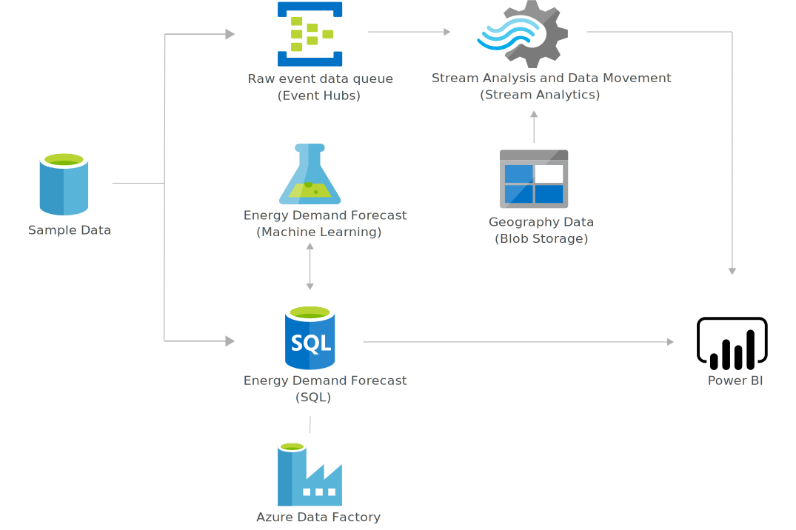

# Forecast Energy and Power Demand 
Learn how Microsoft Azure can help accurately forecast spikes in demand for energy products and services to give your company a competitive advantage.
This solution is built on the Azure managed services: Stream Analytics, Event Hubs, Machine Learning Studio, Azure SQL Database, Data Factory and Power BI. These services run in a high-availability environment, patched and supported, allowing you to focus on your solution instead of the environment they run in.

## Architecture

## Components
* [Stream Analytics](http://azure.microsoft.com/services/stream-analytics/) aggregates energy consumption data in near real-time to write to Power BI.
* [Event Hubs](http://azure.microsoft.com/services/event-hubs/) ingests raw energy consumption data and passes it on to Stream Analytics.
* [Machine Learning Studio](href="http://azure.microsoft.com/services/machine-learning-studio/): Machine Learning forecasts the energy demand of a particular region given the inputs received.
* [Azure SQL Database](href="http://azure.microsoft.com/services/sql-database/): SQL Database stores the prediction results received from the Azure Machine Learning service. These results are then consumed in the Power BI dashboard.
* [Data Factory](http://azure.microsoft.com/services/data-factory/) handles orchestration and scheduling of the hourly model retraining.
* [Power BI](https://powerbi.microsoft.com) visualizes energy consumption data from Stream Analytics as well as predicted energy demand from SQL Database.

## Next Steps
* [Learn more about Stream Analytics](https://docs.microsoft.com/azure/stream-analytics/stream-analytics-introduction)
* [Learn more about Event Hubs](https://docs.microsoft.com/azure/event-hubs/event-hubs-what-is-event-hubs)
* [Learn more about Machine Learning](https://docs.microsoft.com/azure/machine-learning/machine-learning-what-is-machine-learning)
* [Learn more about SQL Database](https://docs.microsoft.com/azure/sql-database/)
* [Learn more about Data Factory](https://docs.microsoft.com/azure/data-factory/data-factory-introduction)
* [Learn more about Power BI](https://powerbi.microsoft.com/documentation/powerbi-landing-page/)