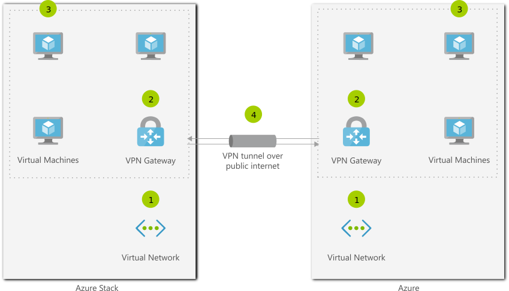

# Hybrid Connection 
Azure Stack enables you to deploy Azure services on-premises or in the cloud with a consistent application logic, development paradigm, and operations methodology.
Hybrid cloud applications are a single system that has components running in both Azure and Azure Stack. This solution blueprint is relevant to establishing connectivity for any application that involves communications between the Azure public cloud and on-premises Azure Stack components. Hybrid connectivity is a foundational blueprint that will be applicable to most Azure Stack solutions.
Note: This doesn't apply to Azure Stack deployments that are disconnected from the public internet.

## Architecture

## Data Flow
1. Deploy a virtual network in Azure and Azure Stack.
1. Deploy a virtual network gateway in Azure and Azure Stack.
1. Deploy virtual machines in each virtual network.
1. Establish a VPN connection over the public internet between the network gateways.

## Components
* [Virtual Network](href="http://azure.microsoft.com/services/virtual-network/): Provision private networks, optionally connect to on-premises datacenters.
* [Virtual Network Gateway](href="http://azure.microsoft.com/services/vpn-gateway/): Learn how to configure VPN Gateway, a virtual private network gateway.
* [Virtual Machines](href="http://azure.microsoft.com/services/virtual-machines/): Provision Windows and Linux virtual machines in seconds.
* [Azure Stack](http://azure.microsoft.com/overview/azure-stack/) is a hybrid cloud platform that lets you use Azure services on-premises.

## Next Steps
* [Virtual Network](https://docs.microsoft.com/azure/virtual-network)
* [VPN Gateway Documentation](https://docs.microsoft.com/azure/vpn-gateway)
* [Virtual Machines Overview](href="http://azure.microsoft.com/services/virtual-machines/)
* [Azure Stack User Documentation](https://docs.microsoft.com/azure/azure-stack/user)