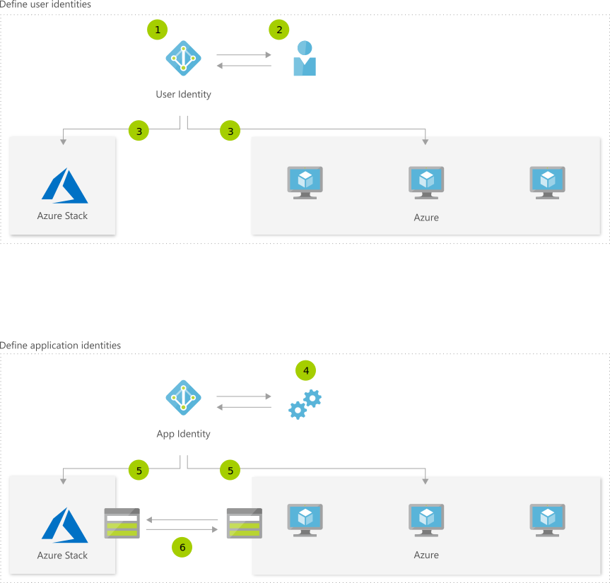

# Hybrid Identity 
The need to keep application components on-premises doesn't have to be a barrier to adopting cloud technologies. With Azure Stack, app components can reside on-premises while interacting with components running in Azure public cloud. This blueprint enables teams to manage identity for users as well as applications in a way that is consistent across clouds.

## Architecture

## Data Flow
1. Set up an Azure Active Directory tenant.
1. Create users.
1. Deploy, manage, and operate application resources on Azure and Azure Stack.
1. Create service principles.
1. Deploy with service principles.
1. Application resources can communicate over network.

## Components
* [Azure Stack](http://azure.microsoft.com/overview/azure-stack/) is a hybrid cloud platform that lets you use Azure services on-premises.
* [Virtual Machines](href="http://azure.microsoft.com/services/virtual-machines/): Provision Windows and Linux virtual machines in seconds.
* Learn how to synchronize directories and enable single sign-on with [Azure Active Directory](http://azure.microsoft.com/services/active-directory/) (Azure AD).

## Next Steps
* [Azure Stack User Documentation](https://docs.microsoft.com/azure/azure-stack/user)
* [Virtual Machines Overview](href="http://azure.microsoft.com/services/virtual-machines/)
* [Azure Active Directory Documentation](https://docs.microsoft.com/azure/active-directory)