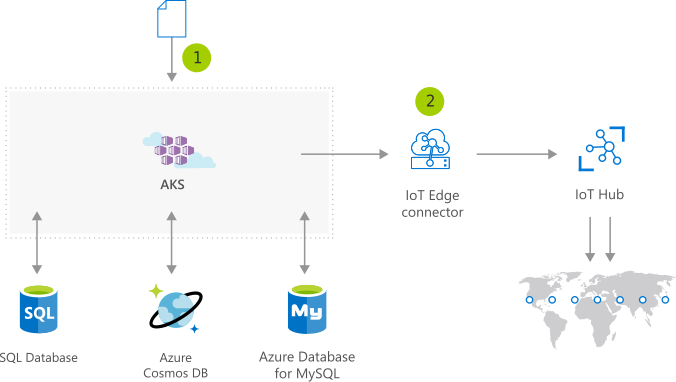

# IoT device deployment and management on demand | Microsoft
IoT scenarios can potentially involve hundreds to thousands of IoT devices. AKSprovides scalable compute resources on demand for IoT solutions, running inthe cloud or on-premises.

## Architecture

## Data Flow
1. User initiates AKS deployment using a Helm Chart
1. IoT Edge Connector virtual node deploys to Edge devices via the IoT Hub.
1. Deployment is updated on Edge devices