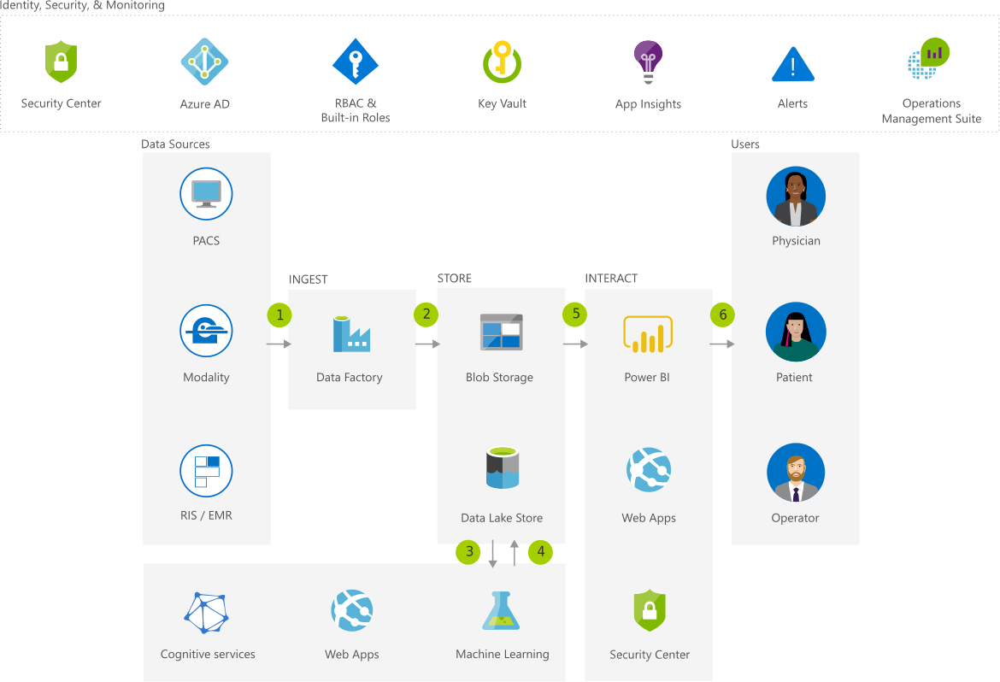

# Medical Data Storage Solutions 
Cloud and hybrid solutions from Microsoft help you manage medical data storage efficiently and cost effectively, while infusing intelligence and maintaining compliance.

## Architecture

## Data Flow
1. Securely ingest medical image data using Azure Data Factory.
1. Securely store medical image data in Azure Data Lake Store and/or Azure Blob Storage.
1. Analyze medical image data using a pre-trained Azure Cognitive Services API or a custom developed Machine Learning model.
1. Store artificial intelligence (AI) and Machine Learning results in Azure Data Lake.
1. Interact AI and Machine Learning results using PowerBI, while preserving Role-Based Access Control (RBAC).
1. Securely interact with medical image data via a web based vendor neutral archive (VNA) image viewer.

## Components
* [Data Factory](href="http://azure.microsoft.com/services/data-factory/): Hybrid data integration at enterprise scale, made easy
* Azure Data Lake Storage Gen1: Hyperscale repository for big data analytics workloads
* [Cognitive Services](href="http://azure.microsoft.com/services/cognitive-services/): Add smart API capabilities to enable contextual interactions
* [App Service](href="http://azure.microsoft.com/services/app-service/): Quickly create powerful cloud apps for web and mobile
* [Security Center](href="http://azure.microsoft.com/services/security-center/): Unify security management and enable advanced threat protection across hybrid cloud workloads
* [Azure Active Directory](href="http://azure.microsoft.com/services/active-directory/): Synchronize on-premises directories and enable single sign-on
* [Key Vault](href="http://azure.microsoft.com/services/key-vault/): Safeguard and maintain control of keys and other secrets
* Application Insights: Detect, triage, and diagnose issues in your web apps and services
* [Azure Monitor](href="http://azure.microsoft.com/services/monitor/): Highly granular and real-time monitoring data for any Azure resource
* [Machine Learning Studio](href="http://azure.microsoft.com/services/machine-learning-studio/): Easily build, deploy, and manage predictive analytics solutions
* [Power BI Embedded](href="http://azure.microsoft.com/services/power-bi-embedded/): Embed fully interactive, stunning data visualizations in your applications

## Next Steps
* [Azure Data Factory V2 Preview Documentation](https://docs.microsoft.com/azure/data-factory/)
* [Data Lake Store Documentation](https://docs.microsoft.com/azure/data-lake-store/)
* [Get started with Azure](https://docs.microsoft.com/azure/#pivot=get-started)
* [Web Apps overview](https://docs.microsoft.com/azure/app-service/app-service-web-overview/)
* [Azure Security Center Documentation](https://docs.microsoft.com/azure/security-center/)
* [Get started with Azure AD](https://docs.microsoft.com/azure/active-directory/get-started-azure-ad/)
* [What is Azure Key Vault?](https://docs.microsoft.com/azure/key-vault/key-vault-overview/)
* [Application Insights Documentation](https://docs.microsoft.com/azure/application-insights/)
* [Azure Monitor Documentation](https://docs.microsoft.com/azure/monitoring-and-diagnostics/)
* [Azure Machine Learning Documentation](https://docs.microsoft.com/azure/machine-learning/)
* [Power BI Embedded Documentation](https://docs.microsoft.com/azure/power-bi-embedded/)