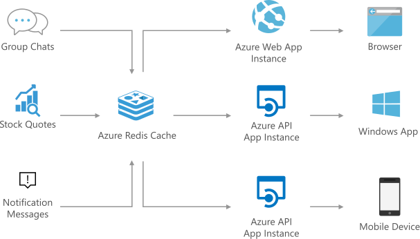

# Messaging
Azure Redis Cache supports standard publish and subscribe functionalities. Its ideal for routing real-time messages and scaling up web communication frameworks such as SignalR.

## Architecture
