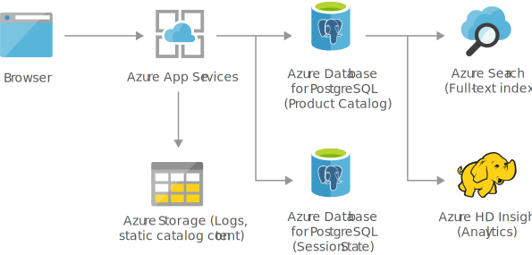

# Retail and e-commerce using Azure Database for PostgreSQL 
Build secure and scalable e-commerce solutions that meet the demands of both customers and business. Engage customers through customized products and offers, process transactions quickly and securely, and focus on fulfillment and customer service.

## Architecture
