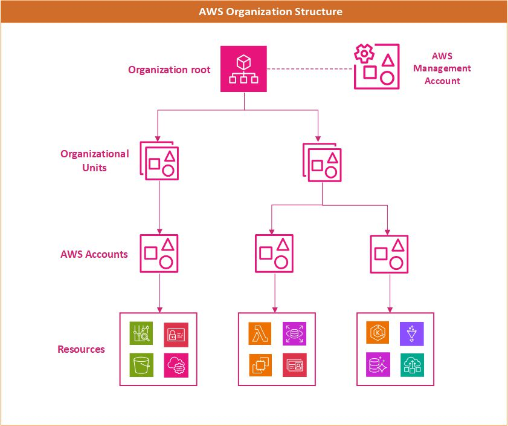

This article compares the account and organizational structure between Azure and AWS.

- For links to articles that compare other AWS and Azure services, see [Azure for AWS professionals](/azure/architecture/aws-professional/).
- For a complete listing and charts showing service mapping between AWS and Azure, see [AWS to Azure services comparison](/azure/architecture/aws-professional/services).

A typical AWS environment will use an organization such as the pictured in the diagram below. There will be a organizational root and optionally a dedicated AWS Management account. Below that root, there will be Organizational Units which can be used to apply different policies to different accounts. AWS resources will be often use an AWS account as a logical and billing boundary.
 

<figure>
  
  <figcaption> <em>AWS Account Management Structure</em> </figcaption>
</figure>

An Azure structure will look very similar, but rather than a dedicated management account there will be adminstrative permissions on the the tenant. This eliminates the need for an entire account just for management purposes. Unlike AWS, Azure has resource groups as a fundamental unit. Resources must be assigned to resource groups and permissions can be applied at the resource group level.

<figure>
  
  <figcaption> <em>Azure Management Structure</em> </figcaption>
</figure>

## AWS Management Account vs Azure tenant

In Azure when you are creating your Azure Account it creates an identity where you can manage your users, groups and applications which is called as a Tenant (Microsoft Entra Tenant). Azure subscriptions are created under this tenant. A Microsoft Entra tenant provides identity and access management, which is an important part of your security posture. A Microsoft Entra tenant ensures that authenticated and authorized users only access the resources to which they have permissions.  

## AWS Accounts vs Azure Subscriptions

In Microsoft Azure, the equivalent of AWS Account is called Azure Subscriptions. Azure Subscriptions are a logical unit of Azure services that are linked to an Azure account in Entra ID tenant. Each subscription is linked to a billing account and provides the boundary within which resources are created, managed, and billed. Subscriptions are key to understanding cost allocation and adhering to budget limits, ensuring that every service used is tracked and billed accordingly. Azure subscription also acts as a boundary for resource quotas and limits like AWS accounts. Some resource quotas are adjustable while others are non-adjustable or hard limits. 

Cross-account resource access in AWS enables resources from one AWS account to be accessed or managed by another AWS account. In AWS, there are IAM roles and resource based policies to access resources cross-account. In Azure, users and services from different subscriptions can be granted access using role based access control (RBAC) which is applied at different scopes (Management groups, subscription, resource group, or individual resources).  

## AWS OUs vs Azure Management groups

In Microsoft Azure, the equivalent of Organizational units is Management groups  both are used to organize and manage cloud resources at a high level across multiple accounts or subscriptions. Azure Management groups are needed to efficiently manage access, policies, and compliance for the Azure subscriptions. The governance conditions applied at Management Group level cascade to all the associated subscriptions by inheritance. 

*Important facts about management groups and subscriptions:* 

- A single directory can support 10,000 management groups. 

- A management group tree can support up to six levels of depth. 

- Each management group and subscription can support only one parent. 

- Each management group can have many children. 

- All subscriptions and management groups are within a single hierarchy in each directory. 

- Subscriptions per management group are unlimited. 

- For more information, see Important facts about the root management group later in this article. 

The root management group is the top-level management group associated with each directory. All management groups and subscriptions roll up to the root management group. It allows for the implementation of global policies and Azure role assignments at the directory level. 

## Service Control Policies vs Azure Policy

The primary goal of Service Control Policies in AWS is to limit the maximum effective permissions within an AWS account. Azure maximum permissions are defined within Entra and can be applied at the tenant, subscription, or resource group level. Azure policy has a wide range of use cases, a few of which do align with typical SCP usage patterns. Both Service Control Policies and Azure Policy can be used to control enforce compliance with enterprise standards, such as tagging or the use of specific SKUs. Both SCPs and Azure Policies can block deployment of resources that do not meet compliance requirements. Azure policies can be more proactive than SCPs and can trigger remediations to bring resources into compliance and can asses existing resources as well as future deployments.

## Comparison of structure and ownership of AWS accounts and Azure subscriptions

An Azure account represents a billing relationship and Azure subscriptions help you organize access to Azure resources. Account Administrator, Service Administrator, and Co-Administrator are the three classic subscription administrator roles in Azure:

- **Account Administrator**. The subscription owner and the billing owner for the resources used in the subscription. The account administrator can only be changed by transferring ownership of the subscription. Only one Account administrator is assigned per Azure Account.

- **Service Administrator**. This user has rights to create and manage resources in the subscription, but is not responsible for billing. By default, for a new subscription, the Account Administrator is also the Service Administrator. The account administrator can assign a separate user to the Service Administrator for managing the technical and operational aspects of a subscription. Only one Service Administrator is assigned per subscription.

- **Co-administrator**. There can be multiple co-administrators assigned to a subscription. Co-administrators have the same access privileges as the Service Administrator, but they cannot change the Service Administrator.

Below the subscription level user roles and individual permissions can also be assigned to specific resources, similarly to how permissions are granted to Identity and Access Management (IAM) users and groups in AWS. In Azure, all user accounts are associated with either a Microsoft Account or Organizational Account (an account managed through a Microsoft Entra ID).

Like AWS accounts, subscriptions have default service quotas and limits. For a full list of these limits, see [Azure subscription and service limits, quotas, and constraints](/azure/azure-subscription-service-limits). These limits can be increased up to the maximum by [filing a support request in the management portal](/archive/blogs/girishp/increasing-core-quota-limits-in-azure).

### See also

- [Classic subscription administrator roles, Azure roles, and Microsoft Entra roles](/azure/role-based-access-control/rbac-and-directory-admin-roles)

- [How to add or change Azure administrator roles](/azure/billing/billing-add-change-azure-subscription-administrator)

- [How to download your Azure billing invoice and daily usage data](/azure/billing/billing-download-azure-invoice-daily-usage-date)

## Contributors

*This article is maintained by Microsoft. It was originally written by the following contributors.*

Principal author:

- [Srinivasaro Thumala](https://www.linkedin.com/in/srini-thumala/)

Other contributor:

- [Adam Cerini](https://www.linkedin.com/in/adamcerini)

*To see non-public LinkedIn profiles, sign in to LinkedIn.*

## Next steps
## Related resources
