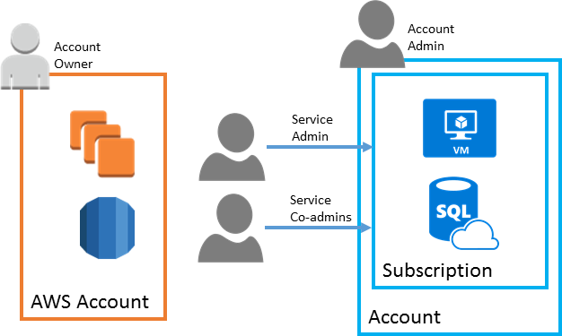

# Azure and AWS accounts and subscriptions

Azure services can be purchased using several pricing options, depending on your organization's size and needs. See the [pricing overview](https://azure.microsoft.com/pricing) page for details.

[Azure subscriptions](/azure/virtual-machines/linux/infrastructure-example) are a grouping of resources with an assigned owner responsible for billing and permissions management. Unlike AWS, where any resources created under the AWS account are tied to that account, subscriptions exist independently of their owner accounts, and can be reassigned to new owners as needed.

 *Comparison of structure and ownership of AWS accounts and Azure subscriptions*
  

An Azure account represents a billing relationship and Azure subscriptions help you organize access to Azure resources. Account Administrator, Service Administrator, and Co-Administrator are the three classic subscription administrator roles in Azure:

- **Account Administrator**. The subscription owner and the billing owner for the resources used in the subscription. The account administrator can only be changed by transferring ownership of the subscription. Only one Account administrator is assigned per Azure Account.

- **Service Administrator**. This user has rights to create and manage resources in the subscription, but is not responsible for billing. By default, for a new subscription, the Account Administrator is also the Service Administrator. The account administrator can assign a separate user to the service administrator for managing the technical and operational aspects of a subscription. Only one service administrator is assigned per subscription.

- **Co-administrator**. There can be multiple co-administrators assigned to a subscription. Co-administrators have the same access privileges as the Service Administrator, but they cannot change the service administrator.

Below the subscription level user roles and individual permissions can also be assigned to specific resources, similarly to how permissions are granted to IAM users and groups in AWS. In Azure, all user accounts are associated with either a Microsoft Account or Organizational Account (an account managed through an Azure Active Directory).

Like AWS accounts, subscriptions have default service quotas and limits. For a full list of these limits, see [Azure subscription and service limits, quotas, and constraints](/azure/azure-subscription-service-limits). These limits can be increased up to the maximum by [filing a support request in the management portal](/archive/blogs/girishp/increasing-core-quota-limits-in-azure).

### See also

- [Classic subscription administrator roles, Azure roles, and Azure AD roles](/azure/role-based-access-control/rbac-and-directory-admin-roles)

- [How to add or change Azure administrator roles](/azure/billing/billing-add-change-azure-subscription-administrator)

- [How to download your Azure billing invoice and daily usage data](/azure/billing/billing-download-azure-invoice-daily-usage-date)
