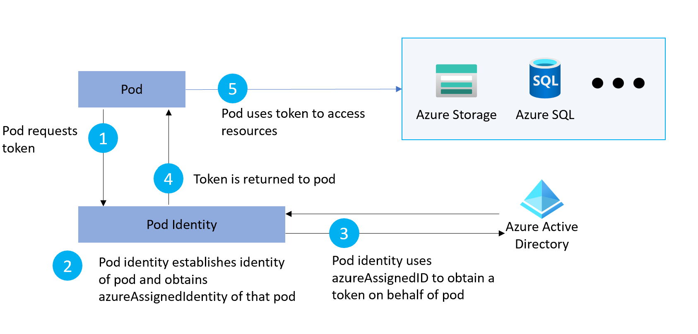

# Kubernetes Pod Identity

A common challenge for developers is the management of secrets and credentials used to secure communication between different components making up a solution. Pod identities eliminate the need for developers to manage credentials, to access other cloud services, like Cosmos DB, Key Vault, or Blob Storage.

## EKS Architecture

To call AWS Services from within a pod, you have two native options:

- IAM Roles for Service Accounts [(IRSA)](https://docs.aws.amazon.com/eks/latest/userguide/iam-roles-for-service-accounts.html) - You can associate an IAM role with a Kubernetes service account. This service account can then provide AWS permissions to the containers in any pod that uses that service account.  The IAM roles for service accounts feature provides the following benefits:
  - **Least privilege**: by using the IAM roles for service accounts feature, you no longer need to provide extended permissions to the node IAM role so that pods on that node can call AWS APIs. You can scope IAM permissions to a service account, and only pods that use that service account have access to those permissions. This feature also eliminates the need for third-party solutions such as `kiam` or `kube2iam`.
  - **Credential isolation**: a container can only retrieve credentials for the IAM role that is associated with the service account to which it belongs. A container never has access to credentials that are intended for another container that belongs to another pod.
  - **Auditability**: access and event logging are available through [CloudTrail](https://docs.aws.amazon.com/awscloudtrail/latest/userguide/cloudtrail-user-guide.html?msclkid=001d22acb02911ec8c00d5b286e46997) to help ensure retrospective auditing.
- [Amazon EKS node IAM role](https://docs.aws.amazon.com/eks/latest/userguide/create-node-role.html) - The Amazon EKS node kubelet daemon makes calls to AWS APIs on your behalf. Nodes receive permissions for these API calls through an IAM instance profile and associated policies.

## AKS Architecture

You can use [Azure AD Pod Identity](/azure/aks/use-azure-ad-pod-identity) or [Azure AD Workload Identity](https://azure.github.io/azure-workload-identity/docs/) to access an Azure managed service from an AKS-hosted workload application just using a security token issued by Azure Active Directory instead of using explicit credentials such as a connection string, username and password, or primary key:

### Azure Active Directory Pod Identity

[Azure Active Directory Pod Identity](/azure/aks/use-azure-ad-pod-identity) uses Kubernetes primitives to associate managed identities for Azure resources and identities in Azure Active Directory (Azure AD) with pods. Administrators create identities and bindings as Kubernetes primitives that allow pods to access Azure resources that rely on Azure AD as an identity provider.

A managed identity for Azure resources lets a pod authenticate itself against Azure services that support it, such as Storage or SQL. The pod is assigned an Azure Identity that lets them authenticate to Azure Active Directory and receive a digital token. This digital token can be presented to other Azure services that check if the pod is authorized to access the service and perform the required actions. This approach means that no secrets are required for database connection strings, for example. The simplified workflow for pod managed identity is shown in the following diagram:

With a managed identity, your application code doesn't need to include credentials to access a service, such as Azure Storage. As each pod authenticates with its own identity, so you can audit and review access. If your application connects with other Azure services, use managed identities to limit credential reuse and risk of exposure.

For more information about pod identities, see [Configure an AKS cluster to use pod managed identities and with your applications](https://github.com/Azure/aad-pod-identity#demo).

> **Important**: Azure Active Directory (Azure AD) Pod-managed Identity feature will be soon replaced by [Azure Active Directory Workload Identity](https://azure.github.io/azure-workload-identity/docs/).

For more information on Azure Active Directory Pod Identity, see the following resources:

- [Azure Active Directory Pod Identity in Azure Kubernetes Service](/azure/aks/use-azure-ad-pod-identity)
- [Azure Active Directory Pod Identity Documentation](https://azure.github.io/aad-pod-identity/docs/)
- [Azure Active Directory Pod Identity GitHub repository](https://github.com/Azure/aad-pod-identity)

### Azure Active Directory Workload Identity for Kubernetes

Workloads deployed in Kubernetes clusters require Azure AD application credentials to access Azure AD protected resources, such as Azure Key Vault and Microsoft Graph. The [Azure AD Pod Identity](https://github.com/Azure/aad-pod-identity) open-source project provided a way to avoid needing these secrets, such as connection strings and primary keys, by using Azure managed identities.

[Azure AD Workload Identity for Kubernetes](https://azure.github.io/azure-workload-identity/docs/introduction.html) integrates with the Kubernetes native capabilities to federate with any external identity providers. This approach is simpler to use and deploy, and overcomes several limitations in Azure AD Pod Identity:

- Removes the scale and performance issues that existed for identity assignment
- Supports Kubernetes clusters hosted in any cloud or on-premises
- Supports both Linux and Windows workloads
- Removes the need for Custom Resource Definitions and pods that intercept Instance Metadata Service (IMDS) traffic
- Avoids the complication and error-prone installation steps such as cluster role assignment from the previous iteration.

## How does it work?

As shown in the following diagram, , the Kubernetes cluster becomes a security token issuer, issuing tokens to Kubernetes Service Accounts. These tokens can be configured to be trusted on Azure AD applications. They can then be exchanged for an Azure AD access token using the [Azure Identity SDKs](/dotnet/api/overview/azure/identity-readme) or the [Microsoft Authentication Library (MSAL)](https://github.com/AzureAD/microsoft-authentication-library-for-dotnet).

For more information, see the following resources:

- [Azure Workload Identity open-source project](https://azure.github.io/azure-workload-identity).
- [Workload identity federation](/azure/active-directory/develop/workload-identity-federation)
- [Azure AD workload identity federation with Kubernetes](https://blog.identitydigest.com/azuread-federate-k8s/)
- [Azure Active Directory Workload Identity Federation with external OIDC Identy Providers](https://arsenvlad.medium.com/azure-active-directory-workload-identity-federation-with-external-oidc-idp-4f06c9205a26)
- [Minimal Azure AD Workload identity federation](https://cookbook.geuer-pollmann.de/azure/workload-identity-federation)

## Example Workload

The following diagram shows the architecture of the application on an AKS cluster with the [OIDC Issuer](https://docs.microsoft.com/en-us/azure/aks/cluster-configuration#oidc-issuer-preview) enabled. The figure also shows how both the frontend and backend applications exchange the security tokens issued by the Kubernetes cluster to their service account with Azure AD tokens and how they use these tokens to access the following Azure AD protected resources:

- Azure Key Vault
- Azure CosmosDB
- Azure Storage Account
- Azure Service Bus

There are four steps to get the sample working end-to-end in a Kubernetes cluster:

- Cluster administrators configure the AKS cluster to issue tokens. An OIDC discovery document is published to allow validation of these tokens.
- Developers configure their deployments to use Kubernetes service accounts and get Kubernetes tokens.
- Azure AD applications are configured to trust the Kubernetes tokens.
- The Kubernetes tokens are exchanged for Azure AD tokens, and used to access Azure AD protected resources such as Azure and Microsoft Graph.

You can find the code of this example workload on [GitHub](https://github.com/azure-samples/azure-ad-workload-identity).

## What is next?

Azure AD workload identity federation for Kubernetes is currently supported only on Azure AD applications. Microsoft intends to extend the same model to Azure managed identities.

In the coming months, the product group plans to replace [Azure AD Pod Identity](https://github.com/Azure/aad-pod-identity) with [Azure AD Workload Identity](https://azure.github.io/azure-workload-identity/docs/introduction.html). The goal is to let users who are already using Azure AD Pod Identity to move to Azure Workload Identity with minimal changes.

You can share any feedback or questions via GitHub [issues](https://github.com/Azure/azure-workload-identity/issues?q=is%3Aissue+is%3Aopen+sort%3Aupdated-desc) or [discussions](https://github.com/Azure/azure-workload-identity/discussions). Your support will help shape the project to meet community needs for ensuring secure access to Azure AD protected resources from Kubernetes workloads.

## Considerations

- Pod identities are intended for use with Linux pods and container images only. Pod-managed identities support for Windows containers is coming soon.

## Next Steps

- [Azure AD Workload Identity](https://azure.github.io/azure-workload-identity/docs/introduction.html)
- [Azure AD Workload Identity - Quick Start](https://azure.github.io/azure-workload-identity/docs/quick-start.html)
- [Use Azure AD workload identity for Kubernetes in a .NET Standard application](/samples/azure-samples/azure-ad-workload-identity/azure-ad-workload-identity/)
- [Implement Azure Kubernetes Service (AKS)](/learn/modules/implement-azure-kubernetes-service/)
- [Manage identity and Access in Azure Active Directory](/learn/paths/manage-identity-and-access/)