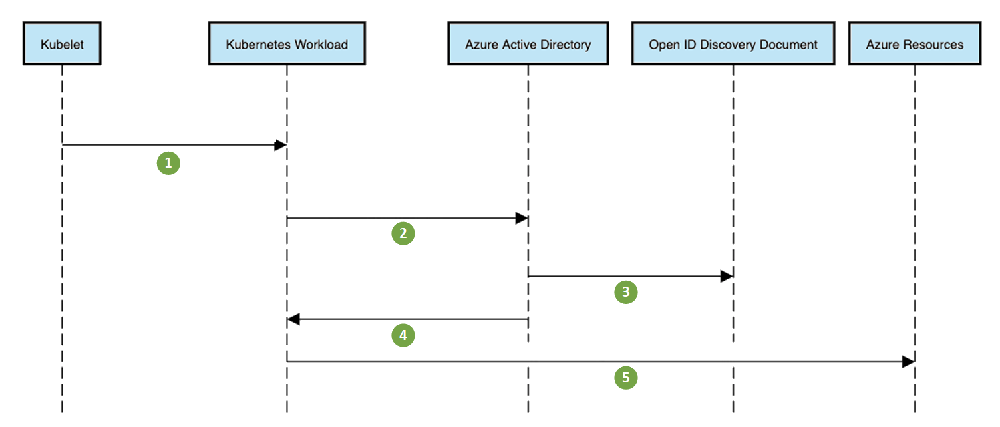
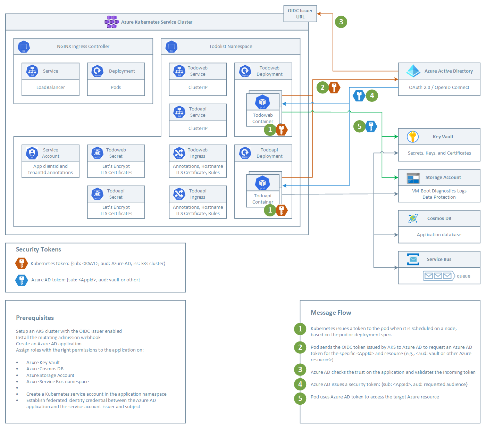

A common challenge for developers is the management of secrets and credentials used to secure communication between different components making up a solution. Pod identities eliminate the need for developers to manage credentials, to access other cloud services, like Cosmos DB, Key Vault, or Blob Storage.

## EKS Architecture

To call AWS Services from within a pod, you have two native options:

- IAM Roles for Service Accounts [(IRSA)](https://docs.aws.amazon.com/eks/latest/userguide/iam-roles-for-service-accounts.html) - You can associate an IAM role with a Kubernetes service account. This service account can then provide AWS permissions to the containers in any pod that uses that service account.  The IAM roles for service accounts feature provides the following benefits:
  - **Least privilege**: by using the IAM roles for service accounts feature, you no longer need to provide extended permissions to the node IAM role so that pods on that node can call AWS APIs. You can scope IAM permissions to a service account, and only pods that use that service account have access to those permissions. This feature also eliminates the need for third-party solutions such as `kiam` or `kube2iam`.
  - **Credential isolation**: a container can only retrieve credentials for the IAM role that is associated with the service account to which it belongs. A container never has access to credentials that are intended for another container that belongs to another pod.
  - **Auditability**: access and event logging are available through [CloudTrail](https://docs.aws.amazon.com/awscloudtrail/latest/userguide/cloudtrail-user-guide.html?msclkid=001d22acb02911ec8c00d5b286e46997) to help ensure retrospective auditing.
- [Amazon EKS node IAM role](https://docs.aws.amazon.com/eks/latest/userguide/create-node-role.html) - The Amazon EKS node kubelet daemon makes calls to AWS APIs on your behalf. Nodes receive permissions for these API calls through an IAM instance profile and associated policies.

## AKS Architecture

You can use [Azure AD Workload Identity](https://azure.github.io/azure-workload-identity/docs/) to access an Azure managed service from an AKS-hosted workload application just using a security token issued by Azure Active Directory instead of using explicit credentials such as a connection string, username and password, or primary key:

### Azure Active Directory Workload Identity for Kubernetes

Workloads deployed in Kubernetes clusters require Azure AD application credentials to access Azure AD protected resources, such as Azure Key Vault and Microsoft Graph. The [Azure AD Pod Identity](https://github.com/Azure/aad-pod-identity) open-source project provided a way to avoid needing these secrets, such as connection strings and primary keys, by using Azure managed identities.

[Azure AD Workload Identity for Kubernetes](https://azure.github.io/azure-workload-identity/docs/introduction.html) integrates with the Kubernetes native capabilities to federate with any external identity providers.

- Removes the scale and performance issues that existed for identity assignment
- Supports Kubernetes clusters hosted in any cloud or on-premises
- Supports both Linux and Windows workloads
- Removes the need for Custom Resource Definitions and pods that intercept Instance Metadata Service (IMDS) traffic
- Avoids the complication and error-prone installation steps such as cluster role assignment from the previous iteration.

## How does it work?

As shown in the following diagram, , the Kubernetes cluster becomes a security token issuer, issuing tokens to Kubernetes Service Accounts. These tokens can be configured to be trusted on Azure AD applications. They can then be exchanged for an Azure AD access token using the [Azure Identity SDKs](/dotnet/api/overview/azure/identity-readme) or the [Microsoft Authentication Library (MSAL)](https://github.com/AzureAD/microsoft-authentication-library-for-dotnet).

Message Flow:

1. Kubelet projects service account token to the workload at a configurable file path.
2. Kubernetes workload sends projected, signed service account token to the Azure Active Directory and requests an access token to it.
3. Azure Active Directory checks trust on the user-defined managed identity or registered application and validates incoming token.
4. Azure Active Directory issues a security access token.
5. The Kubernetes workload accesses Azure resources using Azure AD access token.

For more information, see the following resources:

- [Azure Workload Identity open-source project](https://azure.github.io/azure-workload-identity).
- [Workload identity federation](/azure/active-directory/develop/workload-identity-federation)
- [Azure AD workload identity federation with Kubernetes](https://blog.identitydigest.com/azuread-federate-k8s/)
- [Azure Active Directory Workload Identity Federation with external OIDC Identy Providers](https://arsenvlad.medium.com/azure-active-directory-workload-identity-federation-with-external-oidc-idp-4f06c9205a26)
- [Minimal Azure AD Workload identity federation](https://cookbook.geuer-pollmann.de/azure/workload-identity-federation)

## Example Workload

Let's assume you want to deploy to AKS a workload composed of a frontend and backend service on an AKS cluster that need to access the following services using a security token issued by Azure Active Directory:

- Azure Key Vault
- Azure CosmosDB
- Azure Storage Account
- Azure Service Bus

### Prerequisites

- Setup an AKS cluster with the [OIDC Issuer](https://docs.microsoft.com/en-us/azure/aks/cluster-configuration#oidc-issuer-preview) enabled.
- Install the [mutating admission webhook](https://azure.github.io/azure-workload-identity/docs/installation/mutating-admission-webhook.html).
- Create a Kubernetes service account for the workloads.
- Create an Azure AD application as shown in the [Quick Start](https://azure.github.io/azure-workload-identity/docs/quick-start.html).
- Assign roles with the right permissions to the Azure AD registered application on the Azure resources accessed by the frontend and backend applications:

  - Azure Key Vault
  - Azure Cosmos DB
  - Azure Storage Account
  - Azure Service Bus namespace

- Establish [federated identity credential](https://azure.github.io/azure-workload-identity/docs/quick-start.html) between the Azure AD application and the service account issuer and subject.
- Deploy the workload application to the AKS cluster.

### Message Flow

The following diagram shows how the frontend and backend applications acquire a security token from Azure Active Directory to access PaaS services such as Azure Key Vault or Azure Cosmos DB:

- Acquire security tokens for their service account from the [OIDC Issuer](https://docs.microsoft.com/en-us/azure/aks/cluster-configuration#oidc-issuer-preview) of the AKS cluster.
- Exchange security tokens acquired from the OIDC issuer with security tokens issued by Azure AD.
- Use Azure AD issued security tokens to access Azure resources.

Message Flow:

1. Kubernetes issues a token to the pod when it is scheduled on a node, based on the pod or deployment spec.
2. Pod sends the OIDC token issued by AKS to Azure AD to request an Azure AD token for the specific `appId` and resource.
3. Azure AD checks the trust on the application and validates the incoming token.
4. Azure AD issues a security token: `{sub: appId, aud: requested-audience}`.
5. Pod uses Azure AD token to access the target Azure resource.

There are four steps to get the sample working end-to-end in a Kubernetes cluster:

1. Cluster administrators configure the AKS cluster to issue tokens. An OIDC discovery document is published to allow validation of these tokens.
2. Developers configure their deployments to use Kubernetes service accounts and get Kubernetes tokens.
3. Azure AD applications are configured to trust the Kubernetes tokens.
4. The Kubernetes tokens are exchanged for Azure AD tokens, and used to access Azure AD protected resources such as Azure and Microsoft Graph.

You can find the code of this example workload on [GitHub](https://github.com/azure-samples/azure-ad-workload-identity).

## What is next?

Azure AD workload identity federation for Kubernetes is currently supported only on Azure AD applications. Microsoft intends to extend the same model to Azure managed identities.

## Next Steps

- [Azure AD Workload Identity](https://azure.github.io/azure-workload-identity/docs/introduction.html)
- [Azure AD Workload Identity - Quick Start](https://azure.github.io/azure-workload-identity/docs/quick-start.html)
- [Use Azure AD workload identity for Kubernetes in a .NET Standard application](/samples/azure-samples/azure-ad-workload-identity/azure-ad-workload-identity/)
- [Implement Azure Kubernetes Service (AKS)](/learn/modules/implement-azure-kubernetes-service/)
- [Manage identity and Access in Azure Active Directory](/learn/paths/manage-identity-and-access/)