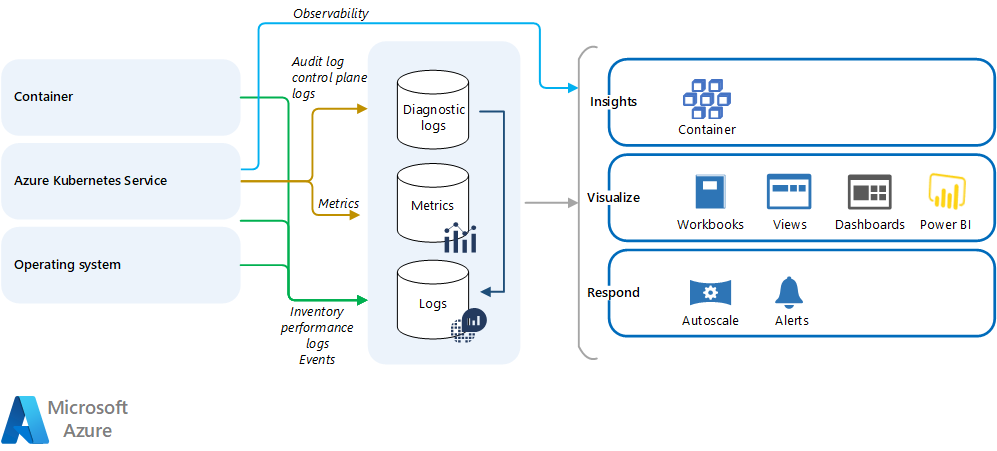

This article describes how Azure Kubernetes Service (AKS) monitoring compares to Amazon Elastic Kubernetes Service (Amazon EKS). The article guides you on different options to monitor and manage the logs of an AKS cluster and its workloads.

[!INCLUDE [eks-aks](includes/eks-aks-include.md)]

## Amazon EKS monitoring and logging

Like any Kubernetes service, EKS has two major components, the control plane and worker nodes. There are specific capabilities for each layer.

### Amazon EKS control plane and cluster monitoring

Amazon EKS integrates with [Amazon CloudWatch Logs](https://docs.aws.amazon.com/AmazonCloudWatch/latest/logs/WhatIsCloudWatchLogs.html) to provide logging and monitoring for the Amazon EKS control plane. This integration isn't enabled by default, but when configured, it gathers logs on:

- API server and API calls.
- Audit logs and user interactions.
- Authenticator logs.
- Scheduler and controller logs.

Amazon EKS exposes [control plane metrics](https://aws.github.io/aws-eks-best-practices/reliability/docs/controlplane/#monitor-control-plane-metrics) at the `/metrics` endpoint, in Prometheus text format. CloudWatch Container Insights can collect and store [Prometheus metrics](https://prometheus.io/docs/introduction/overview). You can deploy and self-manage Prometheus on top of your EKS cluster, or use [Amazon Managed service for Prometheus](https://aws.amazon.com/prometheus).

Amazon EKS also integrates with Amazon Web Services (AWS) CloudTrail to track actions and API calls. For more information, see [Logging Amazon EKS API calls with AWS CloudTrail](https://docs.aws.amazon.com/eks/latest/userguide/logging-using-cloudtrail.html).

### Amazon EKS workload monitoring

[CloudWatch Container Insights](https://docs.aws.amazon.com/AmazonCloudWatch/latest/monitoring/ContainerInsights.html) can collect and aggregate metrics and logs from containerized applications deployed in EKS. You can implement Container Insights on Amazon EKS with a containerized version of the CloudWatch agent, or by using the [AWS Distro for OpenTelemetry](https://aws.amazon.com/otel) as a DaemonSet. You can send logs with FluentBit.

## AKS monitoring and logging

Like other Azure resources, AKS generates [platform metrics and resource logs](/azure/aks/monitor-aks-reference) that you can use to monitor its basic health and performance.

*Download a [Visio file](https://arch-center.azureedge.net/eks-to-aks-monitoring.vsdx) of this architecture.*

### Azure Monitor

AKS natively integrates with [Azure Monitor](/azure/azure-monitor/overview). Azure Monitor stores metrics and logs in a central location called a [Log Analytics workspace](/azure/azure-monitor/logs/log-analytics-workspace-overview). This data is processed and analyzed to provide insights and alerts. For more information, see [Monitor Azure Kubernetes Service (AKS) with Azure Monitor](/azure/aks/monitor-aks).

[Container Insights](/azure/azure-monitor/containers/container-insights-overview) is the feature of Azure Monitor that collects, indexes, and stores the data your AKS cluster generates. You can configure Container Insights to monitor managed Kubernetes clusters hosted on AKS and other cluster configurations. Container Insights can monitor AKS health and performance with visualization tailored to Kubernetes environments. Similar to EKS, enabling Container Insights for your AKS cluster deploys a containerized version of the Log Analytics agent, which is responsible for sending data to your Log Analytics workspace.

###  Microsoft Sentinel

[Microsoft Sentinel](/azure/sentinel/overview) delivers intelligent security analytics and threat intelligence across the enterprise. With Microsoft Sentinel, you get a single solution for attack detection, threat visibility, proactive hunting, and threat response.

Microsoft Sentinel is your bird's-eye view across the enterprise alleviating the stress of increasingly sophisticated attacks, increasing volumes of alerts, and long resolution time frames.

Microsoft Sentinel enriches your investigation and detection with AI. It provides Microsoft's threat intelligence stream and enables you to bring your own threat intelligence.  

Microsoft Sentinel  must be connected with your [AKS ](/azure/sentinel/data-connectors/azure-kubernetes-service-aks). This connector lets you stream your Azure Kubernetes Service (AKS) diagnostics logs into Microsoft Sentinel, allowing you to continuously monitor activity in all your instances.

Once you have connected your data sources to Microsoft Sentinel, you can [visualize and monitor the data](/azure/sentinel/monitor-your-data) using the Microsoft Sentinel adoption of Azure Monitor Workbooks, which provides versatility in creating custom dashboards.

### AKS cluster and workload monitoring

An AKS deployment can divide into cluster level components, managed AKS components, Kubernetes objects and workloads, applications, and external resources. The following table shows a common strategy for monitoring an AKS cluster and workload applications. Each level has distinct monitoring requirements.

| Level | Description | Monitoring requirements |
|---|---|---|
| Cluster level components | Virtual machine scale sets abstracted as AKS nodes and node pools | Node status and resource utilization including CPU, memory, disk, and network |
| Managed AKS components | AKS control plane components including API servers, cloud controller, and `kubelet` | Control plane logs and metrics from the `kube-system` namespace |
| Kubernetes objects and workloads | Kubernetes objects such as deployments, containers, and replica sets | Resource utilization and failures |
| Applications | Application workloads running on the AKS cluster | Monitoring specific to architecture, but including application logs and service transactions |
| External | External resources that aren't part of AKS but are required for cluster scalability and management | Specific to each component |

- **Cluster level components:** You can use existing Container Insights views and reports to monitor cluster level components to understand their health, readiness, performance, CPU and memory resource utilization, and trends.

- **Managed AKS components:** You can use Metrics Explorer to view the **Inflight Requests** counter. This view includes request latency and work queue processing time.

- **Kubernetes objects and workloads:** You can use existing Container Insights views and reports to monitor deployment, controllers, pods, and containers. Use the **Nodes** and **Controllers** views to view the health and performance of the pods that are running on nodes and controllers, and their resource consumption in terms of CPU and memory.

  From the Container Insights **Containers** view, you can view the health and performance of containers, or select an individual container and monitor its events and logs in real time. For details about using this view and analyzing container health and performance, see [Monitor your Kubernetes cluster performance with Container Insights](/azure/azure-monitor/containers/container-insights-analyze).

- **Applications:** You can use [Application Insights](/azure/azure-monitor/app/app-insights-overview) to monitor applications that are running on AKS and other environments. Application Insights is an application performance management tool that provides support for many programming languages. Depending on your needs, you can instrument your application code to capture requests, traces, logs, exceptions, custom metrics, and end-to-end transactions, and send this data to Application Insights. If you have a Java application, you can provide monitoring without instrumenting your code. For more information, see [Zero instrumentation application monitoring for Kubernetes](/azure/azure-monitor/app/kubernetes-codeless).

- **External components**: You can monitor external components like service mesh, ingress, and egress with Prometheus and Grafana or other tools. You can use Azure Monitor features to monitor any platform as a service (PaaS) that your workload applications use, such as databases and other Azure resources.

### Third-party monitoring solutions

You can set up third-party monitoring solutions like Grafana or Prometheus in your AKS node pools.

- For Grafana, [Grafana Labs](https://grafana.com/grafana/dashboards/12006) provides a dashboard with views of critical API server metrics. You can use this dashboard on your existing Grafana server or set up a new Grafana server in Azure. For more information, see [Monitor your Azure services in Grafana](/azure/azure-monitor/visualize/grafana-plugin).

- [Prometheus](https://prometheus.io) is a popular open-source metrics monitoring solution from the [Cloud Native Compute Foundation](https://www.cncf.io/). You can integrate Prometheus with Azure Monitor so you don't need to set up and manage a Prometheus server with a store.

  Container Insights provides a seamless onboarding experience to collect Prometheus metrics. You can expose the Prometheus metrics endpoint through your exporters or pod applications, and the containerized agent for Container Insights can scrape the metrics. Container Insights complements and completes end-to-end AKS monitoring, including log collection, which Prometheus as a stand-alone tool doesn't provide. For more information, see [Configure scraping of Prometheus metrics with Container insights](/azure/azure-monitor/containers/container-insights-prometheus-integration).

### AKS monitoring costs

The Azure Monitor pricing model is primarily based on the amount of data that's ingested per day into your Log Analytics workspace. The cost varies by the plan and retention periods you select.

Before enabling Container Insights, estimate costs and understand how to control data ingestion and its costs. For detailed guidance, see [Estimating costs to monitor your AKS cluster](/azure/azure-monitor/containers/container-insights-cost#estimating-costs-to-monitor-your-aks-cluster).

## Contributors

*This article is maintained by Microsoft. It was originally written by the following contributors.*

Principal authors:

- [Ketan Chawda](https://www.linkedin.com/in/ketanchawda1402) | Senior Customer Engineer
- [Paolo Salvatori](https://www.linkedin.com/in/paolo-salvatori) | Principal Service Engineer
- [Laura Nicolas](https://www.linkedin.com/in/lauranicolasd) | Senior Software Engineer

Other contributors:

- [Chad Kittel](https://www.linkedin.com/in/chadkittel) | Principal Software Engineer
- [Ed Price](https://www.linkedin.com/in/priceed) | Senior Content Program Manager
- [Theano Petersen](https://www.linkedin.com/in/theanop) | Technical Writer

*To see non-public LinkedIn profiles, sign in to LinkedIn.*

## Next steps

- [AKS for Amazon EKS professionals](index.md)
- [Kubernetes identity and access management](workload-identity.yml)
- [Secure network access to Kubernetes](private-clusters.yml)
- [Storage options for a Kubernetes cluster](storage.md)
- [Cost management for Kubernetes](cost-management.yml)
- [Kubernetes node and node pool management](node-pools.yml)
- [Cluster governance](governance.md)

## Related resources

- [Use Azure Monitor Private Link Scope](/samples/azure-samples/azure-monitor-private-link-scope/azure-monitor-private-link-scope)
- [Monitor Azure Kubernetes Service (AKS) with Azure Monitor](/azure/aks/monitor-aks)
- [Monitoring AKS data reference](/azure/aks/monitor-aks-reference)
- [Container Insights overview](/azure/azure-monitor/containers/container-insights-overview)
- [Enable Container Insights](/azure/azure-monitor/containers/container-insights-onboard)
- [AKS resource logs](/azure/aks/monitor-aks-reference#resource-logs)
- [Configure scraping of Prometheus metrics with Container Insights](/azure/azure-monitor/containers/container-insights-prometheus-integration)
- [How to query logs from Container Insights](/azure/azure-monitor/containers/container-insights-log-query)
- [Azure Monitor data source for Grafana](https://grafana.com/grafana/plugins/grafana-azure-monitor-datasource/)
- [Monitor and back up Azure resources](/learn/paths/az-104-monitor-backup-resources/)
- [Instrument solutions to support monitoring and logging](/learn/paths/az-204-instrument-solutions-support-monitoring-logging/)
- [Design a solution to log and monitor Azure resources](/learn/modules/design-solution-to-log-monitor-azure-resources/)
- [Monitor the usage, performance, and availability of resources with Azure Monitor](/learn/paths/monitor-usage-performance-availability-resources-azure-monitor)
