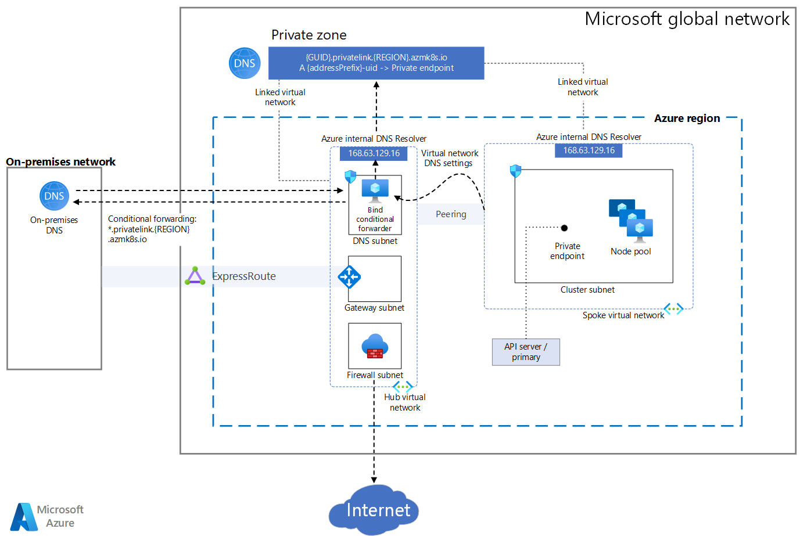

The following article will guide you on how to establish a secure connection to the managed API Server of an Azure Kubernetes Service (AKS) cluster and the different options to restrict the public network access.

> [!NOTE]
> This article is part of a [series of articles](../index.md) that helps professionals who are familiar with Amazon Elastic Kubernetes Service (Amazon EKS) to understand Azure Kubernetes Service (AKS).

## Amazon EKS Networking Modes

[Amazon Virtual Private Cloud (Amazon VPC)](https://docs.aws.amazon.com/vpc/latest/userguide/what-is-amazon-vpc.html) enables you to launch AWS resources into a virtual network composed of public and private subnets. A [subnet](https://docs.aws.amazon.com/vpc/latest/userguide/configure-subnets.html) is a range of IP addresses in the VPC. A public subnet should be used for hosting resources that must be connected to the internet, while a private subnet should be used for hosting those resources that won't be connected to the public internet. Amazon EKS managed node groups can be provisioned in both public and private subnets.

Endpoint access control lets you configure whether the API Server endpoint is reachable from the public internet or through your VPC. EKS provides two ways for [controlling access to the cluster endpoint](https://docs.aws.amazon.com/eks/latest/userguide/cluster-endpoint.html). You can enable the public endpoint (default mode), private endpoint, or both endpoints simultaneously. When the public endpoint is enabled, you can add CIDR restrictions to limit the client IP addresses that can connect to the public endpoint.

How your nodes connect to the managed Kubernetes control plane is determined by which endpoint setting you have configured for the cluster. Note, these endpoints settings can be changed anytime through the EKS console or API. For more information, see [Amazon EKS cluster endpoint access control](https://docs.aws.amazon.com/eks/latest/userguide/cluster-endpoint.html).

### Public Endpoint Only

Exposing the control plane via a public endpoint is the default mode for new Amazon EKS clusters. When only the public endpoint for the cluster is enabled, Kubernetes API requests that originate from within the VPC (such as worker node to control plane communication) leave the VPC but not Amazon's network. For nodes to connect to the control plane, they must have a public IP address and a route to an internet gateway or a route to a NAT gateway where they can use the public IP address of the NAT gateway.

### Public and Private Endpoints

When both the public and private endpoints are enabled, Kubernetes API requests from within the VPC communicate to the control plane via the EKS-managed ENIs within your VPC. Your cluster API server is accessible from the Internet.

### Private Endpoint Only

When only the private endpoint is enabled, all traffic to your cluster API server must come from within your cluster's VPC or a connected network. Public access to your API server from the internet is disabled. Any kubectl or helm commands must come from within the VPC or a connected network. You can implement this access mode using AWS VPN or DirectConnect to your VPC. If you want to restrict access to the endpoint but don't have [AWS VPN](https://docs.aws.amazon.com/vpn/index.html) or [AWS DirectConnect](https://docs.aws.amazon.com/directconnect/latest/UserGuide/Welcome.html), adding CIDR restrictions to the public endpoint allows you to limit connections to the endpoint without any additional networking setup.

For more information on connectivity options, see [Accessing a Private Only API Server](https://docs.aws.amazon.com/eks/latest/userguide/cluster-endpoint.html#private-access).

## Protect Access to the API Server of an Azure Kubernetes Service (AKS) Cluster

There are two options to secure network access to the Kubernetes API in AKS: use a private AKS cluster or use authorized IP ranges.

Using a private AKS cluster, you can ensure that the network traffic between your API server and your node pools remains within your virtual network. In a private AKS cluster, the control plane or API server has an internal IP address only accessible via an [Azure Private Endpoint](/azure/private-link/private-endpoint-overview) located in the same virtual network of the AKS cluster. Likewise, any virtual machine in the same virtual network can privately communicate with the control plane via the private endpoint.

The control plane or API server is hosted in an Azure Kubernetes Service (AKS) cluster in an Azure-managed subscription, while the AKS cluster and its node pools are in the customer's subscription.



When you provision a private AKS cluster, the AKS resource provider creates a private FQDN within the [node resource group](/azure/aks/faq#can-i-provide-my-own-name-for-the-aks-node-resource-group) with a private DNS zone and an additional public FQDN with a corresponding A record in the Azure public DNS zone. The agent nodes will use the A record in the private DNS zone to resolve the private IP address of the private endpoint for communication to the API server. You can let the AKS resource provider create the private DNS Zone in the [node resource group](/azure/aks/faq#can-i-provide-my-own-name-for-the-aks-node-resource-group) of your cluster or create your own private DNS zone and pass its resource id to the provisioning system no matter if you use [Terraform with Azure](/azure/developer/terraform/overview), [Bicep](/azure/azure-resource-manager/bicep/overview?tabs=bicep), [ARM templates](/azure/azure-resource-manager/templates/overview), [Azure CLI](/cli/azure/), [Azure PowerShell module](/powershell/azure/?view=azps-7.3.0), or [Azure REST API](/rest/api/azure/) to create the cluster.

Suppose you enable the public FQDN of the API Server at provisioning time or later on using the [az aks update --enable-public-fqdn](/cli/azure/aks?view=azure-cli-latest#az-aks-update) command. In that case, you need to provision any virtual machine that needs access to the API Server (e.g., an Azure DevOps self-hosted agent or GitHub Actions self-hosted runner) in the same virtual network of the cluster or in any connected network (e.g., via [virtual network peering](/azure/virtual-network/virtual-network-peering-overview) or [site-to-site VPN](/azure/vpn-gateway/vpn-gateway-about-vpngateways)). Suppose you instead disable the public FQDN of the API Server to communicate with the private control plane. In that case, a virtual machine needs to be in the same virtual network hosting the cluster, not necessarily in the same subnet, or in any peered virtual network with a [virtual network link](/azure/dns/private-dns-virtual-network-links) to the [private DNS zone](/azure/dns/private-dns-overview) of the private AKS cluster. The latter contains an A record that resolves the FQDN of the API Server to the private IP address of the private endpoint used to communicate with the underlying control plane. For more information, see [AKS Private Cluster](/azure/aks/private-clusters).

You can use the following parameters exposed by the AKS resource provider to customize the deployment of a private AKS cluster:

- `authorizedIpRanges` (string): allowed IP ranges are specified in CIDR format.
- `disableRunCommand` (bool):  specifies whether to disable run command for the cluster or not.
- `enablePrivateCluster` (bool): specifies whether to create the cluster as private
- `enablePrivateClusterPublicFQDN` (bool): specifies whether to create additional public FQDN for a private cluster or not.
- `privateDnsZone` (string):
  - `system`: default value. If omitted, AKS resource type will create a Private DNS Zone in the Node Resource Group.
  - `None`: defaults to public DNS which means AKS will not create a Private DNS Zone.
  - `BYO Private DNS Zone resource ID`: you must create a Private DNS Zone in this format `privatelink.<region>.azmk8s.io` or `<subzone>.privatelink.<region>.azmk8s.io.`

The following table shows the options in terms of DNS configuration that you can adopt when deploying a private AKS cluster:

<table border="1">
  <tr>
    <td colspan="2" rowspan="2">DNS Options</td>
    <td colspan="2">enablePrivateClusterPublicFQDN</td>
  </tr>
    <td>true</td>
    <td>false</td>
  <tr>
  <tr>
    <td rowspan="3">privateDnsZone</td>
    <td>system</td>
    <td>
      <ul>
        <li>Agent nodes, and any other virtual machine in the AKS cluster virtual network or in any connected virtual network with a virtual network link with the private DNS zone, use the A record in the private DNS zone to resolve the private IP address of the private endpoint for communication to the API server.</li>
        <li>Any other virtual machine uses the public FQDN of the API Server.</li>
      </ul>
    </td>
    <td>
      <ul>
        <li>Agent nodes, and any other virtual machine in the AKS cluster virtual network or in any connected virtual network with a virtual network link with the private DNS zone, use the A record in the private DNS zone to resolve the private IP address of the private endpoint for communication to the API server.</li>
        <li>No public API Server FQDN is available.</li>
      </ul>
    </td>
  </tr>
  <tr>
    <td>Private DNS Zone resource id</td>
    <td>
      <ul>
        <li>Agent nodes, and any other virtual machine in the AKS cluster virtual network or in any connected virtual network with a virtual network link with the private DNS zone, use the A record in the private DNS zone to resolve the private IP address of the private endpoint for communication to the API server.</li>
        <li>Any other virtual machine uses the public FQDN of the API Server.</li>
      </ul>
    </td>
    <td>
      <ul>
        <li>Agent nodes, and any other virtual machine in the AKS cluster virtual network or in any connected virtual network with a virtual network link with the private DNS zone, use the A record in the private DNS zone to resolve the private IP address of the private endpoint for communication to the API server.</li>
        <li>No public API Server FQDN is available.</li>
      </ul>
    </td>
  </tr>
  <tr>
    <td>none</td>
    <td>
      <ul>
        <li>All the virtual machines, including agent nodes, use the public FQDN of the API Server available via as an A record in an Azure-managed public DNS zone.</li>
      </ul>
    </td>
    <td>
      <ul>
        <li> Wrong configuration: the private AKS cluster needs at least a public or a private DNS zone for the name resolution of the API Server.</li>
      </ul>
    </td>
  </tr>
</table>

The second option to improve cluster security and minimize attacks to the API server is using [Authorized IPs](/azure/aks/api-server-authorized-ip-ranges) to restrict the access to the control plane of a public AKS cluster to a well-known list of IP addresses and CIDRs. When using this option, the API server is still publicly exposed, but access is limited to a set of IP ranges. For more information, see [Secure access to the API server using authorized IP address ranges in Azure Kubernetes Service (AKS)](/azure/aks/api-server-authorized-ip-ranges).

An [AKS Private Cluster](/azure/aks/private-clusters) provides a higher security and isolation degree with respect to [Authorized IPs](/azure/aks/api-server-authorized-ip-ranges). However, you cannot convert an existing public AKS cluster into a private cluster. Vice versa, Authorized IPs can be enabled for any existing AKS cluster, for example, using the following Azure CLI command:

 ```azurecli-interactive
  az aks update \
      --resource-group myResourceGroup \
      --name myAKSCluster \
      --api-server-authorized-ip-ranges  73.140.245.0/24
  ```

When using a private AKS cluster, you can manage the cluster using [kubectl](https://kubernetes.io/docs/reference/kubectl/overview/) command-line tool from a management virtual machine located in the same virtual network of the cluster or in any peered virtual network. You can use [Azure Bastion](/azure/bastion/bastion-overview) deployed in the same virtual network or in a peered virtual network to connect to the jumpbox virtual machine used to administer and control the cluster. Azure Bastion is a service you deploy that lets you connect to a virtual machine using your browser and the Azure portal. The Azure Bastion service is a fully platform-managed PaaS service that you provision inside your virtual network. It provides secure and seamless RDP/SSH connectivity to your virtual machines directly from the Azure portal over TLS. When you connect via Azure Bastion, virtual machines do not need a public IP address, agent, or special client software.

Alternatively, you can [az aks command invoke](/cli/azure/aks/command?view=azure-cli-latest#az-aks-command-invoke) to run a shell command (with kubectl, helm) on your private AKS cluster, without the need to connect to a jumpbox virtual machine.

### Options for connecting to a private AKS cluster

As mentioned in the previous section, there are several options for establishing network connectivity to the private cluster.

- Create a virtual machine in the same Azure Virtual Network (VNET) as the AKS cluster.
- Use a virtual machine in a separate network and set up [virtual network peering](/azure/virtual-network/virtual-network-peering-overview) with the AKS cluster virtual network.
- Use an [Azure Express Route or VPN](/azure/expressroute/expressroute-about-virtual-network-gateways) connection.
- Use the [az aks command invoke](/azure/aks/command-invoke) Azure CLI command.
- Use an [Azure Private Endpoint](/azure/private-link/private-endpoint-overview) connection.

### Considerations

- IP authorized ranges can't be applied to the private API server endpoint, they only apply to the public API server
- Azure Private Link service limitations apply to private clusters.
- No support for Azure DevOps Microsoft-hosted Agents with private clusters. Consider using Self-hosted Agents.
- If you need to enable Azure Container Registry to work with a private AKS cluster, set up a private link for the container registry in the cluster virtual network or set up - peering between the Container Registry virtual network and the private cluster's virtual network.
- No support for converting existing AKS clusters into private clusters
- Deleting or modifying the private endpoint in the customer subnet will cause the cluster to stop functioning.

## Next steps

> [!div class="nextstepaction"]
> [Kubernetes Storage options](storage.md)

The following references provide links to automation samples and documentation to deploy AKS clusters with a secured API:

- [Create a Private AKS cluster with a Public DNS Zone](https://github.com/Azure/azure-quickstart-templates/tree/master/demos/private-aks-cluster-with-public-dns-zone)
- [Create a private Azure Kubernetes Service cluster using Terraform and Azure DevOps](https://github.com/azure-samples/private-aks-cluster-terraform-devops)
- [Create a public or private Azure Kubernetes Service cluster with Azure NAT Gateway and Azure Application Gateway](https://github.com/Azure-Samples/aks-nat-agic)
- [Use Private Endpoints with a Private AKS Cluster](https://github.com/azure-samples/private-aks-cluster)
- [Introduction to Azure Private Link](/learn/modules/introduction-azure-private-link/)
- [Introduction to Secure Network Infrastructure with Azure network security](/learn/paths/secure-networking-infrastructure/)