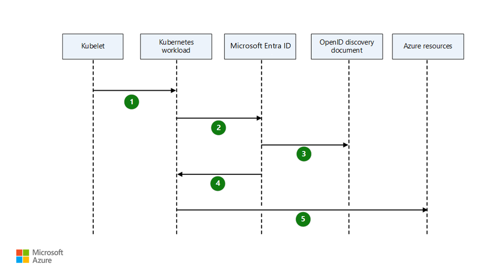
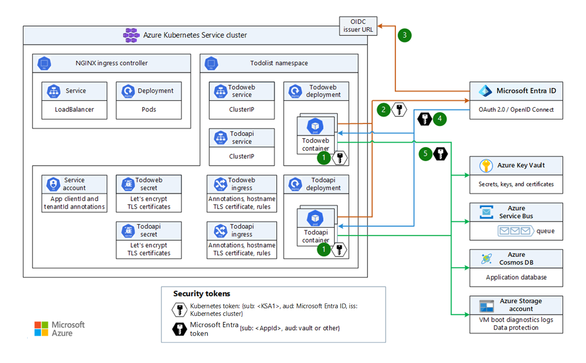

This article describes how Amazon Elastic Kubernetes Service (Amazon EKS) and Azure Kubernetes Service (AKS) provide identity for Kubernetes workloads to access cloud platform services. For a detailed comparison of Amazon Web Services (AWS) Identity and Access Management (IAM) and Azure Active Directory (Azure AD), see:

- [Azure Active Directory identity management and access management for AWS](/azure/architecture/reference-architectures/aws/aws-azure-ad-security)
- [Mapping AWS IAM concepts to similar ones in Azure](https://techcommunity.microsoft.com/t5/fasttrack-for-azure/mapping-aws-iam-concepts-to-similar-ones-in-azure/ba-p/3612216)

This guide explains how AKS clusters, built-in services, and add-ons use [managed identities](/azure/active-directory/managed-identities-azure-resources/overview) to access Azure resources like load balancers and managed disks. The article also demonstrates how to use [Azure AD Workload Identity](https://azure.github.io/azure-workload-identity/docs) so AKS workloads can access Azure resources without needing a connection string, access key, or user credentials.

[!INCLUDE [eks-aks](includes/eks-aks-include.md)]

## Amazon EKS identity and access management

Amazon EKS has two native options to call AWS services from within a Kubernetes pod: IAM roles for service accounts, and Amazon EKS service-linked roles.

[IAM roles for service accounts](https://docs.aws.amazon.com/eks/latest/userguide/iam-roles-for-service-accounts.html) associate IAM roles with a Kubernetes service account. This service account provides AWS permissions to the containers in any pod that uses the service account. IAM roles for service accounts provide the following benefits:

- **Least privilege**: You don't need to provide extended permissions to the node IAM role for pods on that node to call AWS APIs. You can scope IAM permissions to a service account, and only pods that use that service account have access to those permissions. This feature also eliminates the need for third-party solutions such as `kiam` or `kube2iam`.

- **Credential isolation**: A container can only retrieve credentials for the IAM role associated with the service account that it belongs to. A container never has access to credentials for another container that belongs to another pod.

- **Auditability**: [Amazon CloudTrail](https://docs.aws.amazon.com/awscloudtrail/latest/userguide/cloudtrail-user-guide.html?msclkid=001d22acb02911ec8c00d5b286e46997) provides access and event logging to help ensure retrospective auditing.

[Amazon EKS service-linked roles](https://docs.aws.amazon.com/eks/latest/userguide/using-service-linked-roles.html) are unique IAM roles that are linked directly to Amazon EKS. Service-linked roles are predefined by Amazon EKS and include all the permissions required to call other AWS services on behalf of the role. For the [Amazon EKS node IAM role](https://docs.aws.amazon.com/eks/latest/userguide/create-node-role.html), the Amazon EKS node `kubelet` daemon calls AWS APIs on behalf of the node. Nodes get permissions for these API calls from an IAM instance profile and associated policies.

## AKS cluster managed identities

An AKS cluster requires an identity to access Azure resources like load balancers and managed disks. This identity can be either a managed identity or a service principal. By default, creating an AKS cluster automatically creates a [system-assigned managed identity](/azure/active-directory/managed-identities-azure-resources/overview#managed-identity-types). The Azure platform manages the identity, and you don't need to provision or rotate any secrets. For more information about Azure AD managed identities, see [Managed identities for Azure resources](/azure/active-directory/managed-identities-azure-resources/overview).

AKS doesn't create a [service principal](/azure/aks/kubernetes-service-principal) automatically, so if you want to use a service principal, you must create it. The service principal eventually expires, and you must renew it to keep the cluster working. Managing service principals adds complexity, so it's easier to use managed identities.

Managed identities are essentially wrappers around service principals that simplify management. The same permission requirements apply both to service principals and managed identities. Managed identities use certificate-based authentication. Each managed identities credential has an expiration of 90 days and is rotated after 45 days.

AKS uses both system-assigned and user-assigned managed identity types, and these identities are immutable. When you create or use an AKS virtual network, attached Azure disk, static IP address, route table, or user-assigned `kubelet` identity with resources outside the [node resource group](/azure/aks/faq#why-are-two-resource-groups-created-with-aks), the Azure CLI adds the role assignment automatically.

If you use another method to create the AKS cluster, such as a Bicep template, Azure Resource Manager (ARM) template, or Terraform module, you need to use the principal ID of the cluster managed identity to do a role assignment. The AKS cluster identity must have at least [Network Contributor](/azure/role-based-access-control/built-in-roles#network-contributor) role on the subnet within your virtual network. To define a custom role instead of using the built-in Network Contributor role, you need the following permissions:

- `Microsoft.Network/virtualNetworks/subnets/join/action`
- `Microsoft.Network/virtualNetworks/subnets/read`

When the cluster identity needs to access an existing resource, for example when you deploy an AKS cluster to an existing virtual network, you should use a user-assigned managed identity. If you use a system-assigned control plane identity, the resource provider can't get its principal ID before it creates the cluster, so it's impossible to create the proper role assignments before cluster provisioning.

### Summary of managed identities

AKS uses the following [user-assigned managed identities](/azure/active-directory/managed-identities-azure-resources/overview) for built-in services and add-ons.

| Identity                       | Name    | Use case | Default permissions | Bring your own identity
|----------------------------|-----------|----------|
| Control plane | AKS Cluster Name | Manages cluster resources including ingress load balancers and AKS-managed public IPs, cluster autoscaler, and Azure Disk and Azure File CSI drivers | Contributor role for node resource group | Supported
| Kubelet | AKS Cluster Name-agentpool | Authenticates with Azure Container Registry | NA (for kubernetes v1.15+) | Supported
| Add-on | HTTPApplicationRouting | Manages required network resources | Reader role for node resource group, contributor role for DNS zone | No
| Add-on | Ingress application gateway | Manages required network resources| Contributor role for node resource group | No
| Add-on | omsagent | Send AKS metrics to Azure Monitor | Monitoring Metrics Publisher role | No
| Add-on | Virtual-Node (ACIConnector) | Manages required network resources for Azure Container Instances | Contributor role for node resource group | No
| OSS project | aad-pod-identity | Allows applications to access cloud resources securely with Azure AD | NA | See steps to grant permission at [Azure AD Pod Identity](https://github.com/Azure/aad-pod-identity#role-assignment).

For more information, see [Use a managed identity in Azure Kubernetes Service](/azure/aks/use-managed-identity).

## Azure AD Workload Identity for Kubernetes

Kubernetes workloads require Azure AD application credentials to access Azure AD protected resources, such as Azure Key Vault and Microsoft Graph. A common challenge for developers is managing secrets and credentials to secure communication between different components of a solution.

[Azure AD Workload Identity for Kubernetes](https://azure.github.io/azure-workload-identity/docs) eliminates the need to manage credentials to access cloud services like Azure Cosmos DB, Azure Key Vault, or Azure Blob Storage. An AKS-hosted workload application can use Azure AD Workload Identity to access an Azure managed service by using an Azure AD security token, instead of explicit credentials like a connection string, username and password, or primary key.

The [Azure AD Pod Identity](https://github.com/Azure/aad-pod-identity) open-source project introduced a way to avoid needing secrets, such as connection strings and primary keys, by using Azure managed identities. Azure AD Workload Identity for Kubernetes integrates with Kubernetes native capabilities to federate with any external identity providers. This approach is simpler to use and deploy, and it overcomes several limitations of Azure AD Pod Identity.

As shown in the following diagram, the Kubernetes cluster becomes a security token issuer that issues tokens to Kubernetes service accounts. You can configure these tokens to be trusted on Azure AD applications. The tokens can then be exchanged for Azure AD access tokens by using the [Azure Identity SDKs](/dotnet/api/overview/azure/identity-readme) or the [Microsoft Authentication Library (MSAL)](https://github.com/AzureAD/microsoft-authentication-library-for-dotnet).

1. The `kubelet` agent projects a service account token to the workload at a configurable file path.
2. The Kubernetes workload sends the projected, signed service account token to Azure AD and requests an access token.
3. Azure AD uses an OIDC discovery document to check trust on the user-defined managed identity or registered application and validate the incoming token.
4. Azure AD issues a security access token.
5. The Kubernetes workload accesses Azure resources by using the Azure AD access token.

Azure AD Workload Identity federation for Kubernetes is currently supported only for Azure AD applications, but the same model could potentially extend to Azure managed identities.

For more information, automation, and documentation for Azure AD Workload Identity, see:

- [Azure Workload Identity open-source project](https://azure.github.io/azure-workload-identity).
- [Workload identity federation](/azure/active-directory/develop/workload-identity-federation)
- [Azure AD workload identity federation with Kubernetes](https://blog.identitydigest.com/azuread-federate-k8s)
- [Azure AD workload identity federation with external OIDC identity providers](https://arsenvlad.medium.com/azure-active-directory-workload-identity-federation-with-external-oidc-idp-4f06c9205a26)
- [Minimal Azure AD workload identity federation](https://cookbook.geuer-pollmann.de/azure/workload-identity-federation)
- [Azure AD Workload Identity](https://azure.github.io/azure-workload-identity/docs/introduction.html)
- [Azure AD Workload Identity quick start](https://azure.github.io/azure-workload-identity/docs/quick-start.html)
- [Use Azure AD Workload Identity for Kubernetes in a .NET Standard application](/samples/azure-samples/azure-ad-workload-identity/azure-ad-workload-identity)

### Example workload

The example workload runs a frontend and a backend service on an AKS cluster. The workload services use Azure AD Workload Identity to access the following Azure services by using Azure AD security tokens:

- Azure Key Vault
- Azure Cosmos DB
- Azure Storage account
- Azure Service Bus namespace

#### Prerequisites

1. Set up an AKS cluster with the [OIDC issuer](/azure/aks/cluster-configuration#oidc-issuer-preview) enabled.
1. Install the [mutating admission webhook](https://azure.github.io/azure-workload-identity/docs/installation/mutating-admission-webhook.html).
1. Create a Kubernetes service account for the workloads.
1. Create an Azure AD application as shown in the [quickstart](https://azure.github.io/azure-workload-identity/docs/quick-start.html).
1. Assign roles with the right permissions to the needed Azure AD registered applications.
1. Establish a [federated identity credential](https://azure.github.io/azure-workload-identity/docs/quick-start.html) between the Azure AD application and the service account issuer and subject.
1. Deploy the workload application to the AKS cluster.

#### Azure AD Workload Identity message flow

AKS applications get security tokens for their service account from the [OIDC issuer](/azure/aks/cluster-configuration#oidc-issuer-preview) of the AKS cluster. Azure AD Workload Identity exchanges the security tokens with security tokens issued by Azure AD, and the applications use the Azure AD-issued security tokens to access Azure resources.

The following diagram shows how the frontend and backend applications acquire Azure AD security tokens to use Azure platform as a service (PaaS) services.

*Download a [Visio file](https://arch-center.azureedge.net/eks-to-aks-iam-workload-identity.vsdx) of this architecture.*

1. Kubernetes issues a token to the pod when it's scheduled on a node, based on the pod or deployment spec.
2. The pod sends the OIDC-issued token to Azure AD to request an Azure AD token for the specific `appId` and resource.
3. Azure AD checks the trust on the application and validates the incoming token.
4. Azure AD issues a security token: `{sub: appId, aud: requested-audience}`.
5. The pod uses the Azure AD token to access the target Azure resource.

To use Azure AD Workload Identity end-to-end in a Kubernetes cluster:

1. You configure the AKS cluster to issue tokens and publish an OIDC discovery document to allow validation of these tokens.
1. You configure the Azure AD applications to trust the Kubernetes tokens.
1. Developers configure their deployments to use the Kubernetes service accounts to get Kubernetes tokens.
1. Azure AD Workload Identity exchanges the Kubernetes tokens for Azure AD tokens.
1. AKS cluster workloads use the Azure AD tokens to access protected resources such as Microsoft Graph.

## Contributors

*This article is maintained by Microsoft. It was originally written by the following contributors.*

Principal authors:

- [Paolo Salvatori](https://www.linkedin.com/in/paolo-salvatori) | Principal Service Engineer
- [Martin Gjoshevski](https://www.linkedin.com/in/martin-gjoshevski) | Senior Service Engineer

Other contributors:

- [Laura Nicolas](https://www.linkedin.com/in/lauranicolasd) | Senior Software Engineer
- [Chad Kittel](https://www.linkedin.com/in/chadkittel) | Principal Software Engineer
- [Ed Price](https://www.linkedin.com/in/priceed) | Senior Content Program Manager
- [Theano Petersen](https://www.linkedin.com/in/theanop) | Technical Writer

*To see non-public LinkedIn profiles, sign in to LinkedIn.*

## Next steps

- [AKS for Amazon EKS professionals](index.md)
- [Kubernetes monitoring and logging](monitoring.yml)
- [Secure network access to Kubernetes](private-clusters.yml)
- [Storage options for a Kubernetes cluster](storage.md)
- [Cost management for Kubernetes](cost-management.yml)
- [Kubernetes node and node pool management](node-pools.yml)
- [Cluster governance](governance.md)
- [Azure Active Directory identity management and access management for AWS](../../reference-architectures/aws/aws-azure-ad-security.yml)

## Related resources

- [Use a service principal with Azure Kubernetes Service (AKS)](/azure/aks/kubernetes-service-principal)
- [Use a managed identity in Azure Kubernetes Service](/azure/aks/use-managed-identity)
- [Implement Azure Kubernetes Service (AKS)](/learn/modules/implement-azure-kubernetes-service)
- [Manage identity and access in Azure AD](/learn/paths/manage-identity-and-access)
