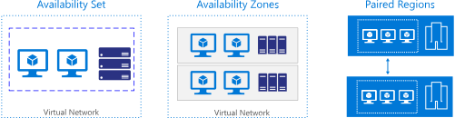

# Azure for AWS Professionals

This article helps Amazon Web Services (AWS) experts understand the basics of Microsoft Azure accounts, platform, and services. It also covers key similarities and differences between the AWS and Azure platforms.

You'll learn:

- How accounts and resources are organized in Azure.
- How available solutions are structured in Azure.
- How the major Azure services differ from AWS services.

Azure and AWS built their capabilities independently over time so that each has important implementation and design differences.

## Overview

Like AWS, Microsoft Azure is built around a core set of compute, storage, database, and networking services. In many cases, both platforms offer a basic equivalence between the products and services they offer. Both AWS and Azure allow you to build highly available solutions based on Windows or Linux hosts. So, if you're used to development using Linux and OSS technology, both platforms can do the job.

While the capabilities of both platforms are similar, the resources that provide those capabilities are often organized differently. Exact one-to-one relationships between the services required to build a solution are not always clear. In other cases, a particular service might be offered on one platform, but not the other. See [charts of comparable Azure and AWS services](./services.md).

## Accounts and subscriptions

Azure services can be purchased using several pricing options, depending on your organization's size and needs. See the [pricing overview](https://azure.microsoft.com/pricing/) page for details.

[Azure subscriptions](/azure/virtual-machines/linux/infrastructure-example) are a grouping of resources with an assigned owner responsible for billing and permissions management. Unlike AWS, where any resources created under the AWS account are tied to that account, subscriptions exist independently of their owner accounts, and can be reassigned to new owners as needed.

<!-- markdownlint-disable MD033 -->

 *Comparison of structure and ownership of AWS accounts and Azure subscriptions*
  

<!-- markdownlint-enable MD033 -->

Subscriptions are assigned three types of administrator accounts:

- **Account Administrator**. The subscription owner and the account billed for the resources used in the subscription. The account administrator can only be changed by transferring ownership of the subscription.

- **Service Administrator**. This account has rights to create and manage resources in the subscription, but is not responsible for billing. By default, the account administrator and service administrator are assigned to the same account. The account administrator can assign a separate user to the service administrator account for managing the technical and operational aspects of a subscription. Only one service administrator is assigned per subscription.

- **Co-administrator**. There can be multiple co-administrator accounts assigned to a subscription. Co-administrators cannot change the service administrator, but otherwise have full control over subscription resources and users.

Below the subscription level user roles and individual permissions can also be assigned to specific resources, similarly to how permissions are granted to IAM users and groups in AWS. In Azure, all user accounts are associated with either a Microsoft Account or Organizational Account (an account managed through an Azure Active Directory).

Like AWS accounts, subscriptions have default service quotas and limits. For a full list of these limits, see [Azure subscription and service limits, quotas, and constraints](/azure/azure-subscription-service-limits).
These limits can be increased up to the maximum by [filing a support request in the management portal](https://blogs.msdn.microsoft.com/girishp/2015/09/20/increasing-core-quota-limits-in-azure/).

### See also

- [How to add or change Azure administrator roles](/azure/billing/billing-add-change-azure-subscription-administrator)

- [How to download your Azure billing invoice and daily usage data](/azure/billing/billing-download-azure-invoice-daily-usage-date)

## Resource management

The term "resource" in Azure is used in the same way as in AWS, meaning any compute instance, storage object, networking device, or other entity you can create or configure within the platform.

Azure resources are deployed and managed using one of two models: [Azure Resource Manager](/azure/azure-resource-manager/resource-group-overview), or the older Azure [classic deployment model](/azure/azure-resource-manager/resource-manager-deployment-model). Any new resources are created using the Resource Manager model.

### Resource groups

Both Azure and AWS have entities called "resource groups" that organize resources such as VMs, storage, and virtual networking devices. However, [Azure resource groups](/azure/virtual-machines/windows/infrastructure-example) are not directly comparable to AWS resource groups.

While AWS allows a resource to be tagged into multiple resource groups, an Azure resource is always associated with one resource group. A resource created in one resource group can be moved to another group, but can only be in one resource group at a time. Resource groups are the fundamental grouping used by Azure Resource Manager.

Resources can also be organized using [tags](/azure/azure-resource-manager/resource-group-using-tags). Tags are key-value pairs that allow you to group resources across your subscription irrespective of resource group membership.

### Management interfaces

Azure offers several ways to manage your resources:

- [Web interface](/azure/azure-resource-manager/resource-group-portal).
    Like the AWS Dashboard, the Azure portal provides a full web-based management interface for Azure resources.

- [REST API](/rest/api/).
    The Azure Resource Manager REST API provides programmatic access to most of the features available in the Azure portal.

- [Command Line](/azure/azure-resource-manager/cli-azure-resource-manager).
    The Azure CLI provides a command-line interface capable of creating and managing Azure resources. The Azure CLI is available for [Windows, Linux, and Mac OS](https://docs.microsoft.com/cli/azure).

- [PowerShell](/azure/azure-resource-manager/powershell-azure-resource-manager).
    The Azure modules for PowerShell allow you to execute automated management tasks using a script. PowerShell is available for [Windows, Linux, and Mac OS](https://github.com/PowerShell/PowerShell).

- [Templates](/azure/azure-resource-manager/resource-group-authoring-templates).
    Azure Resource Manager templates provide similar JSON template-based resource management capabilities to the AWS CloudFormation service.

In each of these interfaces, the resource group is central to how Azure resources get created, deployed, or modified. This is similar to the role a "stack" plays in grouping AWS resources during CloudFormation deployments.

The syntax and structure of these interfaces are different from their AWS equivalents, but they provide comparable capabilities. In addition, many third-party management tools used on AWS, like [Hashicorp's Terraform](https://www.terraform.io/docs/providers/azurerm/) and [Netflix Spinnaker](https://www.spinnaker.io/), are also available on Azure.

<!-- markdownlint-disable MD024 -->

### See also

- [Azure resource group guidelines](/azure/azure-resource-manager/resource-group-overview#resource-groups)

## Regions and zones (high availability)

Failures can vary in the scope of their impact. Some hardware failures, such as a failed disk, may affect a single host machine. A failed network switch could affect a whole server rack. Less common are failures that disrupt a whole datacenter, such as loss of power in a datacenter. Rarely, an entire region could become unavailable.

One of the main ways to make an application resilient is through redundancy. But you need to plan for this redundancy when you design the application. Also, the level of redundancy that you need depends on your business requirements&mdash;not every application needs redundancy across regions to guard against a regional outage. In general, a tradeoff exists between greater redundancy and reliability versus higher cost and complexity.

In AWS, a region is divided into two or more Availability Zones. An Availability Zone corresponds with a physically isolated datacenter in the geographic region. Azure has numerous features for providing application redundancy at every level of potential failure, including **availability sets**, **availability zones**, and **paired regions**.

The following table summarizes each option.

| &nbsp; | Availability Set | Availability Zone | Paired region |
|--------|------------------|-------------------|---------------|
| Scope of failure | Rack | Datacenter | Region |
| Request routing | Load Balancer | Cross-zone Load Balancer | Traffic Manager |
| Network latency | Very low | Low | Mid to high |
| Virtual networking  | VNet | VNet | Cross-region VNet peering |

### Availability sets

To protect against localized hardware failures, such as a disk or network switch failing, deploy two or more VMs in an availability set. An availability set consists of two or more *fault domains* that share a common power source and network switch. VMs in an availability set are distributed across the fault domains, so if a hardware failure affects one fault domain, network traffic can still be routed the VMs in the other fault domains. For more information about Availability Sets, see [Manage the availability of Windows virtual machines in Azure](/azure/virtual-machines/windows/manage-availability).

When VM instances are added to availability sets, they are also assigned an [update domain](https://azure.microsoft.com/documentation/articles/virtual-machines-linux-manage-availability/). An update domain is a group of VMs that are set for planned maintenance events at the same time. Distributing VMs across multiple update domains ensures that planned update and patching events affect only a subset of these VMs at any given time.

Availability sets should be organized by the instance's role in your application to ensure one instance in each role is operational. For example, in a three-tier web application, create separate availability sets
for the front-end, application, and data tiers.

### Availability zones

An [Availability Zone](/azure/availability-zones/az-overview) is a physically separate zone within an Azure region. Each Availability Zone has a distinct power source, network, and cooling. Deploying VMs across availability zones helps to protect an application against datacenter-wide failures.

### Paired regions

To protect an application against a regional outage, you can deploy the application across multiple regions, using [Azure Traffic Manager][traffic-manager] to distribute internet traffic to the different regions. Each Azure region is paired with another region. Together, these form a [regional pair][paired-regions]. With the exception of Brazil South, regional pairs are located within the same geography in order to meet data residency requirements for tax and law enforcement jurisdiction purposes.

Unlike Availability Zones, which are physically separate datacenters but may be in relatively nearby geographic areas, paired regions are typically separated by at least 300 miles. This design ensures that large-scale disasters only affect one of the regions in the pair. Neighboring pairs can be set to sync database and storage service data, and are configured so that platform updates are rolled out to only one region in the pair at a time.

Azure [geo-redundant storage](/azure/storage/common/storage-redundancy-grs) is automatically backed up to the appropriate paired region. For all other resources, creating a fully redundant solution using paired regions means
creating a full copy of your solution in both regions.

### See also

- [Regions for virtual machines in Azure](/azure/virtual-machines/linux/regions)

- [Availability options for virtual machines in Azure](/azure/virtual-machines/linux/availability)

- [High availability for Azure applications](/azure/architecture/example-scenario/infrastructure/multi-tier-app-disaster-recovery)

- [Failure and disaster recovery for Azure applications](../framework/resiliency/backup-and-recovery.md)

- [Planned maintenance for Linux virtual machines in Azure](/azure/virtual-machines/linux/maintenance-and-updates)

## Services

For a listing of how services map between platforms, see [AWS to Azure services comparison](./services.md).

Not all Azure products and services are available in all regions. Consult the [Products by Region](https://azure.microsoft.com/global-infrastructure/services/) page for details. You can find the uptime guarantees and downtime credit policies for each Azure product or service on the [Service Level Agreements](https://azure.microsoft.com/support/legal/sla/) page.

The following sections provide a brief explanation of how commonly used features and services differ between the AWS and Azure platforms.

### Compute services

#### EC2 Instances and Azure virtual machines

Although AWS instance types and Azure virtual machine sizes are categorized similarly, the RAM, CPU, and storage capabilities differ.

- [Amazon EC2 Instance Types](https://aws.amazon.com/ec2/instance-types/)

- [Sizes for virtual machines in Azure (Windows)](/azure/virtual-machines/windows/sizes)

- [Sizes for virtual machines in Azure (Linux)](/azure/virtual-machines/linux/sizes)

Similar to AWS' per second billing, Azure on-demand VMs are billed per second.

#### EBS and Azure Storage for VM disks

Durable data storage for Azure VMs is provided by [data disks](/azure/virtual-machines/linux/about-disks-and-vhds)
residing in blob storage. This is similar to how EC2 instances store disk volumes on Elastic Block Store (EBS). [Azure temporary storage](https://blogs.msdn.microsoft.com/mast/2013/12/06/understanding-the-temporary-drive-on-windows-azure-virtual-machines/) also provides VMs the same low-latency temporary read-write storage as EC2 Instance Storage (also called ephemeral storage).

Higher performance disk IO is supported using [Azure premium storage](/azure/virtual-machines/windows/premium-storage). This is similar to the Provisioned IOPS storage options provided by AWS.

#### Lambda, Azure Functions, Azure Web-Jobs, and Azure Logic Apps

[Azure Functions](https://azure.microsoft.com/services/functions/) is the primary equivalent of AWS Lambda in providing serverless, on-demand code. However, Lambda functionality also overlaps with other Azure services:

- [WebJobs](/azure/app-service/web-sites-create-web-jobs) allow you to create scheduled or continuously running background tasks.

- [Logic Apps](https://azure.microsoft.com/services/logic-apps/) provides communications, integration, and business rule management services.

#### Autoscaling, Azure VM scaling, and Azure App Service Autoscale

Autoscaling in Azure is handled by two services:

- [Virtual machine scale sets](/azure/virtual-machine-scale-sets/overview) allow you to deploy and manage an identical set of VMs. The number of instances can autoscale based on performance needs.

- [App Service Autoscale](/azure/app-service/web-sites-scale) provides the capability to autoscale Azure App Service solutions.

#### Container Service

The [Azure Kubernetes Service](/azure/aks/intro-kubernetes) supports Docker containers managed through Kubernetes.

#### Other compute services

Azure offers several compute services that do not have direct equivalents in AWS:

- [Azure Batch](/azure/batch/batch-technical-overview) allows you to manage compute-intensive work across a scalable collection of virtual machines.

- [Service Fabric](/azure/service-fabric/service-fabric-overview) is a platform for developing and hosting scalable [microservice](/azure/service-fabric/service-fabric-overview-microservices) solutions.

#### See also

- [Create a Linux VM on Azure using the portal](/azure/virtual-machines/linux/quick-create-portal)

- [Azure Reference Architecture: Running a Linux VM on Azure](/azure/architecture/reference-architectures/n-tier/linux-vm)

- [Get started with Node.js web apps in Azure App Service](/azure/app-service/app-service-web-get-started-nodejs)

- [Azure Reference Architecture: Basic web application](/azure/architecture/reference-architectures/app-service-web-app/basic-web-app)

- [Create your first Azure Function](/azure/azure-functions/functions-create-first-azure-function)

### Storage

#### S3/EBS/EFS and Azure Storage

In the AWS platform, cloud storage is primarily broken down into three services:

- **Simple Storage Service (S3)**. Basic object storage that makes data available through an Internet accessible API.

- **Elastic Block Storage (EBS)**. Block level storage intended for access by a single VM.

- **Elastic File System (EFS)**. File storage meant for use as shared storage for up to thousands of EC2 instances.

In Azure Storage, subscription-bound [storage accounts](/azure/storage/common/storage-quickstart-create-account) allow you to create and manage the following storage services:

- [Blob storage](/azure/storage/common/storage-quickstart-create-account) stores any type of text or binary data, such as a document, media file, or application installer. You can set Blob storage for private access or share contents publicly to the Internet. Blob storage serves the same purpose as both AWS S3 and EBS.
- [Table storage](/azure/cosmos-db/table-storage-how-to-use-nodejs) stores structured datasets. Table storage is a NoSQL key-attribute data store that allows for rapid development and fast access to large quantities of data. Similar to AWS' SimpleDB and DynamoDB services.

- [Queue storage](/azure/storage/queues/storage-nodejs-how-to-use-queues) provides messaging for workflow processing and for communication between components of cloud services.

- [File storage](/azure/storage/files/storage-java-how-to-use-file-storage) offers shared storage for legacy applications using the standard server message block (SMB) protocol. File storage is used in a similar manner to EFS in the AWS platform.

#### Glacier and Azure Storage

[Azure Archive Blob Storage](/azure/storage/blobs/storage-blob-storage-tiers#archive-access-tier) is comparable to AWS Glacier storage service. It is intended for rarely accessed data that is stored for at least 180 days and can tolerate several hours of retrieval latency.

For data that is infrequently accessed but must be available immediately when accessed, [Azure Cool Blob Storage tier](/azure/storage/blobs/storage-blob-storage-tiers#cool-access-tier) provides cheaper storage than standard blob storage. This storage tier is comparable to AWS S3 - Infrequent Access storage service.

#### See also

- [Microsoft Azure Storage Performance and Scalability Checklist](/azure/storage/common/storage-performance-checklist)

- [Azure Storage security guide](/azure/storage/common/storage-security-guide)

- [Best practices for using content delivery networks (CDNs)](/azure/architecture/best-practices/cdn)

### Networking

#### Elastic Load Balancing, Azure Load Balancer, and Azure Application Gateway

The Azure equivalents of the two Elastic Load Balancing services are:

- [Load Balancer](https://azure.microsoft.com/documentation/articles/load-balancer-overview/) - provides the same capabilities as the AWS Classic Load Balancer, allowing you to distribute traffic for multiple VMs at the network level. It also provides failover capability.

- [Application Gateway](https://azure.microsoft.com/documentation/articles/application-gateway-introduction/) - offers application-level rule-based routing comparable to the AWS Application Load Balancer.

#### Route 53, Azure DNS, and Azure Traffic Manager

In AWS, Route 53 provides both DNS name management and DNS-level traffic routing
and failover services. In Azure this is handled through two services:

- [Azure DNS](https://azure.microsoft.com/documentation/services/dns/) provides domain and DNS management.

- [Traffic
    Manager][traffic-manager] provides DNS level traffic routing, load balancing, and failover
    capabilities.

#### Direct Connect and Azure ExpressRoute

Azure provides similar site-to-site dedicated connections through its
[ExpressRoute](https://azure.microsoft.com/documentation/services/expressroute/)
service. ExpressRoute allows you to connect your local network directly to Azure
resources using a dedicated private network connection. Azure also offers more
conventional [site-to-site VPN
connections](https://azure.microsoft.com/documentation/articles/vpn-gateway-howto-site-to-site-resource-manager-portal/)
at a lower cost.

#### See also

- [Create a virtual network using the Azure
    portal](https://azure.microsoft.com/documentation/articles/virtual-networks-create-vnet-arm-pportal/)

- [Plan and design Azure Virtual
    Networks](https://azure.microsoft.com/documentation/articles/virtual-network-vnet-plan-design-arm/)

- [Azure Network Security Best
    Practices](https://azure.microsoft.com/documentation/articles/azure-security-network-security-best-practices/)

### Database services

#### RDS and Azure relational database services

Azure provides several different relational database services that are the equivalent of AWS' Relational Database Service (RDS).

- [SQL Database](/azure/sql-database/sql-database-technical-overview)
- [Azure Database for MySQL](/azure/mysql/overview)
- [Azure Database for PostgreSQL](/azure/postgresql/overview)

Other database engines such as [SQL
Server](https://azure.microsoft.com/services/virtual-machines/sql-server/),
[Oracle](https://azure.microsoft.com/campaigns/oracle/), and
[MySQL](https://azure.microsoft.com/documentation/articles/virtual-machines-windows-classic-mysql-2008r2/)
can be deployed using Azure VM Instances.

Costs for AWS RDS are determined by the amount of hardware resources that your instance uses, like CPU, RAM, storage, and network bandwidth. In the Azure database services, cost depends on your database size, concurrent connections, and throughput levels.

#### See also

- [Azure SQL Database Tutorials](https://azure.microsoft.com/documentation/articles/sql-database-explore-tutorials/)

- [Configure geo-replication for Azure SQL Database with the Azure portal](https://azure.microsoft.com/documentation/articles/sql-database-geo-replication-portal/)

- [Introduction to Cosmos DB: A NoSQL JSON Database](/azure/cosmos-db/sql-api-introduction)

- [How to use Azure Table storage from Node.js](https://azure.microsoft.com/documentation/articles/storage-nodejs-how-to-use-table-storage/)

### Security and identity

#### Directory service and Azure Active Directory

Azure splits up directory services into the following offerings:

- [Azure Active
    Directory](https://azure.microsoft.com/documentation/articles/active-directory-whatis/) - cloud-based directory and identity management service.

- [Azure Active Directory
    B2B](https://azure.microsoft.com/documentation/articles/active-directory-b2b-collaboration-overview/) - enables access to your corporate applications from partner-managed
    identities.

- [Azure Active Directory
    B2C](https://azure.microsoft.com/documentation/articles/active-directory-b2c-overview/) - service offering support for single sign-on and user management for
    consumer facing applications.

- [Azure Active Directory Domain
    Services](https://azure.microsoft.com/documentation/articles/active-directory-ds-overview/) - hosted domain controller service, allowing Active Directory compatible
    domain join and user management functionality.

#### Web application firewall

In addition to the [Application Gateway Web Application Firewall](/azure/application-gateway/waf-overview), you can also use web application
firewalls from third-party vendors like [Barracuda Networks](https://azure.microsoft.com/marketplace/partners/barracudanetworks/waf/).

#### See also

- [Getting started with Microsoft Azure security](/azure/security)

- [Azure Identity Management and access control security best practices](/azure/security/azure-security-identity-management-best-practices)

### Application and messaging services

#### Simple Email Service

AWS provides the Simple Email Service (SES) for sending notification,
transactional, or marketing emails. In Azure, third-party solutions like
[SendGrid](https://sendgrid.com/partners/azure/) provide email services.

#### Simple Queueing Service

AWS Simple Queueing Service (SQS) provides a messaging system for connecting applications, services, and devices within the AWS platform. Azure has two services that provide similar functionality:

- [Queue storage](/azure/storage/queues/storage-nodejs-how-to-use-queues): a cloud messaging service that allows communication between application components within Azure.

- [Service Bus](https://azure.microsoft.com/services/service-bus/): a more robust messaging system for connecting applications, services, and devices. Using the related [Service Bus relay](/azure/service-bus-relay/relay-what-is-it), Service Bus can also connect to remotely hosted applications and services.

#### Device Farm

The AWS Device Farm provides cross-device testing services. In Azure, [Xamarin Test Cloud](https://www.xamarin.com/test-cloud) provides similar cross-device front-end testing for mobile devices.

In addition to front-end testing, the [Azure DevTest Labs](https://azure.microsoft.com/services/devtest-lab/) provides back end
testing resources for Linux and Windows environments.

#### See also

- [How to use Queue storage from Node.js](/azure/storage/queues/storage-nodejs-how-to-use-queues)

- [How to use Service Bus queues](/azure/service-bus-messaging/service-bus-nodejs-how-to-use-queues)

### Analytics and big data

[The Cortana Intelligence Suite](https://azure.microsoft.com/suites/cortana-intelligence-suite/) is Azure's package of products and services designed to capture, organize, analyze, and visualize large amounts of data. The Cortana suite consists of the following services:

- [HDInsight](https://azure.microsoft.com/documentation/services/hdinsight/) - managed Apache distribution that includes Hadoop, Spark, Storm, or HBase.

- [Data
    Factory](https://azure.microsoft.com/documentation/services/data-factory/) - provides data orchestration and data pipeline functionality.

- [SQL Data
    Warehouse](https://azure.microsoft.com/documentation/services/sql-data-warehouse/) - large-scale relational data storage.

- [Data Lake
    Store](https://azure.microsoft.com/documentation/services/data-lake-store/) - large-scale storage optimized for big data analytics workloads.

- [Machine
    Learning](https://azure.microsoft.com/documentation/services/machine-learning/) - used to build and apply predictive analytics on data.

- [Stream
    Analytics](https://azure.microsoft.com/documentation/services/stream-analytics/) - real-time data analysis.

- [Data Lake
    Analytics](https://azure.microsoft.com/documentation/articles/data-lake-analytics-overview/) - large-scale analytics service optimized to work with Data Lake Store

- [Power BI](https://powerbi.microsoft.com/) - used to power data
    visualization.

#### See also

- [Cortana Intelligence Gallery](https://gallery.cortanaintelligence.com/)

- [Understanding Microsoft big data
    solutions](https://msdn.microsoft.com/library/dn749804.aspx)

- [Azure Data Lake and Azure HDInsight
    Blog](https://blogs.msdn.microsoft.com/azuredatalake/)

### Internet of Things

#### See also

- [Get started with Azure IoT
    Hub](https://azure.microsoft.com/documentation/articles/iot-hub-csharp-csharp-getstarted/)

- [Comparison of IoT Hub and Event
    Hubs](https://azure.microsoft.com/documentation/articles/iot-hub-compare-event-hubs/)

### Mobile services

#### Notifications

Notification Hubs do not support sending SMS or email messages, so third-party
services are needed for those delivery types.

#### See also

- [Create an Android
    app](https://azure.microsoft.com/documentation/articles/app-service-mobile-android-get-started/)

- [Authentication and Authorization in Azure Mobile
    Apps](https://azure.microsoft.com/documentation/articles/app-service-mobile-auth/)

- [Sending push notifications with Azure Notification
    Hubs](https://azure.microsoft.com/documentation/articles/notification-hubs-android-push-notification-google-fcm-get-started/)

### Management and monitoring

#### See also

- [Monitoring and diagnostics
    guidance](https://azure.microsoft.com/documentation/articles/best-practices-monitoring/)

- [Best practices for creating Azure Resource Manager
    templates](https://azure.microsoft.com/documentation/articles/resource-manager-template-best-practices/)

- [Azure Resource Manager Quickstart
    templates](https://azure.microsoft.com/documentation/templates/)

## Next steps

- [Get started with Azure](https://azure.microsoft.com/get-started/)

- [Azure solution
    architectures](https://azure.microsoft.com/solutions/architecture/)

- [Azure Reference
    Architectures](https://azure.microsoft.com/documentation/articles/guidance-architecture/)

<!-- links -->

[paired-regions]: https://azure.microsoft.com/documentation/articles/best-practices-availability-paired-regions/
[traffic-manager]: /azure/traffic-manager/

<!-- markdownlint-enable MD024 -->
