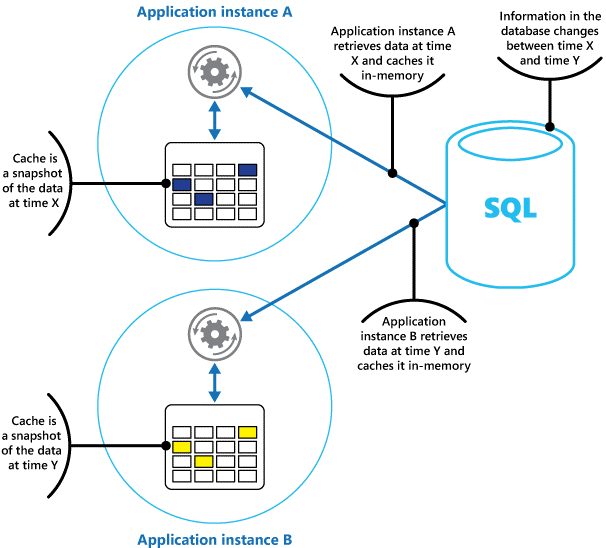
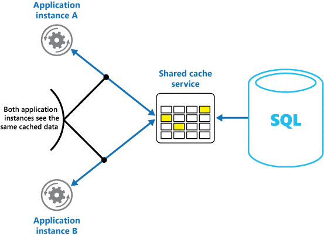
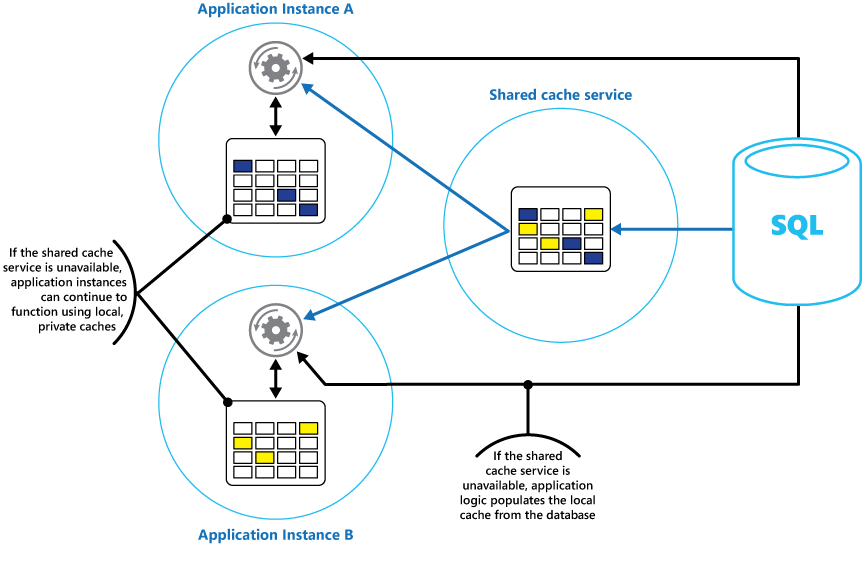

<!-- cSpell:ignore BSON keyspace INCRBY DECR DECRBY GETSET MGET MSET SADD SMEMBERS SDIFF SUNION ZADD LPUSH RPUSH LPOP RPOP LRANGE RRANGE -->

Caching is a common technique that aims to improve the performance and scalability of a system. It caches data by temporarily copying frequently accessed data to fast storage that's located close to the application. If this fast data storage is located closer to the application than the original source, then caching can significantly improve response times for client applications by serving data more quickly.

Caching is most effective when a client instance repeatedly reads the same data, especially if all the following conditions apply to the original data store:

- It remains relatively static.
- It's slow compared to the speed of the cache.
- It's subject to a high level of contention.
- It's far enough away from clients that network latency is significant.

## Caching in distributed applications

Distributed applications typically implement either or both of the following strategies when caching data:

- They use a private cache, where data is held locally on the computer that's running an instance of an application or service.
- They use a shared cache, serving as a common source that multiple processes and machines can access.

In both cases, caching can be performed client-side and server-side. Client-side caching is done by the process that provides the user interface for a system, such as a web browser or desktop application. Server-side caching is done by the process that provides the business services that are running remotely.

### Private caching

The most basic type of cache is an in-memory store. It's held in the address space of a single process and accessed directly by the code that runs in that process. This type of cache is quick to access. It can also provide an effective means for storing modest amounts of static data. The size of a cache is typically constrained by the amount of memory available on the machine that hosts the process.

If you need to cache more information than is physically possible in memory, you can write cached data to the local file system. This process is slower to access than data that's held in memory, but it should still be faster and more reliable than retrieving data across a network.

If you have multiple instances of an application that uses this model running concurrently, each application instance has its own independent cache holding its own copy of the data.

Think of a cache as a snapshot of the original data at some point in the past. If this data isn't static, it's likely that different application instances hold different versions of the data in their caches. Therefore, the same query performed by these instances can return different results, as shown in Figure 1.



*Figure 1: Using an in-memory cache in different instances of an application.*

### Shared caching

If you use a shared cache, it can help alleviate concerns that data might differ in each cache, which can occur with in-memory caching. Shared caching ensures that different application instances see the same view of cached data. It locates the cache in a separate location, which is typically hosted as part of a separate service, as shown in Figure 2.



*Figure 2: Using a shared cache.*

An important benefit of the shared caching approach is the scalability it provides. Many shared cache services are implemented by using a cluster of servers and use software to distribute the data across the cluster transparently. An application instance sends a request to the cache service. The underlying infrastructure determines the location of the cached data in the cluster. You can easily scale the cache by adding more servers.

There are two main disadvantages of the shared caching approach:

- The cache is slower to access because it's no longer held locally to each application instance.
- The requirement to implement a separate cache service might add complexity to the solution.

## Considerations for using caching

The following sections describe in more detail the considerations for designing and using a cache.

### Decide when to cache data

Caching can dramatically improve performance, scalability, and availability. The more data that you have and the larger the number of users that need to access this data, the greater the benefits of caching become. Caching reduces the latency and contention that are associated with handling large volumes of concurrent requests in the original data store.

For example, a database might support a limited number of concurrent connections. Retrieving data from a shared cache, however, rather than the underlying database, makes it possible for a client application to access this data even if the number of available connections is currently exhausted. Additionally, if the database becomes unavailable, client applications might be able to continue by using the data that's held in the cache.

Consider caching data that is read frequently but modified infrequently (for example, data that has a higher proportion of read operations than write operations). However, we don't recommend that you use the cache as the authoritative store of critical information. Instead, ensure that all changes that your application can't afford to lose are always saved to a persistent data store. If the cache is unavailable, your application can still continue to operate by using the data store, and you won't lose important information.

### Determine how to cache data effectively

The key to using a cache effectively lies in determining the most appropriate data to cache, and caching it at the appropriate time. The data can be added to the cache on demand the first time an application retrieves it. The application needs to fetch the data only once from the data store, and then subsequent access can be satisfied by using the cache.

Alternatively, a cache can be partially or fully populated with data in advance, typically when the application starts (an approach known as seeding). However, it might not be advisable to implement seeding for a large cache because this approach can impose a sudden, high load on the original data store when the application starts running.

Often an analysis of usage patterns can help you decide whether to fully or partially prepopulate a cache, and to choose the data to cache. For example, you can seed the cache with the static user profile data for customers who use the application regularly (perhaps every day), but not for customers who use the application only once a week.

Caching typically works well with data that's immutable or that changes infrequently. Examples include reference information such as product and pricing information in an e-commerce application, or shared static resources that are costly to construct. Some or all of this data can be loaded into the cache at application startup to minimize demand on resources and to improve performance. You might also want to have a background process that periodically updates the reference data in the cache to ensure it's up-to-date. Or, the background process can refresh the cache when the reference data changes.

Caching is less useful for dynamic data, although there are some exceptions to this consideration. For more information, see the [Cache highly dynamic data](#cache-highly-dynamic-data) section later in this article. When the original data changes regularly, either the cached information becomes stale quickly or the overhead of synchronizing the cache with the original data store reduces the effectiveness of caching.

A cache doesn't have to include the complete data for an entity. For example, if a data item represents a multivalued object, such as a bank customer with a name, address, and account balance, some of these elements might remain static, such as the name and address. Other elements, such as the account balance, might be more dynamic. In these situations, it can be useful to cache the static portions of the data and retrieve (or calculate) only the remaining information when it's required.

We recommend that you carry out performance testing and usage analysis to determine whether prepopulating or on-demand loading of the cache, or a combination of both, is appropriate. The decision should be based on the volatility and usage pattern of the data. Cache utilization and performance analysis are important in applications that encounter heavy loads and must be highly scalable. For example, in highly scalable scenarios you can seed the cache to reduce the load on the data store at peak times.

Caching can also be used to avoid repeating computations while the application is running. If an operation transforms data or performs a complicated calculation, it can save the results of the operation in the cache. If the same calculation is required afterward, the application can retrieve the results from the cache.

An application can modify data that's held in a cache. However, we recommend thinking of the cache as a transient data store that could disappear at any time. Don't store valuable data in the cache only; make sure that you maintain the information in the original data store as well. This means that if the cache becomes unavailable, you minimize the chance of losing data.

### Cache highly dynamic data

When you store rapidly changing information in a persistent data store, it can impose an overhead on the system. For example, consider a device that continually reports status or some other measurement. If an application chooses not to cache this data on the basis that the cached information is usually outdated, then the same consideration could be true when storing and retrieving this information from the data store. In the time it takes to save and fetch this data, it might change.

In a situation such as this, consider the benefits of storing the dynamic information directly in the cache instead of in the persistent data store. If the data is noncritical and doesn't require auditing, then it doesn't matter if the occasional change is lost.

### Manage data expiration in a cache

In most cases, data that's held in a cache is a copy of data that's held in the original data store. The data in the original data store might change after it was cached, causing the cached data to become stale. Many caching systems enable you to configure the cache to expire data and reduce the period for which data might be out of date.

Expired cached data is removed from the cache, and the application must retrieve the data from the original data store (it can put the newly fetched information back into cache). You can set a default expiration policy when you configure the cache. In many cache services, you can also stipulate the expiration period for individual objects when you store them programmatically in the cache. Some caches enable you to specify the expiration period as an absolute value, or as a sliding value that causes the item to be removed from the cache if it isn't accessed within the specified time. This setting overrides any cache-wide expiration policy, but only for the specified objects.

> [!NOTE]
> Consider the expiration period for the cache and the objects that it contains carefully. If you make it too short, objects expire too quickly and you reduce the benefits of using the cache. If you make the period too long, you risk the data becoming stale.

It's also possible that the cache might fill up if data is allowed to remain resident for a long time. In this case, any requests to add new items to the cache might cause some items to be forcibly removed in a process known as eviction. Cache services typically evict data on a least-recently-used (LRU) basis, but you can usually override this policy and prevent items from being evicted. However, if you adopt this approach, you risk exceeding the memory that's available in the cache. An application that attempts to add an item to the cache will fail with an exception.

Some caching implementations might provide other eviction policies. There are several types of eviction policies. These include:

- A most-recently-used policy (in the expectation that the data won't be required again).
- A first-in-first-out policy (oldest data is evicted first).
- An explicit removal policy based on a triggered event (such as the data being modified).

### Invalidate data in a client-side cache

Data that's held in a client-side cache is generally considered to be outside the auspices of the service that provides the data to the client. A service can't directly force a client to add or remove information from a client-side cache.

This means that it's possible for a client that uses a poorly configured cache to continue using outdated information. For example, if the expiration policies of the cache aren't properly implemented, a client might use outdated information that's cached locally when the information in the original data source changes.

If you build a web application that serves data over an HTTP connection, you can implicitly force a web client (such as a browser or web proxy) to fetch the most recent information. You can do this if a resource is updated by a change in the URI of that resource. Web clients typically use the URI of a resource as the key in the client-side cache, so if the URI changes, the web client ignores any previously cached versions of a resource and fetches the new version instead.

## Managing concurrency in a cache

Often, caches are designed to be shared by multiple instances of an application. Each application instance can read and modify data in the cache, so the same concurrency issues that arise with any shared data store also apply to a cache. In a situation where an application needs to modify data held in the cache, you might need to ensure that updates made by one instance of the application don't overwrite the changes made by another instance.

Depending on the nature of the data and the likelihood of collisions, you can adopt one of two approaches to concurrency:

- **Optimistic**. Before the application updates the data, it checks whether the data in the cache has changed since it was retrieved. If the data is still the same, the change can be made. Otherwise, the application has to decide whether to update it. (The business logic that drives this decision is application-specific.) This approach is suitable for situations where updates are infrequent, or where collisions are unlikely to occur.
- **Pessimistic**. When it retrieves the data, the application locks it in the cache to prevent another instance from changing it. This process ensures that collisions can't occur, but they can also block other instances that need to process the same data. Pessimistic concurrency can affect the scalability of a solution and is recommended only for short-lived operations. This approach might be appropriate for situations where collisions are more likely, especially if an application updates multiple items in the cache and must ensure that these changes are applied consistently.

### Implement high availability and scalability, and improve performance

Avoid using a cache as the primary repository of data; this is the role of the original data store from which the cache is populated. The original data store is responsible for ensuring the persistence of the data.

Be careful not to introduce critical dependencies on the availability of a shared cache service into your solutions. An application should be able to continue functioning if the service that provides the shared cache is unavailable. The application shouldn't become unresponsive or fail while waiting for the cache service to resume.

Therefore, the application must be prepared to detect the availability of the cache service and fall back to the original data store if the cache is inaccessible. The [Circuit-Breaker pattern](../patterns/circuit-breaker.md) is useful for handling this scenario. The service that provides the cache can be recovered, and once it becomes available, the cache can be repopulated as data is read from the original data store, following a strategy such as the [Cache-aside pattern](../patterns/cache-aside.yml).

However, system scalability might be affected if the application falls back to the original data store when the cache is temporarily unavailable. While the data store is being recovered, the original data store could be swamped with requests for data, resulting in timeouts and failed connections.

Consider implementing a local, private cache in each instance of an application, together with the shared cache that all application instances access. When the application retrieves an item, it can check first in its local cache, then in the shared cache, and finally in the original data store. The local cache can be populated using the data in either the shared cache, or in the database if the shared cache is unavailable.

This approach requires careful configuration to prevent the local cache from becoming too stale with respect to the shared cache. However, the local cache acts as a buffer if the shared cache is unreachable. Figure 3 shows this structure.



*Figure 3: Using a local private cache with a shared cache.*

To support large caches that hold relatively long-lived data, some cache services provide a high-availability option that implements automatic failover if the cache becomes unavailable. This approach typically involves replicating the cached data that's stored on a primary cache server to a secondary cache server, and switching to the secondary server if the primary server fails or connectivity is lost.

To reduce the latency that's associated with writing to multiple destinations, the replication to the secondary server might occur asynchronously when data is written to the cache on the primary server. This approach leads to the possibility that some cached information might be lost if there's a failure, but the proportion of this data should be small, compared to the overall size of the cache.

If a shared cache is large, it might be beneficial to partition the cached data across nodes to reduce the chances of contention and improve scalability. Many shared caches support the ability to dynamically add (and remove) nodes and rebalance the data across partitions. This approach might involve clustering, in which the collection of nodes is presented to client applications as a single cache. Internally, however, the data is dispersed between nodes following a predefined distribution strategy that balances the load evenly. For more information, see the [Sharding pattern](../patterns/sharding.md).

Clustering can also increase the availability of the cache. If a node fails, the remainder of the cache is still accessible. Clustering is frequently used with replication and failover. Each node can be replicated, and the replica can be quickly brought online if the node fails.

Many read and write operations are likely to involve single data values or objects. However, at times it might be necessary to store or retrieve large volumes of data quickly. For example, seeding a cache could involve writing hundreds or thousands of items to the cache. An application might also need to retrieve a large number of related items from the cache as part of the same request.

Many large-scale caches provide batch operations for these purposes. This enables a client application to package up a large volume of items into a single request and reduces the overhead that's associated with performing a large number of small requests.

## Caching and eventual consistency

For the cache-aside pattern to work, the instance of the application that populates the cache must have access to the most recent and consistent version of the data. In a system that implements eventual consistency (such as a replicated data store) this might not be the case.

One instance of an application could modify a data item and invalidate the cached version of that item. Another instance of the application might attempt to read this item from a cache, which causes a cache-miss, so it reads the data from the data store and adds it to the cache. However, if the data store isn't fully synchronized with the other replicas, the application instance could read and populate the cache with the old value.

A distributed cache introduces another layer to this problem. The CAP theorem states that a distributed system can provide at most two of three guarantees: consistency, availability, and partition tolerance. Because network partitions are unavoidable in cloud environments, you must choose between consistency and availability. Most distributed caches, including Redis, prioritize availability and partition tolerance over strong consistency. This means that reads from a cache replica might return stale data during a network partition or immediately after a write to a different node. When you design your caching strategy, decide how much staleness your application can tolerate and set TTLs accordingly. For data that must be current, use shorter TTLs or bypass the cache entirely and read from the source data store.

For more information about handling data consistency in distributed systems, see [Data considerations for microservices](../microservices/design/data-considerations.md).

### Protect cached data

Irrespective of the cache service you use, consider how to protect the data that's held in the cache from unauthorized access. There are two main concerns:

- The privacy of the data in the cache.
- The privacy of data as it flows between the cache and the application that's using the cache.

To protect data in the cache, the cache service might implement an authentication mechanism that requires that applications specify the following details:

- Which identities can access data in the cache.
- Which operations (read and write) that these identities are allowed to perform.

To reduce overhead that's associated with reading and writing data, after an identity is granted write or read access to the cache, that identity can use any data in the cache.

If you need to restrict access to subsets of the cached data, you can do one of the following approaches:

- Split the cache into partitions (by using different cache servers) and only grant access to identities for the partitions that they should be allowed to use.
- Encrypt the data in each subset by using different keys, and provide the encryption keys only to identities that should have access to each subset. A client application might still be able to retrieve all of the data in the cache, but it will only be able to decrypt the data for which it has the keys.

You must also protect the data as it flows in and out of the cache. To do this, you depend on the security features provided by the network infrastructure that client applications use to connect to the cache. If the cache is implemented using an on-site server within the same organization that hosts the client applications, then the isolation of the network itself might not require you to take more steps. If the cache is located remotely and requires a TCP or HTTP connection over a public network (such as the Internet), consider implementing SSL.

## Implement caching with Azure Managed Redis

The remaining sections of this article describe how to implement the caching patterns discussed above using [Azure Managed Redis](/azure/redis/overview). Azure Managed Redis is a managed Redis service that you can use as a shared cache across application instances. It supports key-value caching, data structures such as sets, sorted sets, and lists, and optional persistence for durability across restarts.

For information about available tiers, capacity planning, networking, and feature details, see the [Azure Managed Redis documentation](/azure/redis/overview).

### Connect and configure client applications

Redis supports client applications in many programming languages. For .NET applications, several client libraries are available, each suited for different Redis workloads. Choosing the appropriate library depends on whether Redis is being used strictly as a cache or as a multi-model data platform.

To connect to a Redis server, you use the static `Connect` method of the `ConnectionMultiplexer` class. The connection that this method creates is built for use throughout the lifetime of the client application. The same connection can be used by multiple concurrent threads. Don't reconnect and disconnect each time you perform a Redis operation because this can degrade performance.

For language-specific connection examples, see [Connect to Azure Managed Redis](/azure/redis/dotnet).

#### Choose a .NET client library

When you use Azure Managed Redis for caching, the recommended .NET libraries are:

- **StackExchange.Redis**: A low-level Redis client with high performance. Use it when you need direct access to Redis commands, atomic operations, transactions, pipelining, or Lua scripting.
- **Microsoft.Extensions.Caching.StackExchangeRedis**: Provides an `IDistributedCache` integration for ASP.NET Core. Use it for straightforward key-value caching where values are stored as opaque byte arrays. This abstraction does not expose advanced Redis data structures.

These libraries provide the primitives required to build common caching patterns, but the application must implement the caching logic itself.

### Implement caching patterns

The simplest way to use Redis for caching is to store values under keys using the key-value model. Values may be strings or binary data of arbitrary length, making Redis well suited for caching serialized objects, configuration data, session state, or precomputed results.

Design your keyspace carefully and use meaningful (but not verbose) keys. For example, use structured keys like `customer:100` (instead of just `100`) to represent the key for the customer with ID 100. This scheme enables you to distinguish between values that store different data types. For example, you can also use the key `orders:100` to represent the key for the order with ID 100.

While strings are the most common caching approach, Redis supports a rich set of native data types such as hashes, lists, sets, sorted sets, and streams, enabling more flexible caching patterns. For more information about Redis data types, see the Redis documentation on [data types](https://redis.io/docs/latest/develop/data-types/).

#### Implement the cache-aside pattern

As described in [Determine how to cache data effectively](#determine-how-to-cache-data-effectively), a common approach is to load data into the cache on demand. The following example checks the cache first, fetches from the data source on a miss, and stores the result for subsequent requests:

```csharp
var config = new ConfigurationOptions();
// ... configure endpoint, credentials, SSL, etc.
ConnectionMultiplexer redisHostConnection = ConnectionMultiplexer.Connect(config);
IDatabase db = redisHostConnection.GetDatabase();

async Task<string> RetrieveItemAsync(string itemKey)
{
    // Attempt to retrieve the item from the Redis cache
    string itemValue = await db.StringGetAsync(itemKey);

    // If the value returned is null, the item was not found in the cache
    // So retrieve the item from the data source and add it to the cache
    if (itemValue is null)
    {
        itemValue = await GetItemFromDataSourceAsync(itemKey);
        await db.StringSetAsync(itemKey, itemValue);
    }

    return itemValue;
}
```

#### Perform atomic and batch operations

When multiple clients or application instances share a cache, you need to prevent concurrent updates from corrupting data. The general concurrency strategies are described in [Managing concurrency in a cache](#managing-concurrency-in-a-cache) earlier in this article. Redis provides several mechanisms that implement those strategies.

**Atomic single-key operations.** Commands such as `INCR`, `INCRBY`, `DECR`, `DECRBY`, and `GETSET` update a value in a single step, eliminating race conditions that occur when `GET` and `SET` are issued separately. Examples:

- `INCR`, `INCRBY`, `DECR`, `DECRBY` atomically increment or decrement a numeric value. In StackExchange.Redis, use `IDatabase.StringIncrementAsync` and `IDatabase.StringDecrementAsync`. These are useful for counters, rate limiters, and quota tracking where multiple clients update the same key concurrently.

- `GETSET`, which atomically sets a key to a new value and returns the previous value. In StackExchange.Redis, use `IDatabase.StringGetSetAsync`:

  ```csharp
  string oldValue = await cache.StringGetSetAsync("data:counter", 0);
  ```

**Multi-key operations.** `MGET` and `MSET` read or write multiple string values in a single round-trip, reducing network overhead when you need to work with several keys at once. The `IDatabase.StringGetAsync` and `IDatabase.StringSetAsync` methods are overloaded to support this functionality:

  ```csharp
  // Create a list of key-value pairs
  var keysAndValues =
      new KeyValuePair<RedisKey, RedisValue>[]
      {
          new("data:key1", "value1"),
          new("data:key99", "value2"),
          new("data:key322", "value3")
      };

  // Store the list of key-value pairs in the cache
  await cache.StringSetAsync(keysAndValues);
  ...
  // Find all values that match a list of keys
  RedisKey[] keys = ["data:key1", "data:key99", "data:key322"];
  // values should contain { "value1", "value2", "value3" }
  RedisValue[] values = await cache.StringGetAsync(keys);
  ```

**Transactions (optimistic concurrency).** You can use the `WATCH` command to monitor one or more keys before starting a transaction with `MULTI`/`EXEC`. If any watched key changes before the transaction starts, Redis discards the transaction and the client can retry. The StackExchange library provides support for transactions through the `ITransaction` interface.

You create an `ITransaction` object by using the `IDatabase.CreateTransaction` method. You invoke commands to the transaction by using the methods provided by the `ITransaction` object.

The `ITransaction` interface provides access to a set of methods that's similar to those accessed by the `IDatabase` interface, except that all the methods are asynchronous. This means that they're only performed when the `ITransaction.Execute` method is invoked. The value that's returned by the `ITransaction.Execute` method indicates whether the transaction was created successfully (true) or if it failed (false).

The following code snippet shows an example that increments and decrements two counters as part of the same transaction:

```csharp
ITransaction transaction = cache.CreateTransaction();

var tx1 = transaction.StringIncrementAsync("data:counter1");
var tx2 = transaction.StringDecrementAsync("data:counter2");

bool result = await transaction.ExecuteAsync();

Console.WriteLine($"Transaction {(result ? "succeeded" : "failed")}");

if (result)
{
    long increment = await tx1;
    long decrement = await tx2;

    Console.WriteLine($"Result of increment: {increment}");
    Console.WriteLine($"Result of decrement: {decrement}");
}
```

Redis transactions are unlike transactions in relational databases. The `Execute` method queues all the commands that comprise the transaction to run, and if any command isn't valid, then the transaction stops. If all the commands have been queued successfully, each command runs asynchronously. If any command fails, the others still continue processing. If you need to verify that a command completed successfully, fetch the results by using the **Result** property of the corresponding task, as shown in the previous example.

**Lua scripting.** For multi-step updates that must be atomic across multiple keys, you can execute a Lua script on the server. Redis runs the entire script as a single operation without interleaving other commands.

> [!NOTE]
> In clustered deployments, all keys involved in a transaction or Lua script must reside in the same hash slot. Use hash tags (for example, `customer:{123}:name` and `customer:{123}:email`) to colocate related keys.

#### Perform fire and forget cache operations

When a cache update doesn't affect application correctness, such as incrementing a view counter or refreshing a non-critical statistic, you can skip waiting for the server's response. Redis supports fire-and-forget operations through command flags, which reduce round-trip latency for the client:

```csharp
await cache.StringSetAsync("data:key1", 99);
...
cache.StringIncrement("data:key1", flags: CommandFlags.FireAndForget);
```

#### Specify automatically expiring keys

The expiration strategies described in [Manage data expiration in a cache](#manage-data-expiration-in-a-cache) are implemented in Redis through per-key TTLs. When you store an item in a Redis cache, you can specify a timeout after which the item is automatically removed. You can also query how much time a key has before it expires by using the `TTL` command. This command is available to StackExchange applications by using the `IDatabase.KeyTimeToLive` method.

The following code snippet shows how to set an expiration time of 20 seconds on a key, and query the remaining lifetime of the key:

```csharp
// Add a key with an expiration time of 20 seconds
await cache.StringSetAsync("data:key1", 99, TimeSpan.FromSeconds(20));
...
// Query how much time a key has left to live
// If the key has already expired, the KeyTimeToLive function returns null
TimeSpan? expiry = cache.KeyTimeToLive("data:key1");
```

You can also set the expiration to a specific date and time by using the `EXPIREAT` command, which is available in the StackExchange library as the `KeyExpireAsync` method with a `DateTime` parameter:

```csharp
await cache.StringSetAsync("data:key1", 99);
await cache.KeyExpireAsync("data:key1",
    new DateTime(2026, 6, 1, 0, 0, 0, DateTimeKind.Utc));
```

> [!TIP]
> You can manually remove an item from the cache by using the DEL command, which is available through the StackExchange library as the `IDatabase.KeyDeleteAsync` method.

When Redis reaches its memory limit, it evicts keys according to a configured eviction policy. The default policy is `volatile-lru`, which evicts the least recently used key that has a TTL set. Other policies include `allkeys-lru`, `volatile-random`, and `noeviction` (which causes write operations to fail when memory is full). Choose an eviction policy based on whether your application uses TTLs consistently and whether you prefer to protect keys that have no expiration. For more information, see [Memory management](/azure/redis/best-practices-memory-management).

#### Cross-correlate cached items

When you cache related items, you often need to find them by relationship rather than by primary key alone. For example, you might cache blog posts and need to answer queries like "which posts share tag Y?" or "which tags belong to post X?"

In Azure Managed Redis, the recommended approach is to use [RedisJSON and RediSearch](/azure/redis/overview#modules). Store each cached item as a JSON document with its metadata, then create a RediSearch index over the fields you need to query. RediSearch handles reverse lookups, tag-based filtering, range queries, and full-text search without requiring your application to maintain separate index structures.

For simpler scenarios, you can also use Redis Sets to build forward and reverse indexes manually. Store a Set per post (containing its tags) and a Set per tag (containing the post IDs):

```csharp
foreach (BlogPost post in posts)
{
    string postTagsKey = $"blog:posts:{post.Id}:tags";
    await cache.SetAddAsync(
        postTagsKey, post.Tags.Select(s => (RedisValue)s).ToArray());

    foreach (var tag in post.Tags)
    {
        await cache.SetAddAsync($"tag:{tag}:blog:posts", post.Id);
    }
}
```

You can then query tags for a post with `SetMembersAsync`, find common tags across posts with `SetCombineAsync(SetOperation.Intersect, ...)`, or find all posts for a given tag. The tradeoff is that your application must maintain both the forward and reverse Sets, which adds complexity as the number of relationships grows.

#### Find recently accessed items

Many applications need to track the most recently accessed or viewed items. For example, a blogging site might display the most recently read posts to a returning visitor. Redis Lists provide an efficient way to implement recency-based caching patterns. Items can be pushed to either end of the list using `LPUSH` or `RPUSH`, and removed using `LPOP` or `RPOP`. Use `LTRIM` to cap the list length and prevent unbounded memory growth.

#### Implement a leaderboard

Redis Sorted Sets (ZSETs) maintain ordered rankings by associating each element with a numeric score. Redis keeps the ordering automatically. `ZADD` is O(log N), and range queries such as `ZRANGE` and `ZREVRANGE` are O(log N + M) where M is the number of elements returned, so sorted sets remain efficient even with large item counts.

##### Add items to a leaderboard

The following example demonstrates how to add a blog post and its score to a leaderboard using the `ZADD` command via `SortedSetAddAsync`:

```csharp
var db = connection.GetDatabase();
string redisKey = "blog:post_rankings";

BlogPost blogPost = ...; // The blog post being ranked

await db.SortedSetAddAsync(redisKey, blogPost.Title, blogPost.Score);
```

##### Retrieve ranked items

You can retrieve items in ascending score order using `SortedSetRangeByRankWithScoresAsync`:

```csharp
var entries = await db.SortedSetRangeByRankWithScoresAsync(redisKey);

foreach (var entry in entries)
{
    Console.WriteLine($"{entry.Element}: {entry.Score}");
}
```

> [!NOTE]
> `SortedSetRangeByRankAsync` returns only member values, not scores.

##### Retrieve top-N items

To get the highest-scoring items, such as the top 10 posts, use descending order:

```csharp
foreach (var post in await cache.SortedSetRangeByRankWithScoresAsync(
                               redisKey, 0, 9, Order.Descending))
{
    Console.WriteLine(post);
}
```

##### Retrieve items by score range

You can also query items based on score boundaries rather than rank:

```csharp
foreach (var post in await cache.SortedSetRangeByScoreWithScoresAsync(
                               redisKey, 5000, 100000))
{
    Console.WriteLine(post);
}
```

To prevent a leaderboard from growing indefinitely, remove old entries using `SortedSetRemoveRangeByRankAsync` or use time-scoped keys (for example, daily or weekly leaderboards). You can update scores atomically using `SortedSetIncrementAsync` (`ZINCRBY`).

### Caching session state and HTML output

Azure Managed Redis can be used to store session state and output cache data for ASP.NET Core and ASP.NET applications. By keeping session data and rendered output in a shared Redis-based cache, applications running across multiple instances, such as in Azure App Service, Azure Kubernetes Service (AKS), Azure Container Apps, or virtual machine scale sets, can maintain consistent user experiences without requiring server affinity.

> [!TIP]
> For best performance, deploy your application and Azure Managed Redis instance in the same Azure region.

#### ASP.NET Core

ASP.NET Core applications use the `IDistributedCache` abstraction and session middleware. Azure Managed Redis integrates with `IDistributedCache` through the `Microsoft.Extensions.Caching.StackExchangeRedis` package.

```csharp
builder.Services.AddStackExchangeRedisCache(options =>
{
    options.Configuration = "<your-cache-name>.<region>.redis.azure.net:10000";
    options.InstanceName = "app-cache:";
});

builder.Services.AddSession();
```

ASP.NET Core output caching middleware can also use Redis as a distributed backing store, enabling applications to share rendered fragments or pages across all instances. For more information, see [ASP.NET Core output cache provider for Redis](/azure/redis/aspnet-core-output-cache-provider).

#### .NET Aspire integration

[.NET Aspire](https://aspire.dev/get-started/what-is-aspire/) applications can use the `Aspire.Hosting.Azure.Redis` package to declare an Azure Managed Redis resource in the app host. Consuming projects receive the connection configuration automatically through dependency injection, which eliminates manual connection-string management across services.

```csharp
// App host: declare the Azure Managed Redis resource
var cache = builder.AddAzureManagedRedis("cache");

builder.AddProject<Projects.ProductService>()
    .WithReference(cache);
```

Consuming services register the distributed cache in the same way as any other `IDistributedCache` provider. For more information, see [Get started with Redis integration](https://aspire.dev/integrations/caching/redis/).

### High availability, scalability, and partitioning

Each Azure Managed Redis instance uses primary/replica replication. The service monitors node health and automatically promotes a replica if the primary fails. Because replication is asynchronous, a small amount of recently written data can be lost during an unexpected failover. For the general strategies behind replication, failover, and layered caching, see [Implement high availability and scalability, and improve performance](#implement-high-availability-and-scalability-and-improve-performance) earlier in this article.

You can combine a local in-memory cache with Azure Managed Redis to reduce latency and provide a fallback if the shared cache is temporarily unreachable. The [Circuit-Breaker pattern](../patterns/circuit-breaker.md) and [Cache-aside pattern](../patterns/cache-aside.yml) help manage this layered approach.

For workloads that exceed the capacity of a single node, Azure Managed Redis supports partitioning (sharding) data across multiple Redis nodes. With both clustering policies, data is automatically sharded across nodes with key-to-shard hashing, automatic failover and resynchronization, and online resharding (scale-out and scale-in). Azure Managed Redis supports two clustering policies:

- **OSS Clustering Policy (default):** Clients communicate directly with the appropriate shard and follow OSS Redis Cluster semantics, including MOVED and ASK redirections. Cluster-aware clients such as StackExchange.Redis handle these redirects automatically. This policy provides the lowest routing overhead.

- **Redis Enterprise Clustering Policy:** A proxy provides transparent routing through a single endpoint. Clients do not need to implement cluster-aware logic or handle MOVED/ASK responses. This policy offers simpler client integration but introduces a small routing overhead.

Azure Managed Redis also supports *non-clustered mode*, which uses a single primary/replica pair with no sharding. This mode is suitable for smaller workloads that do not require horizontal scale-out.

> [!NOTE]
> Custom partitioning models (such as client-side hashing or third-party proxies) are typically only needed in self-managed Redis deployments on VMs or Kubernetes. Azure Managed Redis clustering handles routing, failover, and resharding automatically.

#### Active geo-replication

For multi-region availability, Azure Managed Redis supports active geo-replication, which links instances across Azure regions into a single replication group. Each instance can handle reads and writes, and changes sync automatically. Your application is responsible for redirecting traffic to a healthy instance during a regional failure. For more information, see [Active geo-replication](/azure/redis/how-to-active-geo-replication).

#### Data persistence

By default, cached data in Azure Managed Redis is held in memory and can be lost if a node restarts or fails over. For workloads where rebuilding the cache from the source data store would be slow or expensive, Azure Managed Redis supports optional data persistence:

- **RDB snapshots** create periodic point-in-time snapshots saved to a managed disk. RDB has minimal performance impact during normal operations, but data written since the last snapshot can be lost.
- **AOF (Append-Only File)** logs every write operation to disk. AOF reduces potential data loss to approximately one second of writes, but produces larger files and can reduce write throughput.

You can enable both RDB and AOF together. Redis loads the RDB snapshot on startup and then replays the AOF log for near-complete recovery.

> [!IMPORTANT]
> Persistence improves durability against node failures, but it is not a backup or disaster recovery mechanism. For critical data, always maintain the authoritative copy in your source data store and use the [cache-aside pattern](../patterns/cache-aside.yml) to repopulate the cache.

For configuration details, see [Configure data persistence](/azure/redis/how-to-persistence).

### Protect cached data in Azure Managed Redis

The guidance in [Protect cached data](#protect-cached-data) describes access control and data-in-transit concerns. Azure Managed Redis addresses these:

- Use [Microsoft Entra ID authentication](/azure/redis/entra-for-authentication) as the primary access control mechanism, and follow the principle of least privilege when granting access.
- Use [Private Endpoints](/azure/redis/private-link) to restrict network access so that traffic doesn't traverse the public internet.
- Azure Managed Redis encrypts data in transit with TLS and encrypts data at rest.

### Serialization considerations

When you store .NET objects in Redis as string values, you need to serialize them. When you choose a serialization format, consider tradeoffs between performance, interoperability, versioning, and payload size. There's no single fastest serializer for all scenarios. Benchmarks are highly dependent on context and might not reflect your actual workload.

If your Azure Managed Redis tier supports [RedisJSON](/azure/redis/overview#modules), you can store objects as native JSON documents and query individual fields without deserializing the entire value:

```csharp
public static class RedisJsonExtensions
{
    public static async Task<T?> GetAsync<T>(
        this IDatabase cache,
        string key,
        string path = "$")
    {
        var result = await cache.ExecuteAsync("JSON.GET", key, path);

        if (result.IsNull)
            return default;

        return JsonSerializer.Deserialize<T>(result!);
    }

    public static async Task SetAsync<T>(
        this IDatabase cache,
        string key,
        T value,
        TimeSpan? expiry = null,
        string path = "$")
    {
        var json = JsonSerializer.Serialize(value);

        // Store JSON document
        await cache.ExecuteAsync("JSON.SET", key, path, json);

        // Apply TTL if provided
        if (expiry.HasValue)
        {
            await cache.KeyExpireAsync(key, expiry);
        }
    }

    public static async Task<bool> ExpireAsync(
        this IDatabase cache,
        string key,
        TimeSpan expiry)
    {
        return await cache.KeyExpireAsync(key, expiry);
    }
}
```

When you serialize values as Redis strings instead, common format options include:

- [JSON](https://json.org) - Human-readable, broad cross-platform support. Not the most compact format, but a good choice when cached items are returned directly to HTTP clients because it avoids an extra deserialization and re-serialization step.

- [MessagePack](https://msgpack.org) - A compact binary format with no schema requirement. Produces smaller payloads than JSON with lower serialization overhead.

- [Protocol Buffers](https://protobuf.dev) (protobuf) - A schema-based binary format that produces compact payloads. Requires `.proto` definition files and a compilation step to generate language-specific code.

- [BSON](https://bsonspec.org) - A binary format that extends JSON with additional types such as dates and raw binary data. Payloads are comparable in size to JSON. A practical choice when your application already uses BSON elsewhere, such as with MongoDB.

## Next steps

- [Azure Managed Redis documentation](/azure/redis/)
- [Azure Managed Redis FAQ](/azure/redis/faq)
- [Redis documentation](https://redis.io/docs/latest)
- [StackExchange.Redis](https://stackexchange.github.io/StackExchange.Redis)

## Related resources

The following patterns might also be relevant to your scenario when you implement caching in your applications:

- [Cache-aside pattern](../patterns/cache-aside.yml): This pattern describes how to load data on demand into a cache from a data store. This pattern also helps to maintain consistency between data that's held in the cache and the data in the original data store.

- The [Sharding pattern](../patterns/sharding.md) provides information about implementing horizontal partitioning to help improve scalability when storing and accessing large volumes of data.
