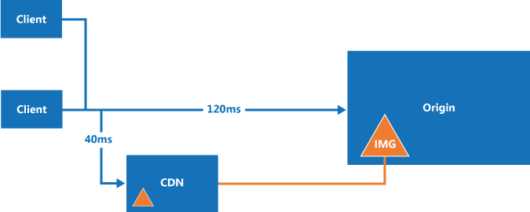

<!-- cSpell:ignore CDNs -->

A content delivery network (CDN) is a distributed network of servers that can efficiently deliver web content to users. CDNs store cached content on edge servers that are close to end users to minimize latency.

CDNs are typically used to deliver static content such as images, style sheets, documents, client-side scripts, and HTML pages. The major advantages of using a CDN are lower latency and faster delivery of content to users, regardless of their geographical location in relation to the datacenter where the application is hosted. CDNs can also help to reduce load on a web application, because the application doesn't have to service requests for the content that is hosted in the CDN.

In Azure, [Azure Front Door](/azure/frontdoor/front-door-overview) is the global CDN solution for delivering high-bandwidth content that's hosted in Azure or any other location. You can configure the Azure Front Door Standard and Premium tiers to cache content at the network edge. You can cache objects that are loaded from Azure Blob Storage, a web application, a virtual machine, or even any publicly accessible web server.

This article describes some general best practices and considerations for when you use a CDN. For more information, see the [Caching with Azure Front Door](/azure/frontdoor/front-door-caching) documentation.

## How and why a CDN is used

Typical uses for a CDN include:

- Delivering static resources for client applications, often from a website. These resources can be images, style sheets, documents, files, client-side scripts, HTML pages, HTML fragments, or any other content that the server doesn't need to modify for each request. The application can create items at runtime and make them available to the CDN (for example, by creating a list of current news headlines), but it doesn't do so for each request.

- Delivering public static and shared content to devices such as mobile phones and tablet computers. The application itself is a web service that offers an API to clients running on the various devices. The CDN can also deliver static datasets (via the web service) for the clients to use, perhaps to generate the client UI. For example, the CDN could be used to distribute JSON or XML documents.

- Serving entire websites that consist of only public static content to clients, without requiring any dedicated compute resources.

- Streaming video files to the client on demand. Video benefits from the low latency and reliable connectivity available from the globally located datacenters that offer CDN connections.

- Generally improving the experience for users, especially those located far from the datacenter hosting the application. These users might otherwise experience higher latency. A large proportion of the total size of the content in a web application is often static, and using the CDN can help to maintain performance and overall user experience while eliminating the requirement to deploy the application to multiple datacenters. For a list of Azure Front Door edge locations, see [Azure Front Door POP locations by region](/azure/frontdoor/edge-locations-by-region).

- Supporting IoT (Internet of Things) solutions. The huge numbers of devices and appliances involved in an IoT solution could easily overwhelm an application if it had to distribute firmware updates directly to each device.

- Coping with peaks and surges in demand without requiring the application to scale, avoiding the consequent increase in running costs. For example, when an update to an operating system is released for a hardware device such as a specific model of router, or for a consumer device such as a smart TV, there's a huge peak in demand as it is downloaded by millions of users and devices over a short period.

## Challenges

There are several challenges to take into account when planning to use a CDN.

- **Deployment**. Decide the origin from which the CDN fetches the content, and whether you need to deploy the content in more than one storage system. Consider the process for deploying static content and resources. For example, you might need to implement a separate step to load content into Azure Blob Storage.

- **Versioning and cache-control**. Consider how you update static content and deploy new versions. Understand how the CDN performs caching and time-to-live (TTL). For Azure Front Door, see [Caching with Azure Front Door](/azure/frontdoor/front-door-caching).

- **Testing**. It can be difficult to perform local testing of your CDN settings when developing and testing an application locally or in a staging environment.

- **Search engine optimization (SEO)**. Content such as images and documents are served from a different domain when you use the CDN. This can have an effect on SEO for this content.

- **Content security**. Not all CDNs provide identity-based access control for content. Azure Front Door's WAF protects applications from common exploits, and origin security prevents traffic from bypassing Front Door. These features don't replace application-level authorization for private content. For more information, see [Web Application Firewall on Azure Front Door](/azure/web-application-firewall/afds/afds-overview) and [Secure traffic to Azure Front Door origins](/azure/frontdoor/origin-security).

- **Client security**. Clients might connect from an environment that doesn't allow access to resources on the CDN. This could be a security-constrained environment that limits access to only a set of known sources, or one that prevents loading of resources from anything other than the page origin. A fallback implementation is required to handle these cases.

- **Resilience**. The CDN is a potential single point of failure for an application.

Scenarios where a CDN might be less useful include:

- If the content has a low hit rate, it might be accessed only few times while it's valid (determined by its time-to-live setting).

- If the data is private, such as for large enterprises or supply chain ecosystems.

## General guidelines and good practices

Using a CDN is a good way to minimize the load on your application, and maximize availability and performance. Consider adopting this strategy for all of the appropriate content and resources your application uses. Consider the points in the following sections when designing your strategy to use a CDN.

### Deployment

Static content might need to be provisioned and deployed independently from the application if you don't include it in the application deployment package or process. Consider how this affects the versioning approach you use to manage both the application components and the static resource content.

Consider using bundling and minification techniques to reduce load times for clients. Bundling combines multiple files into a single file. Minification removes unnecessary characters from scripts and CSS files without altering functionality.

If you need to deploy the content to another location, this is an extra step in the deployment process. If the application updates the content for the CDN, perhaps at regular intervals or in response to an event, it must store the updated content in any other locations as well as the endpoint for the CDN.

Consider how you handle local development and testing when some static content is expected to be served from a CDN. For example, you could predeploy the content to the CDN as part of your build script. Alternatively, use compile directives or flags to control how the application loads the resources. For example, in debug mode, the application could load static resources from a local folder. In release mode, the application would use the CDN.

Consider the options for file compression, such as gzip (GNU zip). Compression can be performed on the origin server by the web application hosting or directly on the edge servers by the CDN. For more information, see [Improve performance by compressing files in Azure Front Door](/azure/frontdoor/standard-premium/how-to-compression).

### Routing and versioning

You might need to serve different versions of your content at various times. For example, when you deploy a new version of the application, you might want to serve new content and retain the old content (in an older format) for previous versions. If you use Azure Blob Storage as the content origin, you can store each version in a separate blob storage container. An Azure Front Door origin identifies a storage account host, not an individual container. To serve content from a different storage account, point the origin to it. To serve content from a different container in the same account, set the route's origin path or add a URL rewrite rule that targets the container.

Deploying new versions of static content when you update an application can be a challenge if the previous resources are cached on the CDN. For more information, see the following section on cache control.

Consider restricting CDN content access by country or region. Azure Front Door uses the WAF to filter requests based on the country or region that a request comes from and restrict the content that it delivers. For more information, see [Geo-filtering on a domain for Azure Front Door](/azure/web-application-firewall/afds/waf-front-door-geo-filtering).

### Cache control

Consider how to manage caching within the system. For example, in Azure Front Door, you can set caching rules in the rules engine and apply custom caching behavior to specific routes. You can also control how caching is performed in a CDN by sending cache-directive headers at the origin.

For more information, see [Caching with Azure Front Door](/azure/frontdoor/front-door-caching).

To prevent objects from being available on the CDN, you can delete them from the origin, remove or delete the CDN endpoint, or for blob storage, make the container or blob private. However, items aren't removed from the CDN until the time to live expires. You can also manually purge a CDN endpoint.

### Security

Azure Front Door can deliver content over HTTPS by using a Microsoft-managed TLS certificate or your own certificate. To avoid browser warnings about mixed content, use HTTPS to request static content that appears in pages loaded through HTTPS. For more information, see [End-to-end TLS with Azure Front Door](/azure/frontdoor/end-to-end-tls).

If you deliver static assets such as font files by using the CDN, you might encounter same-origin policy issues if you use an *XMLHttpRequest* call to request these resources from a different domain. Many web browsers prevent cross-origin resource sharing (CORS) unless the web server is configured to set the appropriate response headers. You can configure the CDN to support CORS by using one of the following methods:

- Configure the CDN to add CORS headers to the responses. For more information, see [Set up CORS with Azure Front Door](/azure/frontdoor/cross-origin-resource-sharing).

- If the origin is Azure Blob Storage, add CORS rules to the storage endpoint. For more information, see [Cross-Origin Resource Sharing (CORS) Support for the Azure Storage Services](/rest/api/storageservices/Cross-Origin-Resource-Sharing--CORS--Support-for-the-Azure-Storage-Services).

- Configure the application to set the CORS headers. For example, see [Enabling Cross-Origin Requests (CORS)](/aspnet/core/security/cors) in the ASP.NET Core documentation.

### CDN fallback

Consider how your application copes with a failure or temporary unavailability of the CDN. Client applications might be able to use copies of the resources that were cached locally (on the client) during previous requests, or you can include code that detects failure and instead requests resources from the origin (the application folder or Azure Blob Storage container that holds the resources) if the CDN is unavailable.
