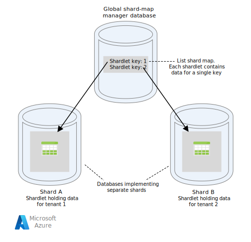
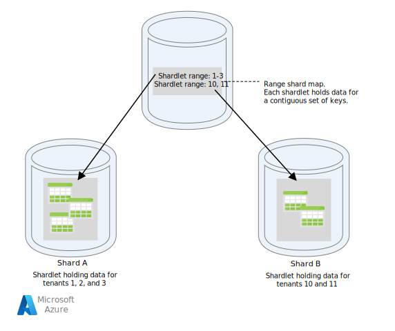

<!-- cSpell:ignore shardlet shardlets MGET MSET -->

This article describes some strategies for partitioning data in various Azure data stores. For general guidance about when to partition data and best practices, see [Data partitioning](./data-partitioning.yml).

## Partitioning Azure SQL Database

A single SQL database has a limit to the volume of data that it can contain. Throughput is constrained by architectural factors and the number of concurrent connections that it supports.

[Elastic pools](/azure/sql-database/sql-database-elastic-pool) support horizontal scaling for a SQL database. Using elastic pools, you can partition your data into shards that are spread across multiple SQL databases. You can also add or remove shards as the volume of data that you need to handle grows and shrinks. Elastic pools can also help reduce contention by distributing the load across databases.

Each shard is implemented as a SQL database. A shard can hold more than one dataset (called a *shardlet*). Each database maintains metadata that describes the shardlets that it contains. A shardlet can be a single data item, or a group of items that share the same shardlet key. For example, in a multitenant application, the shardlet key can be the tenant ID, and all data for a tenant can be held in the same shardlet.

Client applications are responsible for associating a dataset with a shardlet key. A separate SQL database acts as a global shard map manager. This database has a list of all the shards and shardlets in the system. The application connects to the shard map manager database to obtain a copy of the shard map. It caches the shard map locally, and uses the map to route data requests to the appropriate shard. This functionality is hidden behind a series of APIs that are contained in the [Elastic Database client library](/azure/sql-database/sql-database-elastic-database-client-library), which is available for Java and .NET.

For more information about elastic pools, see [Scaling out with Azure SQL Database](/azure/sql-database/sql-database-elastic-scale-introduction).

To reduce latency and improve availability, you can replicate the global shard map manager database. With the Premium pricing tiers, you can configure active geo-replication to continuously copy data to databases in different regions.

Alternatively, use [Azure SQL Data Sync](/azure/sql-database/sql-database-sync-data) or [Azure Data Factory](/azure/data-factory) to replicate the shard map manager database across regions. This form of replication runs periodically and is more suitable if the shard map changes infrequently, and does not require Premium tier.

Elastic Database provides two schemes for mapping data to shardlets and storing them in shards:

- A **list shard map** associates a single key to a shardlet. For example, in a multitenant system, the data for each tenant can be associated with a unique key and stored in its own shardlet. To guarantee isolation, each shardlet can be held within its own shard.

    

    *Download a [Visio file](https://arch-center.azureedge.net/data-partitioning-strategies.vsdx) of this diagram.*

- A **range shard map** associates a set of contiguous key values to a shardlet. For example, you can group the data for a set of tenants (each with their own key) within the same shardlet. This scheme is less expensive than the first, because tenants share data storage, but has less isolation.

    

    *Download a [Visio file](https://arch-center.azureedge.net/data-partitioning-strategies.vsdx) of this diagram*

A single shard can contain the data for several shardlets. For example, you can use list shardlets to store data for different non-contiguous tenants in the same shard. You can also mix range shardlets and list shardlets in the same shard, although they will be addressed through different maps. The following diagram shows this approach:

*Download a [Visio file](https://arch-center.azureedge.net/data-partitioning-strategies.vsdx) of this diagram.*

Elastic pools make it possible to add and remove shards as the volume of data shrinks and grows. Client applications can create and delete shards dynamically, and transparently update the shard map manager. However, removing a shard is a destructive operation that also requires deleting all the data in that shard.

If an application needs to split a shard into two separate shards or combine shards, use the [split-merge tool](/azure/sql-database/sql-database-elastic-scale-overview-split-and-merge). This tool runs as an Azure web service, and migrates data safely between shards.

The partitioning scheme can significantly affect the performance of your system. It can also affect the rate at which shards have to be added or removed, or that data must be repartitioned across shards. Consider the following points:

- Group data that is used together in the same shard, and avoid operations that access data from multiple shards. A shard is a SQL database in its own right, and cross-database joins must be performed on the client side.

    Although SQL Database does not support cross-database joins, you can use the Elastic Database tools to perform [multi-shard queries](/azure/sql-database/sql-database-elastic-scale-multishard-querying). A multi-shard query sends individual queries to each database and merges the results.

- Don't design a system that has dependencies between shards. Referential integrity constraints, triggers, and stored procedures in one database cannot reference objects in another.

- If you have reference data that is frequently used by queries, consider replicating this data across shards. This approach can remove the need to join data across databases. Ideally, such data should be static or slow-moving, to minimize the replication effort and reduce the chances of it becoming stale.

- Shardlets that belong to the same shard map should have the same schema. This rule is not enforced by SQL Database, but data management and querying becomes very complex if each shardlet has a different schema. Instead, create separate shard maps for each schema. Remember that data belonging to different shardlets can be stored in the same shard.

- Transactional operations are only supported for data within a shard, and not across shards. Transactions can span shardlets as long as they are part of the same shard. Therefore, if your business logic needs to perform transactions, either store the data in the same shard or implement eventual consistency.

- Place shards close to the users that access the data in those shards. This strategy helps reduce latency.

- Avoid having a mixture of highly active and relatively inactive shards. Try to spread the load evenly across shards. This might require hashing the sharding keys. If you are geo-locating shards, make sure that the hashed keys map to shardlets held in shards stored close to the users that access that data.

## Partitioning Azure Table storage

Azure Table storage is a key-value store that's designed around partitioning. All entities are stored in a partition, and partitions are managed internally by Azure Table storage. Each entity stored in a table must provide a two-part key that includes:

- **The partition key**. This is a string value that determines the partition where Azure Table storage will place the entity. All entities with the same partition key are stored in the same partition.

- **The row key**. This is a string value that identifies the entity within the partition. All entities within a partition are sorted lexically, in ascending order, by this key. The partition key/row key combination must be unique for each entity and cannot exceed 1 KB in length.

If an entity is added to a table with a previously unused partition key, Azure Table storage creates a new partition for this entity. Other entities with the same partition key will be stored in the same partition.

This mechanism effectively implements an automatic scale-out strategy. Each partition is stored on the same server in an Azure datacenter to help ensure that queries that retrieve data from a single partition run quickly.

Microsoft has published [scalability targets] for Azure Storage. If your system is likely to exceed these limits, consider splitting entities into multiple tables. Use vertical partitioning to divide the fields into the groups that are most likely to be accessed together.

The following diagram shows the logical structure of an example storage account. The storage account contains three tables: Customer Info, Product Info, and Order Info.

Each table has multiple partitions.

- In the Customer Info table, the data is partitioned according to the city where the customer is located. The row key contains the customer ID.
- In the Product Info table, products are partitioned by product category, and the row key contains the product number.
- In the Order Info table, the orders are partitioned by order date, and the row key specifies the time the order was received. All data is ordered by the row key in each partition.

Consider the following points when you design your entities for Azure Table storage:

- Select a partition key and row key by how the data is accessed. Choose a partition key/row key combination that supports the majority of your queries. The most efficient queries retrieve data by specifying the partition key and the row key. Queries that specify a partition key and a range of row keys can be completed by scanning a single partition. This is relatively fast because the data is held in row key order. If queries don't specify which partition to scan, every partition must be scanned.

- If an entity has one natural key, then use it as the partition key and specify an empty string as the row key. If an entity has a composite key consisting of two properties, select the slowest changing property as the partition key and the other as the row key. If an entity has more than two key properties, use a concatenation of properties to provide the partition and row keys.

- If you regularly perform queries that look up data by using fields other than the partition and row keys, consider implementing the [Index Table pattern](../patterns/index-table.yml), or consider using a different data store that supports indexing, such as Azure Cosmos DB.

- If you generate partition keys by using a monotonic sequence (such as "0001", "0002", "0003") and each partition only contains a limited amount of data, Azure Table storage can physically group these partitions together on the same server. Azure Storage assumes that the application is most likely to perform queries across a contiguous range of partitions (range queries) and is optimized for this case. However, this approach can lead to hotspots, because all insertions of new entities are likely to be concentrated at one end the contiguous range. It can also reduce scalability. To spread the load more evenly, consider hashing the partition key.

- Azure Table storage supports transactional operations for entities that belong to the same partition. An application can perform multiple insert, update, delete, replace, or merge operations as an atomic unit, as long as the transaction doesn't include more than 100 entities and the payload of the request doesn't exceed 4 MB. Operations that span multiple partitions are not transactional, and might require you to implement eventual consistency. For more information about table storage and transactions, see [Performing entity group transactions].

- Consider the granularity of the partition key:

  - Using the same partition key for every entity results in a single partition that's held on one server. This prevents the partition from scaling out and focuses the load on a single server. As a result, this approach is only suitable for storing a small number of entities. However, it does ensure that all entities can participate in entity group transactions.

  - Using a unique partition key for every entity causes the table storage service to create a separate partition for each entity, possibly resulting in a large number of small partitions. This approach is more scalable than using a single partition key, but entity group transactions are not possible. Also, queries that fetch more than one entity might involve reading from more than one server. However, if the application performs range queries, then using a monotonic sequence for the partition keys might help to optimize these queries.

  - Sharing the partition key across a subset of entities makes it possible to group related entities in the same partition. Operations that involve related entities can be performed by using entity group transactions, and queries that fetch a set of related entities can be satisfied by accessing a single server.

For more information, see [Azure storage table design guide] and [Scalable partitioning strategy].

## Partitioning Azure Blob Storage

Azure Blob Storage makes it possible to hold large binary objects. Use block blobs in scenarios when you need to upload or download large volumes of data quickly. Use page blobs for applications that require random rather than serial access to parts of the data.

Each blob (either block or page) is held in a container in an Azure storage account. You can use containers to group related blobs that have the same security requirements. This grouping is logical rather than physical. Inside a container, each blob has a unique name.

The partition key for a blob is account name + container name + blob name. The partition key is used to partition data into ranges and these ranges are load-balanced across the system. Blobs can be distributed across many servers in order to scale out access to them, but a single blob can only be served by a single server.

If your naming scheme uses timestamps or numerical identifiers, it can lead to excessive traffic going to one partition, limiting the system from effectively load balancing. For instance, if you have daily operations that use a blob object with a timestamp such as *yyyy-mm-dd*, all the traffic for that operation would go to a single partition server. Instead, consider prefixing the name with a three-digit hash. For more information, see [Partition Naming Convention](/azure/storage/common/storage-performance-checklist#partitioning).

The actions of writing a single block or page are atomic, but operations that span blocks, pages, or blobs are not. If you need to ensure consistency when performing write operations across blocks, pages, and blobs, take out a write lock by using a blob lease.

## Partitioning Azure storage queues

Azure storage queues enable you to implement asynchronous messaging between processes. An Azure storage account can contain any number of queues, and each queue can contain any number of messages. The only limitation is the space that's available in the storage account. The maximum size of an individual message is 64 KB. If you require messages bigger than this, then consider using Azure Service Bus queues instead.

Each storage queue has a unique name within the storage account that contains it. Azure partitions queues based on the name. All messages for the same queue are stored in the same partition, which is controlled by a single server. Different queues can be managed by different servers to help balance the load. The allocation of queues to servers is transparent to applications and users.

In a large-scale application, don't use the same storage queue for all instances of the application because this approach might cause the server that's hosting the queue to become a hot spot. Instead, use different queues for different functional areas of the application. Azure storage queues do not support transactions, so directing messages to different queues should have little effect on messaging consistency.

An Azure storage queue can handle up to 2,000 messages per second. If you need to process messages at a greater rate than this, consider creating multiple queues. For example, in a global application, create separate storage queues in separate storage accounts to handle application instances that are running in each region.

## Partitioning Azure Service Bus

Azure Service Bus uses a message broker to handle messages that are sent to a Service Bus queue or topic. By default, all messages that are sent to a queue or topic are handled by the same message broker process. This architecture can place a limitation on the overall throughput of the message queue. However, you can also partition a queue or topic when it is created. You do this by setting the *EnablePartitioning* property of the queue or topic description to *true*.

A partitioned queue or topic is divided into multiple fragments, each of which is backed by a separate message store and message broker. Service Bus takes responsibility for creating and managing these fragments. When an application posts a message to a partitioned queue or topic, Service Bus assigns the message to a fragment for that queue or topic. When an application receives a message from a queue or subscription, Service Bus checks each fragment for the next available message and then passes it to the application for processing.

This structure helps distribute the load across message brokers and message stores, increasing scalability and improving availability. If the message broker or message store for one fragment is temporarily unavailable, Service Bus can retrieve messages from one of the remaining available fragments.

Service Bus assigns a message to a fragment as follows:

- If the message belongs to a session, all messages with the same value for the *SessionId*  property are sent to the same fragment.

- If the message does not belong to a session, but the sender has specified a value for the *PartitionKey* property, then all messages with the same *PartitionKey* value are sent to the same fragment.

  > [!NOTE]
  > If the *SessionId* and *PartitionKey* properties are both specified, then they must be set to the same value or the message will be rejected.

- If the *SessionId* and *PartitionKey* properties for a message are not specified, but duplicate detection is enabled, the *MessageId* property will be used. All messages with the same *MessageId* will be directed to the same fragment.

- If messages do not include a *SessionId, PartitionKey,* or *MessageId* property, then Service Bus assigns messages to fragments sequentially. If a fragment is unavailable, Service Bus will move on to the next. This means that a temporary fault in the messaging infrastructure does not cause the message-send operation to fail.

Consider the following points when deciding if or how to partition a Service Bus message queue or topic:

- Service Bus queues and topics are created within the scope of a Service Bus namespace. Service Bus currently allows up to 100 partitioned queues or topics per namespace.

- Each Service Bus namespace imposes quotas on the available resources, such as the number of subscriptions per topic, the number of concurrent send and receive requests per second, and the maximum number of concurrent connections that can be established. These quotas are documented in [Service Bus quotas]. If you expect to exceed these values, then create additional namespaces with their own queues and topics, and spread the work across these namespaces. For example, in a global application, create separate namespaces in each region and configure application instances to use the queues and topics in the nearest namespace.

- Messages that are sent as part of a transaction must specify a partition key. This can be a *SessionId*, *PartitionKey*, or *MessageId* property. All messages that are sent as part of the same transaction must specify the same partition key because they must be handled by the same message broker process. You cannot send messages to different queues or topics within the same transaction.

- Partitioned queues and topics can't be configured to be automatically deleted when they become idle.

- Partitioned queues and topics can't currently be used with the Advanced Message Queuing Protocol (AMQP) if you are building cross-platform or hybrid solutions.

## Partitioning Azure Cosmos DB

[Azure Cosmos DB for NoSQL][cosmos-db-sql-api] is a NoSQL database for storing JSON documents. A document in an Azure Cosmos DB database is a JSON-serialized representation of an object or other piece of data. No fixed schemas are enforced except that every document must contain a unique ID.

Documents are organized into collections. You can group related documents together in a collection. For example, in a system that maintains blog postings, you can store the contents of each blog post as a document in a collection. You can also create collections for each subject type. Alternatively, in a multitenant application, such as a system where different authors control and manage their own blog posts, you can partition blogs by author and create separate collections for each author. The storage space that's allocated to collections is elastic and can shrink or grow as needed.

Azure Cosmos DB supports automatic partitioning of data based on an application-defined partition key. A *logical partition* is a partition that stores all the data for a single partition key value. All documents that share the same value for the partition key are placed within the same logical partition. Azure Cosmos DB distributes values according to hash of the partition key. A logical partition has a maximum size of 20 GB. Therefore, the choice of the partition key is an important decision at design time. Choose a property with a wide range of values and even access patterns. For more information, see [Partition and scale in Azure Cosmos DB](/azure/cosmos-db/partition-data).

> [!NOTE]
> Each Azure Cosmos DB database has a *performance level* that determines the amount of resources it gets. A performance level is associated with a *request unit* (RU) rate limit. The RU rate limit specifies the volume of resources that's reserved and available for exclusive use by that collection. The cost of a collection depends on the performance level that's selected for that collection. The higher the performance level (and RU rate limit) the higher the charge. You can adjust the performance level of a collection by using the Azure portal. For more information, see [Request Units in Azure Cosmos DB][cosmos-db-ru].

If the partitioning mechanism that Azure Cosmos DB provides is not sufficient, you may need to shard the data at the application level. Document collections provide a natural mechanism for partitioning data within a single database. The simplest way to implement sharding is to create a collection for each shard. Containers are logical resources and can span one or more servers. Fixed-size containers have a maximum limit of 20 GB and 10,000 RU/s throughput. Unlimited containers do not have a maximum storage size, but must specify a partition key. With application sharding, the client application must direct requests to the appropriate shard, usually by implementing its own mapping mechanism based on some attributes of the data that define the shard key.

All databases are created in the context of an Azure Cosmos DB database account. A single account can contain several databases, and it specifies in which regions the databases are created. Each account also enforces its own access control. You can use Azure Cosmos DB accounts to geo-locate shards (collections within databases) close to the users who need to access them, and enforce restrictions so that only those users can connect to them.

Consider the following points when deciding how to partition data with Azure Cosmos DB for NoSQL:

- **The resources available to an Azure Cosmos DB database are subject to the quota limitations of the account**. Each database can hold a number of collections, and each collection is associated with a performance level that governs the RU rate limit (reserved throughput) for that collection. For more information, see [Azure subscription and service limits, quotas, and constraints][azure-limits].

- **Each document must have an attribute that can be used to uniquely identify that document within the collection in which it is held**. This attribute is different from the shard key, which defines which collection holds the document. A collection can contain a large number of documents. In theory, it's limited only by the maximum length of the document ID. The document ID can be up to 255 characters.

- **All operations against a document are performed within the context of a transaction. Transactions are scoped to the collection in which the document is contained.** If an operation fails, the work that it has performed is rolled back. While a document is subject to an operation, any changes that are made are subject to snapshot-level isolation. This mechanism guarantees that if, for example, a request to create a new document fails, another user who's querying the database simultaneously will not see a partial document that is then removed.

- **Database queries are also scoped to the collection level**. A single query can retrieve data from only one collection. If you need to retrieve data from multiple collections, you must query each collection individually and merge the results in your application code.

- **Azure Cosmos DB supports programmable items that can all be stored in a collection alongside documents**. These include stored procedures, user-defined functions, and triggers (written in JavaScript). These items can access any document within the same collection. Furthermore, these items run either inside the scope of the ambient transaction (in the case of a trigger that fires as the result of a create, delete, or replace operation performed against a document), or by starting a new transaction (in the case of a stored procedure that is run as the result of an explicit client request). If the code in a programmable item throws an exception, the transaction is rolled back. You can use stored procedures and triggers to maintain integrity and consistency between documents, but these documents must all be part of the same collection.

- **The collections that you intend to hold in the databases should be unlikely to exceed the throughput limits defined by the performance levels of the collections**. For more information, see [Request Units in Azure Cosmos DB][cosmos-db-ru]. If you anticipate reaching these limits, consider splitting collections across databases in different accounts to reduce the load per collection.

## Partitioning Azure Search

The ability to search for data is often the primary method of navigation and exploration that's provided by many web applications. It helps users find resources quickly (for example, products in an e-commerce application) based on combinations of search criteria. The Azure Search service provides full-text search capabilities over web content, and includes features such as type-ahead, suggested queries based on near matches, and faceted navigation. For more information, see [What is Azure Search?].

Azure Search stores searchable content as JSON documents in a database. You define indexes that specify the searchable fields in these documents and provide these definitions to Azure Search. When a user submits a search request, Azure Search uses the appropriate indexes to find matching items.

To reduce contention, the storage that's used by Azure Search can be divided into 1, 2, 3, 4, 6, or 12 partitions, and each partition can be replicated up to 6 times. The product of the number of partitions multiplied by the number of replicas is called the *search unit* (SU). A single instance of Azure Search can contain a maximum of 36 SUs (a database with 12 partitions only supports a maximum of 3 replicas).

You are billed for each SU that is allocated to your service. As the volume of searchable content increases or the rate of search requests grows, you can add SUs to an existing instance of Azure Search to handle the extra load. Azure Search itself distributes the documents evenly across the partitions. No manual partitioning strategies are currently supported.

Each partition can contain a maximum of 15 million documents or occupy 300 GB of storage space (whichever is smaller). You can create up to 50 indexes. The performance of the service varies and depends on the complexity of the documents, the available indexes, and the effects of network latency. On average, a single replica (1 SU) should be able to handle 15 queries per second (QPS), although we recommend performing benchmarking with your own data to obtain a more precise measure of throughput. For more information, see [Service limits in Azure Search].

> [!NOTE]
> You can store a limited set of data types in searchable documents, including strings, Booleans, numeric data, datetime data, and some geographical data. For more information, see the page [Supported data types (Azure Search)] on the Microsoft website.

You have limited control over how Azure Search partitions data for each instance of the service. However, in a global environment you might be able to improve performance and reduce latency and contention further by partitioning the service itself using either of the following strategies:

- Create an instance of Azure Search in each geographic region, and ensure that client applications are directed toward the nearest available instance. This strategy requires that any updates to searchable content are replicated in a timely manner across all instances of the service.

- Create two tiers of Azure Search:

  - A local service in each region that contains the data that's most frequently accessed by users in that region. Users can direct requests here for fast but limited results.
  - A global service that encompasses all the data. Users can direct requests here for slower but more complete results.

This approach is most suitable when there is a significant regional variation in the data that's being searched.

## Partitioning Azure Cache for Redis

Azure Cache for Redis provides a shared caching service in the cloud that's based on the Redis key-value data store. As its name implies, Azure Cache for Redis is intended as a caching solution. Use it only for holding transient data and not as a permanent data store. Applications that use Azure Cache for Redis should be able to continue functioning if the cache is unavailable. Azure Cache for Redis supports primary/secondary replication to provide high availability, but currently limits the maximum cache size to 53 GB. If you need more space than this, you must create additional caches. For more information, see [Azure Cache for Redis].

Partitioning a Redis data store involves splitting the data across instances of the Redis service. Each instance constitutes a single partition. Azure Cache for Redis abstracts the Redis services behind a façade and does not expose them directly. The simplest way to implement partitioning is to create multiple Azure Cache for Redis instances and spread the data across them.

You can associate each data item with an identifier (a partition key) that specifies which cache stores the data item. The client application logic can then use this identifier to route requests to the appropriate partition. This scheme is very simple, but if the partitioning scheme changes (for example, if additional Azure Cache for Redis instances are created), client applications might need to be reconfigured.

Native Redis (not Azure Cache for Redis) supports server-side partitioning based on Redis clustering. In this approach, you can divide the data evenly across servers by using a hashing mechanism. Each Redis server stores metadata that describes the range of hash keys that the partition holds, and also contains information about which hash keys are located in the partitions on other servers.

Client applications simply send requests to any of the participating Redis servers (probably the closest one). The Redis server examines the client request. If it can be resolved locally, it performs the requested operation. Otherwise it forwards the request on to the appropriate server.

This model is implemented by using Redis clustering, and is described in more detail on the [Redis cluster tutorial] page on the Redis website. Redis clustering is transparent to client applications. Additional Redis servers can be added to the cluster (and the data can be repartitioned) without requiring that you reconfigure the clients.

> [!IMPORTANT]
> Azure Cache for Redis currently supports Redis clustering in [premium](/azure/azure-cache-for-redis/cache-how-to-premium-clustering) tier only.

The page [Partitioning: how to split data among multiple Redis instances] on the Redis website provides more information about implementing partitioning with Redis. The remainder of this section assumes that you are implementing client-side or proxy-assisted partitioning.

Consider the following points when deciding how to partition data with Azure Cache for Redis:

- Azure Cache for Redis is not intended to act as a permanent data store, so whatever partitioning scheme you implement, your application code must be able to retrieve data from a location that's not the cache.

- Data that is frequently accessed together should be kept in the same partition. Redis is a powerful key-value store that provides several highly optimized mechanisms for structuring data. These mechanisms can be one of the following:
  - Simple strings (binary data up to 512 MB in length)
  - Aggregate types such as lists (which can act as queues and stacks)
  - Sets (ordered and unordered)
  - Hashes (which can group related fields together, such as the items that represent the fields in an object)

- The aggregate types enable you to associate many related values with the same key. A Redis key identifies a list, set, or hash rather than the data items that it contains. These types are all available with Azure Cache for Redis and are described by the [Data types] page on the Redis website. For example, in part of an e-commerce system that tracks the orders that are placed by customers, the details of each customer can be stored in a Redis hash that is keyed by using the customer ID. Each hash can hold a collection of order IDs for the customer. A separate Redis set can hold the orders, again structured as hashes, and keyed by using the order ID. Figure 8 shows this structure. Note that Redis does not implement any form of referential integrity, so it is the developer's responsibility to maintain the relationships between customers and orders.

*Figure 8. Suggested structure in Redis storage for recording customer orders and their details.*

> [!NOTE]
> In Redis, all keys are binary data values (like Redis strings) and can contain up to 512 MB of data. In theory, a key can contain almost any information. However, we recommend adopting a consistent naming convention for keys that is descriptive of the type of data and that identifies the entity, but is not excessively long. A common approach is to use keys of the form "entity_type:ID". For example, you can use "customer:99" to indicate the key for a customer with the ID 99.

- You can implement vertical partitioning by storing related information in different aggregations in the same database. For example, in an e-commerce application, you can store commonly accessed information about products in one Redis hash and less frequently used detailed information in another. Both hashes can use the same product ID as part of the key. For example, you can use "product: *nn*" (where *nn* is the product ID) for the product information and "product_details: *nn*" for the detailed data. This strategy can help reduce the volume of data that most queries are likely to retrieve.

- You can repartition a Redis data store, but keep in mind that it's a complex and time-consuming task. Redis clustering can repartition data automatically, but this capability is not available with Azure Cache for Redis. Therefore, when you design your partitioning scheme, try to leave sufficient free space in each partition to allow for expected data growth over time. However, remember that Azure Cache for Redis is intended to cache data temporarily, and that data held in the cache can have a limited lifetime specified as a time-to-live (TTL) value. For relatively volatile data, the TTL can be short, but for static data the TTL can be a lot longer. Avoid storing large amounts of long-lived data in the cache if the volume of this data is likely to fill the cache. You can specify an eviction policy that causes Azure Cache for Redis to remove data if space is at a premium.

  > [!NOTE]
  > When you use Azure Cache for Redis, you specify the maximum size of the cache (from 250 MB to 53 GB) by selecting the appropriate pricing tier. However, after an Azure Cache for Redis has been created, you cannot increase (or decrease) its size.

- Redis batches and transactions cannot span multiple connections, so all data that is affected by a batch or transaction should be held in the same database (shard).

  > [!NOTE]
  > A sequence of operations in a Redis transaction is not necessarily atomic. The commands that compose a transaction are verified and queued before they run. If an error occurs during this phase, the entire queue is discarded. However, after the transaction has been successfully submitted, the queued commands run in sequence. If any command fails, only that command stops running. All previous and subsequent commands in the queue are performed. For more information, go to the [Transactions] page on the Redis website.

- Redis supports a limited number of atomic operations. The only operations of this type that support multiple keys and values are MGET and MSET operations. MGET operations return a collection of values for a specified list of keys, and MSET operations store a collection of values for a specified list of keys. If you need to use these operations, the key-value pairs that are referenced by the MSET and MGET commands must be stored within the same database.

## Partitioning Azure Service Fabric

Azure Service Fabric is a microservices platform that provides a runtime for distributed applications in the cloud. Service Fabric supports .NET guest executables, stateful and stateless services, and containers. Stateful services provide a [reliable collection][service-fabric-reliable-collections] to persistently store data in a key-value collection within the Service Fabric cluster. For more information about strategies for partitioning keys in a reliable collection, see [guidelines and recommendations for reliable collections in Azure Service Fabric].

### Next steps

- [Overview of Azure Service Fabric] is an introduction to Azure Service Fabric.

- [Partition Service Fabric reliable services] provides more information about reliable services in Azure Service Fabric.

## Partitioning Azure Event Hubs

[Azure Event Hubs][event-hubs] is designed for data streaming at massive scale, and partitioning is built into the service to enable horizontal scaling. Each consumer only reads a specific partition of the message stream.

The event publisher is only aware of its partition key, not the partition to which the events are published. This decoupling of key and partition insulates the sender from needing to know too much about the downstream processing. (It's also possible send events directly to a given partition, but generally that's not recommended.)

Consider long-term scale when you select the partition count. After an event hub is created, you can't change the number of partitions.

### Next steps

For more information about using partitions in Event Hubs, see [What is Event Hubs?].

For considerations about trade-offs between availability and consistency, see [Availability and consistency in Event Hubs].

[Availability and consistency in Event Hubs]: /azure/event-hubs/event-hubs-availability-and-consistency
[azure-limits]: /azure/azure-subscription-service-limits
[Azure Content Delivery Network]: /azure/cdn/cdn-overview
[Azure Cache for Redis]: https://azure.microsoft.com/services/cache
[Azure Storage Table Design Guide]: /azure/storage/storage-table-design-guide
[Building a Polyglot Solution]: /previous-versions/msp-n-p/dn313279(v=pandp.10)
[cosmos-db-ru]: /azure/cosmos-db/request-units
[Data Access for Highly Scalable Solutions: Using SQL, NoSQL, and Polyglot Persistence]: /previous-versions/msp-n-p/dn271399(v=pandp.10)
[Data consistency primer]: /previous-versions/msp-n-p/dn589800(v=pandp.10)
[Data Partitioning Guidance]: /previous-versions/msp-n-p/dn589795(v=pandp.10)
[Data Types]: https://redis.io/topics/data-types
[cosmos-db-sql-api]: /azure/cosmos-db/sql-api-introduction
[Elastic Database features overview]: /azure/sql-database/sql-database-elastic-scale-introduction
[event-hubs]: /azure/event-hubs
[Federations Migration Utility]: https://code.msdn.microsoft.com/vstudio/Federations-Migration-ce61e9c1
[guidelines and recommendations for reliable collections in Azure Service Fabric]: /azure/service-fabric/service-fabric-reliable-services-reliable-collections-guidelines
[Multi-shard querying]: /azure/sql-database/sql-database-elastic-scale-multishard-querying
[Overview of Azure Service Fabric]: /azure/service-fabric/service-fabric-overview
[Partition Service Fabric reliable services]: /azure/service-fabric/service-fabric-concepts-partitioning
[Partitioning: how to split data among multiple Redis instances]: https://redis.io/topics/partitioning
[Performing Entity Group Transactions]: /rest/api/storageservices/Performing-Entity-Group-Transactions
[Redis cluster tutorial]: https://redis.io/topics/cluster-tutorial
[Running Redis on a CentOS Linux VM in Azure]: /archive/blogs/tconte/running-redis-on-a-centos-linux-vm-in-windows-azure
[Scaling using the Elastic Database split-merge tool]: /azure/sql-database/sql-database-elastic-scale-overview-split-and-merge
[Using Azure Content Delivery Network]: /azure/cdn/cdn-create-new-endpoint
[Service Bus quotas]: /azure/service-bus-messaging/service-bus-quotas
[service-fabric-reliable-collections]: /azure/service-fabric/service-fabric-reliable-services-reliable-collections
[Service limits in Azure Search]: /azure/search/search-limits-quotas-capacity
[Sharding pattern]: ../patterns/sharding.yml
[Supported Data Types (Azure Search)]: /rest/api/searchservice/Supported-data-types
[Transactions]: https://redis.io/topics/transactions
[What is Event Hubs?]: /azure/event-hubs/event-hubs-what-is-event-hubs
[What is Azure Search?]: /azure/search/search-what-is-azure-search
[What is Azure SQL Database?]: /azure/sql-database/sql-database-technical-overview
[scalability targets]: /azure/storage/common/storage-scalability-targets
[Scalable partitioning strategy]: /rest/api/storageservices/designing-a-scalable-partitioning-strategy-for-azure-table-storage
