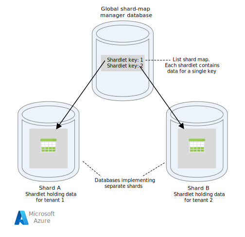
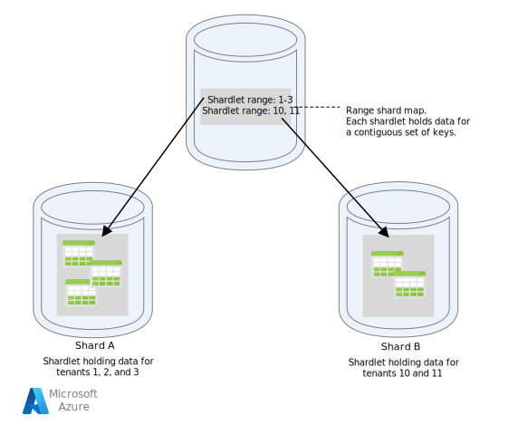
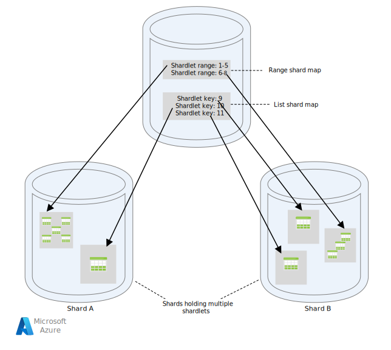
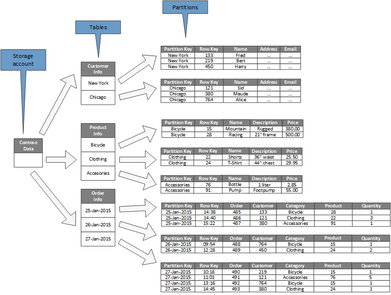
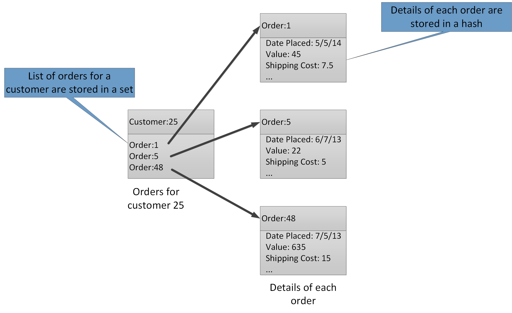

<!-- cSpell:ignore shardlet shardlets MGET MSET -->

This article describes some strategies for partitioning data in various Azure data stores. For general guidance about when to partition data and best practices, see [Data partitioning](./data-partitioning.yml).

## Partitioning Azure SQL Database

A single SQL database has a limit to the volume of data that it can contain. Throughput is constrained by architectural factors and the number of concurrent connections that it supports.

[Elastic pools](/azure/sql-database/sql-database-elastic-pool) support horizontal scaling for a SQL database. Using elastic pools, you can partition your data into shards that are spread across multiple SQL databases. You can also add or remove shards as the volume of data that you need to handle grows and shrinks. Elastic pools can also help reduce contention by distributing the load across databases.

Each shard is implemented as a SQL database. A shard can hold more than one dataset (called a *shardlet*). Each database maintains metadata that describes the shardlets that it contains. A shardlet can be a single data item, or a group of items that share the same shardlet key. For example, in a multitenant application, the shardlet key can be the tenant ID, and all data for a tenant can be held in the same shardlet.

Client applications are responsible for associating a dataset with a shardlet key. A separate SQL Database acts as a global shard map manager. This database has a list of all the shards and shardlets in the system. The application connects to the shard map manager database to obtain a copy of the shard map. It caches the shard map locally, and uses the map to route data requests to the appropriate shard. This functionality is hidden behind a series of APIs that are contained in the [Elastic Database client library](/azure/sql-database/sql-database-elastic-database-client-library), which is available for Java and .NET.

For more information about elastic pools, see [Scaling out with Azure SQL Database](/azure/sql-database/sql-database-elastic-scale-introduction).

To reduce latency and improve availability, you can replicate the global shard map manager database. With the Premium pricing tiers, you can configure active geo-replication to continuously copy data to databases in different regions.

Alternatively, use [Azure SQL Data Sync](/azure/sql-database/sql-database-sync-data) or [Azure Data Factory](/azure/data-factory) to replicate the shard map manager database across regions. This form of replication runs periodically and is more suitable if the shard map changes infrequently, and doesn't require Premium tier.

Elastic Database provides two schemes for mapping data to shardlets and storing them in shards:

- A **list shard map** associates a single key to a shardlet. For example, in a multitenant system, the data for each tenant can be associated with a unique key and stored in its own shardlet. To guarantee isolation, each shardlet can be held within its own shard.

    

    *Download a [Visio file](https://arch-center.azureedge.net/data-partitioning-strategies.vsdx) of this diagram.*

- A **range shard map** associates a set of contiguous key values to a shardlet. For example, you can group the data for a set of tenants (each with their own key) within the same shardlet. This scheme is less expensive than the first, because tenants share data storage, but has less isolation.

    

    *Download a [Visio file](https://arch-center.azureedge.net/data-partitioning-strategies.vsdx) of this diagram*

A single shard can contain the data for several shardlets. For example, you can use list shardlets to store data for different noncontiguous tenants in the same shard. You can also mix range shardlets and list shardlets in the same shard, although they're addressed through different maps. The following diagram shows this approach:

*Download a [Visio file](https://arch-center.azureedge.net/data-partitioning-strategies.vsdx) of this diagram.*

Elastic pools make it possible to add and remove shards as the volume of data shrinks and grows. Client applications can create and delete shards dynamically, and transparently update the shard map manager. However, removing a shard is a destructive operation that also requires deleting all the data in that shard.

If an application needs to split a shard into two separate shards or combine shards, use the [split-merge tool](/azure/sql-database/sql-database-elastic-scale-overview-split-and-merge). This tool runs as an Azure web service, and migrates data safely between shards.

The partitioning scheme can significantly affect the performance of your system. It can also affect the rate at which shards have to be added or removed, or that data must be repartitioned across shards. Consider the following points:

- Group data that is used together in the same shard, and avoid operations that access data from multiple shards. A shard is a SQL database in its own right, and cross-database joins must be performed on the client side.

    Although SQL Database doesn't support cross-database joins, you can use the Elastic Database tools to perform [multi-shard queries](/azure/sql-database/sql-database-elastic-scale-multishard-querying). A multi-shard query sends individual queries to each database and merges the results.

- Don't design a system that has dependencies between shards. Referential integrity constraints, triggers, and stored procedures in one database can't reference objects in another.

- If you have reference data that is frequently used by queries, consider replicating this data across shards. This approach can remove the need to join data across databases. Ideally, such data should be static or slow-moving, to minimize the replication effort and reduce the chances of it becoming stale.

- Shardlets that belong to the same shard map should have the same schema. SQL Database doesn't enforce this rule, but data management and querying becomes complex if each shardlet has a different schema. Instead, create separate shard maps for each schema. Remember that data belonging to different shardlets can be stored in the same shard.

- Transactional operations are only supported for data within a shard, and not across shards. Transactions can span shardlets as long as they're part of the same shard. Therefore, if your business logic needs to perform transactions, either store the data in the same shard or implement eventual consistency.

- Place shards close to the users that access the data in those shards. This strategy helps reduce latency.

- Avoid having a mixture of highly active and relatively inactive shards. Try to spread the load evenly across shards. This might require hashing the sharding keys. If you're geo-locating shards, make sure that the hashed keys map to shardlets held in shards stored close to the users that access that data.

## Partitioning Azure Table storage

Azure Table storage is a key-value store that's designed around partitioning. All entities are stored in a partition, and partitions are managed internally by Azure Table storage. Each entity stored in a table must provide a two-part key that includes:

- **The partition key**. This is a string value that determines the partition where Azure Table storage places the entity. All entities with the same partition key are stored in the same partition.

- **The row key**. This is a string value that identifies the entity within the partition. All entities within a partition are sorted lexically, in ascending order, by this key. The partition key/row key combination must be unique for each entity and can't exceed 1 KB in length.

If an entity is added to a table with a previously unused partition key, Azure Table storage creates a new partition for this entity. Other entities with the same partition key are stored in the same partition.

This mechanism effectively implements an automatic scale-out strategy. Each partition is stored on the same server in an Azure datacenter to help ensure that queries that retrieve data from a single partition run quickly.

Microsoft publishes [scalability targets] for Azure Storage. If your system is likely to exceed these limits, consider splitting entities into multiple tables. Use vertical partitioning to divide the fields into the groups that are most likely to be accessed together.

The following diagram shows the logical structure of an example storage account. The storage account contains three tables: Customer Info, Product Info, and Order Info.

Each table has multiple partitions.

- In the Customer Info table, the data is partitioned according to the city where the customer is located. The row key contains the customer ID.
- In the Product Info table, products are partitioned by product category, and the row key contains the product number.
- In the Order Info table, the orders are partitioned by order date, and the row key specifies the time the order was received. All data is ordered by the row key in each partition.

Consider the following points when you design your entities for Azure Table storage:

- Select a partition key and row key by how the data is accessed. Choose a partition key/row key combination that supports most of your queries. The most efficient queries retrieve data by specifying the partition key and the row key. Queries that specify a partition key and a range of row keys can be completed by scanning a single partition. This is relatively fast because the data is held in row key order. If queries don't specify which partition to scan, every partition must be scanned.

- If an entity has one natural key, then use it as the partition key and specify an empty string as the row key. If an entity has a composite key consisting of two properties, select the slowest changing property as the partition key and the other as the row key. If an entity has more than two key properties, use a concatenation of properties to provide the partition and row keys.

- If you regularly perform queries that look up data by using fields other than the partition and row keys, consider implementing the [Index Table pattern](../patterns/index-table.yml), or consider using a different data store that supports indexing, such as Azure Cosmos DB.

- If you generate partition keys by using a monotonic sequence (such as "0001," "0002," "0003") and each partition only contains a limited amount of data, Azure Table storage can physically group these partitions together on the same server. Azure Storage assumes that the application is most likely to perform queries across a contiguous range of partitions (range queries) and is optimized for this case. However, this approach can lead to hotspots, because all insertions of new entities are likely to be concentrated at one end the contiguous range. It can also reduce scalability. To spread the load more evenly, consider hashing the partition key.

- Azure Table storage supports transactional operations for entities that belong to the same partition. An application can perform multiple insert, update, delete, replace, or merge operations as an atomic unit, as long as the transaction doesn't include more than 100 entities and the payload of the request doesn't exceed 4 MB. Operations that span multiple partitions aren't transactional, and might require you to implement eventual consistency. For more information about table storage and transactions, see [Performing entity group transactions].

- Consider the granularity of the partition key:

  - Using the same partition key for every entity results in a single partition that's held on one server. This prevents the partition from scaling out and focuses the load on a single server. As a result, this approach is only suitable for storing a few entities. However, it does ensure that all entities can participate in entity group transactions.

  - Using a unique partition key for every entity causes the table storage service to create a separate partition for each entity, possibly resulting in a large number of small partitions. This approach is more scalable than using a single partition key, but entity group transactions aren't possible. Also, queries that fetch more than one entity might involve reading from more than one server. However, if the application performs range queries, then using a monotonic sequence for the partition keys might help to optimize these queries.

  - Sharing the partition key across a subset of entities makes it possible to group related entities in the same partition. Operations that involve related entities can be performed by using entity group transactions, and queries that fetch a set of related entities can be satisfied by accessing a single server.

For more information, see [Azure Storage table design guide] and [Scalable partitioning strategy].

## Partitioning Azure Blob Storage

Azure Blob Storage makes it possible to hold large binary objects. Use block blobs in scenarios when you need to upload or download large volumes of data quickly. Use page blobs for applications that require random rather than serial access to parts of the data.

Each blob (either block or page) is held in a container in an Azure Storage account. You can use containers to group related blobs that have the same security requirements. This grouping is logical rather than physical. Inside a container, each blob has a unique name.

The partition key for a blob is account name + container name + blob name. The partition key is used to partition data into ranges and these ranges are load-balanced across the system. Blobs can be distributed across many servers in order to scale out access to them, but a single blob is served by a single server.

If your naming scheme uses timestamps or numerical identifiers, it can lead to excessive traffic going to one partition, limiting the system from effectively load balancing. For instance, if you have daily operations that use a blob object with a timestamp such as *yyyy-mm-dd*, all the traffic for that operation would go to a single partition server. Instead, consider prefixing the name with a three-digit hash. For more information, see [Partition Naming Convention](/azure/storage/common/storage-performance-checklist#partitioning).

The actions of writing a single block or page are atomic, but operations that span blocks, pages, or blobs aren't. If you need to ensure consistency when performing write operations across blocks, pages, and blobs, take out a write lock by using a blob lease.

## Partitioning Azure Storage queues

Azure Storage queues enable you to implement asynchronous messaging between processes. An Azure Storage account can contain any number of queues, and each queue can contain any number of messages. The only limitation is the space that's available in the storage account. The maximum size of an individual message is 64 KB. If you require messages bigger than this, then consider using Azure Service Bus queues instead.

Each storage queue has a unique name within the storage account that contains it. Azure partitions queues based on the name. All messages for the same queue are stored in the same partition, which is controlled by a single server. Different queues are managed by different servers to help balance the load. The allocation of queues to servers is transparent to applications and users.

In a large-scale application, don't use the same storage queue for all instances of the application because this approach might cause the server that's hosting the queue to become a hot spot. Instead, use different queues for different functional areas of the application. Azure Storage queues don't support transactions, so directing messages to different queues should have little effect on messaging consistency.

An Azure Storage queue can handle up to 2,000 messages per second. If you need to process messages at a greater rate than this, consider creating multiple queues. For example, in a global application, create separate storage queues in separate storage accounts to handle application instances that are running in each region.

## Partitioning Azure Service Bus

Azure Service Bus uses a message broker to handle messages that are sent to a Service Bus queue or topic. By default, all messages that are sent to a queue or topic are handled by the same message broker process. This architecture can place a limitation on the overall throughput of the message queue. However, you can also partition a queue or topic when it's created. You do this by setting the *EnablePartitioning* property of the queue or topic description to *true*.

A partitioned queue or topic is divided into multiple fragments, each of which is backed by a separate message store and message broker. Service Bus takes responsibility for creating and managing these fragments. When an application posts a message to a partitioned queue or topic, Service Bus assigns the message to a fragment for that queue or topic. When an application receives a message from a queue or subscription, Service Bus checks each fragment for the next available message and then passes it to the application for processing.

This structure helps distribute the load across message brokers and message stores, increasing scalability and improving availability. If the message broker or message store for one fragment is temporarily unavailable, Service Bus can retrieve messages from one of the remaining available fragments.

Service Bus assigns a message to a fragment as follows:

- If the message belongs to a session, all messages with the same value for the *SessionId*  property are sent to the same fragment.

- If the message doesn't belong to a session, but the sender specifies a value for the *PartitionKey* property, then all messages with the same *PartitionKey* value are sent to the same fragment.

  > [!NOTE]
  > If the *SessionId* and *PartitionKey* properties are both specified, then they must be set to the same value or the message is rejected.

- If the *SessionId* and *PartitionKey* properties for a message aren't specified, but duplicate detection is enabled, the *MessageId* property is used. All messages with the same *MessageId* are directed to the same fragment.

- If messages don't include a *SessionId, PartitionKey,* or *MessageId* property, then Service Bus assigns messages to fragments sequentially. If a fragment is unavailable, Service Bus continues to the next fragment. This means that a temporary fault in the messaging infrastructure doesn't cause the message-send operation to fail.

Consider the following points when deciding if or how to partition a Service Bus message queue or topic:

- Service Bus queues and topics are created within the scope of a Service Bus namespace. Service Bus currently allows up to 100 partitioned queues or topics per namespace.

- Each Service Bus namespace imposes quotas on the available resources, such as the number of subscriptions per topic, the number of concurrent send and receive requests per second, and the maximum number of concurrent connections that can be established. These quotas are documented in [Service Bus quotas]. If you expect to exceed these values, then create more namespaces with their own queues and topics, and spread the work across these namespaces. For example, in a global application, create separate namespaces in each region and configure application instances to use the queues and topics in the nearest namespace.

- Messages that are sent as part of a transaction must specify a partition key. This can be a *SessionId*, *PartitionKey*, or *MessageId* property. All messages that are sent as part of the same transaction must specify the same partition key because they're handled by the same message broker process. You can't send messages to different queues or topics within the same transaction.

- Partitioned queues and topics can't be configured to be automatically deleted when they become idle.

- Partitioned queues and topics can't currently be used with the Advanced Message Queuing Protocol (AMQP) if you're building cross-platform or hybrid solutions.

## Partitioning Azure Cosmos DB

[Azure Cosmos DB for NoSQL][cosmos-db-sql-api] is a NoSQL database for storing JSON documents. A document in an Azure Cosmos DB database is a JSON-serialized representation of an object or other piece of data. No fixed schemas are enforced except that every document must contain a unique ID.

Documents are organized into collections. You can group related documents together in a collection. For example, in a system that maintains blog postings, you can store the contents of each blog post as a document in a collection. You can also create collections for each subject type. Alternatively, in a multitenant application, such as a system where different authors control and manage their own blog posts, you can partition blogs by author and create separate collections for each author. The storage space that's allocated to collections is elastic and can shrink or grow as needed.

Azure Cosmos DB supports automatic partitioning of data based on an application-defined partition key. A *logical partition* is a partition that stores all the data for a single partition key value. All documents that share the same value for the partition key are placed within the same logical partition. Azure Cosmos DB distributes values according to hash of the partition key. A logical partition has a maximum size of 20 GB. Therefore, the choice of the partition key is an important decision at design time. Choose a property with a wide range of values and even access patterns. For more information, see [Partition and scale in Azure Cosmos DB](/azure/cosmos-db/partition-data).

> [!NOTE]
> Each Azure Cosmos DB database has a *performance level* that determines the amount of resources it gets. A performance level is associated with a *request unit (RU)* rate limit. The RU rate limit specifies the volume of resources that's reserved and available for exclusive use by that collection. The cost of a collection depends on the performance level that's selected for that collection. The higher the performance level (and RU rate limit) the higher the charge. You can adjust the performance level of a collection by using the Azure portal. For more information, see [Request Units in Azure Cosmos DB][cosmos-db-ru].

If the partitioning mechanism that Azure Cosmos DB provides isn't sufficient, you might need to shard the data at the application level. Document collections provide a natural mechanism for partitioning data within a single database. The most straightforward way to implement sharding is to create a collection for each shard. Containers are logical resources and can span one or more servers. Fixed-size containers have a maximum limit of 20 GB and 10,000 RU/s throughput. Unlimited containers don't have a maximum storage size, but must specify a partition key. With application sharding, the client application must direct requests to the appropriate shard, usually by implementing its own mapping mechanism based on some attributes of the data that define the shard key.

All databases are created in the context of an Azure Cosmos DB database account. A single account can contain several databases, and it specifies in which regions the databases are created. Each account also enforces its own access control. You can use Azure Cosmos DB accounts to geo-locate shards (collections within databases) close to the users who need to access them, and enforce restrictions so that only those users can connect to them.

Consider the following points when deciding how to partition data with Azure Cosmos DB for NoSQL:

- **The resources available to an Azure Cosmos DB database are subject to the quota limitations of the account**. Each database can contain multiple collections. Each collection has its own performance level, which determines the reserved throughput in request units per second (RU/s) that are available for that collection. For more information, see [Azure subscription and service limits, quotas, and constraints][azure-limits].

- **Each document must have an attribute that can be used to uniquely identify that document within the collection in which it's held**. This attribute is different from the shard key, which defines which collection holds the document. A collection can contain a large number of documents. In theory, it's limited only by the maximum length of the document ID. The document ID can be up to 255 characters.

- **All operations against a document are performed within the context of a transaction. Transactions are scoped to the collection in which the document is contained.** If an operation fails, the work that it has performed is rolled back. While a document is subject to an operation, any changes that are made are subject to snapshot-level isolation. This mechanism guarantees that if, for example, a request to create a new document fails, another user who's querying the database simultaneously won't see a partial document that is then removed.

- **Database queries are also scoped to the collection level**. A single query can retrieve data from only one collection. If you need to retrieve data from multiple collections, you must query each collection individually and merge the results in your application code.

- **Azure Cosmos DB supports programmable items that can all be stored in a collection alongside documents**. These include stored procedures, user-defined functions, and triggers (written in JavaScript). These items can access any document within the same collection. Furthermore, these items run either inside the scope of the ambient transaction (in the case of a trigger that fires as the result of a create, delete, or replace operation performed against a document), or by starting a new transaction (in the case of a stored procedure that is run as the result of an explicit client request). If the code in a programmable item throws an exception, the transaction is rolled back. You can use stored procedures and triggers to maintain integrity and consistency between documents, but these documents must all be part of the same collection.

- **The collections that you intend to hold in the databases should be unlikely to exceed the throughput limits defined by the performance levels of the collections**. For more information, see [Request Units in Azure Cosmos DB][cosmos-db-ru]. If you anticipate reaching these limits, consider splitting collections across databases in different accounts to reduce the load per collection.

## Partitioning Azure AI Search

The ability to search for data is often the primary method of navigation and exploration that's provided by many web applications. It helps users find resources quickly (for example, products in an e-commerce application) based on combinations of search criteria. The AI Search service provides full-text search capabilities over web content, and includes features such as type-ahead, suggested queries based on near matches, and faceted navigation. For more information, see [What is AI Search?].

AI Search stores searchable content as JSON documents in a database. You define indexes that specify the searchable fields in these documents and provide these definitions to AI Search. When a user submits a search request, AI Search uses the appropriate indexes to find matching items.

To reduce contention, the storage that's used by AI Search can be divided into 1, 2, 3, 4, 6, or 12 partitions, and each partition can be replicated up to 6 times. The product of the number of partitions multiplied by the number of replicas is called the *search unit (SU)*. A single instance of AI Search can contain a maximum of 36 SUs (a database with 12 partitions only supports a maximum of 3 replicas).

You're billed for each SU that is allocated to your service. As the volume of searchable content increases or the rate of search requests grows, you can add SUs to an existing instance of AI Search to handle the extra load. AI Search itself distributes the documents evenly across the partitions. No manual partitioning strategies are currently supported.

Each partition can contain a maximum of 15 million documents or occupy 300 GB of storage space (whichever is smaller). You can create up to 50 indexes. The performance of the service varies and depends on the complexity of the documents, the available indexes, and the effects of network latency. On average, a single replica (1 SU) should be able to handle 15 queries per second (QPS), although we recommend performing benchmarking with your own data to obtain a more precise measure of throughput. For more information, see [Service limits in AI Search].

> [!NOTE]
> You can store a limited set of data types in searchable documents, including strings, Booleans, numeric data, datetime data, and some geographical data. For more information, see the page [Supported data types (AI Search)] on the Microsoft website.

You have limited control over how AI Search partitions data for each instance of the service. However, in a global environment you might be able to improve performance and reduce latency and contention further by partitioning the service itself using either of the following strategies:

- Create an instance of AI Search in each geographic region, and ensure that client applications are directed toward the nearest available instance. This strategy requires that any updates to searchable content are replicated in a timely manner across all instances of the service.

- Create two tiers of AI Search:

  - A local service in each region that contains the data that's most frequently accessed by users in that region. Users can direct requests here for fast but limited results.
  - A global service that encompasses all the data. Users can direct requests here for slower but more complete results.

This approach is most suitable when there's a significant regional variation in the data that's being searched.

## Partitioning Azure Managed Redis

Azure Managed Redis is a fully managed, enterprise-grade data platform built on Redis Enterprise. It excels at classic caching scenarios, and it also provides a multimodel, in-memory environment that can accelerate both traditional application patterns and modern AI‑driven architectures, like AI agents.

Azure Managed Redis supports built-in high availability and horizontal scaling through Redis clustering, which distributes data across multiple nodes. You can adjust capacity and performance by scaling the service tier and SKU, so you don't need to deploy multiple caches to increase overall storage or throughput. For more information, see [Azure Managed Redis].

Partitioning a Redis data store involves splitting data across multiple nodes. Azure Managed Redis uses native Redis Cluster partitioning to automatically distribute keys across nodes based on hash slots. This approach abstracts the underlying nodes from application logic and removes the need for application-level partition management in most scenarios. For more information about clustering models and client connectivity options in Azure Managed Redis, see [Azure Managed Redis clustering](/azure/redis/architecture#clustering).

Client applications connect to the cluster by using standard Redis client libraries through Redis endpoints. Requests automatically route to the appropriate node within the cluster. If a request reaches a node that doesn't own the requested key, the request forwards internally to the node that holds the corresponding hash slot. The Redis service and supporting client libraries handle request routing and cluster topology management.

Redis clustering is transparent to application logic. Nodes can be added or removed and data can be automatically rebalanced without requiring application reconfiguration.

Operations that involve multiple keys, like transactions or batch operations, must ensure that all participating keys reside in the same partition. Application developers should design key-naming strategies accordingly to support these access patterns.

> [!IMPORTANT]
> Azure Managed Redis provides built-in Redis clustering as part of the service. Applications should generally rely on native Redis Cluster partitioning rather than implementing client-side partitioning logic.

The remainder of this section focuses on data modeling and key design considerations when you work with partitioned Redis data stores.

Consider the following points when you use Azure Managed Redis to structure and partition data:

- Azure Managed Redis doesn't serve as a permanent system of record. Applications must be able to retrieve data from a durable data store if data becomes unavailable, or if data is evicted from Redis.

  Applications populate data in Azure Managed Redis by using different patterns depending on their requirements. In cache-aside approaches, applications load data into Redis on demand. Applications might also use ingestion-based patterns, where data is proactively written to Redis from external systems. You can implement ingestion by using event-driven or batch ingestion mechanisms, like Redis Data Integration (RDI) or Azure Functions, which synchronize data from durable data stores into Redis.

- Structure or model frequently accessed data together, so that it can be stored and retrieved together. Redis provides a broad set of optimized data structures to support different access patterns. Some examples of optimized data structures include:

  - Simple key-value entries for small, bounded values
  - Aggregate types, like lists, which can act as queues and stacks
  - Sets and sorted sets, which support unordered collections and ranked data
  - Hashes, which can group related fields together under a single key
  - Bitmaps for efficient representation of flags and Boolean states
  - Probabilistic data structures, like Bloom filters and HyperLogLog, for space-efficient membership and cardinality estimation
  - Document-oriented structures for storing and querying JSON data
  - Time-series structures optimized for timestamped measurements
  - Indexing and search capabilities for querying structured and semistructured data

- Use aggregate and structured data types to associate many related values with a single key. A Redis key identifies a list, set, sorted set, hash, or document rather than the individual data items that it contains. Azure Managed Redis supports these data structures. For more information, see [Data types].

  For example, in an e-commerce system that tracks customer orders, you can store each customer's details in a Redis hash that uses the customer ID as its key. Each hash holds a collection of order IDs associated with that customer. A separate Redis set stores the orders themselves as hashes that use the order ID as their key. The following diagram shows this structure. Redis doesn't enforce referential integrity, so the application must maintain relationships between customers and orders.

  

  > [!NOTE]
  > In Redis, keys and values are binary-safe and can store values up to hundreds of megabytes (MBs) in size. But you should keep values relatively small and bounded to minimize latency, reduce replication and rebalancing costs, and improve overall efficiency. Ensure that keys follow a consistent naming convention that's descriptive, stable, and not excessively long. A common approach is to use keys of the form `entity_type:ID`. For example, `customer:99` represents the key for a customer with ID 99.

- To implement vertical partitioning, store related information in separate data structures under different keys within the same Redis database. For example, in an e-commerce application, store commonly accessed product information in one Redis hash and store less frequently accessed or more detailed product data in another Redis hash. Both structures can use the same product identifier as part of the key, like `product:nn` for frequently accessed data and `product:details:nn` for detailed information. This approach helps reduce the amount of data that most queries retrieve and improves access efficiency.

- Azure Managed Redis uses built-in Redis clustering to distribute data across nodes and to rebalance data automatically as the cluster scales. Applications don't need to manage repartitioning explicitly. Instead, partition-aware design should focus on key structure, access patterns, and data life cycle.

- Applications usually access Redis by exact key lookups. While careful key design remains important, Azure Managed Redis also provides indexing and search capabilities that applications use to query data based on attributes, ranges, or text content. These capabilities can help avoid application-side key iteration or complex secondary-key management. Apply search and indexing selectively, based on access patterns and query requirements, rather than as a replacement for efficient key-based access.

- Azure Managed Redis supports assigning a time-to-live (TTL) value to keys to control data life cycle. You can use TTL values to manage freshness, enforce retention policies, or support cache and derived-data scenarios. Set up eviction policies to determine how Redis behaves when memory pressure occurs. Design applications to tolerate evictions and reload or regenerate data when necessary.

  > [!NOTE]
  > With Azure Managed Redis, the service tier and SKU determine capacity and performance, and you can adjust them over time as workload requirements change. Design applications to scale independently of specific node sizes or fixed capacity limits.

- Redis batches and transactions can't span multiple partitions. Any data affected by a batch or transaction must reside within the same partition. When you design keys and access patterns, ensure that you colocate related keys that participate in transactional or batched operations.

  > [!NOTE]
  > A sequence of operations in a Redis transaction isn't necessarily atomic in the traditional database sense. The commands that compose a transaction are validated and queued before execution. If an error occurs during this phase, the entire queue is discarded. After the transaction is successfully submitted, the queued commands run sequentially. If a command fails during execution, only that command fails. Previous and subsequent commands in the queue are still executed. For more information, see [Redis transactions](https://redis.io/docs/latest/develop/using-commands/transactions/).

- Redis supports a limited set of atomic operations across multiple keys. The primary multikey atomic operations are `MGET` and `MSET`, which retrieve or store values for a specified set of keys. When you use these operations in a clustered deployment, all referenced keys must reside in the same partition. Design your keys to account for this constraint and ensure correctness and performance.

## Partitioning Azure Event Hubs

[Azure Event Hubs][event-hubs] is designed for data streaming at massive scale, and partitioning is built into the service to enable horizontal scaling. Each consumer only reads a specific partition of the message stream.

The event publisher is only aware of its partition key, not the partition to which the events are published. This decoupling of key and partition insulates the sender from needing to know too much about the downstream processing. (It's also possible send events directly to a given partition, but generally that's not recommended.)

Consider long-term scale when you select the partition count. After an event hub is created, you can't change the number of partitions.

### Next steps

For more information about using partitions in Event Hubs, see [What is Event Hubs?].

For considerations about trade-offs between availability and consistency, see [Availability and consistency in Event Hubs].

[Availability and consistency in Event Hubs]: /azure/event-hubs/event-hubs-availability-and-consistency
[azure-limits]: /azure/azure-subscription-service-limits
[Azure Managed Redis]: https://azure.microsoft.com/products/managed-redis
[Azure Storage Table Design Guide]: /azure/storage/storage-table-design-guide
[cosmos-db-ru]: /azure/cosmos-db/request-units
[Data Types]: https://redis.io/docs/latest/develop/data-types/
[cosmos-db-sql-api]: /azure/cosmos-db/sql-api-introduction
[event-hubs]: /azure/event-hubs

[Performing Entity Group Transactions]: /rest/api/storageservices/Performing-Entity-Group-Transactions
[Redis cluster tutorial]: https://redis.io/topics/cluster-tutorial
[Service Bus quotas]: /azure/service-bus-messaging/service-bus-quotas
[Service limits in AI Search]: /azure/search/search-limits-quotas-capacity
[Supported Data Types (AI Search)]: /rest/api/searchservice/Supported-data-types
[Transactions]: https://redis.io/topics/transactions
[What is Event Hubs?]: /azure/event-hubs/event-hubs-what-is-event-hubs
[What is AI Search?]: /azure/search/search-what-is-azure-search
[scalability targets]: /azure/storage/common/storage-scalability-targets
[Scalable partitioning strategy]: /rest/api/storageservices/designing-a-scalable-partitioning-strategy-for-azure-table-storage
