# Deploying recommended policies

This section discusses how to deploy the recommended policies in a newly provisioned environment. Setting up these policies in a separate lab environment allows you to understand and evaluate the recommended policies before staging the rollout of them in your pre-production and production environments. Your newly provisioned environment may be cloud-only or Hybrid.  

To successfully deploy the recommended polices, you’ll need to take actions in the Azure portal to meet the prerequisites stated earlier. Specifically, before continuing, ensure that you have configured named networks to ensure Azure Identity Protection can properly generate a risk score, required that all users are registered for multi-factor authentication (MFA), and you have configured password sync and self-service password reset to enable users to reset passwords themselves. 

Both Azure AD and Intune policies can be targeted at specific groups of users.  We suggest rolling out the policies defined earlier in a staged way so that you can validate the performance of the policies and your support teams relative to the policy incrementally.  

## Baseline CA Policy

To create a new conditional access policy: log into the Microsoft Azure Portal with your administrator credentials and then navigate to **Azure Active Directory > Security > Conditional access**, and add a new policy (+Add) as shown in the following screen shot:

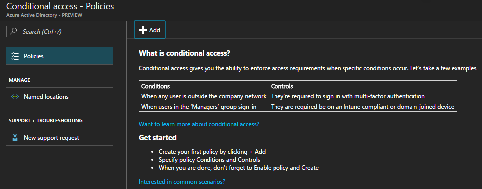

The following tables describe in detail the appropriate settings necessary to express the policies required for each level of protection.

### Medium and Above Risk requires MFA

The following table describes the conditional access policy settings to implement for this policy.

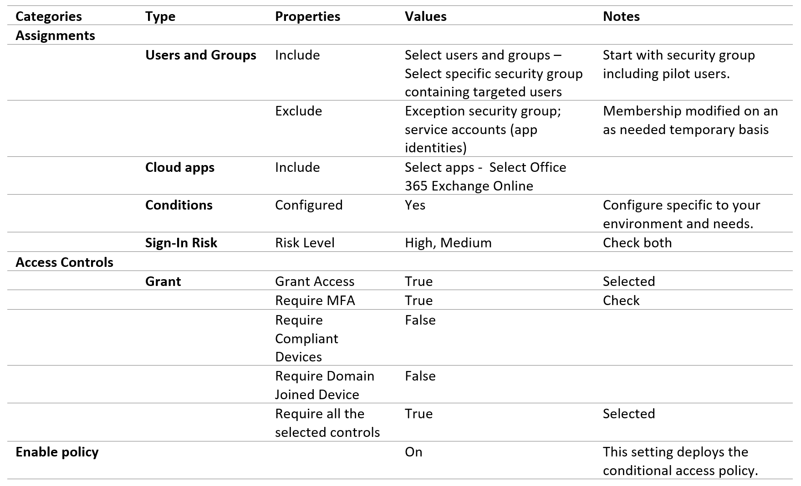

### Require a Compliant or Domain Joined Device

You must express this as a Conditional Access policy specifically for Exchange Online in the Intune Management Portal. To create a new Intune Conditional Access Policy for Exchange Online: log into the [Microsoft Management Portal (http://manage.microsoft.com)](http://manage.microsoft.com/) with your administrator credentials and then navigate to **Policy > Conditional Access > Exchange Online Policy**.

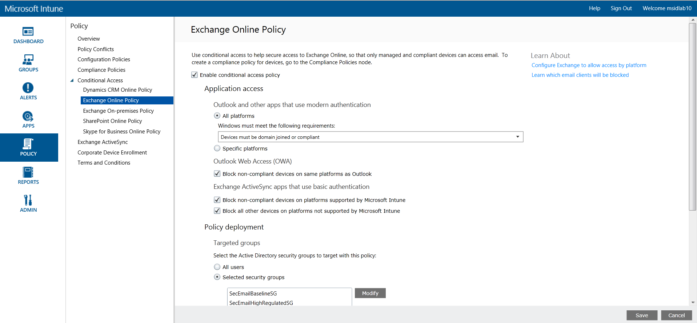

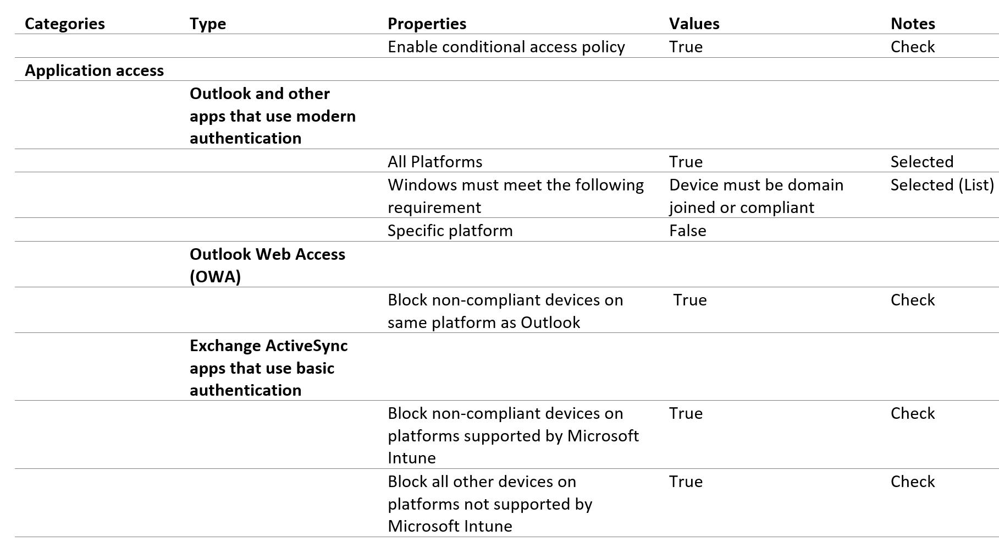
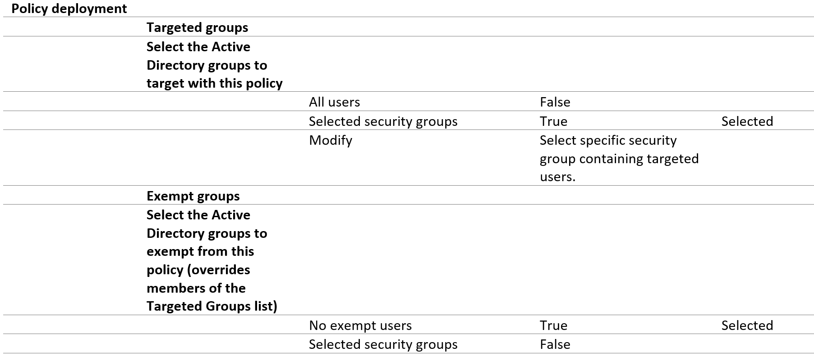

### Mobile Application Management Conditional Access for Exchange Online

Additionally you will need to add the following Conditional Access settings for Exchange Online. Log into the Microsoft Azure Portal with your administrator credentials and then navigate to **Intune App Protection > Settings > Conditional Access > Exchange Online**.

### Apply to:

Once your pilot project has been completed, this set of policies should be applied to all users in your organization.

## Sensitive CA Policy

### Low and Above Risk Requires MFA
The following table describes the conditional access policy settings to implement for this policy.

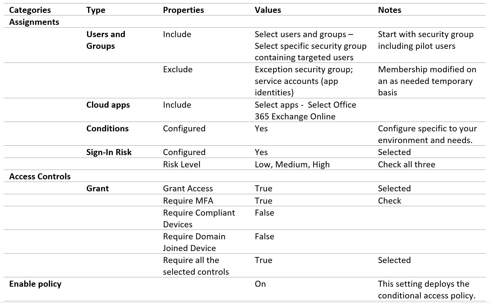

### Require a Compliant or Domain Joined Device
(See baseline instructions)

### Mobile Application Management Conditional Access for Exchange Online

(See baseline instructions)
### Apply To:

Once the pilot project has been completed, this set of policies should be applied to users in your organization that require access to emails that are considered to be in the sensitive category.

## Highly Regulated CA Policy
### MFA Required

The following table describes the conditional access policy settings to implement for this policy.

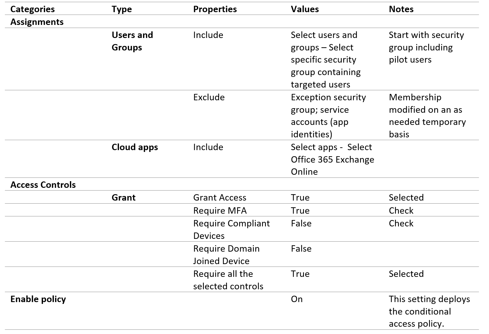

### Require a Compliant or Domain Joined Device
(See baseline instructions)
### Mobile Application Management Conditional Access for Exchange Online
(See baseline instructions)
### Apply To:
Once the pilot project has been completed, this set of policies should be applied to users in your organization that require access to emails that are considered to be in the highly regulated category.

## User Risk Policy
### High Risk Users must change password
To ensure all high-risk users, compromised accounts, are forced to perform a password change when signing-in, the following policy must be applied. Log in to the [Microsoft Azure Portal (http://portal.azure.com)](http://portal.azure.com/) with your administrator credentials and navigate to **Azure AD Identity Protection > User Risk Policy**.

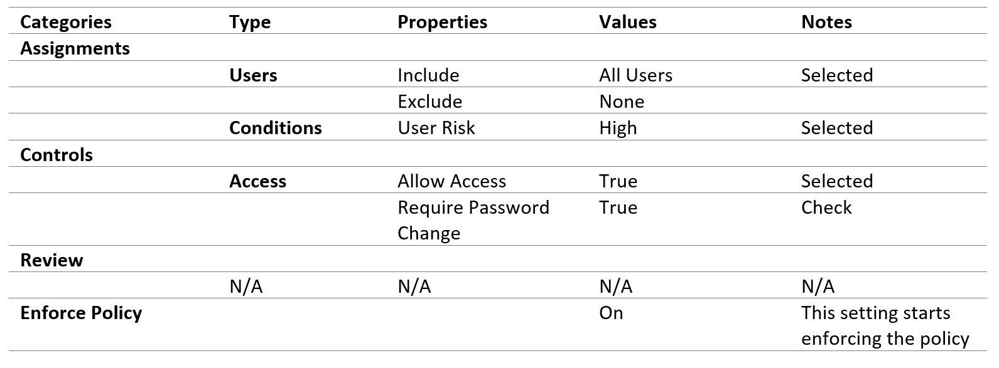

## Additional Configurations
In addition to the above policies, the following Mobile Application and Device Management settings must be configured. 

### Intune Mobile Application Management 

To ensure email is protected by the policy recommendations stated earlier for each security and data protection tier, you need to create Intune app protection policies from within the Azure portal.

To create a new app protection policy: log into the Microsoft Azure Portal with your administer credentials and then navigate to **Intune App Protection > Settings > App policy**, and add a new policy (+Add) as shown in the following screen shot:

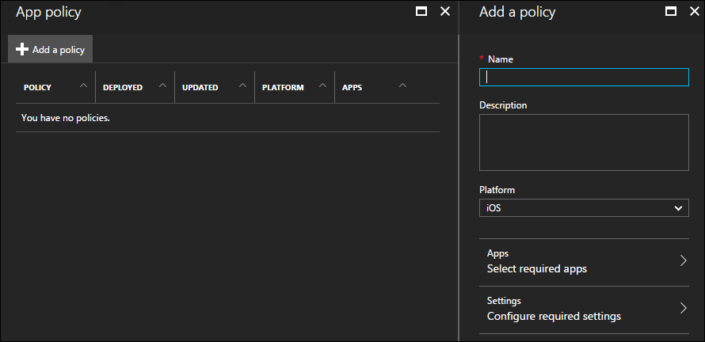

>[!NOTE]
>There are slight differences in the app protection policy options between iOS and Android. The below policy is specifically for Android.
>

The following tables describe, in details, the appropriate settings necessary to express the policies required for each level of protection.

The following table describes the recommended Intune app protection policy settings.

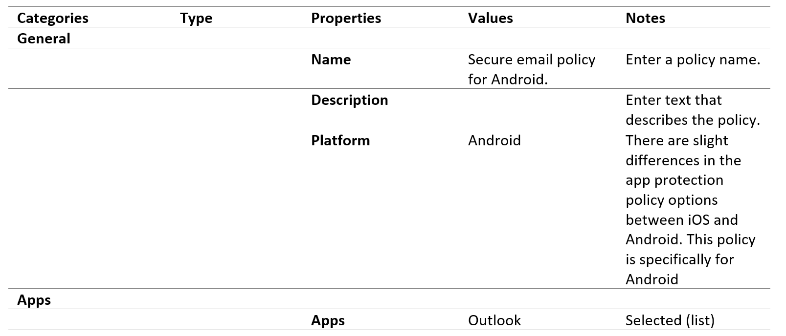
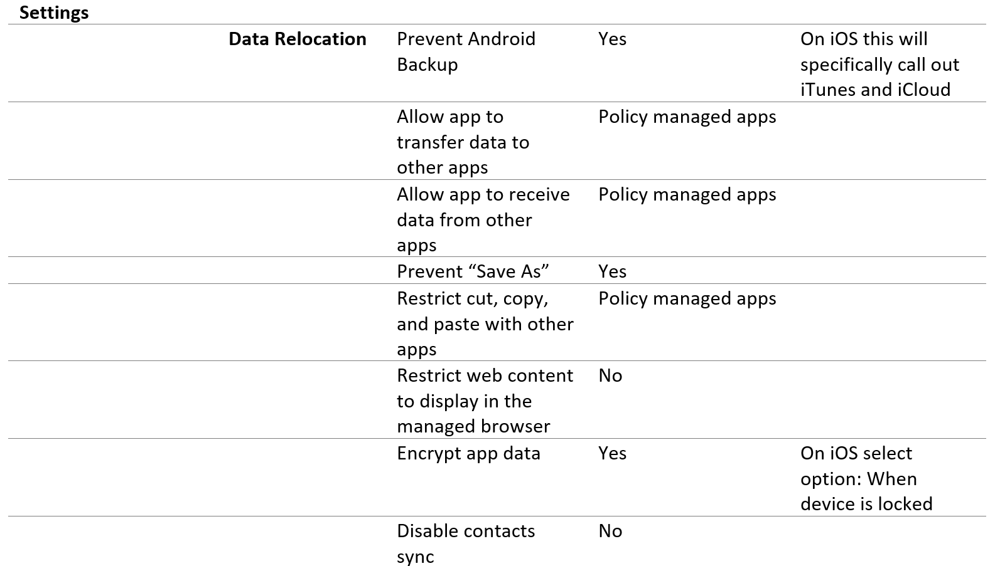
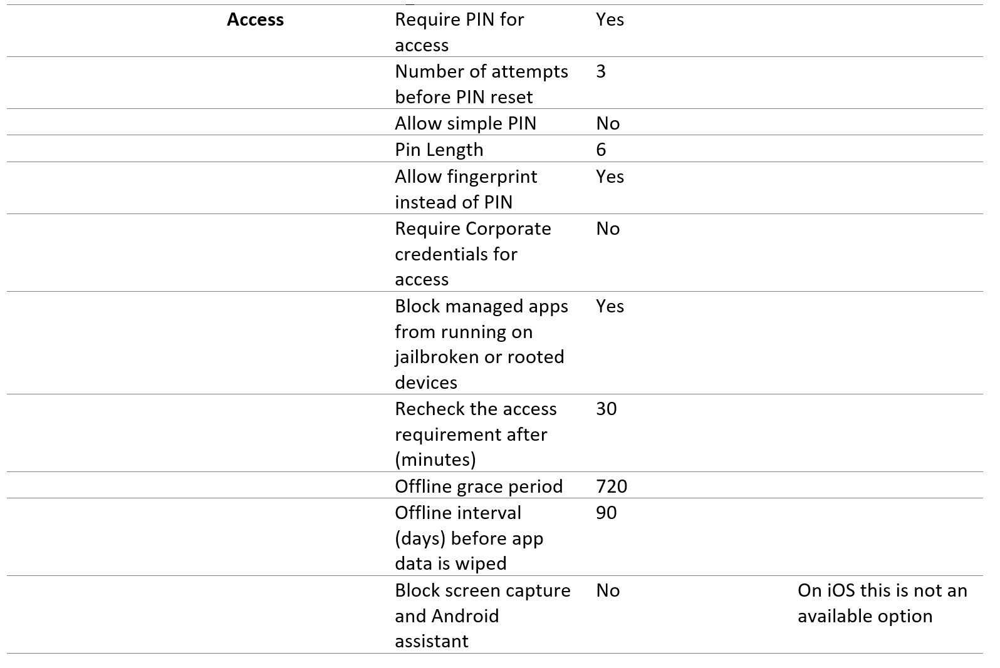

When done, remember to click “Create”. Repeat above steps replacing the selected platform (dropdown) with iOS. This should leave you with two app policies. Once the policy is created, assign groups to the policy to deploy.

When done, remember to click “Create”. Repeat above steps replacing the selected platform (dropdown) with iOS. This should leave you with two app policies. Once the policy is created, assign groups to the policy to deploy.

### Intune Mobile Device Management
The following Configuration and Compliance policies must be created and applied. Log into the [Microsoft Management Portal (http://manage.microsoft.com)](https://manage.microsoft.com/) with your administrator credentials.

#### iOS Email Profile
In the [Intune management portal (https://manage.microsoft.com)](https://manage.microsoft.com/) create the following Configuration policies at **Policy > Configuration Policies > Add > iOS > Email Profile (iOS 8 and later)**.

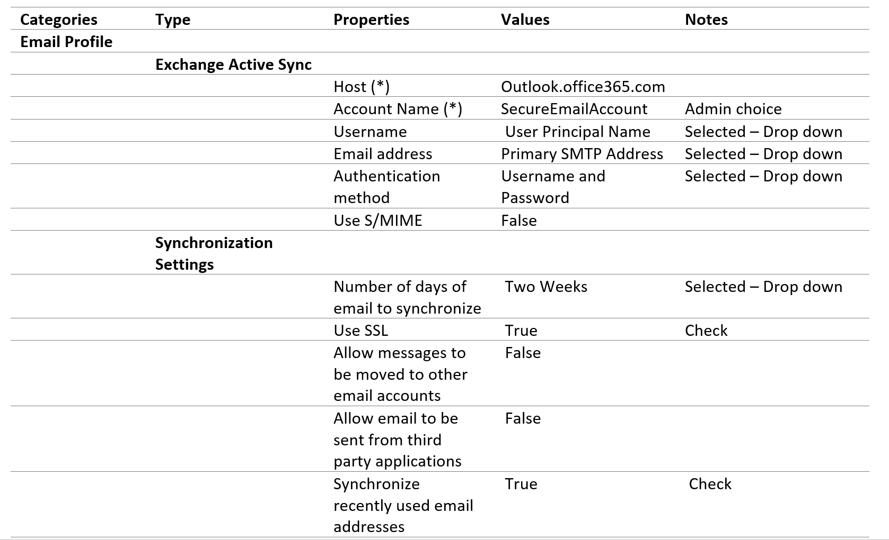

#### iOS App Sharing Profile
In the [Intune management portal (https://manage.microsoft.com)](https://manage.microsoft.com/) create the following Configuration policies at  **Policy > Configuration Policies > Add > iOS > General Configuration (iOS 8.0 and later)**.

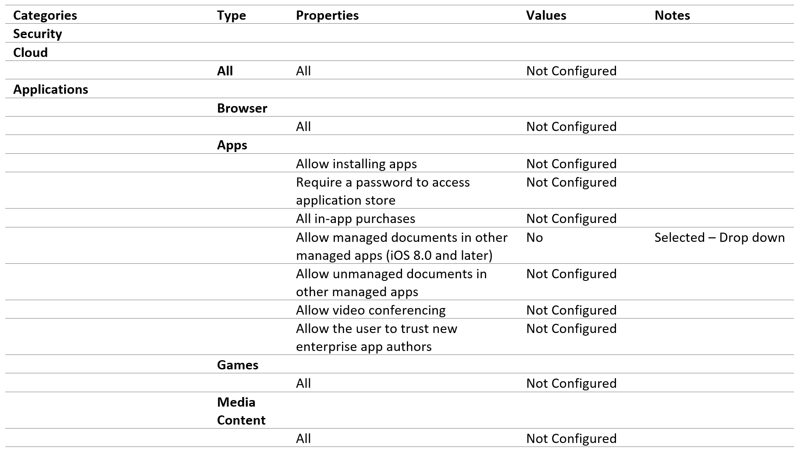
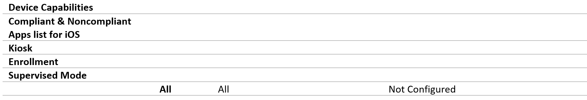

#### Android Email Profile
In the [Intune management portal (https://manage.microsoft.com)](https://manage.microsoft.com/) create the following Configuration policies at **Policy > Configuration Policies > Add > iOS > Email Profile (Samsung KNOX Standard 4.0 and later)**.

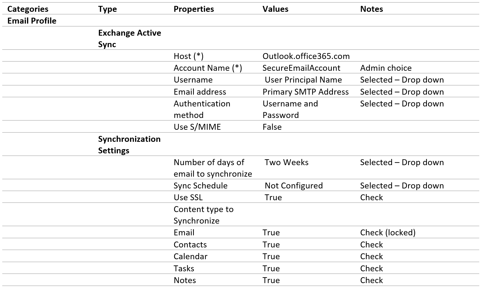

#### Android for Work Email Profile
In the [Intune management portal (https://manage.microsoft.com)](https://manage.microsoft.com/) create the following Configuration policies at **Policy > Configuration Policies > Add > iOS > Email Profile (Android for Work - Gmail)**.

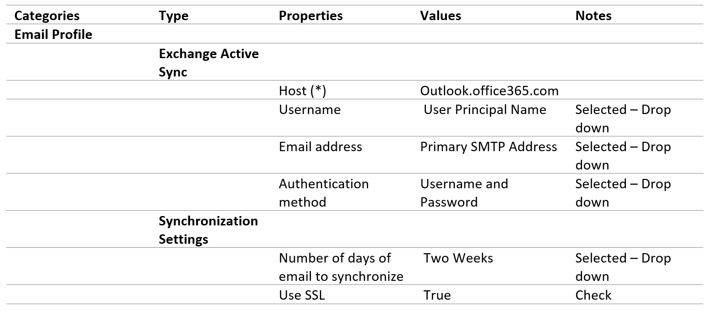

#### Android for Work App Sharing Profile
In the [Intune management portal (https://manage.microsoft.com)](https://manage.microsoft.com/) create the following Configuration policies at  **Policy > Configuration Policies > Add > iOS > General Configuration (Android for Work)**.

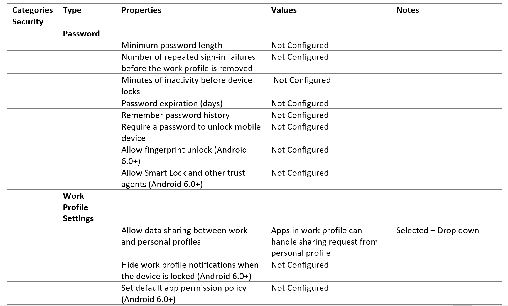

#### Device Compliance Policy
In the [Intune management portal (https://manage.microsoft.com)](https://manage.microsoft.com/) create the following Configuration policies at  **Policy > Compliance Policy > Add**.

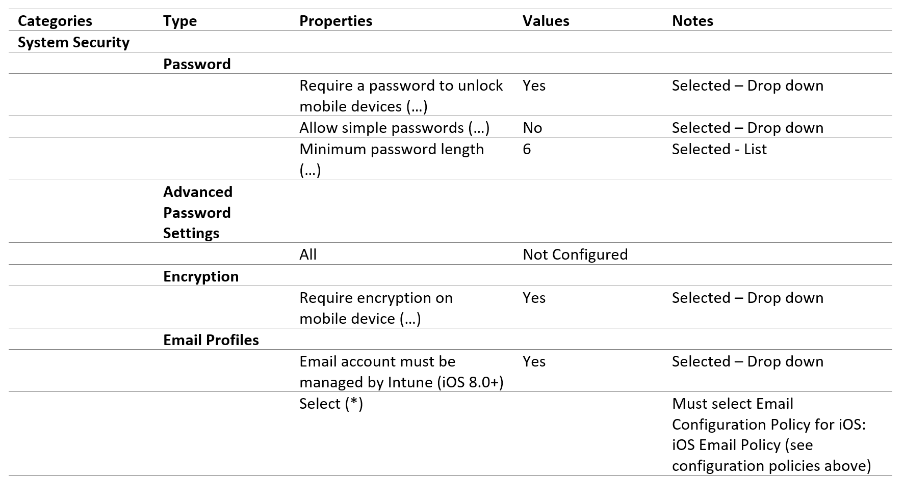
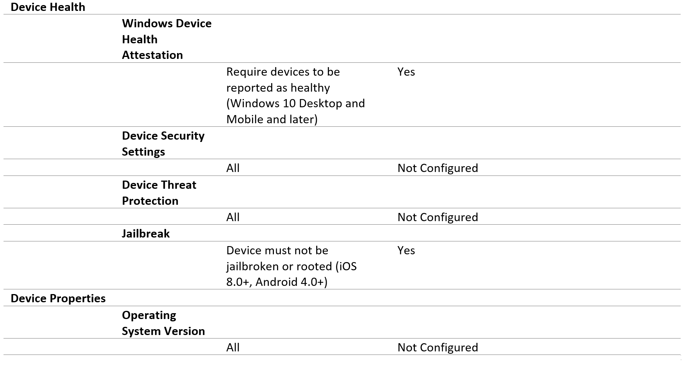

For all of the above policies to be considered deployed they must be targeted at user groups. This can be done when the policy is created (on Save), or later by selecting Manage Deployment in the Policy section (same level as Add).

## Remediating events that have results in Medium- or High-risk access
If a user reports that they are being expected to perform MFA when this was previously not required, support can review their status from a risk perspective.  

Users within the organization with a Global Administrator or Security Administrator role can use Azure AD Identity Protection to review the risky events that contributed to the calculated risk score. If they identify some events that where flagged as suspicious, but are confirmed to be valid (such as a login from an unfamiliar location when an employee is on vacation), the administrator can resolve the event so it no longer contributes to the risk score.

## Next steps
EMS and Office 365 service descriptions
