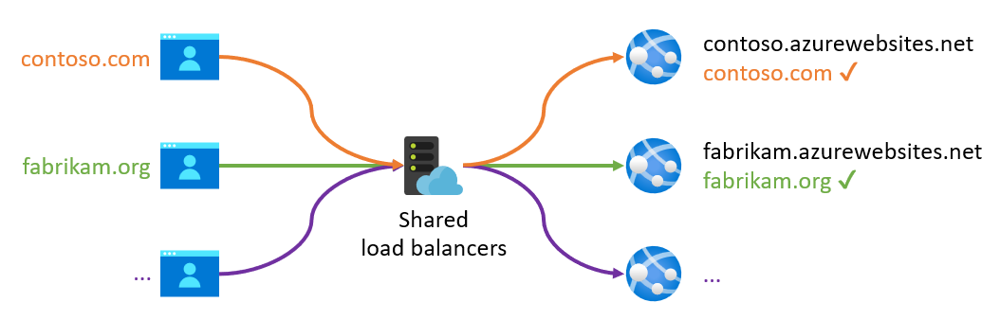
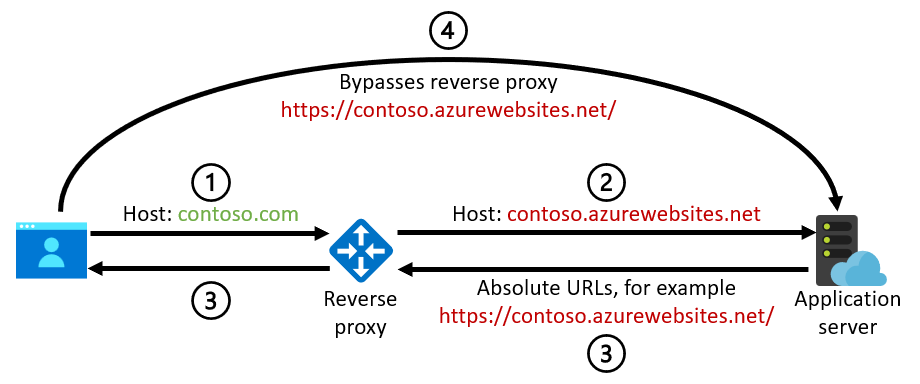
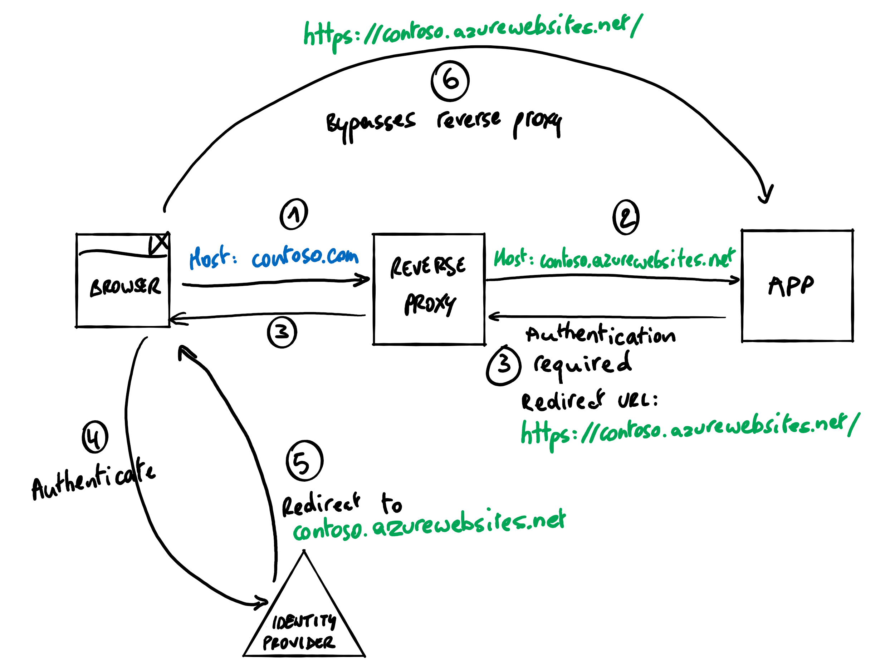
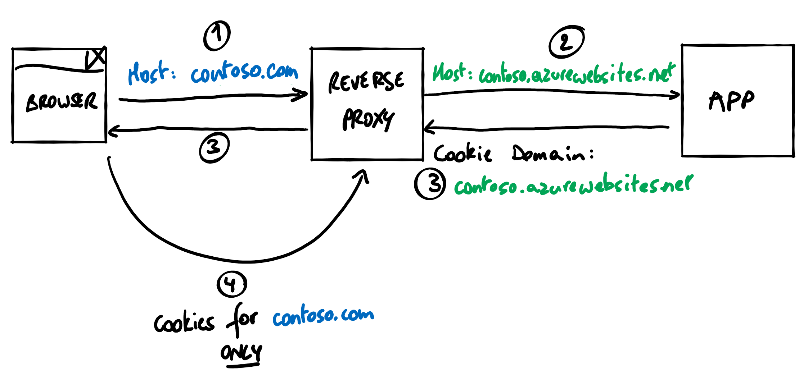
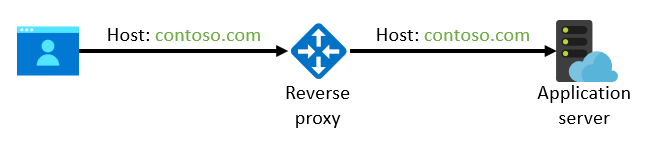

We recommend that you preserve the original HTTP host name when you use a reverse proxy in front of a web application. Having a different host name at the reverse proxy than the one that's provided to the back-end application server can lead to cookies or redirect URLs that don't work properly. For example, session state can get lost, authentication can fail, or back-end URLs can inadvertently be exposed to end users. You can avoid these problems by preserving the host name of the initial request so that the application server sees the same domain as the web browser.

This guidance applies especially to applications that are hosted in platform as a service (PaaS) offerings like [Azure App Service](/azure/app-service) and [Azure Spring Apps](/azure/spring-cloud). This article provides specific [implementation guidance](#implementation-guidance-for-common-azure-services) for [Azure Application Gateway](/azure/application-gateway), [Azure Front Door](/azure/frontdoor), and [Azure API Management](/azure/api-management), which are commonly used reverse proxy services.

> [!NOTE]
> Web APIs are generally less sensitive to the problems caused by host name mismatches. They don't usually depend on cookies, unless you [use cookies to secure communications between a single-page app and its back-end API](https://auth0.com/docs/manage-users/cookies/spa-authenticate-with-cookies), for example, in a pattern known as [Backends for Frontends](/azure/architecture/patterns/backends-for-frontends). Web APIs often don't return absolute URLs back to themselves, except in certain API styles, like [OData](https://www.odata.org/) and [HATEOAS](https://en.wikipedia.org/wiki/HATEOAS). If your API implementation depends on cookies or generates absolute URLs, the guidance provided in this article does apply.

If you require end-to-end TLS/SSL (the connection between the reverse proxy and the back-end service uses HTTPS), the back-end service also needs a matching TLS certificate for the original host name. This requirement adds operational complexity when you deploy and renew certificates, but many PaaS services offer free TLS certificates that are fully managed.

## Context

### The host of an HTTP request

In many cases, the application server or some component in the request pipeline needs the internet domain name that was used by the browser to access it. This is the *host* of the request. It can be an IP address, but usually it's a name like `contoso.com` (which the browser then resolves to an IP address by using DNS). The host value is typically determined from the [host component of the request URI](https://datatracker.ietf.org/doc/html/rfc3986#section-3.2.2), which the browser sends to the application as the [`Host` HTTP header](https://datatracker.ietf.org/doc/html/rfc2616#section-14.23).

> [!IMPORTANT]
> Never use the value of the host in a security mechanism. The value is provided by the browser or some other user agent and can easily be manipulated by an end user.

In some scenarios, especially when there's an HTTP reverse proxy in the request chain, the original host header can get changed before it reaches the application server. A reverse proxy closes the client network session and sets up a new connection to the back end. In this new session, it can either carry over the original host name of the client session or set a new one. In the latter case, the proxy often still sends the original host value in other HTTP headers, like [`Forwarded`](https://datatracker.ietf.org/doc/html/rfc7239#section-4) or [`X-Forwarded-Host`](https://developer.mozilla.org/docs/Web/HTTP/Headers/X-Forwarded-Host). This value allows applications to determine the original host name, but only if they're coded to read these headers.

### Why web platforms use the host name

Multitenant PaaS services often require a registered and validated host name in order to route an incoming request to the appropriate tenant's back-end server. This is because there's typically a shared pool of load balancers that accept incoming requests for all tenants. The tenants commonly use the incoming host name to look up the correct back end for the customer tenant.

To make it easy to get started, these platforms typically provide a default domain that's preconfigured to route traffic to your deployed instance. For App Service, this default domain is `azurewebsites.net`. Each web app that you create gets its own subdomain, for example, `contoso.azurewebsites.net`. Similarly, the default domain is `azuremicroservices.io` for Spring Apps and `azure-api.net` for API Management.

For production deployments, you don't use these default domains. You instead provide your own domain to align with your organization or application's brand. For example, `contoso.com` could resolve behind the scenes to the `contoso.azurewebsites.net` web app on App Service, but this domain shouldn't be visible to an end user visiting the website. This custom `contoso.com` host name has to be registered with the PaaS service, however, so the platform can identify the back-end server that should respond to the request.



### Why applications use the host name

Two common reasons that an application server needs the host name are to construct absolute URLs and to issue cookies for a specific domain. For example, when the application code needs to:

- Return an absolute rather than a relative URL in its HTTP response (although generally websites tend to render relative links when possible).
- Generate a URL to be used outside of its HTTP response where relative URLs can't be used, like for emailing a link to the website to a user.
- Generate an absolute redirect URL for an external service. For example, to an authentication service like Azure Active Directory (Azure AD) to indicate where it should return the user after successful authentication.
- Issue HTTP cookies that are restricted to a certain host, as defined in the cookie's [`Domain` attribute](https://datatracker.ietf.org/doc/html/rfc6265#section-5.2.3).

You can meet all these requirements by adding the expected host name to the application's configuration and using that statically defined value instead of the incoming host name on the request. However, this approach complicates application development and deployment. Also, a single installation of the application can serve multiple hosts. For example, a single web app can be used for multiple application tenants that all have their own unique host names (like `tenant1.contoso.com` and `tenant2.contoso.com`).

And sometimes the incoming host name is used by components outside of the application code or in middleware on the application server over which you don't have full control. Here are some examples:

- In App Service, you can [enforce HTTPS](/azure/app-service/configure-ssl-bindings#enforce-https) for your web app. Doing so causes any HTTP requests that aren't secure to redirect to HTTPS. In this case, the incoming host name is used to generate the absolute URL for the HTTP redirect's `Location` header.
- Spring Apps uses a similar feature to [enforce HTTPS](/azure/spring-cloud/tutorial-custom-domain#enforce-https). It also uses the incoming host to generate the HTTPS URL.
- App Service has an [ARR affinity setting](/azure/app-service/configure-common#configure-general-settings) to enable sticky sessions, so that requests from the same browser instance are always served by the same back-end server. This is performed by the App Service front ends, which add a cookie to the HTTP response. The cookie's `Domain` is set to the incoming host.
- App Service provides [authentication and authorization capabilities](/azure/app-service/overview-authentication-authorization) to easily allow users to sign in and access data in APIs.
  - The incoming host name is used to construct the redirect URL to which the identity provider needs to return the user after successful authentication.
  - [Enabling this feature by default also turns on HTTP-to-HTTPS redirection](/azure/app-service/overview-authentication-authorization#considerations-for-using-built-in-authentication). Again, the incoming host name is used to generate the redirect location.

### Why you might be tempted to override the host name

Say you create a web application in App Service that has a default domain of `contoso.azurewebsites.net`. (Or in another service like Spring Apps.) You haven't configured a custom domain on App Service. To put a reverse proxy like Application Gateway (or any similar service) in front of this application, you set the DNS record for `contoso.com` to resolve to the IP address of Application Gateway. It therefore receives the request for `contoso.com` from the browser and is configured to forward that request to the IP address that `contoso.azurewebsites.net` resolves to: this is the final back-end service for the requested host. In this case, however, App Service doesn't recognize the `contoso.com` custom domain and rejects all incoming requests for this host name. It can't determine where to route the request.

It might seem like the easy way to make this configuration work is to override or rewrite the `Host` header of the HTTP request in Application Gateway and set it to the value of `contoso.azurewebsites.net`. If you do, the outgoing request from Application Gateway makes it seem like the original request was really intended for `contoso.azurewebsites.net` instead of `contoso.com`:


At this point, App Service does recognize the host name, and it accepts the request without requiring that a custom domain name be configured. In fact, [Application Gateway makes it easy to override the host header](/azure/application-gateway/configuration-http-settings#pick-host-name-from-back-end-address) with the host of the back-end pool. [Azure Front Door even does so by default](/azure/frontdoor/front-door-backend-pool#backend-host-header).

The problem with this solution, however, is that it can result in various problems when the app doesn't see the original host name.

## Potential problems

### Incorrect absolute URLs

If the original host name isn't preserved and the application server uses the incoming host name to generate absolute URLs, the back-end domain might be disclosed to an end user. These absolute URLs could be generated by the application code or, as noted earlier, by platform features like the support for HTTP-to-HTTPS redirection in App Service and Spring Apps. This diagram illustrates the problem:



1. The browser sends a request for `contoso.com` to the reverse proxy.
2. The reverse proxy rewrites the host name to `contoso.azurewebsites.net` in the request to the back-end web application (or to a similar default domain for another service).
3. The application generates an absolute URL that's based on the incoming `contoso.azurewebsites.net` host name, for example, `https://contoso.azurewebsites.net/`.
4. The browser follows this URL, which goes directly to the back-end service rather than back to the reverse proxy at `contoso.com`.

This might even pose a security risk in the common case where the reverse proxy also serves as a web application firewall. The user receives a URL that goes straight to the back-end application and bypasses the reverse proxy.

> [!IMPORTANT]
> Because of this security risk, you need to ensure that the back-end web application only directly accepts network traffic from the reverse proxy (for example, by using [access restrictions in App Service](/azure/app-service/app-service-ip-restrictions)). If you do, even if an incorrect absolute URL is generated, at least it doesn't work and can't be used by a malicious user to bypass the firewall.

### Incorrect redirect URLs

A common and more specific case of the previous scenario occurs when absolute redirect URLs are generated. These URLs are required by identity services like Azure AD when you use browser-based identity protocols like OpenID Connect, OAuth 2.0, or SAML 2.0. These redirect URLs could be generated by the application server or middleware itself, or, as noted earlier, by platform features like the App Service [authentication and authorization capabilities](/azure/app-service/overview-authentication-authorization). This diagram illustrates the problem: 



1. The browser sends a request for `contoso.com` to the reverse proxy.
2. The reverse proxy rewrites the host name to `contoso.azurewebsites.net` on the request to the back-end web application (or to a similar default domain for another service).
3. The application generates an absolute redirect URL that's based on the incoming `contoso.azurewebsites.net` host name, for example, `https://contoso.azurewebsites.net/`.
4. The browser goes to the identity provider to authenticate the user. The request includes the generated redirect URL to indicate where to return the user after successful authentication.
5. Identity providers typically require redirect URLs to be registered up front, so at this point the identity provider should reject the request because the provided redirect URL isn't registered. (It wasn't supposed to be used.) If for some reason the redirect URL is registered, however, the identity provider redirects the browser to the redirect URL that's specified in the authentication request. In this case, the URL is `https://contoso.azurewebsites.net/`.
6. The browser follows this URL, which goes directly to the back-end service rather than back to the reverse proxy.

### Broken cookies

A host name mismatch can also lead to problems when the application server issues cookies and uses the incoming host name to construct the [`Domain` attribute of the cookie](https://datatracker.ietf.org/doc/html/rfc6265#section-5.2.3). The Domain attribute ensures that the cookie will be used only for that specific domain. These cookies can be generated by the application code or, as noted earlier, by platform features like the App Service [ARR affinity setting](/azure/app-service/configure-common#configure-general-settings). This diagram illustrates the problem: 



1. The browser sends a request for `contoso.com` to the reverse proxy.
2. The reverse proxy rewrites the host name to be `contoso.azurewebsites.net` in the request to the back-end web application (or to a similar default domain for another service).
3. The application generates a cookie that uses a domain based on the incoming `contoso.azurewebsites.net` host name. The browser stores the cookie for this specific domain rather than the `contoso.com` domain that the user is actually using.
4. The browser doesn't include the cookie on any subsequent request for `contoso.com` because the cookie's `contoso.azurewebsites.net` domain doesn't match the domain of the request. The application doesn't receive the cookie it issued earlier. As a consequence, the user might lose state that's supposed to be in the cookie, or features like ARR affinity don't work. Unfortunately, none of these problems generate an error or are directly visible to the end user. That makes them difficult to troubleshoot.

## Implementation guidance for common Azure services

To avoid the potential problems discussed here, we recommend that you preserve the original host name in the call between the reverse proxy and the back-end application server:



### Back-end configuration

Many web hosting platforms require that you explicitly configure the allowed incoming host names. The following sections describe how to implement this configuration for the most common Azure services. Other platforms usually provide similar methods for configuring custom domains.

If you host your web application in **App Service**, you can [attach a custom domain name to the web app](/azure/app-service/app-service-web-tutorial-custom-domain) and avoid using the default `azurewebsites.net` host name towards the back end. You don't need to change your DNS resolution when you attach a custom domain to the web app: you can [verify the domain by using a `TXT` record](/azure/app-service/manage-custom-dns-migrate-domain#create-domain-verification-record) without affecting your regular `CNAME` or `A` records. (These records will still resolve to the IP address of the reverse proxy.) If you require end-to-end TLS/SSL, you can [import an existing certificate from Key Vault](/azure/app-service/configure-ssl-certificate#import-a-certificate-from-key-vault) or use an [App Service Certificate](/azure/app-service/configure-ssl-certificate#buy-and-import-app-service-certificate) for your custom domain. (Note that the free [App Service managed certificate](/azure/app-service/configure-ssl-certificate#create-a-free-managed-certificate) can't be used in this case, as it requires the domain's DNS record to resolve directly to App Service, not the reverse proxy.)

Similarly, if you're using **Spring Apps**, you can [use a custom domain for your app](/azure/spring-cloud/tutorial-custom-domain) to avoid using the `azuremicroservices.io` host name. You can import an existing or self-signed certificate if you require end-to-end TLS/SSL.

If you have a reverse proxy in front of **API Management** (which itself also acts as a reverse proxy), you can [configure a custom domain on your API Management instance](/azure/api-management/configure-custom-domain) to avoid using the `azure-api.net` host name. You can import an existing or free managed certificate if you require end-to-end TLS/SSL. As noted previously, however, APIs are less sensitive to the problems caused by host name mismatches, so this configuration might not be as important.

If you host your applications on **other platforms**, like on Kubernetes or directly on virtual machines, there's no built-in functionality that depends on the incoming host name. You're responsible for how the host name is used in the application server itself. The recommendation to preserve the host name typically still applies for any components in your application that depend on it, unless you specifically make your application aware of reverse proxies and respect the [`forwarded`](https://datatracker.ietf.org/doc/html/rfc7239#section-4) or [`X-Forwarded-Host`](https://developer.mozilla.org/docs/Web/HTTP/Headers/X-Forwarded-Host) headers, for example.

### Reverse proxy configuration

When you define the back ends within the reverse proxy, you can still use the default domain of the back-end service, for example, `https://contoso.azurewebsites.net/`. This URL is used by the reverse proxy to resolve the correct IP address for the back-end service. If you use the platform's default domain, the IP address is always guaranteed to be correct. You typically can't use the public-facing domain, like `contoso.com`, because it should resolve to the IP address of the reverse proxy itself. (Unless you use more advanced DNS resolution techniques, like [split-horizon DNS](/azure/dns/private-dns-scenarios#scenario-split-horizon-functionality)).

> [!IMPORTANT]
> If you have a next-generation firewall like [Azure Firewall Premium](/azure/firewall/premium-features) between the reverse proxy and the final back end, you might need to use split-horizon DNS. This type of firewall might explicitly check whether the HTTP `Host` header resolves to the target IP address. In these cases, the original host name that's used by the browser should resolve to the IP address of the reverse proxy when it's accessed from the public internet. From the point of view of the firewall, however, that host name should resolve to the IP address of the final back-end service. For more information, see [Zero-trust network for web applications with Azure Firewall and Application Gateway](../example-scenario/gateway/application-gateway-before-azure-firewall.yml#azure-firewall-premium-and-name-resolution).

Most reverse proxies allow you to configure which host name is passed to the back-end service. The following information explains how to ensure, for the most common Azure services, that the original host name of the incoming request is used.

> [!NOTE]
> In all cases, you can also choose to override the host name with an explicitly defined custom domain rather than taking it from the incoming request. If the application uses only a single domain, that approach might work fine. If the same application deployment accepts requests from multiple domains (for example, in multitenant scenarios), you can't statically define a single domain. You should take the host name from the incoming request (again, unless the application is explicitly coded to take additional HTTP headers into account). Therefore, the general recommendation is that you shouldn't override the host name at all. Pass the incoming host name unmodified to the back end.

#### Application Gateway

If you use [Application Gateway](/azure/application-gateway) as the reverse proxy, you can ensure that the original host name is preserved by disabling **Override with new host name** on the back-end HTTP setting. Doing so disables both [Pick host name from back-end address](/azure/application-gateway/configuration-http-settings#pick-host-name-from-back-end-address) and [Override with specific domain name](/azure/application-gateway/configuration-http-settings#host-name-override). (Both of these settings override the host name.) In the [Azure Resource Manager properties for Application Gateway](/azure/templates/microsoft.network/applicationgateways), this configuration corresponds to setting the `hostName` property to `null` and `pickHostNameFromBackendAddress` to `false`.

Because health probes are sent outside the context of an incoming request, they can't dynamically determine the correct host name. Instead, you have to create a custom health probe, disable **Pick host name from backend HTTP settings**, and [explicitly specify the host name](/azure/application-gateway/application-gateway-probe-overview#custom-health-probe-settings). For this host name, you should also use an appropriate custom domain, for consistency. (You could, however, use the default domain of the hosting platform here, because health probes ignore incorrect cookies or redirect URLs in the response.)

#### Azure Front Door

If you use [Azure Front Door](/azure/frontdoor), you can avoid overriding the host name by leaving the [back-end host header](/azure/frontdoor/front-door-backend-pool#backend-host-header) blank in the back-end pool definition. In the [Resource Manager definition of the back-end pool](/azure/templates/microsoft.network/frontdoors), this configuration corresponds to setting `backendHostHeader` to `null`.

If you use [Azure Front Door Standard or Premium](/azure/frontdoor/standard-premium), you can preserve the host name by leaving the [origin host header](/azure/frontdoor/standard-premium/concept-origin#origin-host-header) blank in the origin definition. In the [Resource Manager definition of the origin](/azure/templates/microsoft.cdn/profiles/origingroups/origins#afdoriginproperties), this configuration corresponds to setting `originHostHeader` to `null`.

#### API Management

By default, [API Management](/azure/api-management) overrides the host name that's sent to the back end with the host component of the API's web service URL (which corresponds to the `serviceUrl` value of the [Resource Manager definition of the API](/azure/templates/microsoft.apimanagement/2021-08-01/service/apis)).

You can force API Management to instead use the host name of the incoming request by adding an `inbound` [Set HTTP header](/azure/api-management/api-management-transformation-policies#SetHTTPheader) policy, as follows:

```xml
<inbound>
  <base />
  <set-header name="Host" exists-action="override">
    <value>@(context.Request.OriginalUrl.Host)</value>
  </set-header>
</inbound>
```

As noted previously, however, APIs are less sensitive to the problems caused by host name mismatches, so this configuration might not be as important.

## Next steps

- [App Service](/azure/app-service)
- [Spring Apps](/azure/spring-cloud)
- [Application Gateway](/azure/application-gateway)
- [Azure Front Door](/azure/frontdoor)
- [API Management](/azure/api-management)

## Related resources

- [Zero-trust network for web applications with Azure Firewall and Application Gateway](/azure/architecture/example-scenario/gateway/application-gateway-before-azure-firewall)
- [Protect APIs with Application Gateway and API Management](/azure/architecture/reference-architectures/apis/protect-apis)
- [Enterprise deployment using App Services Environment](/azure/architecture/web-apps/app-service-environment/architectures/ase-standard-deployment)
