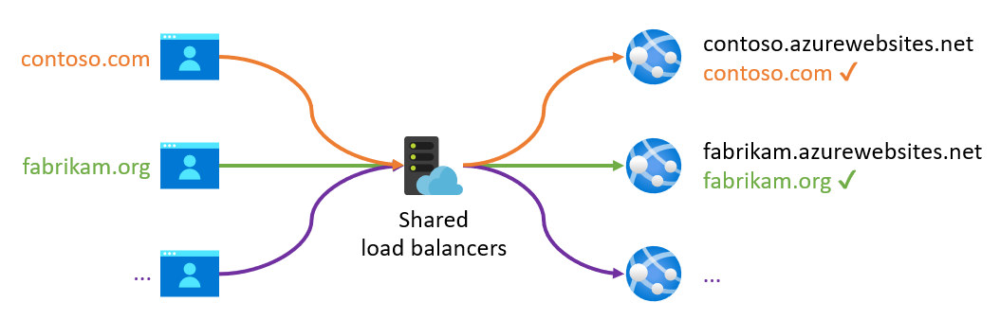
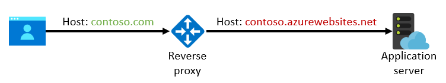
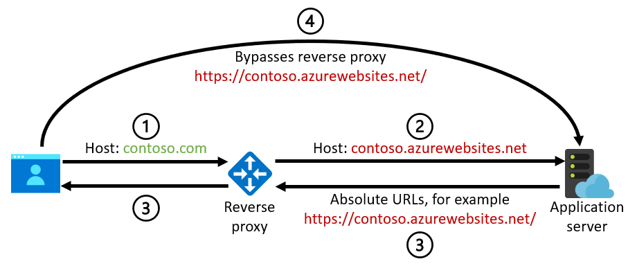
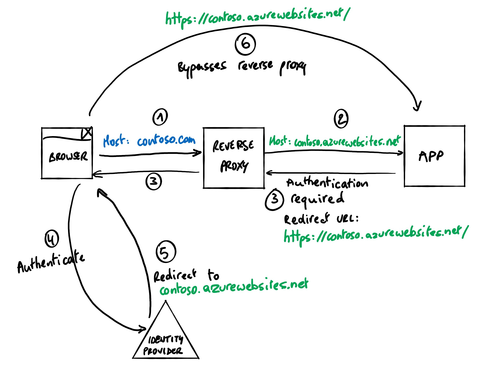
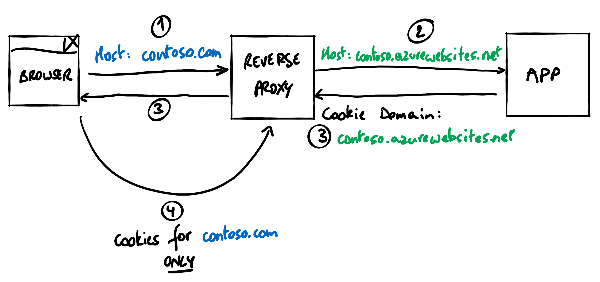
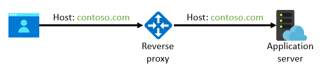

# Preserve the original HTTP host name between a reverse proxy and its back-end web application

We recommend that you preserve the original HTTP host name when you use a reverse proxy in front of a web application. If you use a different host name at the reverse proxy, cookies or redirect URLs might not work properly. For example, session state might get lost, authentication might fail, or back-end URLs might inadvertently be exposed to users. By preserving the host name of the initial request, the application server sees the same domain as the web browser.

This guidance applies especially to applications that are hosted in platform as a service (PaaS) offerings like [Azure App Service](/azure/app-service) and [Azure Container Apps](/azure/container-apps). This article provides specific [implementation guidance](#implementation-guidance-for-common-azure-services) for commonly used reverse proxy services, including [Azure Application Gateway](/azure/application-gateway), [Azure Front Door](/azure/frontdoor), and [Azure API Management](/azure/api-management).

> [!NOTE]
> Web APIs are less sensitive to host name mismatches. Web APIs don't usually depend on cookies unless you [use cookies to secure communications between a single-page app and its back-end API](https://auth0.com/docs/manage-users/cookies/spa-authenticate-with-cookies), for example, in the [Backends for Frontends pattern](/azure/architecture/patterns/backends-for-frontends). Web APIs often don't return absolute URLs back to themselves, except in certain API styles, like [Open Data Protocol (OData)](https://www.odata.org/) and [HATEOAS](https://wikipedia.org/wiki/HATEOAS). The guidance provided in this article applies in scenarios where your API implementation depends on cookies or generates absolute URLs.

If you require end-to-end Transport Layer Security/Secure Sockets Layer (TLS/SSL), or the connection between the reverse proxy and the back-end service uses HTTPS, the back-end service also needs a matching TLS certificate for the original host name. This requirement adds operational complexity when you deploy and renew certificates, but many PaaS services provide free TLS certificates that are fully managed.

## HTTP request host

In many cases, the application server or a component in the request pipeline needs the internet domain name that the browser used to access it. This domain name is the *host* of the request. The host can be an IP address, but usually it's a name like `contoso.com`, which the browser then resolves to an IP address by using Domain Name System (DNS). The host value is typically determined from the [host component of the request URI](https://datatracker.ietf.org/doc/html/rfc3986#section-3.2.2), which the browser sends to the application as the [`Host` HTTP header](https://datatracker.ietf.org/doc/html/rfc9110#field.host).

> [!IMPORTANT]
> Never use the value of the host in a security mechanism. The browser or another user agent provide the value, and a user can change it.

In some scenarios, especially when there's an HTTP reverse proxy in the request chain, the original host header might change before it reaches the application server. A reverse proxy closes the client network session and sets up a new connection to the back end. In this new session, the reverse proxy can either carry over the original host name of the client session, or it can set a new one. If the reverse proxy sets a new host name, the proxy often sends the original host value too, in other HTTP headers, like [`Forwarded`](https://datatracker.ietf.org/doc/html/rfc7239#section-4) or [`X-Forwarded-Host`](https://developer.mozilla.org/docs/Web/HTTP/Reference/Headers/X-Forwarded-Host). Including this value allows applications to determine the original host name, but only if they're coded to read these headers.

## Why web platforms use the host name

Multitenant PaaS services often require a registered and validated host name to route an incoming request to the correct tenant's back-end server. This is because there's typically a shared pool of load balancers that accept incoming requests for all tenants. The tenants commonly use the incoming host name to look up the correct back end for the customer tenant.

To make it easy to get started, these platforms typically provide a default domain that's preconfigured to route traffic to your deployed instance. For App Service, this default domain is `azurewebsites.net`. Each web app that you create gets its own subdomain, for example, `contoso.azurewebsites.net`. Similarly, the default domain is `azurecontainerapps.io` for Azure Container Apps and `azure-api.net` for API Management.

Production deployments don't use these default domains. Instead, provide your own domain to align with your organization, or your application's brand. For example, `contoso.com` might resolve to the `contoso.azurewebsites.net` web app on App Service, but this domain shouldn't be visible to an end user visiting the website. However, this custom `contoso.com` host name has to be registered with the PaaS service so the platform can identify the back-end server that should respond to the request.



## Why applications use the host name

Application servers might need the host name to construct absolute URLs or to issue cookies for a specific domain. In these scenarios, the application code might need to:

- Return an absolute URL, rather than a relative URL, in its HTTP response (although websites generally render relative links).
- Generate a URL to be used outside of its HTTP response where relative URLs can't be used, for example, when emailing a website link to a user.
- Generate an absolute redirect URL for an external service. For example, an absolute redirect URL for an authentication service like Microsoft Entra ID might indicate where it returns the user after successful authentication.
- Issue HTTP cookies that are restricted to a specific host, as defined in the cookie's [`Domain` attribute](https://datatracker.ietf.org/doc/html/rfc6265#section-5.2.3).

Meet these requirements by adding the expected host name to the application's configuration and by using that statically defined value instead of the incoming host name on the request. But this approach complicates application development and deployment. Also, a single installation of the application can serve multiple hosts. For example, a single web app can be used for multiple application tenants that have their own unique host names, like `tenant1.contoso.com` and `tenant2.contoso.com`.

Sometimes the incoming host name is used by components outside the application code or in middleware on the application server, and you might not have full control. Here are some examples:

- In App Service, [enforce HTTPS](/azure/app-service/configure-common#configure-general-settings) for your web app. This approach redirects unsecured HTTP requests to HTTPS. In this case, the incoming host name is used to generate the absolute URL for the HTTP redirect's `Location` header.
- Azure Container Apps can [redirect HTTP requests to HTTPS](/azure/container-apps/ingress-how-to) and use the incoming host to generate the HTTPS URL.
- App Service has an [ARR affinity setting](/azure/app-service/configure-common#configure-general-settings) that provides sticky sessions, which ensure that requests from the same browser session route to the same back-end server. The App Service front ends add a cookie to the HTTP response. The cookie's `Domain` is set to the incoming host.
- App Service provides [authentication and authorization capabilities](/azure/app-service/overview-authentication-authorization) so that users can sign in and access data in APIs.
  - The incoming host name is used to construct the redirect URL, which indicates where the identity provider returns the user after authentication.
  - When you turn this feature on, it also turns on [HTTP-to-HTTPS redirection](/azure/app-service/overview-authentication-authorization#considerations-for-using-built-in-authentication). The incoming host name is used to generate the redirect location.

## Reasons to override the host name

When you create a web application in App Service, or a similar service like Azure Container Apps, with a default domain of `contoso.azurewebsites.net`, you don't configure a custom domain on App Service. To put a reverse proxy, like Application Gateway, in front of this application, you set the DNS record for `contoso.com` to resolve to the IP address of Application Gateway. Application Gateway receives the request for `contoso.com` from the browser and forwards it to the App Service endpoint at `contoso.azurewebsites.net`. App Service is the final back-end service for the requested host. App Service doesn't recognize the `contoso.com` custom domain, so it rejects all incoming requests for this host name. It can't determine where to route the request.

To make this configuration work, you might consider overriding or rewriting the `Host` header of the HTTP request in Application Gateway and setting it to the value of `contoso.azurewebsites.net`. But if you do this approach, the outgoing request from Application Gateway makes it appear like the original request is intended for `contoso.azurewebsites.net` instead of `contoso.com`.



App Service now recognizes the host name and accepts the request without needing a custom domain name to be configured.  [Application Gateway makes it easy to override the host header](/azure/application-gateway/configuration-http-settings#pick-host-name-from-backend-address) with the host of the back-end pool. [Azure Front Door does this process by default](/azure/frontdoor/origin#origin-host-header). But this solution can cause problems when the app doesn't see the original host name.

## Potential problems

The following sections describe common problems that can arise when the original HTTP host name isn't preserved between a reverse proxy and the back-end application.

### Incorrect absolute URLs

If the original host name isn't preserved, and the application server uses the incoming host name to generate absolute URLs, the back-end domain might be disclosed to a user. These absolute URLs are generated by the application code or by platform features like the support for HTTP-to-HTTPS redirection in App Service and Azure Container Apps. The following diagram illustrates the problem.



1. The browser sends a request for `contoso.com` to the reverse proxy.
1. The reverse proxy rewrites the host name to `contoso.azurewebsites.net` in the request to the back-end web application, or to a similar default domain for another service.
1. The application generates an absolute URL that's based on the incoming `contoso.azurewebsites.net` host name, for example, `https://contoso.azurewebsites.net/`.
1. The browser follows this URL, which goes directly to the back-end service rather than back to the reverse proxy at `contoso.com`.

This behavior might pose a security risk where the reverse proxy also serves as a web application firewall. The user receives a URL that goes straight to the back-end application and bypasses the reverse proxy.

> [!IMPORTANT]
> To mitigate this security risk, ensure that the back-end web application directly accepts network traffic only from the reverse proxy. For example, you can use [access restrictions in App Service](/azure/app-service/app-service-ip-restrictions) so that even if an incorrect absolute URL is generated, it doesn't work. A malicious user can't use the URL to bypass the firewall.

### Incorrect redirect URLs

A more specific case of the previous scenario occurs when absolute redirect URLs are generated. Identity services like Microsoft Entra ID require these URLs when you use browser-based identity protocols like OpenID Connect (OIDC), Open Authorization (OAuth) 2.0, or Security Assertion Markup Language (SAML) 2.0. These redirect URLs might be generated by the application server or middleware or by platform features like the App Service [authentication and authorization capabilities](/azure/app-service/overview-authentication-authorization). The following diagram illustrates the problem.



1. The browser sends a request for `contoso.com` to the reverse proxy.
2. The reverse proxy rewrites the host name to `contoso.azurewebsites.net` on the request to the back-end web application or to a similar default domain for another service.
3. The application generates an absolute redirect URL that's based on the incoming `contoso.azurewebsites.net` host name, for example, `https://contoso.azurewebsites.net/`.
4. The browser goes to the identity provider to authenticate the user. The request includes the generated redirect URL to indicate where to return the user after successful authentication.
5. Identity providers typically require redirect URLs to be registered up front. The identity provider should reject the request because the provided redirect URL isn't registered. If the redirect URL is registered, the identity provider redirects the browser to the redirect URL that's specified in the authentication request. In this case, the URL is `https://contoso.azurewebsites.net/`.
6. The browser follows this URL, which goes directly to the back-end service rather than back to the reverse proxy.

### Broken cookies

A host name mismatch can also cause problems when the application server issues cookies and uses the incoming host name to construct the [`Domain` attribute of the cookie](https://datatracker.ietf.org/doc/html/rfc6265#section-5.2.3). The `Domain` attribute ensures that the cookie is used only for that specific domain. These cookies are generated by the application code or by platform features like the App Service [ARR affinity setting](/azure/app-service/configure-common#configure-general-settings). The following diagram illustrates the problem.



1. The browser sends a request for `contoso.com` to the reverse proxy.
2. The reverse proxy rewrites the host name to be `contoso.azurewebsites.net` in the request to the back-end web application, or to a similar default domain for another service.
3. The application generates a cookie that uses a domain based on the incoming `contoso.azurewebsites.net` host name. The browser stores the cookie for this specific domain rather than the `contoso.com` domain that the user is using.
4. The browser doesn't include the cookie on any subsequent request for `contoso.com`, because the cookie's `contoso.azurewebsites.net` domain doesn't match the domain of the request. The application doesn't receive the cookie it issued earlier. Now, the user might lose state that should be in the cookie, and features like ARR affinity might not work. These problems don't generate an error and aren't directly visible to the end user, which makes them difficult to troubleshoot.

## Implementation guidance for common Azure services

To avoid these potential problems, we recommend that you preserve the original host name in the call between the reverse proxy and the back-end application server:



### Back-end configuration

Many web hosting platforms require that you explicitly configure the allowed incoming host names. The following sections describe how to implement this configuration for the most common Azure services. Other platforms usually provide similar methods for configuring custom domains.

If you host your web application in **App Service**, [attach a custom domain name to the web app](/azure/app-service/app-service-web-tutorial-custom-domain) and avoid using the default `azurewebsites.net` host name toward the back end. You don't need to change your DNS resolution when you attach a custom domain to the web app. Instead, [verify the domain by using a `TXT` record](/azure/app-service/manage-custom-dns-migrate-domain#2-create-the-dns-records) without affecting your regular `CNAME` or `A` records. These records still resolve to the IP address of the reverse proxy. If you require end-to-end TLS/SSL, [import an existing certificate from Key Vault](/azure/app-service/configure-ssl-certificate#import-a-certificate-from-key-vault) or use an [App Service Certificate](/azure/app-service/configure-ssl-certificate#import-an-app-service-certificate) for your custom domain. In this case, the free [App Service managed certificate](/azure/app-service/configure-ssl-certificate#create-a-free-managed-certificate) can't be used, because it requires the domain's DNS record, not the reverse proxy, to resolve directly to App Service.

If you're using **Azure Container Apps**, [use a custom domain for your app](/azure/container-apps/custom-domains-certificates) to avoid using the `azurecontainerapps.io` host name. Use a [managed certificate](/azure/container-apps/custom-domains-managed-certificates) or import an existing certificate.

If you have a reverse proxy in front of **API Management**, which also acts as a reverse proxy, [configure a custom domain on your API Management instance](/azure/api-management/configure-custom-domain) to avoid using the `azure-api.net` host name. If you require end-to-end TLS/SSL, import an existing or free managed certificate. However, APIs are less sensitive to the problems caused by host name mismatches, so this configuration might not be as important.

If you host your applications on **other platforms**, like on Kubernetes or directly on virtual machines, there's no built-in functionality that depends on the incoming host name. You're responsible for how the host name is used in the application server. The recommendation to preserve the host name still applies for any components in your application that depend on it, unless you specifically make your application aware of reverse proxies and respect the [`forwarded`](https://datatracker.ietf.org/doc/html/rfc7239#section-4) or [`X-Forwarded-Host`](https://developer.mozilla.org/docs/Web/HTTP/Reference/Headers/X-Forwarded-Host) headers, for example.

### Reverse proxy configuration

When you define the back ends within the reverse proxy, you can still use the default domain of the back-end service, for example, `https://contoso.azurewebsites.net/`. This URL is used by the reverse proxy to resolve the correct IP address for the back-end service. If you use the platform's default domain, the IP address is guaranteed to be correct. You usually can't use the public-facing domain, like `contoso.com`, because it should resolve to the IP address of the reverse proxy itself. (Unless you use more advanced DNS resolution techniques, like [Split-horizon DNS](/azure/dns/private-dns-scenarios#scenario-split-horizon-functionality)).

> [!IMPORTANT]
> If you have a next-generation firewall like [Azure Firewall Premium](/azure/firewall/premium-features) between the reverse proxy and the final back end, you might need to use split-horizon DNS. This type of firewall might explicitly check whether the HTTP `Host` header resolves to the target IP address. In these cases, the original host name that's used by the browser should resolve to the IP address of the reverse proxy when it's accessed from the public internet. However, from the point of view of the firewall, that host name should resolve to the IP address of the final back-end service. For more information, see [Zero-trust network for web applications with Azure Firewall and Application Gateway](../example-scenario/gateway/application-gateway-before-azure-firewall.md#azure-firewall-premium-and-name-resolution).

Most reverse proxies allow you to configure which host name is passed to the back-end service. The following information explains how to ensure, for the most common Azure services, that the original host name of the incoming request is used.

> [!NOTE]
> You can also choose to override the host name with an explicitly defined custom domain, rather than taking it from the incoming request. If the application uses only a single domain, that approach might work fine. If the same application deployment accepts requests from multiple domains, for example, in multitenant scenarios, you can't statically define a single domain. Take the host name from the incoming request, unless the application is explicitly coded to take additional HTTP headers into account. In most cases, you shouldn't override the host name at all. Pass the incoming host name unmodified to the back end.

Whether you preserve or override the host name in the reverse proxy, ensure that the [back-end server is configured](#back-end-configuration) to accept the request in your format.

#### Application Gateway

If you use Application Gateway as the reverse proxy, ensure that the original host name is preserved by disabling **Override with new host name** on the back-end HTTP setting. This disables the [Pick host name from back-end address](/azure/application-gateway/configuration-http-settings#pick-host-name-from-backend-address) and [Override with specific domain name](/azure/application-gateway/configuration-http-settings#host-name-override) settings, which both override the host name. In the [Azure Resource Manager properties for Application Gateway](/azure/templates/microsoft.network/applicationgateways), this configuration corresponds to setting the `hostName` property to `null` and `pickHostNameFromBackendAddress` to `false`.

Because health probes are sent outside the context of an incoming request, they can't dynamically determine the correct host name. Instead, create a custom health probe, disable **Pick host name from backend HTTP settings**, and [explicitly specify the host name](/azure/application-gateway/application-gateway-probe-overview#custom-health-probe-settings). For this host name, use an appropriate custom domain for consistency. Alternatively, use the default domain of the hosting platform here, because health probes ignore incorrect cookies or redirect URLs in the response.

If the host name isn't preserved and you need to diagnose the resulting problems, see [Troubleshoot redirection to App Service URL](/azure/application-gateway/troubleshoot-app-service-redirection-app-service-url). If you can't fully preserve the host name, evaluate if [HTTP header and URL rewrites](/azure/application-gateway/troubleshoot-app-service-redirection-app-service-url#workaround-rewrite-the-location-header) should be used as a partial workaround.

#### Azure Front Door

If you use Azure Front Door, preserve the host name by leaving the [origin host header](/azure/frontdoor/origin#origin-host-header) blank in the origin definition. In the [Resource Manager definition of the origin](/azure/templates/microsoft.cdn/profiles/origingroups/origins#afdoriginproperties), this configuration corresponds to setting `originHostHeader` to `null`.

#### API Management

By default, API Management overrides the host name that's sent to the back end with the host component of the API's web service URL, which corresponds to the `serviceUrl` value of the [Resource Manager definition of the API](/azure/templates/microsoft.apimanagement/service/apis). Instead, force API Management to use the host name of the incoming request by adding an `inbound` [Set header](/azure/api-management/set-header-policy) policy, as follows:

```xml
<inbound>
  <base />
  <set-header name="Host" exists-action="override">
    <value>@(context.Request.OriginalUrl.Host)</value>
  </set-header>
</inbound>
```

APIs are less sensitive to the problems caused by host name mismatches, so this configuration might not be as important.

## Application configuration

Even when you preserve the original host name at the reverse proxy level, the reverse proxy still terminates the client's TLS connection. The new connection that the proxy establishes to the back end loses the original client IP address and HTTPS scheme. These values are typically forwarded through commonly used HTTP headers: `X-Forwarded-For` for the client IP address, `X-Forwarded-Proto` for the original scheme, and `X-Forwarded-Host` for the original host name. Your application must be configured to read these headers so that it can correctly determine the request scheme, client address, and original host information.

If your application framework doesn't process `X-Forwarded-Proto`, the application treats the back-end connection as plain HTTP, even though the end user connected over HTTPS. That misperception is the most common cause of infinite HTTP-to-HTTPS redirect loops. It can also result in insecure cookie flags or mixed-content errors.

Most web frameworks have a mechanism to process forwarded headers. Review your framework's documentation and configure it appropriately. The following examples cover common frameworks:

- **ASP.NET Core**: Use the [Forwarded Headers Middleware](/aspnet/core/host-and-deploy/proxy-load-balancer).
- **Java Spring Boot**: Set [`server.forward-headers-strategy` to `FRAMEWORK`](https://docs.spring.io/spring-boot/how-to/webserver.html#howto.webserver.use-behind-a-proxy-server) in your application properties.
- **Node.js Express**: Set [`app.set('trust proxy', <value>)`](https://expressjs.com/en/guide/behind-proxies.html).

> [!IMPORTANT]
> Only trust forwarded headers from known proxies. For example, configure [`KnownProxies` or `KnownNetworks`](/aspnet/core/host-and-deploy/proxy-load-balancer#forwarded-headers-middleware-options) to restrict which sources can set forwarded headers. Accepting forwarded headers from untrusted sources allows a client to spoof its IP address or original scheme.

## Next steps

Review the Well-Architected Framework service guides for the Azure services you use in your workload.

- [App Service](/azure/well-architected/service-guides/app-service-web-apps)
- [Azure Container Apps](/azure/well-architected/service-guides/azure-container-apps)
- [Application Gateway](/azure/well-architected/service-guides/azure-application-gateway)
- [Azure Front Door](/azure/well-architected/service-guides/azure-front-door)
- [API Management](/azure/well-architected/service-guides/azure-api-management)

## Related resources

- [Zero-trust network for web applications with Azure Firewall and Application Gateway](/azure/architecture/example-scenario/gateway/application-gateway-before-azure-firewall)
- [Protect APIs with Application Gateway and API Management](/azure/architecture/web-apps/api-management/architectures/protect-apis)
- [Enterprise deployment using App Service Environment](/azure/architecture/web-apps/app-service-environment/architectures/app-service-environment-standard-deployment)
