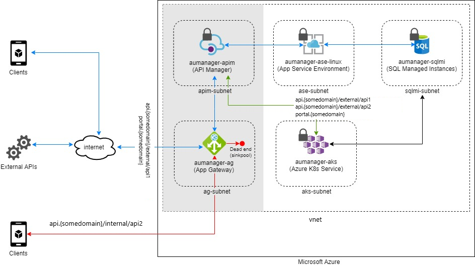

# Protecting APIs with Application Gateway and APIM

As companies evolve their internal applications adhering the API-first approach, and also, considering the fast growing number of threats that web application over the internet are likely to face, it is critical than never before, to have a security strategy in place to protect APIs.

Being restrictive on "from where", "somebody" can access "what" into an given API is the very first step towards security. This article is going to guide you through a suggestive approach for that matter.

To address the points mentioned above, we're leveraging two different Azure services: **Application Gateway (AG)** and **API Management (APIM)**.

## Architecture



Considerations about the architecture:

* AG level, we’re going to set up a mechanism of URL redirection that makes sure the request goes to the proper [backend pool](https://docs.microsoft.com/en-us/azure/application-gateway/application-gateway-components#backend-pools) depending on the “URL format” for the API's call.

* Basically, URLs formatted like `api.{some-domain}/external/*` will be able to reach out the backend to interact with the requested APIs. Calls formatted as `api.{some-domain}/*` will be redirected to a dead end (meaning, a backend pool with no target set up) by AG.

* Internal calls (the ones coming in from resources at the same Azure's VNet) will be accepted and properly mapped by APIM under `api.{some-domain}/internal/*`.

* Because this scenario assumes that developers must be able to manage APIs and its configurations both from internal and external environments, we are going to add a rule at the AG level to properly redirect users under `portal.{some-domain}/*`  to developer's portal.

Finally, at the APIM level, we will have our APIs set up to accept calls under the following patterns:

* `api.{some-domain}/external/*`
* `api.{some-domain}/internal/*`

### Components

- [Azure Resource Groups](https://docs.microsoft.com/en-us/azure/azure-resource-manager/management/manage-resource-groups-portal) is a logical container for Azure resources.  We use resource groups to organize everything related to this project in the Azure console.
  
- [Azure Virtual Networl (VNet)](https://docs.microsoft.com/en-us/azure/virtual-network/virtual-networks-overview) VNet enables many types of Azure resources, such as Azure Virtual Machines (VM), to securely communicate with each other, the internet, and on-premises networks.

- [Azure Application Gateway](https://docs.microsoft.com/en-us/azure/application-gateway/overview) Azure Application Gateway is a web traffic load balancer that enables you to manage traffic to your web applications. Traditional load balancers operate at the transport layer (OSI layer 4 - TCP and UDP) and route traffic based on source IP address and port, to a destination IP address and port.

- [Azure API Management](https://azure.microsoft.com/en-us/services/api-management/) API Management (APIM) is a way to create consistent and modern API gateways for existing back-end services.

### Alternatives

WAF and Firewall-wise, the same level or protection could be delivered by different combination of services in Azure. 

[Azure Front Door](https://docs.microsoft.com/en-us/azure/frontdoor/front-door-overview#:~:text=Azure%20Front%20Door%20is%20a,and%20widely%20scalable%20web%20applications.&text=Front%20Door%20provides%20a%20range,needs%20and%20automatic%20failover%20scenarios.), [Azure Firewall](https://docs.microsoft.com/en-us/azure/firewall/overview), third-part solutions like [Barracuda](https://azuremarketplace.microsoft.com/en-us/marketplace/apps/barracudanetworks.waf?tab=overview), and others available in [Azure Marketplace](https://azure.microsoft.com/en-us/marketplace/), are some of the options.


## Implementation considerations

* **VNet**. In order to communicate with private resources in the backend, both Application Gateway and API Management must be sitting at the same virtual network. This solution assumes you already have a VNet set up with your own resources. Additionally, two subnets are being created to hold up both AG and APIM.

* **Private (internal) deployment model**. That model will allow the implementahtion of APIM connected to an existing VNet, making it reachable from the inside of the network context only. In order to have this feature turned on, either "Development" or "Production" APIM's tiers have to be picked. 
  
* **Certificates**. PFX certificates are required for the SSL termination in AG. In order to get the solution in place, br advised you got to have them available  before hand.

* **CNAME records**. Additionally, CNAME entries could be leveraged to personalize the way people interact with those services.

### Availability, Scalability, and Security

> How do I need to think about managing, maintaining, and monitoring this long term?

> Are there any size considerations around this specific solution?
> What scale does this work at?
> At what point do things break or not make sense for this architecture?

> Are there any security considerations (past the typical) that I should know about this?

## Deployment

To get this solution deployed, it will be relying on PowerShell. [Azure Portal](https://docs.microsoft.com/en-us/azure/azure-portal/) and [Azure CLI](https://docs.microsoft.com/en-us/cli/azure/) are also available options to get to the same result.

### Deploying a new Resource Group

```
$resGroupName = "{resource-group-name}"
$location = "{azure-region}"
New-AzResourceGroup -Name $resGroupName -Location $location
```

### Adding subnets for APIM and AG

```
# Retriving VNet information
$vnet = Get-AzVirtualNetwork -Name {vnet-name}  -ResourceGroupName {resource-group-name}

# Adding appgtw-subnet to the existing VNet
$subnetAGConfig = Add-AzVirtualNetworkSubnetConfig `
-Name appgtw-subnet `
-AddressPrefix {subnet-prefix-address} `
-VirtualNetwork $vnet

# Adding apim-subnet to the existing VNet
$subnetAPIMConfig = Add-AzVirtualNetworkSubnetConfig `
  -Name apim-subnet `
  -AddressPrefix {subnet-prefix-address} `
  -VirtualNetwork $vnet

# Attaching subnets to the VNet
$vnet | Set-AzVirtualNetwork

# Making sure subnets were successfully added
$vnet.Subnets

# Assign subnet to variables
$appgatewaysubnetdata = $vnet.Subnets[subnet-index]
$apimsubnetdata = $vnet.Subnets[subnet-index]
```

### Deploying a new APIM

```
# Create an API Management VNET connected object
$apimVirtualNetwork = New-AzApiManagementVirtualNetwork -SubnetResourceId $apimsubnetdata.Id

# Create an APIM service inside the VNET
$apimServiceName = "{apim-name}"
$apimOrganization = "{organization-name}"
$apimAdminEmail = "{alias}@{somedomain}"

$apimService = New-AzApiManagement `
    -ResourceGroupName $resGroupName `
    -Location $location `
    -Name $apimServiceName `
    -Organization $apimOrganization `
    -AdminEmail $apimAdminEmail `
    -VirtualNetwork $apimVirtualNetwork `
    -VpnType "Internal" `
    -Sku "{apim-tier}"
```

### Configuring hostnames and certificates

```
# Specify cert configuration
$gatewayHostname = "api.{some-domain}"
$portalHostname = "portal.{some-domain}"
$gatewayCertCerPath = "{local-path-to-cer-certificate}"
$gatewayCertPfxPath = "{local-path-to-pfx-certificate}"
$portalCertPfxPath = "{local-path-to-pfx-certificate}"
$gatewayCertPfxPassword = "{cert-api-password}"
$portalCertPfxPassword = "{cert-portal-password}"

# Convert to secure string before send it over HTTP
$certPwd = ConvertTo-SecureString -String $gatewayCertPfxPassword -AsPlainText -Force
$certPortalPwd = ConvertTo-SecureString -String $portalCertPfxPassword -AsPlainText -Force

# Create and set the hostname configuration objects for the proxy and portal
$proxyHostnameConfig = New-AzApiManagementCustomHostnameConfiguration `
  -Hostname $gatewayHostname `
  -HostnameType Proxy `
  -PfxPath $gatewayCertPfxPath `
  -PfxPassword $certPwd
  
$portalHostnameConfig = New-AzApiManagementCustomHostnameConfiguration `
  -Hostname $portalHostname `
  -HostnameType Portal `
  -PfxPath $portalCertPfxPath `
  -PfxPassword $certPortalPwd

# Ties certificates confs into APIM service
$apimService.ProxyCustomHostnameConfiguration = $proxyHostnameConfig
$apimService.PortalCustomHostnameConfiguration = $portalHostnameConfig

# Updates the existing APIM with the updated configuration
Set-AzApiManagement -InputObject $apimService
```

### Provisioning a public IP (PIP) for AG

```
# Create a public IP address for the Application Gateway front-end
$publicip = New-AzPublicIpAddress `
    -ResourceGroupName $resGroupName `
    -name "{pip-name}" `
    -location $location `
    -AllocationMethod Dynamic
```

### Creating AG's configuration

```
# Create Application Gateway configuration
# Step 1 - create App GW IP config
$gipconfig = New-AzApplicationGatewayIPConfiguration `
    -Name "gatewayIP" `
    -Subnet $appgatewaysubnetdata
```

### Configure the frontend IP port object

```
# Step 2 - configure the front-end IP port for the public IP endpoint
$fp01 = New-AzApplicationGatewayFrontendPort `
    -Name "frontend-port443" `
    -Port 443
```

### Ties the frontend IP port to the public IP

```
# Step 3 - configure the front-end IP with the public IP endpoint
$fipconfig01 = New-AzApplicationGatewayFrontendIPConfig `
    -Name "frontend1" `
    -PublicIPAddress $publicip
```

### Setting up certificates for AG

```
# Step 4 - configure certs for the App Gateway
$cert = New-AzApplicationGatewaySslCertificate `
    -Name "apim-gw-cert" `
    -CertificateFile $gatewayCertPfxPath `
    -Password $certPwd

$certPortal = New-AzApplicationGatewaySslCertificate `
    -Name "apim-portal-cert" `
    -CertificateFile $portalCertPfxPath `
    -Password $certPortalPwd
```

### Creating AG's listeners

```
# Step 5 - configure HTTP listeners for the App Gateway
$listener = New-AzApplicationGatewayHttpListener `
    -Name "apim-api-listener" `
    -Protocol "Https" `
    -FrontendIPConfiguration $fipconfig01 `
    -FrontendPort $fp01 `
    -SslCertificate $cert `
    -HostName $gatewayHostname `
    -RequireServerNameIndication true

$portalListener = New-AzApplicationGatewayHttpListener `
    -Name "apim-portal-listener" `
    -Protocol "Https" `
    -FrontendIPConfiguration $fipconfig01 `
    -FrontendPort $fp01 `
    -SslCertificate $certPortal `
    -HostName $portalHostname `
    -RequireServerNameIndication true
```

### Creating AG's probes to map APIM's endpoints

```
# Step 6 - create custom probes for APIM endpoints
$apimprobe = New-AzApplicationGatewayProbeConfig `
    -Name "apim-api-probe" `
    -Protocol "Https" `
    -HostName $gatewayHostname `
    -Path "/status-0123456789abcdef" `
    -Interval 30 `
    -Timeout 120 `
    -UnhealthyThreshold 8

$apimPortalProbe = New-AzApplicationGatewayProbeConfig `
    -Name "apim-portal-probe" `
    -Protocol "Https" `
    -HostName $portalHostname `
    -Path "/signin" `
    -Interval 60 `
    -Timeout 300 `
    -UnhealthyThreshold 8
```

### Whitelisting APIM's endpoints to backend pools

```
# Step 7 - upload cert for SSL-enabled backend pool resources
$authcert = New-AzApplicationGatewayAuthenticationCertificate `
    -Name "whitelistcert" `
    -CertificateFile $gatewayCertCerPath
```

### Configuring AG's HTTP settings

```
# Step 8 - configure HTTPs backend settings for the App Gateway
$apimPoolSetting = New-AzApplicationGatewayBackendHttpSettings `
    -Name "apim-api-poolsetting" `
    -Port 443 `
    -Protocol "Https" `
    -CookieBasedAffinity "Disabled" `
    -Probe $apimprobe `
    -AuthenticationCertificates $authcert `
    -RequestTimeout 180

$apimPoolPortalSetting = New-AzApplicationGatewayBackendHttpSettings `
    -Name "apim-portal-poolsetting" `
    -Port 443 `
    -Protocol "Https" `
    -CookieBasedAffinity "Disabled" `
    -Probe $apimPortalProbe `
    -AuthenticationCertificates $authcert `
    -RequestTimeout 180
```

### Configuring backend IP address pool with internal IP of APIM

```
# Step 9a - configure backend IP address pool with internal IP of APIM
$apimProxyBackendPool = New-AzApplicationGatewayBackendAddressPool `
    -Name "apimbackend" `
    -BackendIPAddresses $apimService.PrivateIPAddresses[0]

# Step 9b - create sinkpool for APIM requests we want to discard 
$sinkpool = New-AzApplicationGatewayBackendAddressPool -Name "sinkpool"

$apimProxyBackendPool = New-AzApplicationGatewayBackendAddressPool `
    -Name "apimbackend" `
    -BackendIPAddresses $apimService.PrivateIPAddresses[0]
```

## Pricing

> How much will this cost to run?
> Are there ways I could save cost?
> If it scales linearly, than we should break it down by cost/unit.  If it does not, why?
> What are the components that make up the cost?
> How does scale effect the cost?
>
> Link to the pricing calculator with all of the components in the architecture included, even if they're a $0 or $1 usage.
> If it makes sense, include a small/medium/large configurations.  Describe what needs to be changed as you move to larger sizes

## Next steps

> Where should I go next if I want to start building this?
> Are there any reference architectures that help me build this?

## Related resources

> Are there any relevant case studies or customers doing something similar?
> Is there any other documentation that might be useful?
> Are there product documents that go into more detail on specific technologies not already linked

<!-- links -->

[calculator]: https://azure.com/e/