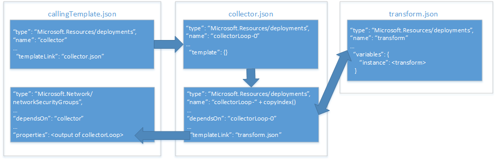

# Implementing a property transformer and collector in an Azure resource manager template

In [using an object as a parameter in an Azure resource manager template][], you learned how store resource property values in an object and apply them to a resource during deployment. While this is a very useful way to manage your parameters, it still requires you to map the object's properties to resource properties each time you use it in your template.

To work around this, you can implement a property transform and collector that iterates your object array and transforms it into the JSON shape expected by the resource. 

The overall architecture of this property collector and transformer is shown in the following example that deploys a network security group (NSG):



The **calling template** imcludes two resources:
1) a template link that invokes the collector template, and
2) a network security group (NSG).

The **collector template** includes two resources:
1) an [**anchor** resource][anchor-resource], and
2) a template link that invokes the transform template in a copy loop.

The **transform template** includes a single resource, an empty template with a variable that transforms the `source` JSON to the JSON shape expected by the NSG resource in the **main template**.

## Transform template

Let's take a look at the **transform template** first. Consider the following parameter object from the [objects as parameters][objects-as-parameters] article:

```json
{
    "$schema": "https://schema.management.azure.com/schemas/2015-01-01/deploymentParameters.json#",
    "contentVersion": "1.0.0.0",
    "parameters":{ 
      "networkSecurityGroupsSettings": {
      "value": {
          "securityRules": [
            {
              "name": "RDPAllow",
              "description": "allow RDP connections",
              "direction": "Inbound",
              "priority": 100,
              "sourceAddressPrefix": "*",
              "destinationAddressPrefix": "10.0.0.0/24",
              "sourcePortRange": "*",
              "destinationPortRange": "3389",
              "access": "Allow",
              "protocol": "Tcp"
            },
            {
              "name": "HTTPAllow",
              "description": "allow HTTP connections",
              "direction": "Inbound",
              "priority": 200,
              "sourceAddressPrefix": "*",
              "destinationAddressPrefix": "10.0.1.0/24",
              "sourcePortRange": "*",
              "destinationPortRange": "80",
              "access": "Allow",
              "protocol": "Tcp"
            }
          ]
        }
      }
    }
  }
```

Each `securityRules` object incluces all the property values necessary to specify a network security rule for the NSG. However, the `Microsoft.Network/networkSecurityGroups` resource type requires the `securityRules` property to be in a different JSON shap. The required JSON shape looks like this:

```json
{
    "name": "name",
    "properties": {
        "description": "description",
        ...
        "direction": "direction"
    }
}
```

The **transform template** makes use of a [resource manager variable][resource-manager-variables] to transform the JSON shape of the property object to what's expected by the NSG resource. 

The template has two parameters: the `source` parameter, which holds one object from the property object array. This is passed in by the **collector template**. The second parameter is called `state`, and it's also passed by the **collector template**. This parameter holds the concatenated results of all previous tranforms. 

The parameters look like this:

```json
{
  "$schema": "http://schema.management.azure.com/schemas/2015-01-01/deploymentTemplate.json#",
  "contentVersion": "1.0.0.0",
  "parameters": {
    "source": { "type": "object" },
    "state": {
      "type": "array",
      "defaultValue": [ ]
    }
  },
```

Next, a variable named `instance` performs the actual tranform of the `source` object into the JSON shape required. 

This part of the template looks like this:

```json
  "variables": {
    "instance": [
      {
        "name": "[parameters('source').name]",
        "properties":{
            "description": "[parameters('source').description]",
            "protocol": "[parameters('source').protocol]",
            "sourcePortRange": "[parameters('source').sourcePortRange]",
            "destinationPortRange": "[parameters('source').destinationPortRange]",
            "sourceAddressPrefix": "[parameters('source').sourceAddressPrefix]",
            "destinationAddressPrefix": "[parameters('source').destinationAddressPrefix]",
            "access": "[parameters('source').access]",
            "priority": "[parameters('source').priority]",
            "direction": "[parameters('source').direction]"            
        }
      }
    ]

  },
```

Finally, the `output` of the template concatenates the `state` parameter - which is the cumululative result of the previous tranforms - with the `instance` variable. This is what is passed back to the **collector template**.

The output section looks like this:

```json
  "outputs": {
    "collection": {
      "type": "array",
      "value": "[concat(parameters('state'), variables('instance'))]"
    }
```

## Collector template

The **collector template** includes two linked template resources. The first is the "anchor" resource, and the second links to the **transform template**.

The template includes three parameters: 
1) `source` is the full parameter object array, passed in by the template that calls the collector.
2) `transformTemplateUri` is the URI of the transform template. This allows the calling template to specify any transform template for the collector. 
3) `state` is the parameter passed to the **tranform template**. It stores the full array of transformed parameter objects when the copy loop is complete.

The parameters section looks like this:

```json
  "parameters": {
    "source": { "type": "array" },
    "transformTemplateUri": { "type": "string" },
    "state": {
      "type": "array",
      "defaultValue": [ ]
    }
``` 

It also uses the length of the `source` parameter object array as the `count` of the copy loop. It's stored in a variable, as follows:

```json
  "variables": {
    "count": "[length(parameters('source'))]"
  },
```

As discussed in the [serial copy loop] article, we require an "anchor" resource. It is specified as follows:

```json
  "resources": [
    {
      "type": "Microsoft.Resources/deployments",
      "apiVersion": "2015-01-01",
      "name": "loop-0",
      "properties": {
        "mode": "Incremental",
        "parameters": { },
        "template": {
          "$schema": "http://schema.management.azure.com/schemas/2015-01-01/deploymentTemplate.json#",
          "contentVersion": "1.0.0.0",
          "parameters": { },
          "variables": { },
          "resources": [ ],
          "outputs": {
            "collection": {
              "type": "array",
              "value": "[parameters('state')]"
            }
          }
        }
      }
    },
```

The second linked template resource is where the collection of the tranformed JSON happens. It looks like this:

```json
    {
      "type": "Microsoft.Resources/deployments",
      "apiVersion": "2015-01-01",
      "name": "[concat('loop-', copyindex(1))]",
      "copy": {
        "name": "iterator",
        "count": "[variables('count')]",
        "mode": "serial"
      },
      "dependsOn": [
        "loop-0"
      ],
      "properties": {
        "mode": "Incremental",
        "templateLink": { "uri": "[parameters('transformTemplateUri')]" },
        "parameters": {
          "source": { "value": "[parameters('source')[copyindex()]]" },
          "state": { "value": "[reference(concat('loop-', copyindex())).outputs.collection.value]" }
        }
      }
    }
  ],
```

The `source` parameter passes the current object in the `source` parameter object array - notice the indexer - to the transform template. The `state` parameter is the output of the previous iteration of the copy loop - that is, the cumulative, or collected, array of transformed JSON objects from the **transform template**.

```json
  "outputs": {
    "result": {
      "type": "array",
      "value": "[reference(concat('loop-', variables('count'))).outputs.collection.value]"
    }
  }
```

Finally, the `output` of the collector template passes the `output` of the last iteration of the transform template. This is the full array of transformed property objects.

## Calling template

The **calling template** specifies a single parameter, `networkSecurityGroupsSettings`. This is the array of propery objects discussed earlier. A variable named `collectorTemplateUri` specifies the URI for the **collector template**. 

```json
  "parameters": {
      "networkSecurityGroupsSettings": {
          "type": "object"
      }
  },
  "variables": {
      "collectorTemplateUri": "[uri(deployment().properties.templateLink.uri, 'collector.template.json')]"
  },
```

Next, the calling template has two resources: a linked template resource that links the **collector template**, and the actual NSG resource.

The first linked template resource is as follows:

```json
    {
      "apiVersion": "2015-01-01",
      "name": "collector",
      "type": "Microsoft.Resources/deployments",
      "properties": {
        "mode": "Incremental",
        "templateLink": {
          "uri": "[variables('linkedTemplateUri')]",
          "contentVersion": "1.0.0.0"
        },
        "parameters": {
          "source" : {"value": "[parameters('networkSecurityGroupsSettings').securityRules]"},
          "transformTemplateUri": { "value": "[uri(deployment().properties.templateLink.uri, 'transform.json')]"}
        }
      }
    },
```

It passes two parameters to the **collector template**: `source` is the property object array, and `transformTemplateUri` is the URI of the transform template.

Finally, the actual NSG resource assigns the output of the collector resource above to its properties. It looks like this:

```json
    {
      "apiVersion": "2015-06-15",
      "type": "Microsoft.Network/networkSecurityGroups",
      "name": "networkSecurityGroup1",
      "location": "[resourceGroup().location]",
      "properties": {
        "securityRules": "[reference('firstResource').outputs.result.value]"
      }
    }
  ],
  "outputs": {
      "instance":{
          "type": "array",
          "value": "[reference('firstResource').outputs.result.value]"
      }

  }
```

Note that it is not necessary to add the `dependsOn` property to ensure the NSG is not deployed until the collector resource has finished. The NSG resource references the output of the collector resource and this creates a dependency by default.

## Next steps

* Here's the full collector template JSON that you can cut and paste into a template:

```json
{
  "$schema": "http://schema.management.azure.com/schemas/2015-01-01/deploymentTemplate.json#",
  "contentVersion": "1.0.0.0",
  "parameters": {
    "source": { "type": "array" },
    "transformTemplateUri": { "type": "string" },
    "state": {
      "type": "array",
      "defaultValue": [ ]
    }
  },
  "variables": {
    "count": "[length(parameters('source'))]"
  },
  "resources": [
    {
      "type": "Microsoft.Resources/deployments",
      "apiVersion": "2015-01-01",
      "name": "loop-0",
      "properties": {
        "mode": "Incremental",
        "parameters": { },
        "template": {
          "$schema": "http://schema.management.azure.com/schemas/2015-01-01/deploymentTemplate.json#",
          "contentVersion": "1.0.0.0",
          "parameters": { },
          "variables": { },
          "resources": [ ],
          "outputs": {
            "collection": {
              "type": "array",
              "value": "[parameters('state')]"
            }
          }
        }
      }
    },
    {
      "type": "Microsoft.Resources/deployments",
      "apiVersion": "2015-01-01",
      "name": "[concat('loop-', copyindex(1))]",
      "copy": {
        "name": "iterator",
        "count": "[variables('count')]",
        "mode": "serial"
      },
      "dependsOn": [
        "loop-0"
      ],
      "properties": {
        "mode": "Incremental",
        "templateLink": { "uri": "[parameters('mapperTemplateUri')]" },
        "parameters": {
          "source": { "value": "[parameters('source')[copyindex()]]" },
          "state": { "value": "[reference(concat('loop-', copyindex())).outputs.collection.value]" }
        }
      }
    }
  ],
  "outputs": {
    "result": {
      "type": "array",
      "value": "[reference(concat('loop-', variables('count'))).outputs.collection.value]"
    }
  }
}

```

* Implement your **calling template** and **transform template** as described above.
* This is also implemented in the [template building blocks project](https://github.com/mspnp/template-building-blocks) and the [Azure reference architectures](/azure/architecture/reference-architectures/). You can review our template to see how we've implemented these techniques.


<!-- links -->
[anchor-resource]: serial-copy-loop.md
[objects-as-parameters]: objects-as-parameters.md
[resource-manager-linked-template]: /azure/azure-resource-manager/resource-group-linked-templates
[resource-manager-variables]: /azure/azure-resource-manager/resource-group-template-functions-deployment
