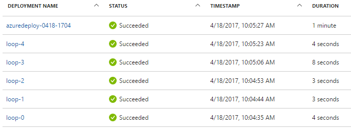

# Extending serial copy functionality in a resource manager template

You can deploy multiple instances of a single resource type in an [Azure Resource Manager][azure-resource-manager-overview] template using a [copy loop][create-multiple-instances]. To do this, you specify the copy loop within the resource. Then, resource manager processes the resource as many times as specified in the `count` property. The resource's properties are dynamically set by assigning them to a parameter or variable array that is indexed using the [`copyIndex()`]([azure-resource-manager-functions-numeric]) function. For example:

```json
  ...
  "parameters" : {
    "domain" : {
      "type": "array",
      "defaultValue": [ "contoso.com","fabrikam.com"]
    }
  ...
  "resources": {
    "name": "[concat('domain',parameters('domain')[copyIndex()])]",
    "copy": {
      "name": "domainCopy",
      "count": 2,
      "mode": "serial"
    }
    "properties": {
      "domain": "[parameters('domain')[copyIndex()]]"
    }
  }
}
```
Note that resource names must be unique within a single deployment, so the resource's name is also dynamically set using the `copyIndex()` function.

Also note that setting the `mode` property to `serial` specifies that the copy loop should be sequential. That is, the default behavior of resource manager is to deploy all resources in parallel - including those in a copy loop - but in a `serial` copy loop, resource manager waits until the last resource in the loop is successfully deployed before moving on to the next.

This functionality is very useful in scenarios in which child resources have to be applied to a parent resource one at a time, such as when a network security rule is applied to a network security group (NSG). However, there are instances in which it's useful to refer to the output of a previous resource within a loop. For example, you may wish to output an array of properties to validate that they were applied correctly.


## Using an "anchor" with a serial copy loop

The template below demonstrates how to implement an "anchor" resource in a serial copy loop and concatenate the output of all the resources in the copy loop. A first resource is named using a concatenation of a name prefix, `loop-` in this example, and `0`. A second resource includes a serial copy loop. The name of the resourceo on each iteration of the loop is a concatenation of the name prefix from the "anchor" and the result of the `copyIndex(1)` function. The integer passed to the `copyIndex()` function is an offset - so, an offset of `1` adds one to the current `copyIndex()`. This results in resource names of the form `loop-1`, `loop-2`, and so on.

The reason we need an "anchor" resource becomes apparent in the output of the second resource. The output value references the previous resource in the copy loop by building up the resource name using the name prefix `loop-` and the result of the `copyIndex()` function. However, there is no resource named `loop-0` because, as you recall, we started naming at `copyIndex(1)`. Because we have an "anchor" resource, on the first iteration the serial copy loop can refer to it's name and the template will pass validation. 

```json
{
  "$schema": "https://schema.management.azure.com/schemas/2015-01-01/deploymentTemplate.json#",
  "contentVersion": "1.0.0.0",
  "parameters": {
    "numberToDeploy": {
      "type": "int",
      "minValue": 2,
      "defaultValue": 5
    }
  },
  "variables": {
    "count": "[sub(parameters('numberToDeploy'), 1)]"
  },
  "resources": [
    {
      "apiVersion": "2015-01-01",
      "type": "Microsoft.Resources/deployments",
      "name": "loop-0",
      "properties": {
        "mode": "Incremental",
        "parameters": {},
        "template": {
          "$schema": "http://schema.management.azure.com/schemas/2015-01-01/deploymentTemplate.json#",
          "contentVersion": "1.0.0.0",
          "parameters": {},
          "variables": {},
          "resources": [],
          "outputs": {
            "collection": {
              "type": "string",
              "value": "loop-0 "
            }
          }
        }
      }
    },
    {
      "apiVersion": "2015-01-01",
      "type": "Microsoft.Resources/deployments",
      "name": "[concat('loop-', copyIndex(1))]",
      "dependsOn": [
        "loop-0"
      ],
      "copy": {
        "name": "iterator",
        "count": "[variables('count')]",
        "mode": "serial"
      },
      "properties": {
        "mode": "Incremental",
        "template": {
          "$schema": "http://schema.management.azure.com/schemas/2015-01-01/deploymentTemplate.json#",
          "contentVersion": "1.0.0.0",
          "parameters": {},
          "variables": {},
          "resources": [],
          "outputs": {
            "collection": {
              "type": "string",
              "value": "[concat(reference(concat('loop-',copyIndex())).outputs.collection.value,'loop-',copyIndex(1), ' ')]"
            }
          }
        }
      }
    }
  ],
  "outputs": {
    "result": {
      "type": "string",
      "value": "[reference(concat('loop-',variables('count'))).outputs.collection.value]"
    }
  }
}

```
## Try the template

If you would like to experiment with this template, follow these steps:

1.	Go to the Azure portal, select the "+" icon, and search for the "template deployment" resource type. When you find it in the search results, select it.
2.	When you get to the "template deployment" page, select the **create** button. The "custom deployment" blade opens and you'll see an empty template.
3.	Select the **edit** icon.
4.	Delete the empty template in the right-hand pane.
5.	Copy and paste the preceding sample template into the right-hand pane.
6.	Select the **save** button.
7.	You are returned to the "custom deployment" pane, but this time there are some drop-down boxes. Select your subscription, either create new or use existing resource group, and select a location. Review the terms and conditions, and select the **I agree** button.
8.	Select the **purchase** button.

To verify that the resources are being deployed sequentially, select "resource groups", then select the resource group that you selected earlier. Select the "deployments" button in the resource group blade, and you see the resources deployed in sequential order with corresponding timestamp.



## Next steps

Use this in your templates by adding your resources to the nested template. You can either author them directly in the template element of the `Microsoft.Resources/deployments` resource or link to them using the `templateLink` element. The resource type in the example is a nested template, but any resource type can be deployed. The only exception is that child resources cannot be referenced from within an iteration loop.

* For an introduction to creating multiple instances of a resource, see [deploy multiple instances of resources in Azure Resource Manager templates](/azure/azure-resource-manager/resource-group-create-multiple.md).
* This is also implemented in the [template building blocks project](https://github.com/mspnp/template-building-blocks) and the [Azure reference architectures](/azure/architecture/reference-architectures/).

<!-- links -->
[azure-resource-manager-overview]: azure/azure-resource-manager/resource-group-overview
[azure-resource-manager-functions-numeric]: /azure/azure-resource-manager/resource-group-template-functions-numeric
[create-multiple-instances]: azure/azure-resource-manager/resource-group-create-multiple