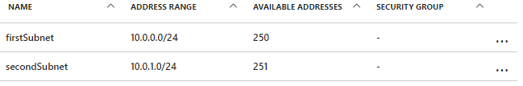
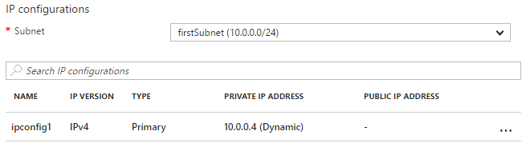

# Updating a resource in an Azure resource manager template

There are some scenarios in which you need to update a resource during a deployment. You might encounter this scenario when you cannot specify all the properties for a resource until other, dependent resources are created. For example, if you create a backend pool for a load balancer, you might update the network interfaces (NICs) on your virtual machines (VMs) to include them in the backend pool. And while resource manager supports updating resources during deployment, you must design your template correctly to avoid errors and to ensure the deployment is handled as an update.

First, you must reference the resource once in the template to create it and then reference the resource by the same name to update it later. However, if two resources have the same name in a template, Resource Manager throws an exception. To avoid this error, specify the updated resource in a second template that's either linked or included as a subtemplate using the `Microsoft.Resources/deployments` resource type.

Second, you must either specify the name of the existing property to change or a new name for a property to add in the nested template. You must also specify the original properties and their original values. If you fail to provide the original properties and values, Resource Manager assumes you want to create a new resource and deletes the original resource.

## Example template

Let's look at an example template that demonstrates this. Our template deploys a virtual network (VNet) named `firstVNet` that has one subnet named `firstSubnet`. It then deploys a virtual network interface (NIC) named `nic1` and associates it with our subnet. Then, a deployment resource named `updateVNet` includes a nested template that updates our `firstVNet` resource by adding a second subnet named `secondSubnet`. 

```json
{
  "$schema": "https://schema.management.azure.com/schemas/2015-01-01/deploymentTemplate.json#",
  "contentVersion": "1.0.0.0",
  "parameters": {},
  "resources": [
      {
      "apiVersion": "2016-03-30",
      "name": "firstVNet",
      "location":"[resourceGroup().location]",
      "type": "Microsoft.Network/virtualNetworks",
      "properties": {
          "addressSpace":{"addressPrefixes": [
              "10.0.0.0/22"
          ]},
          "subnets":[              
              {
                  "name":"firstSubnet",
                  "properties":{
                    "addressPrefix":"10.0.0.0/24"
                  }
              }
            ]
      }
    },
    {
        "apiVersion": "2015-06-15",
        "type":"Microsoft.Network/networkInterfaces",
        "name":"nic1",
        "location":"[resourceGroup().location]",
        "dependsOn": [
            "firstVNet"
        ],
        "properties": {
            "ipConfigurations":[
                {
                    "name":"ipconfig1",
                    "properties": {
                        "privateIPAllocationMethod":"Dynamic",
                        "subnet": {
                            "id": "[concat(resourceId('Microsoft.Network/virtualNetworks','firstVNet'),'/subnets/firstSubnet')]"
                        }
                    }
                }
            ]
        }
    },
    {
      "apiVersion": "2015-01-01",
      "type": "Microsoft.Resources/deployments",
      "name": "updateVNet",
      "dependsOn": [
          "nic1"
      ],
      "properties": {
        "mode": "Incremental",
        "parameters": {},
        "template": {
          "$schema": "http://schema.management.azure.com/schemas/2015-01-01/deploymentTemplate.json#",
          "contentVersion": "1.0.0.0",
          "parameters": {},
          "variables": {},
          "resources": [
              {
                  "apiVersion": "2016-03-30",
                  "name": "firstVNet",
                  "location":"[resourceGroup().location]",
                  "type": "Microsoft.Network/virtualNetworks",
                  "properties": {
                      "addressSpace": "[reference('firstVNet').addressSpace]",
                      "subnets":[
                          {
                              "name":"[reference('firstVNet').subnets[0].name]",
                              "properties":{
                                  "addressPrefix":"[reference('firstVNet').subnets[0].properties.addressPrefix]"
                                  }
                          },
                          {
                              "name":"secondSubnet",
                              "properties":{
                                  "addressPrefix":"10.0.1.0/24"
                                  }
                          }
                     ]
                  }
              }
          ],
          "outputs": {}
          }
        }
    }
  ],
  "outputs": {}
}
```

Let's take a look at the resource object for our `firstVNet` resource first. Notice that we respecify the settings for our `firstVNet` in a nested template - this is because resource manager doesn't allow the same deployment name within the same template and nested templates are considered to be a different template. By respecifying our values for our `firstSubnet` resource, we are telling resource manager to update the existing resource instead of deleting it and redeploying it. Finally, our new settings for `secondSubnet` are picked up during this update.

## Try the template

If you would like to experiment with this template, follow these steps:

1.	Go to the Azure portal, select the "+" icon, and search for the "template deployment" resource type. When you find it in the search results, select it.
2.	When you get to the "template deployment" page, select the **create** button, which opens the "custom deployment" blade.
3.	Select the **edit** icon.
4.	Delete the empty template.
5.	Copy and paste the preceding sample template into the right-hand pane.
6.	Select the **save** button.
7.	You return to the "custom deployment" pane, but this time there are some drop-down boxes. Select your subscription, either create new or use existing resource group, and select a location. Review the terms and conditions, then select the **I agree** button.
8.	Select the **purchase** button.

Once deployment has finished, open the resource group you specified in the portal. You see a VNet named `firstVNet` and a NIC named `nic1`. Click `firstVNet`, then click `subnets`. You see the `firstSubnet` that was originally created, and you see the `secondSubnet` that was added in the `updateVNet` resource. 



Then, go back to the resource group and click `nic1` then click `IP configurations`. In the `IP configurations` section, the `Subnet` is set to `firstSubnet (10.0.0.0/24)`. 



The original `firstVNet` has been updated instead of recreated. If `firstVNet` had been recreated, `nic1` would not be associated with `firstVNet`.

## Next steps

* This is implemented in the [template building blocks project](https://github.com/mspnp/template-building-blocks) and the [Azure reference architectures](/azure/architecture/reference-architectures/).