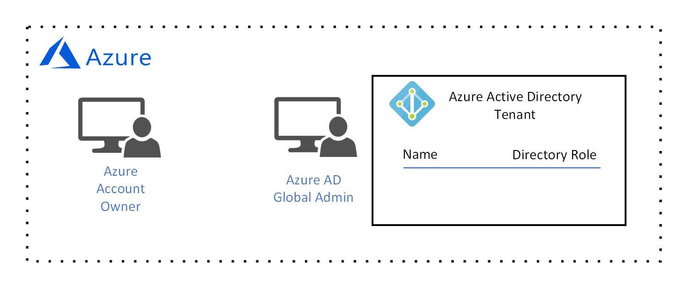
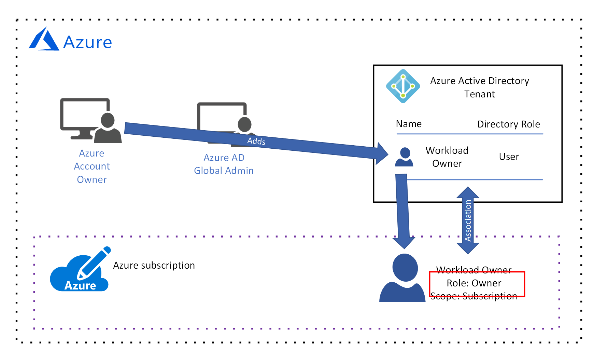
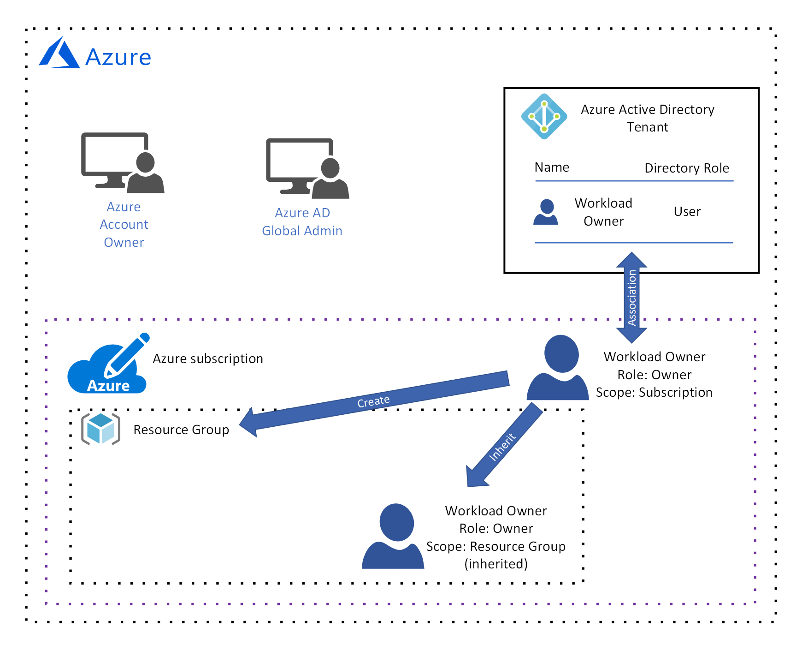

# Azure governance design guide for the foundational adoption stage

The audience for this design guide is the *central IT* persona in your organization. *Central IT* is responsible for designing and implementing your organization's cloud governance architecture. As you learned in the [what is cloud resource governance?](governance-explainer.md) explainer, governance refers to the ongoing process of managing, monitoring, and auditing the use of Azure resources to meet the goals and requirements of your organization.

The goal of this guidance is to help you learn the process of designing your organization's governance architecture. To facilitate this, we'll look at a set of hypothetical governance goals and requirements and discuss how to configure Azure's governance tools to meet them. 

In the foundational adoption stage, our goal is to deploy a simple workload to Azure. This results in the following requirements:
* Identity management for a single **workload owner** who is responsible for deploying and maintaining the simple workload. The workload owner requires permission to create, read, update, and delete resources as well as permission to delegate these rights to other users in the identity management system.
* Manage all resources for the simple workload as a single management unit.

## Licensing Azure

Before we begin designing our governance model, it's important to understand how Azure is licensed because the associated administrative accounts have the highest level of access to your Azure resources. These administrative accounts form the basis of our governance model.  

> [!NOTE]
> If your organization has an existing [Microsoft Enterprise Agreement](https://www.microsoft.com/licensing/licensing-programs/enterprise.aspx) that does not include Azure, Azure can be added by making an upfront monetary commitment. See [licensing Azure for the enterprise](https://azure.microsoft.com/pricing/enterprise-agreement/) for more information. 

When Azure added to your organization's Enterprise Agreement, your organization was prompted to create an **Azure account**. During the account creation process, an **Azure account owner** was created, as well as an Azure Active Directory (Azure AD) tenant with a **global administrator** account. An Azure AD tenant is a logical construct that represents a secure, dedicated instance of Azure AD.

*Figure 1. An Azure account with an Account Manager and Azure AD Global Administrator.*

## Identity management

Azure only trusts [Azure AD](/azure/active-directory) to authenticate users and authorize user access to resources, so  Azure AD is our identity management system. The Azure AD global administrator has the highest level of permissions and can perform all actions related to identity, including creating users and assigning permissions. 

Our requirement is identity management for a single **workload owner** who is responsible for deploying and maintaining the simple workload. The workload owner requires permission to create, read, update, and delete resources as well as permission to delegate these rights to other users in the identity management system.

Our Azure AD global administrator will create the **workload owner** account for the **workload owner**:

*Figure 2. The Azure AD global administrator creates the workload owner user account.*

We aren't able to assign resource access permission until this user is added to a **subscription**, so we'll do that in the next two sections. 

## Resource management scope

As the number of resources deployed by your organization grows, the complexity of governing those resources grows as well. Azure implements a logical container hierarchy to enable your organization to manage your resources in groups at various levels of granularity, also known as **scope**. 

The top level of resource management scope is the **subscription** level. A subscription is created by the Azure **account owner**, who establishes the financial commitment and is responsible for paying for all Azure resources associated with the subscription:

*Figure 3. The Azure account owner creates a subscription.*

When the subscription is created, the Azure **account owner** associates an Azure AD tenant with the subscription, and this Azure AD tenant is used for authenticating and authorizing users:

*Figure 4. The Azure account owner associates the Azure AD tenant with the subscription.*

You may have noticed that there is currently no user associated with the subscription, which means that no one has permission to manage resources. In reality, the **account owner** is the owner of the subscription and has permission to take any action on a resource in the subscription. However, in practical terms the **account owner** is more than likely a finance person in your organization and is not responsible for creating, reading, updating, and deleting resources - those tasks will be performed by the **workload owner**. Therefore, we need to add the **workload owner** to the subscription and assign permissions.

Since the **account owner** is currently the only user with permission to add the **workload owner** to the subscription, they add the **workload owner** to the subscription:

*Figure 5. The Azure account owner adds the workload owner to the subscription.*

The Azure **account owner** grants permissions to the **workload owner** by assigning a [role-based access control (RBAC)](/azure/role-based-access-control/) role. The RBAC role specifies a set of permissions that the **workload owner** has for an individual resource type or a set of resource types.

Notice that in this example, the **account owner** has assigned the [built-in **owner** role](/azure/role-based-access-control/built-in-roles#owner): 

*Figure 6. The workload owner was assigned the built-in owner role.*

The built-in **owner** role grants all permissions to the **workload owner** at the subscription scope. 

> [!IMPORTANT]
> The Azure **acount owner** is responsible for the financial committment associated with the subscription, but the **workload owner** has the same permissions. The **account owner** must trust the **workload owner** to deploy resources that are within the subscription budget.

The next level of management scope is the **resource group** level. A resource group is a logical container for resources. Operations applied at the resource group level apply to all resources in a group. Also, it's important to note that permissions for each user are inherited from the next level up unless they are explicitly changed at that scope. 

To illustrate this, let's look at what happens when the **workload owner** creates a resource group:

*Figure 7. The workload owner creates a resource group and inherits the built-in owner role at the resource group scope.*

Again, the built-in **owner** role grants all permissions to the **workload owner** at the resource group scope. As we discussed earlier, this role is inherited from the subscription level. If a different role is assigned to this user at this scope, it applies to this scope only.

The lowest level of management scope is at the **resource** level. Operations applied at the resource level apply only to the resource itself. And once again, permissions at the resource level are inherited from resource group scope. For example, let's look at what happens if the **workload owner** deploys a [virtual network](/azure/virtual-network/virtual-networks-overview) into the resource group:

*Figure 8. The workload owner creates a resource and inherits the built-in owner role at the resource scope.*

The **workload owner** inherits the owner role at the resource scope, which means the workload owner has all permissions for the virtual network. 

## Summary

In this article, you learned:

* Azure only trusts Azure AD for identity management.
* A subscription has the highest scope of resource management, and each subscription is associated with an Azure AD tenant. Only users in the associated Azure AD tenant can access resources in the subscription.
* There are three levels of resource management scope: subscription, resource group, and resource. Permissions are assigned at each scope using RBAC roles. RBAC roles are inherited from higher scope to lower scope.

## Next steps

Return to the [foundational adoption stage overview](overview.md) and learn about the different types of compute options in Azure. Then, select a type of workload and learn how to deploy it.