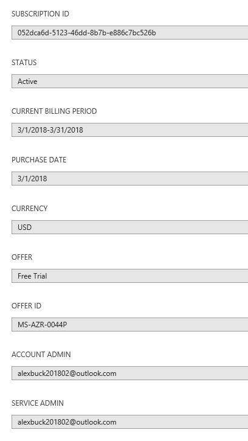
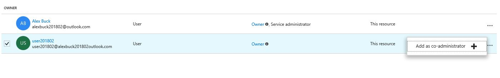
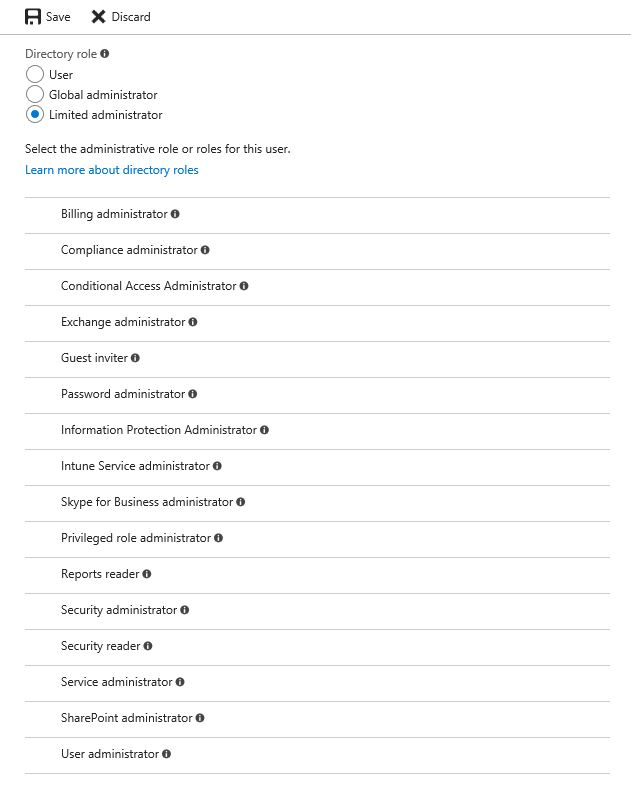
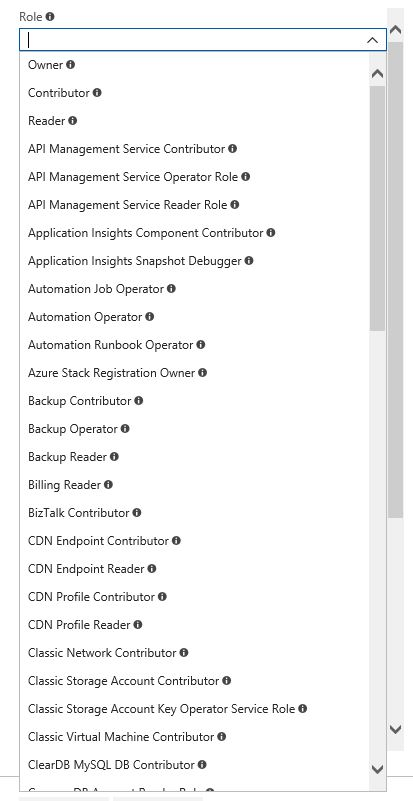
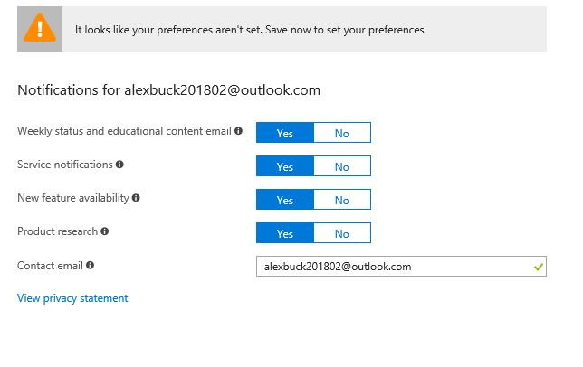

(Examples below are default settings for a new subscription for _alexbuck201802@outlook.com_.)

- Azure has three mechanisms for administrative privileges: 
    - Azure subscription administrators (Account Admin, Service Admin, co-administrators)
    - Azure AD directory roles (Global Administrator, other "limited" administrator roles)
    - Role-based access control (RBAC) roles (Owner, etc.)

- A subscription has two "admin" properties:
    - **ACCOUNT ADMIN** (_alexbuck201802@outlook.com_)
        - Has billing ownership of the subscription.
        - [XX] The account used can be either a **Microsoft account** or a **Work or School account**.
        - [XX] An account can own multiple subscriptions.
        - [XX] Ownership of a subscription can be [transfered to a different account](/azure/billing/billing-subscription-transfer)
    - **SERVICE ADMIN**: _alexbuck201802@outlook.com_
        - Defaults to the same account as the Account Admin. 
        
        - [XX] Can be reassigned by the Account Admin (via https://account.azure.com/subscriptions).
        
        - [XX] The Account Admin will lose access to the portal if the Service Admin is set to a different account. 
    - Subscriptions can also have **co-administrators** (up to 200).
    
        - Co-administrators are only needed for managing classic resources. Using the Owner role in [RBAC](/azure/active-directory/role-based-access-control-what-is) is recommended instead.
- A subscription trusts exactly one Azure AD tenant. Multiple subscriptions can trust the same tenant.
    - You can [change the Azure AD tenant assigned to a subscription](/azure/active-directory/active-directory-how-subscriptions-associated-directory).
    - Each Azure AD tenant has a dedicated, trusted Azure AD directory. The terms _tenant_, _Azure AD_, and _Azure AD directory_ are often used interchangeably.
    - Each user in an Azure AD tenant is assigned one of three top-level **directory role** categories:
        - **Global Administrator** - has full control over all directory resources.
            - Tenant/directory has a boolean setting for "Global admin can manage Azure Subscriptions"
        - **User** - no administrative permissions for the directory.
        - **Limited Administrator** - allows assignment of one or more **administrative roles** for the directory. 
        
- When creating a subscription, a new Azure AD tenant is created. (_alexbuck201802outlook.onmicrosoft.com_)
    - A new user is created in the Azure AD tenant. (_Alex Buck - alexbuck201802@outlook.com_)
    - This user is automatically assigned to the Global Administrator directory role.
    - This user is automatically assigned to the RBAC **Owner** role.
- Users are assigned one or more RBAC roles to enable them to manage various Azure resources.
        
        - Azure provides many [built-in roles](/azure/active-directory/role-based-access-built-in-roles) in Azure RBAC.
        - The built-in RBAC **Owner** role has full access to all resources in the subscription, and can delegate access to others.
        - Only a user with the Owner role can be added as a subscription co-administrator (only used to manage classic deployments).
- Azure enrollments under an Enterprise Agreement (discussed later in the guide) introduce additional administrative portals and accounts.
    - [XX] Enterprise-level settings in Azure are managing via the [Azure Enterprise Portal](ea.azure.com).
    - [XX] Account-level settings in Azure are manageed via the [Azure Account Portal](account.azure.com).
    - [XX] Four key administrative roles under an EA:
        - **Enterprise administrator**
        - **Department administrator**
        - **Account owner** (same as Account Admin above)
        - **Service administrator** (same as Service Admin above)
- [Azure AD Privileged Identity Management](/azure/active-directory/active-directory-privileged-identity-management-configure) (available with the Azure Active Directory Premium P2 edition) provides advanced capabilities for [securing privileged access](/azure/active-directory/privileged-identity-management/active-directory-securing-privileged-access) by administrative accounts in Azure.

## Additional resources / next steps:

- [Understand Azure identity solutions](https://docs.microsoft.com/en-us/azure/active-directory/understand-azure-identity-solutions)
- [Subscriptions: Administrator accounts in your Azure subscription](https://docs.microsoft.com/en-us/azure/billing/billing-add-change-azure-subscription-administrator)
- [Azure AD: Administrator roles in your Azure AD directory](https://docs.microsoft.com/en-us/azure/active-directory/active-directory-assign-admin-roles-azure-portal)
- [Azure AD: Managing access to Azure resources](https://docs.microsoft.com/en-us/azure/active-directory/manage-access-to-azure-resources)

DRAW FROM THESE RESOURCES - NO LINKS: 
- [Introduction to Azure enterprise and subscription management](https://blogs.msdn.microsoft.com/azureedu/2016/10/29/introduction-to-azure-enterprise-and-subscription-management/)
- https://github.com/azsdk/azsdk-docs/blob/master/02-Secure-Development/ControlCoverage/Feature/SubscriptionCore.md

*****************************

## Open questions
- Who automatically receives notifications for a subscription?
    - Azure AD property - "Technical contact" (email)
    - Azure AD has "Notifications settings" - per user/owner?
    

## Ideas

- Align foundational stage content with this content.
    - TODO: Change this content in the explainer: "A subscription holds a group of Azure resources _along with the users_ who create and manage those resources."
- Find an Azure identity SME to verify all of the above specifics. 
- Arrange for the team to go through the entire EA onboarding process together.

