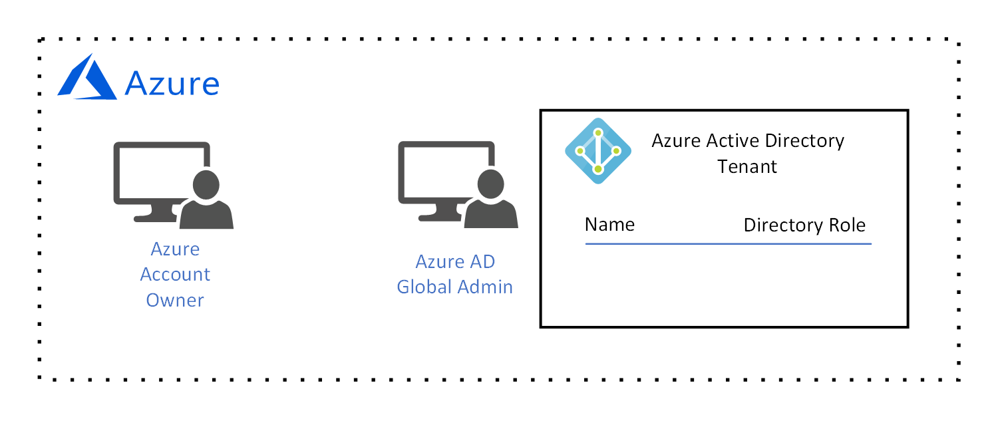
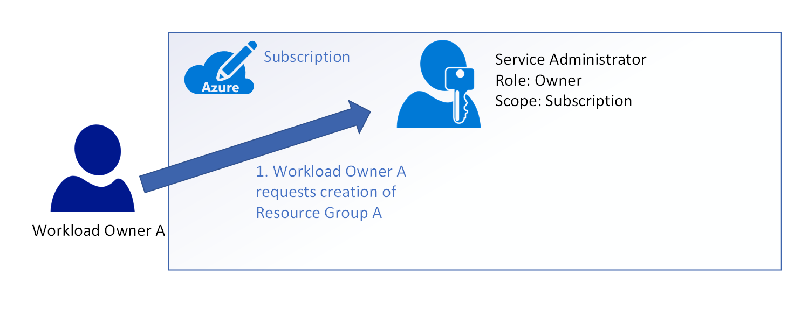
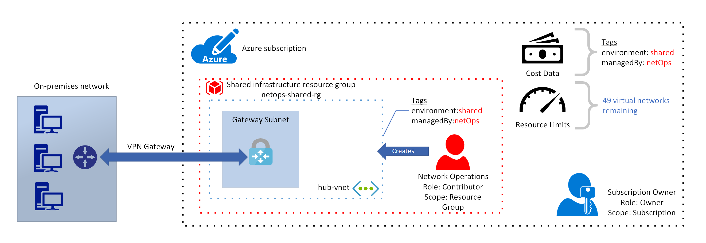

# Governance design walkthrough: new development in Azure for multiple teams

The goal of this guidance is to help you learn the process of designing your organization's governance architecture to accomodate new development in Azure for multiple teams. To facilitate this, we'll look at a set of hypothetical goverance goals and requirements and discuss how to configure Azure's governance tools to meet them. 

Our requirements are:
* Identity management for multiple teams with multiple resource access requirements in Azure, with a single privileged account for managing and auditing user identity for the organization. The identity management system must store the identity of the following users:
  1. The individual in our organization responsible for ownership of *subscriptions*.
  2. The individual in our organization responsible for the shared infrastructure resources in Azure used to connect our on-premises network to an Azure virtual network. 
  3. Two individuals in our organization responsible for managing a *workload*. 
* Support for multiple environments. As you learned earlier, an *environment* is a logical grouping of resources that are used for a similar purpose and have similar management and security requirements. Our requirement is for three environments:
  1. A *shared infrastructure* environment that includes resources shared by all other environments. These are resources such as a virtual network with a gateway subnet to provide connectivity to on-premises, a network security group, and user-defined routes.
  2. A *development* environment for proof-of-concept and testing work. This environment may have relaxed security requirements but increased cost tracking requirements to ensure that development teams are working to resource budget constraints. 
  3. A *production* environment where workloads are published for internal and external consumption. This environment has tighter resource access requirements than the *development* environment.
* A permissions model of least privilege, that supports the following:
  * A single trusted entity at the *subscription* scope to delegate permissions assignments to our two *workload owners*. 
  * Allow our two *workload owner* access to appropriate shared infrastructure resources (such as virtual networking) owned by our *shared infrastructure owner*, but deny access to permanent infrastructure such as network gateways to prevent accidental changes or deletion.
  * Manage the resources for multiple workloads, with each workload's resources isolated so that no one other than the team responsible for the workload has access.
  * Use [built-in role-based access control (RBAC) roles][rbac-built-in-roles] to manage access to Azure resources, so that we do not have to create any custom RBAC roles.
* Cost tracking by *workload owner*, *environment*, or both. 

## Identity management

Before we can design our identity management infrastructure to support multiple teams and multiple workloads, it's important to understand the functions that identity management provides in our governance model. These functions are:

* Administration: the processes and tools for creating, editing, and deleting user identity.
* Authentication: the process of verifying the identity of a user through their use of credentials such as a user name and password.
* Authorization: once a user has been authorized, this process determines which resources the user is allowed to access and what operations they are allowed to perform.
* Auditing: the process of periodically reviewing logs and other information to uncover any potential security issues related to user identity. This includes reviewing user connection patterns to ensure that a user's activity isn't suspicious, periodically running checks to ensure user permissions are accurate, and many other functions.

The only service trusted by Azure to provide this functionality is Azure Active Directory (AD), so we'll be configuring this service and using it for all of the functions listed above. Our requirement was also for a single privileged account to manage and audit user identity. Before we look at how we'll configure Azure AD, let's discuss privileged accounts in Azure.

When your organization signed up for an Azure account, the Account was created. An *Azure Account Owner* was added and an Azure AD tenant was created if there was not already an Azure AD tenant associated with your organization use of other Microsoft services such as Office 365. A *global administrator* is associated with the Azure AD tenant. 

Both of the *Azure Account Owner* and Azure AD *global administrator* user identities are privileged. This means that these identities are stored in a highly secure identity system that is managed by Microsoft. The *Azure Account Owner* is authorized to create, update, and delete *subscriptions*. The Azure AD *global administrator* is authorized to perform many actions in Azure AD, but for this design guide we'll focus on the creation and deletion of user identity.

Our requirement for a single privileged account is satisfied by Azure AD. Our next requirement is user accounts for the four specified users, which are created by the Azure AD *global administrator*:

The first two accounts, *App1 Workload Owner* and *App2 Workload Owner* are owned by the two individuals in our organization that are responsible for managing workloads. The *network operations* account is owned by the individual that is responsible for the shared infrastructure resources. Finally, the *subscription owner* account is owned by the individual responsible for ownership of *subscriptions*.

## Resource access permissions model of least privilege

Now that we have our identity management system and user accounts created, we have to decide how we'll apply role-based access control (RBAC) roles to each of them to satify our requirement for a permissions model of least privilege. That is, our requirement is to design a permissions model that grants permission for a user to perform only the action they need to perform, and nothing else. 

Our other requirements are for a single trusted user to delegate rights to *workload owners*. We have a further requirement for the resources associated with each workload be isolated from one another such that no one *workload owner* has management access to the any other *workload* they do not own. We have an slight variation on this requirement in that the *workload owners* must be able to access the shared resources but not management access to them. Finally, we have a requirement to implement this model using only [built-in roles for Azure RBAC][rbac-built-in-roles].

Each RBAC role is applied at one of three *scopes* in Azure: *subscription*, *resource group*, then an individual *resource*. Roles are inherited at lower scopes. For example, if a user is assigned the *owner* role at the *subscription* level, that role is also assigned to that user at the *resource group* and individual *resource* level unless is it overridden.

Therefore, to create a model of least privilege access we have to decide what actions a particular type of user is allowed to take at each of these three scopes. For example, our requirement is for a *workload owner* to have permission to manage access to only the resources associated with their workload and no others. If we were to assign the *owner* role at the *subscription* scope, each *workload owner* would have management access to all workloads.

Let's take a look at two example permission models to understand this concept a little better. In the first example, our model trusts only the *service administrator* to create resource groups. In our second example, our model assigns the *owner* role to each *workload owner* at the *subscription* scope. 

In both examples, we have a *service administrator* that is assigned the *owner* role at the *subscription* scope. Recall that the *owner* role grants all permissions to the *service administrator*.
 

1. In our first example, we have *workload owner A* who wants to manage the resources for their workload. This user doesn't have permission to do anything at the *subscription* scope so they must contact the *service administrator* to request creation of a *resource group* to contain the resources for their workload.
  

2. The *service administrator* reviews their request and creates *resource group A*. At this point, *workload owner A* still doesn't have permission to do anything.

3. In order to enable *workload owner A* to manage resources, the *service administrator* adds them to *resource group A*. The *service administrator* assigns the *contributor* role to *workload owner A*. The *contributor* role grants all permissions on *resource group A* except delegating access permission.

4. *Workload owner A* has a requirement for a pair of team members to view the CPU and network traffic monitoring data as part of capacity planning for the workload. Because *workload owner A* is assigned the *contributor* role, they do not have permission to add a user to *resource group A* directly. They must send this request to the *service administrator*.

5. The *service adminstrator* reviews the request, and adds the two *workload contributor* users to *resource group A*. Neither of these users requires permission to manage resources, so they are assigned the *reader* role. 

6. Now *workload onwer B* also requires a *resource group* to contain the resources for their workload. As with *workload owner A*, *workload owner B* does not have permission to take any action at the *subscription* scope so they must send a request to the *service administrator*. 

7. The *service administrator* reviews the request and creates *resource group B*.

8. The *service administrator* then adds *workload owner B* to *resource group B* and assigns the *contributor role*. 

At this point we have two workloads, each isolated in their own resource group. None of the users added to *resource group A* has visibility into any of the resources in *resource group B* and vice-versa. This model is a least privelege model because each user is assigned the correct permission at the correct resource management scope.

However, note that every task in this example was performed by the *service administrator*. This is a simple example and it's not an issue because there were only two workload owners, however it's easy to imagine the types of issues that would result if the organization was very large. The *service administrator* can become a bottleneck, resulting in a backlog of requests that create unacceptably long delays for development teams.

1. In our second example, *workload owner A* is assigned the *owner* role at the *subscription* scope. This enables them to create their own *resource group*.

2. Now, *workload owner A* creates *resource group A* and is added by default. Note that *workload owner A* inherits the *owner* role from the *subscription* scope.

3. The *owner* role allows *workload owner A* to delegate management access. *Workload owner A* adds two *workload contributors* and assigns the *reader* role to them. 

4. Similarly, the *service administrator* now adds *workload owner B* to the *subscription* with the *owner* role. 

5. *Workload owner B* creates *resource group B* and is added by default. Again, *workload owner B* inherits the *owner* role from the *subscription* scope.

Note that in this model, the *service administrator* only had to perform two actions. This means that they are no longer a bottleneck even in a large organization.

However, because both *workload owner A* and *workload owner B* are assigned the *owner* role at the *subscription scope*, they have also both inherited the *owner* role for each other's resource group. This means that not only do they have full access to one another's resources, they are also able to delegate access to others. For example, *workload owner B* has rights to add any other user to *resource group A* and can assign any role, including *owner*.

If we compare each example to our requirements, we see that both examples supports a single trusted user to delegate rights to *workload owners*. However, only the first example supports the requirement that the resources associated with each workload be isolated from one another such that no one *workload owner* has management access to the any other *workload* they do not own. It follows that our additional requirement that *workload owners* are able to access the shared resources but not have management access to them is also supported only by the first example.

## Resource management model

Now that we've designed a permissions model of least privelege, let's move on to take a look at some practical applications of these governance models. Recall from our requirements that we must support the following three environments:
1. **Shared infrastructure:** a single group of resources shared by all workloads. These are resources such as network gateways, firewalls, and security services.  
2. **Development:** multiple groups of resources representing multiple non-production ready workloads. These resources are used for proof-of-concept, testing, and other developer activities. These resources may have a more relaxed goverance model because to allow for increased developer agility.
3. **Production:** multiple groups of resources representing multiple production workloads. These resources are used to host the private and public facing application artifacts. These resources typically have the tightest goverance and security models to protect the resources, application code, and data from unauthorized access.

For each of these three environments, we have a requirement to track cost data by *workload owner*, *environment*, or both. That is, we want to know the ongoing cost of our *shared infrastructure*, the costs incurred by individuals rin both the *development* and *production* environments, and finally the overall cost of *development* and *production*. 

You have already learned that resources are scoped to two levels: *subscription* and *resource group*. Therefore, our first decision is how to organize our environments by *subscription*. There are two options: a single subscription, or, multiple subscriptions. 

Let's evaluate a resource management model using a single *subscription*. Our first decision is how to align resource groups to the three environments. We have two options:
1. Align each environment to a single resource group. All shared infrastructure resources are deployed to a single *shared infrastructure* resource group. All resources associated development workloads are deployed to a single *development* resource group. All resources associated with production workloads are deployed into a single *production* resource group for the **production** environment. 
2. Align workloads with a separate resource group, using a naming convention and tags to align resource groups with each of the three environments.  

Let's begin by evaluting the first option. We'll be using the permissions model that we discussed in the previous section, with a single subscription service administrator that creates resource groups and adds users to them with either the built-in *contributor* or *reader* role.

For all of these options, our requirements also state that we have an individual in our organization that is responsible for *subscriptions*, and this user owns the *subscription owner* account in our Azure AD tenant. However, this individual does not have permission to create *subscriptions* for our Azure account. Only the *Azure Account Owner* has permission to do this:

Once the *subscription* has been created, the *Azure Account Owner* can add the *subscription owner* account to the *subscription* with the *owner* role:

The *subscription owner* can now create *resource groups* and delegate resource access management. 

1. The first resource group deployed represents the *shared infrastructure* environment. This resource group includes a virtual network with a gateway subnet. The gateway subnet hosts a VPN gateway that connects to a VPN appliance on-premises. When the subscription service administrator creates the shared infrastructure resource group, they add the *network operations* user with the *contributor* role. The *network operations* user creates a resource group named *netops-shared-rg* and creates a virtual network with a gateway subnet. This user deploys a [VPN gateway](/azure/vpn-gateway/vpn-gateway-about-vpngateways) and configures it to connect to the on-premises VPN appliance. The *network operations* user also applies a pair of [tags](/azure/azure-resource-manager/resource-group-using-tags) to each of the resources: *environment:shared* and *managedBy:netOps*. When the *subscription service administrator* exports a cost report, costs will be aligned with each of these tags. This allows the *subscription service administrator* to pivot costs using the *environment* tag and the *managedBy* tag. Notice the *resource limits* counter at the top right-hand side of the figure. Each Azure subscription has [service limits](/azure/azure-subscription-service-limits), and to help you understand the affect of these limits we'll follow the virtual network limit for each subscription. There is a default limit of 50 virtual networks per subscription, and after the first virtual network is deployed there are now 49 available.

2. Two more resource groups are deployed, the first is named *prod-rg*. This resource group is aligned with the **production** environment. The second is named *dev-rg* and is aligned with the **development** environment. All resources associated with production workloads are deployed to the **production** environment and all resources associated with development workloads are deployed to the **development** environment. In this example we'll only deploy two workloads to each of these two environments so we won't encounter any Azure subscription service limits. However, it's important to consider that each resource group has a limit of 800 resources per resource group. Therefore, if we keep adding workloads to each resource group it is possible that this limit can be reached. 

3. The first *workload owner* sends a request to the *subscription service administrator* and is added to each of the **development** and **production** environment resource groups with the *contributor* role. As you learned earlier, the *contributor* role allows the user to perform any operation other than assigning a role to another user. The first *workload owner* can now create the resources associated with their workload.

4. The first *workload owner* creates a virtual network in each of the two resource groups with a pair of virtual machines in each. The first *workload owner* applies the *environment* and *managedBy* tags to all resources. Note that the Azure service limit counter is now at 47 virtual networks remaining.

5. Each of the virtual networks does not have connectivity to on-premises when they are created. In this type of architecture, each virtual network must be peered to the *hub-vnet* in the **shared infrastructure** environment. Virtual network peering creates a connection between two separate virtual networks and allows network traffic to travel between them. Note that virtual network peering is not inherently transitive. A peering must be specified in each of the two virtual networks that are connected, and if only one of the virtual networks specifies a peering the connection is incomplete. To illustrate the effect of this, the first *workload owner* specifies a peering between *prod-vnet* and *hub-vnet*. The first peering is created, but no traffic flows because the complementary peering from *hub-vnet* to *prod-vnet* has not yet been specified. The first *workload owner* contacts the *network operations* user and requests this complementary peering connection.

6. The *network operations* user reviews the request, approves it, then specifies the peering in teh settings for the *hub-vnet*. The peering connection is now complete and network traffic flows between the two virtual networks.

7. Now, a second *workload owner* sends a request to the *subscription service administrator* and is added to the existing **production** and **development** environment resource groups with the *contributor* role. The second *workload owner* has the same permissions on all resources as the first *workload owner* in each resource group. 

8. The second *workload owner* creates a subnet in the *prod-vnet* virtual network, then adds two virtual machines. The second *workload owner* applies the *environment* and *managedBy* tags to each resource.
 

Now that our model is complete, let's analyze the final state to see how it aligns with our requirements.

Our model enables us to manage our resources in the three required environments. Our shared infrastructure resources are protected because there's only a single user in the subscrition with permission to access those resources. 

Now let's evaluate a resource management model using multiple subscriptions. In this model, we'll align each of the our three environments to a separate subscription: a **shared services** subscription, **production** subscription, and finally a **development** subscription. The considerations for this model are similar to a model using a single subscription in that we have to decide how to align resource groups to workloads. 

As you learned earlier, if we want to isolate workloads on a permissions basis we must assign the *owner* role to a trusted user at the *subscription* level. The *subscription* owner is responsible for creating resource groups and adding workload owners with the *contributor* role. When we had a single subscription, there was only one subscription owner. Now that we have three subscriptions, we have three subscription owners. These three subscription owners can be the same user or up to three different users.

As you can see from the diagram, workload owners may have resources in both the **production** and **development** subscriptions at the same time. These users do not require management access to the resources in the **shared infrastructure** environment. Because workload owners have to contact the subscription owner to create a resource group, it may be more efficient for the **production** and **development** subscription owner to be the same user or users on the same team. 

## Next steps

<!-- links -->

[rbac-built-in-roles]: /azure/role-based-access-control/built-in-roles
