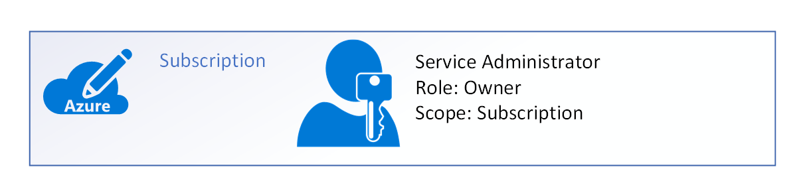
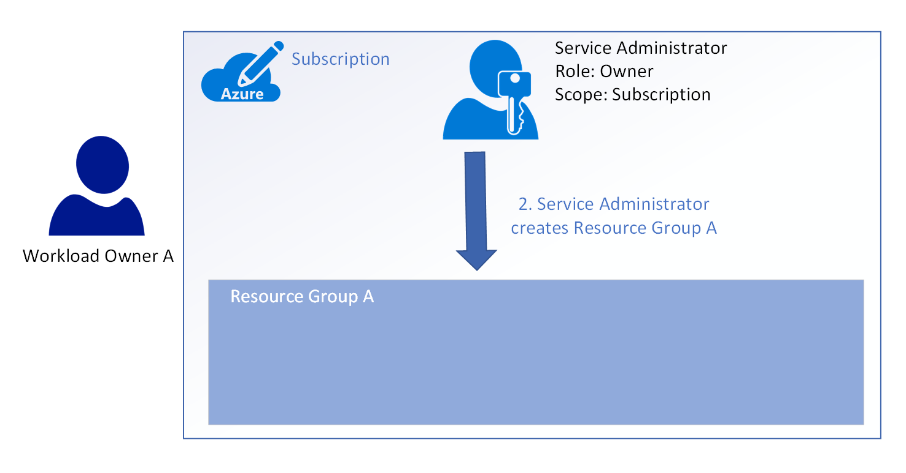
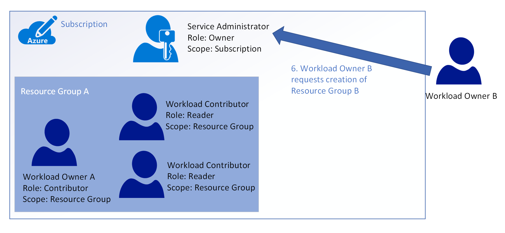
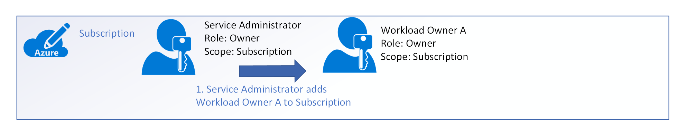

# Governance design walkthrough: new development in Azure for multiple teams

The audience for this governance walkthrough is the *central IT* and *security operations* personas in your organization. *Central IT* is responsible for designing and implementing your organization's cloud governance architecture. *Security operations* is responsible for the infrastructure for storing secrets in Azure as well as implementing your organization's security protocols in Azure. This guide is also useful as a reference to aid in understanding how governance is implemented for the *finance*, *shared infrastructure owner*, and *workload owner* personas.

As you learned in the [what is cloud resource governance?](governance-explainer.md) explainer, governance refers to the ongoing process of managing, monitoring, and auditing the use of Azure resources to meet the goals and requirements of your organization.

The goal of this guidance is to help you learn the process of designing your organization's governance architecture to accomodate new development in Azure for multiple teams. To facilitate this, we'll look at a set of hypothetical goverance goals and requirements and discuss how to configure Azure's governance tools to meet them. 

Our requirements are:
* Identity management for multiple teams with multiple resource access requirements in Azure. Efficiently manage and audit resource access permissions for groups of users.
* A permissions model of least privilege access, that supports the following:
    * A single trusted user that is allowed to delegate permissions assignments to *workload owners* 
    * Allow *workload owner* access to appropriate shared infrastructure resources (such as virtual networking) owned by *shared infrastructure owner*, but deny access to permanent infrastructure such as network gateways to prevent accidental changes or deletion.
* Manage the resources for multiple workloads, with each workload's resources isolated so that no one other than the team responsible for the workload has access.
* Support for a *development* environment and a *production* environment. The *development* environment is for proof-of-concept and testing work and therefore has relaxed security requirements but increased cost tracking requirements to ensure that development teams are working to resource budget constraints. The *production* environment is where workloads are published for internal and external consumption with tighter resource access requirments than the *development* environment.

* Enforce resource naming standards to enable cost tracking.
* Use Azure built-in roles to manage access to resources. 

## Identity management

Before we can design our identity management infrastructure to support multiple teams and multiple workloads, it's important to understand the functions that identity management provides in our governance model. These functions are:

* Administration: the processes and tools for managing user identity; we want to be able to efficiently manage user identity to ensure that users only have access to the resources we want them to access when they require that access. 
* Authentication: the process of verifying the identity of a user through the use of credentials such as a user name and password.
* Authorization: once a user has been authorized, this process determines which resources the user is allowed to access and what operations they are allowed to perform.
* Auditing: the process of periodically reviewing logs and other information to uncover any potential security issues related to user identity. This includes reviewing user connection patterns to ensure that a user's activity isn't suspicious, periodically running checks to ensure user permissions are accurate, and many other functions.

The only service trusted by Azure to provide this functionality is Azure Active Directory (AD), so our task in designing our identity management infrastructure is to configure this service to meet our requirements. 

Our first requirement is to efficiently administer identity and permissions for multiple users with multiple resource access requirements. The motivation for this requirement is to reduce the effort it takes to manage our users and their permissions. For example, we'd like to select some common criteria we can use to group users together and apply permissions to them all at once rather than one by one.

As you learned earlier, user identity can be grouped by **tenant** or by [**groups**](/azure/active-directory/active-directory-manage-groups) within the same tenant. 

Let's evaluate grouping by *tenant* first. Grouping at the *tenant* level means that a separate *tenant* is created for each group of users. This allows us to select all the users at the tenant level then apply permissions and audit their activities as a group. 

There are two problems with this approach. First, we cannot audit the activity of users across multiple tenants without exporting and aggregating activity logs from each tenant. Second, we cannot share user identity between Azure AD tenants, so if we have a user that belongs in more than one group we have to replicate and manage their identity separately in each tenant.

Now let's evaluate grouping by Azure AD *group*. Grouping user identities at the *group* level means that we store all our user identities in a single *tenant* and organize them into one or more *groups*. Just as in a *tenant*, we can apply permissions and audit activities by *group*. We can also audit the activity of all users in all groups in a single log file, and we can include users in more than one group.

Based on our analysis, the design that most closely meets our requirements is a single Azure AD *tenant* and multiple *groups*. 

**TODO: add pointer to "how to" on group creation**

## Permissions model of least privilege access

As you learned in the earlier section, resource access in Azure is managed using role-based access control (RBAC). You learned that RBAC defines a role, and the role is associated with a set of allowed or denied actions that a user can take on a particular resource. When we designed our permissions model for a simple workload, we were primarily concerned with assigning permission to create, read, update, or delete resources.

Now that we are designing our permissions model for multiple teams and multiple workloads, we have an additional consideration in that we have to control who in our organization has permission to delegate rights to others. That is, we only want users we trust to have permission to delegate rights to others, otherwise we run the risk of a proliferation of rights delegation in our organization.

Our permissions model, like most permissions models in the past, is a hierarchy. We have a single trusted user at the top who delegates access control to other trusted individuals down the structure of the hierarchy. So, our task in designing our permissions model is to identify the job function at each level of the hierarchy and what permissions are appropriate at that level.

First, recall from earlier that the a hierarchy of resource management scope in Azure starts with a *subscription* at the highest scope, followed by a *resource group*, then finally an individual *resource*. 

In Azure, each subscription has at least one service administrator. The service administrator is assigned the built-in RBAC *owner* role when the subscription is created. The *owner* role allows the user to delegate access control to other users. All delegation of access control rights begins with the service administrator and flows to all other users in the hierarchy.

The next level down in scope is the *resource group* level. There is a decision to be made at this point: who in your organization is trusted to create a resource group? While this may seem like a trivial decision, it is actually a key decision in your permissions model. 

There are two options to consider:  
1. Trust only the *service administrator* to create resource groups, or,
2. allow the *service administrator* to add one or more *workload owners* with the *owner* role at the subscription level, which enables the *workload owner* to create their own resource group.

Let's take a look an example implementation of each option to see the effect of this decision:

When the subscription is initally created, a *service administrator* is added and assigned the *owner* role. The *owner* role grants all permissions to the *service administrator*.
 

1. Now let's assume we have someone from one of our development teams who is working on an application. Recall that we defined a *workload* as including not only the code artifacts for the application, but all necessary cloud resources as well. Therefore, this developer will be responsible not only for building and publishing the application code, but they will also be responsible for creating and maintaining the cloud resources necessary for the application to run.  Therefore, we'll call this person *workload owner A*. Because *workload owner A* currently doesn't have permission to do anything in the subscription, they must contact the *service administrator* and request the creation of a *resource group* to contain the resources for the workload.
  

2. The *service administrator* reviews the request, and creates *resource group A*. At this point, *workload owner A* still doesn't have permission to do anything.

3. In order to enable *workload owner A* to manage resources, the *service administrator* adds them to *resource group A*. The *service administrator* can assign any role to *workload owner A*, and in our example the policy is to restrict the right to delegate access management. As a result, the *service administrator* assigns the *contributor* role to *workload owner A*.

4. *Workload owner A* has a requirement for a pair of team members to view the CPU and network traffic monitoring data as part of capacity planning for the workload. Because *workload owner A* does not have permission to add a user to *resource group A* directly, they must make the request to the *service administrator*.

5. The *service adminstrator* reviews the request, and adds the two *workload contributor* users to *resource group A*. Neither of these users requires permission to manage resources, so they are assigned the *reader* role. 

6. Now let's take a look at what happens when there's another *workload owner* that is also responsible for deploying a workload to Azure. As we learned earlier, *workload owner B* does not initally have any rights at all in the subscription and must make a request for a new *resource group* to the *service administrator*. 

7. The *service administrator* reviews the request and creates *resource group B*.

8. The *service administrator* then adds *workload owner B* to *resource group B* and assigns the *contributor role*. 

Now let's analyze the resulting state of the *subscription*. We have two workloads, each isolated in their own resource group. None of the users added to *resource group A* has visibility into any of the resources in *resource group B* and vice-versa. This is a desirable state because each user is assigned the correct permission at the correct resource management scope.

However, note that every task in this example was performed by the *service administrator*. This is a simple example and it's not an issue because there were only two workload owners, however it's easy to imagine the types of issues that would result if the organization was very large. The *service administrator* can become a bottleneck, resulting in a backlog of requests that create unacceptably long delays for development teams.

One way to fix this problem is for our organization to allow workload owners to create their own resource groups and delegate access to resources. Let's take a look at how this implementation works and the issues associated with it:

1. To enable workload owners to create their own resource groups and add users to those resource groups, they must be added to the *subscription* with the *owner* role. As in   the first example, the only person with permission to perform this action is the *service administrator*. 

2. Now, *workload owner A* creates *resource group A* and is added by default. Note that *workload owner A* inherits the *owner* role from the *subscription*.

3. The *owner* role allows *workload owner A* to delegate access. *Workload owner A* adds two *workload contributors* and assigns the *reader* role to them. 

4. Similarly, the *service administrator* can now add *workload owner B* to the *subscription* with the *owner* role. 

5. *Workload owner B* creates *resource group B* and is added by default. Again, *workload owner B* inherits the *owner* role from their *subscription* level role.

As we did earlier, let's analyze the resulting state of the *subscription*, *resource group A*, and *resource group B*. We have two workloads, each isolated in a resource group. The *service administrator* only had to perform two actions, so they are no longer a bottleneck even in a large organization.

However, because both *workload owner A* and *workload owner B* are assigned the *owner* role at the *subscription scope*, they have also both inherited the *owner* role for each other's resource group. This means that not only do they have full access to one another's resources, they are also able to delegate access to others. For example, *workload owner B* has rights to add any other user to *resource group A* and can assign any role, including *owner*.

Therefore, only the first example is a model that implements the concept of least privilege access. There is additional management overhead associated with this model, but there are some other strategies that can be implemented to reduce the effects. We'll take a look at these in the advanced section.

## Resource management scope

The task of designing our resource management scope is to decide how we will organize and group the resources that make up our workloads. As you learned in the workload explainer, a workload can be made up of many different types of resources. Most of your workloads will share network resources with one or more central gateways to your on-premises network, and some of your workloads may share other resources such a load balancers, storage, and databases. 

Therefore, we want to design the way we group our resources to make it as easy as possible for our *workload owner* personas to get access to the resources they need while at the same time ensuring that they do not have access to resources we don't want them to touch for security and durability reasons. We also have to design our resource management scope to support a *developer* and *production* environment.

## Next steps

