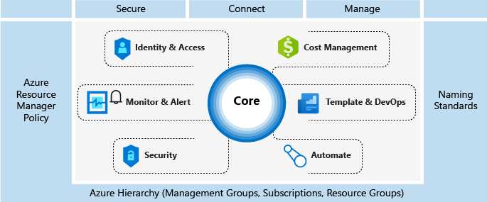
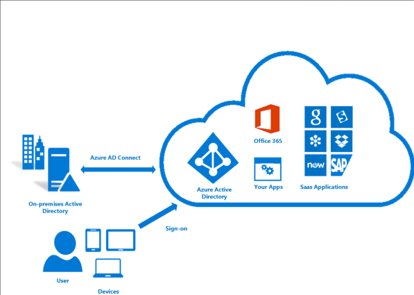
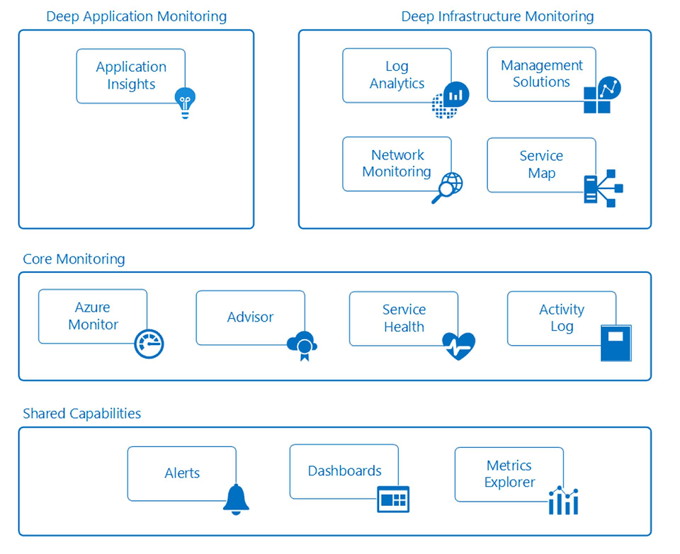

# Azure enterprise scaffold: Prescriptive subscription governance

Enterprises are increasingly adopting the public cloud for its agility and flexibility. They utilize the cloud's strengths to generate revenue and optimize resource usage for the business. Microsoft Azure provides a multitude of services and capabilities that enterprises assemble like building blocks to address a wide array of workloads and applications.

Deciding to use Microsoft Azure is only the first step to achieving the benefit of the cloud. The second step is understanding how the enterprise can effectively use Azure and identify the baseline capabilities that need to be in place to address questions like:

* "I'm concerned about data sovereignty; how can I ensure that my data and systems meet our regulatory requirements?"
* "How do I know what every resource is supporting so I can account for it and bill it back accurately?"
* "I want to make sure that everything we deploy or do in the public cloud starts with the mindset of security first, how do I help facilitate that?"

The prospect of an empty subscription with no guard rails is daunting. This blank space can hamper your move to Azure.

This article provides a starting point for technical professionals to address the need for governance and balance it with the need for agility. It introduces the concept of an enterprise scaffold that guides organizations in implementing and managing their Azure environments in a secure way. It provides the framework to develop effective and efficient controls.

## Need for governance

When moving to Azure, you must address the topic of governance early to ensure the successful use of the cloud within the enterprise. Unfortunately, the time and bureaucracy of creating a comprehensive governance system means some business groups go directly to providers without involving enterprise IT. This approach can leave the enterprise open to compromise if the resources are not properly managed. The characteristics of the public cloud - agility, flexibility, and consumption-based pricing - are important to business groups that need to quickly meet the demands of customers (both internal and external). But, enterprise IT needs to ensure that data and systems are effectively protected.

When creating a building, scaffolding is used to create the basis of a structure. The scaffold guides the general outline and provides anchor points for more permanent systems to be mounted. An enterprise scaffold is the same: a set of flexible controls and Azure capabilities that provide structure to the environment, and anchors for services built on the public cloud. It provides the builders (IT and business groups) a foundation to create and attach new services keeping speed of delivery in mind.

The scaffold is based on practices we have gathered from many engagements with clients of various sizes. Those clients range from small organizations developing solutions in the cloud to large multi-national enterprises and independent software vendors who are migrating workloads and developing cloud-native solutions. The enterprise scaffold is "purpose-built" to be flexible to support both traditional IT workloads and agile workloads; such as, developers creating software-as-a-service (SaaS) applications based on Azure platform capabilities.

The enterprise scaffold is intended to be the foundation of each new subscription within Azure. It enables administrators to ensure workloads meet the minimum governance requirements of an organization without preventing business groups and developers from quickly meeting their own goals. Our experience shows that this greatly speeds, rather than impedes, public cloud growth.

> [!NOTE]
> Microsoft has released into preview a new capability called [Azure Blueprints](/azure/governance/blueprints/overview) that will enable you to package, manage, and deploy common images, templates, policies, and scripts across subscriptions and management groups. This capability is the bridge between the scaffold's purpose as reference model and deploying that model to your organization.
>
The following image shows the components of the scaffold. The foundation relies on a solid plan for the management hierarchy and subscriptions. The pillars consist of Resource Manager policies and strong naming standards. The rest of the scaffold are core Azure capabilities and features that enable and connect a secure and manageable environment.

## Define your hierarchy

The foundation of the scaffold is the hierarchy and relationship of the Azure Enterprise Enrollment through to subscriptions and resource groups. The enterprise enrollment defines the shape and use of Azure services within your company from a contractual point of view. Within the enterprise agreement, you can further subdivide the environment into departments, accounts, and finally, subscriptions and resource groups to match your organization's structure.

An Azure subscription is the basic unit where all resources are contained. It also defines several limits within Azure, such as number of cores, virtual networks and other resources. Azure Resource Groups are used to further refine the subscription model and enable a more natural grouping of resources.

Every enterprise is different and the hierarchy in the above image allows for significant flexibility in how Azure is organized within your company. Modeling your hierarchy to reflect the needs of your company for billing, resource management, and resource access is the first &mdash; and most important &mdash; decision you make when starting in the public cloud.

### Departments and Accounts

The three common patterns for Azure Enrollments are:

* The **functional** pattern

    
* The **business unit** pattern

    
* The **geographic** pattern

    

Though each of these patterns has its place, the **business unit** pattern is increasingly being adopted for its flexibility in modeling an organization's cost model as well as reflecting span of control. Microsoft Core Engineering and Operations group has created a sub-set of the **business unit** pattern that is very effective, modeled on **Federal**, **State**, and **Local**. (For more information, see [Organizing subscriptions and resource groups within the Enterprise](https://azure.microsoft.com/blog/organizing-subscriptions-and-resource-groups-within-the-enterprise/).)

### Management Groups

Microsoft has recently released a new way of modeling your hierarchy: [Azure management groups](/azure/azure-resource-manager/management-groups-overview). Management groups are much more flexible than departments and accounts and can be nested up to six levels. Management groups allow you to create a hierarchy that is separate from your billing hierarchy, solely for efficient management of resources. Management groups can mirror your billing hierarchy and often enterprises start that way. However, the power of management groups is when you use them to model your organization where related subscriptions &mdash; regardless where they are in the billing hierarchy &mdash; are grouped together and need common roles assigned as well as policies and initiatives. A few examples:

* **Production/Non-Production**. Some enterprises create management groups to identify their production and non-production subscriptions. Management groups allow these customers to more easily manage roles and policies, for example: non-production subscription may allow developers "contributor" access, but in production, they have only "reader" access.
* **Internal Services/External Services**. Much like Production/Non-Production, enterprises often have different requirements, policies and roles for internal services vs external (customer facing) services.

Well thought out management groups are, along with Azure Policy and Initiatives the backbone of efficient governance of Azure.

### Subscriptions

When deciding on your Departments and Accounts (or management groups), you are primarily looking at how you're dividing up your Azure environment to match your organization. Subscriptions, however, are where the real work happens and your decisions here impact security, scalability and billing.  Many organizations look at the following patterns as their guides:

* **Application/Service**: Subscriptions represent an application or a service (portfolio of applications)
* **Lifecycle**: Subscriptions represent a lifecycle of a service, such as Production or Development.
* **Department**: Subscriptions represent departments in the organization.

The first two patterns are the most commonly used, and both are highly recommended. The Lifecycle approach is appropriate for most organizations. In this case, the general recommendation is to use two base subscriptions. "Production" and "Non-Production," and then use resource groups to break out the environments further.

### Resource groups

Azure Resource Manager enables you to put resources into meaningful groups for management, billing, or natural affinity. Resource groups are containers of resources that have a common life cycle or share an attribute such as "all SQL servers" or "Application A".

Resource groups can't be nested, and resources can only belong to one resource group. Some actions can act on all resources in a resource group. For example, deleting a resource group removes all resources within the resource group. Like subscriptions, there are common patterns when creating resource groups and will vary from "Traditional IT" workloads to "Agile IT" workloads:

* "Traditional IT" workloads are most commonly grouped by items within the same life cycle, such as an application. Grouping by application allows for individual application management.
* "Agile IT" workloads tend to focus on external customer-facing cloud applications. The resource groups often reflect the layers of deployment (such as Web Tier, App Tier) and management.

> [!NOTE]
> Understanding your workload helps you develop a resource group strategy. These patterns can be mixed and matched. For example, a shared services resource group in the same subscription as "Agile" resource groups.

## Naming standards

The first pillar of the scaffold is a consistent naming standard. Well-designed naming standards enable you to identify resources in the portal, on a bill, and within scripts. You likely already have existing naming standards for on-premises infrastructure. When adding Azure to your environment, you should extend those naming standards to your Azure resources.

> [!TIP]
> For naming conventions:
> * Review and adopt where possible the [Patterns and Practices guidance](https://docs.microsoft.com/en-us/azure/architecture/best-practices/naming-conventions). This guidance helps you decide on a meaningful naming standard and provides extensive examples.
> * Using Resource Manager Policies to help enforce naming standards
>
>Remember that it's difficult to change names later, so a few minutes now will save you trouble later.

Concentrate your naming standards on those resources that are more commonly used and searched for.  For example, all resource groups should follow a strong standard for clarity.

### Resource Tags

Resource tags are tightly aligned with naming standards. As resources are added to subscriptions, it becomes increasingly important to logically categorize them for billing, management, and operational purposes. For more information, see [Use tags to organize your Azure Resource](https://docs.microsoft.com/en-us/azure/azure-resource-manager/resource-group-using-tags).

> [!IMPORTANT]
> Tags can contain personal information and may fall under the regulations of GDPR. Plan for management of your tags carefully. If you're looking for general info about GDPR, see the GDPR section of the [Service Trust Portal](https://servicetrust.microsoft.com/ViewPage/GDPRGetStarted).

Tags are used in many ways beyond billing and management. They are often used as part of automation (see later section). This can cause conflicts if not considered up front. The recommended practice is to identify all the common tags at the enterprise level (such as ApplicationOwner, CostCenter) and apply them consistently when deploying resources using automation.

## Azure Policy and Initiatives

The second pillar of the scaffold involves using [Azure Policy and Initiatives](/azure/azure-policy/azure-policy-introduction) to manage risk by enforcing rules (with effects) over the resources and services in your subscriptions. Azure Initiatives are collections of policies that are designed to achieve a single goal. Azure policy and initiatives are then assigned to a resource scope to begin enforcement of the particular policies.

Azure Policy and Initiatives are even more powerful when used with the management groups mentioned earlier. Management groups enable the assignment of an initiative or policy to an entire set of subscriptions.

### Common uses of Resource Manager policies

Azure policies and initiatives are a powerful tool in the Azure toolkit. Policies allow companies to provide controls for "Traditional IT" workloads that enable the stability that is needed for LOB applications while also allowing "Agile" workloads; such as, developing customer applications without opening up the enterprise to additional risk. The most common patterns we see for policies are:

* **Geo-compliance/data sovereignty**. Azure has an ever-growing list of regions across the world. Enterprises often need to ensure that resources in a particular scope remain in a geographic region to address regulatory requirements.
* **Avoid exposing servers publicly**. Azure policy can prohibit the deployment of certain resources types. A common use is to create a policy to deny the creation of a public IP within a particular scope, avoiding un-intended exposure of a server to the internet.
* **Cost Management and Metadata**. Resource tags are often used to add important billing data to resources and resource groups such as CostCenter, Owner and more. These tags are invaluable for accurate billing and management of resources. Policies can enforce the application of resources tags to all deployed resource, making it easier to manage.

### Common uses of initiatives

The introduction of initiatives provided enterprises a way to group logical policies together and track as a whole. Initiatives further support the enterprise to address the needs of both "agile" and "traditional" workloads. We have seen very creative uses of initiatives, but commonly we see:

* **Enable monitoring in Azure Security Center**. This is a default initiative in the Azure Policy and an excellent example of what initiative are. It enables policies that identify un-encrypted SQL databases, VM vulnerabilities and more common security related needs.
* **Regulatory specific initiative**. Enterprises often group policies common to a regulatory requirement (such as HIPAA) so that controls and compliancy to those controls are tracked efficiently.
* **Resource Types & SKUs**. Creating an initiative that restricts the types of resources that can be deployed as well as the SKUs that can be deployed can help to control costs and ensure your organization is only deploying resources that your team have the skillset and procedures to support.

> [!TIP]
> We recommend you always use initiative definitions instead of policy definitions. After assigning an initiative to a scope, such as subscription or management group, you can easily add another policy to the initiative without having to change any assignments. This makes understanding what is applied and tracking compliance far easier.

### Policy and Initiative assignments

After the creation of policies and grouping them into logical initiatives you must assign the policy to a scope, whether it is a management group, a subscription or even a resource group. Assignments allow you to also exclude a sub-scope from the assignment of a policy. For example, if you deny the creation of public IPs within a subscription, you could create an assignment with an exclusion for a resource group connected to your protected DMZ.

You will find several Policy examples that show how Policy and Initiatives can be applied to various resources within Azure on this [GitHub](https://github.com/Azure/azure-policy) repository.

## Identity and access management

One of the first, and most crucial, questions you ask yourself when starting with the public cloud is "who should have access to resources?" and "how do I control this access?" Allowing or disallowing access to the Azure portal, and controlling access to resources in the portal is critical to the long term success and safety of your assets in the cloud.

To accomplish the task of securing access to your resources you will first configure your identity provider and then configure Roles and access. Azure Active Directory (Azure AD), connected to your on-premises Active Directory, is the foundation of Azure Identity. That said, Azure AD is *not* Active Directory and it's important to understand what an Azure AD tenant is and how it relates to your Azure enrollment.  Review the available [information](../getting-started/azure-resource-access.md) to gain a solid foundation on Azure AD and AD. To connect and synchronize your Active Directory to Azure AD, install and configure the [AD Connect tool](/azure/active-directory/connect/active-directory-aadconnect) on-premises.

When Azure was initially released, access controls to a subscription were basic: Administrator or Co-Administrator. Access to a subscription in the Classic model implied access to all the resources in the portal. This lack of fine-grained control led to the proliferation of subscriptions to provide a level of reasonable access control for an Azure Enrollment. This proliferation of subscriptions is no longer needed. With role-based access control (RBAC), you can assign users to standard roles that provide common access such as "owner", "contributor" or "reader" or even create your own roles

When implementing role-based access, the following are highly recommended:

* Control the Administrator/Co-Administrator of a subscription as these roles have extensive permissions. You only need to add the Subscription Owner as a Co-administrator if they need to managed Azure Classic deployments.

* Use Management Groups to assign [roles](/azure/azure-resource-manager/management-groups-overview#management-group-access) across multiple subscriptions and reduce the burden of managing them at the subscription level.
* Add Azure users to a group (for example, Application X Owners) in Active Directory. Use the synced group to provide group members the appropriate rights to manage the resource group containing the application.
* Follow the principle of granting the **least privilege** required to do the expected work.

> [!IMPORTANT]
>Consider using [Azure AD Privileged Identity Management](/azure/active-directory/privileged-identity-management/pim-configure), Azure [Multi-Factor Authentication](/azure/active-directory/authentication/howto-mfa-getstarted) and [Conditional Access](/azure/active-directory/active-directory-conditional-access-azure-portal) capabilities to provide better security and more visibility to administrative actions across your Azure subscriptions. These capabilities come from a valid Azure AD Premium license (depending on the feature) to further secure and manage your identity. Azure AD PIM enables "Just-in-Time" administrative access with approval workflow, as well as a full audit of administrator activations and activities. Azure MFA is another critical capability and enables two-step verification for login to the Azure portal. When combined with Conditional Access Controls you can effectively manage your risk of compromise.

Planning and preparing for your identity and access controls and following Azure Identity Management best practice ([link](/azure/security/azure-security-identity-management-best-practices)) is one of the best risk mitigation strategies that you can employ and should be considered mandatory for every deployment.

## Security

One of the biggest blockers to cloud adoption traditionally has been concerns over security. IT risk managers and security departments need to ensure that resources in Azure are protected and secure by default. Azure provides a number of capabilities that you can leverage to protect resources and detect/prevent threats against those resources.

### Azure Security Center

The [Azure Security Center](/azure/security-center/security-center-intro) provides a unified view of the security status of resources across your environment in addition to advanced threat protection. Azure Security Center is an open platform that enables Microsoft partners to create software that plugs into and enhance its capabilities. The baseline capabilities of Azure Security Center (free tier) provides assessment and recommendations that will enhance your security posture. Its paid tiers enable additional and valuable capabilities such as Just In Time admin access and adaptive application controls (whitelisting).

> [!TIP]
>Azure security center is a very powerful tool that is constantly being enhanced and incorporating new capabilities you can leverage to detect threats and protect your enterprise. It is highly recommended to always enable ASC.

### Azure resource locks

As your organization adds core services to subscriptions it becomes increasingly important to avoid business disruption. One type of disruption that we often see is unintended consequences of scripts and tools working against an Azure subscription deleting resources mistakenly. [Resource Locks](/azure/azure-resource-manager/resource-group-lock-resources) enable you to restrict operations on high-value resources where modifying or deleting them would have a significant impact. Locks are applied to a subscription, resource group, or even individual resources. The common use case is to apply locks to foundational resources such as virtual networks, gateways, network security groups and key storage accounts.

### Secure DevOps Toolkit

The "Secure DevOps Kit for Azure" (AzSK) is a collection of scripts, tools, extensions, automations, etc. originally created by Microsoft's own IT Team and released in OpenSource via Github ([link](https://github.com/azsk/DevOpsKit-docs)). AzSK caters to the end to end Azure subscription and resource security needs for teams using extensive automation and smoothly integrating security into native dev ops workflows helping accomplish secure dev ops with these 6 focus areas:

* Secure the subscription
* Enable secure development
* Integrate security into CICD
* Continuous Assurance
* Alerting & Monitoring
* Cloud Risk Governance

The AzSK is a rich set of tools, scripts and information that are an important part of a full Azure governance plan and incorporating this into your scaffold is crucial to supporting your organizations risk management goals

### Azure Update Management

One of the key tasks you can do to keep your environment safe is ensure that your servers are patched with the latest updates. While there are many tools to accomplish this, Azure provides the [Azure Update Management](/azure/automation/automation-update-management) solution to address the identification and rollout of critical OS patches.  It makes use of Azure Automation (which is covered in the [Automate](#automate) section, later in this guide.

## Monitor and alerts

Collecting and analyzing telemetry that provides line of sight into the activities, performance metrics, health and availability of the services you are using across all of your Azure subscriptions is critical to proactively manage your applications and infrastructure and is a foundational need of every Azure subscription. Every Azure service emits telemetry in the form of Activity Logs, Metrics and Diagnostic Logs.

* **Activity Logs** describe all operations performed on resources in your subscriptions
* **Metrics** are numerical information emitted from within a resource that describe the performance and health of a resource
* **Diagnostic Logs** are emitted by an Azure service and provide rich, frequent data about the operation of that service.

This information can be viewed and acted upon at multiple levels and are continually being improved. Azure provides **shared**, **core** and **deep** monitoring capabilities of Azure resources through the services outlined in the diagram below.

### Shared capabilities

* **Alerts**: You can collect every log, event and metric from Azure resources, but without the ability to be notified of critical conditions and act, this data is only useful for historic purposes and forensics. Azure Alerts proactively notify you of conditions you define across all your applications and infrastructure. You create alert rules across logs, events and metrics that use action groups to notify sets of recipients. Action groups also provide the ability to automate remediation using external actions such as webhooks to run Azure Automation runbooks and Azure Functions.

* **Dashboards**: Dashboards enable you to aggregate monitoring views and combine data across resources and subscriptions to give you an enterprise-wide view into the telemetry of Azure resources. You can create and configure your own views and share them with others. For example, you could create a dashboard consisting of various tiles for DBAs to provide information across all Azure database services, including Azure SQL DB, Azure DB for PostgreSQL and Azure DB for MySQL.

* **Metrics Explorer**: Metrics are numerical values generated by Azure resources (e.g. % CPU, Disk I/O, that provide insight into the operation and performance of your resources. By using Metrics Explorer you can define and send the metrics in which you are interested to Log Analytics for aggregation and analysis.

### Core monitoring

* **Azure Monitor**: Azure Monitor is the core platform service that provides a single source for monitoring Azure resources. The Azure Portal interface of Azure Monitor provides a centralized jump off point for all the monitoring features across Azure including the deep monitoring capabilities of Application Insights, Log Analytics, Network Monitoring, Management Solutions and Service Maps. With Azure Monitor you can visualize, query, route, archive and act on the metrics and logs coming from Azure resources across your entire cloud estate. In addition to the portal you can retrieve data through the Monitor PowerShell Cmdlets, Cross Platform CLI or the Azure Monitor REST APIs.

* **Azure Advisor**: Azure Advisor constantly monitors telemetry across your subscriptions and environments and provides recommendations on best practices on how to optimize your Azure resources to save money and improve performance, security and availability of the resources that make up your applications.

* **Service Health**: Azure Service Health identifies any issues with Azure Services that may impact your applications as well as assists you in planning for scheduled maintenance windows.

* **Activity Log**: The Activity Log describes all operations on resources in your subscriptions. It provides an audit trail to determine the 'what', 'who', and 'when' of any create, update, delete operation on resources. Activity Log events are stored in the platform and are available to query for 90 days. You can ingest Activity Logs into Log Analytics for longer retention periods and deeper querying and analysis across multiple resources.

### Deep application monitoring

* **Application Insights**: Application Insights enables you to collect application specific telemetry and monitor the performance, availability and usage of applications in the cloud or on-premises. By instrumenting your application with supported SDKs for multiple languages including .NET, JavaScript, JAVA, Node.js, Ruby and Python. Application Insights events are ingested into the same Log Analytics data store that supports infrastructure and security monitoring to enable you to correlate and aggregate events over time through a rich query language.

### Deep infrastructure monitoring

* **Log Analytics**: Log Analytics plays a central role in Azure monitoring by collecting telemetry and other data from a variety of sources and providing a query language and analytics engine that gives you insights into the operation of your applications and resources. You can either interact directly with Log Analytics data through highly performant log searches and views, or you may use analysis tools in other Azure services that store their data in Log Analytics such as Application Insights or Azure Security Center.

* **Network Monitoring**: Azure's network monitoring services enable you to gain insight into network traffic flow, performance, security, connectivity and bottlenecks. A well-planned network design should include configuring Azure network monitoring services such as Network Watcher and ExpressRoute Monitor.

* **Management Solutions**: Management solutions are packaged sets of logic, insights and pre-defined Log Analytics queries for an application or service. They rely on Log Analytics as the foundation to store and analyze event data. Sample management solutions include monitoring containers and Azure SQL Database analytics.

* **Service Map**: Service Map provides a graphical view into your infrastructure components, their processes and interdependencies on other computers and external processes. It integrates events, performance data and management solutions in Log Analytics.

> [!TIP]
> Before creating individual alerts, create and maintain a set of shared Action Groups that can be used across Azure Alerts. This will enable you to centrally maintain the lifecycle of your recipient lists, notification delivery methods (email, SMS phone numbers) and webhooks to external actions (Azure Automation runbooks, Azure Functions / Logic Apps, ITSM).

## Cost management

One of the major changes that you will face when you move from on-premises cloud to the public cloud is the switch from capital expenditure (buying hardware) to operating expenditure (paying for service as you use it). This switch from CAPEX to OPEX also brings the need to more carefully manage your costs. The benefit of the cloud is that you can fundamentally and positively impact the cost of a service you use by merely turning it off (or resizing) when it's not needed. Deliberately managing your costs in the cloud is a recommended practice and one that mature customers do daily.

Microsoft provides a several tools for you to be able to visual, track and manage your costs. We also provide a full set of APIs to enable you to customize and integrate cost management into your own tools and dashboards. These tools are loosely grouped into: Azure Portal Capabilities and external capabilities

### Azure Portal capabilities

These are tools to provide you instant information on cost as well as the ability to take actions

* **Subscription Resource Cost**: Located in The Portal, the [Azure Cost Analysis](/azure/cost-management/overview) view provides a quick look at your costs and information on daily spend by resource or resource group.
* **Azure Cost Management**: This product is the result of the purchase of Cloudyn by Microsoft and allows you to manage and analyze your Azure spend as well what you spend on other Public Cloud providers. There are both free and paid tiers, with a great wealth of capabilities as seen in the [overview](/azure/cost-management/overview).
* **Azure Budgets and Action Groups** Knowing what somethings costs and doing something about it until recently has been more of a manual exercise. With the introduction of Azure Budgets and its APIs, it's now possible to create actions (as seen in [this](https://channel9.msdn.com/Shows/Azure-Friday/Managing-costs-with-the-Azure-Budgets-API-and-Action-Groups) example) when costs hit a threshold. For example, shutting down a "test" resource group when it hits 100% of its budget, or [another example].
* **Azure Advisor** Knowing what something costs is only half the battle; the other half is knowing what to do with that information. [Azure Advisor](/azure/advisor/advisor-overview) provides you recommendations on actions to take to save money, improve reliability or even increase security.

### External cost management tools

* **PowerBI Azure Consumption Insights**. Do you want to create your own visualizations for your organization? If so, then the Azure Consumption Insights content pack for PowerBI is your tool of choice. Using this content pack and PowerBI you can create custom visualizations to represent your organization, do deeper analysis on costs and add in other data sources for further enrichment.

* **Consumption API**. The [consumption APIs](/rest/api/consumption/) give you programmatic access to cost and usage data in addition to information on budgets, reserved instances and marketplace charges. These APIs are accessible only for Enterprise Enrollments and some Web Direct subscriptions however they give you the ability to integrate your cost data into your own tools and data warehouses. You can also access these APIs by using the Azure CLI, seen [here](/cli/azure/consumption?view=azure-cli-latest).

When we look across customers who have used the cloud for a long time and are "mature" in their use, we see a number of highly recommended practices

* **Actively monitor costs**. Organizations that are mature Azure users constantly monitor costs and take actions when needed. Some organizations even dedicate people to do analysis and suggest changes to usage, and these people more than pay for themselves the first time they find an unused HDInsight cluster that's been running for months.
* **Use Reserved Instances**. Another key tenant for managing costs in the cloud is to use the right tool for the job. If you have an IaaS VM that must stay on 24x7, then using a Reserved Instance will save you significant money. Finding the right balance between automating the shutdown of VMs and using RIs takes experience and analysis.
* **Use automation effectively**: Many workloads do not need to be running every day. Even turning off a VM for a 4-hour period every day can save you 15% of your cost. Automation will pay for itself quickly.
* **Use resource tags for visibility**: As mentioned elsewhere in this document, using resource tags will allow for better analysis of costs.

Cost management is a discipline that is core to the effective and efficient running of a public cloud. Enterprises that achieve success will be able to control their costs and match them to their actual demand as opposed to overbuying and hoping demand comes.

## Automate

One of the many capabilities that differentiates the maturity of organizations using cloud providers is the level of automation that they have incorporated.  Automation is a never-ending process and as your organization moves to the cloud it is any area that you need to invest resources and time in building.  Automation serves many purposes including consistent rollout of resources (where it ties directly to another core scaffold concept, Templates & DevOps) to the remediation of issues.  Automation is the "connective tissue" of the Azure scaffold and links each area together.

There are a number of tools that are available as you build out this capability, from first party tools such as Azure Automation, EventGrid and AzureCLI to an extensive amount of third party tools such as Terraform, Jenkins, Chef, and Puppet (to name a few). Core to your operations team ability to automate are Azure Automation, Event Grid and the Azure Cloud Shell:

* **Azure Automation**: Is a cloud-based capability that allows to you author Runbooks (in either PowerShell or Python) and allows you automate processes, configure resources, and even apply patches.  [Azure Automation](/azure/automation/automation-intro) has an extensive set of cross platform capabilities that are integral to your deployment but are too extensive to be covered in depth here.
* **Event Grid**: this [service](/azure/event-grid) is a fully-managed event routing system that let's you react to events within your Azure environment. Like Automation is the connective tissue of mature cloud organizations, Event Grid is the connective tissue of good automation. Using Event Grid, you can create a simple, serverless, action to send an email to an administrator whenever a new resource is created and log that resource in a database. That same Event Grid can notify when a resource is deleted and remove the item from the database.
* **Azure Cloud Shell**: is an interactive, browser-based [shell](/azure/cloud-shell/overview) for managing resources in Azure. It provides a complete environment for either PowerShell or Bash that is launched as needed (and maintained for you) so that you have a consistent environment from which to run your scripts. The Azure Cloud Shell provides access to additional key tools -already installed-- to automate your environment including [Azure CLI](/cli/azure/get-started-with-azure-cli?view=azure-cli-latest), [Terraform](/azure/virtual-machines/linux/terraform-install-configure) and a growing list of additional [tools](https://azure.microsoft.com/updates/cloud-shell-new-cli-tools-and-font-size-selection/) to manage containers, databases (sqlcmd) and more.

Automation is a full-time job and it will rapidly become one of the most important operational tasks within your cloud team. Organizations that take the approach of "automate first" have greater success in using Azure:

* Managing costs: actively seeking opportunities and creating automation to re-size resources, scale-up/down and turn off unused resources.
* Operational flexibility: through the use of automation (along with Templates and DevOps) you gain a level of repeatability that increases availability, increases security and enables your team to focus on solving business problems.

## Templates and DevOps

As highlighted in the Automate section, your goal as an organization should be to provision resources through source-controlled templates and scripts and to minimize interactive configuration of your environments. This approach of "infrastructure as code" along with a disciplined DevOps process for continuous deployment can ensure consistency and reduce drift across your environments. Almost every Azure resource is deployable through [Azure Resource Manager (ARM) JSON templates](/azure/azure-resource-manager/resource-group-template-deploy) in conjunction with PowerShell or the Azure cross platform CLI and tools such as Terraform from Hashicorp (which has first class support and integrated into the Azure Cloud Shell).

Article such as [this one](https://blogs.msdn.microsoft.com/mvpawardprogram/2018/05/01/azure-resource-manager/) provide an excellent discussion on best practices and lessons learned in applying a DevOps approach to ARM templates with the [Azure DevOps](/azure/devops/user-guide/?view=vsts) tool chain. Take the time and effort to develop a core set of templates specific to your organization's requirements, and to develop continuous delivery pipelines with DevOps tool chains (Azure DevOps, Jenkins, Bamboo, Teamcity, Concourse), especially for your production and QA environments. There is a large library of [Azure Quick Start templates](https://github.com/Azure/azure-quickstart-templates) on GitHub that you can use as a starting point for templates, and you can quickly create cloud-based delivery pipelines with Azure DevOps.

As a best practice for production subscriptions or resource groups, your goal should be utilizing RBAC security to disallow interactive users by default and utilizing automated continuous delivery pipelines based on service principals to provision all resources and deliver all application code. No admin or developer should touch the Azure Portal to interactively configure resources. This level of DevOps takes a concerted effort and utilizes all the concepts of the Azure scaffold and provides a consistent and more secure environment that will meet your organizations to grow scale.

> [!TIP]
> When designing and developing complex ARM templates, use [linked templates](/azure/azure-resource-manager/resource-group-linked-templates) to organize and refactor complex resource relationships from monolithic JSON files. This will enable you to manage resources individually and make your templates more readable, testable and reusable.

Azure is a hyper scale cloud provider and as you move your organization from the world of on-premises servers to the cloud, utilizing the same concepts that cloud providers and SaaS applications use will provide your organization to react to the needs of the business in vastly more efficient way.

## Core network

The final component of the Azure scaffold reference model is core to how your organization accesses Azure, in a secure manner. Access to resources can be either internal (within the corporation's network) or external (through the internet). It is easy for users in your organization to inadvertently put resources in the wrong spot, and potentially open them to malicious access. As with on-premises devices, enterprises must add appropriate controls to ensure that Azure users make the right decisions. For subscription governance, we identify core resources that provide basic control of access. The core resources consist of:

* **Virtual networks** are container objects for subnets. Though not strictly necessary, it is often used when connecting applications to internal corporate resources.
* **User Defined Routes** allow you to manipulate the route table within a subnet enabling you to send traffic through a network virtual appliance or to a remote gateway on a peered virtual network.
* **Virtual Network Peering** enables you to seamlessly connect two or more Azure virtual networks, creating more complex hub & spoke designs or shared services networks.
* **Service Endpoints**. In the past, PaaS services relied on different methods to secure access to those resources from your virtual networks. Service endpoints allow you to secure access to enabled PaaS services from ONLY connected endpoints, increasing overall security.
* **Security groups** are an extensive set of rules which provide you the ability to allow or deny inbound and outbound traffic to/from Azure Resources. [Security Groups](/azure/virtual-network/security-overview) consist of Security Rules, which can be augmented with **Service Tags** (which define common Azure services such as AzureKeyVault, Sql and others) and **Application Groups** (which define and application structure, such as WebServers, AppServers and such)

> [!TIP]
> Use Service tags and Application groups in your network security groups to not only enhance the readability of your rules -which is crucial to understanding impact- but also to enable effective micro-segmentation within a larger subnet, reducing sprawl and increasing flexibility.

### Virtual Data Center

Azure provides you both internal capabilities and third-party capabilities from our extensive partner network that enable you to have an effective security stance. More importantly, Microsoft provides best practices and guidance in the form of the [Azure Virtual Data Center](/azure/architecture/vdc/networking-virtual-datacenter). As you move from a single workload to multiple workloads which leverage hybrid capabilities, the VDC guidance will provide you with "recipe" to enable a flexible, network that will grow as your workloads in Azure grow.  

## Next steps

Governance is crucial to the success of Azure. This article targets the technical implementation of an enterprise scaffold but only touches on the broader process and relationships between the components. Policy governance flows from the top down and is determined by what the business wants to achieve. Naturally, the creation of a governance model for Azure includes representatives from IT, but more importantly it should have strong representation from business group leaders, and security and risk management. In the end, an enterprise scaffold is about mitigating business risk to facilitate an organization's mission and objectives

Now that you have learned about subscription governance, it's time to see these recommendations in practice. See [Examples of implementing Azure subscription governance](azure-scaffold-examples.md).
