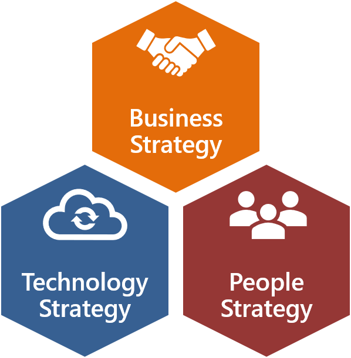

# Cloud Operating Model is now Microsoft Cloud Adoption Framework for Azure

In early 2018, Microsoft released the Cloud Operating Model (COM). The COM was a guide which helped customers understand the WHAT and the WHY of digital transformation. This helped customer get a sense of all the areas which needed to be addressed, business strategy, culture strategy and technology strategy. What was not included in the COM was the specific HOW TO’s, this left customer’s asking the question, “Where to from here”. To overcome this gap, partners and a number of Microsoft teams began building their own models and engagement approaches to extend the initial thinking. Whilst directionally accurate, these models lacked central alignment, common taxonomy, and common execution methodologies. Ultimately the disparate guidance led to broader customer confusion.

In October 2018, we began to take stock of all the models which had proliferated across the Microsoft community, we found roughly 60 different cloud adoption models. At this time, a cross-Microsoft team was established to bring everything together. This culminated in the creation of a single model, Microsoft Cloud Adoption Framework for Azure (CAF), with the intention of helping customers understand the WHAT, WHY and provide unified guidance on the HOW from Microsoft to help them accelerate their cloud journey. The ambition of this project is to create a One Microsoft approach to cloud adoption.

## Using Cloud Operating Model practices within the Cloud Adoption Framework

For a similar approach to COM, readers should begin with [Getting started with Cloud Migration](../getting-started/migrate.md), [Getting started with Cloud-enabled Innovation](../getting-started/innovate.md), or [Enabling adoption success](../getting-started/enable.md).

The guidance previously provided in COM is still relevant to the Cloud Adoption Framework. The experience is different, but the structure is of CAF is simply an expansion of that guidance. To transition from COM to CAF, an understanding of Scope and Structure is very important. The following two sections will describe that transition.

## Scope

COM established a scope that consisted of the following components:

* Business strategy: Establish clear business objectives and outcomes which are to be supported by cloud adoption
* Technology strategy: Align the overarching strategy to guide adoption of the cloud in alignment with the business strategy
* People strategy: Develop a strategy for training the people and evolving the culture to enable business success

The high level scope of Cloud Operating Model and Cloud Adoption Framework are very similar. Business, Culture, and Technology are reflected throughout the guidance and each methodology within CAF.

> [!NOTE]
> There are two significant points of clarity with CAF's scope. In CAF, business strategy goes beyond the documentation of cloud costs. In CAF, business strategy is about understanding motivations, desired outcomes, returns, and cloud costs to create actionable plans and clear business justifications. In CAF, people strategy goes beyond training to include approaches that create demonstrated cultural maturity. A few areas on the CAF roadmap include demonstrations of the impact of Agile management, devops integration, customer empathy/obsession, and lean product development approaches.

## Structure

COM included an infographic which outlined the various decisions and actions needed during a cloud adoption effort. That graphic provided a clear means of communicating next steps and dependent decisions.

CAF follows a very similar model. However, as the actions and decisions expanded into multiple decision trees, complexity quickly made a single graphical view appear overwhelming. To simplify the guidance and make it more immediately actionable, the single graphic has been decomposed into the following structures.

At the executive level, CAF has been simplified into the following three phases of adoption and two primary journeys.

The three phases of adoption are as follows:

* Plan: Develop the business plan to guide cloud adoption in alignment with desired business outcomes
* Ready: Prepare the people, organization, and technical environment for execution of the adoption plan
* Adopt: Technical strategy required to execute a specific adoption plan, in alignment with a specific adoption journey, to realize business outcomes

The three phases of cloud adoption have been mapped to two specific journeys:

* [Migrate](../getting-started/migrate.md): Move existing workloads to the cloud
* [Innovate](../getting-started/innovate.md): Modernize existing workloads and/or create new products/services

Additionally, a number of additional resources required to be successful in any kind of cloud adoption journey are included in a special landing page which focuses on [Enabling adoption success](../getting-started/enable.md).

## Next steps

To resume your journey where COM left off, choose one of the following cloud adoption journeys: [Getting started with Cloud Migration](../getting-started/migrate.md), [Getting started with Cloud-enabled Innovation](../getting-started/innovate.md), or [Enabling adoption success](../getting-started/enable.md).