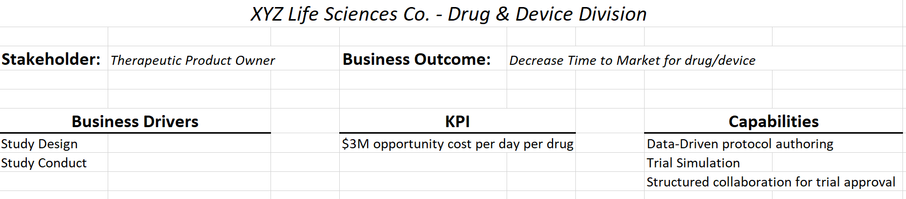
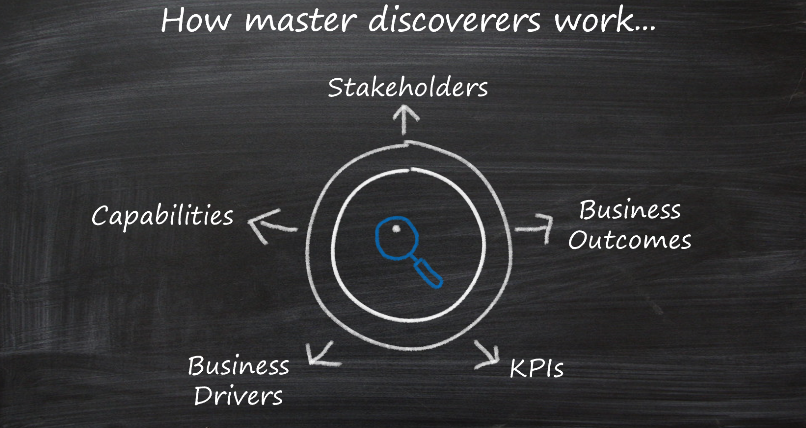

# How to use the business outcome template

As discussed in the [business outcomes overview](./index.md), it can be difficult to bridge the gap between business and technical conversations. This simple template is designed to help teams uniformly capture business outcomes to be used later in the development of customer transformation journey strategies.

Download the [business outcome template spreadsheet](https://archcenter.blob.core.windows.net/cdn/business-outcome-template.xlsx) to begin brainstorming and tracking business outcomes. Continue reading to learn how to use the template. Review the [business outcomes section](./index.md) for ideas on potential business outcomes that could come up in executive conversations.

<!-- markdownlint-disable MD026 -->

## Use the business outcome template

Introduced by Kate Johnson at the Microsoft Digital Transformation Academy, business outcomes focus on three topics:

- Aligning to stakeholders or business decision makers
- Understanding business drivers and objectives
- Mapping outcomes to specific solutions and technical capability

*Figure 1 - Business outcomes visualized as a house with stakeholders, over business outcomes, over technical capabilities.*

The business outcome template focuses on simplified conversations that can quickly engage stakeholders without getting too deep into the technical solution. By rapidly understanding and aligning the key performance indicators (KPIs) and business drivers that are important to stakeholders, your team can think about high-level approaches and transformations before diving into the implementation details.

An example can be found on the "Example Outcome" tab of the spreadsheet, as shown below. To track multiple outcomes, add them to the "Collective Outcomes" tab.

*Figure 2 - Example of a business outcome template.*

## Why is this template relevant?

Discovery is a fundamental tenet of enterprise architecture. If discovery is limited to technical discovery, the solution is likely to miss many opportunities to improve the business. Enterprise architects, solution architects, and other technically minded leaders can master the discovery process by using this template. In effective discovery processes, these leaders consider five key aspects of the business outcome before leading a transformation journey, as shown in the following image:

*Figure 3 - Five areas of focus in discovery: stakeholders, outcomes, drivers, KPIs, and capabilities.*

**Stakeholders**: Who in the organization is likely to see the greatest value in a specific business outcome? Who is most likely to support this transformation, especially when things get tough or time consuming? Who has the greatest stake in the success of this transformation? This person is a potential stakeholder.

**Business outcomes**: A business outcome is a concise, defined, and observable result or change in business performance, supported by a specific measure. How does the stakeholder want to change the business? How will the business be affected? What is the value of this transformation?

**Business drivers**: Business drivers capture the current challenge that's preventing the company from achieving desired outcomes. They can also capture new opportunities that the business can capitalize on with the right solution. How would you describe the current challenges or future state of the business? What business functions would be changing to meet the desired outcomes?

**KPIs**: How will this change be measured? How does the business know if they are successful? How frequently will this KPI be observed? Understanding each KPI helps enable incremental change and experimentation.

**Capabilities**: When you define any transformation journey, how will technical capabilities accelerate realization of the business outcome? What applications must be included in the transformation to achieve business objectives? How do various applications or workloads get prioritized to deliver on capabilities? How do parts of the solution need to be expanded or rearchitected to meet each of the outcomes? Can execution approaches (or timelines) be rearranged to prioritize high-impact business outcomes?

## Next steps

Learn about [aligning your technical efforts](../learning-metrics.md) to meaningful learning metrics.

> [!div class="nextstepaction"]
> [Align your technical efforts](../learning-metrics.md)
