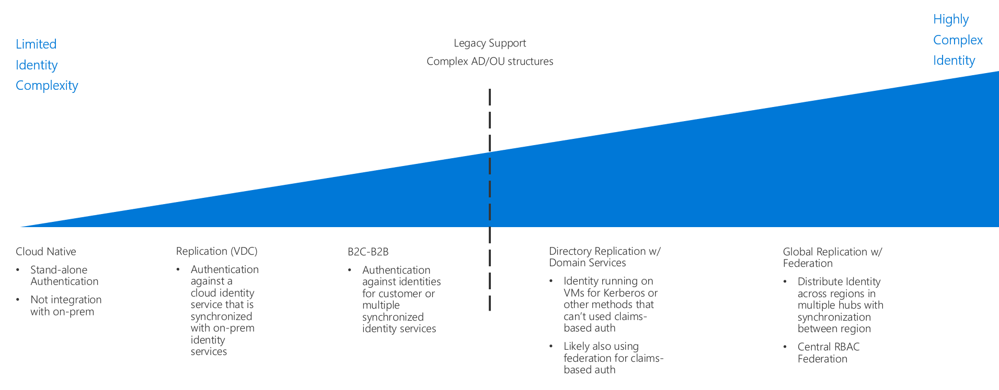

# Identity decision guide

In any environment, whether on-premises, hybrid, or cloud-only, IT needs to control which administrators, users, and groups have access to resources. Identity and access management (IAM) services enable you to manage access control in the cloud.

Jump to: [Determine Identity Integration Requirements](#determine-identity-integration-requirements) | [Cloud baseline](#cloud-baseline) | [Directory Synchronization](#directory-synchronization) | [Cloud hosted domain services](#cloud-hosted-domain-services) | [Active Directory Federation Services](#active-directory-federation-services) | [Learn more](#learn-more)

Several options are available for managing identity in a cloud environment. These options vary in cost and complexity. A key factor in structuring your cloud-based identity services is the level of integration required with your existing on-premises identity infrastructure.

In Azure, Azure Active Directory (Azure AD) provides a base level of access control and identity management for cloud resources. However, if your organization's on-premises Active Directory infrastructure has a complex forest structure or customized organizational units (OUs), your cloud-based workloads may require directory synchronization with Azure AD for a consistent set of identities, groups, and roles between your on-premises and cloud environments. Additionally, support for applications that depend on legacy authentication mechanisms may require the deployment of Active Directory Domain Services (AD DS) in the cloud.

Cloud-based identity management is an iterative process. You may start with a cloud-native solution with a small set of users and corresponding roles for an initial deployment. As your migration matures, you may need to integrate your identity solution using directory synchronization or add domains services as part of your cloud deployments. Revisit your identity strategy in every iteration of your migration process.

## Determine identity integration requirements

| Question | Cloud baseline | Directory synchronization | Cloud-hosted domain services | Active Directory Federation Services |
|------|------|------|------|------|
| Do you currently lack an on-premises directory service? | Yes | No | No | No |
| Do your workloads need to use a common set of users and groups between the cloud and on-premises environment? | No | Yes | No | No |
| Do your workloads depend on legacy authentication mechanisms, such as Kerberos or NTLM? | No | No | Yes | Yes |
| Do you require single sign-on across multiple identity providers? | No | No | No | Yes |

As part of planning your migration to Azure, you will need to determine how best to integrate your existing identity management and cloud identity services. The following are common integration scenarios.

### Cloud baseline

Azure AD is the native Identity and Access Management (IAM) system for granting users and groups access to management features on the Azure platform. If your organization lacks a significant on-premises identity solution, and you plan on migrating workloads to be compatible with cloud-based authentication mechanisms, you should begin developing your identity infrastructure using Azure AD as a base.

**Cloud baseline assumptions:** Using a purely cloud-native identity infrastructure assumes the following:

- Your cloud-based resources will not have dependencies on on-premises directory services or Active Directory servers, or workloads can be modified to remove those dependencies.
- The application or service workloads being migrated either support authentication mechanisms compatible with Azure AD or can be modified easily to support them. Azure AD relies on internet-ready authentication mechanisms such as SAML, OAuth, and OpenID Connect. Existing workloads that depend on legacy authentication methods using protocols such as Kerberos or NTLM may need to be refactored before migrating to the cloud using the cloud baseline pattern.

> [!TIP]
> Completely migrating your identity services to Azure AD eliminates the need to maintain your own identity infrastructure, significantly simplifying your IT management.
>
> However, Azure AD is not a full replacement for a traditional on-premises Active Directory infrastructure. Directory features such as legacy authentication methods, computer management, or group policy may not be available without deploying additional tools or services to the cloud.
>
> For scenarios where you need to integrate your on-premises identities or domain services with your cloud deployments, see the directory synchronization and cloud-hosted domain services patterns discussed below.

### Directory synchronization

For organizations with existing on-premises Active Directory infrastructure, directory synchronization is often the best solution for preserving existing user and access management while providing the required IAM capabilities for managing cloud resources. This process continuously replicates directory information between Azure AD and on-premises directory services, allowing common credentials for users and a consistent identity, role, and permission system across your entire organization.

Note: Organizations that have adopted Office 365 may have already implemented [directory synchronization](/office365/enterprise/set-up-directory-synchronization) between their on-premises Active Directory infrastructure and Azure Active Directory.

**Directory synchronization assumptions:** Using a synchronized identity solution assumes the following:

- You need to maintain a common set of user accounts and groups across your cloud and on-premises IT infrastructure.
- Your on-premises identity services support replication with Azure AD.

> [!TIP]
> Any cloud-based workloads that depend on legacy authentication mechanisms provided by on-premises Active Directory servers and that are not supported by Azure AD will still require either connectivity to on-premises domain services or virtual servers in the cloud environment providing these services. Using on-premises identity services also introduces dependencies on connectivity between the cloud and on-premises networks.

### Cloud-hosted domain services

If you have workloads that depend on claims-based authentication using legacy protocols such as Kerberos or NTLM, and those workloads cannot be refactored to accept modern authentication protocols such as SAML or OAuth and OpenID Connect, you may need to migrate some of your domain services to the cloud as part of your cloud deployment.

This pattern involves deploying virtual machines running Active Directory to your cloud-based virtual networks to provide Active Directory Domain Services (AD DS) for resources in the cloud. Any existing applications and services migrating to your cloud network should be able to use these cloud-hosted directory servers with minor modifications.

It's likely that your existing directories and domain services will continue to be used in your on-premises environment. In this scenario, it's recommended that you also use directory synchronization to provide a common set of users and roles in both the cloud and on-premises environments.

**Cloud-hosted domain services assumptions:** Performing a directory migration assumes the following:

- Your workloads depend on claims-based authentication using protocols like Kerberos or NTLM.
- Your workload virtual machines need to be domain-joined for management or application of Active Directory group policy purposes.

> [!TIP]
> While a directory migration coupled with cloud-hosted domain services provides great flexibility when migrating existing workloads, hosting virtual machines within your cloud virtual network to provide these services does increase the complexity of your IT management tasks. As your cloud migration experience matures, examine the long-term maintenance requirements of hosting these servers. Consider whether refactoring existing workloads for compatibility with cloud identity providers such as Azure Active Directory can reduce the need for these cloud-hosted servers.

### Active Directory Federation Services

Identity federation establishes trust relationships across multiple identity management systems to allow common authentication and authorization capabilities. You can then support single sign-on capabilities across multiple domains within your organization or identity systems managed by your customers or business partners.

Azure AD supports federation of on-premises Active Directory domains using [Active Directory Federation Services](/azure/active-directory/hybrid/how-to-connect-fed-whatis) (AD FS). See the reference architecture [Extend AD FS to Azure](../../../reference-architectures/identity/adfs.md) to see how this can be implemented in Azure.

## Learn more

For more information about identity services in Azure, see:

- [Azure AD](https://azure.microsoft.com/services/active-directory). Azure AD provides cloud-based identity services. It allows you to manage access to your Azure resources and control identity management, device registration, user provisioning, application access control, and data protection.
- [Azure AD Connect](/azure/active-directory/hybrid/whatis-hybrid-identity). The Azure AD Connect tool allows you to connect Azure AD instances with your existing identity management solutions, allowing synchronization of your existing directory in the cloud.
- [Role-based access control](/azure/role-based-access-control/overview) (RBAC). Azure AD provides RBAC to efficiently and securely manage access to resources in the management plane. Jobs and responsibilities are organized into roles, and users are assigned to these roles. RBAC allows you to control who has access to a resource along with which actions a user can perform on that resource.
- [Azure AD Privileged Identity Management](/azure/active-directory/privileged-identity-management/pim-configure) (PIM). PIM lowers the exposure time of resource access privileges and increases your visibility into their use through reports and alerts. It limits users to taking on their privileges "just in time" (JIT), or by assigning privileges for a shorter duration, after which privileges are revoked automatically.
- [Integrate on-premises Active Directory domains with Azure Active Directory](../../../reference-architectures/identity/azure-ad.md). This reference architecture provides an example of directory synchronization between on-premises Active Directory domains and Azure AD.
- [Extend Active Directory Domain Services (AD DS) to Azure.](../../../reference-architectures/identity/adds-extend-domain.md) This reference architecture provides an example of deploying AD DS servers to extend domain services to cloud-based resources.
- [Extend Active Directory Federation Services (AD FS) to Azure](../../../reference-architectures/identity/adfs.md). This reference architecture configures Active Directory Federation Services (AD FS) to perform federated authentication and authorization with your Azure AD directory.

## Next steps

Identity is just one of the core infrastructure components requiring architectural decisions during a cloud adoption process. Visit the [decision guides overview](../index.md) to learn about alternative patterns or models used when making design decisions for other types of infrastructure.

> [!div class="nextstepaction"]
> [Architectural decision guides](../index.md)
