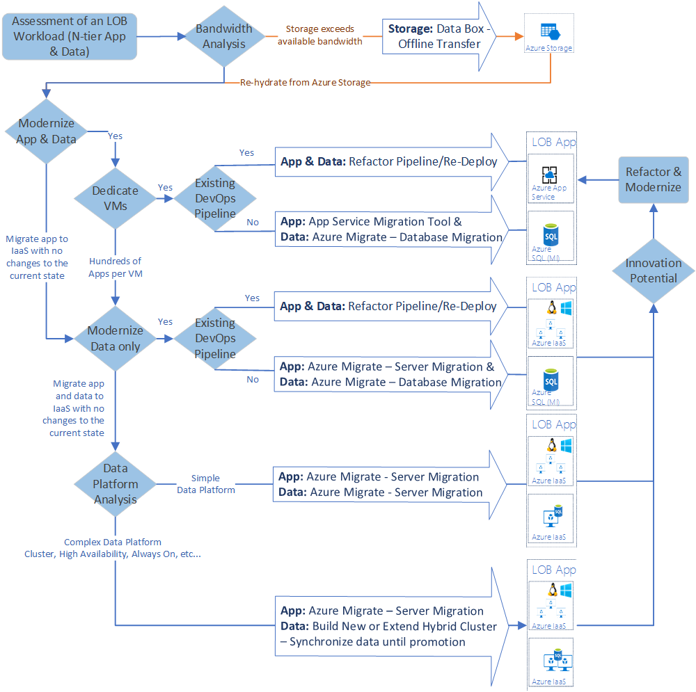

# Migration tools decision guide

The strategy and tools you use to migrate an application to Azure will largely depend on your business motivations, technology strategies, and timelines, as well as a deep understanding of the actual workload and assets (infrastructure, apps, and data) being migrated. The following decision tree serves as high-level guidance for selecting the best tools to use based on migration decisions. Treat this decision tree as a starting point.

The choice to migrate using platform as a service (PaaS) or infrastructure as a service (IaaS) technologies is driven by the balance between cost, time, existing technical debt, and long-term returns. IaaS is often the fastest path to the cloud with the least amount of required change to the workload. PaaS could require modifications to data structures or source code, but produces substantial long-term returns in the form of reduced operating costs and greater technical flexibility. In the following diagram, the term _modernize_ is used to reflect a decision to modernize an asset during migration and migrate the modernized asset to a PaaS platform.

## Key questions

Answering the following questions will allow you to make decisions based on the above tree.

- **Would modernization of the application platform during migration prove to be a wise investment of time, energy, and budget?** PaaS technologies such as Azure App Service or Azure Functions can increase deployment flexibility and reduce the complexity of managing virtual machines to host applications. However, applications may require refactoring before they can take advantage of these cloud-native capabilities, potentially adding significant time and cost to a migration effort. If your application can migrate to PaaS technologies with a minimum of modifications, it is likely a good candidate for modernization. If extensive refactoring would be required, a migration using IaaS-based virtual machines may be a better choice.
- **Would modernization of the data platform during migration prove to be a wise investment of time, energy, and budget?** As with application migration, Azure PaaS managed storage options, such as Azure SQL Database, Cosmos DB, and Azure Storage, offer significant management and flexibility benefits, but migrating to these services may require refactoring of existing data and the applications that use that data. Data platforms often require significantly less refactoring than the application platform would. As such, it is very common for the data platform to be modernized, even though the application platform remains the same. If your data can be migrated to a managed data service with minimal changes, it is a good candidate for modernization. Data that would require extensive time or cost to be refactored to use these PaaS services may be better migrated using IaaS-based virtual machines to better match existing hosting capabilities.
- **Is your application currently running on dedicated virtual machines or sharing hosting with other applications?** Application running on dedicated virtual machines may be more easily migrated to PaaS hosting options than applications running on shared servers.
- **Will your data migration exceed your network bandwidth?** Network capacity between your on-premises data sources and Azure can be a bottleneck on data migration. If the data you need to transfer faces bandwidth limitations that prevent efficient or timely migration, you may need to look into alternative or offline transfer mechanisms. The Cloud Adoption Framework's [article on migration replication](../../migrate/migration-considerations/migrate/replicate.md#replication-risks---physics-of-replication) discusses how replication limits can affect migration efforts. As part of your migration assessment, consult your IT teams to verify your local and WAN bandwidth is capable of handling your migration requirements. Also see the [expanded scope migration scenario for when storage requirements exceed network capacity during a migration](../../migrate/expanded-scope/network-capacity-exceeded.md#suggested-prerequisites).
- **Does your application make use of an existing DevOps pipeline?** In many cases Azure Pipelines can be easily refactored to deploy applications to cloud-based hosting environments.
- **Does your data have complex data storage requirements?** Production applications usually require data storage that is highly availability, offers always on functionality and similar service uptime and continuity features. Azure PaaS-based managed database options, such as Azure SQL Database, Azure Database for MySQL, and Azure Cosmos DB all offer 99.99% uptime service-level agreements. Conversely, IaaS-based SQL Server on Azure VM's offers single-instance service-level agreements of 99.95%. If your data cannot be modernized to use PaaS storage options, guaranteeing higher IaaS uptime will involve more complex data storage scenarios such as running SQL Server Always-on clusters and continuously syncing data between instances. This can involve significant hosting and maintenance costs, so balancing uptime requirements, modernization effort, and overall budgetary impact is important when considering your data migration options.

## Innovation and migration

In line with the Cloud Adoption Frameworks emphasis on [incremental migration](../../migrate/index.md#migration-implementation) efforts, an initial decision on migration strategy and tooling does not rule out future innovation efforts to update an application to take advantage of opportunities presented by the Azure platform. While an initial migration effort may primarily focus on rehosting using an IaaS approach, you should plan to revisit your cloud-hosted application portfolio regularly to investigate optimization opportunities.

## Learn more

- **[Cloud fundamentals: Overview of Azure compute options](/azure/architecture/guide/technology-choices/compute-overview)**. Provides information on the capabilities of Azure IaaS and PaaS compute options.
- **[Cloud fundamentals: Choose the right data store](/azure/architecture/guide/technology-choices/data-store-overview)**. Discusses PaaS storage options available on the Azure platform.
- **[Expanded scope migration: Storage requirements exceed network capacity during a migration effort](../../migrate/expanded-scope/network-capacity-exceeded.md)**. Discusses alternative data migration mechanisms for scenarios where data migration is hindered by available network bandwidth.
- **[SQL Database: Choose the right SQL Server option in Azure](/azure/sql-database/sql-database-paas-vs-sql-server-iaas#business-motivations-for-choosing-databases-managed-instances-or-sql-virtual-machines)**. Discussion of the options and business justifications for choosing to host your SQL Server workloads in a hosted infrastructure (IaaS) or a hosted service (PaaS) environment.
